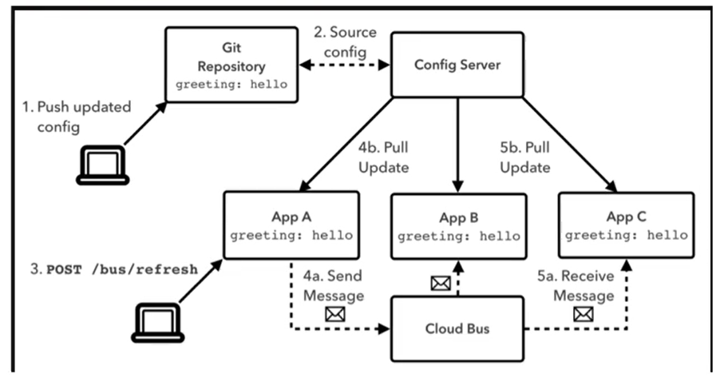
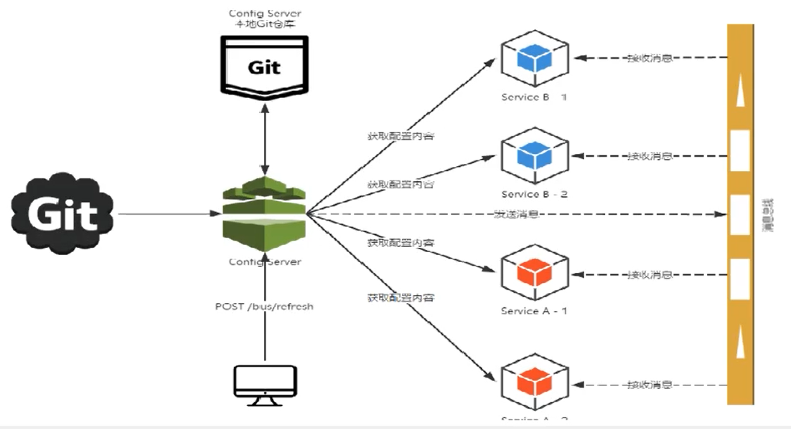
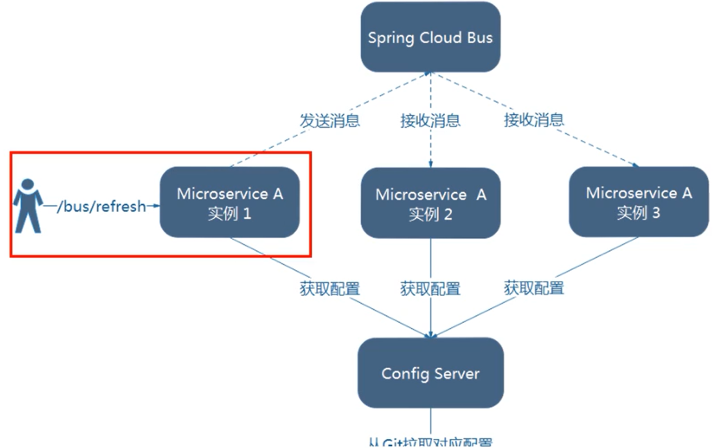
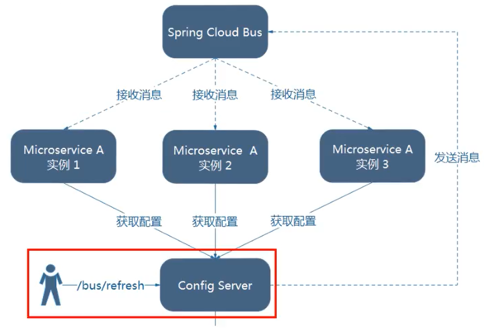
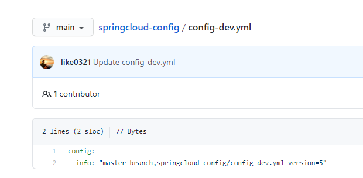
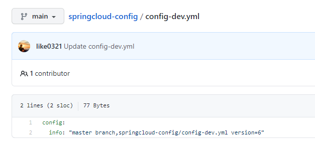
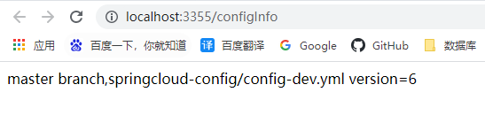
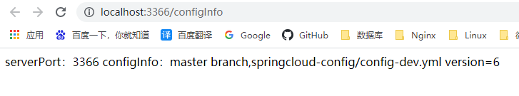
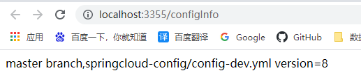
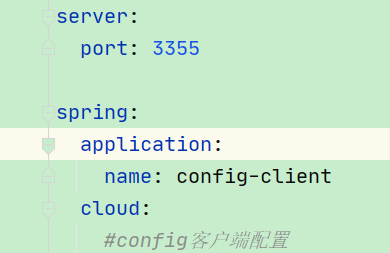

# 七、消息总线Bus

# 一、SpringCloud Bus:


## 1、概述


### 上—讲解的加深和扩充，一言以蔽之


<font style="color:#E8323C;">分布式自动刷新配置功能。</font>


### 是什么


Spring Cloud Bus 配合 Spring Cloud Config使用可以<font style="color:#E8323C;">实现配置的动态刷新。</font>





Spring Cloud Bus是用来将分布式系统的节点与轻量级消息系统链接起来的框架，它整合了Java的事件处理机制和消息中间件的功能。


Spring Clud Bus目前支持两种消息代理：<font style="color:#E8323C;">RabbitMQ和Kafka。</font>


### 能干嘛


Spring Cloud Bus能管理和传播分布式系统间的消息，就像一个分布式执行器，可用于广播状态更改、事件推送等，也可以当作微服务间的通信通道。





注意：这里两张图片,就代表两种广播方式


			图1:		**是Bus直接通知给其中一个客户端,由这个客户端开始蔓延,传播给其他所有客户端**


			图2:		**是通知给配置中心的服务端,有服务端广播给所有客户端**


### 为何被称为总线


#### 什么是总线


在微服务架构的系统中，通常会使用轻量级的消息代理来构建一个共用的消息主题，并让系统中所有微服务实例都连接上来。


由于该主题中产生的消息会被所有实例监听和消费，所以称它为消息总线。在总线上的各个实例，都可以方便地广播一些需要让其他连接在该主题上的实例都知道的消息。


#### 基本原理


ConfigClient实例都监听MQ中同一个topic(默认是Spring Cloud Bus)。


当一个服务刷新数据的时候，它会把这个信息放入到Topic中，这样其它监听同一Topic的服务就能得到通知，然后去更新自身的配置。


```java
就是通过消息队列达到广播的效果
  		我们要广播每个消息时,主要放到某个topic中,所有监听的节点都可以获取到
```


## 2、RabbitMQ环境配置


### 安装Erlang


### 安装RabbitMQ


### 进入RabbitMQ安装目录下的sbin目录


### 输入以下命令启动管理功能


默认情况下，是没有安装web端的客户端插件，需要安装才可以生效


```plain
rabbitmq-plugins enbale rabbitmq_management
```


### 访问地址查看是否安装成功


### 输入账号密码并登陆


## 3、SpringCloud Bus动态刷新全局广播


### 演示广播效果，增加复杂度


+  新建  
cloud-config-client-3366   之前只有一个配置中心客户端,这里再以3355为模板再制作一个3366 
+  pom 

```xml
<?xml version="1.0" encoding="UTF-8"?>
<project xmlns="http://maven.apache.org/POM/4.0.0"
         xmlns:xsi="http://www.w3.org/2001/XMLSchema-instance"
         xsi:schemaLocation="http://maven.apache.org/POM/4.0.0 http://maven.apache.org/xsd/maven-4.0.0.xsd">
    <parent>
        <artifactId>cloud2020</artifactId>
        <groupId>com.atguigu.springcloud</groupId>
        <version>1.0-SNAPSHOT</version>
    </parent>
    <modelVersion>4.0.0</modelVersion>

    <artifactId>cloud-config-client-3366</artifactId>

    <dependencies>
        <!-- 客户端的config 依赖 -->
        <dependency>
            <groupId>org.springframework.cloud</groupId>
            <artifactId>spring-cloud-starter-config</artifactId>
        </dependency>
        <!--图形化监控依赖-->
        <dependency>
            <groupId>org.springframework.boot</groupId>
            <artifactId>spring-boot-starter-web</artifactId>
        </dependency>
        <dependency>
            <groupId>org.springframework.boot</groupId>
            <artifactId>spring-boot-starter-actuator</artifactId>
        </dependency>
        <dependency>
            <groupId>org.springframework.boot</groupId>
            <artifactId>spring-boot-starter-data-redis</artifactId>
        </dependency>
        <dependency>
            <groupId>org.springframework.cloud</groupId>
            <artifactId>spring-cloud-starter-netflix-eureka-client</artifactId>
        </dependency>
        <dependency>
            <groupId>com.atguigu.springcloud</groupId>
            <artifactId>cloud-api-commons</artifactId>
            <version>${project.version}</version>
        </dependency>

        <dependency>
            <groupId>org.springframework.boot</groupId>
            <artifactId>spring-boot-devtools</artifactId>
            <scope>runtime</scope>
            <optional>true</optional>
        </dependency>

        <dependency>
            <groupId>org.projectlombok</groupId>
            <artifactId>lombok</artifactId>
            <optional>true</optional>
        </dependency>
        <dependency>
            <groupId>org.springframework.boot</groupId>
            <artifactId>spring-boot-starter-test</artifactId>
            <scope>test</scope>
        </dependency>
    </dependencies>

</project>
```

 

+  yml 

```yaml
server:
  port: 3366

spring:
  application:
    name: config-client
  cloud:
    #config客户端配置
    config:
      label: main # 哪个分支
      name: config  # 什么名字
      profile: dev  # 名字-xxx  什么环境
      # 上面的进行拼接后为: http://localhost:3344/main/config-dev.yaml
      uri: http://localhost:3344  # 配置中心地址

# 服务注册到eureka地址
eureka:
  client:
    service-url:
      #defaultZone: http://eureka7001.com:7001/eureka,http://eureka7002.com:7002/eureka
      defaultZone: http://eureka7001.com:7001/eureka

# 暴漏监控端点
management:
  endpoints:
    web:
      exposure:
        include: "*"
```

 

+  主启动 

```java
package com.atguigu.springcloud;

import org.springframework.boot.SpringApplication;
import org.springframework.boot.autoconfigure.SpringBootApplication;
import org.springframework.cloud.netflix.eureka.EnableEurekaClient;

/**
 * @author: like
 * @Date: 2021/07/26 8:12
 */
@SpringBootApplication
@EnableEurekaClient
public class ConfigClientMain3366 {

    public static void main(String[] args) {
        SpringApplication.run(ConfigClientMain3366.class, args);
    }

}
```

 

+  controller 

```java
package com.atguigu.springcloud.controller;

import org.springframework.beans.factory.annotation.Value;
import org.springframework.cloud.context.config.annotation.RefreshScope;
import org.springframework.web.bind.annotation.GetMapping;
import org.springframework.web.bind.annotation.RestController;

@RestController
@RefreshScope
public class ConfigClientController {

    @Value("${server.port}")
    private String serverPort;

    /**
     * 这里取的值是从github上取回来的
     */
    @Value("${config.info}")
    private String configInfo;

    @GetMapping("/configInfo")
    public String getConfigInfo() {
        return "serverPort：" + serverPort + "\t\n\n configInfo：" + configInfo;
    }

}
```

 


### 设计思想


#### Bus广播有两种方式:


1.  利用消息总线触发一个客户端/bus/refresh，而刷新所有客户端的配置  
 
2.  利用消息总线触发一个服务端ConfigServer的/bus/refresh端点，而刷新所有客户端的配置 





**这两种方式,第二种更合适,因为:**


第一种的缺点:


打破了微服务的职责单一性，因为微服务本身是业务模块，它本不应该承担配置刷新的职责


破坏了微服务各节点的对等性。（有一个客户端需要额外的承担刷新职责，而其他客户端却只有业务职责）


有一定的局限性。例如，在微服务在迁移时，它的网络地址常常会发生变化，此时如果想要做到自动刷新，那就会增加更多的修改


**配置第二种方式:**


### cloud-config-center-3344服务端


配置中心**服务端**添加消息总线支持


+  pom 

```xml
<!--添加消息总线RabbitMQ支持-->
<dependency>
    <groupId>org.springframework.cloud</groupId>
    <artifactId>spring-cloud-starter-bus-amqp</artifactId>
</dependency>
```

 

+  yml 

```yaml
server:
  port: 3344

spring:
  application:
    name: cloud-config-center #注册进Eureka服务器的微服务名
  cloud:
    config:
      server:
        git:
          # Github上面git仓库的地址
          uri: https://github.com/like0321/springcloud-config.git
          # 搜索的目录
          search-paths:
            - springcloud-config
#          force-pull: true
#          username:
#          password:
      # 读取分支
      label: main
  # rabbitmq相关配置
  rabbitmq:
    host: 118.25.37.107
    port: 5672
    username: admin
    password: 123456

eureka:
  client:
    service-url:
      #defaultZone: http://eureka7001.com:7001/eureka,http://eureka7002.com:7002/eureka
      defaultZone: http://eureka7001.com:7001/eureka


## rabbitmq相关配置，暴露bus刷新配置的端点
management:
  endpoints: #暴露bus刷新配置的端点
    web:
      exposure:
        include: 'bus-refresh'
```

 


### cloud-config-client-3355**客户端**


**客户端**添加消息总线支持


+ pom


```xml
<!--添加消息总线RabbitMQ支持-->
<dependency>
    <groupId>org.springframework.cloud</groupId>
    <artifactId>spring-cloud-starter-bus-amqp</artifactId>
</dependency>
```


+  yml  
注意配置文件的名字,要改为bootstrap.yml 


```yaml
server:
  port: 3355

spring:
  application:
    name: config-client
  cloud:
    #config客户端配置
    config:
      label: main # 哪个分支
      name: config  # 什么名字
      profile: dev  # 名字-xxx  什么环境
      # 上面的进行拼接后为: http://localhost:3344/main/config-dev.yaml
      uri: http://localhost:3344  # 配置中心地址
  # rabbitmq相关配置
  rabbitmq:
    host: 118.25.37.107
    port: 5672
    username: admin
    password: 123456

eureka:
  client:
    service-url:
      #defaultZone: http://eureka7001.com:7001/eureka,http://eureka7002.com:7002/eureka
      defaultZone: http://eureka7001.com:7001/eureka

# 暴漏监控端点
management:
  endpoints:
    web:
      exposure:
        include: "*"
```


### 修改3366(也是配置中心的客户端)


修改与3355是一模一样的


### 测试





+  运维工程师 
    -  修改GitHub上配置文件增加版本号  
 
    -  发送post请求  
此时只需要刷新3344,即可让3355,3366动态获取最新的配置文件 

```plain
curl -X POST "http://localhost:3344/actuator/bus-refresh"
```

 

+  配置中心 

```plain
http://config-3344.com:3344/config-dev.yml
```

 

+  客户端  
  
 


基本原理：


ConfigClient实例都监听MQ中同一个topic(默认是Spring Cloud Bus)。


当一个服务刷新数据的时候，它会把这个信息放入到Topic中，这样其它监听同一Topic的服务就能得到通知，然后去更新自身的配置。


**所有客户端都监听了一个rabbitMq的topic,我们将信息放入这个topic,所有客户端都可以送到,从而实时更新**


## 4、SpringCloud Bus动态刷新定点通知


就是只通知部分服务,比如只通知3355,不通知3366


```plain
http://localhost:配置中心的端口号/actuator/bus-refresh/{destination}
```


/bus/refresh请求不再发送到具体的服务实例上，而是发给config server 并 通过destination参数类指定需要更新配置的服务或实例


**只通知3355**


```plain
curl -X POST "http://localhost:3344/actuator/bus-refresh/config-client:3355"
```





**可以看到,实际上就是通过****微服务的名称+端口号****进行指定**





> 更新: 2022-08-22 10:05:00  
> 原文: <https://www.yuque.com/like321/xgwgyr/sdzgwb>