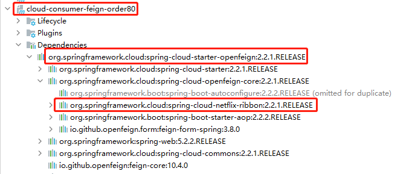

# 三、服务调用

## 一、Ribbon<font style="color:#E8323C;">负载均衡</font>服务调用:


### 1、概述


SpringCloud Ribbon 是基于Netflix Ribbon实现的一套客户端，负载均衡的工具。


简单的说，Ribbon是Netflix发布的开源项目，主要功能是提供**客户端的软件负载均衡算法和服务调用**。


Ribbon客户端组件提供一系列完善的配置项如连接超时，重试等。简单的说，就是配置文件中列出Load Banlancer (简称LB) 后面所有的机器，Ribbon会自动的帮助你基于某种规则（如简单轮询，随机连接等）去连接这些机器。


我们很容易使用Ribbon实现自定义的负载均衡算法。


官网： [https://github.com/Netflix/ribbon/wiki/Getting-Started](https://github.com/Netflix/ribbon/wiki/Getting-Started)


Ribbon已经进入维护模式！未来的替换方案：Load Banlancer


#### Ribbon能作什么


LB （负载均衡）Load balance 是什么


简单的说就是将用户的请求平摊的分配到多个服务上，从而达到系统的HA（高可用）


常见的负载均衡有软件  Nginx  LVS  硬件F5等


**Ribbon本地负载均衡客户端   VS   Nginx 服务端负载均衡区别**


+  Nginx是服务器负载均衡，客户端所有请求都会交给Nginx，然后由Nginx实现转发请求，即负载均衡是由服务端实现的。 
+  Ribbon 本地负载均衡，在调用微服务接口时候，会在注册中心上获取注册信息服务列表之后缓存到JVM本地，从而在本地实现RPC远程服务调用技术 


##### 1.2 集中式 LB


+ 即在服务的消费方和提供方之间使用独立的LB设施（可以是硬件，如F5，也可以是软件，如Nginx），由该设施负责把访问请求通过某种策略转发至服务的提供方。


##### 1.3 进程内 LB


+ 将LB逻辑集成到消费方，消费方从服务注册中心获知有哪些地址可用，然后自己再从这些地址中选择出一个合适的服务器。
+ Ribbon就属于进程内LB, 它只是一个类库，集成于消费方进程，消费方通过它来获取到服务提供方的地址。


**Ribbon就是负载均衡+RestTemplate**


### 2、Ribbon负载均衡演示


#### 架构说明


**总结：Ribbon其实就是一个****<font style="color:#E8323C;">软负载均衡的客户端组件</font>****。**


> 它可以和其他所需请求的客户端结合使用，和eureka结合只是其中一个实例
>


Ribbon在工作时分为两步：


+ 第一步先选择EurekaServer，它优先选择在同一个区域内负载较少的server
+ 第二部再根据用户指定的策略，再从server取到的服务注册列表中选择一个地址。


> 其中Ribbon提供了多种策略：比如 **轮询，随机和根据响应时间加权。**
>


#### POM


```xml
<dependency>
    <groupId>org.springframework.cloud</groupId>
    <artifactId>spring-cloud-starter-netflix-ribbon</artifactId>
</dependency>
```


之前写样例时候没有引入spring-cloud-starter-ribbon也可以使用ribbon


猜测spring-cloud-starter-netflix-eureka-client自带了spring-cloud-starter-ribbon引用，


证明如下：可以看到spring-cloud-starter-netflix-eureka-client确实引入了Ribbon


#### 二说`RestTemplate`


官网： [https://docs.spring.io/spring-framework/docs/5.2.2.RELEASE/javadoc-api/org/springframework/web/client/RestTemplate.html](https://docs.spring.io/spring-framework/docs/5.2.2.RELEASE/javadoc-api/org/springframework/web/client/RestTemplate.html)


##### getForObject()  和 getForEntity()


> `getForObject()` // 返回对象为响应体中数据转化成的对象，基本上可以理解为JSON
>
>  
>
> `getForEntity()`  // 返回对象为ResponseEntity对象，包含了响应中的一些重要信息，比如响应头，响应状态码，响应体等。
>


```java
    @GetMapping("/consumer/payment/getForObject/{id}")
    public CommonResult<Payment> getPaymentForObject(@PathVariable("id") Long id) {
        // 返回对象为响应体中数据转化成的对象，基本上可以理解为JSON
        return restTemplate.getForObject(PAYMENT_URL + "/payment/get/" + id, CommonResult.class);
    }


    @GetMapping("/consumer/payment/getForEntity/{id}")
    public CommonResult<Payment> getPaymentForEntity(@PathVariable("id") Long id) {

        // 返回对象为ResponseEntity对象，包含了响应中的一些重要信息，比如响应头，响应状态码，响应体等。
        ResponseEntity<CommonResult> responseEntity = restTemplate.getForEntity(PAYMENT_URL + "/payment/get/" + id, CommonResult.class);

        // 判断是否成功
        if (responseEntity.getStatusCode().is2xxSuccessful()) {
            log.info(responseEntity.getStatusCode()+"\t"+responseEntity.getHeaders());
            return responseEntity.getBody();
        } else {
            return new CommonResult(444, "操作失败");
        }
    }
```


##### postForObject()  和 postForEntity()


```java
    @PostMapping("/consumer/payment/createForObject")
    public CommonResult<Payment> createForObject(@RequestBody Payment payment) {
        // postForObject() 可以直接return回去
        return restTemplate.postForObject(PAYMENT_URL + "/payment/create", payment, CommonResult.class);
    }


    @PostMapping("/consumer/payment/createForEntity")
    public CommonResult<Payment> createForEntity(@RequestBody Payment payment) {
        // postForEntity() 需要调用getBody() 再返回
        return restTemplate.postForEntity(PAYMENT_URL + "/payment/create", payment, CommonResult.class).getBody();
    }
```


### 3、Ribbon核心组件IRule


IRule:根据特定算法从服务列表中选取一个要访问的服务


#### Ribbon默认自带的负载规则


+  `com.netflix.loadbalancer.RoundRobinRule：` 
    - 轮询


+  `com.netflix.loadbalancer.RandomRule：` 
    - 随机


+  `com.netflix.loadbalancer.RetryRule` 
    - 先按照RoundRobinRule的策略获取服务，如果获取服务失败则在指定时间内会进行重试


+  `WeightedResponseTimeRule` 
    - 对RoundRobinRule的扩展，响应速度越快的实例选择权重越大，越容易被选择


+  `BestAvailableRule` 
    - 会先过滤掉由于多次访问故障而处于断路器跳闸状态的服务，然后选择一个并发量最小的服务


+  `AvailabilityFilteringRule` 
    - 先过滤掉故障实例，再选择并发较小的实例


+  `ZoneAvoidanceRule` 
    - 默认规则，复合判断server所在区域的性能和server的可用性选择服务器


#### Ribbon负载规则替换


##### 修改cloud-consumer-order80模块


##### 额外创建一个包


> **注意这个 自定义配置类不能放在@ComponentScan所扫描的当前包下以及子包**
>
>  
>
> **否则我们自定义的这个配置类就会被所有的Ribbon客户端所共享，达不到特殊化定制的目的了。**
>


**也就是不能放在主启动类所在的包及子包下**


##### 创建配置类,指定负载均衡算法


```java
package com.atguigu.myrule;

import com.netflix.loadbalancer.IRule;
import com.netflix.loadbalancer.RandomRule;
import org.springframework.context.annotation.Bean;
import org.springframework.context.annotation.Configuration;

/**
 * @author: like
 * @Date: 2021/07/09 23:58
 */
@Configuration
public class MySelfRule {

    @Bean
    public IRule myRule() {
        return new RandomRule();//定义为随机
    }

}
```


##### 在主启动类上加一个注解


**表示,访问CLOUD_pAYMENT_SERVICE的服务时,使用我们自定义的负载均衡算法**


```java
package com.atguigu.springcloud;

import com.atguigu.myrule.MySelfRule;
import org.springframework.boot.SpringApplication;
import org.springframework.boot.autoconfigure.SpringBootApplication;
import org.springframework.cloud.netflix.eureka.EnableEurekaClient;
import org.springframework.cloud.netflix.ribbon.RibbonClient;

/**
 * @author: like
 * @Date: 2021/07/07 21:28
 */
@SpringBootApplication
@EnableEurekaClient
// name 写要负载均衡访问的provider的微服务名字
@RibbonClient(name = "CLOUD-PAYMENT-SERVICE", configuration = MySelfRule.class)
public class OrderMain80 {

    public static void main(String[] args) {
        SpringApplication.run(OrderMain80.class, args);
    }

}
```


### 4、Ribbon负载均衡算法:


#### ribbon默认负载轮询算法原理


负载均衡算法：**<font style="color:#E8323C;">rest接口第几次请求数 % 服务器集群总数量 = 实际调用服务器位置下标</font>**，每次服务重启后rest接口计数从1开始。


```plain
List<ServiceInstance> instances = doscoveryClient.getInstances("cloud-payment-service");
List[0] instances = 127.0.0.1:8002;
List[1] instances = 127.0.0.1:8001;

8001 + 8002 组合为集群，他们共计2台机器，集群总数为2，按照轮询算法原理：

当总请求数为1时：1 % 2 = 1，对应下标为 1，则获得服务地址为 127.0.0.1：8001
当总请求数为2时：2 % 2 = 0，对应下标为 0，则获得服务地址为 127.0.0.1：8002
当总请求数为3时：3 % 2 = 1，对应下标为 1，则获得服务地址为 127.0.0.1：8001
当总请求数为4时：4 % 2 = 0，对应下标为 0，则获得服务地址为 127.0.0.1：8002
如此类推
```


#### 自定义负载均衡算法:


##### 7001/7002集群启动


##### 8001/8002微服务改造


pay模块(8001,8002),的controller方法添加一个方法,返回当前节点端口


```java
@Value("${server.port}")
private String serverPort;


@RequestMapping("/payment/lb")
public String getPaymentLB() {
    return serverPort;
}
```


##### 80订单微服务改造


1. 80消费者RestTemplate去掉`@LoadBalanced`


```java
package com.atguigu.springcloud.config;

import org.springframework.cloud.client.loadbalancer.LoadBalanced;
import org.springframework.context.annotation.Bean;
import org.springframework.context.annotation.Configuration;
import org.springframework.web.client.RestTemplate;

/**
 * @author: like
 * @Date: 2021/07/07 21:41
 */
@Configuration
public class ApplicationConfig {

    @Bean
//    @LoadBalanced // 使用@LoadBalanced注解赋予RestTemplate负载均衡的能力
    public RestTemplate getRestTemplate(){
        return new RestTemplate();
    }

}
```


2. 自定义接口


```java
package com.atguigu.springcloud.lb;

import org.springframework.cloud.client.ServiceInstance;

import java.util.List;

/**
 * @author: like
 * @Date: 2021/07/11 20:03
 */
public interface LoadBalancer {

    //根据所有服务，选择一个本次调用的
    ServiceInstance instances(List<ServiceInstance> serviceInstances);

}
```


3. 接口实现类


```java
package com.atguigu.springcloud.lb;

import org.springframework.cloud.client.ServiceInstance;
import org.springframework.stereotype.Component;

import java.util.List;
import java.util.concurrent.atomic.AtomicInteger;

/**
 * @author: like
 * @Date: 2021/07/11 20:05
 */
@Component
public class MyLB implements LoadBalancer {

    private AtomicInteger atomicInteger = new AtomicInteger(0);

    //获取下一个要调用的服务的id
    public final int getAndIncrement() {
        int current;
        int next;

        do {
            current = this.atomicInteger.get();
            next = current >= 2147483647 ? 0 : current + 1;
            //调用cas，进行自旋锁      第一个参数是期望值，第二个参数是修改值
        } while (!this.atomicInteger.compareAndSet(current, next));

        return next;
    }

    @Override
    public ServiceInstance instances(List<ServiceInstance> serviceInstances) {
        //拿到id，进行取余得到真正要调用服务的下标
        int index = getAndIncrement() % serviceInstances.size();

        return serviceInstances.get(index);
    }
}
```


4. 修改controller:


```java
@RestController
@Slf4j
public class OrderController {

    @Autowired
    private RestTemplate restTemplate;

    @Autowired
    private LoadBalancer loadBalancer;

    @Autowired
    private DiscoveryClient discoveryClient;

    @GetMapping("/consumer/payment/lb")
    public String getPaymentLB() {
        List<ServiceInstance> instances = discoveryClient.getInstances("CLOUD-PAYMENT-SERVICE");
        if (instances == null || instances.size() <= 0) {
            return null;
        }

        ServiceInstance serviceInstance = loadBalancer.instances(instances);
        URI uri = serviceInstance.getUri();
        return restTemplate.getForObject(uri + "/payment/lb", String.class);
    }
}
```


##### 启动服务,测试即可


[http://localhost/consumer/payment/lb](http://localhost/consumer/payment/lb)


## 二、OpenFeign服务远程调用


### 1、概述


#### OpenFeign是什么


[https://github.com/spring-cloud/spring-cloud-openfeign](https://github.com/spring-cloud/spring-cloud-openfeign)


Feign是一个声明式WebService客户端，使用Feign能让编写Web Service客户端更加简单


他的使用方法是**定义一个服务接口然后在上面添加注解**。


Feign也支持可插拔式的编码器和解码器。Spring Cloud 对Feign进行了封装，使其支持了SpringMVC 标准注解和HttpMessageConverters。Feign可以与Eureka和Ribbon组合使用以支持负载均衡。


#### Feign作用


Feign旨在使编写Java Http客户端变得更加容易。


> 个人理解：<font style="color:#E8323C;">声明式远程方法调用</font>
>
>  
>
> **<font style="color:#E8323C;">是一个声明式的web客户端,只需要创建一个接口,添加注解即可完成微服务之间的调用</font>**
>


前面在使用Ribbon + RestTemplate时，利用RestTemplate 对http请求的封装处理，形成一套模板化的调用方法。


但是在实际开发中，由于对服务依赖的调用可能不止一处，往往一个接口会被多出调用，所以通常都会针对每个微服务自行封装一些客户端类来包装这些依赖服务的调用。


所以，Feign在此基础上做了进一步的封装，由它来帮助我们定义和实现依赖服务接口的定义。


在Feign的实现下，我们只需要创建一个接口并使用注解的方式来配置它（以前是Dao接口上面标注Mapper注解，现在是一个微服务接口上面标注一个Feign注解即可）, 即可完成对服务提供方的接口绑定，简化了使用Spring Cloud Ribbon时，自动封装服务调用客户端的开发量。


#### Feign集成了Ribbon


利用Ribbon维护了 [payment]的服务列表信息，并且通过轮询实现了客户端的负载均衡。


而与Ribbon不同的是， 通过Feign只需要定义服务绑定接口且以声明式的方法，简单而优雅的实现了服务调用。


就是A要调用B,Feign就是在A中创建一个一模一样的B对外提供服务的的接口,我们调用这个接口,就可以服务到B


#### Feign与OpenFeign区别


### 2、使用OpenFeign


```plain
之前的服务间调用,我们使用的是ribbon+RestTemplate

现在改为使用Feign
```


#### 接口加注解


微服务调用接口+[@FeignClient ](/FeignClient ) 


#### 新建一个order项目,用于feign测试


名字cloud-consumer-feign-order80


Feign 是使用在消费端！


#### pom文件


```xml
<?xml version="1.0" encoding="UTF-8"?>
<project xmlns="http://maven.apache.org/POM/4.0.0"
         xmlns:xsi="http://www.w3.org/2001/XMLSchema-instance"
         xsi:schemaLocation="http://maven.apache.org/POM/4.0.0 http://maven.apache.org/xsd/maven-4.0.0.xsd">
    <parent>
        <artifactId>cloud2020</artifactId>
        <groupId>com.atguigu.springcloud</groupId>
        <version>1.0-SNAPSHOT</version>
    </parent>
    <modelVersion>4.0.0</modelVersion>

    <artifactId>cloud-consumer-feign-order80</artifactId>


    <dependencies>
        <!--openfeign-->
        <dependency>
            <groupId>org.springframework.cloud</groupId>
            <artifactId>spring-cloud-starter-openfeign</artifactId>
        </dependency>

        <!--Eureka client-->
        <dependency>
            <groupId>org.springframework.cloud</groupId>
            <artifactId>spring-cloud-starter-netflix-eureka-client</artifactId>
        </dependency>

        <!--引入自己定义的api通用包-->
        <dependency>
            <groupId>com.atguigu.springcloud</groupId>
            <artifactId>cloud-api-commons</artifactId>
            <version>${project.version}</version>
        </dependency>

        <dependency>
            <groupId>org.springframework.boot</groupId>
            <artifactId>spring-boot-starter-web</artifactId>
        </dependency>
        <dependency>
            <groupId>org.springframework.boot</groupId>
            <artifactId>spring-boot-starter-actuator</artifactId>
        </dependency>
        <dependency>
            <groupId>org.springframework.boot</groupId>
            <artifactId>spring-boot-devtools</artifactId>
            <scope>runtime</scope>
            <optional>true</optional>
        </dependency>
        <dependency>
            <groupId>org.projectlombok</groupId>
            <artifactId>lombok</artifactId>
            <optional>true</optional>
        </dependency>
        <dependency>
            <groupId>org.springframework.boot</groupId>
            <artifactId>spring-boot-starter-test</artifactId>
            <scope>test</scope>
        </dependency>

    </dependencies>


</project>
```


#### 配置文件


```yaml
server:
  port: 80

eureka:
  client:
    # 表示是否将自己注册进EurekaServer默认为true
    register-with-eureka: false
    # 是否从EurekaServer抓取已有的注册信息，默认为true。单节点无所谓，集群必须设置为 true，才能配合ribbon使用负载均衡
    fetch-registry: true
    service-url:
      defaultZone: http://eureka7001.com:7001/eureka,http://eureka7002.com:7002/eureka

spring:
  application:
    name: cloud-order-service
```


#### 主启动类


主启动类上添加 `@EableFeignClients`注解


```java
package com.atguigu.springcloud;

import org.springframework.boot.SpringApplication;
import org.springframework.boot.autoconfigure.SpringBootApplication;
import org.springframework.cloud.openfeign.EnableFeignClients;

/**
 * @author: like
 * @Date: 2021/07/11 22:02
 */
@SpringBootApplication
@EnableFeignClients
public class OrderFeignMain80 {

    public static void main(String[] args) {
        SpringApplication.run(OrderFeignMain80.class, args);
    }

}
```


#### 业务类


> 声明一个远程调用服务接口，这个接口可以在 commons 模块中
>
>  
>
> 如果是在一个别的模块中，那么这个远程调用服务接口所在的包结构，必须要能被Springboot扫描到
>


##### 声明远程调用服务接口


```plain
@FeignClient("provider微服务名字")
```


注意：


+  这里声明的方法签名，必须和provider服务中的controller中方法的签名一致 
+  如果需要传递参数，那么`@RequestParam` 和`@RequestBody` `@PathVariable` 不能省 必加 

```java
@Component
@FeignClient(value = "CLOUD-PAYMENT-SERVICE")
public interface PaymentFeignService {

    @GetMapping(value = "/payment/get/{id}")
    public CommonResult<Payment> getPaymentById(@PathVariable("id") Long id);

}
```

 


##### consumer的controller


```java
@RestController
public class OrderFeignController {

    @Resource
    private PaymentFeignService paymentFeignService;

    @GetMapping("/consumer/payment/get/{id}")
    public CommonResult<Payment> getPaymentById(@PathVariable("id") Long id) {
        return paymentFeignService.getPaymentById(id);
    }

}
```


##### provider的controller


> 这里声明的方法 要和 远程调用服务接口中的 方法签名保持一致
>


```java
@Slf4j
@RestController
public class PaymentController {

    @GetMapping(value = "/payment/get/{id}")
    public CommonResult<Payment> getPaymentById(@PathVariable("id") Long id) {

        Payment payment = paymentService.getPaymentById(id);
        log.info("查询结果：" + payment);

        if (payment != null) {
            return new CommonResult<Payment>(200, "查询成功，serverPort：" + serverPort, payment);
        } else {
            return new CommonResult<Payment>(444, "查询失败");
        }

    }

}
```


#### 测试:


启动两个erueka(7001,7002)


启动两个pay(8001,8002)


启动当前的order模块


[http://localhost/consumer/payment/get/1](http://localhost/consumer/payment/get/1)


**Feign默认使用ribbon实现负载均衡**


### 3、OpenFeign超时控制:


OpenFeign默认等待时间是1秒,超过1秒,直接报错


#### 超时设置，故意设置超时演示出错情况


+ 服务提供方8001故意写暂停程序


```java
@GetMapping("/payment/feign/timeout")
public String paymentFeignTimeout() {
    try {
        TimeUnit.SECONDS.sleep(3);
    } catch (InterruptedException e) {
        e.printStackTrace();
    }
    return serverPort;
}
```


+ 远程调用服务接口


```java
@Component
@FeignClient(value = "CLOUD-PAYMENT-SERVICE")
public interface PaymentFeignService {

    @GetMapping("/payment/feign/timeout")
    public String paymentFeignTimeout();
}
```


+ 消费方接口


```java
@RestController
public class OrderFeignController {

    @Resource
    private PaymentFeignService paymentFeignService;

    @GetMapping("/consumer/payment/feign/timeout")
    public String paymentFeignTimeout() {
        //openfeign-ribbon，客户端一般默认等待1秒钟
        return paymentFeignService.paymentFeignTimeout();
    }

}
```


+  页面报错  
 


#### 超时报错


+  OpenFeign默认等待时间为1秒钟，超过后报错  
默认Feign客户端只等待一秒钟，但是服务段处理需要超过1秒钟，导致Feign客户端不想等待了，直接返回报错。  
为了避免这种请况，有时候我们需要设置Feign客户端的超时控制 


> Feign 默认是支持Ribbon ，Feign依赖里自己带了Ribbon
>





**因为OpenFeign的底层是ribbon进行负载均衡,所以它的超时时间是由ribbon控制**


+ 解决问题  在消费端的配置文件中配置


> 这里的ReadTimeout 和 ConnectTimeout 没有代码提示，但可以使用
>


```yaml
# 设置feign 客户端超时时间(OpenFeign默认支持ribbon)
ribbon:
  # 设置建立连接后从服务器读取到可用资源所用的时间
  ReadTimeout: 5000
  # 设置建立连接所用的时间,适用于网络状况正常的情况下,两端连接所用的时间
  ConnectTimeout: 5000
```


### 4、OpenFeign日志打印:


Feign提供了日志打印功能，我们可以通过配置来调整日志级别，从而了解Feign中Http请求的细节。


说白了就是：对Feign接口的调用情况进行监控和输出。


#### 日志级别
| NONE | 默认的，不显示任何日志 |
| --- | --- |
| BASIC | 仅记录请求方法、URL、响应状态码及执行时间 |
| HEADERS | 除了BASIC中定义的信息之外，还有请求和响应的头信息 |
| FULL | 除了HEADERS中定义的信息外，还有请求和响应的正文及元数据。 |


#### 配置日志


> 配置在消费端
>


1. 配置日志bean  实现在配置类中添加OpenFeign的日志类


```java
package com.atguigu.springcloud.config;

import feign.Logger;
import org.springframework.context.annotation.Bean;
import org.springframework.context.annotation.Configuration;

/**
 * @author: like
 * @Date: 2021/07/11 23:13
 */
@Configuration
public class FeignConfig {

    @Bean
    Logger.Level feignLoggerLevel() {
        return Logger.Level.FULL;
    }

}
```


2. 配置消费端的yaml文件


```yaml
logging:
  level:
    # feign日志以什么级别监控哪个接口
    com.atguigu.springcloud.service.PaymentFeignService: debug
```


3. 查看后台日志


> 更新: 2022-08-19 17:16:29  
> 原文: <https://www.yuque.com/like321/xgwgyr/qgfnhd>