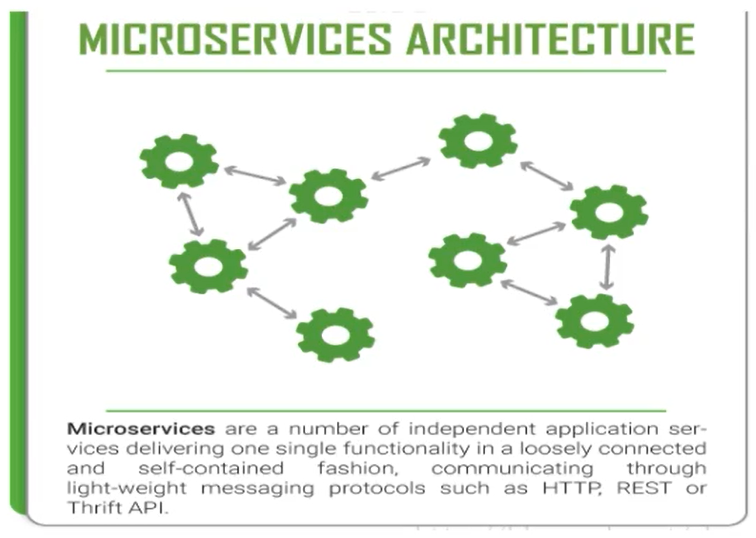
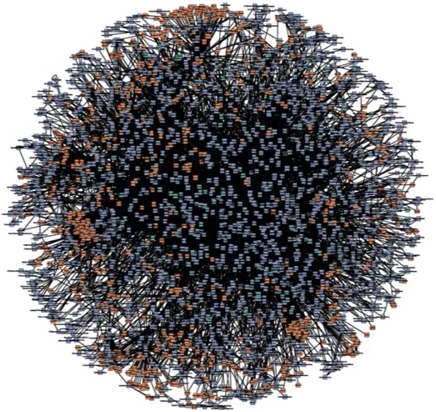
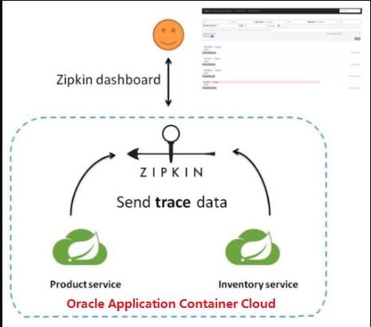
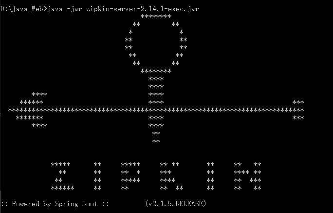
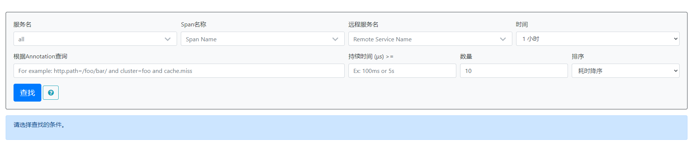
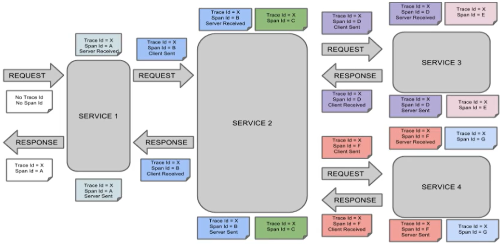
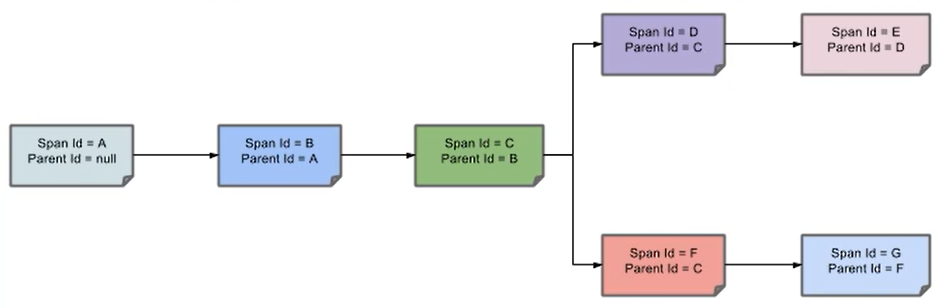
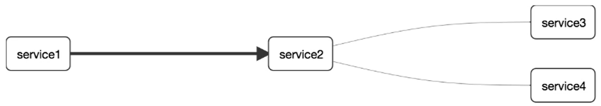
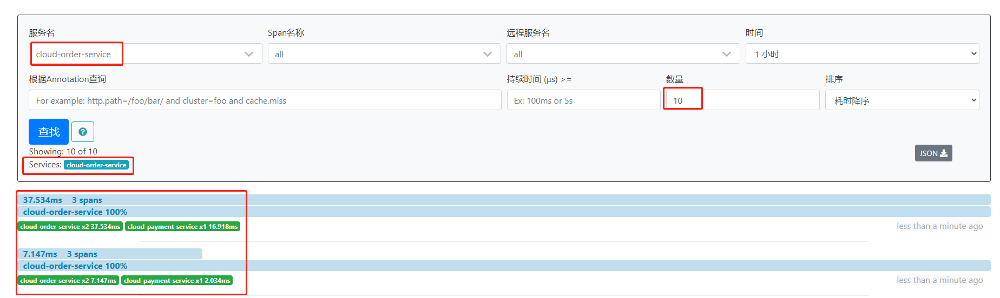

# 九、分布式请求链路跟踪

# 一、Spring Cloud Sleuth


## 概述


为什么会出现这个技术？要解决哪些问题？


在微服务框架中，一个由客户端发起的请求在后端系统中会经过多个不同的的服务节点调用来协同产生最后的请求结果，


每一个前段请求都会形成一条复杂的分布式服务调用链路，链路中的任何一环出现高延时或错误都会引起整个请求最后的失败。








**而来sleuth就是用于追踪每个请求的整体链路**


### 是什么


+ [https://github.com/spring-cloud/spring-cloud-sleuth](https://github.com/spring-cloud/spring-cloud-sleuth)
+ Spring Cloud Sleuth提供了一套完整的服务跟踪的解决方案
+ 在分布式系统中提供追踪解决方案并且兼容支持了zipkin


### 解决





## 搭建链路监控步骤


### zipkin


#### 下载


SpringCloud从F版起已不需要自己构建Zipkin Server了，只需调用jar包即可


[https://repo1.maven.org/maven2/io/zipkin/zipkin-server/2.14.1/](https://repo1.maven.org/maven2/io/zipkin/zipkin-server/2.14.1/)


zipkin-server-2.14.1-exec.jar


#### 运行jar


```plain
java -jar zipkin-server-2.14.1-exec.jar
```





#### 运行控制台


[http://localhost:9411/zipkin/](http://localhost:9411/zipkin/)





**术语**


+  完整的调用链路  
表示一请求链路，一条链路通过Trace ld唯一标识，Span标识发起的请求信息，各span通过parent id关联起来  
 


—条链路通过Trace ld唯一标识，Span标识发起的请求信息，各span通过parent id关联起来。





整个链路的依赖关系如下：





+ 名词解释 
    - Trace：类似于树结构的Span集合，表示一条调用链路，存在唯一标识
    - span：表示调用链路来源，通俗的理解span就是一次请求信息


### 服务提供者


不需要额外创建项目,使用之前的cloud-provider-payment8001即可


#### pom


```xml
<!--包含了sleuth+zipkin-->
<dependency>
    <groupId>org.springframework.cloud</groupId>
    <artifactId>spring-cloud-starter-zipkin</artifactId>
</dependency>
```


#### yml


```yaml
server:
  port: 8001

spring:
  application:
    name: cloud-payment-service
  zipkin: #<-------------------------------------关键
    base-url: http://localhost:9411
    sleuth: #<-------------------------------------关键
      sampler:
      #采样率值介于 0 到 1 之间，1 则表示全部采集
      probability: 1
  datasource:
    type: com.alibaba.druid.pool.DruidDataSource # 当前数据源操作类型
    driver-class-name: org.gjt.mm.mysql.Driver # mysql驱动类
    url: jdbc:mysql://localhost:3306/db2019?useUnicode=true&characterEncoding=UTF-8&useSSL=false&serverTimezone=GMT%2B8
    username: root
    password: root


eureka:
  client:
    # 表示是否将自己注册进EurekaServer默认为true
    register-with-eureka: true
    # 是否从EurekaServer抓取已有的注册信息，默认为true。单节点无所谓，集群必须设置为 true，才能配合ribbon使用负载均衡
    fetch-registry: true
    service-url:
#      defaultZone: http://localhost:7001/eureka
      defaultZone: http://eureka7001.com:7001/eureka,http://eureka7002.com:7002/eureka
  instance:
    instance-id: payment8001
    prefer-ip-address: true   # 访问路径可以显示IP地址
    # Eureka客户端向服务端发送心跳的时间间隔
    lease-renewal-interval-in-seconds: 1
    # Eureka服务端在收到最后一次心跳后等待时间上限，超时将剔除服务
    lease-expiration-duration-in-seconds: 2

mybatis:
  mapper-locations: classpath*:mapper/*.xml
  type-aliases-package: com.atguigu.springcloud.entities
  #它一般对应我们的实体类所在的包，这个时候会自动取对应包中不包括包名的简单类名作为包括包名的别名。多个package之间可以用逗号或者分号等来进行分隔（value的值一定要是包的全）
```


#### 业务类PaymentController


```java
@RestController
@Slf4j
public class PaymentController {
    
    ...
    
 	@GetMapping("/payment/zipkin")
    public String paymentZipkin() {
        return "hi ,i'am paymentzipkin server fall back，welcome to here, O(∩_∩)O哈哈~";
    }    
}
```


### 服务消费者(调用方)


不需要额外创建项目,使用之前的cloud-consumer-order80即可


#### pom


```xml
<!--包含了sleuth+zipkin-->
<dependency>
    <groupId>org.springframework.cloud</groupId>
    <artifactId>spring-cloud-starter-zipkin</artifactId>
</dependency>
```


#### yml


```yaml
server:
  port: 80

spring:
  application:
    name: cloud-order-service
  zipkin: #<-------------------------------------关键
    base-url: http://localhost:9411
    sleuth: #<-------------------------------------关键
      sampler:
      #采样率值介于 0 到 1 之间，1 则表示全部采集
      probability: 1

eureka:
  client:
    # 表示是否将自己注册进EurekaServer默认为true
    register-with-eureka: true
    # 是否从EurekaServer抓取已有的注册信息，默认为true。单节点无所谓，集群必须设置为 true，才能配合ribbon使用负载均衡
    fetch-registry: true
    service-url:
      defaultZone: http://localhost:7001/eureka
      #defaultZone: http://eureka7001.com:7001/eureka,http://eureka7002.com:7002/eureka
```


#### 业条类OrderController


```java
// ====================> zipkin+sleuth
@GetMapping("/consumer/payment/zipkin")
public String paymentZipkin() {
    String result = restTemplate.getForObject("http://localhost:8001" + "/payment/zipkin/", String.class);
    return result;
}
```


### 依次启动Eureka7001/8001/80


80调用8001几次测试下	[http://localhost/consumer/payment/zipkin](http://localhost/consumer/payment/zipkin)


### 打开浏览器访问：[http://localhost:9411](http://localhost:9411)





> 更新: 2022-08-19 18:27:49  
> 原文: <https://www.yuque.com/like321/xgwgyr/yktnb8>