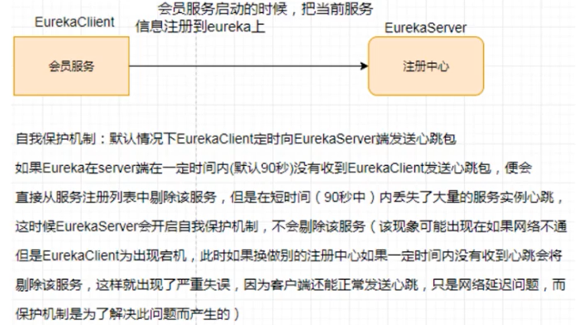
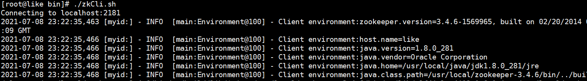

# 二、服务注册与发现

## 一、Eureka（AP）


前面我们没有服务注册中心,也可以服务间调用,为什么还要服务注册?


当服务很多时,单靠代码手动管理是很麻烦的,需要一个公共组件,统一管理多服务,包括服务是否正常运行,等


Eureka用于**服务注册**,目前官网**已经停止更新**


+  什么是服务治理 
    -  SpringCloud 封装了Netflix公司开发的Eureka 模块来实现服务治理【SpringCloud抄的Netflix作业】 
    -  在传统的RPC远程调用框架中，管理每个服务与服务之间依赖关系比较复杂，所以服务之间依赖关系，可以实现服务调用，负载均衡，容错等，实现服务发现与注册。 


+  什么是服务注册 
    -  Eureka采用了CS的设计架构，Eureka Server 作为服务注册功能的服务器，他是服务注册中心。  
而系统中的其他微服务，使用Eureka的客户端连接到 Eureka Server并维持心跳连接。  
这样系统的维护人员就可以通过Eureka Server来监控系统中各个微服务是否正常运行。 
    -  在服务注册与发现中，有一个注册中心。当服务器启动时，会把当前自己服务器的信息比如服务地址通讯地址等以别名方式注册到注册中心中。  
另一方（消费者|提供者），以该别名的方式去注册中心获取到实际的服务通讯地址，然后再实现本地RPC调用  
RPC远程调用框架核心设计思想：在于注册中心，因为使用注册中心管理每个服务与服务之间的一个依赖关系（服务治理概念）。在任何RPC远程框架中，都会有一个注册中心（存放服务地址相关信息[接口地址]）  
 
+  Eureka两组件 


### `Eureka Server`提供服务注册服务


各个微服务节点通过配置启动后，会在`Eureka Server`中进行注册，这样`Eureka Server`中的服务注册表中将会存储所有可用服务节点的信息，服务节点的信息可以在界面中直观的看到。


### `Eureka Client` 通过注册中心进行访问


是一个Java客户端，用于简化Eureka Server的交互，客户端同时也具备一个内置的、使用轮询（round-robin）负载算法的负载均衡器。


在应用启动后，将会向Eureka Server发送心跳（默认周期为<font style="color:#E8323C;">30秒</font>）。如果Eureka Server 在多个心跳周期内没有接收到某个节点的心跳，EurekaServer将会从服务注册表中把这个服务节点移除（默认<font style="color:#E8323C;">90秒</font>）


### 1,**单机版:**


#### **创建项目cloud_eureka_server7001**


#### **引入pom依赖**


Eureka1 和 Eureka2 的依赖对比


```xml
<!-- 以前的老版本，分不清client 还是server -->
<dependency>
    <groupId>org.springframework.cloud</groupId>
    <artifactId>spring-cloud-starter-eureka</artifactId>
    <version>1.4.7.RELEASE</version>
</dependency>

<!-- 现在的新版本 -->
<dependency>
    <groupId>org.springframework.cloud</groupId>
    <artifactId>spring-cloud-starter-netflix-eureka-server</artifactId>
</dependency>
<dependency>
    <groupId>org.springframework.cloud</groupId>
    <artifactId>spring-cloud-starter-netflix-eureka-client</artifactId>
    <version>3.0.2</version>
</dependency>
```


```xml
<?xml version="1.0" encoding="UTF-8"?>
<project xmlns="http://maven.apache.org/POM/4.0.0"
         xmlns:xsi="http://www.w3.org/2001/XMLSchema-instance"
         xsi:schemaLocation="http://maven.apache.org/POM/4.0.0 http://maven.apache.org/xsd/maven-4.0.0.xsd">
    <parent>
        <artifactId>cloud2020</artifactId>
        <groupId>com.atguigu.springcloud</groupId>
        <version>1.0-SNAPSHOT</version>
    </parent>
    <modelVersion>4.0.0</modelVersion>

    <artifactId>cloud_eureka_server7001</artifactId>

    <dependencies>
        <dependency>
            <groupId>org.springframework.cloud</groupId>
            <artifactId>spring-cloud-starter-netflix-eureka-server</artifactId>
        </dependency>

        <!--引入自己定义的api通用包-->
        <dependency>
            <groupId>com.atguigu.springcloud</groupId>
            <artifactId>cloud-api-commons</artifactId>
            <version>${project.version}</version>
        </dependency>

        <dependency>
            <groupId>org.springframework.boot</groupId>
            <artifactId>spring-boot-starter-web</artifactId>
        </dependency>

        <dependency>
            <groupId>org.springframework.boot</groupId>
            <artifactId>spring-boot-starter-actuator</artifactId>
        </dependency>

        <dependency>
            <groupId>org.springframework.boot</groupId>
            <artifactId>spring-boot-devtools</artifactId>
            <scope>runtime</scope>
            <optional>true</optional>
        </dependency>

        <dependency>
            <groupId>org.projectlombok</groupId>
            <artifactId>lombok</artifactId>
        </dependency>

        <dependency>
            <groupId>org.springframework.boot</groupId>
            <artifactId>spring-boot-starter-test</artifactId>
            <scope>test</scope>
        </dependency>
        <dependency>
            <groupId>junit</groupId>
            <artifactId>junit</artifactId>
        </dependency>

    </dependencies>
</project>
```


#### 配置文件:


```yaml
server:
  port: 7001

eureka:
  instance:
    #eureka服务端的实例名称
    hostname: localhost
  client:
    # false表示不向注册中心注册自己
    register-with-eureka: false
    # false表示自己端就是注册中心，我的职责就是维护服务实例，并不需要去检索服务
    fetch-registry: false
    service-url:
      # 设置与Eureka Server交互的地址查询服务和注册服务都需要依赖这个地址
      defaultZone: http://${eureka.instance.hostname}:${server.port}/eureka/
```


#### 主启动类


需要添加 `@EnableEurekaServer` 注解


```java
package com.atguigu.springcloud;

import org.springframework.boot.SpringApplication;
import org.springframework.boot.autoconfigure.SpringBootApplication;
import org.springframework.cloud.netflix.eureka.server.EnableEurekaServer;

/**
 * @author: like
 * @Date: 2021/07/07 23:31
 */
@SpringBootApplication
@EnableEurekaServer
public class EurekaMain7001 {

    public static void main(String[] args) {
        SpringApplication.run(EurekaMain7001.class, args);
    }

}
```


#### **此时就可以启动当前项目了**


#### 将8001、80 注册到eurekaServer:


> 对于Eureka来说，Eureka就是最底层的提供者，对于他而言，所有的提供者 都是消费者
>
>  
>
> **每个微服务都应该有一个名字  spring.application.name**
>


##### 修改pom,引入添加依赖


```xml
<!--Eureka-->
<dependency>
  <groupId>org.springframework.cloud</groupId>
  <artifactId>spring-cloud-starter-netflix-eureka-client</artifactId>
</dependency>
```


##### 写yaml


```yaml
eureka:
  client:
    # 表示是否将自己注册进EurekaServer默认为true
    register-with-eureka: true
    # 是否从EurekaServer抓取已有的注册信息，默认为true。单节点无所谓，集群必须设置为 true，才能配合ribbon使用负载均衡
    fetch-registry: true
    service-url:
      defaultZone: http://localhost:7001/eureka
```


##### 主启动类


添加 `@EnableEurekaClient`注解


```java
@SpringBootApplication
@EnableEurekaClient
public class PaymentMain8001 {

    public static void main(String[] args) {
        SpringApplication.run(PaymentMain8001.class, args);
    }

}
```


模块重启,就可以注册到eureka中了


### 2,集群版:


#### 集群原理:


+  问题：微服务RPC远程服务调用最核心的是什么  
高可用，试想你的注册中心只有一个only one，它出故障了那就呵呵了，会导致整个服务环境不可用，所以 
+  解决办法：  
搭建Eureka注册中心集群，实现**<font style="color:#E8323C;">负载均衡+故障容错</font>** 


Eureka集群原理：**<font style="color:#E8323C;">互相注册，相互守望！</font>**


**集群构建原理:**


		互相注册


#### **构建新erueka项目**


名字:cloud-eureka-server7002


##### pom文件:


		粘贴7001的即可


##### 配置文件:


		在写配置文件前,修改一下主机的hosts文件


```plain
127.0.0.1 eureka7001.com
127.0.0.1 eureka7002.com
```


首先修改之前的7001的eureka项目,因为多个eureka需要互相注册


```yaml
server:
  port: 7001

eureka:
  instance:
    #eureka服务端的实例名称
    hostname: eureka7001.com
  client:
    # false表示不向注册中心注册自己
    register-with-eureka: false
    # false表示自己端就是注册中心，我的职责就是维护服务实例，并不需要去检索服务
    fetch-registry: false
    service-url:
      # 设置与Eureka Server交互的地址查询服务和注册服务都需要依赖这个地址
      defaultZone: http://eureka7002.com:7002/eureka/
```


然后修改7002


			**7002也是一样的,只不过端口和地址改一下**


```yaml
server:
  port: 7002

eureka:
  instance:
    #eureka服务端的实例名称
    hostname: eureka7002.com
  client:
    # false表示不向注册中心注册自己
    register-with-eureka: false
    # false表示自己端就是注册中心，我的职责就是维护服务实例，并不需要去检索服务
    fetch-registry: false
    service-url:
      # 设置与Eureka Server交互的地址查询服务和注册服务都需要依赖这个地址
      defaultZone: http://eureka7001.com:7001/eureka/
```


##### 主启动类:


```java
package com.atguigu.springcloud;

import org.springframework.boot.SpringApplication;
import org.springframework.boot.autoconfigure.SpringBootApplication;
import org.springframework.cloud.netflix.eureka.server.EnableEurekaServer;

/**
 * @author: like
 * @Date: 2021/07/08 7:18
 */
@SpringBootApplication
@EnableEurekaServer
public class EurekaMain7002 {

    public static void main(String[] args) {
        SpringApplication.run(EurekaMain7002.class, args);
    }


}
```


##### 然后启动7001,7002即可


#### 将pay,order模块注册到eureka集群中:


##### 只需要修改配置文件即可:


##### 两个模块都修改上面的都一样即可


```yaml
eureka:
  client:
    # 表示是否将自己注册进EurekaServer默认为true
    register-with-eureka: true
    # 是否从EurekaServer抓取已有的注册信息，默认为true。单节点无所谓，集群必须设置为 true，才能配合ribbon使用负载均衡
    fetch-registry: true
    service-url:
      #defaultZone: http://localhost:7001/eureka
      defaultZone: http://eureka7001.com:7001/eureka,http://eureka7002.com:7002/eureka
```


### 3,将pay模块也配置为集群模式:


#### 创建新模块,8002


	名称: cloud-provider-payment8002


#### pom文件,复制8001的


#### yml文件复制8001的


		端口修改一下,改为8002


		服务名称不用改,用一样的


```yaml
server:
  port: 8002

spring:
  application:
    name: cloud-payment-service
  datasource:
    type: com.alibaba.druid.pool.DruidDataSource # 当前数据源操作类型
    driver-class-name: org.gjt.mm.mysql.Driver # mysql驱动类
    url: jdbc:mysql://localhost:3306/db2019?useUnicode=true&characterEncoding=UTF-8&useSSL=false&serverTimezone=GMT%2B8
    username: root
    password: root


eureka:
  client:
    # 表示是否将自己注册进EurekaServer默认为true
    register-with-eureka: true
    # 是否从EurekaServer抓取已有的注册信息，默认为true。单节点无所谓，集群必须设置为 true，才能配合ribbon使用负载均衡
    fetch-registry: true
    service-url:
      #defaultZone: http://localhost:7001/eureka
      defaultZone: http://eureka7001.com:7001/eureka,http://eureka7002.com:7002/eureka


mybatis:
  mapper-locations: classpath*:mapper/*.xml
  type-aliases-package: com.atguigu.springcloud.entities
  #它一般对应我们的实体类所在的包，这个时候会自动取对应包中不包括包名的简单类名作为包括包名的别名。多个package之间可以用逗号或者分号等来进行分隔（value的值一定要是包的全）
```


#### 主启动类,复制8001的


#### mapper,service,controller都复制一份


#### 测试


修改提供者的controller方法，添加一个端口属性，并且在方法中输出


```plain
@Value("${server.port}")
private String port;
```


		然后就启动服务即可


		此时访问order模块,发现并没有负载均衡到两个pay,模块中,而是只访问8001


#### 负载均衡


+  消费者订单服务访问地址不能写死 

```java
package com.atguigu.springcloud.controller;

import com.atguigu.springcloud.entities.CommonResult;
import com.atguigu.springcloud.entities.Payment;
import lombok.extern.slf4j.Slf4j;
import org.springframework.beans.factory.annotation.Autowired;
import org.springframework.web.bind.annotation.*;
import org.springframework.web.client.RestTemplate;

/**
 * @author: like
 * @Date: 2021/07/07 21:32
 */
@RestController
@Slf4j
public class OrderController {

    //消费者订单服务访问地址不能写死，改为服务名称
    public static final String PAYMENT_URL = "http://CLOUD-PAYMENT-SERVICE";

    @Autowired
    private RestTemplate restTemplate;

    @PostMapping("/consumer/payment/create")
    public CommonResult<Payment> create(@RequestBody Payment payment) {
        return restTemplate.postForObject(PAYMENT_URL + "/payment/create", payment, CommonResult.class);
    }

    @GetMapping("/consumer/payment/get/{id}")
    public CommonResult<Payment> getPayment(@PathVariable("id") Long id) {
        return restTemplate.getForObject(PAYMENT_URL + "/payment/get/" + id, CommonResult.class);
    }

}
```

 

+  虽然我们是使用RestTemplate访问的微服务,但是也可以负载均衡的  
使用@LoadBalanced注解赋予RestTemplate负载均衡的能力，可以指定负载均衡算法,默认轮询  
因为加了eureka就会自动添加 ribbon依赖，所以不用加ribbon 

```java
package com.atguigu.springcloud.config;

import org.springframework.cloud.client.loadbalancer.LoadBalanced;
import org.springframework.context.annotation.Bean;
import org.springframework.context.annotation.Configuration;
import org.springframework.web.client.RestTemplate;

/**
 * @author: like
 * @Date: 2021/07/07 21:41
 */
@Configuration
public class ApplicationConfig {

    @Bean
    @LoadBalanced // 使用@LoadBalanced注解赋予RestTemplate负载均衡的能力
    public RestTemplate getRestTemplate(){
        return new RestTemplate();
    }

}
```

 


#### 总结


Ribbon和Eureka整合后，Consumer可以直接调用服务不用再关心地址和端口号，且该服务还有负载功能！


### 4,actuator微服务信息完善


修改服务主机名和ip在eureka的web上显示


注意：需要有这些依赖


```plain
<!-- web -->
<dependency>
  <groupId>org.springframework.boot</groupId>
  <artifactId>spring-boot-starter-web</artifactId>
</dependency>

<!-- 图形化监控 -->
<dependency>
  <groupId>org.springframework.boot</groupId>
  <artifactId>spring-boot-starter-actuator</artifactId>
</dependency>
```


#### 修改yml配置文件:


```yaml
eureka:
  client:
    # 表示是否将自己注册进EurekaServer默认为true
    register-with-eureka: true
    # 是否从EurekaServer抓取已有的注册信息，默认为true。单节点无所谓，集群必须设置为 true，才能配合ribbon使用负载均衡
    fetch-registry: true
    service-url:
      #defaultZone: http://localhost:7001/eureka
      defaultZone: http://eureka7001.com:7001/eureka,http://eureka7002.com:7002/eureka
  instance:
    instance-id: payment8002
    prefer-ip-address: true   # 访问路径可以显示IP地址
```


### 5,服务发现Discovery:


通过注册进eureka里面的微服务，可以通过服务发现来获得该服务的信息。


#### 修改cloud-provider-payment8001的controller


```plain
import ``org.springframework.cloud.client.discovery.DiscoveryClient``;
```


别导错包了


```java
    @Autowired
    private DiscoveryClient discoveryClient;

    @GetMapping(value = "/payment/discovery")
    public Object discovery(){

        //拿到所有注册的信息
        List<String> services = discoveryClient.getServices();
        for (String element : services) {
            log.info("***** element:"+element);
        }
        
        //拿到指定服务名称的所有的服务的注册信息，比如payment模块，他们两个的名字都是一样的
        List<ServiceInstance> instances = discoveryClient.getInstances("CLOUD-PAYMENT-SERVICE");
        for (ServiceInstance instance : instances) {
            log.info(instance.getServiceId()+"\t"+instance.getHost()+"\t"+instance.getPort()+"\t"+instance.getUri());
        }
        
        return this.discoveryClient;
    }
```


#### 在主启动类上添加@EnableDiscoveryClient


添加在8001的主启动类上


```java
@SpringBootApplication
@EnableEurekaClient
@EnableDiscoveryClient
public class PaymentMain8001 {

    public static void main(String[] args) {
        SpringApplication.run(PaymentMain8001.class, args);
    }

}
```


#### 自测


+ 先要启动EurekaServer，7001/7002服务
+ 再启动8001主启动类，需要稍等一会
+ [http://localhost:8001/payment/discovery](http://localhost:8001/payment/discovery)


### 6,Eureka自我保护:


#### 故障现象


保护模式主要用于一组客户端和Eureka Server之间存在网络分区场景下的保护。一旦进入保护模式：


**Eureka Server将会尝试保护其服务注册表中的信息，不再删除服务注册表中的数据，也就是不会注销任何微服务**


如果在Eureka Server的首页看到以下这段提示，说明Eureka进入了保护模式：


#### 导致原因


某时刻某一个微服务不能用了，Eureka不会立刻清理，依旧会对该微服务的信息进行保存


属于CAP里面的AP分支


##### 为什么会产生Eureka自我保护机制？


为了防止EurekaClient 可以正常运行，但是与EurekaServer网络不通情况下，EurekaServer**不会立刻**将EurekaClient服务剔除


##### 什么是自我保护模式？


默认情况下，如果EurekaServer在一定时间内没有接收到某个微服务实例的心跳，EurekaServer将会注销该实例（默认90秒）。


但是当网络分区故障发生（延时、卡顿、拥挤）时，微服务与EurekaServer之间无法正常通信，以上行为可能变得非常危险，-----因为微服务本身健康的，此时不应该注销这个微服务。


Eureka通过“自我保护模式”来解决这个问题， 当EurekaServer节点在短时间内丢失过多客户端时（可能发生了网络分区故障）那么这个节点就会自动进入 自我保护模式





**在自我保护模式中，EurekaServer会保护服务注册表中的信息，不再注销任何微服务实例**


他的设计哲学就是宁可保留错误的服务注册信息，也不盲目注销任何可能健康的服务实例。好死不如赖活着


综上：自我保护模式是一种应对网络异常的安全保护措施。他的架构哲学是宁可同时保留所有微服务，（健康的微服务和不健康的微服务都会保留） 也不盲目注销任何健康的微服务。使用自我保护模式，可以让Eureka集群更加的健壮，稳定。


#### 怎么禁止自我保护


> 默认 自我保护模式 是**开启状态 （**一般生产环境不会禁止自我保护**）**
>


##### 注册中心eureakeServer端7001


+ 出厂默认，自我保护机制是开启的 `eureka.server.enable-self-preservation = true`


+  
    - 使用`eureka.server.enable-self-preservation = false`可以禁用自我保护模式


+ 关闭效果 在eurekaServer端7001处设置关闭自我保护机制


+  

```yaml
server:
  port: 7001

eureka:
  instance:
    #eureka服务端的实例名称
    hostname: eureka7001.com
  client:
    # false表示不向注册中心注册自己
    register-with-eureka: false
    # false表示自己端就是注册中心，我的职责就是维护服务实例，并不需要去检索服务
    fetch-registry: false
    service-url:
      # 设置与Eureka Server交互的地址查询服务和注册服务都需要依赖这个地址
      #defaultZone: http://eureka7002.com:7002/eureka/
      #单机版
     defaultZone: http://eureka7001.com:7001/eureka/
  server:
    # 禁用自我保护模式
    enable-self-preservation: false
    eviction-interval-timer-in-ms: 2000
```

 


##### 生产者客户端eureakeClient端8001


**默认**


```yaml
eureka.instance.lease-renewal-interval-in-seconds=30
eureka.instance.lease-expiration-duration-in-seconds=90
```


**配置**


```yaml
eureka:
  client:
    # 表示是否将自己注册进EurekaServer默认为true
    register-with-eureka: true
    # 是否从EurekaServer抓取已有的注册信息，默认为true。单节点无所谓，集群必须设置为 true，才能配合ribbon使用负载均衡
    fetch-registry: true
    service-url:
      defaultZone: http://localhost:7001/eureka
      #defaultZone: http://eureka7001.com:7001/eureka,http://eureka7002.com:7002/eureka
  instance:
    instance-id: payment8001
    prefer-ip-address: true   # 访问路径可以显示IP地址
    # Eureka客户端向服务端发送心跳的时间间隔
    lease-renewal-interval-in-seconds: 1
    # Eureka服务端在收到最后一次心跳后等待时间上限，超时将剔除服务
    lease-expiration-duration-in-seconds: 2
```


**测试**


+ 7001和8001都配置完成
+ 先启动7001再启动8001
+ 先关闭8001
+ 马上被删除了


## 二、Zookeeper（CP）


Zookeeper是一个分布式协调工具，可以实现注册中心功能


### 1,启动zk,到linux上





### 2,创建新的pay模块,


单独用于注册到zk中


名字 : cloud-provider-payment8003


#### pom依赖


```xml
<?xml version="1.0" encoding="UTF-8"?>
<project xmlns="http://maven.apache.org/POM/4.0.0"
         xmlns:xsi="http://www.w3.org/2001/XMLSchema-instance"
         xsi:schemaLocation="http://maven.apache.org/POM/4.0.0 http://maven.apache.org/xsd/maven-4.0.0.xsd">
    <parent>
        <artifactId>cloud2020</artifactId>
        <groupId>com.atguigu.springcloud</groupId>
        <version>1.0-SNAPSHOT</version>
    </parent>
    <modelVersion>4.0.0</modelVersion>

    <artifactId>cloud-provider-payment8003</artifactId>


    <dependencies>

        <!--springboot整合Zookeeper客户端-->
        <dependency>
            <groupId>org.springframework.cloud</groupId>
            <artifactId>spring-cloud-starter-zookeeper-discovery</artifactId>
        </dependency>

        <!--引入自己定义的api通用包-->
        <dependency>
            <groupId>com.atguigu.springcloud</groupId>
            <artifactId>cloud-api-commons</artifactId>
            <version>${project.version}</version>
        </dependency>

        <dependency>
            <groupId>org.springframework.boot</groupId>
            <artifactId>spring-boot-starter-web</artifactId>
        </dependency>

        <dependency>
            <groupId>org.springframework.boot</groupId>
            <artifactId>spring-boot-starter-actuator</artifactId>
        </dependency>

        <dependency>
            <groupId>org.springframework.boot</groupId>
            <artifactId>spring-boot-devtools</artifactId>
            <scope>runtime</scope>
            <optional>true</optional>
        </dependency>

        <dependency>
            <groupId>org.projectlombok</groupId>
            <artifactId>lombok</artifactId>
        </dependency>

        <dependency>
            <groupId>org.springframework.boot</groupId>
            <artifactId>spring-boot-starter-test</artifactId>
            <scope>test</scope>
        </dependency>
        <dependency>
            <groupId>junit</groupId>
            <artifactId>junit</artifactId>
        </dependency>

    </dependencies>

</project>
```


#### 配置文件


```yaml
server:
  port: 8003

spring:
  application:
    name: cloud-provider-payment
  cloud:
    zookeeper:
      connect-string: 118.225.327.107:2181
```


#### 主启动类


```java
package com.atguigu.spring.cloud;

import org.springframework.boot.SpringApplication;
import org.springframework.boot.autoconfigure.SpringBootApplication;
import org.springframework.cloud.client.discovery.EnableDiscoveryClient;

/**
 * @author: like
 * @Date: 2021/07/08 23:10
 */
@SpringBootApplication
// 该注解用于向使用consul或者Zookeeper作为注册中心时注册服务
@EnableDiscoveryClient
public class PaymentMain8003 {

    public static void main(String[] args) {
        SpringApplication.run(PaymentMain8003.class, args);
    }

}
```


#### controller


```java
package com.atguigu.spring.cloud.controller;

import org.springframework.beans.factory.annotation.Value;
import org.springframework.web.bind.annotation.RequestMapping;
import org.springframework.web.bind.annotation.RestController;

import java.util.UUID;

/**
 * @author: like
 * @Date: 2021/07/08 23:17
 */
@RestController
public class PaymentController {

    @Value("${server.port}")
    private String serverPort;

    @RequestMapping("/payment/zk")
    public String paymentzk() {
        return "springcloud with zookeeper: " + serverPort + "\t" + UUID.randomUUID().toString();
    }

}
```


#### 然后就可以启动


**此时启动,会报错,因为jar包与我们的zk版本不匹配**


解决:  
修改pom文件,改为与我们zk版本匹配的jar包


```xml
<!--springboot整合Zookeeper客户端-->
<dependency>
    <groupId>org.springframework.cloud</groupId>
    <artifactId>spring-cloud-starter-zookeeper-discovery</artifactId>
    <!--先排除自带的zookeeper3.5.3-->
    <exclusions>
        <exclusion>
            <groupId>org.apache.zookeeper</groupId>
            <artifactId>zookeeper</artifactId>
        </exclusion>
    </exclusions>
</dependency>
<!--添加zookeeper3.4.6版本-->
<dependency>
    <groupId>org.apache.zookeeper</groupId>
    <artifactId>zookeeper</artifactId>
    <version>3.4.6</version>
    <!--排除这个slf4j-log4j12-->
    <exclusions>
        <exclusion>
            <groupId>org.slf4j</groupId>
            <artifactId>slf4j-log4j12</artifactId>
        </exclusion>
    </exclusions>
</dependency>
```


**这里测试,就不写service与dao什么的了**


### 临时还是持久节点


我们在zk上注册的node是临时节点，当我们的服务一定时间内没有发送心跳，**那****<font style="color:#E8323C;">么zk就会将这个服务的node删除了</font>**


### 3,创建order消费模块注册到zk


#### 创建项目


名字: cloud-consumerzk-order80


#### pom


```xml
<?xml version="1.0" encoding="UTF-8"?>
<project xmlns="http://maven.apache.org/POM/4.0.0"
         xmlns:xsi="http://www.w3.org/2001/XMLSchema-instance"
         xsi:schemaLocation="http://maven.apache.org/POM/4.0.0 http://maven.apache.org/xsd/maven-4.0.0.xsd">
    <parent>
        <artifactId>cloud2020</artifactId>
        <groupId>com.atguigu.springcloud</groupId>
        <version>1.0-SNAPSHOT</version>
    </parent>
    <modelVersion>4.0.0</modelVersion>

    <artifactId>cloud-consumerzk-order80</artifactId>


    <dependencies>

        <!--springboot整合Zookeeper客户端-->
        <dependency>
            <groupId>org.springframework.cloud</groupId>
            <artifactId>spring-cloud-starter-zookeeper-discovery</artifactId>
            <!--先排除自带的zookeeper3.5.3-->
            <exclusions>
                <exclusion>
                    <groupId>org.apache.zookeeper</groupId>
                    <artifactId>zookeeper</artifactId>
                </exclusion>
            </exclusions>
        </dependency>
        <!--添加zookeeper3.4.6版本-->
        <dependency>
            <groupId>org.apache.zookeeper</groupId>
            <artifactId>zookeeper</artifactId>
            <version>3.4.6</version>
            <!--排除这个slf4j-log4j12-->
            <exclusions>
                <exclusion>
                    <groupId>org.slf4j</groupId>
                    <artifactId>slf4j-log4j12</artifactId>
                </exclusion>
            </exclusions>
        </dependency>

        <!--引入自己定义的api通用包-->
        <dependency>
            <groupId>com.atguigu.springcloud</groupId>
            <artifactId>cloud-api-commons</artifactId>
            <version>${project.version}</version>
        </dependency>

        <dependency>
            <groupId>org.springframework.boot</groupId>
            <artifactId>spring-boot-starter-web</artifactId>
            <!--排除这个slf4j-log4j12-->
            <exclusions>
                <exclusion>
                    <groupId>org.slf4j</groupId>
                    <artifactId>slf4j-log4j12</artifactId>
                </exclusion>
            </exclusions>
        </dependency>

        <dependency>
            <groupId>org.springframework.boot</groupId>
            <artifactId>spring-boot-starter-actuator</artifactId>
        </dependency>

        <dependency>
            <groupId>org.springframework.boot</groupId>
            <artifactId>spring-boot-devtools</artifactId>
            <scope>runtime</scope>
            <optional>true</optional>
        </dependency>

        <dependency>
            <groupId>org.projectlombok</groupId>
            <artifactId>lombok</artifactId>
        </dependency>

        <dependency>
            <groupId>org.springframework.boot</groupId>
            <artifactId>spring-boot-starter-test</artifactId>
            <scope>test</scope>
        </dependency>
        <dependency>
            <groupId>junit</groupId>
            <artifactId>junit</artifactId>
        </dependency>

    </dependencies>
    
</project>
```


#### 配置文件


```yaml
server:
  port: 80

spring:
  application:
    name: cloud-consumer-order
  cloud:
    zookeeper:
      connect-string: 118.225.327.107:2181
```


#### 主启动类:


```java
package com.atguigu.springcloud;

import org.springframework.boot.SpringApplication;
import org.springframework.boot.autoconfigure.SpringBootApplication;
import org.springframework.cloud.client.discovery.EnableDiscoveryClient;

/**
 * @author: like
 * @Date: 2021/07/09 7:08
 */
@SpringBootApplication
@EnableDiscoveryClient
public class OrderZKMain80 {

    public static void main(String[] args) {
        SpringApplication.run(OrderZKMain80.class, args);
    }
}
```


#### RestTemolate


注意,这里使用RestTemolate,要先注册它


```java
package com.atguigu.springcloud.config;

import org.springframework.cloud.client.loadbalancer.LoadBalanced;
import org.springframework.context.annotation.Bean;
import org.springframework.context.annotation.Configuration;
import org.springframework.web.client.RestTemplate;

/**
 * @author: like
 * @Date: 2021/07/07 21:41
 */
@Configuration
public class ApplicationConfig {

    @Bean
    @LoadBalanced // 使用@LoadBalanced注解赋予RestTemplate负载均衡的能力
    public RestTemplate getRestTemplate(){
        return new RestTemplate();
    }

}
```


#### controller


**然后启动即可注册到zk**


### 4, 集群版zk:


只需要修改yml配置文件:


这个connect-string指定多个zk地址即可


```yaml
cloud:
  zookeeper:
    connect-string: 118.225.327.107:2181
```


connect-string: 1.2.3.4,2.3.4.5


## 三、Consul（CP）


### 1，Consul简介


[Consul官网](https://www.consul.io/intro/index.html)


#### Consul是什么


Consul是一套开源的分布式服务发现和配置管理系统，由HashiCorp公司使用GO语言开发。


提供了微服务系统中的服务治理，配置中心，控制总线等功能。这些功能中的每一个都可以根据需要单独使用，也可以一起使用以构建全方位的服务网格，总之Consul提供了一种完整的服务网格解决方案。


它具有很多优点，包括：基于raft协议，比较简介；支持健康检查；同时支持Http和DNS协议；支持跨数据中心的WAN集群；提供图形界面；跨平台，支持Linux、mac、windows


#### Consul能干吗


+ 服务发现 
    - 提供HTTP和DNS两种发现方式
+ 健康检测 
    - 支持多种方式，HTTP、TCP、Docker、Shell脚本定制化
+ KV存储 
    - key、Value的存储方式
+ 多数据中心 
    - Consul支持多数据中心
+ 可视化WEB界面


#### 下载


[下载地址](https://www.consul.io/downloads.html)


[学习地址](https://www.springcloud.cc/spring-cloud-consul.html)


### 2，安装并运行Consul


[官网安装说明](https://learn.hashicorp.com/tutorials/consul/get-started-install)


下载windows后，解压后就一个文件 consul.exe 文件


在该目录下打开 cmd  输入  `consul --version` 就可以查看consul的版本


使用开发模式启动consul：`consul agent -dev`


访问控制界面：[http://localhost:8500](http://localhost:8500)


### 2,服务提供者


#### 项目名字


cloud-provider-consule-payment8004


#### pom依赖


```yaml
<?xml version="1.0" encoding="UTF-8"?>
<project xmlns="http://maven.apache.org/POM/4.0.0"
         xmlns:xsi="http://www.w3.org/2001/XMLSchema-instance"
         xsi:schemaLocation="http://maven.apache.org/POM/4.0.0 http://maven.apache.org/xsd/maven-4.0.0.xsd">
    <parent>
        <artifactId>cloud2020</artifactId>
        <groupId>com.atguigu.springcloud</groupId>
        <version>1.0-SNAPSHOT</version>
    </parent>
    <modelVersion>4.0.0</modelVersion>

    <artifactId>cloud-provider-consule-payment8004</artifactId>

    <dependencies>
        <!--springcloud consul-server-->
        <dependency>
            <groupId>org.springframework.cloud</groupId>
            <artifactId>spring-cloud-starter-consul-discovery</artifactId>
        </dependency>

        <!--引入自己定义的api通用包-->
        <dependency>
            <groupId>com.atguigu.springcloud</groupId>
            <artifactId>cloud-api-commons</artifactId>
            <version>${project.version}</version>
        </dependency>

        <dependency>
            <groupId>org.springframework.boot</groupId>
            <artifactId>spring-boot-starter-web</artifactId>
        </dependency>

        <dependency>
            <groupId>org.springframework.boot</groupId>
            <artifactId>spring-boot-starter-actuator</artifactId>
        </dependency>

        <dependency>
            <groupId>org.springframework.boot</groupId>
            <artifactId>spring-boot-devtools</artifactId>
            <scope>runtime</scope>
            <optional>true</optional>
        </dependency>

        <dependency>
            <groupId>org.projectlombok</groupId>
            <artifactId>lombok</artifactId>
        </dependency>

        <dependency>
            <groupId>org.springframework.boot</groupId>
            <artifactId>spring-boot-starter-test</artifactId>
            <scope>test</scope>
        </dependency>
        <dependency>
            <groupId>junit</groupId>
            <artifactId>junit</artifactId>
        </dependency>

    </dependencies>

</project>
```


#### 配置文件


```yaml
server:
  port: 8004

spring:
  application:
    name: consul-provider-payment
  ### consul注册中心地址
  cloud:
    consul:
      host: localhost
      port: 8500
    discovery:
      #hostname: 127.0.0.1
      #对外暴露的服务名称
      service-name: ${spring.application.name}
```


#### 主启动类


```java
package com.atguigu.springcloud;

import org.springframework.boot.SpringApplication;
import org.springframework.boot.autoconfigure.SpringBootApplication;
import org.springframework.cloud.client.discovery.EnableDiscoveryClient;

/**
 * @author: like
 * @Date: 2021/07/09 7:58
 */
@SpringBootApplication
@EnableDiscoveryClient
public class PaymentMain8004 {

    public static void main(String[] args) {
        SpringApplication.run(PaymentMain8004.class, args);
    }

}
```


#### controller


```java
package com.atguigu.springcloud.controller;

import org.springframework.beans.factory.annotation.Value;
import org.springframework.web.bind.annotation.RequestMapping;
import org.springframework.web.bind.annotation.RestController;

import java.util.UUID;

/**
 * @author: like
 * @Date: 2021/07/09 8:00
 */
@RestController
public class PaymentController {

    @Value("${server.port}")
    private String serverPort;

    @RequestMapping("/payment/consul")
    public String paymentConsul() {
        return "springcloud with consul: " + serverPort + "\t" + UUID.randomUUID().toString();
    }
    
}
```


#### 启动服务


### 3,服务消费者


cloud-consumer-consul-order80


#### pom文件


```xml
<?xml version="1.0" encoding="UTF-8"?>
<project xmlns="http://maven.apache.org/POM/4.0.0"
         xmlns:xsi="http://www.w3.org/2001/XMLSchema-instance"
         xsi:schemaLocation="http://maven.apache.org/POM/4.0.0 http://maven.apache.org/xsd/maven-4.0.0.xsd">
    <parent>
        <artifactId>cloud2020</artifactId>
        <groupId>com.atguigu.springcloud</groupId>
        <version>1.0-SNAPSHOT</version>
    </parent>
    <modelVersion>4.0.0</modelVersion>

    <artifactId>cloud-consumer-consul-order80</artifactId>

    <dependencies>
        <!--springcloud consul-server-->
        <dependency>
            <groupId>org.springframework.cloud</groupId>
            <artifactId>spring-cloud-starter-consul-discovery</artifactId>
        </dependency>

        <!--引入自己定义的api通用包-->
        <dependency>
            <groupId>com.atguigu.springcloud</groupId>
            <artifactId>cloud-api-commons</artifactId>
            <version>${project.version}</version>
        </dependency>

        <dependency>
            <groupId>org.springframework.boot</groupId>
            <artifactId>spring-boot-starter-web</artifactId>
        </dependency>

        <dependency>
            <groupId>org.springframework.boot</groupId>
            <artifactId>spring-boot-starter-actuator</artifactId>
        </dependency>

        <dependency>
            <groupId>org.springframework.boot</groupId>
            <artifactId>spring-boot-devtools</artifactId>
            <scope>runtime</scope>
            <optional>true</optional>
        </dependency>

        <dependency>
            <groupId>org.projectlombok</groupId>
            <artifactId>lombok</artifactId>
        </dependency>

        <dependency>
            <groupId>org.springframework.boot</groupId>
            <artifactId>spring-boot-starter-test</artifactId>
            <scope>test</scope>
        </dependency>
        <dependency>
            <groupId>junit</groupId>
            <artifactId>junit</artifactId>
        </dependency>

    </dependencies>

</project>
```


#### 配置文件


```yaml
server:
  port: 80

spring:
  application:
    name: cloud-consumer-order
  ### consul注册中心地址
  cloud:
    consul:
      host: localhost
      port: 8500
    discovery:
      #hostname: 127.0.0.1
      #对外暴露的服务名称
      service-name: ${spring.application.name}
```


#### 主启动类


```java
package com.atguigu.springcloud;

import org.springframework.boot.SpringApplication;
import org.springframework.boot.autoconfigure.SpringBootApplication;
import org.springframework.cloud.client.discovery.EnableDiscoveryClient;

/**
 * @author: like
 * @Date: 2021/07/09 8:11
 */
@SpringBootApplication
@EnableDiscoveryClient
public class OrderConsulMain80 {

    public static void main(String[] args) {
        SpringApplication.run(OrderConsulMain80.class, args);
    }

}
```


#### RestTemplate注册


```java
package com.atguigu.springcloud.config;

import org.springframework.cloud.client.loadbalancer.LoadBalanced;
import org.springframework.context.annotation.Bean;
import org.springframework.context.annotation.Configuration;
import org.springframework.web.client.RestTemplate;

/**
 * @author: like
 * @Date: 2021/07/07 21:41
 */
@Configuration
public class ApplicationConfig {

    @Bean
    @LoadBalanced // 使用@LoadBalanced注解赋予RestTemplate负载均衡的能力
    public RestTemplate getRestTemplate(){
        return new RestTemplate();
    }

}
```


#### controller


```java
package com.atguigu.springcloud.controller;

import org.springframework.beans.factory.annotation.Autowired;
import org.springframework.web.bind.annotation.GetMapping;
import org.springframework.web.bind.annotation.RestController;
import org.springframework.web.client.RestTemplate;

/**
 * @author: like
 * @Date: 2021/07/09 8:16
 */
@RestController
public class OrderConsulController {

    public static final String INVOKE_URL = "http://consul-provider-payment";

    @Autowired
    private RestTemplate restTemplate;


    @GetMapping("/consumer/payment/consul")
    public String paymentInfo() {
        String result = restTemplate.getForObject(INVOKE_URL + "/payment/consul", String.class);
        return result;
    }


}
```


#### 启动服务,测试


## 四、三个注册中心的异同:


### 1、 CAP 概念


C：Consistency  强一致性


A：Availability 可用性


P：Partition tolerance 分区容错性


CAP 理论关注粒度是数据，而不是整体系统设计的策略


### 2、经典CAP图


最多只能同时较好的满足两个


CAP理论的核心是：<font style="color:#E8323C;">一个分布式系统不可能同时很好的满足一致性，可用性和分区容错性着三个需求，</font>


因此根据CAP原理将NoSQL数据库分成了满足CA原则，满足CP原则和满足AP原则三大类：


+ CA-单点集群 	满足一致性，可用性的系统，通常在可拓展性上不太强大。
+ CP-满足一致性，分区容忍比的系统，通常性能不是特别高。
+ AP-满足可用性，分区容忍性的系统，通常可能对一致性要求低一些。


### 3、AP架构（Eureka）


当网络分区出现后，为了保证可用性，系统B**可以返回旧值**，保证系统的可用性。


结论：违背了一致性C的要求，只满足可用性和分区容错，即AP


### 4、CP架构


当网络分区出现后，为了保证一致性，就必须拒接请求，否则无法保证一致性


结论：违背了可用性A的要求，只满足一致性和分区容错，即CP


> 更新: 2022-08-22 00:24:46  
> 原文: <https://www.yuque.com/like321/xgwgyr/rikzvn>