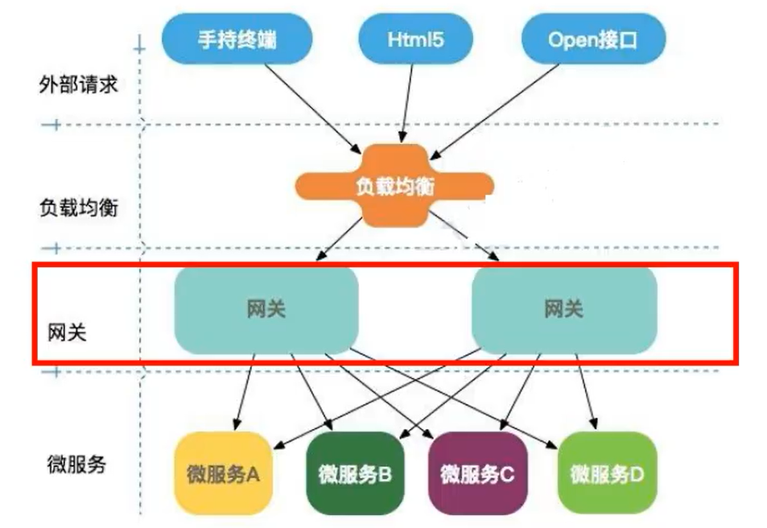
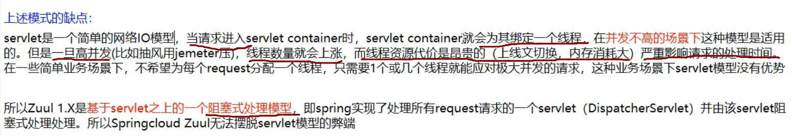
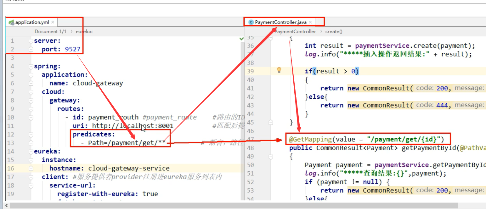
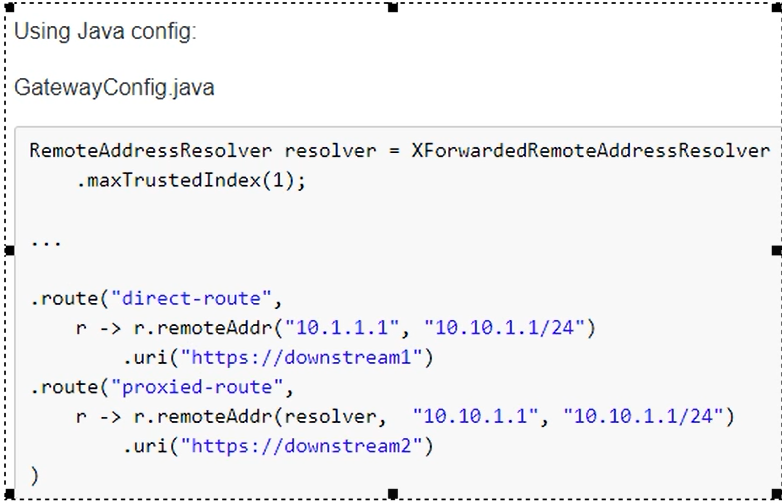

# 五、服务网关Gateway

# 一、Gateway概述


## 1、Gateway是什么


gateway 官网：[https://cloud.spring.io/spring-cloud-static/spring-cloud-gateway/2.2.1.RELEASE/reference/html/](https://cloud.spring.io/spring-cloud-static/spring-cloud-gateway/2.2.1.RELEASE/reference/html/)


Cloud全家桶中有个很重要的组件就是网关，在1.x版本中都是采用Zuul网关；


但在2.x版本中，zuul的升级一直跳票，SpringCloud最后自己研发了一个网关代替Zuul，


那就是 SpringCloud Gateway  ，gateway是zuul 1.x版本的替代。


Gateway是在Spring生态系统之上架构的API网关服务，基于Spring 5，Spring Boot2 和Project Reactor等技术。


Gateway旨在提供一种简单而有效的方式来对API进行路由，以及提供一些强大的过滤器功能，例如：熔断、限流、重试等。


SpringCloud Gateway作为Spring cloud生态系统中的网关，目标是代替 Zuul，在SpringCloud2.0以上版本中，没有对新版本的Zuul 2.0以上实现最新高性能版本进行集成，仍然还是使用的Zuul 1.x非Reactor模式的老版本。


而为了提升网关的性能，SpringCloud Gateway是基于WebFlux框架实现的，而WebFlux框架底层则使用了高性能的Reactor模式通信框架Netty，【说穿了就是 SpringCloud Gateway是异步非阻塞式】


**gateway之所以性能好,****<font style="color:#E8323C;">因为底层使用WebFlux,而webFlux底层使用netty通信(NIO)</font>**


Spring Cloud Gateway的目标<font style="color:#E8323C;">提供统一的路由方式且基于Filter链的方式提供了网关基本的功能，例如：安全，监控/指标，和限流。</font>


## 2、Gateway能干什么


+  反向代理 
+  鉴权 
+  流量控制 
+  熔断 
+  日志监控 


## 3、微服务架构中网关在哪里





## 4、SpringCloud Gateway具有的特征


+  基于Spring Frameword5 ,Project Reactor 和 SpringBoot 2.0进行构建； 
+  动态路由：能够匹配任何请求属性 
+  可以对路由指定Predicate(断言)和Filter（过滤器） 
+  集成Hystrix的断路器功能； 
+  集成Spring Cloud的服务发现功能 
+  易于编写的Predicate（断言）和Filter（过滤器） 
+  请求限流功能； 
+  支持路径重写 


## 5、SpringCloud Gateway与zuul的区别


在SpringCloud Finchley 正式版之前，SpringCloud推荐的网关是Netflix提供的zuul。


1.  Zuul1.x 是一个基于阻塞 I/O的API网关 
2.  Zuul1.x 基于Servlet2.5使用阻塞架构它不支持任何长连接 （如WebSocket）Zuul的设计模式和Nginx较像，每次I/O操作都是从工作线程中选择一个执行，请求线程被阻塞到工作线程完成，但是差别是Nginx用C++实现，Zuul用java实现，而JVM本身会有第一次加载较慢的情况，使得Zuul的性能相对较差。 
3.  Zuul 2.x理念更加先进，想基于Netty非阻塞和支持长连接，但SpringCloud目前还没有整合。Zuul2.x的性能较Zuul 1.x有较大的提升。在性能方面，根据官方提供的基准测试，Spring Cloud Gateway的RPS（每秒请求次数）是Zuul的1.6倍。 
4.  Spring Cloud Gateway建立在Spring Framework 5、project Reactor和Spring Boot2 之上，使用非阻塞API。 
5.  Spring Cloud Gateway 还支持WebSocket，并且与Spring紧密集成拥有更好的开发体验。 


## 6、zuul1.x的模型:





## 7、什么是webflux:


**是一个非阻塞的web框架,类似springmvc这样的**


# 二、Gateway的三大核心概念


## 1、Route路由


路由是构建网关的基本模块，它由ID，目标URI，一系列的断言和过滤器组成，如果断言为true则匹配该路由。


就是根据某些规则,将请求发送到指定服务上


## 2、Predicate 断言


开发人员可以匹配Http请求中的所有内容（例如请求头或者请求参数），如果请求参数与断言相匹配则进行路由。


就是判断,如果符合条件就是xxxx,反之yyyy


## 3、Filter 过滤


指的是Spring框架中的GatewayFilter的实例，使用过滤器，可以在请求被路由前或者之后对请求进行修改。


**<font style="color:#E8323C;">路由前后,过滤请求</font>**


## 4、总结


+  web 请求，通过一些匹配条件，定位到真正的服务节点。并在这个转发过程的前后，进行一些精细化控制 
+  predicate 就是我们的匹配条件 
+  filter：就可以理解为一个无所不能的拦截器，有了这两个元素，再加上目标的uri，就可以实现一个具体的路由了。 


# 三、Spring Cloud Gateway工作流程


+  客户端向Spring Cloud Gateway发出请求，然后在Gateway Handler Mapping 中找到与请求相匹配的路由，将其发送到Gateway Web Handler 
+  Handler 再通过指定的过滤器链来将请求发送到我们实际的服务执行业务逻辑，然后返回。 
+  过滤器之间使用虚线分开是因为过滤器可能会在发送代理请求之前（"pre"） 或之后("post")执行业务逻辑。 
+  Filter在“pre”类型的过滤器可以做**参数校验，权限校验，流量监控，日志输出，协议转换**等。 
+  在“post”类型的过滤器中可以做**响应内容、响应头的修改，日志的输出，流量监控**等有着非常重要的作用。 


核心逻辑：<font style="color:#E8323C;">路由转发+执行过滤器链</font>


# 四、入门配置


## 1、创建模块


cloud-gateway-gateway9527


## 2、pom


做网关不需要添加  web starter


```xml
<?xml version="1.0" encoding="UTF-8"?>
<project xmlns="http://maven.apache.org/POM/4.0.0"
         xmlns:xsi="http://www.w3.org/2001/XMLSchema-instance"
         xsi:schemaLocation="http://maven.apache.org/POM/4.0.0 http://maven.apache.org/xsd/maven-4.0.0.xsd">
    <parent>
        <artifactId>cloud2020</artifactId>
        <groupId>com.atguigu.springcloud</groupId>
        <version>1.0-SNAPSHOT</version>
    </parent>
    <modelVersion>4.0.0</modelVersion>

    <artifactId>cloud-gateway-gateway9527</artifactId>

    <dependencies>
        <!--新增gateway-->
        <dependency>
            <groupId>org.springframework.cloud</groupId>
            <artifactId>spring-cloud-starter-gateway</artifactId>
        </dependency>
        <dependency>
            <groupId>com.atguigu.springcloud</groupId>
            <artifactId>cloud-api-commons</artifactId>
            <version>1.0-SNAPSHOT</version>
        </dependency>

        <dependency>
            <groupId>org.springframework.cloud</groupId>
            <artifactId>spring-cloud-starter-netflix-eureka-client</artifactId>
        </dependency>

        <dependency>
            <groupId>org.springframework.boot</groupId>
            <artifactId>spring-boot-devtools</artifactId>
            <scope>runtime</scope>
            <optional>true</optional>
        </dependency>

        <dependency>
            <groupId>org.projectlombok</groupId>
            <artifactId>lombok</artifactId>
            <optional>true</optional>
        </dependency>
        <dependency>
            <groupId>org.springframework.boot</groupId>
            <artifactId>spring-boot-starter-test</artifactId>
            <scope>test</scope>
        </dependency>

    </dependencies>

</project>
```


## 3、yaml 配置


```yaml
server:
  port: 9527

spring:
  application:
    name: cloud-gateway
  cloud:
    gateway:
      routes:
        - id: payment_routh #路由的ID，没有固定规则但要求唯一，建议配合服务名
          uri: http://localhost:8001   #匹配后提供服务的路由地址
          predicates:
            - Path=/payment/get/**   #断言,路径相匹配的进行路由
        # 上面表示 如果要访问http://localhost:8001/payment/get/** 需要 http://localhost:9527/payment/get/**

        - id: payment_routh2 #路由的ID，没有固定规则但要求唯一，建议配合服务名
          uri: http://localhost:8001 #匹配后提供服务的路由地址
          predicates:
            - Path=/payment/lb/**   #断言,路径相匹配的进行路由

eureka:
  instance:
    hostname: cloud-gateway-service
  client:
    fetch-registry: true
    register-with-eureka: true
    service-url:
      #defaultZone: http://eureka7001.com:7001/eureka,http://eureka7002.com:7002/eureka
      defaultZone: http://eureka7001.com:7001/eureka
```


## 4、主启动类


```java
package com.atguigu.springcloud;

import org.springframework.boot.SpringApplication;
import org.springframework.boot.autoconfigure.SpringBootApplication;
import org.springframework.cloud.netflix.eureka.EnableEurekaClient;

/**
 * @author: like
 * @Date: 2021/07/13 22:27
 */
@EnableEurekaClient
@SpringBootApplication
public class GateWayMain9527 {
    public static void main(String[] args) {
        SpringApplication.run(GateWayMain9527.class, args);
    }
}
```


## 5、测试


+  启动7001 
+  启动8001 
+  启动9527网关 
+  访问说明 
    -  启动网关前访问：[http://localhost:8001/payment/get/1](http://localhost:8001/payment/get/1) 
    -  启动网关后访问：[http://localhost:9527/payment/get/1](http://localhost:9527/payment/get/1) 





# 五、Gateway的网关配置


Gateway网关路由有两种配置方式：


## 1、在配置文件yaml中配置


```yaml
spring:
  application:
    name: cloud-gateway
  cloud:
    gateway:
      routes:
        - id: payment_routh #路由的ID，没有固定规则但要求唯一，建议配合服务名
          uri: http://localhost:8001   #匹配后提供服务的路由地址
          predicates:
            - Path=/payment/get/**   #断言,路径相匹配的进行路由
        # 上面表示 如果要访问http://localhost:8001/payment/get/** 需要 http://localhost:9527/payment/get/**

        - id: payment_routh2 #路由的ID，没有固定规则但要求唯一，建议配合服务名
          uri: http://localhost:8001 #匹配后提供服务的路由地址
          predicates:
            - Path=/payment/lb/**   #断言,路径相匹配的进行路由
```


## 2、代码中注入RouteLocator的bean


官网案例：





```java
package com.atguigu.springcloud.config;

import org.springframework.cloud.gateway.route.RouteLocator;
import org.springframework.cloud.gateway.route.builder.RouteLocatorBuilder;
import org.springframework.context.annotation.Bean;
import org.springframework.context.annotation.Configuration;

/**
 * @author: like
 * @Date: 2021/07/13 22:58
 */
@Configuration
public class GateWayConfig {

    @Bean
    public RouteLocator customRouteLocator(RouteLocatorBuilder routeLocatorBuilder) {
        RouteLocatorBuilder.Builder routes = routeLocatorBuilder.routes();

        routes.route("path_route_1",
                r -> r.path("/guonei")
                        .uri("http://news.baidu.com/guonei")).build();

        return routes.build();

    }

}
```


然后重启服务即可


# 六、配置动态路由


> 相当于给网关配置一个负载均衡
>
>  
>
> 上面的配置虽然实现了网关,但是是在配置文件中写死了要路由的地址
>
>  
>
> 现在需要修改,不指定地址,而是根据微服务名字进行路由,我们可以在注册中心获取某组微服务的地址
>


默认情况下Gateway会根据注册中心注册的服务列表，以注册中心上微服务名为路径创建动态路由进行转发，从而实现动态路由的功能


## 1、pom


```xml
<dependency>
    <groupId>org.springframework.cloud</groupId>
    <artifactId>spring-cloud-starter-netflix-eureka-client</artifactId>
</dependency>
```


## 2、yml配置


需要注意的是uri的协议为lb，表示启用Gateway的负载均衡功能。


lb://serviceName是spring Cloud Gateway在微服务中自动为我们创建的负载均衡uri


开启动态路由：`spring.cloud.gateway.discovery.locator.enabled:true;`


```yaml
server:
  port: 9527

spring:
  application:
    name: cloud-gateway
  cloud:
    gateway:
      discovery:
        locator:
          enabled: true #开启从注册中心动态创建路由的功能，利用微服务名进行路由
      routes:
        - id: payment_routh #路由的ID，没有固定规则但要求唯一，建议配合服务名
          #uri: http://localhost:8001   #匹配后提供服务的路由地址
          uri: lb://cloud-payment-service   #匹配后提供服务的路由地址
          predicates:
            - Path=/payment/get/**   #断言,路径相匹配的进行路由
        # 上面表示 如果要访问http://localhost:8001/payment/get/** 需要 http://localhost:9527/payment/get/**

        - id: payment_routh2 #路由的ID，没有固定规则但要求唯一，建议配合服务名
          #uri: http://localhost:8001 #匹配后提供服务的路由地址
          uri: lb://cloud-payment-service #匹配后提供服务的路由地址
          predicates:
            - Path=/payment/lb/**   #断言,路径相匹配的进行路由


eureka:
  instance:
    hostname: cloud-gateway-service
  client:
    fetch-registry: true
    register-with-eureka: true
    service-url:
      #defaultZone: http://eureka7001.com:7001/eureka,http://eureka7002.com:7002/eureka
      defaultZone: http://eureka7001.com:7001/eureka
```


## 3、测试


+ 启动：一个Eureka7001+两个服务提供者8001/8002
+ [http://localhost:9527/payment/lb](http://localhost:9527/payment/lb)


因为开启了8001和8002两个端口，所以网关负载均衡的效果是 8001/8002切换


# 七、Predicate 断言的使用


gateway启动时打印的信息


Spring Cloud Gateway 将路由匹配作为Spring WebFlux Handler Mapping基础架构的一部分。


Spring Cloud Gateway 包括许多内置的Route Predicate 工厂。所有这些Predicate都和Http请求的不同属性匹配。多个Route Predicate工厂可以进行组合。


Spring Cloud Gateway 创建route对象时，使用RoutePredicateFactory创建Predicate对象，Predicate对象可以赋值给Route。SpringCloud Gateway包含许多内置的Route Predicate Factories.


所有这些谓词都匹配Http请求的不同属性，多种谓词工厂可以组合，并通过逻辑and


官网对gateway的断言每个都写了栗子：[https://cloud.spring.io/spring-cloud-static/spring-cloud-gateway/2.2.1.RELEASE/reference/html/#the-after-route-predicate-factory](https://cloud.spring.io/spring-cloud-static/spring-cloud-gateway/2.2.1.RELEASE/reference/html/#the-after-route-predicate-factory)


## 1、常用的断言


常用的`Route Predicate`


**After Route Predicate**


匹配该断言时间之后的 uri请求


```yaml
- After=2020-03-08T10:59:34.102+08:00[Asia/Shanghai]
```


**Before Route Predicate**


与after类似,在指定时间之前的才可以访问


```yaml
- Before=2020-03-08T10:59:34.102+08:00[Asia/Shanghai]
```


**Between Route Predicate**


需要指定两个时间,在他们之间的时间才可以访问


```yaml
- Between=2020-03-08T10:59:34.102+08:00[Asia/Shanghai],2020-03-08T10:59:34.102+08:00[Asia/Shanghai]
```


**Cookie Route Predicate**


只有包含某些指定cookie(key,value),的请求才可以路由


不带cookies访问


带上cookies访问


```yaml
- Cookie=username,zhangsan   #并且Cookie是username=zhangsan才能访问
```


Cookie Route Predicate 需要两个参数，一个时Cookie name，一个是正则表达式。


路由规则会通过获取对应的Cookie name值和正则表达式去匹配，如果匹配上就会执行路由，如果没有匹配上就不执行


**Header Route Predicate**


只有包含指定请求头的请求,才可以路由


两个参数：一个是属性名称和一个正则表达式，这个属性值和正则表达式匹配则执行；


```yaml
- Header=X-Request-Id,\d+ # 请求头要有X-Request-Id属性并且值为整数的正则表达式
```


**Host Route Predicate**


只有指定主机的才可以访问,  
比如我们当前的网站的域名是www.aa.com  
那么这里就可以设置,只有用户是www.aa.com的请求,才进行路由


接收一组参数，一组匹配的域名列表，这个模板是一个ant分隔的模板，用.号作为分隔符。


它通过参数中的主机地址作为匹配规则。


```yaml
- Host=**.atguigu.com
```


**Method Route Predicate**


只有指定请求才可以路由,比如get请求...


```yaml
- Method=GET
```


**Path Route Predicate**


只有访问指定路径,才进行路由  
比如访问,/abc才路由


```yaml
- Path=/payment/lb/**   #断言,路径相匹配的进行路由
```


**Query Route Predicate**


必须带有请求参数才可以访问


```yaml
- Query=username, \d+ #要有参数名username并且是正整数才能路由
```


## 2、小总结


+ 说白了，Predicate就是为了实现一组匹配规则，让请求过来找到对应的Route进行处理


```yaml
server:
  port: 9527
spring:
  application:
    name: cloud-gateway
  cloud:
    gateway:
      discovery:
        locator:
          enabled: true  #开启从注册中心动态创建路由的功能，利用微服务名进行路由
      routes:
        - id: payment_routh #路由的ID，没有固定规则但要求唯一，建议配合服务名
          #uri: http://localhost:8001   #匹配后提供服务的路由地址
          uri: lb://cloud-payment-service
          predicates:
            - Path=/payment/get/**   #断言,路径相匹配的进行路由
 
        - id: payment_routh2
          #uri: http://localhost:8001   #匹配后提供服务的路由地址
          uri: lb://cloud-payment-service
          predicates:
            - Path=/payment/lb/**   #断言,路径相匹配的进行路由
            #- After=2020-03-08T10:59:34.102+08:00[Asia/Shanghai]
            #- Cookie=username,zhangshuai #并且Cookie是username=zhangshuai才能访问
            #- Header=X-Request-Id, \d+ #请求头中要有X-Request-Id属性并且值为整数的正则表达式
            #- Host=**.atguigu.com
            #- Method=GET
            #- Query=username, \d+ #要有参数名称并且是正整数才能路由
 
 
eureka:
  instance:
    hostname: cloud-gateway-service
  client:
    service-url:
      register-with-eureka: true
      fetch-registry: true
      defaultZone: http://eureka7001.com:7001/eureka
```


# 八、Filter的使用


## 1、Filter是什么


路由过滤器可用于修改进入的Http请求和返回的Http响应，路由过滤器只能过滤指定路由进行使用。


Spring Cloud Gateway 内置了多种路由过滤器，他们都由GatewayFilter的工厂类来产生


官网：[https://cloud.spring.io/spring-cloud-static/spring-cloud-gateway/2.2.1.RELEASE/reference/html/#gatewayfilter-factories](https://cloud.spring.io/spring-cloud-static/spring-cloud-gateway/2.2.1.RELEASE/reference/html/#gatewayfilter-factories)


## 2、spring Cloud Gateway的Filter


### 声明周期 ：


**pre  在业务逻辑之前**


**post  在业务逻辑之后**


### 种类：


**单一的：GatewayFilter**


**全局的：GlobalFilter**


## 3、自定义过滤器


### 两个接口


impiemerts  `GlobalFilter`，`Ordered`


### 能干吗


全局日志记录


统一网关鉴权


### 示例代码


```java
package com.atguigu.springcloud.filter;

import lombok.extern.slf4j.Slf4j;
import org.springframework.cloud.gateway.filter.GatewayFilterChain;
import org.springframework.cloud.gateway.filter.GlobalFilter;
import org.springframework.core.Ordered;
import org.springframework.http.HttpStatus;
import org.springframework.stereotype.Component;
import org.springframework.util.StringUtils;
import org.springframework.web.server.ServerWebExchange;
import reactor.core.publisher.Mono;

import java.util.Date;

/**
 * @author: like
 * @Date: 2021/07/14 8:14
 */
@Component
@Slf4j
public class MyLogGateWayFilter implements GlobalFilter, Ordered {


    @Override
    public Mono<Void> filter(ServerWebExchange exchange, GatewayFilterChain chain) {
        log.info("************come in MyLogGateWayFilter：" + new Date());
        String uname = exchange.getRequest().getQueryParams().getFirst("uname");
        if (StringUtils.isEmpty(uname)) {
            log.info("*********用户名为null，非法用户");
            exchange.getResponse().setStatusCode(HttpStatus.NOT_ACCEPTABLE);
            return exchange.getResponse().setComplete();
        }
        return chain.filter(exchange);
    }

    @Override
    public int getOrder() {
        return 0;
    }
}
```


**然后启动服务,即可,因为过滤器通过@COmponet已经加入到容器了**


> 更新: 2022-08-22 08:49:09  
> 原文: <https://www.yuque.com/like321/xgwgyr/geuyf8>