# 八、消息驱动

# 一、Spring Cloud Stream


```java
现在一个很项目可能分为三部分:
			前端--->后端---->大数据
			而后端开发使用消息中间件,可能会使用RabbitMq
			而大数据开发,一般都是使用Kafka,
			那么一个项目中有多个消息中间件,对于程序员,因为人员都不友好
```


而Spring Cloud Stream就类似jpa，屏蔽底层消息中间件的差异，程序员主要操作Spring Cloud Stream即可。


不需要管底层是kafka还是rabbitMq


## 1、消息驱动概述


### 是什么


<font style="color:#E8323C;">屏蔽底层消息中间件的差异，降低切换成本，统一消息的</font>**<font style="color:#E8323C;">编程模型</font>**<font style="color:#E8323C;">。</font>


[官方文档1](https://spring.io/projects/spring-cloud-stream#overview)


[官方文档2](https://cloud.spring.io/spring-cloud-static/spring-cloud-stream/3.0.1.RELEASE/reference/html)


[Cloud Stream中文指导手册](https://m.wang1314.com/doc/webapp/topic/20971999.html)


什么是Spring Cloud Stream？


官方定义Spring Cloud Stream是一个构建消息驱动微服务的框架。


应用程序通过inputs或者 outputs 来与Spring Cloud Stream中binder对象交互。


通过我们配置来binding(绑定)，而Spring Cloud Stream 的binder对象负责与消息中间件交互。所以，我们只需要搞清楚如何与Spring Cloud Stream交互就可以方便使用消息驱动的方式。


通过使用Spring Integration来连接消息代理中间件以实现消息事件驱动。  
Spring Cloud Stream为一些供应商的消息中间件产品提供了个性化的自动化配置实现，引用了发布-订阅、消费组、分区的三个核心概念。


目前仅支持RabbitMQ、 Kafka。


### 设计思想


#### 标准MQ


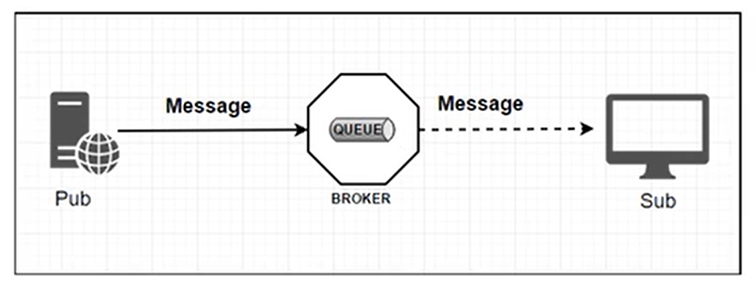


+ 生产者/消费者之间靠**消息**媒介传递信息内容 
    - Message
+ 消息必须走特定的通道 
    - 消息通道 Message Channel
+ 消息通道里的消息如何被消费呢，谁负责收发**处理** 
    - 消息通道MessageChannel的子接口SubscribableChannel，由MessageHandler消息处理器所订阅。


#### 为什么用Cloud Stream？


比方说我们用到了RabbitMQ和Kafka，由于这两个消息中间件的架构上的不同，


像RabbitMQ有exchange，kafka有Topic和Partitions分区。


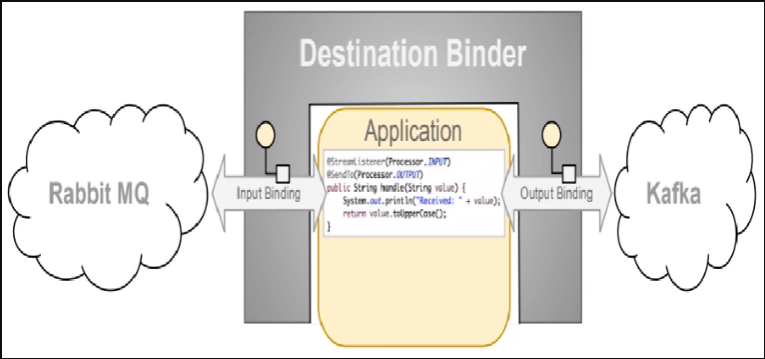


这些中间件的差异性导致我们实际项目开发给我们造成了一定的困扰，我们如果用了两个消息队列的其中一种，后面的业务需求，我想往另外一种消息队列进行迁移，这时候无疑就是一个灾难性的，**一大堆东西都要重新推倒重新做**，因为它跟我们的系统耦合了，这时候Spring Cloud Stream给我们提供了—种解耦合的方式。


+ **Stream凭什么可以统一底层差异？**


在没有绑定器这个概念的情况下，我们的SpringBoot应用要直接与消息中间件进行信息交互的时候，由于各消息中间件构建的初衷不同，它们的实现细节上会有较大的差异性


通过定义绑定器作为中间层，完美地实现了**应用程序与消息中间件细节之间的隔离**。通过向应用程序暴露统一的Channel通道，使得应用程序不需要再考虑各种不同的消息中间件实现。


**通过定义绑定器Binder作为中间层，实现了应用程序与消息中间件细节之间的隔离。**


+  **Binder：**  
INPUT对应于消费者  
OUTPUT对应于生产者 


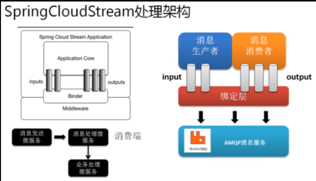


#### Stream中的消息通信方式遵循了发布-订阅模式


Topic主题进行广播


+ 在RabbitMQ就是Exchange
+ 在Kakfa中就是Topic


### Spring Cloud Stream标准流程套路


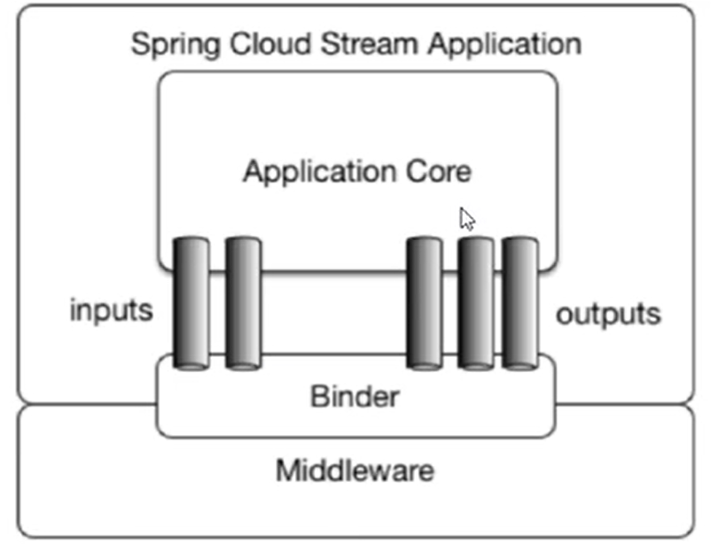


	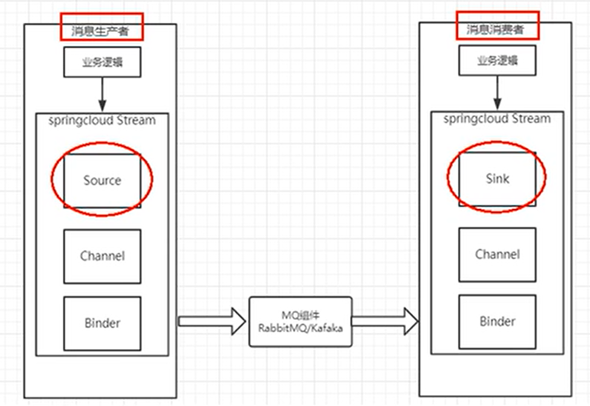


+  Binder 
    - 很方便的连接中间件，屏蔽差异。
+  Channel 
    - 通道，是队列Queue的一种抽象，在消息通讯系统中就是实现存储和转发的媒介，通过Channel对队列进行配置。
+  Source和Sink 
    - 简单的可理解为参照对象是Spring Cloud Stream自身，从Stream发布消息就是输出，接受消息就是输入。


```plain
类似flume中的channel,source,sink  估计是借鉴(抄袭)的
  	source用于获取数据(要发送到mq的数据)
  	channel类似SpringCloudStream中的中间件,用于存放source接收到的数据,或者是存放binder拉取的数据
```


### 编码API和常用注解


| **组成** | **说明** |
| --- | --- |
| Middleware | 中间件，目前只支持RabbitMQ和Kafka |
| Binder | Binder是应用与消息中间件之间的封装，目前实行了Kafka和RabbitMQ的Binder，通过Binder可以很方便的连接中间件，可以动态的改变消息类型(对应于Kafka的topic,RabbitMQ的exchange)，这些都可以通过配置文件来实现 |
| [@Input ](/Input ) | 注解标识输入通道，通过该输乎通道接收到的消息进入应用程序 |
| [@Output ](/Output ) | 注解标识输出通道，发布的消息将通过该通道离开应用程序 |
| [@StreamListener ](/StreamListener ) | 监听队列，用于消费者的队列的消息接收 |
| [@EnableBinding ](/EnableBinding ) | 指信道channel和exchange绑定在一起 |


## 2、案例说明


准备RabbitMQ环境


工程中新建三个子模块


cloud-stream-rabbitmq-provider8801，作为生产者进行发消息模块  
cloud-stream-rabbitmq-consumer8802，作为消息接收模块  
cloud-stream-rabbitmq-consumer8803，作为消息接收模块


## 3、消息驱动之生产者


### 新建Module


cloud-stream-rabbitmq-provider8801


### pom


```xml
<?xml version="1.0" encoding="UTF-8"?>
<project xmlns="http://maven.apache.org/POM/4.0.0"
         xmlns:xsi="http://www.w3.org/2001/XMLSchema-instance"
         xsi:schemaLocation="http://maven.apache.org/POM/4.0.0 http://maven.apache.org/xsd/maven-4.0.0.xsd">
    <parent>
        <artifactId>cloud2020</artifactId>
        <groupId>com.atguigu.springcloud</groupId>
        <version>1.0-SNAPSHOT</version>
    </parent>
    <modelVersion>4.0.0</modelVersion>

    <artifactId>cloud-stream-rabbitmq-provider8801</artifactId>

    <dependencies>
        <dependency>
            <groupId>org.springframework.boot</groupId>
            <artifactId>spring-boot-starter-web</artifactId>
        </dependency>
        <dependency>
            <groupId>org.springframework.boot</groupId>
            <artifactId>spring-boot-starter-actuator</artifactId>
        </dependency>
        <dependency>
            <groupId>org.springframework.cloud</groupId>
            <artifactId>spring-cloud-starter-netflix-eureka-client</artifactId>
        </dependency>
        
        <dependency>
            <groupId>org.springframework.cloud</groupId>
            <artifactId>spring-cloud-starter-stream-rabbit</artifactId>
        </dependency>
        
        <!--基础配置-->
        <dependency>
            <groupId>org.springframework.boot</groupId>
            <artifactId>spring-boot-devtools</artifactId>
            <scope>runtime</scope>
            <optional>true</optional>
        </dependency>
        <dependency>
            <groupId>org.projectlombok</groupId>
            <artifactId>lombok</artifactId>
            <optional>true</optional>
        </dependency>
        <dependency>
            <groupId>org.springframework.boot</groupId>
            <artifactId>spring-boot-starter-test</artifactId>
            <scope>test</scope>
        </dependency>
    </dependencies>

</project>
```


### yml


```yaml
server:
  port: 8801

spring:
  application:
    name: cloud-stream-provider
  cloud:
    stream:
      binders: # 在此处配置要绑定的rabbitmq的服务信息；
        defaultRabbit: # 表示定义的名称，用于于binding整合
          type: rabbit # 消息组件类型
          environment: # 设置rabbitmq的相关的环境配置
            spring:
              rabbitmq:
                host: 118.25.37.107
                port: 5672
                username: admin
                password: 123456
      bindings: # 服务的整合处理
        output: # 这个名字是一个通道的名称
          destination: studyExchange # 表示要使用的Exchange名称定义
          content-type: application/json # 设置消息类型，本次为json，文本则设置“text/plain”
          binder: defaultRabbit # 设置要绑定的消息服务的具体设置

eureka:
  client: # 客户端进行Eureka注册的配置
    service-url:
      defaultZone: http://localhost:7001/eureka
  instance:
    lease-renewal-interval-in-seconds: 2 # 设置心跳的时间间隔（默认是30秒）
    lease-expiration-duration-in-seconds: 5 # 如果现在超过了5秒的间隔（默认是90秒）
    instance-id: send-8801.com  # 在信息列表时显示主机名称
    prefer-ip-address: true     # 访问的路径变为IP地址
```


### 主启动类


```java
package com.atguigu.springcloud;

import org.springframework.boot.SpringApplication;
import org.springframework.boot.autoconfigure.SpringBootApplication;

/**
 * @author: like
 * @Date: 2021/07/27 8:24
 */
@SpringBootApplication
public class StreamMQMain8801 {

    public static void main(String[] args) {
        SpringApplication.run(StreamMQMain8801.class, args);
    }

}
```


### 业务类


+ 发送消息接口


```java
package com.atguigu.springcloud.service;

/**
 * @author: like
 * @Date: 2021/07/27 8:27
 */
public interface IMessageProvider  {

    public String send();

}
```


+ 发送消息接口实现类


```java
package com.atguigu.springcloud.service.imap;

import com.atguigu.springcloud.service.IMessageProvider;
import org.springframework.cloud.stream.annotation.EnableBinding;
import org.springframework.cloud.stream.messaging.Source;
import org.springframework.integration.support.MessageBuilder;
import org.springframework.messaging.MessageChannel;

import javax.annotation.Resource;
import java.util.UUID;

/**
 * @author: like
 * @Date: 2021/07/27 8:28
 */
@EnableBinding(Source.class) //定义消息的推送管道
public class MessageProviderImpl implements IMessageProvider {

    @Resource
    private MessageChannel output; //消息发送管道

    @Override
    public String send() {
        String serial = UUID.randomUUID().toString();
        output.send(MessageBuilder.withPayload(serial).build());
        System.out.println("******serial：" + serial);
        return null;
    }
}
```


+ controller


```java
package com.atguigu.springcloud.controller;

import com.atguigu.springcloud.service.IMessageProvider;
import org.springframework.web.bind.annotation.GetMapping;
import org.springframework.web.bind.annotation.RestController;

import javax.annotation.Resource;

/**
 * @author: like
 * @Date: 2021/07/27 8:59
 */
@RestController
public class SendMessageController {

    @Resource
    private IMessageProvider messageProvider;

    @GetMapping("/sendMessage")
    public String sendMessage(){
        return messageProvider.send();
    }

}
```


### 测试


+  启动7001eureka 
+  启动rabbitmq 
+  启动8801  
启动8801后,会在rabbitmq中创建一个Exchange,就是我们配置文件中配置的exchange 


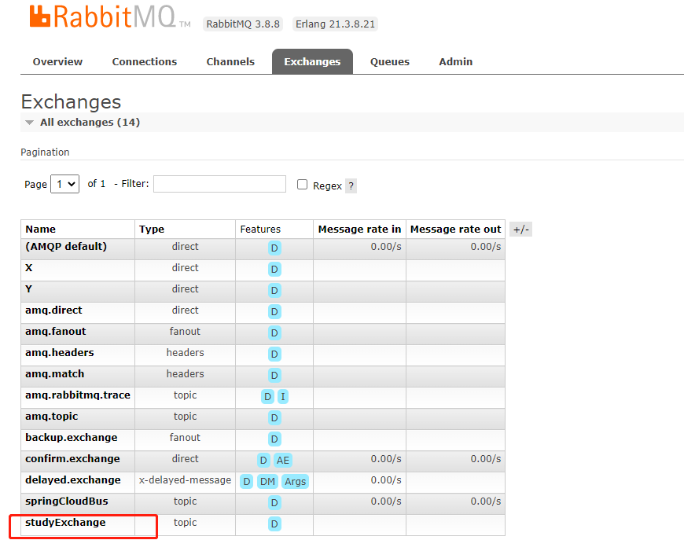


+  访问  
[http://localhost:8801/sendMessage](http://localhost:8801/sendMessage) 


## 4、消息驱动之消费者


### 新建model


cloud-stream-rabbitmq-consumer8802


### pom


```xml
<?xml version="1.0" encoding="UTF-8"?>
<project xmlns="http://maven.apache.org/POM/4.0.0"
         xmlns:xsi="http://www.w3.org/2001/XMLSchema-instance"
         xsi:schemaLocation="http://maven.apache.org/POM/4.0.0 http://maven.apache.org/xsd/maven-4.0.0.xsd">
    <parent>
        <artifactId>cloud2020</artifactId>
        <groupId>com.atguigu.springcloud</groupId>
        <version>1.0-SNAPSHOT</version>
    </parent>
    <modelVersion>4.0.0</modelVersion>

    <artifactId>cloud-stream-rabbitmq-consumer8802</artifactId>


    <dependencies>
        <dependency>
            <groupId>org.springframework.boot</groupId>
            <artifactId>spring-boot-starter-web</artifactId>
        </dependency>
        <dependency>
            <groupId>org.springframework.cloud</groupId>
            <artifactId>spring-cloud-starter-netflix-eureka-client</artifactId>
        </dependency>
        
        <dependency>
            <groupId>org.springframework.cloud</groupId>
            <artifactId>spring-cloud-starter-stream-rabbit</artifactId>
        </dependency>
        
        <dependency>
            <groupId>org.springframework.boot</groupId>
            <artifactId>spring-boot-starter-actuator</artifactId>
        </dependency>
        <!--基础配置-->
        <dependency>
            <groupId>org.springframework.boot</groupId>
            <artifactId>spring-boot-devtools</artifactId>
            <scope>runtime</scope>
            <optional>true</optional>
        </dependency>
        <dependency>
            <groupId>org.projectlombok</groupId>
            <artifactId>lombok</artifactId>
            <optional>true</optional>
        </dependency>
        <dependency>
            <groupId>org.springframework.boot</groupId>
            <artifactId>spring-boot-starter-test</artifactId>
            <scope>test</scope>
        </dependency>
    </dependencies>

</project>
```


### yml


```yaml
server:
  port: 8802

spring:
  application:
    name: cloud-stream-consumer
  cloud:
    stream:
      binders: # 在此处配置要绑定的rabbitmq的服务信息；
        defaultRabbit: # 表示定义的名称，用于于binding整合
          type: rabbit # 消息组件类型
          environment: # 设置rabbitmq的相关的环境配置
            spring:
              rabbitmq:
                host: 118.25.37.107
                port: 5672
                username: admin
                password: 123456
      bindings: # 服务的整合处理
        input: # 这个名字是一个通道的名称
          destination: studyExchange # 表示要使用的Exchange名称定义
          content-type: application/json # 设置消息类型，本次为对象json，如果是文本则设置“text/plain”
          binder: defaultRabbit # 设置要绑定的消息服务的具体设置

eureka:
  client: # 客户端进行Eureka注册的配置
    service-url:
      defaultZone: http://localhost:7001/eureka
  instance:
    lease-renewal-interval-in-seconds: 2 # 设置心跳的时间间隔（默认是30秒）
    lease-expiration-duration-in-seconds: 5 # 如果现在超过了5秒的间隔（默认是90秒）
    instance-id: receive-8802.com  # 在信息列表时显示主机名称
    prefer-ip-address: true     # 访问的路径变为IP地址
```


### 主启动类


```java
package com.atguigu.springcloud;

import org.springframework.boot.SpringApplication;
import org.springframework.boot.autoconfigure.SpringBootApplication;

/**
 * @author: like
 * @Date: 2021/07/27 21:47
 */
@SpringBootApplication
public class StreamMQMain8802 {

    public static void main(String[] args) {
        SpringApplication.run(StreamMQMain8802.class, args);
    }

}
```


### 业务类


```java
package com.atguigu.springcloud.controller;

import org.springframework.beans.factory.annotation.Value;
import org.springframework.cloud.stream.annotation.EnableBinding;
import org.springframework.cloud.stream.annotation.StreamListener;
import org.springframework.cloud.stream.messaging.Sink;
import org.springframework.messaging.Message;
import org.springframework.stereotype.Component;

/**
 * @author: like
 * @Date: 2021/07/27 21:49
 */
@Component
@EnableBinding(Sink.class)
public class ReceiveMessageListenerController {

    @Value("${server.port}")
    private String serverPort;

    @StreamListener(Sink.INPUT)
    public void input(Message<String> message) {
        System.out.println("消费者1号，------》接收到的消息：" + message.getPayload() + "\t port：" + serverPort);
    }
}
```


### 测试


+  启动EurekaMain7001 
+  启动StreamMQMain8801 
+  启动StreamMQMain8802 
+  8801发送8802接收消息  
[http://localhost:8801/sendMessage](http://localhost:8801/sendMessage) 


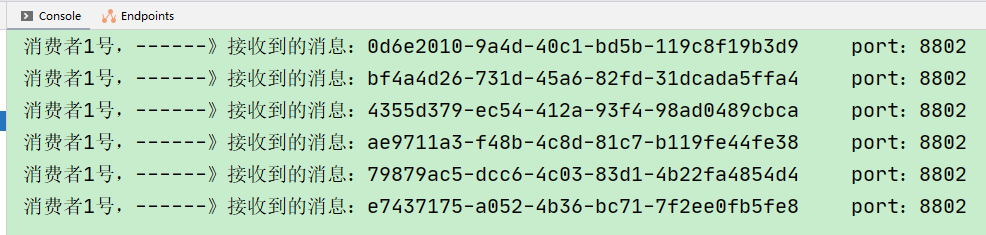


## 5、Stream之消息重复消费


依照8802，克隆出来一份运行8803 - cloud-stream-rabbitmq-consumer8803。


### 启动


+ RabbitMQ
+ 服务注册 - 7001
+ 消息生产 - 8801
+ 消息消费 - 8802
+ 消息消费 - 8803


### 运行后有两个问题


1. 有重复消费问题
2. 消息持久化问题


### 消费


+ [http://localhost:8801/sendMessage](http://localhost:8801/sendMessage)
+ 目前是8802/8803同时都收到了，存在重复消费问题
+ 如何解决：分组和持久化属性group（重要）


### 生产实际案例


比如在如下场景中，订单系统我们做集群部署，都会从RabbitMQ中获取订单信息，那如果一个订单同时被两个服务获取到，那么就会造成数据错误，我们得避免这种情况。


这时我们就可以**使用Stream中的消息分组来解决**。


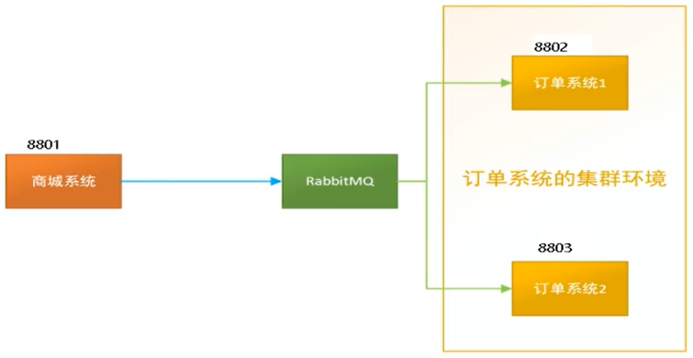


注意：在Stream中处于同一个group中的多个消费者是竞争关系，就能够保证消息只会被其中一个应用消费一次。


**不同组是可以全面消费的(重复消费)。**


**同一组内会发生竞争关系，只有其中一个可以消费。**


## 6、Stream之group解决消息重复消费


### 原理


微服务应用放置于同一个group中，就能够保证消息只会被其中一个应用消费一次。


**不同的组**是可以重复消费的，同一个组内会发生竞争关系，只有其中一个可以消费。


### 8802/8803都变成不同组，group两个不同


+ 8802修改YML


```yaml
server:
  port: 8802

spring:
  application:
    name: cloud-stream-consumer
  cloud:
    stream:
      binders: # 在此处配置要绑定的rabbitmq的服务信息；
        defaultRabbit: # 表示定义的名称，用于于binding整合
          type: rabbit # 消息组件类型
          environment: # 设置rabbitmq的相关的环境配置
            spring:
              rabbitmq:
                host: 118.25.37.107
                port: 5672
                username: admin
                password: 123456
      bindings: # 服务的整合处理
        input: # 这个名字是一个通道的名称
          destination: studyExchange # 表示要使用的Exchange名称定义
          content-type: application/json # 设置消息类型，本次为对象json，如果是文本则设置“text/plain”
          binder: defaultRabbit # 设置要绑定的消息服务的具体设置
          group: atguiguA # /////////////关键////////////////////////////

eureka:
  client: # 客户端进行Eureka注册的配置
    service-url:
      defaultZone: http://localhost:7001/eureka
  instance:
    lease-renewal-interval-in-seconds: 2 # 设置心跳的时间间隔（默认是30秒）
    lease-expiration-duration-in-seconds: 5 # 如果现在超过了5秒的间隔（默认是90秒）
    instance-id: receive-8802.com  # 在信息列表时显示主机名称
    prefer-ip-address: true     # 访问的路径变为IP地址
```


+ 8803修改YML


```yaml
server:
  port: 8803

spring:
  application:
    name: cloud-stream-consumer
  cloud:
    stream:
      binders: # 在此处配置要绑定的rabbitmq的服务信息；
        defaultRabbit: # 表示定义的名称，用于于binding整合
          type: rabbit # 消息组件类型
          environment: # 设置rabbitmq的相关的环境配置
            spring:
              rabbitmq:
                host: 118.25.37.107
                port: 5672
                username: admin
                password: 123456
      bindings: # 服务的整合处理
        input: # 这个名字是一个通道的名称
          destination: studyExchange # 表示要使用的Exchange名称定义
          content-type: application/json # 设置消息类型，本次为对象json，如果是文本则设置“text/plain”
          binder: defaultRabbit # 设置要绑定的消息服务的具体设置
          group: atguiguB  # /////////////关键////////////////////////////

eureka:
  client: # 客户端进行Eureka注册的配置
    service-url:
      defaultZone: http://localhost:7001/eureka
  instance:
    lease-renewal-interval-in-seconds: 2 # 设置心跳的时间间隔（默认是30秒）
    lease-expiration-duration-in-seconds: 5 # 如果现在超过了5秒的间隔（默认是90秒）
    instance-id: receive-8803.com  # 在信息列表时显示主机名称
    prefer-ip-address: true     # 访问的路径变为IP地址
```


+ 结论： 
    - 还是重复消费


### 8802/8803实现了轮询分组，每次只有一个消费者


8801模块的发的消息只能被8802或8803其中一个接收到，这样避免了重复消费。


**8802/8803都变成相同组，group两个相同**


+  8802修改YML`group: atguiguA` 
+  8803修改YML`group: atguiguA` 
+  结论： 
    - 同一个组的多个微服务实例，每次只会有一个拿到


**可以看到,每人只消费了一条消息,并且没有重复消费**


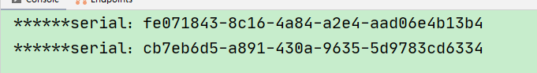


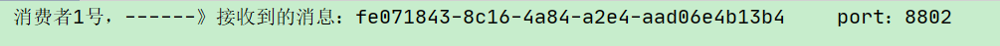


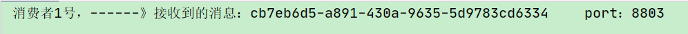


## 7、Stream之消息持久化


通过上述，解决了重复消费问题，再看看持久化。


停止8802/8803并去除掉8802的分组group: atguiguA，8803的分组group: atguiguA没有去掉。


8801先发送4条消息到RabbitMq。


先启动8802，无分组属性配置，后台没有打出来消息。


再启动8803，有分组属性配置，后台打出来了MQ上的消息。(消息持久化体现)


总结:  
也就是,当我们没有配置分组时,会出现消息漏消费的问题


		而配置分组后,我们可以自动获取未消费的数据


> 更新: 2022-08-19 18:26:38  
> 原文: <https://www.yuque.com/like321/xgwgyr/acp7h2>