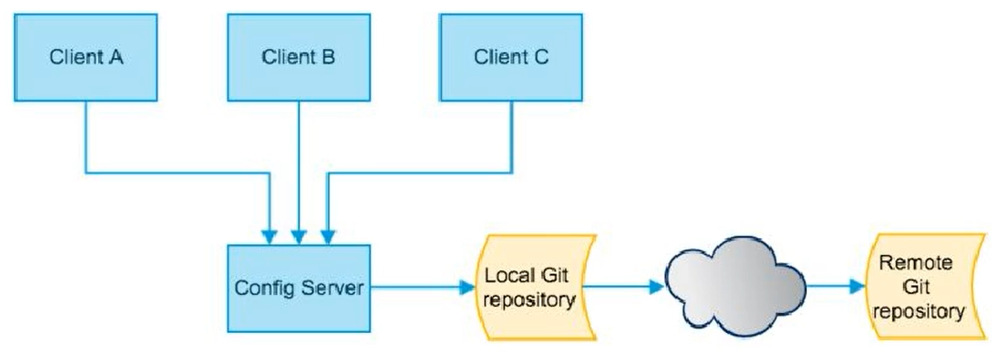
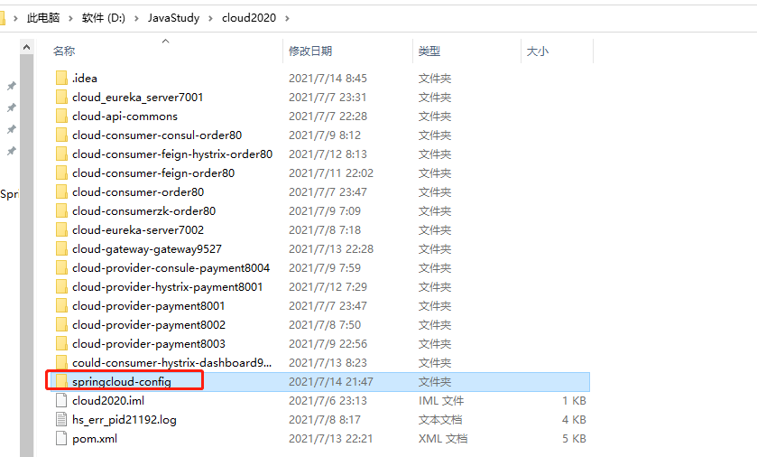
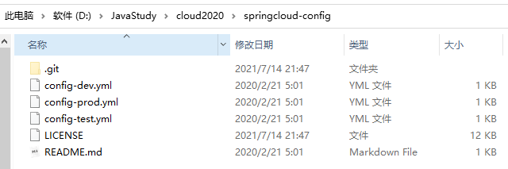
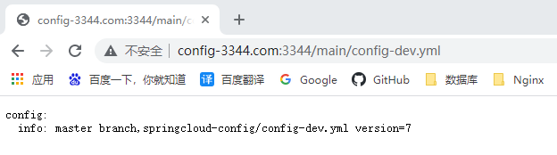
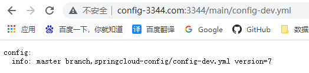
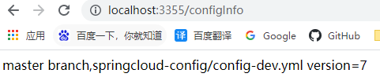

# 六、Config分布式配置中心

# 一、分布式配置中心概述


## 1、分布式系统面临的---配置问题


微服务意味着要将单体应用中的业务拆分成一个个子服务，每个服务的粒度相对较小，因此系统中会出现大量的服务。


由于每个服务都需要必要的配置信息才能够运行，所以一套集中式的，动态的配置管理设施是必不可少的。


SpringCloud提供了ConfigServer【配置中心】来解决这个问题，我们每一个微服务自己都带着一个`application.yaml`，上百个配置文件的管理就要管理上百个`application.yaml`


## 2、配置中心是什么





SpringCloud Config为微服务架构中的微服务提供集中化的外部配置支持，配置服务器为各个不同微服务应用的所有环境提供了一个中心化的外部配置


官网： [https://cloud.spring.io/spring-cloud-static/spring-cloud-config/2.2.1.RELEASE/reference/html/](https://cloud.spring.io/spring-cloud-static/spring-cloud-config/2.2.1.RELEASE/reference/html/)


由于SpringCloud Config默认使用Git来存储配置文件，最推荐与github整合。


## 3、配置中心怎么用


SpringCloud Config 分为服务端和客户端两部分。


服务端也称为分布式配置中心，他是一个独立的微服务应用，用来连接配置服务器并为客户端提供获取配置信息，加密/解密信息等访问接口。


客户端则是通过指定的配置中心来管理应用资源，以及与业务相关的配置内容，并在启动的时候从配置中心获取和加载配置信息配置服务器默认采用git来存储配置信息，这样既有助于对环境配置进行版本管理，并且可以通过git客户端工具来方便的管理和访问配置内容。


## 4、配置中心能干什么


+ 集中管理配置文件
+ 不同环境不同配置，动态化的配置更新，分环境部署比如 dev/test/prod/beta/release
+ 运行期间动态调整配置，不再需要在每个服务部署的机器上编写配置文件，服务会向配置中心统一拉取配置自己的信息。
+ **当配置发生变动时，服务不需要重启即可感知到配置的变化并应用新的配置。**
+ **将配置信息以Rest接口的形式暴露。**


# 二、Config服务端配置与测试


## 1、搭建


### 在github上创建一个springcloud-config的新Repository


### 获得新仓库的地址：git@github.com:like0321/springcloud-config.git


### 本地硬盘目录上新建git仓库并clone





### 此时在本地E盘符下





该文件可以从周阳老师的github仓库克隆一份，复制到自己的仓库 [https://github.com/zzyybs/springcloud-config](https://github.com/zzyybs/springcloud-config)


+ `config-dev.yaml`
+ `config-prod.yaml`
+ `config-test.yaml`


> 表示多个环境的配置文件
>
>  
>
> 保存格式必须是 utf-8
>


### 新建Module模块


cloud-config-center-3344,它就是Cloud的配置中心模块 cloudConfig Center


### pom添加依赖


```xml
<?xml version="1.0" encoding="UTF-8"?>
<project xmlns="http://maven.apache.org/POM/4.0.0"
         xmlns:xsi="http://www.w3.org/2001/XMLSchema-instance"
         xsi:schemaLocation="http://maven.apache.org/POM/4.0.0 http://maven.apache.org/xsd/maven-4.0.0.xsd">
    <parent>
        <artifactId>cloud2020</artifactId>
        <groupId>com.atguigu.springcloud</groupId>
        <version>1.0-SNAPSHOT</version>
    </parent>
    <modelVersion>4.0.0</modelVersion>

    <artifactId>cloud-config-center-3344</artifactId>


    <dependencies>
        <!-- 分布式配置中心 -->
        <dependency>
            <groupId>org.springframework.cloud</groupId>
            <artifactId>spring-cloud-config-server</artifactId>
        </dependency>
        <dependency>
            <groupId>org.springframework.cloud</groupId>
            <artifactId>spring-cloud-starter-netflix-eureka-client</artifactId>
        </dependency>
        <dependency>
            <groupId>com.atguigu.springcloud</groupId>
            <artifactId>cloud-api-commons</artifactId>
            <version>1.0-SNAPSHOT</version>
        </dependency>
        <dependency>
            <groupId>org.springframework.boot</groupId>
            <artifactId>spring-boot-starter-web</artifactId>
        </dependency>

        <dependency>
            <groupId>org.springframework.boot</groupId>
            <artifactId>spring-boot-starter-actuator</artifactId>
        </dependency>

        <dependency>
            <groupId>org.springframework.boot</groupId>
            <artifactId>spring-boot-devtools</artifactId>
            <scope>runtime</scope>
            <optional>true</optional>
        </dependency>

        <dependency>
            <groupId>org.projectlombok</groupId>
            <artifactId>lombok</artifactId>
            <optional>true</optional>
        </dependency>
        <dependency>
            <groupId>org.springframework.boot</groupId>
            <artifactId>spring-boot-starter-test</artifactId>
            <scope>test</scope>
        </dependency>
    </dependencies>


</project>
```


### yaml 配置文件


```yaml
server:
  port: 3344

spring:
  application:
    name: cloud-config-center
  cloud:
    config:
      server:
        git:
          # Github上面git仓库的地址
          uri: https://github.com/like0321/springcloud-config.git
          # 搜索的目录
          search-paths:
            - springcloud-config
      # 读取分支
      label: main

eureka:
  client:
    service-url:
      #defaultZone: http://eureka7001.com:7001/eureka,http://eureka7002.com:7002/eureka
      defaultZone: http://eureka7001.com:7001/eureka
```


### 主启动类`@EnableConfigServer`


`@EnableConfigServer`激活配置中心


```java
package com.atguigu.springcloud;

import org.springframework.boot.SpringApplication;
import org.springframework.boot.autoconfigure.SpringBootApplication;
import org.springframework.cloud.config.server.EnableConfigServer;
import org.springframework.cloud.netflix.eureka.EnableEurekaClient;

/**
 * @author: like
 * @Date: 2021/07/14 22:06
 */
@EnableConfigServer
@EnableEurekaClient
@SpringBootApplication
public class ConfigCenterMain3344 {
    public static void main(String[] args) {
        SpringApplication.run(ConfigCenterMain3344.class, args);
    }
}
```


### 修改hosts文件，增加映射


```plain
127.0.0.1 config-3344.com
```


### 测试通过config微服务是否可以从GitHub上获取配置内容


> 成功实现了通过SpringCloud Config 通过github中获取配置信息
>


访问：[http://config-3344.com:3344/main/config-dev.yml](http://config-3344.com:3344/main/config-dev.yml)





## 2、读取配置规则


### `/{label}/{application}-{profile}.yml`（最推荐使用这种方式）


#### 读取master分支


+ [http://config-3344.com:3344/master/config-dev.yaml](http://config-3344.com:3344/master/config-dev.yaml)
+ [http://config-3344.com:3344/master/config-test.yaml](http://config-3344.com:3344/master/config-test.yaml)
+ [http://config-3344.com:3344/master/config-prod.yaml](http://config-3344.com:3344/master/config-prod.yaml)


#### 读取dev分支


+ [http://config-3344.com:3344/dev/config-dev.yaml](http://config-3344.com:3344/dev/config-dev.yaml)
+ [http://config-3344.com:3344/dev/config-dev.yaml](http://config-3344.com:3344/dev/config-dev.yaml)
+ [http://config-3344.com:3344/dev/config-dev.yaml](http://config-3344.com:3344/dev/config-dev.yaml)


### `/{application}-{profile}.yml`


+ [http://config-3344.com:3344/config-dev.yaml](http://config-3344.com:3344/config-dev.yaml)
+ [http://config-3344.com:3344/config-test.yaml](http://config-3344.com:3344/config-test.yaml)
+ [http://config-3344.com:3344/config-prod.yaml](http://config-3344.com:3344/config-prod.yaml)


没有了分支那一项，是因为在application.yaml中配置了 `label: master`


所以会先去读取master的 （就算不配label 也会先去master寻找）


### `/{application}/{profile}[/{label}]`


> 这样读取的是 JSON串
>


+ [http://config-3344.com:3344/config/dev/master](http://config-3344.com:3344/config/dev/master)
+ [http://config-3344.com:3344/config/test/master](http://config-3344.com:3344/config/test/master)
+ [http://config-3344.com:3344/config/test/dev](http://config-3344.com:3344/config/test/dev)


### 总结


+ label：分支
+ name[application]：服务名
+ profiles：环境


# 三、客户端配置和测试


## 1、搭建


### 新建cloud-config-client-3355模块


### pom


```xml
<?xml version="1.0" encoding="UTF-8"?>
<project xmlns="http://maven.apache.org/POM/4.0.0"
         xmlns:xsi="http://www.w3.org/2001/XMLSchema-instance"
         xsi:schemaLocation="http://maven.apache.org/POM/4.0.0 http://maven.apache.org/xsd/maven-4.0.0.xsd">
    <parent>
        <artifactId>cloud2020</artifactId>
        <groupId>com.atguigu.springcloud</groupId>
        <version>1.0-SNAPSHOT</version>
    </parent>
    <modelVersion>4.0.0</modelVersion>

    <artifactId>cloud-config-client-3355</artifactId>

    <dependencies>
        <!-- 客户端的config 依赖 -->
        <dependency>
            <groupId>org.springframework.cloud</groupId>
            <artifactId>spring-cloud-starter-config</artifactId>
        </dependency>
        <dependency>
            <groupId>org.springframework.cloud</groupId>
            <artifactId>spring-cloud-starter-netflix-eureka-client</artifactId>
        </dependency>
        <dependency>
            <groupId>com.atguigu.springcloud</groupId>
            <artifactId>cloud-api-commons</artifactId>
            <version>${project.version}</version>
        </dependency>
        <dependency>
            <groupId>org.springframework.boot</groupId>
            <artifactId>spring-boot-starter-web</artifactId>
        </dependency>

        <dependency>
            <groupId>org.springframework.boot</groupId>
            <artifactId>spring-boot-starter-actuator</artifactId>
        </dependency>

        <dependency>
            <groupId>org.springframework.boot</groupId>
            <artifactId>spring-boot-devtools</artifactId>
            <scope>runtime</scope>
            <optional>true</optional>
        </dependency>

        <dependency>
            <groupId>org.projectlombok</groupId>
            <artifactId>lombok</artifactId>
            <optional>true</optional>
        </dependency>
        <dependency>
            <groupId>org.springframework.boot</groupId>
            <artifactId>spring-boot-starter-test</artifactId>
            <scope>test</scope>
        </dependency>
    </dependencies>

</project>
```


### bootstrap.yaml是什么


简单理解：bootstrap.yaml <font style="color:#E8323C;">是用来读取并使用github上公共的配置的，而application.yaml是模块自用的</font>


`application.yaml` 是用户级的资源配置项


`bootstrap.yaml`是系统级的，<font style="color:#E8323C;">优先级更高。</font>


SpringCloud会创建一个 "Bootstrap Context"，作为Spring应用的"Application Context"的父上下文。


初始化的时候，“Bootstrap Context”负责从外部源加载配置属性并且解析属性。


这两个上下文共享一个从外部获取的"Environment"[环境]


BootStrap 属性有高优先级，默认情况下，他们不会被本地配置覆盖。


“Bootstrap Context” 和“Application Context” 有着不同的约定，所以新增一个“bootstrap.yaml”文件，保证“Bootstrap Context” 和“Application Context”配置的分离。


要将Client模块下的 application.yml文件改为bootstrap.yml，这是很关键的。


因为bootstrap.yaml是要比application.yaml先加载的。bootstrap.yaml优先级高于application.yaml


```yaml
server:
  port: 3355

spring:
  application:
    name: config-client
  cloud:
    #config客户端配置
    config:
      label: main # 哪个分支
      name: config  # 什么名字
      profile: dev  # 名字-xxx  什么环境
      # 上面的进行拼接后为: http://localhost:3344/main/config-dev.yaml
      uri: http://localhost:3344  # 配置中心地址

eureka:
  client:
    service-url:
      #defaultZone: http://eureka7001.com:7001/eureka,http://eureka7002.com:7002/eureka
      defaultZone: http://eureka7001.com:7001/eureka
```


### 主启动类


```java
package com.atguigu.springcloud;

import org.springframework.boot.SpringApplication;
import org.springframework.boot.autoconfigure.SpringBootApplication;
import org.springframework.cloud.netflix.eureka.EnableEurekaClient;

/**
 * @author: like
 * @Date: 2021/07/14 23:28
 */
@SpringBootApplication
@EnableEurekaClient
public class ConfigClientMain3355 {

    public static void main(String[] args) {
        SpringApplication.run(ConfigClientMain3355.class, args);
    }

}
```


### 业务类


这里的@Value("${config.info}')是从github上的配置文件中获取到的


```java
package com.atguigu.springcloud.controller;

import org.springframework.beans.factory.annotation.Value;
import org.springframework.web.bind.annotation.GetMapping;
import org.springframework.web.bind.annotation.RestController;

/**
 * @author: like
 * @Date: 2021/07/14 23:30
 */
@RestController
public class ConfigClientController {

    @Value("${config.info}")
    private String configInfo;

    @GetMapping("/configInfo")
    public String getConfigInfo() {
        return configInfo;
    }

}
```


### 测试








成功实现了客户端3355访问SpringCloud Config3344通过GitHub获取配置信息


# 四、客户端的动态刷新


## 1、问题：分布式配置的动态刷新问题


Linux运维修改了GitHub上的配置文件内容做调整。


刷新3344，发现ConfigServer配置中心立刻响应。


刷新3355，发现ConfigClient客户端没有任何响应。


3355没有变化除非自己重新启动或者重新加载。


难道每次运维修改配置文件，客户端都要重新启动？噩梦？


## 2、步骤


### 修改3355客户端模块


### 添加依赖 图形化监控


```xml
<!--图形化监控依赖-->
<dependency>
    <groupId>org.springframework.boot</groupId>
    <artifactId>spring-boot-starter-actuator</artifactId>
</dependency>
```


### 修改yaml，暴露监控端口


```yaml
server:
  port: 3355

spring:
  application:
    name: config-client
  cloud:
    #config客户端配置
    config:
      label: main # 哪个分支
      name: config  # 什么名字
      profile: dev  # 名字-xxx  什么环境
      # 上面的进行拼接后为: http://localhost:3344/main/config-dev.yaml
      uri: http://localhost:3344  # 配置中心地址

eureka:
  client:
    service-url:
      #defaultZone: http://eureka7001.com:7001/eureka,http://eureka7002.com:7002/eureka
      defaultZone: http://eureka7001.com:7001/eureka

# 暴漏监控端点
management:
  endpoints:
    web:
      exposure:
        include: "*"
```


### controller层添加`@RefreshScope`注解


```java
package com.atguigu.springcloud.controller;

import org.springframework.beans.factory.annotation.Value;
import org.springframework.cloud.context.config.annotation.RefreshScope;
import org.springframework.web.bind.annotation.GetMapping;
import org.springframework.web.bind.annotation.RestController;

/**
 * @author: like
 * @Date: 2021/07/14 23:30
 */
@RestController
@RefreshScope
public class ConfigClientController {

    /**
     * 这里取的值是从github上取回来的
     */
    @Value("${config.info}")
    private String configInfo;

    @GetMapping("/configInfo")
    public String getConfigInfo() {
        return configInfo;
    }

}
```


### 测试：运维修改github之后


> 需要给3355发一个post请求  目的是告诉3355 github上的配置文件已经修改了，请重新加载
>


发送的地址为 ：[http://localhost:3355/actuator/refresh](http://localhost:3355/actuator/refresh) 【注意是post请求】


## 3、存留问题


虽然这种方式解决了不重启3355客户端的问题，但是如果有100个机器需要重新加载配置文件呢？


所以这就需要使用<font style="color:#E8323C;"> 消息总线来进行广播。</font>


> 更新: 2022-08-19 18:02:37  
> 原文: <https://www.yuque.com/like321/xgwgyr/stdsd5>