# 四、服务监控和保护Hystrix断路器

# 一、概述


## 1、分布式系统面临的问题


复杂分布式体系结构中的应用程序有数十个依赖关系，每个依赖关系在某些时候将不可避免地失败


### 服务雪崩


多个微服务之间调用的时候，假设微服务A调用微服务B和微服务C，微服务B和微服务C又调用其他的微服务，这就是所谓的“扇出”。


如果扇出的链路上某个微服务的调用响应时间过长或者不可用，对微服务A的调用就会占用越来越多的系统资源，进而引起系统崩溃，所谓的“雪崩效应”。


对于高流量的应用来说，单一的后端依赖可能会导致所有服务器上的所有资源都在几秒钟内饱和。


比失败更糟糕的是，这些应用程序还可能导致服务之间的延迟增加，备份队列，线程和其他系统资源紧张，导致整个系统发生更多的级联故障。这些都表示需要对故障和延迟进行隔离和管理，以便单个依赖关系的失败，不能取消整个应用程序或系统。


所以，


通常当你发现一个模块下的某个实例失败后，这时候这个模块依然还会接收流量，然后这个有问题的模块还调用了其他模块，这样就会发生级联故障，或者叫雪崩。


## 2、Hystrix 是什么


Hystrix 是一个用于处理分布式系统的，延迟和容错的开源库，在分布式系统里，许多依赖不可避免的会调用失败，比如超时，异常等，


Hystrix能够保证在一个依赖出问题的情况下，不会导致整体服务失败，避免级联故障，以提高分布式系统的弹性。


断路器本身是一种开关装置，当某个服务单元发生故障之后，通过断路器的故障监控（类似熔断保险丝），向调用方返回一个符合预期的，可处理的备选响应（FallBack），而不是长时间的等待或者抛出调用方无法处理的异常，这样就保证了服务调用方的线程不会被长时间、不必要地占用，从而避免了故障在分布式系统中的蔓延，乃至雪崩。


## 3、Hystrix能做什么


+ 服务降级
+ 服务熔断
+ 接近实时的监控
+ 。。。。


## 4、Hystrix官网


[https://github.com/Netflix/Hystrix/wiki/How-To-Use](https://github.com/Netflix/Hystrix/wiki/How-To-Use)


# 二、Hystrix 重要概念


## 1、服务降级


服务器繁忙，请稍后再试，不让客户端等待并立刻返回一个友好提示。`fallback`


哪些情况会触发降级：


+  程序运行异常 
+  超时 
+  服务熔断触发服务降级 
+  线程池/信号量打满也会导致服务降级 


## 2、服务熔断


类比保险丝达到最大服务访问后，直接拒绝访问，拉闸限电，然后调用服务降级的方法并返回友好提示 `break`


就是保险丝  ：    服务的降级--->进而熔断--->恢复调用链路


## 3、服务限流


秒杀高并发等操作，严禁一窝蜂的过来拥挤，大家排队，一秒钟N个，有序进行  `flowlimit`


# 三、Hystrix案例


## 1、构建正确提供者模块


搭建基础平台：从正确--->错误--->降级熔断--->恢复


以此平台 演示 Hystrix 服务降级 服务熔断 服务限流


### 创建cloud-provider-hystrix-payment8001


### 添加依赖


Hystrix 单体依赖


```xml
<!--新增hystrix-->
<dependency>
  <groupId>org.springframework.cloud</groupId>
  <artifactId>spring-cloud-starter-netflix-hystrix</artifactId>
</dependency>
```


总体依赖


```xml
<?xml version="1.0" encoding="UTF-8"?>
<project xmlns="http://maven.apache.org/POM/4.0.0"
         xmlns:xsi="http://www.w3.org/2001/XMLSchema-instance"
         xsi:schemaLocation="http://maven.apache.org/POM/4.0.0 http://maven.apache.org/xsd/maven-4.0.0.xsd">
    <parent>
        <artifactId>cloud2020</artifactId>
        <groupId>com.atguigu.springcloud</groupId>
        <version>1.0-SNAPSHOT</version>
    </parent>
    <modelVersion>4.0.0</modelVersion>

    <artifactId>cloud-provider-hystrix-payment8001</artifactId>


    <dependencies>

        <!--新增hystrix-->
        <dependency>
            <groupId>org.springframework.cloud</groupId>
            <artifactId>spring-cloud-starter-netflix-hystrix</artifactId>
        </dependency>

        <dependency>
            <groupId>org.springframework.cloud</groupId>
            <artifactId>spring-cloud-starter-netflix-eureka-client</artifactId>
        </dependency>

        <dependency>
            <groupId>com.atguigu.springcloud</groupId>
            <artifactId>cloud-api-commons</artifactId>
            <version>1.0-SNAPSHOT</version>
        </dependency>

        <dependency>
            <groupId>org.springframework.boot</groupId>
            <artifactId>spring-boot-starter-web</artifactId>
        </dependency>

        <dependency>
            <groupId>org.springframework.boot</groupId>
            <artifactId>spring-boot-starter-actuator</artifactId>
        </dependency>

        <dependency>
            <groupId>org.springframework.boot</groupId>
            <artifactId>spring-boot-devtools</artifactId>
            <scope>runtime</scope>
            <optional>true</optional>
        </dependency>

        <dependency>
            <groupId>org.projectlombok</groupId>
            <artifactId>lombok</artifactId>
            <optional>true</optional>
        </dependency>

        <dependency>
            <groupId>org.springframework.boot</groupId>
            <artifactId>spring-boot-starter-test</artifactId>
            <scope>test</scope>
        </dependency>
    </dependencies>

</project>
```


### yaml配置文件


```yaml
server:
  port: 8001

spring:
  application:
    name: cloud-provider-hystrix-payment

eureka:
  client:
    fetch-registry: true
    register-with-eureka: true
    service-url:
      #defaultZone: http://eureka7001.com:7001/eureka,http://eureka7002.com:7002/eureka
      defaultZone: http://eureka7001.com:7001/eureka
```


### 主启动类


```java
package com.atguigu.springcloud;

import org.springframework.boot.SpringApplication;
import org.springframework.boot.autoconfigure.SpringBootApplication;
import org.springframework.cloud.netflix.eureka.EnableEurekaClient;

/**
 * @author: like
 * @Date: 2021/07/12 7:29
 */
@SpringBootApplication
@EnableEurekaClient
public class PaymentHystrixMain8001 {

    public static void main(String[] args) {
        SpringApplication.run(PaymentHystrixMain8001.class, args);
    }

}
```


### 业务类


service


```java
package com.atguigu.springcloud.service;

import org.springframework.stereotype.Service;

import java.util.concurrent.TimeUnit;

/**
 * @author: like
 * @Date: 2021/07/12 7:32
 */
@Service
public class PaymentService {

    /*** 
     * @description: 正常访问，肯定ok
     * @param: id
     * @return: java.lang.String
     * @author like
     * @date: 2021/7/12 7:35
     */
    public String paymentInfo_OK(Integer id) {
        return "线程池：" + Thread.currentThread().getName() + " paymentInfo_OK,id： " + id;
    }

    public String paymentInfo_TimeOut(Integer id) {
        int timeNumber = 3;
        try {
            TimeUnit.SECONDS.sleep(timeNumber);
        } catch (InterruptedException e) {
            e.printStackTrace();
        }
        return "线程池：" + Thread.currentThread().getName() + " paymentInfo_TimeOut,id： " + id + "\t 耗时：" + timeNumber + "秒钟";
    }
}
```


controller


```java
package com.atguigu.springcloud.controller;

import com.atguigu.springcloud.service.PaymentService;
import lombok.extern.slf4j.Slf4j;
import org.springframework.beans.factory.annotation.Autowired;
import org.springframework.beans.factory.annotation.Value;
import org.springframework.web.bind.annotation.GetMapping;
import org.springframework.web.bind.annotation.PathVariable;
import org.springframework.web.bind.annotation.RestController;

/**
 * @author: like
 * @Date: 2021/07/12 7:39
 */
@RestController
@Slf4j
public class PaymentController {

    @Autowired
    private PaymentService paymentService;

    @Value("${server.port}")
    private String serverPort;

    @GetMapping("/payment/hystrix/ok/{id}")
    public String paymentInfo_OK(@PathVariable("id") Integer id) {
        String result = paymentService.paymentInfo_OK(id);
        log.info("********result：" + result);
        return result;
    }

    @GetMapping("/payment/hystrix/timeout/{id}")
    public String paymentInfo_TimeOut(@PathVariable("id") Integer id) {
        String result = paymentService.paymentInfo_TimeOut(id);
        log.info("********result：" + result);
        return result;
    }

}
```


### 测试


+  启动eureka7001 
+  启动cloud-provider-hystrix-payment8001 
+  访问 
    - success的方法  [http://localhost:8001/payment/hystrix/ok/1](http://localhost:8001/payment/hystrix/ok/1)
    - 每次调用耗费3秒钟  [http://localhost:8001/payment/hystrix/timeout/1](http://localhost:8001/payment/hystrix/timeout/1)
+  上述module均OK 
    - 以上述为根基平台，从正确-》错误-》降级熔断-》恢复


能够测试通过，但是访问 /test/hystrix/timeout/1 时会等待3秒钟


## JMeter高并发压测后卡顿


此时使用压测工具,并发20000个请求,请求会延迟的那个方法,  
压测中,发现,另外一个方法并没有被压测,但是我们访问它时,却需要等待  
这就是因为被压测的方法它占用了服务器大部分资源,导致其他请求也变慢了


## 2、构建正确消费者模块


### 创建cloud-consumer-feign-hystrix-order80


### pom


```xml
<?xml version="1.0" encoding="UTF-8"?>
<project xmlns="http://maven.apache.org/POM/4.0.0"
         xmlns:xsi="http://www.w3.org/2001/XMLSchema-instance"
         xsi:schemaLocation="http://maven.apache.org/POM/4.0.0 http://maven.apache.org/xsd/maven-4.0.0.xsd">
    <parent>
        <artifactId>cloud2020</artifactId>
        <groupId>com.atguigu.springcloud</groupId>
        <version>1.0-SNAPSHOT</version>
    </parent>
    <modelVersion>4.0.0</modelVersion>

    <artifactId>cloud-consumer-feign-hystrix-order80</artifactId>

    <dependencies>

        <!--新增hystrix-->
        <dependency>
            <groupId>org.springframework.cloud</groupId>
            <artifactId>spring-cloud-starter-netflix-hystrix</artifactId>
        </dependency>

        <!--openfeign-->
        <dependency>
            <groupId>org.springframework.cloud</groupId>
            <artifactId>spring-cloud-starter-openfeign</artifactId>
        </dependency>

        <dependency>
            <groupId>org.springframework.cloud</groupId>
            <artifactId>spring-cloud-starter-netflix-eureka-client</artifactId>
        </dependency>

        <dependency>
            <groupId>com.atguigu.springcloud</groupId>
            <artifactId>cloud-api-commons</artifactId>
            <version>${project.version}</version>
        </dependency>

        <dependency>
            <groupId>org.springframework.boot</groupId>
            <artifactId>spring-boot-starter-web</artifactId>
        </dependency>
        <dependency>
            <groupId>org.springframework.boot</groupId>
            <artifactId>spring-boot-starter-actuator</artifactId>
        </dependency>

        <dependency>
            <groupId>org.springframework.boot</groupId>
            <artifactId>spring-boot-devtools</artifactId>
            <scope>runtime</scope>
            <optional>true</optional>
        </dependency>
        <dependency>
            <groupId>org.projectlombok</groupId>
            <artifactId>lombok</artifactId>
            <optional>true</optional>
        </dependency>
        <dependency>
            <groupId>org.springframework.boot</groupId>
            <artifactId>spring-boot-starter-test</artifactId>
            <scope>test</scope>
        </dependency>
    </dependencies>

</project>
```


### yaml配置


```yaml
server:
  port: 80

spring:
  application:
    name: cloud-feign-hystrix-consumer

eureka:
  client:
    register-with-eureka: true
    fetch-registry: true
    service-url:
      #defaultZone: http://eureka7001.com:7001/eureka, http://eureka7002.com:7002/eureka
      defaultZone: http://eureka7001.com:7001/eureka


# ribbon超时设置
# 设置feign 客户端超时时间(OpenFeign默认支持ribbon)
ribbon:
  # 设置建立连接后从服务器读取到可用资源所用的时间
  ReadTimeout: 5000
  # 设置建立连接所用的时间,适用于网络状况正常的情况下,两端连接所用的时间
  ConnectTimeout: 5000
```


### 主启动类


```java
package com.atguigu.springcloud;

import org.springframework.boot.SpringApplication;
import org.springframework.boot.autoconfigure.SpringBootApplication;
import org.springframework.cloud.openfeign.EnableFeignClients;

/**
 * @author: like
 * @Date: 2021/07/12 8:12
 */
@SpringBootApplication
@EnableFeignClients
public class OrderHystrixMain80 {

    public static void main(String[] args) {
        SpringApplication.run(OrderHystrixMain80.class, args);
    }

}
```


### 业务类


声明式远程调用接口


```java
package com.atguigu.springcloud.service;

import org.springframework.cloud.openfeign.FeignClient;
import org.springframework.stereotype.Component;
import org.springframework.web.bind.annotation.GetMapping;
import org.springframework.web.bind.annotation.PathVariable;

/**
 * @author: like
 * @Date: 2021/07/12 8:15
 */
@Component
@FeignClient(value = "CLOUD-PROVIDER-HYSTRIX-PAYMENT")
public interface PaymentHystrixService {

    @GetMapping("/payment/hystrix/ok/{id}")
    public String paymentInfo_OK(@PathVariable("id") Integer id);

    @GetMapping("/payment/hystrix/timeout/{id}")
    public String paymentInfo_TimeOut(@PathVariable("id") Integer id);
}
```


controller


```java
package com.atguigu.springcloud.controller;

import com.atguigu.springcloud.service.PaymentHystrixService;
import org.springframework.beans.factory.annotation.Autowired;
import org.springframework.web.bind.annotation.GetMapping;
import org.springframework.web.bind.annotation.PathVariable;
import org.springframework.web.bind.annotation.RestController;

/**
 * @author: like
 * @Date: 2021/07/12 8:18
 */
@RestController
public class OrderHystrixController {

    @Autowired
    private PaymentHystrixService paymentHystrixService;

    @GetMapping("/consumer/payment/hystrix/ok/{id}")
    public String paymentInfo_OK(@PathVariable("id") Integer id) {
        String result = paymentHystrixService.paymentInfo_OK(id);
        return result;
    }

    @GetMapping("/consumer/payment/hystrix/timeout/{id}")
    public String paymentInfo_TimeOut(@PathVariable("id") Integer id) {
        String result = paymentHystrixService.paymentInfo_TimeOut(id);
        return result;
    }

}
```


### 高并发测试


[http://localhost/consumer/payment/hystrix/ok/1](http://localhost/consumer/payment/hystrix/ok/1)


[http://localhost/consumer/payment/hystrix/timeout/1](http://localhost/consumer/payment/hystrix/timeout/1)


### 故障现象和导致原因


8001同一层次的其他接口服务被困死，因为Tomcat线程池里面的工作线程已经被挤占完毕


80此时调用8001，客户端访问响应缓慢，转圈圈


上述结论：


正因为有上述故障或不佳表现


才有我们的降级/容错/限流等技术诞生


## 3、Hystrix解决问题


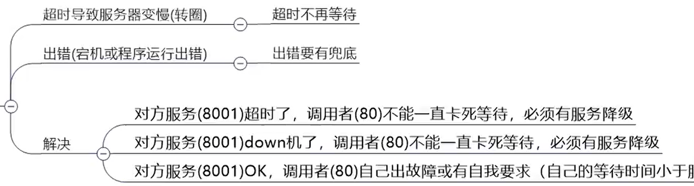


### provider服务 8001超时了，调用者80不能一直卡死等待，必须有服务降级


### provider服务 8001 宕机了，调用者80不能一直卡死等待，必须有服务降级


### provdier服务 8001OK，调用者80自己出现故障或有自我要求（自己的等待时间小于服务提供者），自己处理降级


# 四、服务降级


不管是在消费者，还是提供者，都可以进行服务降级，使用@HystrixCommand注解指定降级后的方法


一般做服务降级 都是 消费者做


## 1、服务降级配置


`@HystrixCommand`注解


### Hystrix之服务降级provider侧fallback


+ 设置自身调用超时时间的峰值，峰值内可以正常运行，超过了需要有兜底的方法处理，作服务降级fallback
+ 如果不设置峰值的话，直接在方法里抛出 10 / 0 by zero 异常 也会调用备用方法


```java
@Service
public class PaymentService {

    @HystrixCommand(fallbackMethod = "paymentInfo_TimeOutHandler", commandProperties = {
            @HystrixProperty(name = "execution.isolation.thread.timeoutInMilliseconds", value = "3000")
    })
    public String paymentInfo_TimeOut(Integer id) {
        int age = 10 / 0;
        int timeNumber = 5;
        try {
            TimeUnit.SECONDS.sleep(timeNumber);
        } catch (InterruptedException e) {
            e.printStackTrace();
        }
        return "线程池：" + Thread.currentThread().getName() + " paymentInfo_TimeOut,id： " + id + "\t 耗时：" + timeNumber + "秒钟";
    }

    public String paymentInfo_TimeOutHandler(Integer id) {
        return "线程池：" + Thread.currentThread().getName() + " paymentInfo_TimeOutHandler,id： " + id + "\t 服务降级";
    }

}
```


+ 主启动类激活


```plain
@EnableCircuitBreaker
```


```java
@SpringBootApplication
@EnableEurekaClient
@EnableCircuitBreaker
public class PaymentHystrixMain8001 {

    public static void main(String[] args) {
        SpringApplication.run(PaymentHystrixMain8001.class, args);
    }

}
```


### Hystrix之服务降级consumer侧fallback


80订单微服务，也可以更好的保护自己，自己也依样画葫芦进行客户端降级保护


+ yml配置文件


```yaml
server:
  port: 80

spring:
  application:
    name: cloud-feign-hystrix-consumer

eureka:
  client:
    register-with-eureka: true
    fetch-registry: true
    service-url:
      #defaultZone: http://eureka7001.com:7001/eureka, http://eureka7002.com:7002/eureka
      defaultZone: http://eureka7001.com:7001/eureka


# ribbon超时设置
# 设置feign 客户端超时时间(OpenFeign默认支持ribbon)
ribbon:
  # 设置建立连接后从服务器读取到可用资源所用的时间
  ReadTimeout: 5000
  # 设置建立连接所用的时间,适用于网络状况正常的情况下,两端连接所用的时间
  ConnectTimeout: 5000


feign:
  hystrix:
    enabled: true
```


+ 主启动


```java
@EnableHystrix
```


```java
@SpringBootApplication
@EnableFeignClients
@EnableHystrix
public class OrderHystrixMain80 {

    public static void main(String[] args) {
        SpringApplication.run(OrderHystrixMain80.class, args);
    }

}
```


+ 业务类


```java
@RestController
public class OrderHystrixController {

    @Autowired
    private PaymentHystrixService paymentHystrixService;

    @GetMapping("/consumer/payment/hystrix/timeout/{id}")
    @HystrixCommand(fallbackMethod = "paymentTimeOutFallbackMethod", commandProperties = {
            @HystrixProperty(name = "execution.isolation.thread.timeoutInMilliseconds", value = "1500")
    })
    public String paymentInfo_TimeOut(@PathVariable("id") Integer id) {
        int age = 10 / 0;
        String result = paymentHystrixService.paymentInfo_TimeOut(id);
        return result;
    }

    public String paymentTimeOutFallbackMethod(@PathVariable("id") Integer id) {
        return "我是消费者80，对方支付系统繁忙请10秒钟后再试";
    }

}
```


## 2、全局服务降级`@DefaultProperties`


+  目前问题： 
    - 每个业务方法对应一个兜底的方法，代码膨胀
    - 统一和自定义的分开
+  解决问题： 
    -  每个方法配置一个？？？膨胀 
    -  和业务逻辑混在一起？？？混乱 


### 解决代码膨胀


解决每个方法都要有兜底方法问题


```plain
@DefaultProperties(defaultFallback = "方法名")
```


标注在类上，表示没有指定`@HystrisCommand(fallbackMethod="方法名")`的方法就是用`@DefaultProperties(defaultFallback="方法名")`所指定的备用方法。


注意：就算使用全局降级配置 也需要在方法上添加`@HystrisCommand` 注解


1：1每个方法配置一个服务降级的方法，技术上可以，实际中不可用


1：N 除了个别重要核心业务有专属，其他普通的可以通过`@DefaultProperties(defaultFallback= "")`统一跳转到统一处理结果页面


```java
@RestController
@DefaultProperties(defaultFallback = "payment_Global_FallbackMethod")
public class OrderHystrixController {

    @Autowired
    private PaymentHystrixService paymentHystrixService;

    @GetMapping("/consumer/payment/hystrix/timeout/{id}")
    // 精准打击  定义了fallbackMethod 属性
    @HystrixCommand(fallbackMethod = "paymentTimeOutFallbackMethod", commandProperties = {
            @HystrixProperty(name = "execution.isolation.thread.timeoutInMilliseconds", value = "1500")
    })
    public String paymentInfo_TimeOut(@PathVariable("id") Integer id) {
        int age = 10 / 0;
        String result = paymentHystrixService.paymentInfo_TimeOut(id);
        return result;
    }

    public String paymentTimeOutFallbackMethod(@PathVariable("id") Integer id) {
        return "我是消费者80，对方支付系统繁忙请10秒钟后再试";
    }

    // 使用全局服务降级配置
    @HystrixCommand
    @RequestMapping("/consumer/payment/hystrix/default/{id}")
    public String test1(@PathVariable("id") Integer id) throws InterruptedException {
        int i = 10 / 0;
        return paymentHystrixService.paymentInfo_TimeOut(id);
    }

    // 下面是全局fallback方法
    public String payment_Global_FallbackMethod() {
        return "Global异常处理信息，请稍后再试";
    }
    
}
```


解决代码耦合度的问题:


## 3、服务降级，客户端调用服务端，碰上服务端宕机或关闭


本次案例服务降级处理是在客户端80实现完成的，与服务端8001没有关系


只需要为Feign客户端定义的远程调用接口添加一个服务降级处理的实现类即可实现解耦


未来面临的异常


+  运行异常 
+  超时 
+  宕机 


### 定义远程调用接口实现类


根据cloud-consumer-feign-hystrix-order80已经有的PaymentHystrixService接口，重新新建一个类（PaymentFallbackService）实现该接口，统一为接口里面的方法进行异常处理。


直接将重写的方法作为降级方法，这样刚好一个方法对应一个降级方法


```java
package com.atguigu.springcloud.service;

import org.springframework.stereotype.Component;

/*
 * 为远程调用接口创建统一降级类
 * @author: like
 * @Date: 2021/07/12 23:56
 */
@Component
public class PaymentFallbackService implements PaymentHystrixService {
    @Override
    public String paymentInfo_OK(Integer id) {
        return "对方服务端已宕机,无法使用!";
    }

    @Override
    public String paymentInfo_TimeOut(Integer id) {
        return "对方服务端已宕机,无法使用!";
    }
}
```


### 远程调用接口中@FeignClient注解添加fallback属性


添加：`fallback = PaymentFallbackService.class` 属性


```java
package com.atguigu.springcloud.service;

import org.springframework.cloud.openfeign.FeignClient;
import org.springframework.stereotype.Component;
import org.springframework.web.bind.annotation.GetMapping;
import org.springframework.web.bind.annotation.PathVariable;

/**
 * @author: like
 * @Date: 2021/07/12 8:15
 */
@Component
@FeignClient(value = "CLOUD-PROVIDER-HYSTRIX-PAYMENT",fallback = PaymentFallbackService.class)
public interface PaymentHystrixService {

    @GetMapping("/payment/hystrix/ok/{id}")
    public String paymentInfo_OK(@PathVariable("id") Integer id);

    @GetMapping("/payment/hystrix/timeout/{id}")
    public String paymentInfo_TimeOut(@PathVariable("id") Integer id);
}
```


### yaml配置文件


```yaml
feign:
  hystrix:
    enabled: true
```


### 测试


+  单个Eureka先启动7001 
+  PaymentHystrixMain8001启动 
+  正常访问测试   [http://localhost/consumer/payment/hystrix/ok/1](http://localhost/consumer/payment/hystrix/ok/1) 
+  故意关闭微服务8001 
+  客户端自己调用提示  
 


```java
它的运行逻辑是:
		当请求过来,首先还是通过Feign远程调用pay模块对应的方法
    但是如果pay模块报错,调用失败,那么就会调用PayMentFalbackService类的
    当前同名的方法,作为降级方法
```


可以看到,并没有报500错误,而是降级访问实现类的同名方法


这样,即使服务器挂了,用户也不用一直等待,或者报错


问题:


		**这样虽然解决了代码耦合度问题,但是又出现了过多重复代码的问题,每个方法都有一个降级方法**


### 总结


1.  创建远程调用接口实现类，并对其进行[降级]实现 
2.  给[@FeignClient ](/FeignClient ) 添加fallback属性  
3.  配置文件注意要启动 feign.hystrix 


# 五、服务熔断


类比保险丝达到最大服务访问后，直接拒绝访问，拉闸限电，然后调用服务降级的方法并返回友好提示


就是保险丝：服务的降级-》进而熔断-》恢复调用链路


**比如并发达到1000,我们就拒绝其他用户访问,在有用户访问,就访问降级方法**


## 1、熔断机制概述


熔断机制是应对雪崩效应的一种微服务链路保护机制。当扇出链路的某个微服务出错不可用或者响应时间太长时，会进行服务的降级，进而熔断该节点微服务的调用，快速返回错误的响应信息。


当检测到该节点微服务调用响应正常后，自动恢复调用链路。


熔断状态： 开启   关闭    半开启


在SpringCloud框架中，熔断机制通过Hystrix实现Hystrix会监控微服务间调用的状况。


当失败的调用到一定阈值，缺省是5秒内20此调用失败，就会启动熔断机制。熔断机制的注解是`@HystrixCommand`


大神论文：[https://martinfowler.com/bliki/CircuitBreaker.html](https://martinfowler.com/bliki/CircuitBreaker.html)


## 2、实操


注解中的配置解释：在一个10秒钟的窗口期，如果有10个请求 60%都失败了 就熔断


### 对8001服务端进行改造 增加熔断机制


+ 修改Payservice接口,添加服务熔断相关的方法:


这里属性整体意思是:  
10秒之内(窗口,会移动),如果并发超过10个,或者10个并发中,失败了6个,就开启熔断器


IdUtil是Hutool包下的类,这个Hutool就是整合了所有的常用方法,比如UUID,反射,IO流等工具方法什么的都整合了


```plain
断路器的打开和关闭,是按照一下5步决定的
  	1,并发此时是否达到我们指定的阈值
  	2,错误百分比,比如我们配置了60%,那么如果并发请求中,10次有6次是失败的,就开启断路器
  	3,上面的条件符合,断路器改变状态为open(开启)
  	4,这个服务的断路器开启,所有请求无法访问
  	5,在我们的时间窗口期,期间,尝试让一些请求通过(半开状态),如果请求还是失败,证明断路器还是开启状态,服务没有恢复
  		如果请求成功了,证明服务已经恢复,断路器状态变为close关闭状态
```


```java
@Service
public class PaymentService {

    //============服务熔断
    @HystrixCommand(fallbackMethod = "paymentCircuitBreaker_fallback", commandProperties = {
            @HystrixProperty(name = "circuitBreaker.enabled", value = "true"),  //是否开启断路器
            @HystrixProperty(name = "circuitBreaker.requestVolumeThreshold", value = "10"),   //请求次数
            @HystrixProperty(name = "circuitBreaker.sleepWindowInMilliseconds", value = "10000"),  //时间范围
            @HystrixProperty(name = "circuitBreaker.errorThresholdPercentage", value = "60")}//失败率达到多少后跳闸
    )
    public String paymentCircuitBreaker(Integer id) {
        if (id < 0) {
            // 这样做的目的是让他去执行兜底方法
            throw new RuntimeException("id 不能为负数");
        }
        String simpleUUID = IdUtil.simpleUUID();
        return Thread.currentThread().getName() + "服务执行成功! 流水号: " + simpleUUID;
    }

    public String paymentCircuitBreaker_fallback(Integer id) {
        return "id 不能为负数,降级服务执行…………  id:" + id;
    }

}
```


+ PaymentController


```java
@RestController
@Slf4j
public class PaymentController {

    @Autowired
    private PaymentService paymentService;

    //============服务熔断
    @GetMapping("/payment/circuit/{id}")
    public String paymentCircuitBreaker(@PathVariable("id") Integer id) {
        String result = paymentService.paymentCircuitBreaker(id);
        log.info("********result：" + result);
        return result;
    }

}
```


### 测试


自测cloud-provider-hystrix-payment8001


+ 正确


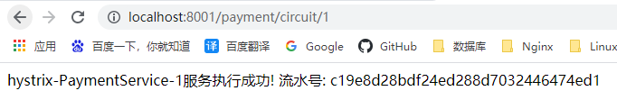


+  错误  
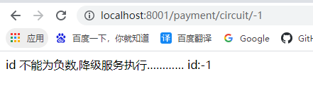 


一次正确一次错误trytry


重点测试


+ 在web页面 输入参数为负数会进入到 兜底方法，如果输入负数的次数 【在一个10秒钟的窗口期，如果有10个请求 60%都失败了 就熔断】符合这个要求，那么就会触发熔断机制，然后你再输入正数都不会执行成功了！
+ 慢慢的他自己会检测到后台输入好几个正数了，就会自动关闭熔断


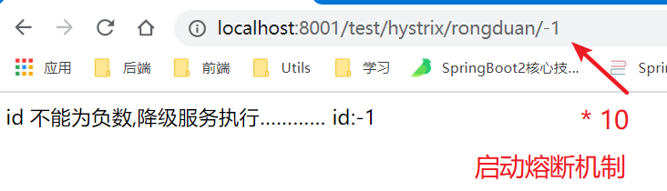


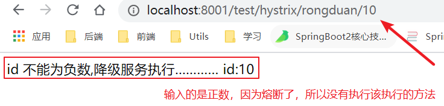


## 3、总结


### 熔断类型


+  **熔断打开**：请求不再进行调用当前服务，内部设置时钟一般为MTTR(平均故障处理时间)，当打开时长达到所设时钟则进入半熔断状态。 
+  **熔断关闭**：熔断关闭不会对服务进行熔断 
+  **熔断半开**：部分请求根据规则调用当前服务，如果请求成功且符合规则则认位当前服务恢复正常，关闭熔断 


### 断路器在什么情况下开始起作用


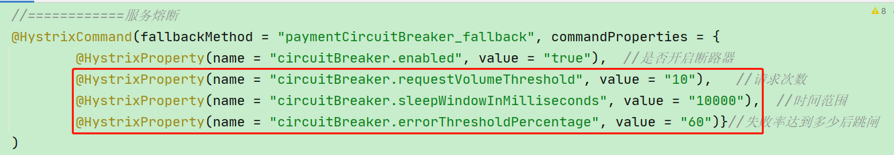


涉及到断路器的三个重要因素：快照时间窗，请求总数阈值，错误百分比阈值


#### 1：快照时间窗：


+ 断路器确定是否打开需要统计一些请求和错误数据，而统计的时间范围就是快照时间窗，默认为最近的10秒。


#### 2：请求总数阈值：


+ 在快照时间窗内，必须满足请求总数阈值才有资格熔断。
+ 默认为20，意味着在10秒内，如果该Hystrix命令的调用次数不足20次，即使所有的请求都超时或者其他原因失败，断路器都不会打开。


#### 3：错误百分比阈值：


+ 当请求总数在快照时间窗内超过了阈值，比如发生了30次调用，如果在这30次调用中，有15次发生了超时异常，也就是超过50%的错误百分比，在默认设定50%阈值情况下，这时候就会将断路器打开。


### 断路器开始或者关闭条件


+  当满足一定的阈值的时候（默认是10秒内超过20个请求次数） 
+  当失败率达到一定的时候（默认10秒内超过50%的请求失败） 
+  到达以上阈值，断路器将会开启 
+  当开启的时候，所有的请求都不会进行转发。 
+  一段时间之后（默认是5秒），这个时候断路器是半开状态，会让其中一个请求进行转发。如果成功，断路器关闭，如果失败，继续开启。重复4和5 


### 断路器打开之后


#### 再有请求调用的时候，将不会调用主逻辑，而是直接调用降级的fallback方法。


通过断路器，实现了自动的发现错误并将降级逻辑升级为主逻辑，减少响应延迟的效果。


#### 原来的主逻辑要如何恢复？


+  对于这一问题，hystrix也为我们实现了自动恢复功能。 
+  当断路器打开，对主逻辑进行熔断之后，hystrix会启动一个休眠时间窗，在这个时间窗内，降级逻辑是临时的成为主逻辑。 
+  当休眠时间窗到期，断路器将进入半开状态，释放一次请求到原来的主逻辑上，如果此次请求正常返回，那么断路器将继续闭合。 
+  主逻辑恢复，如果这次请求依然有问题，断路器继续进入打开状态，休眠时间窗重新计时。 


## 4、ALL配置


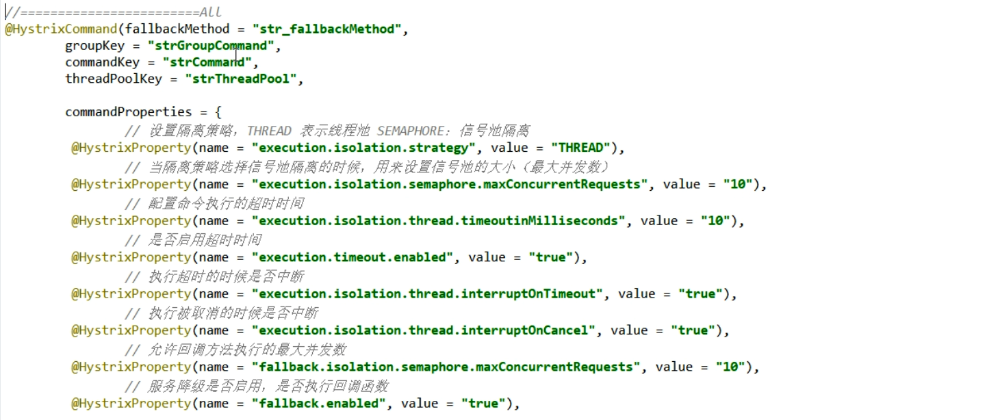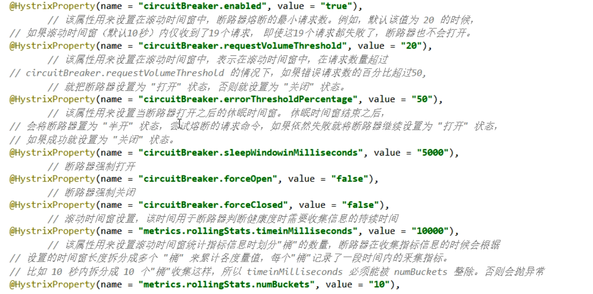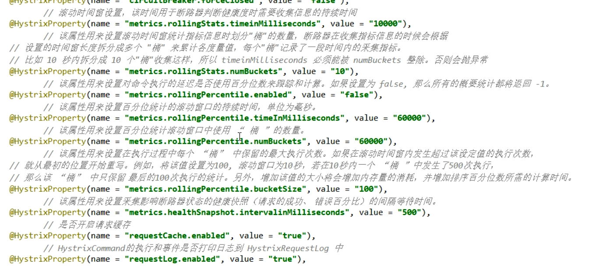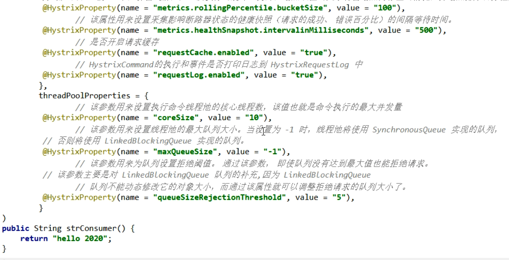


# 六、服务限流


在spring cloud alibaba Sentinel时再说！


# 七、Hystrix工作流程


[https://github.com/Netflix/Hystrix/wiki/How-it-Works](https://github.com/Netflix/Hystrix/wiki/How-it-Works)


**熔断整体流程:**


```java
1请求进来,首先查询缓存,
    如果缓存有,直接返回
  	如果缓存没有,--->2
    
2,查看断路器是否开启,
    如果开启的,Hystrix直接将请求转发到降级返回,然后返回
  	如果断路器是关闭的,判断线程池等资源是否已经满了,
        如果已经满了，也会走降级方法
  		如果资源没有满,判断我们使用的什么类型的Hystrix,
            决定调用构造方法还是run方法，然后处理请求
            然后Hystrix将本次请求的结果信息汇报给断路器,因为断路器此时可能是开启的(因为断路器开启也是可以接收请求的)
            断路器收到信息,判断是否符合开启或关闭断路器的条件,
                如果本次请求处理失败,又会进入降级方法
                如果处理成功,判断处理是否超时,
                    如果超时了,也进入降级方法
                    最后,没有超时,则本次请求处理成功,将结果返回给controller
```


# 八、服务监控 `HystrixDashboard`


除了隔离依赖服务的调用以外，Hystrix还提供了准实时的调用监控（Hystrix Dashboard），Hystrix会持续的记录所有通过Hystrix发起的请求的执行信息，并以统计报表和图形的形式展示给用户，包括**每秒执行多少请求多少成功，多少失败**等。


Netflix通过`hystrix-metrics-event-stream`项目实现了对以上指标的监控。SpringCloud也提供了Hystrix Dashboard的整合，对监控内容转化成可视化页面。


## 1、搭建HystrixDashboard


Hystrix 做服务监控还需要创建一个模块，而阿里巴巴的sentinel 直接给你要给网站就能使用


### 创建新的模块


could-consumer-hystrix-dashboard9001


### 添加依赖


```xml
<?xml version="1.0" encoding="UTF-8"?>
<project xmlns="http://maven.apache.org/POM/4.0.0"
         xmlns:xsi="http://www.w3.org/2001/XMLSchema-instance"
         xsi:schemaLocation="http://maven.apache.org/POM/4.0.0 http://maven.apache.org/xsd/maven-4.0.0.xsd">
    <parent>
        <artifactId>cloud2020</artifactId>
        <groupId>com.atguigu.springcloud</groupId>
        <version>1.0-SNAPSHOT</version>
    </parent>
    <modelVersion>4.0.0</modelVersion>

    <artifactId>could-consumer-hystrix-dashboard9001</artifactId>


    <dependencies>
        <!--新增hystrix dashboard-->
        <dependency>
            <groupId>org.springframework.cloud</groupId>
            <artifactId>spring-cloud-starter-netflix-hystrix-dashboard</artifactId>
        </dependency>

        <dependency>
            <groupId>org.springframework.cloud</groupId>
            <artifactId>spring-cloud-starter-netflix-eureka-client</artifactId>
            <version>3.0.2</version>
        </dependency>
        <dependency>
            <groupId>org.springframework.boot</groupId>
            <artifactId>spring-boot-starter-web</artifactId>
        </dependency>
        <dependency>
            <groupId>org.springframework.boot</groupId>
            <artifactId>spring-boot-starter-actuator</artifactId>
        </dependency>
        <dependency>
            <groupId>org.springframework.boot</groupId>
            <artifactId>spring-boot-devtools</artifactId>
            <scope>runtime</scope>
            <optional>true</optional>
        </dependency>

        <dependency>
            <groupId>org.projectlombok</groupId>
            <artifactId>lombok</artifactId>
            <optional>true</optional>
        </dependency>
        <dependency>
            <groupId>org.springframework.boot</groupId>
            <artifactId>spring-boot-starter-test</artifactId>
            <scope>test</scope>
        </dependency>
    </dependencies>

</project>
```


### yaml


```yaml
server:
  port: 9001

spring:
  application:
    name: cloud-consumer-hystrix-dashboard

eureka:
  client:
    fetch-registry: true
    register-with-eureka: true
    service-url:
      #defaultZone: http://eureka7001.com:7001/eureka,http://eureka7002.com:7002/eureka
      defaultZone: http://eureka7001.com:7001/eureka
```


### 主启动类添加注解 `@EnableHystrixDashboard`


表示启动 监控服务


```java
package com.atguigu.springcloud;

import org.springframework.boot.SpringApplication;
import org.springframework.boot.autoconfigure.SpringBootApplication;
import org.springframework.cloud.netflix.hystrix.dashboard.EnableHystrixDashboard;

/**
 * @author: like
 * @Date: 2021/07/13 8:23
 */
@EnableHystrixDashboard
@SpringBootApplication
public class HystrixDashboardMain9001 {

    public static void main(String[] args) {
        SpringApplication.run(HystrixDashboardMain9001.class, args);
    }
    
}
```


### 需要监控的服务(8001/8002/8003)都需要添加监控依赖配置


```xml
<dependency>
  <groupId>org.springframework.boot</groupId>
  <artifactId>spring-boot-starter-actuator</artifactId>
</dependency>
```


### 测试


浏览器输入   [http://localhost:9001/hystrix](http://localhost:9001/hystrix)   进入下面页面


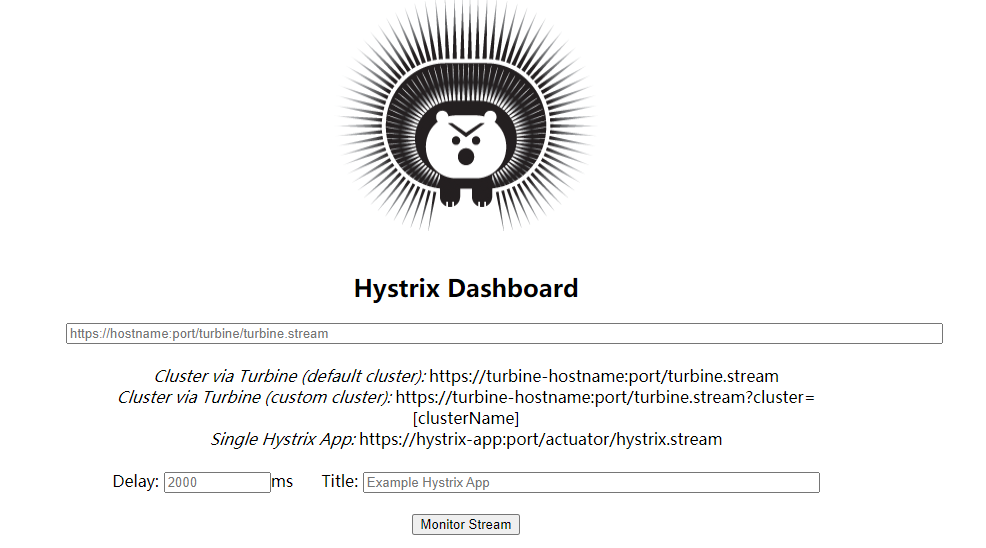


## 2、监控8001提供端


注意：此时仅仅是可以访问HystrixDashboard,并不代表已经监控了8001,8002


	如果要监控,还需要配置:(8001为例)


8001提供端 一定要有下面两个依赖


```xml
<dependency>
  <groupId>org.springframework.boot</groupId>
  <artifactId>spring-boot-starter-web</artifactId>
</dependency>
<dependency>
  <groupId>org.springframework.boot</groupId>
  <artifactId>spring-boot-starter-actuator</artifactId>
</dependency>
```


新版本Hystrix 需要在主启动类【MainHystrix8001】中指定监控路径


不然就会报错


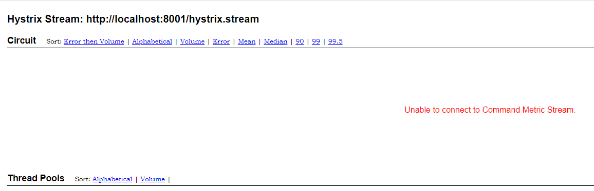


在8001提供方的主启动类中添加以下代码


```java
package com.atguigu.springcloud;

import com.netflix.hystrix.contrib.metrics.eventstream.HystrixMetricsStreamServlet;
import org.springframework.boot.SpringApplication;
import org.springframework.boot.autoconfigure.SpringBootApplication;
import org.springframework.boot.web.servlet.ServletRegistrationBean;
import org.springframework.cloud.client.circuitbreaker.EnableCircuitBreaker;
import org.springframework.cloud.netflix.eureka.EnableEurekaClient;
import org.springframework.context.annotation.Bean;

/**
 * @author: like
 * @Date: 2021/07/12 7:29
 */
@SpringBootApplication
@EnableEurekaClient
@EnableCircuitBreaker
public class PaymentHystrixMain8001 {

    public static void main(String[] args) {
        SpringApplication.run(PaymentHystrixMain8001.class, args);
    }

    /**
     *此配置是为了服务监控而配置，与服务容错本身无关，springcloud升级后的坑
     *ServletRegistrationBean因为springboot的默认路径不是"/hystrix.stream"，
     *只要在自己的项目里配置上下面的servlet就可以了
     */
    @Bean
    public ServletRegistrationBean getServlet() {
        HystrixMetricsStreamServlet streamServlet = new HystrixMetricsStreamServlet();
        ServletRegistrationBean registrationBean = new ServletRegistrationBean(streamServlet);
        registrationBean.setLoadOnStartup(1);
        registrationBean.addUrlMappings("/hystrix.stream");
        registrationBean.setName("HystrixMetricsStreamServlet");
        return registrationBean;
    }
}
```


监控测试：


+  启动1个Eureka或者3个Eureka集群均可 
+  观察监控窗口 
    -  9001监控8001     [http://localhost:8001/hystrix.stream](http://localhost:8001/hystrix.stream)  
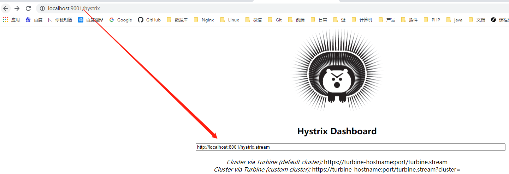 
    -  测试地址 
        *  [http://localhost:8001/payment/circuit/23](http://localhost:8001/payment/circuit/23)  
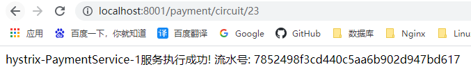 
        *  [http://localhost:8001/payment/circuit/-23](http://localhost:8001/payment/circuit/-23)  
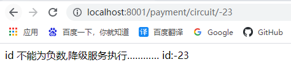 

先访问正确地址，再访问错误地址，再正确地址，会发现图示断路器都是慢慢放开的。  
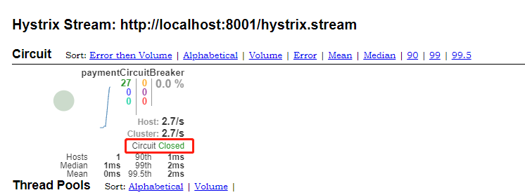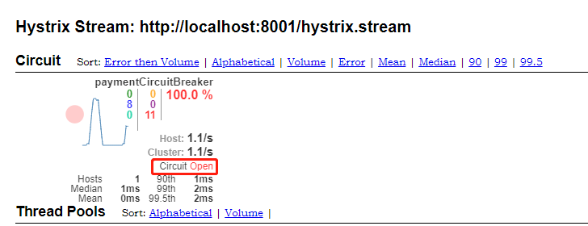


### 如何查看仪表盘


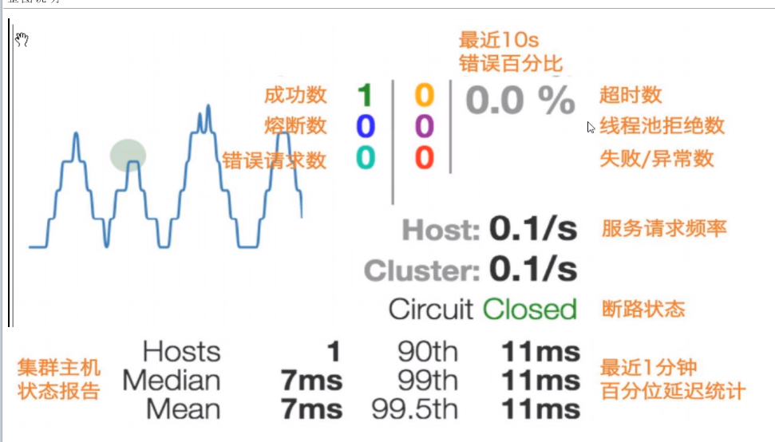


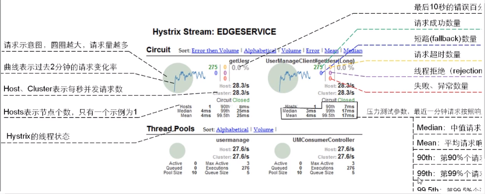


> 更新: 2022-08-22 08:26:44  
> 原文: <https://www.yuque.com/like321/xgwgyr/ip35h7>