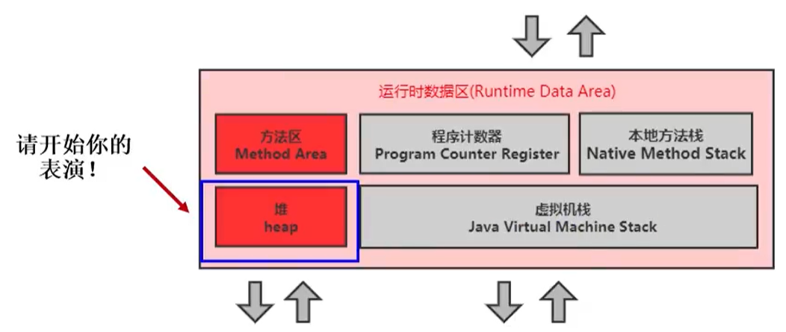
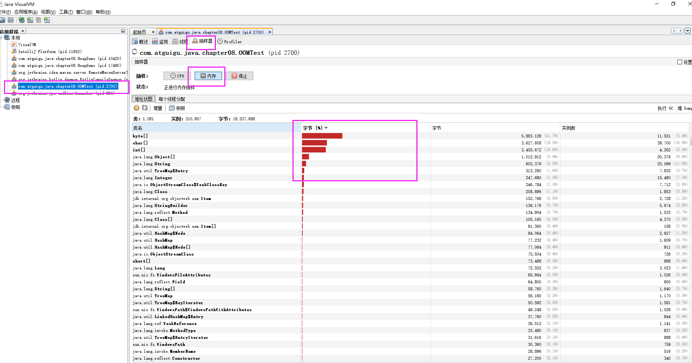
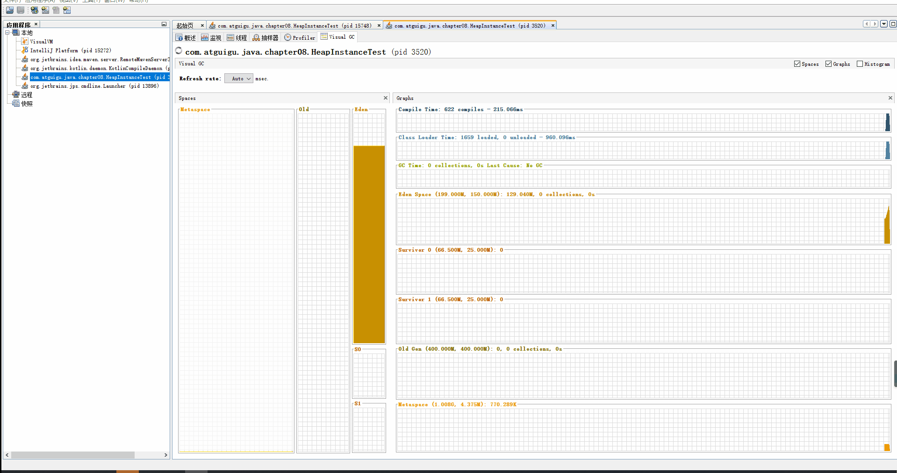

# 8_堆

# 堆


## 1. 堆的核心概述


<font style="color:#E8323C;">堆针对一个JVM进程来说是唯一的</font>，也就是一个进程只有一个JVM，但是进程包含多个线程，他们是共享同一堆空间的。





+ 一个JVM实例只存在一个堆内存，堆也是Java内存管理的核心区域。


+ Java堆区在JVM启动的时候即被创建，其空间大小也就确定了。是JVM管理的最大一块内存空间。


    - 堆内存的大小是可以调节的。
    - -Xms10m：最小堆内存
    - -Xmx10m：最大堆内存

下图就是使用：Java VisualVM查看堆空间的内容，通过 jdk bin提供的插件


+ 《Java虚拟机规范》规定，堆可以处于**物理上不连续**的内存空间中，但在**逻辑上**它应该被视为**连续的**。


+ 所有的线程共享Java堆，在这里还可以划分<font style="color:#E8323C;">线程私有的缓冲区（Thread Local Allocation Buffer，TLAB）</font>。


+ 《Java虚拟机规范》中对Java堆的描述是：所有的对象实例以及数组都应当在运行时分配在堆上。（The heap is the run-time data area from which memory for all class instances and arrays is allocated）
    - 我要说的是：“几乎”所有的对象实例都在这里分配内存。—从实际使用角度看的。


    - 因为还有一些对象是在栈上分配的


+ 数组和对象可能永远不会存储在栈上，因为栈帧中保存引用，这个引用指向对象或者数组在堆中的位置。


+ 在方法结束后，堆中的对象不会马上被移除，仅仅在垃圾收集的时候才会被移除。


    - 也就是触发了GC的时候，才会进行回收
    - 如果堆中对象马上被回收，那么用户线程就会收到影响，因为有stop the word


+ 堆，是GC（Garbage Collection，垃圾收集器）执行垃圾回收的重点区域。


### 堆内存细分


**现代垃圾收集器大部分都基于分代收集理论设计，堆空间细分为: **


+ Java 7及之前堆内存逻辑上分为三部分：新生区+养老区+**永久区**
    - Young Generation Space 新生区   Young/New   
        * 又被划分为Eden区和Survivor区
    - Tenure generation space 养老区   Old/Tenure
    - Permanent Space		 永久区   Perm


+ Java 8及之后堆内存逻辑上分为三部分：新生区+养老区+**元空间**
    - Young Generation Space 新生区  Young/New  
        * 又被划分为Eden区和Survivor区
    - Tenure generation space 养老区  Old/Tenure
    - Meta Space  			 元空间  Meta


约定：新生区 -> 新生代 -> 年轻代、  养老区 -> 老年区 -> 老年代、  永久区 -> 永久代


堆空间内部结构，JDK1.8 从永久代  替换成 元空间


## 2. 设置堆内存大小与OOM


Java堆区用于存储Java对象实例，那么堆的大小在JVM启动时就已经设定好了，大家可以通过选项"-Xmx"和"-Xms"来进行设置。

+ "-Xms"用于表示堆区的起始内存，等价于-XX:InitialHeapSize
+ "-Xmx"则用于表示堆区的最大内存，等价于-XX:MaxHeapSize


一旦堆区中的内存大小超过"-Xmx"所指定的最大内存时，将会抛出OutOfMemoryError异常。


通常会将-Xms和-Xmx两个参数配置相同的值，其**<font style="color:#E8323C;">目的是为了能够在ava垃圾回收机制清理完堆区后不需要重新分隔计算堆区的大小，从而提高性能</font>**<font style="color:#E8323C;">。</font>


默认情况下

+  初始内存大小：物理电脑内存大小 / 64 
+  最大内存大小：物理电脑内存大小 / 4 


```java
/**
 * -Xms 用来设置堆空间（年轻代+老年代）的初始内存大小
 *  -X：是jvm运行参数
 *  ms：memory start
 * -Xmx：用来设置堆空间（年轻代+老年代）的最大内存大小
 *
 */
public class HeapSpaceInitial {
    public static void main(String[] args) {
        // 返回Java虚拟机中的堆内存总量
        long initialMemory = Runtime.getRuntime().totalMemory() / 1024 / 1024;
        // 返回Java虚拟机试图使用的最大堆内存
        long maxMemory = Runtime.getRuntime().maxMemory() / 1024 / 1024;
        System.out.println("-Xms:" + initialMemory + "M");
        System.out.println("-Xmx:" + maxMemory + "M");
    }
}
```


输出结果


```plain
-Xms:245M
-Xmx:3614M
```


### 如何查看堆内存的内存分配情况


方式一：

```plain
jps  #查看进程ID

jstat -gc 进程ID
```


方式二：

```plain
-XX:+PrintGCDetails
```


### OutOfMemory举例


我们简单的写一个OOM例子


```java
public class OOMTest {
    public static void main(String[] args) {
        List<Integer> list = new ArrayList<>();
        while(true) {
            list.add(999999999);
        }
    }
}
```


然后设置启动参数


```plain
-Xms10m -Xmx:10m
```


运行后，就出现OOM了，那么我们可以通过jvisualvm这个工具查看具体是什么参数造成的OOM





## 3. 年轻代与老年代


存储在JVM中的Java对象可以被划分为两类：


+ 一类是生命周期较短的瞬时对象，这类对象的创建和消亡都非常迅速 
    - 生命周期短的，及时回收即可
+ 另外一类对象的生命周期却非常长，在某些极端的情况下还能够与JVM的生命周期保持一致


Java堆区进一步细分的话，可以划分为年轻代（YoungGen）和老年代（oldGen）


其中年轻代又可以划分为Eden空间、Survivor0空间和Survivor1空间（有时也叫做from区、to区）


下面这参数开发中一般不会调：


+ Eden：From：to ->  8:1:1
+ 新生代：老年代  - >  1 : 2


### 配置新生代与老年代在堆结构的占比。


+ ** 默认-XX:NewRatio=2**，表示新生代占1，老年代占2，新生代占整个堆的1/3 
+  可以修改-XX:NewRatio=4，表示新生代占1，老年代占4，新生代占整个堆的1/5 


> 当发现在整个项目中，生命周期长的对象偏多，那么就可以通过调整 老年代的大小，来进行调优
>


在HotSpot中，**Eden空间和另外两个survivor空间**缺省所占的**比例**是8：1：1当然开发人员可以通过选项“-XX:SurvivorRatio”调整这个空间比例。比如-XX:SurvivorRatio=8（<font style="color:#E8323C;">需要显式设置，否则其实是6:1:1</font>）


**几乎所有的**Java对象都是在Eden区被new出来的。


绝大部分的Java对象的销毁都在新生代进行了。（有些大的对象在Eden区无法存储时候，将直接进入老年代）

+ IBM公司的专门研究表明，新生代中80%的对象都是“朝生夕死”的。


可以使用选项"-Xmn"**设置新生代最大内存大小**

+ 这个参数一般使用默认值就可以了。


## 4. 图解对象分配过程


### 概述


为新对象分配内存是一件非常严谨和复杂的任务，JVM的设计者们不仅需要考虑内存如何分配、在哪里分配等问题，并且由于内存分配算法与内存回收算法密切相关，所以还需要考虑GC执行完内存回收后是否会在内存空间中产生内存碎片。


1. new的对象先放伊甸园区。<font style="color:#E8323C;">此区有大小限制</font>。
2. 当伊甸园的空间填满时，程序又需要创建对象，JVM的垃圾回收器将对伊甸园区进行垃圾回收（<font style="color:#E8323C;">MinorGC</font>），将伊甸园区中的不再被其他对象所引用的对象进行销毁。再加载新的对象放到伊甸园区
3. 然后将伊甸园中的剩余对象移动到<font style="color:#E8323C;">幸存者0区</font>。
4. 如果再次触发垃圾回收，此时上次幸存下来的（放到幸存者0区的），如果没有回收，就会放到幸存者1区。
5. 如果再次经历垃圾回收，此时会重新放回幸存者0区，接着再去幸存者1区。
6. 啥时候能去养老区呢？可以设置次数。<font style="color:#E8323C;">默认是15次。</font>
    - **可以设置参数：-XX:MaxTenuringThreshold= N进行设置**
7. 在养老区，相对悠闲。当养老区内存不足时，再次触发GC：<font style="color:#E8323C;">Major GC</font>，进行养老区的内存清理
8. 若养老区执行了Major GC之后，发现依然无法进行对象的保存，就会产生OOM异常。

```java
java.lang.OutOfMemoryError: Java heap space
```


### 图解过程


我们创建的对象，一般都是存放在Eden区的，当我们Eden区满了后，就会触发GC操作，一般被称为 YGC / Minor GC操作


当我们进行一次垃圾收集后，红色的将会被回收，而绿色的还会被占用着，存放在S0（Survivor From）区。<font style="color:#E8323C;">同时我们给每个对象设置了一个年龄计数器，一次回收后就是1。</font>


同时Eden区继续存放对象，当Eden区再次存满的时候，又会触发一个MinorGC操作，此时GC将会把 Eden和Survivor From中的对象 进行一次收集，把存活的对象放到S1（Survivor To）区，同时让年龄 + 1


我们继续不断的进行对象生成 和 垃圾回收，当Survivor中的对象的年龄达到15的时候，将会触发一次 Promotion晋升的操作，也就是将年轻代中的对象  晋升到 老年代中


### 思考：幸存区区满了后？


特别注意，在Eden区满了的时候，才会触发MinorGC，**<font style="color:#E8323C;">而幸存者区满了后，不会触发MinorGC操作</font>**


<font style="color:#E8323C;">如果Survivor区满了后，将会触发一些特殊的规则，也就是可能直接晋升老年代</font>


> 举例：以当兵为例，正常人的晋升可能是 ：  新兵 -> 班长 -> 排长 -> 连长
>
>  
>
> 但是也有可能有些人因为做了非常大的贡献，直接从  新兵 -> 排长
>


### 总结


+ **针对幸存者s0，s1区的总结：复制之后有交换，谁空谁是to**
+ **关于垃圾回收：频繁在新生区收集，很少在老年代收集，几乎不再永久代和元空间进行收集**
+ 新生代采用复制算法的目的：<font style="color:#E8323C;">是为了减少内碎片</font>


### 对象分配的特殊情况


### 代码演示对象分配过程


我们不断的创建大对象


```java
/**
 * 代码演示对象创建过程
 *
 */
public class HeapInstanceTest {
    byte[] buffer = new byte[new Random().nextInt(1024 * 200)];
    
    public static void main(String[] args) throws InterruptedException {
        ArrayList<HeapInstanceTest> list = new ArrayList<>();
        while (true) {
            list.add(new HeapInstanceTest());
            Thread.sleep(10);
        }
    }
}
```


然后设置JVM参数


```bash
-Xms600m -Xmx600m
```


然后cmd输入下面命令，打开JvisualVM图形化界面


```plain
jvisualvm
```


然后通过执行上面代码，通过VisualGC进行动态化查看




最终，在老年代和新生代都满了，就出现OOM


```plain
Exception in thread "main" java.lang.OutOfMemoryError: Java heap space
	at com.atguigu.java.chapter08.HeapInstanceTest.<init>(HeapInstanceTest.java:13)
	at com.atguigu.java.chapter08.HeapInstanceTest.main(HeapInstanceTest.java:17)
```


### 常用的调优工具


+ JDK命令行
+ Eclipse：Memory Analyzer Tool
+ Jconsole
+ Visual VM（实时监控  推荐~）
+ Jprofiler（推荐~）
+ Java Flight Recorder（实时监控）
+ GCViewer
+ GCEasy


## 5. Minor GC，MajorGC、Full GC


+ Minor GC：新生代的GC
+ Major GC：老年代的GC
+ Full GC：整堆收集，收集整个Java堆和方法区的垃圾收集


> 我们都知道，JVM的调优的一个环节，也就是垃圾收集，我们需要尽量的避免垃圾回收，因为在垃圾回收的过程中，容易出现STW的问题
>
>  
>
> 而 Major GC 和 Full GC出现STW的时间，是Minor GC的10倍以上
>


**JVM**在进行**GC**时，并非每次都对上面三个内存区域（新生代、老年代、方法区）一起回收的，大部分时候回收的都是指新生代。


针对**Hotspot VM**的实现，它里面的**GC**按照回收区域又分为两大种类型：一种是部分收集（**Partial GC**），一种是整堆收集（**Full GC**）


+ 部分收集：不是完整收集整个Java堆的垃圾收集。其中又分为：
    - 新生代收集（Minor  GC/Young GC）：只是新生代（Eden\S0,S1）的垃圾收集
    - 老年代收集（Major GC/old GC）：只是老年代的圾收集。 
        * <font style="color:#E8323C;">目前，只有CMS GC会有单独收集老年代的行为。</font>
        * **注意，很多时候Major GC会和Full GC混淆使用，需要具体分辨是老年代回收还是整堆回收**。
    - 混合收集（Mixed GC）：收集整个新生代以及部分老年代的垃圾收集。 
        * <font style="color:#E8323C;">目前，只有G1 GC会有这种行为</font>


+ 整堆收集（Full GC）：收集整个java堆和方法区的垃圾收集。


### Minor GC


当年轻代空间不足时，就会触发MinorGC，这里的年轻代满指的是Eden代满，Survivor满不会引发GC。（每次Minor GC会清理年轻代的内存。）


因为Java对象 **大多都具备朝生夕灭** 的特性，所以Minor GC非常频繁，一般回收速度也比较快。这一定义既清晰又易于理解。


Minor GC会引发STW，暂停其它用户的线程，等垃圾回收结束，用户线程才恢复运行


#### STW：stop the word


### Major GC


指发生在老年代的GC，对象从老年代消失时，我们说 “Major GC” 或 “Full GC” 发生了


出现了MajorGC，经常会伴随至少一次的Minor GC（但非绝对的，在Parallel Scavenge收集器的收集策略里就有直接进行Major GC的策略选择过程）


+ <font style="color:#E8323C;">也就是在老年代空间不足时，会先尝试触发Minor GC。如果之后空间还不足，则触发Major GC</font>


Major GC的速度一般会比Minor GC慢10倍以上，<font style="color:#E8323C;">STW的时间更长。</font>


如果Major GC后，内存还不足，就报OOM了


### Full GC


触发Full GC执行的情况有如下五种：


+ 调用System.gc（）时，系统建议执行**Full GC**，但是不必然执行
+ 老年代空间不足
+ 方法区空间不足
+ 通过Minor GC后进入老年代的平均大小大于老年代的可用内存
+ 由Eden区、survivor space0（From Space）区向survivor space1（To Space）区复制时，对象大小大于To Space可用内存，则把该对象转存到老年代，且老年代的可用内存小于该对象大小


说明：**Full GC 是开发或调优中尽量要避免的。这样STW时间会短一些**


### GC 举例


我们编写一个OOM的异常，因为我们在不断的创建字符串，是存放在元空间的


```java
/**
 * GC测试
 *
 */
public class GCTest {
    public static void main(String[] args) {
        int i = 0;
        try {
            List<String> list = new ArrayList<>();
            String a = "atguigu.com";
            while(true) {
                list.add(a);
                a = a + a;
                i++;
            }
        }catch (Exception e) {
            e.getStackTrace();
        }
    }
}
```


设置JVM启动参数


```bash
-Xms10m -Xmx10m -XX:+PrintGCDetails
```


打印出的日志


```plain
[GC (Allocation Failure) [PSYoungGen: 2038K->500K(2560K)] 2038K->797K(9728K), 0.3532002 secs] [Times: user=0.01 sys=0.00, real=0.36 secs] 
[GC (Allocation Failure) [PSYoungGen: 2108K->480K(2560K)] 2405K->1565K(9728K), 0.0014069 secs] [Times: user=0.00 sys=0.00, real=0.00 secs] 
[Full GC (Ergonomics) [PSYoungGen: 2288K->0K(2560K)] [ParOldGen: 6845K->5281K(7168K)] 9133K->5281K(9728K), [Metaspace: 3482K->3482K(1056768K)], 0.0058675 secs] [Times: user=0.00 sys=0.00, real=0.01 secs] 
[GC (Allocation Failure) [PSYoungGen: 0K->0K(2560K)] 5281K->5281K(9728K), 0.0002857 secs] [Times: user=0.00 sys=0.00, real=0.00 secs] 
[Full GC (Allocation Failure) [PSYoungGen: 0K->0K(2560K)] [ParOldGen: 5281K->5263K(7168K)] 5281K->5263K(9728K), [Metaspace: 3482K->3482K(1056768K)], 0.0058564 secs] [Times: user=0.00 sys=0.00, real=0.01 secs] 
Heap
 PSYoungGen      total 2560K, used 60K [0x00000000ffd00000, 0x0000000100000000, 0x0000000100000000)
  eden space 2048K, 2% used [0x00000000ffd00000,0x00000000ffd0f138,0x00000000fff00000)
  from space 512K, 0% used [0x00000000fff00000,0x00000000fff00000,0x00000000fff80000)
  to   space 512K, 0% used [0x00000000fff80000,0x00000000fff80000,0x0000000100000000)
 ParOldGen       total 7168K, used 5263K [0x00000000ff600000, 0x00000000ffd00000, 0x00000000ffd00000)
  object space 7168K, 73% used [0x00000000ff600000,0x00000000ffb23cf0,0x00000000ffd00000)
 Metaspace       used 3514K, capacity 4498K, committed 4864K, reserved 1056768K
  class space    used 388K, capacity 390K, committed 512K, reserved 1048576K
  
  Exception in thread "main" java.lang.OutOfMemoryError: Java heap space
	at java.util.Arrays.copyOfRange(Arrays.java:3664)
	at java.lang.String.<init>(String.java:207)
	at java.lang.StringBuilder.toString(StringBuilder.java:407)
	at com.atguigu.java.chapter08.GCTest.main(GCTest.java:20)
```


触发OOM的时候，一定是进行了一次Full GC，<font style="color:#E8323C;">因为只有在老年代空间不足时候，才会爆出OOM异常</font>


## 6. 堆空间分代思想


**为什么要把Java堆分代？不分代就不能正常工作了吗？**


经研究，不同对象的生命周期不同。70%-99%的对象是临时对象。

> 新生代：有Eden、两块大小相同的survivor（又称为from/to，s0/s1）构成，<font style="color:#E8323C;">to总为空。</font>  
老年代：存放新生代中经历多次GC仍然存活的对象。
>


其实不分代完全可以，<font style="color:#E8323C;">分代的唯一理由就是优化GC性能</font>。

如果没有分代，那所有的对象都在一块，就如同把一个学校的人都关在一个教室。GC的时候要找到哪些对象没用，这样就会对堆的所有区域进行扫描。

而很多对象都是朝生夕死的，如果分代的话，把新创建的对象放到某一地方，当GC的时候先把这块存储“朝生夕死”对象的区域进行回收，这样就会腾出很大的空间出来。


## 7. 内存分配策略


如果对象在Eden出生并经过第一次Minor GC后仍然存活，并且能被Survivor容纳的话，将被移动到Survivor空间中，并将对象年龄设为1。

对象在survivor区中每熬过一次MinorGC，年龄就增加1岁，当它的年龄增加到一定程度（默认为15岁，其实每个JVM、每个GC都有所不同）时，就会被晋升到老年代。


对象晋升老年代的年龄阀值，可以通过选项**-XX:MaxTenuringThreshold**来设置。


针对不同年龄段的对象分配原则如下所示：

+ 优先分配到Eden 
    - 开发中比较长的字符串或者数组，会直接存在老年代，但是因为新创建的对象 都是 朝生夕死的，所以这个大对象可能也很快被回收，但是因为老年代触发Major GC的次数比 Minor GC要更少，因此可能回收起来就会比较慢
+ 大对象直接分配到老年代 
    - 尽量避免程序中出现过多的大对象

```java
/**
 * 测试：大对象直接进入老年代
 * -Xms60m - Xmx60m -XX:NewRatio=2 -XX:SurvivorRatio=8 -XX:+PrintGCDetailS!
 */
public class YoungOldAreaTest {

    public static void main(String[] args) {
        byte[] buffer = new byte[1024 * 1024 * 20];//20m
    }	
}
```

+ 长期存活的对象分配到老年代
+ 动态对象年龄判断 
    - 如果survivor区中相同年龄的所有对象大小的总和大于Survivor空间的一半，年龄大于或等于该年龄的对象可以直接进入老年代，无须等到MaxTenuringThreshold 中要求的年龄。
+ 空间分配担保： -XX:HandlePromotionFailure
    - 也就是经过Minor GC后，所有的对象都存活，因为Survivor比较小，所以就需要将Survivor无法容纳的对象，存放到老年代中。


## 8. 为对象分配内存：TLAB


### 问题：堆空间都是共享的么？


<font style="color:#E8323C;">不一定，因为还有TLAB这个概念，在堆中划分出一块区域，为每个线程所独占</font>


### 为什么有TLAB（Thread Local Allocation Buffer）？


TLAB：Thread Local Allocation Buffer，也就是为每个线程单独分配了一个缓冲区


堆区是线程共享区域，任何线程都可以访问到堆区中的共享数据


由于对象实例的创建在JVM中非常频繁，因此在并发环境下从堆区中划分内存空间是线程不安全的


<font style="color:#E8323C;">为避免多个线程操作同一地址，需要使用加锁等机制，进而影响分配速度。</font>


### 什么是TLAB


从内存模型而不是垃圾收集的角度，对Eden区域继续进行划分，JVM为**<font style="color:#E8323C;">每个线程分配了一个私有缓存区域</font>**，它包含在<font style="color:#E8323C;">Eden</font>空间内。


多线程同时分配内存时，使用TLAB可以避免一系列的非线程安全问题，同时还能够提升内存分配的吞吐量，因此我们可以将这种内存分配方式称之为**<font style="color:#E8323C;">快速分配策略</font>**。


据我所知所有OpenJDK衍生出来的JVM都提供了TLAB的设计。


**TLAB的再说明：**


尽管不是所有的对象实例都能够在TLAB中成功分配内存，但**<font style="color:#E8323C;">JVM确实是将TLAB作为内存分配的首选</font>**。


在程序中，开发人员可以通过选项“-XX:UseTLAB”设置是否开启TLAB空间。


默认情况下，TLAB空间的内存非常小，**仅占有整个Eden空间的1%**，当然我们可以通过选项“-XX:TLABWasteTargetPercent”设置TLAB空间所占用Eden空间的百分比大小。


一旦对象在TLAB空间分配内存失败时，<font style="color:#E8323C;">JVM就会尝试着通过</font>**<font style="color:#E8323C;">使用加锁机制</font>**<font style="color:#E8323C;">确保数据操作的原子性，从而直接在Eden空间中分配内存。</font>


### TLAB分配过程


对象首先是通过TLAB开辟空间，<font style="color:#E8323C;">如果不能放入，那么需要通过Eden来进行分配</font>


## 9. 小结：堆空间的参数设置


+  -XX:+PrintFlagsInitial：查看所有的参数的默认初始值 
+  -XX:+PrintFlagsFinal：查看所有的参数的最终值（可能会存在修改，不再是初始值） 
+  -Xms：初始堆空间内存（默认为物理内存的1/64） 
+  -Xmx：最大堆空间内存（默认为物理内存的1/4） 
+  -Xmn：设置新生代的大小。（初始值及最大值） 
+  -XX:NewRatio：配置新生代与老年代在堆结构的占比 
+  -XX:SurvivorRatio：设置新生代中Eden和S0/S1空间的比例 
+  -XX:MaxTenuringThreshold：设置新生代垃圾的最大年龄 
+  -XX:+PrintGCDetails：输出详细的GC处理日志 
    - 打印gc简要信息：
        * ①-XX:+PrintGC  
        * ② -verbose:gc
+  -XX:HandlePromotionFalilure：是否设置空间分配担保 


在发生Minor GC之前，虚拟机会**<font style="color:#E8323C;">检查老年代最大可用的连续空间是否大于新生代所有对象的总空间</font>**。

+ 如果大于，则此次Minor GC是安全的
+ 如果小于，则虚拟机会查看<font style="color:#E8323C;">-XX:HandlePromotionFailure设置值是否允担保失败</font>。 
    - 如果HandlePromotionFailure=true，那么会继续**<font style="color:#E8323C;">检查老年代最大可用连续空间是否大于历次晋升到老年代的对象的平均大小。</font>**
        * 如果大于，则尝试进行一次Minor GC，但这次Minor GC依然是有风险的；
        * 如果小于，则改为进行一次Full GC。
    - 如果HandlePromotionFailure=false，则改为进行一次Full GC。


在JDK6 Update24之后，HandlePromotionFailure参数不会再影响到虚拟机的空间分配担保策略，观察openJDK中的源码变化，虽然源码中还定义了HandlePromotionFailure参数，但是在代码中已经不会再使用它。

JDK6 Update 24之后的规则变为**<font style="color:#E8323C;">只要老年代的连续空间大于新生代对象总大小</font>**<font style="color:#E8323C;">或者</font>**<font style="color:#E8323C;">历次晋升的平均大小就会进行Minor GC</font>**<font style="color:#E8323C;">，否则将进行Full GC。</font>


## 10. 堆是分配对象的唯一选择么？


在《深入理解Java虚拟机》中关于Java堆内存有这样一段描述：


随着JIT编译期的发展与**逃逸分析技术**逐渐成熟，**栈上分配、标量替换优化技术**将会导致一些微妙的变化，所有的对象都分配到堆上也渐渐变得不那么“绝对”了。


在Java虚拟机中，对象是在Java堆中分配内存的，这是一个普遍的常识。但是，有一种特殊情况，那就是**<font style="color:#E8323C;">如果经过逃逸分析（Escape Analysis）后发现，一个对象并没有逃逸出方法的话，那么就可能被优化成栈上分配</font>**<font style="color:#E8323C;">。</font>这样就无需在堆上分配内存，也无须进行垃圾回收了。这也是最常见的堆外存储技术。


此外，前面提到的基于openJDk深度定制的TaoBaoVM，其中创新的GCIH（GC invisible heap）技术实现off-heap，将生命周期较长的Java对象从heap中移至heap外，并且GC不能管理GCIH内部的Java对象，以此达到降低GC的回收频率和提升GC的回收效率的目的。


### 逃逸分析


<font style="color:#E8323C;">如何将堆上的对象分配到栈，需要使用逃逸分析手段。</font>


这是一种可以有效减少Java程序中<font style="color:#E8323C;">同步负载和内存堆分配压力的跨函数全局数据流分析算法</font>。


通过逃逸分析，Java Hotspot编译器能够分析出一个新的对象的引用的<font style="color:#E8323C;">使用范围</font>从而决定是否要将这个对象分配到堆上。


<font style="color:#E8323C;">逃逸分析的基本行为就是分析对象动态作用域：</font>

+ 当一个对象在方法中被定义后，对象只在方法内部使用，则认为没有发生逃逸。
+ 当一个对象在方法中被定义后，它被外部方法所引用，则认为发生逃逸。例如作为调用参数传递到其他地方中。


#### 逃逸分析举例


<font style="color:#E8323C;">没有发生逃逸的对象，则可以分配到栈上，</font>随着方法执行的结束，栈空间就被移除。


```java
public void my_method() {
    V v = new V();
    // use v
    // ....
    v = null;
}
```


针对下面的代码


```java
public static StringBuffer createStringBuffer(String s1, String s2) {
    StringBuffer sb = new StringBuffer();
    sb.append(s1);
    sb.append(s2);
    return sb;
}
```


如果想要StringBuffer sb不发生逃逸，可以这样写


```java
public static String createStringBuffer(String s1, String s2) {
    StringBuffer sb = new StringBuffer();
    sb.append(s1);
    sb.append(s2);
    return sb.toString();
}
```


完整的逃逸分析代码举例


```java
/**
 * 逃逸分析
 * 如何快速的判断是否发生了逃逸分析，大家就看new的对象是否在方法外被调用。
 */
public class EscapeAnalysis {

    public EscapeAnalysis obj;

    /**
     * 方法返回EscapeAnalysis对象，发生逃逸
     * @return
     */
    public EscapeAnalysis getInstance() {
        return obj == null ? new EscapeAnalysis():obj;
    }

    /**
     * 为成员属性赋值，发生逃逸
     */
    public void setObj() {
        this.obj = new EscapeAnalysis();
    }

    /**
     * 对象的作用于仅在当前方法中有效，没有发生逃逸
     */
    public void useEscapeAnalysis() {
        EscapeAnalysis e = new EscapeAnalysis();
    }

    /**
     * 引用成员变量的值，发生逃逸
     */
    public void useEscapeAnalysis2() {
        EscapeAnalysis e = getInstance();
        // getInstance().XXX  发生逃逸
    }
}
```


#### 参数设置


<font style="color:#E8323C;">在JDK 1.7 版本之后，HotSpot中默认就已经开启了逃逸分析</font>


如果使用的是较早的版本，开发人员则可以通过：


+ 选项“-XX：+DoEscapeAnalysis"显式开启逃逸分析
+ 通过选项“-XX：+PrintEscapeAnalysis"查看逃逸分析的筛选结果


#### 结论


<font style="color:#E8323C;">开发中能使用局部变量的，就不要使用在方法外定义。</font>


### 逃逸分析：代码优化


使用逃逸分析，编译器可以对代码做如下优化：


+ **栈上分配**：将堆分配转化为栈分配。如果一个对象在子程序中被分配，要使指向该对象的指针永远不会发生逃逸，对象可能是栈上分配的候选，而不是堆上分配
+ **同步省略**：如果一个对象被发现只有一个线程被访问到，那么对于这个对象的操作可以不考虑同步。
+ **分离对象或标量替换**：有的对象可能不需要作为一个连续的内存结构存在也可以被访问到，那么对象的部分（或全部）可以不存储在内存，而是存储在CPU寄存器中。


#### 栈上分配


JIT编译器在编译期间根据逃逸分析的结果，发现如果一个对象并没有逃逸出方法的话，就可能被优化成<font style="color:#E8323C;">栈上分配</font>。分配完成后，继续在调用栈内执行，最后线程结束，栈空间被回收，局部变量对象也被回收。<font style="color:#E8323C;">这样就无须进行垃圾回收了。</font>


+ **常见的栈上分配的场景**
    - 在逃逸分析中，已经说明了。分别是给成员变量赋值、方法返回值、实例引用传递。


我们通过举例来说明 开启逃逸分析 和 未开启逃逸分析时候的情况


```java
/**
 * 栈上分配
 * -Xmx1G -Xms1G -XX:-DoEscapeAnalysis -XX:+PrintGCDetails
 */
public class StackAllocation {
    
    public static void main(String[] args) throws InterruptedException {
        long start = System.currentTimeMillis();
        for (int i = 0; i < 100000000; i++) {
            alloc();
        }
        long end = System.currentTimeMillis();
        System.out.println("花费的时间为：" + (end - start) + " ms");

        // 为了方便查看堆内存中对象个数，线程sleep
        Thread.sleep(10000000);
    }

    private static void alloc() {
        // 未发生逃逸
        User user = new User(); 
    }
    
    class User {
        private String name;
        private String age;
        private String gender;
        private String phone;
    }
}
```


设置JVM参数，表示未开启逃逸分析


```plain
-Xmx1G -Xms1G -XX:-DoEscapeAnalysis -XX:+PrintGCDetails
```


运行结果，同时还触发了GC操作


```plain
花费的时间为：664 ms
```


然后查看内存的情况，发现有大量的User存储在堆中


我们在开启逃逸分析


```plain
-Xmx1G -Xms1G -XX:+DoEscapeAnalysis -XX:+PrintGCDetails
```


然后查看运行时间，我们能够发现花费的时间快速减少，同时不会发生GC操作


```plain
花费的时间为：5 ms
```


在看内存情况，我们发现只有很少的User对象，说明User未发生逃逸，因为它存储在栈中，随着栈的销毁而消失


#### 同步省略	


线程同步的代价是相当高的，同步的后果是降低并发性和性能。


在动态编译同步块的时候，JIT编译器可以借助逃逸分析来**判断同步块所使用的锁对象是否只能够被一个线程访问而没有被发布到其他线程**。如果没有，那么JIT编译器在编译这个同步块的时候就会取消对这部分代码的同步。这样就能大大提高并发性和性能。<font style="color:#E8323C;">这个取消同步的过程就叫同步省略，也叫</font>**<font style="color:#E8323C;">锁消除</font>**<font style="color:#E8323C;">。</font>


例如下面的代码


```java
public void f() {
    Object hellis = new Object();
    synchronized(hellis) {
        System.out.println(hellis);
    }
}
```


代码中对hellis这个对象加锁，但是hellis对象的生命周期只在f()方法中，并不会被其他线程所访问到，所以在JIT编译阶段就会被优化掉，优化成：


```java
public void f() {
    Object hellis = new Object();
	System.out.println(hellis);
}
```


我们将其转换成字节码


#### 分离对象和标量替换


**标量（scalar）**是指一个无法再分解成更小的数据的数据。Java中的原始数据类型就是标量。


相对的，那些还可以分解的数据叫做**聚合量（Aggregate）**，Java中的对象就是聚合量，因为他可以分解成其他聚合量和标量。


在JIT阶段，<font style="color:#E8323C;">如果经过逃逸分析，发现一个对象不会被外界访问的话，那么经过JIT优化，就会把这个对象拆解成若干个其中包含的若干个成员变量来代替</font>。这个过程就是**标量替换**。


```java
public static void main(String args[]) {
    alloc();
}

private static void alloc() {
    Point point = new Point(1,2);
    System.out.println("point.x" + point.x + ";point.y" + point.y);
}

class Point {
    private int x;
    private int y;
}
```


以上代码，经过标量替换后，就会变成


```java
private static void alloc() {
    int x = 1;
    int y = 2;
    System.out.println("point.x = " + x + "; point.y=" + y);
}
```


可以看到，Point这个聚合量经过逃逸分析后，发现他并没有逃逸，就被替换成两个标量了。


那么标量替换有什么好处呢？<font style="color:#E8323C;">就是可以大大减少堆内存的占用。因为一旦不需要创建对象了，那么就不再需要分配堆内存了。</font>

  
<font style="color:#E8323C;">标量替换为栈上分配提供了很好的基础。</font>


**标量替换参数设置:**

参数-XX:+EliminateAllocations：开启了标量替换(默认打开)，允许将对象打散分配在栈.上。


**测试：**

```java
/**
 * 标量替换测试
 * -Xmx100m -Xms100m -XX:+DoEscapeAnalysis -XX:+PrintGC -XX:-ELiminateAllocations
 */
public class ScalarReplace {


    public static class User {
        public int id;
        public String name;
    }

    public static void alloc() {
        User u = new User(); //未发生逃逸
        u.id = 5;
        u.name = "www.atguigu.com";
    }

    public static void main(String[] args) {
        long start = System.currentTimeMillis();
        for (int i = 0; i < 10000000; i++) {
            alloc();

            long end = System.currentTimeMillis();
            System.out.println("花费的时间为:" + (end - start) + "ms");
        }
    }
}
```

上述代码在主函数中进行了1亿次alloc。调用进行对象创建，由于User对象实例需要占据约16字节的空间，因此累计分配空间达到将近1.5GB。如果堆空间小于这个值，就必然会发生GC。使用如下参数运行上述代码：


```bash
-server -Xmx100m -Xms100m -XX:+DoEscapeAnalysis -XX:+PrintGC -XX:+EliminateAllocations
```


这里设置参数如下：


+ 参数-server：启动Server模式，因为在server模式下，才可以启用逃逸分析。
+ 参数-XX:+DoEscapeAnalysis：启用逃逸分析
+ 参数-Xmx10m：指定了堆空间最大为10MB
+ 参数-XX:+PrintGC：将打印GC日志
+ 参数-XX:+EliminateAllocations：开启了标量替换（默认打开），允许将对象打散分配在栈上，比如对象拥有id和name两个字段，那么这两个字段将会被视为两个独立的局部变量进行分配


### 逃逸分析的不足


关于逃逸分析的论文在1999年就已经发表了，但直到JDK1.6才有实现，而且这项技术到如今也并不是十分成熟。


其根本原因就是**<font style="color:#E8323C;">无法保证逃逸分析的性能消耗一定能高于他的消耗</font>****。虽然经过逃逸分析可以做标量替换、栈上分配、和锁消除。但是逃逸分析自身也是需要进行一系列复杂的分析的，这其实也是一个相对耗时的过程。**

  
一个极端的例子，就是经过逃逸分析之后，发现没有一个对象是不逃逸的。那这个逃逸分析的过程就白白浪费掉了。


虽然这项技术并不十分成熟，但是它也是**即时编译器优化技术中一个十分重要的手段**。


注意到有一些观点，认为通过逃逸分析，JVM会在栈上分配那些不会逃逸的对象，这在理论上是可行的，但是取决于JVM设计者的选择。据我所知，<font style="color:#E8323C;">oracle Hotspot JVM中并未这么做</font>，这一点在逃逸分析相关的文档里已经说明，<font style="color:#E8323C;">所以可以明确所有的对象实例都是创建在堆上。</font>


目前很多书籍还是基于JDK7以前的版本，JDK已经发生了很大变化，intern字符串的缓存和静态变量曾经都被分配在永久代上，而永久代已经被元数据区取代。

但是，intern字符串缓存和静态变量并不是被转移到元数据区，而是直接在堆上分配，所以这一点同样符合前面一点的结论：<font style="color:#E8323C;">对象实例都是分配在堆上。</font>


## 小结


年轻代是对象的诞生、成长、消亡的区域，一个对象在这里产生、应用，最后被垃圾回收器收集、结束生命。


老年代放置长生命周期的对象，通常都是从survivor区域筛选拷贝过来的Java对象。

当然，也有特殊情况，我们知道普通的对象会被分配在<font style="color:#E8323C;">TLAB</font>上；

如果对象较大，JVM会试图直接分配在Eden其他位置上；

如果对象太大，完全无法在新生代找到足够长的连续空闲空间，JVM就会直接分配到老年代。


当GC只发生在年轻代中，回收年轻代对象的行为被称为MinorGC。当GC发生在老年代时则被称为MajorGC或者FullGC。一般的，MinorGC的发生频率要比MajorGC高很多，即老年代中垃圾回收发生的频率将大大低于年轻代。


> 更新: 2022-09-02 17:29:07  
> 原文: <https://www.yuque.com/like321/tsu4pu/apif2e>