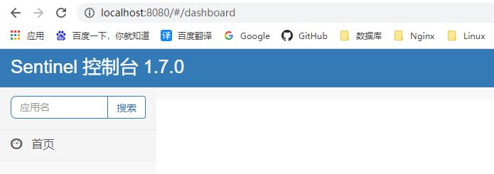
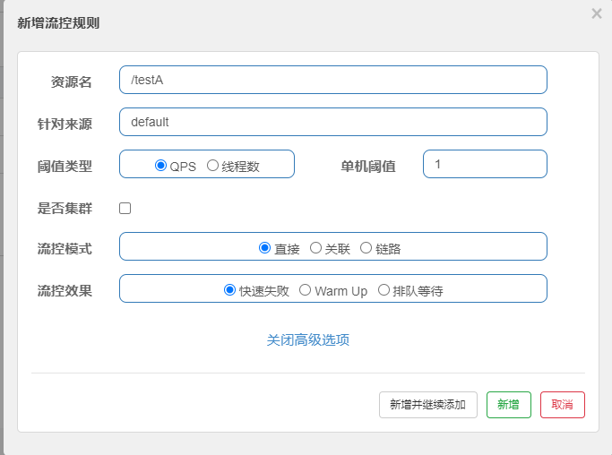
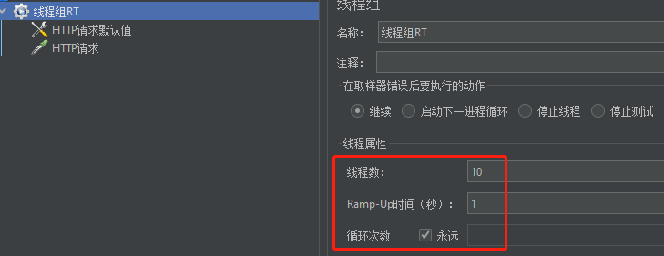
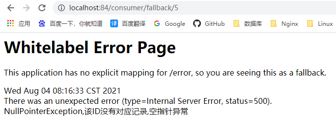

# 三、Sentinel实现熔断与限流

# 一、Sentinel:


实现熔断与限流，就是Hystrix


官方Github：[https://github.com/alibaba/Sentinel](https://github.com/alibaba/Sentinel)


官方文档：[https://github.com/alibaba/Sentinel/wiki/介绍](https://github.com/alibaba/Sentinel/wiki/%E4%BB%8B%E7%BB%8D)


## Sentinel 是什么？


随着微服务的流行，服务和服务之间的稳定性变得越来越重要。<font style="color:#E8323C;">Sentinel 以流量为切入点，从流量控制、熔断降级、系统负载保护等多个维度保护服务的稳定性。</font>


Sentinel 具有以下特征:


+ **丰富的应用场景**：Sentinel 承接了阿里巴巴近 10 年的双十一大促流量的核心场景，例如秒杀（即突发流量控制在系统容量可以承受的范围）、消息削峰填谷、集群流量控制、实时熔断下游不可用应用等。


+ **完备的实时监控**：Sentinel 同时提供实时的监控功能。您可以在控制台中看到接入应用的单台机器秒级数据，甚至 500 台以下规模的集群的汇总运行情况。


+ **广泛的开源生态**：Sentinel 提供开箱即用的与其它开源框架/库的整合模块，例如与 Spring Cloud、Dubbo、gRPC 的整合。您只需要引入相应的依赖并进行简单的配置即可快速地接入 Sentinel。


+ **完善的 SPI 扩展点**：Sentinel 提供简单易用、完善的 SPI 扩展接口。您可以通过实现扩展接口来快速地定制逻辑。例如定制规则管理、适配动态数据源等。


Sentinel 的主要特性：  


### Hystrix与Sentinel比较：


约定 > 配置 > 编码


都可以写在代码里面，但是我们本次还是大规模的学习使用配置和注解的方式，尽量少写代码


[https://spring-cloud-alibaba-group.github.io/github-pages/greenwich/spring-cloud-alibaba.html#_spring_cloud_alibaba_sentinel](https://spring-cloud-alibaba-group.github.io/github-pages/greenwich/spring-cloud-alibaba.html#_spring_cloud_alibaba_sentinel)


服务使用中的各种问题：


+ 服务雪崩
+ 服务降级
+ 服务熔断
+ 服务限流


## Sentinel下载安装运行


### Sentinel 组件由2部分组成：


+ 后台
+ 前台8080


核心库（Java 客户端）不依赖任何框架/库，能够运行于所有 Java 运行时环境，同时对 Dubbo / Spring Cloud 等框架也有较好的支持。


控制台（Dashboard）基于 Spring Boot 开发，打包后可以直接运行，不需要额外的 Tomcat 等应用容器。


### 安装步骤：


+  下载 
    -  [https://github.com/alibaba/Sentinel/releases](https://github.com/alibaba/Sentinel/releases) 
    -  下载到本地sentinel-dashboard-1.7.0.jar 
+  运行命令 
    - 前提 
        * Java 8 环境
        * 8080端口不能被占用
    - 命令 
        * `java -jar sentinel-dashboard-1.7.0.jar`
+  访问Sentinel管理界面 
    - localhost:8080
    - 登录账号密码均为sentinel





# 二、Sentinel初始化监控


### 启动Nacos8848成功


### 新建Module - cloudalibaba-sentinel-service8401


+ pom


```xml
<?xml version="1.0" encoding="UTF-8"?>
<project xmlns="http://maven.apache.org/POM/4.0.0"
         xmlns:xsi="http://www.w3.org/2001/XMLSchema-instance"
         xsi:schemaLocation="http://maven.apache.org/POM/4.0.0 http://maven.apache.org/xsd/maven-4.0.0.xsd">
    <parent>
        <artifactId>cloud2020</artifactId>
        <groupId>com.atguigu.springcloud</groupId>
        <version>1.0-SNAPSHOT</version>
    </parent>
    <modelVersion>4.0.0</modelVersion>

    <artifactId>cloudalibaba-sentinel-service8401</artifactId>

    <dependencies>

        <!--SpringCloud ailibaba nacos -->
        <dependency>
            <groupId>com.alibaba.cloud</groupId>
            <artifactId>spring-cloud-starter-alibaba-nacos-discovery</artifactId>
        </dependency>
        <!--SpringCloud ailibaba sentinel-datasource-nacos 后续做持久化用到-->
        <dependency>
            <groupId>com.alibaba.csp</groupId>
            <artifactId>sentinel-datasource-nacos</artifactId>
        </dependency>
        <!--SpringCloud ailibaba sentinel -->
        <dependency>
            <groupId>com.alibaba.cloud</groupId>
            <artifactId>spring-cloud-starter-alibaba-sentinel</artifactId>
        </dependency>
        <!--openfeign-->
        <dependency>
            <groupId>org.springframework.cloud</groupId>
            <artifactId>spring-cloud-starter-openfeign</artifactId>
        </dependency>
        <!-- SpringBoot整合Web组件+actuator -->
        <dependency>
            <groupId>org.springframework.boot</groupId>
            <artifactId>spring-boot-starter-web</artifactId>
        </dependency>
        <dependency>
            <groupId>org.springframework.boot</groupId>
            <artifactId>spring-boot-starter-actuator</artifactId>
        </dependency>
        <!-- 引入自己定义的api通用包，可以使用Payment支付Entity -->
        <dependency>
            <groupId>com.atguigu.springcloud</groupId>
            <artifactId>cloud-api-commons</artifactId>
            <version>${project.version}</version>
        </dependency>
        <!--日常通用jar包配置-->
        <dependency>
            <groupId>org.springframework.boot</groupId>
            <artifactId>spring-boot-devtools</artifactId>
            <scope>runtime</scope>
            <optional>true</optional>
        </dependency>
        <dependency>
            <groupId>cn.hutool</groupId>
            <artifactId>hutool-all</artifactId>
            <version>4.6.3</version>
        </dependency>
        <dependency>
            <groupId>org.projectlombok</groupId>
            <artifactId>lombok</artifactId>
            <optional>true</optional>
        </dependency>
        <dependency>
            <groupId>org.springframework.boot</groupId>
            <artifactId>spring-boot-starter-test</artifactId>
            <scope>test</scope>
        </dependency>

    </dependencies>

</project>
```


+ yml


```yaml
server:
  port: 8401

spring:
  application:
    name: cloudalibaba-sentinel-service
  cloud:
    nacos:
      discovery:
        server-addr: localhost:8848 #Nacos服务注册中心地址
    sentinel:
      transport:
        dashboard: localhost:8080 #配置Sentinel dashboard地址
        port: 8719 # 默认8719端口，假如被占用会自动从8719开始依次+1扫描，直至找到未被占用的端口

management:
  endpoints:
    web:
      exposure:
        include: '*'
```


+ 主启动类


```java
package com.atguigu.springcloud;

import org.springframework.boot.SpringApplication;
import org.springframework.boot.autoconfigure.SpringBootApplication;
import org.springframework.cloud.client.discovery.EnableDiscoveryClient;

/**
 * @author: like
 * @Date: 2021/08/01 7:24
 */
@EnableDiscoveryClient
@SpringBootApplication
public class MainApp8401 {

    public static void main(String[] args) {
        SpringApplication.run(MainApp8401.class, args);
    }

}
```


+ 业务类


```java
package com.atguigu.springcloud.controller;

import lombok.extern.slf4j.Slf4j;
import org.springframework.web.bind.annotation.GetMapping;
import org.springframework.web.bind.annotation.RestController;

/**
 * @author: like
 * @Date: 2021/08/01 7:26
 */
@RestController
@Slf4j
public class FlowLimitController {

    @GetMapping("/testA")
    public String testA() {
        return "------testA";
    }

    @GetMapping("/testB")
    public String testB() {
        log.info(Thread.currentThread().getName() + "\t" + "...testB");
        return "------testB";
    }

}
```


### 启动Sentinel8080
****

`**java -jar sentinel-dashboard-1.7.0.jar**`


### 启动微服务8401后查看sentienl控制台


+ 刚启动，空空如也，啥都没有


+  <font style="color:#E8323C;">Sentinel采用的懒加载说明 </font>
    - 执行一次访问即可 
        * [http://localhost:8401/testA](http://localhost:8401/testA)
        * [http://localhost:8401/testB](http://localhost:8401/testB)
    - 效果 - sentinel8080正在监控微服务8401


# 三、流控规则


## 基本介绍


进一步解释说明：


+ 资源名：唯一名称，默认请求路径。
+ 针对来源：Sentinel可以针对调用者进行限流，填写微服务名，默认default（不区分来源）。
+ 阈值类型/单机阈值： 
    - QPS(每秒钟的请求数量)︰当调用该API的QPS达到阈值的时候，进行限流。
    - 线程数：当调用该API的线程数达到阈值的时候，进行限流。
+ 是否集群：不需要集群。
+ 流控模式： 
    - 直接：API达到限流条件时，直接限流。
    - 关联：当关联的资源达到阈值时，就限流自己。
    - 链路：只记录指定链路上的流量（指定资源从入口资源进来的流量，如果达到阈值，就进行限流)【API级别的针对来源】。
+ 流控效果： 
    - 快速失败：直接失败，抛异常。
    - Warm up：根据Code Factor（冷加载因子，默认3）的值，从阈值/codeFactor，经过预热时长，才达到设置的QPS阈值。
    - 排队等待：匀速排队，让请求以匀速的速度通过，阈值类型必须设置为QPS，否则无效。


## 流控模式


### 直接


**是什么？快速失败（系统默认）**


#### QPS


**配置及说明**


表示1秒钟内查询1次就是OK，若超过次数1，就直接->快速失败，报默认错误





+  测试  
快速多次点击访问http://localhost:8401/testA 


+  结果  
 
+  源码  
com.alibaba.csp.sentinel.slots.block.flow.controller.DefaultController 


+  思考  
直接调用默认报错信息，技术方面OK，但是，是否应该有我们自己的后续处理？类似有个fallback的兜底方法? 


#### 线程数


线程数：当调用该API的线程数达到阈值的时候，进行限流。


```java
@GetMapping("/testA")
public String testA() {
    log.info("当前线程：" + Thread.currentThread().getName());
    try {
        TimeUnit.MILLISECONDS.sleep(800);
    } catch (InterruptedException e) {
        e.printStackTrace();
    }
    return "------testA";
}
```


测试


一秒内两个窗口访问http://localhost:8401/testA


### 关联


**是什么？**


+ 当自己关联的资源达到阈值时，就限流自己
+ 当与A关联的资源B达到阀值后，就限流A自己（B惹事，A挂了）


应用场景:  比如**支付接口**达到阈值,就要限流下**订单的接口**,防止一直有订单


**设置testA**


当关联资源/testB的QPS阀值超过1时，就限流/testA的Rest访问地址，**当关联资源到阈值后限制配置好的资源名**。


**Postman模拟并发密集访问testB**


**Postman运行后，点击访问http://localhost:8401/testA，发现testA挂了**


### 链路


只记录指定链路上的流量（指定资源从入口资源进来的流量，如果达到阈值，就进行限流)【API级别的针对来源】


## 流控效果


### 快速失败


默认的流控处理


直接失败，抛出异常


### 预热 Warm Up


Warm Up（RuleConstant.CONTROL_BEHAVIOR_WARM_UP）方式，即预热/冷启动方式。


当系统长期处于低水位的情况下，当流量突然增加时，直接把系统拉升到高水位可能瞬间把系统压垮。


通过"冷启动"，让通过的流量缓慢增加，在一定时间内逐渐增加到阈值上限，给冷系统一个预热的时间，避免冷系统被压垮。


详细文档可以参考 流量控制 - Warm Up 文档，具体的例子可以参见 WarmUpFlowDemo。


通常冷启动的过程系统允许通过的 QPS 曲线如下图所示：  


> 默认coldFactor为3，即请求QPS 从 threshold / 3开始，经预热时长逐渐升至设定的QPS阈值
>


**源码** - com.alibaba.csp.sentinel.slots.block.flow.controller.WarmUpController


**WarmUp配置**


案例，阀值为10 + 预热时长设置5秒


系统初始化的阀值为10/ 3约等于3,即阀值刚开始为3;然后过了5秒后阀值才慢慢升高恢复到10


**测试**


多次快速点击http://localhost:8401/testB - 刚开始不行，后续慢慢OK


**应用场景**


如：秒杀系统在开启的瞬间，会有很多流量上来，很有可能把系统打死，预热方式就是把为了保护系统，可慢慢的把流量放进来,慢慢的把阀值增长到设置的阀值。


### 排队等待


匀速排队，让请求以均匀的速度通过，阀值类型必须设成QPS，否则无效。


设置：/testB每秒1次请求，超过的话就排队等待，等待的超时时间为20000毫秒。


匀速排队（`RuleConstant.CONTROL_BEHAVIOR_RATE_LIMITER`）方式会严格控制请求通过的间隔时间，也即是让请求以均匀的速度通过，对应的是漏桶算法。


详细文档可以参考 [流量控制 - 匀速器模式](https://github.com/alibaba/Sentinel/wiki/%E6%B5%81%E9%87%8F%E6%8E%A7%E5%88%B6-%E5%8C%80%E9%80%9F%E6%8E%92%E9%98%9F%E6%A8%A1%E5%BC%8F)，具体的例子可以参见 [PaceFlowDemo](https://github.com/alibaba/Sentinel/blob/master/sentinel-demo/sentinel-demo-basic/src/main/java/com/alibaba/csp/sentinel/demo/flow/PaceFlowDemo.java)。


该方式的作用如下图所示：


这种方式主要用于处理间隔性突发的流量，例如消息队列。


想象一下这样的场景，在某一秒有大量的请求到来，而接下来的几秒则处于空闲状态，我们希望系统能够在接下来的空闲期间逐渐处理这些请求，而不是在第一秒直接拒绝多余的请求。


> 注意：匀速排队模式暂时不支持 QPS > 1000 的场景。
>


源码 - com.alibaba.csp.sentinel.slots.block.flow.controller.RateLimiterController


**测试**


+  添加日志记录代码到FlowLimitController的testB方法 

```java
@GetMapping("/testB")
public String testB() {
    log.info(Thread.currentThread().getName()+"\t"+"...testB");//<----
    return "------testB";
}
```

 

+  Postman模拟并发密集访问testB。具体操作参考------- 流控-关联 


+ 后台结果


# 四、降级规则


[官方文档](https://github.com/alibaba/Sentinel/wiki/%E7%86%94%E6%96%AD%E9%99%8D%E7%BA%A7)


## 概述


除了流量控制以外，对调用链路中不稳定的资源进行熔断降级也是保障高可用的重要措施之一。一个服务常常会调用别的模块，可能是另外的一个远程服务、数据库，或者第三方 API 等。例如，支付的时候，可能需要远程调用银联提供的 API；查询某个商品的价格，可能需要进行数据库查询。然而，这个被依赖服务的稳定性是不能保证的。如果依赖的服务出现了不稳定的情况，请求的响应时间变长，那么调用服务的方法的响应时间也会变长，线程会产生堆积，最终可能耗尽业务自身的线程池，服务本身也变得不可用。


现代微服务架构都是分布式的，由非常多的服务组成。不同服务之间相互调用，组成复杂的调用链路。以上的问题在链路调用中会产生放大的效果。复杂链路上的某一环不稳定，就可能会层层级联，最终导致整个链路都不可用。因此我们需要对不稳定的**弱依赖服务调用**进行熔断降级，暂时切断不稳定调用，避免局部不稳定因素导致整体的雪崩。熔断降级作为保护自身的手段，通常在客户端（调用端）进行配置。


## 熔断策略


+ RT（平均响应时间，秒级） 
    - 平均响应时间 超出阈值 且 在时间窗口内通过的请求>=5，两个条件同时满足后触发降级。
    - 窗口期过后关闭断路器。
    - RT最大4900（更大的需要通过-Dcsp.sentinel.statistic.max.rt=XXXX才能生效）。
+ 异常比列（秒级） 
    - QPS >= 5且异常比例（秒级统计）超过阈值时，触发降级;时间窗口结束后，关闭降级 。
+ 异常数(分钟级) 
    - 异常数(分钟统计）超过阈值时，触发降级;时间窗口结束后，关闭降级


Sentinel熔断降级会在调用链路中某个资源出现不稳定状态时（例如调用超时或异常比例升高)，对这个资源的调用进行限制，让请求快速失败，避免影响到其它的资源而导致级联错误。


当资源被降级后，在接下来的降级时间窗口之内，对该资源的调用都自动熔断（默认行为是抛出 DegradeException）。


Sentinei的断路器是没有类似Hystrix半开状态的。(Sentinei 1.8.0 已有半开状态)


半开的状态系统自动去检测是否请求有异常，没有异常就关闭断路器恢复使用，有异常则继续打开断路器不可用。


## RT


**是什么？**


> 平均响应时间(DEGRADE_GRADE_RT)：当1s内持续进入5个请求，对应时刻的平均响应时间（秒级）均超过阈值（ count，以ms为单位），那么在接下的时间窗口（DegradeRule中的timeWindow，以s为单位）之内，对这个方法的调用都会自动地熔断(抛出DegradeException )。
>
>  
>
> 注意Sentinel 默认统计的RT上限是4900 ms，超出此阈值的都会算作4900ms，若需要变更此上限可以通过启动配置项-Dcsp.sentinel.statistic.max.rt=xxx来配置。
>


**注意**：Sentinel 1.7.0才有**平均响应时间**（`DEGRADE_GRADE_RT`），Sentinel 1.8.0的没有这项，取而代之的是**慢调用比例** (`SLOW_REQUEST_RATIO`)。


> 慢调用比例 (SLOW_REQUEST_RATIO)：选择以慢调用比例作为阈值，需要设置允许的慢调用 RT（即最大的响应时间），请求的响应时间大于该值则统计为慢调用。
>
>  
>
> 当单位统计时长（statIntervalMs）内请求数目大于设置的最小请求数目，并且慢调用的比例大于阈值，则接下来的熔断时长内请求会自动被熔断。
>
>  
>
> 经过熔断时长后熔断器会进入探测恢复状态（HALF-OPEN 状态），若接下来的一个请求响应时间小于设置的慢调用 RT 则结束熔断，若大于设置的慢调用 RT 则会再次被熔断。
>


**接下来讲解Sentinel 1.7.0的。**


### 测试


代码


```java
@RestController
@Slf4j
public class FlowLimitController {
	...

    @GetMapping("/testD")
    public String testD() {
        try { 
            TimeUnit.SECONDS.sleep(1); 
        } catch (InterruptedException e) { 
            e.printStackTrace(); 
        }
        log.info("testD 测试RT");
        return "------testD";
    }
}
```


配置


jmeter压测





### 结论


按照上述配置，永远一秒钟打进来10个线程（大于5个了）调用testD，我们希望200毫秒处理完本次任务，如果超过200毫秒还没处理完，在未来1秒钟的时间窗口内，断路器打开（保险丝跳闸）微服务不可用，保险丝跳闸断电了。


后续我停止jmeter，没有这么大的访问量了，断路器关闭（保险丝恢复），微服务恢复OK。


## 异常比例


是什么？


> 异常比例(DEGRADE_GRADE_EXCEPTION_RATIO)：当资源的每秒请求量 >= 5，并且每秒异常总数占通过量的比值超过阈值（ DegradeRule中的 count）之后，资源进入降级状态，即在接下的时间窗口( DegradeRule中的timeWindow，以s为单位）之内，对这个方法的调用都会自动地返回。
>
>  
>
> 异常比率的阈值范围是[0.0, 1.0]，代表0% -100%。
>


**注意**，与Sentinel 1.8.0相比，有些不同（Sentinel 1.8.0才有的半开状态），Sentinel 1.8.0的如下：


> 异常比例 (ERROR_RATIO)：当单位统计时长（statIntervalMs）内请求数目大于设置的最小请求数目，并且异常的比例大于阈值，则接下来的熔断时长内请求会自动被熔断。
>
>  
>
> 经过熔断时长后熔断器会进入探测恢复状态（HALF-OPEN 状态），若接下来的一个请求成功完成（没有错误）则结束熔断，否则会再次被熔断。
>
>  
>
> 异常比率的阈值范围是 [0.0, 1.0]，代表 0% - 100%。
>


接下来讲解Sentinel 1.7.0的。


### 测试


代码：


```java
@RestController
@Slf4j
public class FlowLimitController {

    ...

    @GetMapping("/testD")
    public String testD() {
        log.info("testD 异常比例");
        int age = 10/0;
        return "------testD";
    }
}
```


配置


jmeter压测


### 结论


按照上述配置，单独访问一次，必然来一次报错一次(int age = 10/0)，调一次错一次。


开启jmeter后，直接高并发发送请求，多次调用达到我们的配置条件了。断路器开启(保险丝跳闸)，微服务不可用了，不再报错error而是服务降级了。


## 异常数


是什么？


> 异常数( DEGRADE_GRADF_EXCEPTION_COUNT )：当资源近1分钟的异常数目超过阈值之后会进行熔断。
>
>  
>
> 注意由于统计时间窗口是分钟级别的，若timeWindow小于60s，则结束熔断状态后码可能再进入熔断状态。
>


注意，与Sentinel 1.8.0相比，有些不同（Sentinel 1.8.0才有的半开状态），Sentinel 1.8.0的如下：


> 异常数 (`ERROR_COUNT`)：当单位统计时长内的异常数目超过阈值之后会自动进行熔断。经过熔断时长后熔断器会进入探测恢复状态（HALF-OPEN 状态），若接下来的一个请求成功完成（没有错误）则结束熔断，否则会再次被熔断。
>


接下来讲解Sentinel 1.7.0的。


**异常数是按照分钟统计的，时间窗口一定要大于等于60秒**。


### 测试


代码


```java
@RestController
@Slf4j
public class FlowLimitController{
	...

    @GetMapping("/testE")
    public String testE()
    {
        log.info("testE 测试异常数");
        int age = 10/0;
        return "------testE 测试异常数";
    }
}
```


配置


访问http://localhost:8401/testE，第一次访问绝对报错，因为除数不能为零，我们看到error窗口，但是达到5次报错后，进入熔断后降级。


# 五、热点key限流


## 官网


官方文档：[https://github.com/alibaba/Sentinel/wiki/热点参数限流](https://github.com/alibaba/Sentinel/wiki/%E7%83%AD%E7%82%B9%E5%8F%82%E6%95%B0%E9%99%90%E6%B5%81)


何为热点？热点即经常访问的数据。很多时候我们希望统计某个热点数据中访问频次最高的 Top K 数据，并对其访问进行限制。


比如：


+ 商品 ID 为参数，统计一段时间内最常购买的商品 ID 并进行限制
+ 用户 ID 为参数，针对一段时间内频繁访问的用户 ID 进行限制


热点参数限流会统计传入参数中的热点参数，并根据配置的限流阈值与模式，对包含热点参数的资源调用进行限流。


热点参数限流可以看做是一种特殊的流量控制，仅对包含热点参数的资源调用生效。  


> Sentinel 利用 LRU 策略统计最近最常访问的热点参数，结合令牌桶算法来进行参数级别的流控。
>
>  
>
> 热点参数限流支持集群模式。
>


## 承上启下复习start


兜底方法，分为系统默认和客户自定义，两种


之前的case，限流出问题后，都是用sentinel系统默认的提示: Blocked by Sentinel (flow limiting)


我们能不能自定？类似hystrix，某个方法出问题了，就找对应的兜底降级方法?


结论 - 从HystrixCommand到[@SentinelResource ](/SentinelResource ) 


## 代码


com.alibaba.csp.sentinel.slots.block.BlockException


```java
@RestController
@Slf4j
public class FlowLimitController
{

    ...

    @GetMapping("/testHotKey")
    @SentinelResource(value = "testHotKey",blockHandler = "deal_testHotKey")
    public String testHotKey(@RequestParam(value = "p1",required = false) String p1,
                             @RequestParam(value = "p2",required = false) String p2) {
        return "------testHotKey";
    }
    
    /*兜底方法*/
    public String deal_testHotKey (String p1, String p2, BlockException exception) {
        return "------deal_testHotKey,o(╥﹏╥)o";  //sentinel系统默认的提示：Blocked by Sentinel (flow limiting)
    }

}
```


## 配置


+  [@SentinelResource(value ](/SentinelResource(value ) = "testHotKey")  
    - 异常打到了前台用户界面看到，不友好
+  [@SentinelResource(value ](/SentinelResource(value ) = "testHotKey", blockHandler = "dealHandler_testHotKey")  
    - 方法testHotKey里面第一个参数只要QPS超过每秒1次，马上降级处理
    - 异常用了我们自己定义的兜底方法


## 测试


+  error 
    - [http://localhost:8401/testHotKey?p1=abc](http://localhost:8401/testHotKey?p1=abc)
    - [http://localhost:8401/testHotKey?p1=abc&p2=33](http://localhost:8401/testHotKey?p1=abc&p2=33)
+  right 
    - [http://localhost:8401/testHotKey?p2=abc](http://localhost:8401/testHotKey?p2=abc)


上述案例演示了第一个参数p1，当QPS超过1秒1次点击后马上被限流。


## 参数例外项


+ 普通 
    - 超过1秒钟一个后，达到阈值1后马上被限流
+ **我们期望p1参数当它是某个特殊值时，它的限流值和平时不一样**
+ 特例 
    - 假如当p1的值等于5时，它的阈值可以达到200


**配置**


**测试**


+ right - [http://localhost:8401/testHotKey?p1=5](http://localhost:8401/testHotKey?p1=5) 
    - 当p1等于5的时候，阈值变为200
+ error - [http://localhost:8401/testHotKey?p1=3](http://localhost:8401/testHotKey?p1=3) 
    - 当p1不等于5的时候，阈值就是平常的1


## 其它


在方法体抛异常


```java
@RestController
@Slf4j
public class FlowLimitController
{

    ...

    @GetMapping("/testHotKey")
    @SentinelResource(value = "testHotKey",blockHandler = "deal_testHotKey")
    public String testHotKey(@RequestParam(value = "p1",required = false) String p1,
                             @RequestParam(value = "p2",required = false) String p2) {
        int age = 10/0;//<----------------------------会抛异常的地方
        return "------testHotKey";
    }
    
    /*兜底方法*/
    public String deal_testHotKey (String p1, String p2, BlockException exception) {
        return "------deal_testHotKey,o(╥﹏╥)o";  //sentinel系统默认的提示：Blocked by Sentinel (flow limiting)
    }

}
```


将会抛出Spring Boot 2的默认异常页面，而不是兜底方法。


+  [@SentinelResource ](/SentinelResource ) --- 处理的是sentinel控制台配置的违规情况，有blockHandler方法配置的兜底处理;  
+  RuntimeException int age = 10/0，这个是java运行时报出的运行时异常RunTimeException，@SentinelResource不管 


总结 --- @SentinelResource主管配置出错，运行出错该走异常走异常


# 六、系统规则


官方文档：[https://github.com/alibaba/Sentinel/wiki/系统自适应限流](https://github.com/alibaba/Sentinel/wiki/%E7%B3%BB%E7%BB%9F%E8%87%AA%E9%80%82%E5%BA%94%E9%99%90%E6%B5%81)


Sentinel 系统自适应限流从整体维度对应用入口流量进行控制，结合应用的 Load、CPU 使用率、总体平均 RT、入口 QPS 和并发线程数等几个


维度的监控指标，通过自适应的流控策略，让系统的入口流量和系统的负载达到一个平衡，让系统尽可能跑在最大吞吐量的同时保证系统整体的


稳定性。


## 系统规则


系统保护规则是从应用级别的入口流量进行控制，从单台机器的 load、CPU 使用率、平均 RT、入口 QPS 和并发线程数等几个维度监控应用指标，让系统尽可能跑在最大吞吐量的同时保证系统整体的稳定性。


系统保护规则是应用整体维度的，而不是资源维度的，并且**仅对入口流量生效**。入口流量指的是进入应用的流量（`EntryType.IN`），比如 Web 服务或 Dubbo 服务端接收的请求，都属于入口流量。


系统规则支持以下的模式：


+ **Load 自适应**（仅对 Linux/Unix-like 机器生效）：系统的 load1 作为启发指标，进行自适应系统保护。当系统 load1 超过设定的启发值，且系统当前的并发线程数超过估算的系统容量时才会触发系统保护（BBR 阶段）。系统容量由系统的 `maxQps * minRt` 估算得出。设定参考值一般是 `CPU cores * 2.5`。
+ **CPU usage**（1.5.0+ 版本）：当系统 CPU 使用率超过阈值即触发系统保护（取值范围 0.0-1.0），比较灵敏。
+ **平均 RT**：当单台机器上所有入口流量的平均 RT 达到阈值即触发系统保护，单位是毫秒。
+ **并发线程数**：当单台机器上所有入口流量的并发线程数达到阈值即触发系统保护。
+ **入口 QPS**：当单台机器上所有入口流量的 QPS 达到阈值即触发系统保护。


# 七、@SentinelResource  


## 按资源名称限流+后续处理


**启动Nacos成功**


**启动Sentinel成功**


**Module - cloudalibaba-sentinel-service8401**


修改pom


```xml
<!-- 引入自己定义的api通用包，可以使用Payment支付Entity -->
<dependency>
    <groupId>com.atguigu.springcloud</groupId>
    <artifactId>cloud-api-commons</artifactId>
    <version>${project.version}</version>
</dependency>
```


+ 业务类


```java
package com.atguigu.springcloud.controller;

import com.alibaba.csp.sentinel.annotation.SentinelResource;
import com.alibaba.csp.sentinel.slots.block.BlockException;
import com.atguigu.springcloud.entities.CommonResult;
import com.atguigu.springcloud.entities.Payment;
import org.springframework.web.bind.annotation.GetMapping;
import org.springframework.web.bind.annotation.RestController;

@RestController
public class RateLimitController {

    @GetMapping("/byResource")
    @SentinelResource(value = "byResource", blockHandler = "handleException")
    public CommonResult byResource() {
        return new CommonResult(200, "按资源名称限流测试OK", new Payment(2020L, "serial001"));
    }

    public CommonResult handleException(BlockException exception) {
        return new CommonResult(444, exception.getClass().getCanonicalName() + "\t 服务不可用");
    }
}
```


### 配置流控规则


**注意,我们这里配置规则,资源名指定的是@SentinelResource注解value的值,**


**这样也是可以的,也就是不一定要指定访问路径**


**测试**


1秒钟点击1下，OK


超过上述，疯狂点击，返回了自己定义的限流处理信息，限流发生


**额外问题**


此时关闭服务8401 -> Sentinel控制台，流控规则消失了


## 按照URL地址限流+后续处理


**通过访问的URL来限流，会返回Sentinel自带默认的限流处理信息**


**业务类RateLimitController**


```java
@RestController
public class RateLimitController
{
	...

    @GetMapping("/rateLimit/byUrl")
    @SentinelResource(value = "byUrl")
    public CommonResult byUrl()
    {
        return new CommonResult(200,"按url限流测试OK",new Payment(2020L,"serial002"));
    }
}
```


### Sentinel控制台配置


**测试**


+ 快速点击http://localhost:8401/rateLimit/byUrl
+ 结果 - 会返回Sentinel自带的限流处理结果 Blocked by Sentinel (flow limiting)


## 上面兜底方案面临的问题


1. 系统默认的，没有体现我们自己的业务要求。
2. 依照现有条件，我们自定义的处理方法又和业务代码耦合在一块，不直观。
3. 每个业务方法都添加—个兜底的，那代码膨胀加剧。
4. 全局统—的处理方法没有体现。


## 客户自定义限流处理逻辑


### 自定义限流处理类


创建CustomerBlockHandler类用于自定义限流处理逻辑


```java
package com.atguigu.springcloud.myhandler;

import com.alibaba.csp.sentinel.slots.block.BlockException;
import com.atguigu.springcloud.entities.CommonResult;

public class CustomerBlockHandler {

    public static CommonResult handlerException(BlockException exception) {
        return new CommonResult(4444, "按客戶自定义,global handlerException----1");
    }

    public static CommonResult handlerException2(BlockException exception) {
        return new CommonResult(4444, "按客戶自定义,global handlerException----2");
    }
}
```


**RateLimitController**


```java
@RestController
public class RateLimitController {
	...

    @GetMapping("/rateLimit/customerBlockHandler")
    @SentinelResource(value = "customerBlockHandler",
            blockHandlerClass = CustomerBlockHandler.class,//<-------- 自定义限流处理类
            blockHandler = "handlerException2")//<----------- 用哪个方法
    public CommonResult customerBlockHandler()
    {
        return new CommonResult(200,"按客戶自定义",new Payment(2020L,"serial003"));
    }
}
```


**Sentinel控制台配置**


多次快速刷新http://localhost:8401/rateLimit/customerBlockHandler。


刷新后，我们自定义兜底方法的字符串信息就返回到前端。


## 更多注解属性说明


> 注意：注解方式埋点不支持 private 方法。
>


`@SentinelResource` 用于定义资源，并提供可选的异常处理和 fallback 配置项。 `@SentinelResource` 注解包含以下属性：


+ `value`：资源名称，必需项（不能为空）
+ `entryType`：entry 类型，可选项（默认为 `EntryType.OUT`）
+ `blockHandler` / `blockHandlerClass`: `blockHandler` 对应处理 `BlockException` 的函数名称，可选项。blockHandler 函数访问范围需要是 `public`，返回类型需要与原方法相匹配，参数类型需要和原方法相匹配并且最后加一个额外的参数，类型为 `BlockException`。blockHandler 函数默认需要和原方法在同一个类中。若希望使用其他类的函数，则可以指定 `blockHandlerClass` 为对应的类的 `Class` 对象，注意对应的函数必需为 static 函数，否则无法解析。
+ `fallback` / `fallbackClass`：fallback 函数名称，可选项，用于在抛出异常的时候提供 fallback 处理逻辑。fallback 函数可以针对所有类型的异常（除了 `exceptionsToIgnore` 里面排除掉的异常类型）进行处理。fallback 函数签名和位置要求： 
    - 返回值类型必须与原函数返回值类型一致；
    - 方法参数列表需要和原函数一致，或者可以额外多一个 `Throwable` 类型的参数用于接收对应的异常。
    - fallback 函数默认需要和原方法在同一个类中。若希望使用其他类的函数，则可以指定 `fallbackClass` 为对应的类的 `Class` 对象，注意对应的函数必需为 static 函数，否则无法解析。
+ `defaultFallback`（since 1.6.0）：默认的 fallback 函数名称，可选项，通常用于通用的 fallback 逻辑（即可以用于很多服务或方法）。默认 fallback 函数可以针对所有类型的异常（除了 `exceptionsToIgnore` 里面排除掉的异常类型）进行处理。若同时配置了 fallback 和 defaultFallback，则只有 fallback 会生效。defaultFallback 函数签名要求： 
    - 返回值类型必须与原函数返回值类型一致；
    - 方法参数列表需要为空，或者可以额外多一个 `Throwable` 类型的参数用于接收对应的异常。
    - defaultFallback 函数默认需要和原方法在同一个类中。若希望使用其他类的函数，则可以指定 `fallbackClass` 为对应的类的 `Class` 对象，注意对应的函数必需为 static 函数，否则无法解析。
+ `exceptionsToIgnore`（since 1.6.0）：用于指定哪些异常被排除掉，不会计入异常统计中，也不会进入 fallback 逻辑中，而是会原样抛出。


### Sentinel主要有三个核心Api：


1. SphU定义资源
2. Tracer定义统计
3. ContextUtil定义了上下文


# 八、服务熔断功能


## sentinel整合ribbon+openFeign+fallback


## Ribbon系列


+  启动nacos和sentinel 
+  提供者9003/9004  
新建cloudalibaba-provider-payment9003/9004，两个一样的做法 

```xml
<?xml version="1.0" encoding="UTF-8"?>
<project xmlns="http://maven.apache.org/POM/4.0.0"
         xmlns:xsi="http://www.w3.org/2001/XMLSchema-instance"
         xsi:schemaLocation="http://maven.apache.org/POM/4.0.0 http://maven.apache.org/xsd/maven-4.0.0.xsd">
    <parent>
        <artifactId>cloud2020</artifactId>
        <groupId>com.atguigu.springcloud</groupId>
        <version>1.0-SNAPSHOT</version>
    </parent>
    <modelVersion>4.0.0</modelVersion>

    <artifactId>cloudalibaba-provider-payment9003</artifactId>

    <dependencies>
        <!--SpringCloud ailibaba nacos -->
        <dependency>
            <groupId>com.alibaba.cloud</groupId>
            <artifactId>spring-cloud-starter-alibaba-nacos-discovery</artifactId>
        </dependency>
        <!-- 引入自己定义的api通用包，可以使用Payment支付Entity -->
        <dependency>
            <groupId>com.atguigu.springcloud</groupId>
            <artifactId>cloud-api-commons</artifactId>
            <version>${project.version}</version>
        </dependency>
        <!-- SpringBoot整合Web组件 -->
        <dependency>
            <groupId>org.springframework.boot</groupId>
            <artifactId>spring-boot-starter-web</artifactId>
        </dependency>
        <dependency>
            <groupId>org.springframework.boot</groupId>
            <artifactId>spring-boot-starter-actuator</artifactId>
        </dependency>
        <!--日常通用jar包配置-->
        <dependency>
            <groupId>org.springframework.boot</groupId>
            <artifactId>spring-boot-devtools</artifactId>
            <scope>runtime</scope>
            <optional>true</optional>
        </dependency>
        <dependency>
            <groupId>org.projectlombok</groupId>
            <artifactId>lombok</artifactId>
            <optional>true</optional>
        </dependency>
        <dependency>
            <groupId>org.springframework.boot</groupId>
            <artifactId>spring-boot-starter-test</artifactId>
            <scope>test</scope>
        </dependency>
    </dependencies>

</project>
```

 


YML **记得修改不同的端口号**


```yaml
server:
  port: 9003

spring:
  application:
    name: nacos-payment-provider
  cloud:
    nacos:
      discovery:
        server-addr: localhost:8848 #配置Nacos地址

management:
  endpoints:
    web:
      exposure:
        include: '*'
```


主启动类：


```java
package com.atguigu.springcloud;

import org.springframework.boot.SpringApplication;
import org.springframework.boot.autoconfigure.SpringBootApplication;
import org.springframework.cloud.client.discovery.EnableDiscoveryClient;

/**
 * @author: like
 * @Date: 2021/08/04 7:13
 */
@SpringBootApplication
@EnableDiscoveryClient
public class PaymentMain9003 {

    public static void main(String[] args) {
        SpringApplication.run(PaymentMain9003.class, args);
    }

}
```


业务类


```java
package com.atguigu.springcloud.controller;

import com.atguigu.springcloud.entities.CommonResult;
import com.atguigu.springcloud.entities.Payment;
import org.springframework.beans.factory.annotation.Value;
import org.springframework.web.bind.annotation.GetMapping;
import org.springframework.web.bind.annotation.PathVariable;
import org.springframework.web.bind.annotation.RestController;

import java.util.HashMap;

/**
 * @author: like
 * @Date: 2021/08/04 7:15
 */
@RestController
public class PaymentController {
    @Value("${server.port}")
    private String serverPort;

    //模拟数据库
    public static HashMap<Long, Payment> hashMap = new HashMap<>();

    static {
        hashMap.put(1L, new Payment(1L, "28a8c1e3bc2742d8848569891fb42181"));
        hashMap.put(2L, new Payment(2L, "bba8c1e3bc2742d8848569891ac32182"));
        hashMap.put(3L, new Payment(3L, "6ua8c1e3bc2742d8848569891xt92183"));
    }

    @GetMapping(value = "/paymentSQL/{id}")
    public CommonResult<Payment> paymentSQL(@PathVariable("id") Long id) {
        Payment payment = hashMap.get(id);
        CommonResult<Payment> result = new CommonResult(200, "from mysql,serverPort:  " + serverPort, payment);
        return result;
    }

}
```


测试地址 - [http://localhost:9003/paymentSQL/1](http://localhost:9003/paymentSQL/1)


+ 消费者84


新建cloudalibaba-consumer-nacos-order84


POM


```xml
<?xml version="1.0" encoding="UTF-8"?>
<project xmlns="http://maven.apache.org/POM/4.0.0"
         xmlns:xsi="http://www.w3.org/2001/XMLSchema-instance"
         xsi:schemaLocation="http://maven.apache.org/POM/4.0.0 http://maven.apache.org/xsd/maven-4.0.0.xsd">
    <parent>
        <artifactId>cloud2020</artifactId>
        <groupId>com.atguigu.springcloud</groupId>
        <version>1.0-SNAPSHOT</version>
    </parent>
    <modelVersion>4.0.0</modelVersion>

    <artifactId>cloudalibaba-consumer-nacos-order84</artifactId>

    <dependencies>
        <!--SpringCloud openfeign -->
        <!--
        <dependency>
            <groupId>org.springframework.cloud</groupId>
            <artifactId>spring-cloud-starter-openfeign</artifactId>
        </dependency>
        -->
        <!--SpringCloud ailibaba nacos -->
        <dependency>
            <groupId>com.alibaba.cloud</groupId>
            <artifactId>spring-cloud-starter-alibaba-nacos-discovery</artifactId>
        </dependency>
        <!--SpringCloud ailibaba sentinel -->
        <dependency>
            <groupId>com.alibaba.cloud</groupId>
            <artifactId>spring-cloud-starter-alibaba-sentinel</artifactId>
        </dependency>
        <!-- 引入自己定义的api通用包，可以使用Payment支付Entity -->
        <dependency>
            <groupId>com.atguigu.springcloud</groupId>
            <artifactId>cloud-api-commons</artifactId>
            <version>${project.version}</version>
        </dependency>
        <!-- SpringBoot整合Web组件 -->
        <dependency>
            <groupId>org.springframework.boot</groupId>
            <artifactId>spring-boot-starter-web</artifactId>
        </dependency>
        <dependency>
            <groupId>org.springframework.boot</groupId>
            <artifactId>spring-boot-starter-actuator</artifactId>
        </dependency>
        <!--日常通用jar包配置-->
        <dependency>
            <groupId>org.springframework.boot</groupId>
            <artifactId>spring-boot-devtools</artifactId>
            <scope>runtime</scope>
            <optional>true</optional>
        </dependency>
        <dependency>
            <groupId>org.projectlombok</groupId>
            <artifactId>lombok</artifactId>
            <optional>true</optional>
        </dependency>
        <dependency>
            <groupId>org.springframework.boot</groupId>
            <artifactId>spring-boot-starter-test</artifactId>
            <scope>test</scope>
        </dependency>
    </dependencies>

</project>
```


yml


```yaml
server:
  port: 84

spring:
  application:
    name: nacos-order-consumer
  cloud:
    nacos:
      discovery:
        server-addr: localhost:8848
    sentinel:
      transport:
        #配置Sentinel dashboard地址
        dashboard: localhost:8080
        #默认8719端口，假如被占用会自动从8719开始依次+1扫描,直至找到未被占用的端口
        port: 8719

#消费者将要去访问的微服务名称(注册成功进nacos的微服务提供者)
service-url:
  nacos-user-service: http://nacos-payment-provider

# 激活Sentinel对Feign的支持
feign:
  sentinel:
    enabled: false
```


主启动类


```java
package com.atguigu.springcloud;

import org.springframework.boot.SpringApplication;
import org.springframework.boot.autoconfigure.SpringBootApplication;
import org.springframework.cloud.client.discovery.EnableDiscoveryClient;

/**
 * @author: like
 * @Date: 2021/08/04 7:25
 */
@EnableDiscoveryClient
@SpringBootApplication
public class OrderNacosMain84 {
    public static void main(String[] args) {
        SpringApplication.run(OrderNacosMain84.class, args);
    }
}
```


业务类


ApplicationContextConfig


```java
package com.atguigu.springcloud.config;

import org.springframework.cloud.client.loadbalancer.LoadBalanced;
import org.springframework.context.annotation.Bean;
import org.springframework.context.annotation.Configuration;
import org.springframework.web.client.RestTemplate;

@Configuration
public class ApplicationContextConfig {

    @Bean
    @LoadBalanced
    public RestTemplate getRestTemplate() {
        return new RestTemplate();
    }
}
```


### CircleBreakerController


目的


+ fallback管运行异常
+ blockHandler管配置违规


测试地址 - [http://localhost:84/consumer/fallback/1](http://localhost:84/consumer/fallback/1)


#### 没有任何配置


```java
package com.atguigu.springcloud.controller;

import com.alibaba.csp.sentinel.annotation.SentinelResource;
import com.atguigu.springcloud.entities.CommonResult;
import com.atguigu.springcloud.entities.Payment;
import lombok.extern.slf4j.Slf4j;
import org.springframework.web.bind.annotation.PathVariable;
import org.springframework.web.bind.annotation.RequestMapping;
import org.springframework.web.bind.annotation.RestController;
import org.springframework.web.client.RestTemplate;

import javax.annotation.Resource;

@RestController
@Slf4j
public class CircleBreakerController {

    public static final String SERVICE_URL = "http://nacos-payment-provider";

    @Resource
    private RestTemplate restTemplate;

    @RequestMapping("/consumer/fallback/{id}")
    @SentinelResource(value = "fallback")//没有配置
    public CommonResult<Payment> fallback(@PathVariable Long id) {
        CommonResult<Payment> result = restTemplate.getForObject(SERVICE_URL + "/paymentSQL/" + id, CommonResult.class, id);

        if (id == 4) {
            throw new IllegalArgumentException("IllegalArgumentException,非法参数异常....");
        } else if (result.getData() == null) {
            throw new NullPointerException("NullPointerException,该ID没有对应记录,空指针异常");
        }

        return result;
    }

}
```


**给用户error页面，不友好**





#### 只配置fallback


fallback只负责业务异常


```java
@RestController
@Slf4j
public class CircleBreakerController {

    public static final String SERVICE_URL = "http://nacos-payment-provider";

    @Resource
    private RestTemplate restTemplate;

    @RequestMapping("/consumer/fallback/{id}")
    @SentinelResource(value = "fallback", fallback = "handlerFallback") //fallback只负责业务异常
    public CommonResult<Payment> fallback(@PathVariable Long id) {
        CommonResult<Payment> result = restTemplate.getForObject(SERVICE_URL + "/paymentSQL/" + id, CommonResult.class, id);

        if (id == 4) {
            throw new IllegalArgumentException("IllegalArgumentException,非法参数异常....");
        } else if (result.getData() == null) {
            throw new NullPointerException("NullPointerException,该ID没有对应记录,空指针异常");
        }

        return result;
    }

    //本例是fallback
    public CommonResult handlerFallback(@PathVariable Long id, Throwable e) {
        Payment payment = new Payment(id, "null");
        return new CommonResult<>(444, "兜底异常handlerFallback,exception内容  " + e.getMessage(), payment);
    }

}
```


测试地址 - [http://localhost:84/consumer/fallback/4](http://localhost:84/consumer/fallback/4)


页面返回结果：


#### 只配置blockHandler


blockHandler只负责**sentinel控制台配置违规**


```java
@RestController
@Slf4j
public class CircleBreakerController {
    public static final String SERVICE_URL = "http://nacos-payment-provider";

    @Resource
    private RestTemplate restTemplate;

    @RequestMapping("/consumer/fallback/{id}")
    @SentinelResource(value = "fallback", blockHandler = "blockHandler") //blockHandler只负责sentinel控制台配置违规
    public CommonResult<Payment> fallback(@PathVariable Long id) {
        CommonResult<Payment> result = restTemplate.getForObject(SERVICE_URL + "/paymentSQL/" + id, CommonResult.class, id);

        if (id == 4) {
            throw new IllegalArgumentException("IllegalArgumentException,非法参数异常....");
        } else if (result.getData() == null) {
            throw new NullPointerException("NullPointerException,该ID没有对应记录,空指针异常");
        }

        return result;
    }

    //本例是blockHandler
    public CommonResult blockHandler(@PathVariable Long id, BlockException blockException) {
        Payment payment = new Payment(id, "null");
        return new CommonResult<>(445, "blockHandler-sentinel限流,无此流水: blockException  " + blockException.getMessage(), payment);
    }
}
```


测试地址 - [http://localhost:84/consumer/fallback/4](http://localhost:84/consumer/fallback/4)


#### fallback和blockHandler都配置


若blockHandler和fallback 都进行了配置，则被限流降级而抛出BlockException时只会进入blockHandler处理逻辑。


```java
@RestController
@Slf4j
public class CircleBreakerController {
    public static final String SERVICE_URL = "http://nacos-payment-provider";

    @Resource
    private RestTemplate restTemplate;

    @RequestMapping("/consumer/fallback/{id}")
    @SentinelResource(value = "fallback", fallback = "handlerFallback", blockHandler = "blockHandler")
    public CommonResult<Payment> fallback(@PathVariable Long id) {
        CommonResult<Payment> result = restTemplate.getForObject(SERVICE_URL + "/paymentSQL/" + id, CommonResult.class, id);

        if (id == 4) {
            throw new IllegalArgumentException("IllegalArgumentException,非法参数异常....");
        } else if (result.getData() == null) {
            throw new NullPointerException("NullPointerException,该ID没有对应记录,空指针异常");
        }

        return result;
    }

    //本例是fallback
    public CommonResult handlerFallback(@PathVariable Long id, Throwable e) {
        Payment payment = new Payment(id, "null");
        return new CommonResult<>(444, "兜底异常handlerFallback,exception内容  " + e.getMessage(), payment);
    }

    //本例是blockHandler
    public CommonResult blockHandler(@PathVariable Long id, BlockException blockException) {
        Payment payment = new Payment(id, "null");
        return new CommonResult<>(445, "blockHandler-sentinel限流,无此流水: blockException  " + blockException.getMessage(), payment);
    }
}
```


点的快，正确的也会限流


java异常找fallback


点的快，会限流


#### 忽略属性


exceptionsToIgnore，忽略指定异常，即这些异常不用兜底方法处理。


```java
@RestController
@Slf4j
public class CircleBreakerController {

    public static final String SERVICE_URL = "http://nacos-payment-provider";

    @Resource
    private RestTemplate restTemplate;

    @RequestMapping("/consumer/fallback/{id}")
    @SentinelResource(value = "fallback", fallback = "handlerFallback", blockHandler = "blockHandler",
            exceptionsToIgnore = {IllegalArgumentException.class})//<-------------
    public CommonResult<Payment> fallback(@PathVariable Long id) {
        CommonResult<Payment> result = restTemplate.getForObject(SERVICE_URL + "/paymentSQL/" + id, CommonResult.class, id);

        if (id == 4) {
            //exceptionsToIgnore属性有IllegalArgumentException.class，
            //所以IllegalArgumentException不会跳入指定的兜底程序。
            throw new IllegalArgumentException("IllegalArgumentException,非法参数异常....");
        } else if (result.getData() == null) {
            throw new NullPointerException("NullPointerException,该ID没有对应记录,空指针异常");
        }

        return result;
    }

    //本例是fallback
    public CommonResult handlerFallback(@PathVariable Long id, Throwable e) {
        Payment payment = new Payment(id, "null");
        return new CommonResult<>(444, "兜底异常handlerFallback,exception内容  " + e.getMessage(), payment);
    }

    //本例是blockHandler
    public CommonResult blockHandler(@PathVariable Long id, BlockException blockException) {
        Payment payment = new Payment(id, "null");
        return new CommonResult<>(445, "blockHandler-sentinel限流,无此流水: blockException  " + blockException.getMessage(), payment);
    }

}
```


exceptionsToIgnore属性有IllegalArgumentException.class，所以IllegalArgumentException不会跳入指定的兜底程序。


## Feign系列


**修改84模块**


+ 84消费者调用提供者9003
+ Feign组件一般是消费侧


**POM**


```xml
<!--SpringCloud openfeign -->
<dependency>
    <groupId>org.springframework.cloud</groupId>
    <artifactId>spring-cloud-starter-openfeign</artifactId>
</dependency>
```


**YML**


```yaml
# 激活Sentinel对Feign的支持
feign:
  sentinel:
    enabled: true
```


**主启动**


```java
package com.atguigu.springcloud;

import org.springframework.boot.SpringApplication;
import org.springframework.boot.autoconfigure.SpringBootApplication;
import org.springframework.cloud.client.discovery.EnableDiscoveryClient;
import org.springframework.cloud.openfeign.EnableFeignClients;

/**
 * @author: like
 * @Date: 2021/08/04 7:25
 */
@EnableDiscoveryClient
@SpringBootApplication
@EnableFeignClients//<------------------------
public class OrderNacosMain84 {
    public static void main(String[] args) {
        SpringApplication.run(OrderNacosMain84.class, args);
    }
}
```


### 业务类


**带@Feignclient注解的业务接口**


```java
package com.atguigu.springcloud.service;

import com.atguigu.springcloud.entities.CommonResult;
import com.atguigu.springcloud.entities.Payment;
import org.springframework.cloud.openfeign.FeignClient;
import org.springframework.web.bind.annotation.GetMapping;
import org.springframework.web.bind.annotation.PathVariable;

@FeignClient(value = "nacos-payment-provider", fallback = PaymentFallbackService.class)
public interface PaymentService {

    @GetMapping(value = "/paymentSQL/{id}")
    public CommonResult<Payment> paymentSQL(@PathVariable("id") Long id);

}
```


**fallback = PaymentFallbackService.class**


```java
package com.atguigu.springcloud.service;

import com.atguigu.springcloud.entities.CommonResult;
import com.atguigu.springcloud.entities.Payment;
import org.springframework.stereotype.Component;

@Component
public class PaymentFallbackService implements PaymentService {

    @Override
    public CommonResult<Payment> paymentSQL(Long id) {
        return new CommonResult<>(44444, "服务降级返回,---PaymentFallbackService", new Payment(id, "errorSerial"));
    }

}
```


**Controller**


```java
@RestController
@Slf4j
public class CircleBreakerController {

    ...
    
	//==================OpenFeign
    @Resource
    private PaymentService paymentService;

    @GetMapping(value = "/consumer/paymentSQL/{id}")
    public CommonResult<Payment> paymentSQL(@PathVariable("id") Long id)
    {
        return paymentService.paymentSQL(id);
    }
}
```


测试 - [http://localhost:84/consumer/paymentSQL/1](http://localhost:84/consumer/paymentSQL/1)


测试84调用9003，此时故意关闭9003微服务提供者，**84消费侧自动降级**，不会被耗死。


## 熔断框架比较


# 九、规则持久化


默认规则是临时存储的，重启sentinel就会消失


## 是什么


一旦我们重启应用，sentinel规则将消失，生产环境需要将配置规则进行持久化。


## 怎么玩


将限流配置规则持久化进Nacos保存，只要刷新8401某个rest地址，sentinel控制台的流控规则就能看到，


只要Nacos里面的配置不删除，针对8401上sentinel上的流控规则持续有效。


## 修改cloudalibaba-sentinel-service8401


pom


```xml
<!--SpringCloud ailibaba sentinel-datasource-nacos 后续做持久化用到-->
<dependency>
    <groupId>com.alibaba.csp</groupId>
    <artifactId>sentinel-datasource-nacos</artifactId>
</dependency>
```


yml 添加Nacos数据源配置


```yaml
server:
  port: 8401

spring:
  application:
    name: cloudalibaba-sentinel-service
  cloud:
    nacos:
      discovery:
        server-addr: localhost:8848 #Nacos服务注册中心地址
    sentinel:
      transport:
        dashboard: localhost:8080 #配置Sentinel dashboard地址
        # 默认8719端口，假如被占用会自动从8719开始依次+1扫描，直至找到未被占用的端口
        port: 8719
        datasource: #<---------------------------关注点，添加Nacos数据源配置
          ds1:
            nacos:
              server-addr: localhost:8848
              dataId: cloudalibaba-sentinel-service
              groupId: DEFAULT_GROUP
              data-type: json
              rule-type: flow

management:
  endpoints:
    web:
      exposure:
        include: '*'

feign:
  sentinel:
    enabled: true # 激活Sentinel对Feign的支持
```


添加Nacos业务规则配置


配置内容解析


```plain
[{
    "resource": "/rateLimit/byUrl",
    "IimitApp": "default",
    "grade": 1,
    "count": 1, 
    "strategy": 0,
    "controlBehavior": 0,
    "clusterMode": false
}]
```


+ resource：资源名称；
+ limitApp：来源应用；
+ grade：阈值类型，0表示线程数, 1表示QPS；
+ count：单机阈值；
+ strategy：流控模式，0表示直接，1表示关联，2表示链路；
+ controlBehavior：流控效果，0表示快速失败，1表示Warm Up，2表示排队等待；
+ clusterMode：是否集群。


启动8401后刷新sentinel发现业务规则有了  


快速访问测试接口 --- [http://localhost:8401/rateLimit/byUrl](http://localhost:8401/rateLimit/byUrl) --- 页面返回`Blocked by Sentinel (flow limiting)`


停止8401再看sentinel --- 停机后发现流控规则没有了


重新启动8401再看sentinel


+ 乍一看还是没有，稍等一会儿
+ 多次调用 - [http://localhost:8401/rateLimit/byUrl](http://localhost:8401/rateLimit/byUrl)
+ 重新配置出现了，持久化验证通过


> 更新: 2022-08-22 10:21:41  
> 原文: <https://www.yuque.com/like321/ctnebt/hozyda>