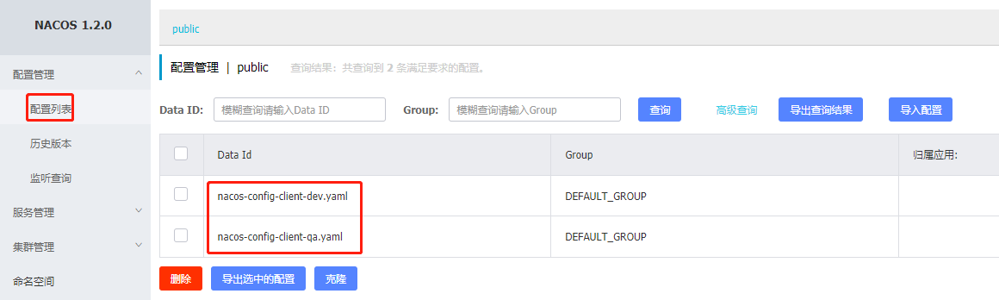

# 二、Nacos服务注册和配置中心

# 一、Nacos简介


## 为什么叫Nacos


前四个字母分别为Naming和Configuration的前两个字母，最后的s为Service。


## 是什么


一个更易于构建云原生应用的动态服务发现、配置管理和服务管理平台。


Nacos: Dynamic Naming and Configuration Service


Nacos就是注册中心＋配置中心的组合 -> **<font style="color:#E8323C;">Nacos = Eureka+Config+Bus</font>**


## 能干嘛


替代Eureka做服务注册中心


替代Config做服务配置中心


## 去哪下


[https://github.com/alibaba/nacos](https://github.com/alibaba/nacos)


[https://nacos.io/zh-cn/](https://nacos.io/zh-cn/)


官网文档


[https://nacos.io/zh-cn/](https://nacos.io/zh-cn/)


[https://spring-cloud-alibaba-group.github.io/github-pages/greenwich/spring-cloud-alibaba.html#_spring_cloud_alibaba_nacos_discovery](https://spring-cloud-alibaba-group.github.io/github-pages/greenwich/spring-cloud-alibaba.html#_spring_cloud_alibaba_nacos_discovery)


## 各注册中心比较
| 服务注册与发现框架 | CAP模型 | 控制台管理 | 社区活跃度 |
| --- | --- | --- | --- |
| Eureka | AP | 支持 | 低(2.x版本闭源) |
| Zookeeper | CP | 不支持 | 中 |
| consul | CP | 支持 | 高 |
| Nacos | AP | 支持 | 高 |


# 二、安装并运行Nacos


+  本地Java8+Maven环境已经OK 


+  从[官网](https://github.com/alibaba/nacos/releases)下载Nacos 


+  解压安装包，直接运行bin目录下的startup.cmd  
 
+  命令运行成功后直接访问http://localhost:8848/nacos，默认账号密码都是nacos 


+  结果页面  
 


# 三、作为服务注册中心


## 服务提供者


+  新建Module  
cloudalibaba-provider-payment9001 


+  POM 

```xml
<?xml version="1.0" encoding="UTF-8"?>
<project xmlns="http://maven.apache.org/POM/4.0.0"
         xmlns:xsi="http://www.w3.org/2001/XMLSchema-instance"
         xsi:schemaLocation="http://maven.apache.org/POM/4.0.0 http://maven.apache.org/xsd/maven-4.0.0.xsd">
    <parent>
        <artifactId>cloud2020</artifactId>
        <groupId>com.atguigu.springcloud</groupId>
        <version>1.0-SNAPSHOT</version>
    </parent>
    <modelVersion>4.0.0</modelVersion>

    <artifactId>cloudalibaba-provider-payment9001</artifactId>

    <dependencies>
        <!--SpringCloud ailibaba nacos -->
        <dependency>
            <groupId>com.alibaba.cloud</groupId>
            <artifactId>spring-cloud-starter-alibaba-nacos-discovery</artifactId>
        </dependency>
        <!-- SpringBoot整合Web组件 -->
        <dependency>
            <groupId>org.springframework.boot</groupId>
            <artifactId>spring-boot-starter-web</artifactId>
        </dependency>
        <dependency>
            <groupId>org.springframework.boot</groupId>
            <artifactId>spring-boot-starter-actuator</artifactId>
        </dependency>
        <!--日常通用jar包配置-->
        <dependency>
            <groupId>org.springframework.boot</groupId>
            <artifactId>spring-boot-devtools</artifactId>
            <scope>runtime</scope>
            <optional>true</optional>
        </dependency>
        <dependency>
            <groupId>org.projectlombok</groupId>
            <artifactId>lombok</artifactId>
            <optional>true</optional>
        </dependency>
        <dependency>
            <groupId>org.springframework.boot</groupId>
            <artifactId>spring-boot-starter-test</artifactId>
            <scope>test</scope>
        </dependency>
    </dependencies>

</project>
```

 

+  YML 

```yaml
server:
  port: 9001

spring:
  application:
    name: nacos-payment-provider
  cloud:
    nacos:
      discovery:
        server-addr: localhost:8848 #配置Nacos地址

management:
  endpoints:
    web:
      exposure:
        include: '*'
```

 

+  主启动 

```java
package com.atguigu.springcloud;

import org.springframework.boot.SpringApplication;
import org.springframework.boot.autoconfigure.SpringBootApplication;
import org.springframework.cloud.client.discovery.EnableDiscoveryClient;

/**
 * @author: like
 * @Date: 2021/07/28 23:52
 */
@EnableDiscoveryClient
@SpringBootApplication
public class PaymentMain9001 {

    public static void main(String[] args) {
        SpringApplication.run(PaymentMain9001.class, args);
    }

}
```

 

+  业务类 

```java
package com.atguigu.springcloud.controller;

import org.springframework.beans.factory.annotation.Value;
import org.springframework.web.bind.annotation.GetMapping;
import org.springframework.web.bind.annotation.PathVariable;
import org.springframework.web.bind.annotation.RestController;

/**
 * @author: like
 * @Date: 2021/07/28 23:54
 */
@RestController
public class PaymentController {

    @Value("${server.port}")
    private String serverPort;

    @GetMapping(value = "/payment/nacos/{id}")
    public String getPayment(@PathVariable("id") Integer id) {
        return "nacos registry, serverPort: " + serverPort + "\t id" + id;
    }

}
```

 


### 测试


+  [http://localhost:9001/payment/nacos/1](http://localhost:9001/payment/nacos/1)  
 
+  nacos服务注册中心+服务提供者9001都OK了  
 


### 演示Nacos的负载均衡，参照9001新建9002


+  新建cloudalibaba-provider-payment9002 
+  9002其它步骤你懂的 
+  或者**取巧**不想新建重复体力劳动，可以利用IDEA功能，直接拷贝虚拟端口映射  
 


## 服务消费者


+  新建Module  
cloudalibaba-consumer-nacos-order83 


+  POM 

```xml
<?xml version="1.0" encoding="UTF-8"?>
<project xmlns="http://maven.apache.org/POM/4.0.0"
         xmlns:xsi="http://www.w3.org/2001/XMLSchema-instance"
         xsi:schemaLocation="http://maven.apache.org/POM/4.0.0 http://maven.apache.org/xsd/maven-4.0.0.xsd">
    <parent>
        <artifactId>cloud2020</artifactId>
        <groupId>com.atguigu.springcloud</groupId>
        <version>1.0-SNAPSHOT</version>
    </parent>
    <modelVersion>4.0.0</modelVersion>

    <artifactId>cloudalibaba-consumer-nacos-order83</artifactId>


    <dependencies>
        <!--SpringCloud ailibaba nacos -->
        <dependency>
            <groupId>com.alibaba.cloud</groupId>
            <artifactId>spring-cloud-starter-alibaba-nacos-discovery</artifactId>
        </dependency>
        <!-- SpringBoot整合Web组件 -->
        <dependency>
            <groupId>org.springframework.boot</groupId>
            <artifactId>spring-boot-starter-web</artifactId>
        </dependency>
        <dependency>
            <groupId>org.springframework.boot</groupId>
            <artifactId>spring-boot-starter-actuator</artifactId>
        </dependency>
        <!--日常通用jar包配置-->
        <dependency>
            <groupId>org.springframework.boot</groupId>
            <artifactId>spring-boot-devtools</artifactId>
            <scope>runtime</scope>
            <optional>true</optional>
        </dependency>
        <dependency>
            <groupId>org.projectlombok</groupId>
            <artifactId>lombok</artifactId>
            <optional>true</optional>
        </dependency>
        <dependency>
            <groupId>org.springframework.boot</groupId>
            <artifactId>spring-boot-starter-test</artifactId>
            <scope>test</scope>
        </dependency>
    </dependencies>

</project>
```

 


### 为什么Nacos支持负载均衡


Nacos直接集成了Ribbon,所以有负载均衡


	


+  YML 

```yaml
server:
  port: 83

spring:
  application:
    name: nacos-order-consumer
  cloud:
    nacos:
      discovery:
        server-addr: localhost:8848 #配置Nacos地址

#消费者将要去访问的微服务名称（注册成功进Nacos的微服务提供者）
service-url:
  nacos-user-service: http://nacos-payment-provider
```

 

+  主启动 

```java
package com.atguigu.springcloud;

import org.springframework.boot.SpringApplication;
import org.springframework.boot.autoconfigure.SpringBootApplication;
import org.springframework.cloud.client.discovery.EnableDiscoveryClient;

/**
 * @author: like
 * @Date: 2021/07/29 7:49
 */
@EnableDiscoveryClient
@SpringBootApplication
public class OrderNacosMain83 {

    public static void main(String[] args) {
        SpringApplication.run(OrderNacosMain83.class, args);
    }

}
```

 


### 编写配置类


	因为Naocs要使用Ribbon进行负载均衡,那么就需要使用RestTemplate


```java
package com.atguigu.springcloud.config;

import org.springframework.cloud.client.loadbalancer.LoadBalanced;
import org.springframework.context.annotation.Bean;
import org.springframework.context.annotation.Configuration;
import org.springframework.web.client.RestTemplate;

/**
 * @author: like
 * @Date: 2021/07/29 7:54
 */
@Configuration
public class ApplicationContextConfig {

    @Bean
    @LoadBalanced
    public RestTemplate getRestTemplate() {
        return new RestTemplate();
    }

}
```


+  业务类 

```java
package com.atguigu.springcloud.controller;

import lombok.extern.slf4j.Slf4j;
import org.springframework.beans.factory.annotation.Autowired;
import org.springframework.beans.factory.annotation.Value;
import org.springframework.web.bind.annotation.GetMapping;
import org.springframework.web.bind.annotation.PathVariable;
import org.springframework.web.bind.annotation.RestController;
import org.springframework.web.client.RestTemplate;

/**
 * @author: like
 * @Date: 2021/07/29 7:58
 */
@RestController
@Slf4j
public class OrderNacosController {

    @Autowired
    private RestTemplate restTemplate;

    @Value("${service-url.nacos-user-service}")
    private String serverURL;

    @GetMapping(value = "/consumer/payment/nacos/{id}")
    public String PaymentInfo(@PathVariable("id") Long id) {
        return restTemplate.getForObject(serverURL + "/payment/nacos/" + id, String.class);
    }
}
```

 

+  测试 
    - [http://localhost:83/consumer/payment/nacos/13](http://localhost:83/consumer/payment/nacos/13)
    - 83访问9001/9002，轮询负载OK


## 服务注册中心对比


### Nacos全景图所示


### Nacos和CAP


Nacos与其他注册中心特性对比


### Nacos服务发现实例模型


### Nacos支持AP和CP模式的切换


**C是所有节点在同一时间看到的数据是一致的；而A的定义是所有的请求都会收到响应。**


**<font style="color:#E8323C;">何时选择使用何种模式?</font>**


—般来说，如果不需要存储服务级别的信息且服务实例是通过nacos-client注册，并能够保持心跳上报，那么就可以选择AP模式。


当前主流的服务如Spring cloud和Dubbo服务，都适用于AP模式，AP模式为了服务的可能性而减弱了一致性，因此AP模式下只支持注册临时实例。


<font style="color:#E8323C;">如果需要在服务级别编辑或者存储配置信息，那么CP是必须，</font>K8S服务和DNS服务则适用于CP模式。


CP模式下则支持注册持久化实例，此时则是以Raft协议为集群运行模式，该模式下注册实例之前必须先注册服务，如果服务不存在，则会返回错误。


**切换命令：**


```plain
curl -X PUT '$NACOS_SERVER:8848/nacos/v1/ns/operator/switches?entry=serverMode&value=CP
```


# 四、作为服务配置中心


## 基础配置


+  建module  
cloudalibaba-config-nacos-client3377 


+  pom 

```xml
<?xml version="1.0" encoding="UTF-8"?>
<project xmlns="http://maven.apache.org/POM/4.0.0"
         xmlns:xsi="http://www.w3.org/2001/XMLSchema-instance"
         xsi:schemaLocation="http://maven.apache.org/POM/4.0.0 http://maven.apache.org/xsd/maven-4.0.0.xsd">
    <parent>
        <artifactId>cloud2020</artifactId>
        <groupId>com.atguigu.springcloud</groupId>
        <version>1.0-SNAPSHOT</version>
    </parent>
    <modelVersion>4.0.0</modelVersion>

    <artifactId>cloudalibaba-config-nacos-client3377</artifactId>


    <dependencies>
        <!--nacos-config-->
        <dependency>
            <groupId>com.alibaba.cloud</groupId>
            <artifactId>spring-cloud-starter-alibaba-nacos-config</artifactId>
        </dependency>
        <!--nacos-discovery-->
        <dependency>
            <groupId>com.alibaba.cloud</groupId>
            <artifactId>spring-cloud-starter-alibaba-nacos-discovery</artifactId>
        </dependency>
        <!--web + actuator-->
        <dependency>
            <groupId>org.springframework.boot</groupId>
            <artifactId>spring-boot-starter-web</artifactId>
        </dependency>
        <dependency>
            <groupId>org.springframework.boot</groupId>
            <artifactId>spring-boot-starter-actuator</artifactId>
        </dependency>
        <!--一般基础配置-->
        <dependency>
            <groupId>org.springframework.boot</groupId>
            <artifactId>spring-boot-devtools</artifactId>
            <scope>runtime</scope>
            <optional>true</optional>
        </dependency>
        <dependency>
            <groupId>org.projectlombok</groupId>
            <artifactId>lombok</artifactId>
            <optional>true</optional>
        </dependency>
        <dependency>
            <groupId>org.springframework.boot</groupId>
            <artifactId>spring-boot-starter-test</artifactId>
            <scope>test</scope>
        </dependency>
    </dependencies>

</project>
```

 


+ yml


Nacos同springcloud-config一样，<font style="color:#E8323C;">在项目初始化时，要保证先从配置中心进行配置拉取，拉取配置之后，才能保证项目的正常启动。</font>


springboot中配置文件的加载是存在优先级顺序的，**<font style="color:#E8323C;">bootstrap优先级高于application</font>**


bootstrap.yml


```yaml
# nacos配置
server:
  port: 3377

spring:
  application:
    name: nacos-config-client
  cloud:
    nacos:
      discovery:
        server-addr: 118.25.37.107:8848 #Nacos服务注册中心地址
      config:
        server-addr: 118.25.37.107:8848 #Nacos作为配置中心地址
        file-extension: yaml #指定yaml格式的配置
```


application.yml


```yaml
spring:
  profiles:
    active: dev # 表示开发环境
```


+  主启动 

```java
package com.atguigu.springcloud;

import org.springframework.boot.SpringApplication;
import org.springframework.boot.autoconfigure.SpringBootApplication;
import org.springframework.cloud.client.discovery.EnableDiscoveryClient;

/**
 * @author: like
 * @Date: 2021/07/29 22:04
 */
@EnableDiscoveryClient
@SpringBootApplication
public class NacosConfigClientMain3377 {
    public static void main(String[] args) {
        SpringApplication.run(NacosConfigClientMain3377.class, args);
    }
}
```

 


### 业务类动态刷新


```plain
可以看到,这里也添加了@RefreshScope
  		之前在Config配置中心,也是添加这个注解实现动态刷新的
```


**@RefreshScope **** **   通过SpringCloud原生注解@RefreshScope实现配置自动更新


```java
package com.atguigu.springcloud.controller;

import org.springframework.beans.factory.annotation.Value;
import org.springframework.cloud.context.config.annotation.RefreshScope;
import org.springframework.web.bind.annotation.GetMapping;
import org.springframework.web.bind.annotation.RestController;

/**
 * @author: like
 * @Date: 2021/07/29 22:06
 */
@RestController
@RefreshScope //支持Nacos的动态刷新功能。
public class ConfigClientController {

    @Value("${config.info}")
    private String configInfo;

    @GetMapping("/config/info")
    public String getConfigInfo() {
        return configInfo;
    }

}
```


### 在Nacos中添加配置信息


Nacos中的dataid的组成格式及与SpringBoot配置文件中的匹配规则


官方文档：[https://nacos.io/zh-cn/docs/quick-start-spring-cloud.html](https://nacos.io/zh-cn/docs/quick-start-spring-cloud.html)


说明：之所以需要配置spring.application.name，是因为它是构成Nacos配置管理dataId 字段的一部分。


在 Nacos Spring Cloud中,dataId的完整格式如下：


```plain
${prefix}-${spring.profile.active}.${file-extension}
```


+  `prefix` 默认为 `spring.application.name` 的值，也可以通过配置项 `spring.cloud.nacos.config.prefix`来配置。 


+  `spring.profiles.active` 即为当前环境对应的 profile，详情可以参考 [Spring Boot文档](https://docs.spring.io/spring-boot/docs/current/reference/html/boot-features-profiles.html#boot-features-profiles)。  
**注意：当 **`**spring.profiles.active**`** 为空时，对应的连接符 **`**-**`** 也将不存在，dataId 的拼接格式变成 **`**${prefix}.${file-extension}**` 


+  `file-exetension` 为配置内容的数据格式，可以通过配置项 `spring.cloud.nacos.config.file-extension` 来配置。目前只支持 `properties` 和 `yaml` 类型。 


+  通过 Spring Cloud 原生注解 `@RefreshScope` 实现配置自动更新： 


**最后公式：**


```plain
${spring.application.name)}-${spring.profiles.active}.${spring.cloud.nacos.config.file-extension}
```


新增配置


Nacos界面配置对应 - 设置DataId


+  测试  
 
+  自带动态刷新  
修改下Nacos中的yaml配置文件，再次调用查看配置的接口，就会发现配置已经刷新。 


## 分类配置


### 问题 - 多环境多项目管理


问题1：实际开发中，通常一个系统会准备


+  dev开发环境 
+  qa测试环境 
+  prod生产环境  
如何保证指定环境启动时服务能正确读取到Nacos上相应环境的配置文件呢? 


问题2：一个大型分布式微服务系统会有很多微服务子项目，每个微服务项目又都会有相应的开发环境、测试环境、预发环境、正式环境…那怎么对这些微服务配置进行管理呢?


### Nacos的图形化管理界面


+ 配置管理


+  命名空间  
 


### Namespace+Group+Data lD三者关系？为什么这么设计？


1.  是什么  
类似Java里面的package名和类名  
最外层的namespace是可以用于区分部署环境的，<font style="color:#E8323C;">Group和DatalD逻辑上区分两个目标对象。</font> 


2.  三者情况  
 


默认情况：Namespace=public，Group=DEFAULT_GROUP，默认Cluster是DEFAULT


+  Nacos默认的Namespace是public，Namespace主要用来实现隔离。 
    - 比方说现在有三个环境：开发、测试、生产环境，我们就可以创建三个Namespace，不同的Namespace之间是隔离的。


+  Group默认是DEFAULT_GROUP，Group可以把不同的微服务划分到同一个分组里面去 


+  Service就是微服务：一个Service可以包含多个Cluster (集群)，Nacos默认Cluster是DEFAULT，Cluster是对指定微服务的一个虚拟划分。 
    - 比方说为了容灾，将Service微服务分别部署在了杭州机房和广州机房，这时就可以给杭州机房的Service微服务起一个集群名称(HZ) ，给广州机房的Service微服务起一个集群名称(GZ)，还可以尽量让同一个机房的微服务互相调用，以提升性能。


+  最后是Instance，就是微服务的实例。 


### Nacos之DataID配置


指定spring.profile.active和配置文件的DatalD来使不同环境下读取不同的配置


默认空间+默认分组+新建dev和qa两个DatalD


+ 新建dev配置DataID
+ 新建qa配置DataID





通过spring.profile.active属性就能进行多环境下配置文件的读取


**测试**


+  [http://localhost:3377/config/info](http://localhost:3377/config/info) 
+  配置是什么就加载什么 qa/dev 


### Nacos之Group分组方案


通过Group实现环境区分 - 新建Group


在nacos图形界面控制台上面新建配置文件DatalD


bootstrap+application：在config下增加一条group的配置即可。


### Nacos之Namespace空间方案


新建dev/qa的Namespace


回到配置管理-配置列表查看


按照namespace配置填写


YML


# 五、Nacos集群和持久化配置（重要）


官方文档：[https://nacos.io/zh-cn/docs/cluster-mode-quick-start.html](https://nacos.io/zh-cn/docs/cluster-mode-quick-start.html)


## 集群部署架构图


因此开源的时候推荐用户把所有服务列表放到一个vip下面，然后挂到一个域名下面


http://ip1:port/openAPI 直连ip模式，机器挂则需要修改ip才可以使用。


http://SLB:port/openAPI 挂载SLB模式(内网SLB，不可暴露到公网，以免带来安全风险)，直连SLB即可，下面挂server真实ip，可读性不好。


http://nacos.com:port/openAPI 域名 + SLB模式(内网SLB，不可暴露到公网，以免带来安全风险)，可读性好，而且换ip方便，推荐模式


**上图官网翻译，真实情况**


按照上述，我们需要mysql数据库。


**官网说明**


默认Nacos使用嵌入式数据库derby实现数据的存储。所以，如果启动多个默认配置下的Nacos节点，数据存储是存在一致性问题的。


为了解决这个问题，Nacos采用了**<font style="color:#E8323C;">集中式存储的方式来支持集群化部署，目前只支持MySQL的存储。</font>**


Nacos支持三种部署模式


+ 单机模式-用于测试和单机试用。
+ 集群模式-用于生产环境，确保高可用。
+ 多集群模式-用于多数据中心场景。


## 单机模式支持mysql


在0.7版本之前，在单机模式时nacos使用嵌入式数据库实现数据的存储，不方便观察数据存储的基本情况。


0.7版本增加了支持mysql数据源能力，具体的操作步骤:


+  安装数据库，版本要求:5.6.5+ 
+  初始化mysq数据库，数据库初始化文件: nacos-mysql.sql 
+  修改conf/application.properties文件，增加支持mysql数据源配置（目前只支持mysql)，添加mysql数据源的url、用户名和密码。 

```properties
spring.datasource.platform=mysql

db.num=1
db.url.0=jdbc:mysql://11.162.196.16:3306/nacos_devtest?characterEncoding=utf8&connectTimeout=1000&socketTimeout=3000&autoReconnect=true
db.user=root
db.password=1234
```

 


再以单机模式启动nacos，nacos所有写嵌入式数据库的数据都写到了mysql。


## Nacos持久化切换配置


**Nacos默认自带的是嵌入式数据库derby**


nacos的pom.xml中可以看出：[https://github.com/alibaba/nacos/blob/develop/config/pom.xml](https://github.com/alibaba/nacos/blob/develop/config/pom.xml)


### derby到mysql切换配置步骤：


nacos-server-1.1.4\nacos\conf录下找到nacos-mysql.sql文件，执行脚本。  
nacos-server-1.1.4\nacos\conf目录下找到application.properties，添加以下配置（按需修改对应值）。


```properties
spring.datasource.platform=mysql

db.num=1
db.url.0=jdbc:mysql://localhost:3306/nacos_devtest?characterEncoding=utf8&connectTimeout=1000&socketTimeout=3000&autoReconnect=true
db.user=root
db.password=1234
```


启动Nacos，可以看到是个全新的空记录界面，以前是记录进derby。


## Nacos之Linux版本安装


### 需要一个Nginx作为VIP


预计需要，1个Nginx+3个nacos注册中心+1个mysql


请确保是在环境中安装使用:


1. 64 bit OS Linux/Unix/Mac，推荐使用Linux系统。
2. 64 bit JDK 1.8+；[下载](http://www.oracle.com/technetwork/java/javase/downloads/jdk8-downloads-2133151.html).[配置](https://docs.oracle.com/cd/E19182-01/820-7851/inst_cli_jdk_javahome_t/)。
3. Maven 3.2.x+；[下载](https://maven.apache.org/download.cgi).[配置](https://maven.apache.org/settings.html)。
4. 3个或3个以上Nacos节点才能构成集群。


Nacos下载Linux版


+ [https://github.com/alibaba/nacos/releases/tag/1.2.0](https://github.com/alibaba/nacos/releases/tag/1.2.0)
+ nacos-server-1.2.0.tar.gz 解压后安装


## Nacos集群配置


### mysql数据库配置


SQL脚本在哪里 - 目录nacos/conf/nacos-mysql.sql


### application.properties配置


```properties
spring.datasource.platform=mysql

db.num=1
db.url.0=jdbc:mysql://127.0.0.1:3306/nacos_config?characterEncoding=utf8&connectTimeout=1000&socketTimeout=3000&autoReconnect=true
db.user=nacos_config
db.password=1234
```


### nacos的集群配置cluster.conf


梳理出3台nacos集器的不同服务端口号，设置3个端口：


+ 7777
+ 8888
+ 9999


复制出cluster.conf


内容


```plain
192.168.111.144:7777
192.168.111.144:8888
192.168.111.144:9999
```


**注意**，这个IP不能写127.0.0.1，必须是Linux命令`hostname -i`能够识别的IP


### 编辑Nacos的启动脚本startup.sh


使它能够接受不同的启动端口


平时单机版的启动，都是./startup.sh即可


但是，集群启动，我们希望可以类似其它软件的shell命令，**<font style="color:#E8323C;">传递不同的端口号启动不同的nacos实例。</font>**


命令: ./startup.sh -p 7777表示启动端口号为7777的nacos服务器实例，和上一步的cluster.conf配置的一致。


**修改内容**


**执行方式**


```plain
startup.sh - p 端口号
```


### Nginx的配置，由它作为负载均衡器


修改nginx的配置文件 - nginx.conf


按照指定启动


```plain
./nginx -c /usr/local/nginx/conf/nginx.conf
```


### 1个Nginx+3个nacos注册中心+1个mysql


+ 启动3个nacos注册中心: 
    - ./startup.sh -p 3333
    - ./startup.sh -p 4444
    - ./startup.sh -p 5555
    - 查看nacos进程启动数`ps -ef | grep nacos | grep -v grep | wc -l`


+ 启动nginx 
    - `./nginx -c /usr/local/nginx/conf/nginx.conf`
    - 查看nginx进程`ps - ef| grep nginx`


### 测试:


+ 通过nginx，访问nacos	 - [http://192.168.111.144:1111/nacos/#/login](http://192.168.111.144:1111/nacos/#/login)


		如果可以进入nacos的web界面,就证明安装成功了


+  新建一个配置测试  
查看linux服务器的mysql新插入一条记录 


### 让微服务cloudalibaba-provider-payment9002启动注册进nacos集群


修改yml配置文件


```yaml
server:
  port: 9002

spring:
  application:
    name: nacos-payment-provider
  c1oud:
    nacos:
      discovery:
        #配置Nacos地址
        #server-addr: Localhost:8848
        #换成nginx的1111端口，由nginx代理到Nacos集群其中一个节点
        server-addr: 192.168.111.144:1111

management:
  endpoints:
    web:
      exposure:
        inc1ude: '*'
```


+ 启动微服务cloudalibaba-provider-payment9002
+ 访问nacos，查看注册结果


## 高可用小总结


> 更新: 2022-08-22 10:19:45  
> 原文: <https://www.yuque.com/like321/ctnebt/fsb17y>