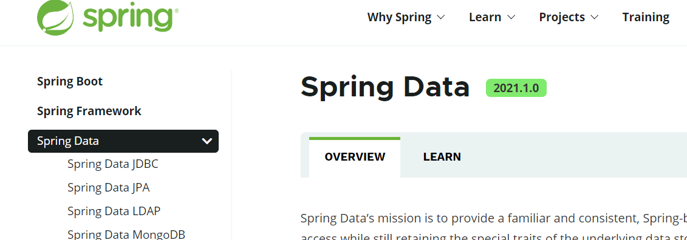
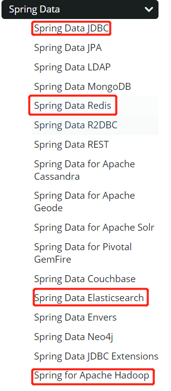
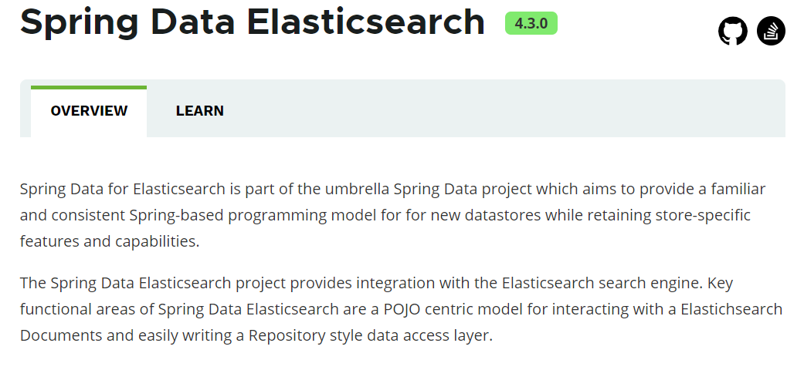
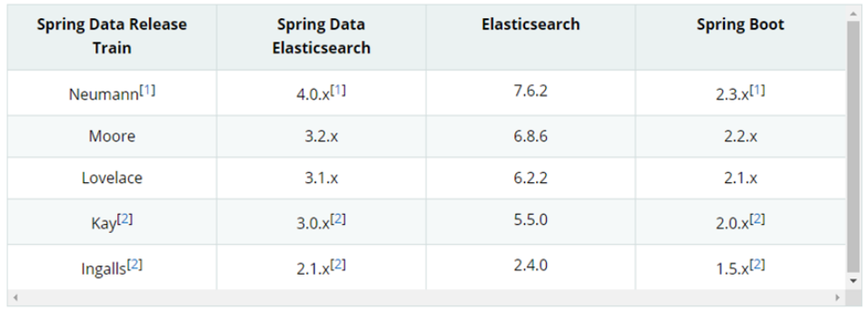
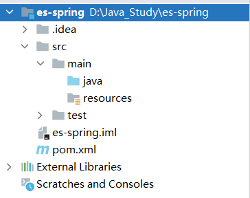
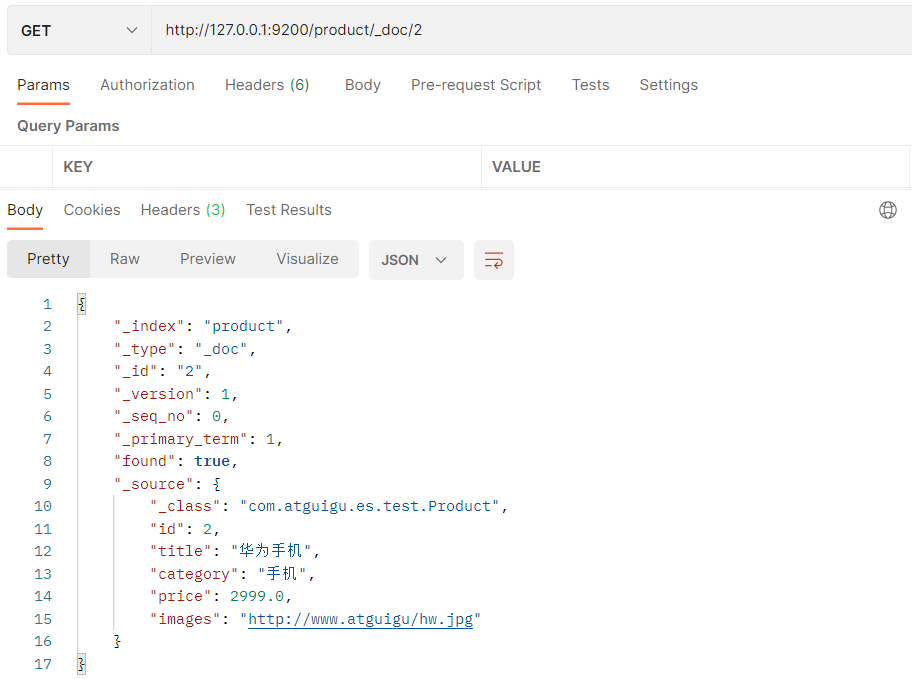
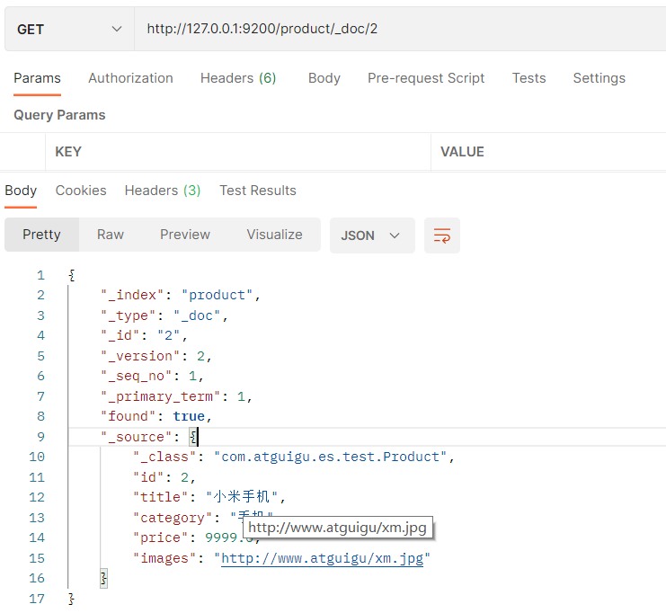
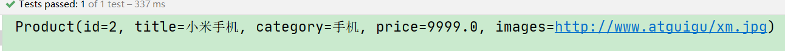
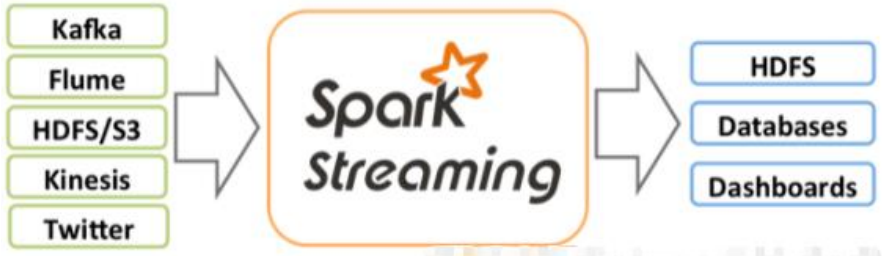
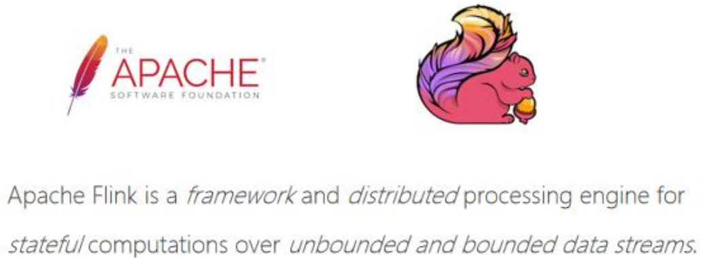

# 七、Elasticsearch集成

## 1、Spring Data框架集成


### 1.1、Spring Data框架介绍


Spring Data 是一个用于简化数据库、非关系型数据库、索引库访问，并支持云服务的开源框架。


其主要目标是使得对数据的访问变得方便快捷，并支持 map-reduce 框架和云计算数据服务。


Spring Data 可以极大的简化 JPA（Elasticsearch„）的写法，可以在几乎不用写实现的情况下，实现对数据的访问和操作。除了 CRUD 外，还包括如分页、排序等一些常用的功能。


Spring Data 的官网：[https://spring.io/projects/spring-data](https://spring.io/projects/spring-data)





Spring Data 常用的功能模块如下：





### 1.2、Spring Data Elasticsearch 介绍


Spring Data Elasticsearch 基于 spring data API 简化 Elasticsearch 操作，将原始操作Elasticsearch 的客户端 API 进行封装 。


Spring Data 为 Elasticsearch 项目提供集成搜索引擎。


Spring Data Elasticsearch POJO 的关键功能区域为中心的模型与 Elastichsearch 交互文档和轻松地编写一个存储索引库数据访问层。


官方网站: [https://spring.io/projects/spring-data-elasticsearch](https://spring.io/projects/spring-data-elasticsearch)





### 1.3、Spring Data Elasticsearch 版本对比





Spring boot2.3.x 一般可以兼容 Elasticsearch7.x


### 1.4、框架集成


1. 创建 Maven 项目





2. 修改 pom 文件，增加依赖关系


```xml
<?xml version="1.0" encoding="UTF-8"?>
<project xmlns="http://maven.apache.org/POM/4.0.0"
         xmlns:xsi="http://www.w3.org/2001/XMLSchema-instance"
         xsi:schemaLocation="http://maven.apache.org/POM/4.0.0 http://maven.apache.org/xsd/maven-4.0.0.xsd">
    <modelVersion>4.0.0</modelVersion>

    <groupId>com.atguigu.es</groupId>
    <artifactId>es-spring</artifactId>
    <version>1.0-SNAPSHOT</version>

    <parent>
        <artifactId>spring-boot-starter-parent</artifactId>
        <groupId>org.springframework.boot</groupId>
        <version>2.3.6.RELEASE</version>
    </parent>

    <properties>
        <maven.compiler.source>8</maven.compiler.source>
        <maven.compiler.target>8</maven.compiler.target>
    </properties>

    <dependencies>
        <dependency>
            <groupId>org.projectlombok</groupId>
            <artifactId>lombok</artifactId>
        </dependency>
        <dependency>
            <groupId>org.springframework.boot</groupId>
            <artifactId>spring-boot-starter-data-elasticsearch</artifactId>
        </dependency>
        <dependency>
            <groupId>org.springframework.boot</groupId>
            <artifactId>spring-boot-devtools</artifactId>
            <scope>runtime</scope>
            <optional>true</optional>
        </dependency>
        <dependency>
            <groupId>org.springframework.boot</groupId>
            <artifactId>spring-boot-starter-test</artifactId>
            <scope>test</scope>
        </dependency>
        <dependency>
            <groupId>org.springframework.boot</groupId>
            <artifactId>spring-boot-test</artifactId>
        </dependency>
        <dependency>
            <groupId>junit</groupId>
            <artifactId>junit</artifactId>
        </dependency>
        <dependency>
            <groupId>org.springframework</groupId>
            <artifactId>spring-test</artifactId>
        </dependency>
    </dependencies>
</project>
```


3.  增加配置文件  
在 resources 目录中增加 application.properties 文件 


```properties
# es 服务地址
elasticsearch.host=127.0.0.1
# es 服务端口
elasticsearch.port=9200
# 配置日志级别,开启 debug 日志
logging.level.com.atguigu.es=debug
```


4. SpringBoot 主程序


```java
package com.atguigu.es;

import org.springframework.boot.SpringApplication;
import org.springframework.boot.autoconfigure.SpringBootApplication;

@SpringBootApplication
public class SpringDataElasticSearchMainApplication {

    public static void main(String[] args) {
        SpringApplication.run(SpringDataElasticSearchMainApplication.class, args);
    }

}
```


5. 配置类


+ ElasticsearchRestTemplate 是 spring-data-elasticsearch 项目中的一个类，和其他 spring 项目中的 template类似。
+ 在新版的 spring-data-elasticsearch 中，ElasticsearchRestTemplate 代替了原来的 ElasticsearchTemplate。
+ 原因是 ElasticsearchTemplate 基于 TransportClient，TransportClient 即将在 8.x 以后的版本中移除。所以，我们推荐使用 ElasticsearchRestTemplate。
+ ElasticsearchRestTemplate 基 于 RestHighLevelClient 客 户 端 的 。 需 要 自 定 义 配 置 类 ， 继 承  
AbstractElasticsearchConfiguration，并实现 elasticsearchClient()抽象方法，创建 RestHighLevelClient 对象。


```java
package com.atguigu.es.config;

import lombok.Data;
import org.apache.http.HttpHost;
import org.elasticsearch.client.RestClient;
import org.elasticsearch.client.RestClientBuilder;
import org.elasticsearch.client.RestHighLevelClient;
import org.springframework.boot.context.properties.ConfigurationProperties;
import org.springframework.context.annotation.Configuration;
import org.springframework.data.elasticsearch.config.AbstractElasticsearchConfiguration;

@ConfigurationProperties(prefix = "elasticsearch")
@Configuration
@Data
public class ElasticsearchConfig extends AbstractElasticsearchConfiguration {

    private String host;

    private Integer port;

    @Override
    public RestHighLevelClient elasticsearchClient() {
        RestClientBuilder builder = RestClient.builder(new HttpHost(host, port));
        RestHighLevelClient restHighLevelClient = new RestHighLevelClient(builder);
        return restHighLevelClient;
    }
}
```


6. 数据实体类


```java
package com.atguigu.es;

import lombok.AllArgsConstructor;
import lombok.Data;
import lombok.NoArgsConstructor;
import lombok.ToString;

@Data
@NoArgsConstructor
@AllArgsConstructor
@ToString
public class product {

    private Long id;//商品唯一标识
    
    private String title;//商品名称
    
    private String category;//分类名称
    
    private Double price;//商品价格
    
    private String images;//图片地址
    
}
```


7. DAO 数据访问对象


```java
package com.atguigu.es;

import org.springframework.data.elasticsearch.repository.ElasticsearchRepository;
import org.springframework.stereotype.Repository;

@Repository
public interface ProductDao extends ElasticsearchRepository<Product, Long> {

    
}
```


8. 实体类映射操作


```java
package com.atguigu.es;

import lombok.AllArgsConstructor;
import lombok.Data;
import lombok.NoArgsConstructor;
import lombok.ToString;
import org.springframework.data.annotation.Id;
import org.springframework.data.elasticsearch.annotations.Document;
import org.springframework.data.elasticsearch.annotations.Field;
import org.springframework.data.elasticsearch.annotations.FieldType;

@Data
@NoArgsConstructor
@AllArgsConstructor
@ToString
@Document(indexName = "product", shards = 3, replicas = 1)
public class Product {

    //必须有 id,这里的 id 是全局唯一的标识，等同于 es 中的"_id"
    @Id
    private Long id;//商品唯一标识
    /**
     * type : 字段数据类型
     * analyzer : 分词器类型
     * index : 是否索引(默认:true)
     * Keyword : 短语,不进行分词
     */

    @Field(type = FieldType.Text, analyzer = "ik_max_word")
    private String title;//商品名称

    @Field(type = FieldType.Keyword)
    private String category;//分类名称

    @Field(type = FieldType.Double)
    private Double price;//商品价格

    @Field(type = FieldType.Keyword, index = false)
    private String images;//图片地址

}
```


### 1.5、索引操作


```java
package com.atguigu.es;

import org.junit.Test;
import org.junit.runner.RunWith;
import org.springframework.beans.factory.annotation.Autowired;
import org.springframework.boot.test.context.SpringBootTest;
import org.springframework.data.elasticsearch.core.ElasticsearchRestTemplate;
import org.springframework.test.context.junit4.SpringRunner;

@RunWith(SpringRunner.class)
@SpringBootTest
public class SpringDataESIndexTest {

    //注入 ElasticsearchRestTemplate
    @Autowired
    private ElasticsearchRestTemplate elasticsearchRestTemplate;


    //创建索引并增加映射配置
    @Test
    public void createIndex() {
        //创建索引，系统初始化会自动创建索引
        System.out.println("创建索引");
    }

    @Test
    public void deleteIndex() {
        //创建索引，系统初始化会自动创建索引
        boolean flag = elasticsearchRestTemplate.deleteIndex(Product.class);
        System.out.println("删除索引 = " + flag);
    }
}
```


### 1.6、文档操作


```java
package com.atguigu.es.test;

import org.junit.Test;
import org.junit.runner.RunWith;
import org.springframework.beans.factory.annotation.Autowired;
import org.springframework.boot.test.context.SpringBootTest;
import org.springframework.test.context.junit4.SpringRunner;

@RunWith(SpringRunner.class)
@SpringBootTest
public class SpringDataESProductDaoTest {

    @Autowired
    private ProductDao productDao;

    /**
     * 新增
     */
    @Test
    public void save() {
        Product product = new Product();
        product.setId(2L);
        product.setTitle("华为手机");
        product.setCategory("手机");
        product.setPrice(2999.0);
        product.setImages("http://www.atguigu/hw.jpg");
        productDao.save(product);
    }

}
```





```java
//修改
@Test
public void update(){
    Product product = new Product();
    product.setId(2L);
    product.setTitle("小米手机");
    product.setCategory("手机");
    product.setPrice(9999.0);
    product.setImages("http://www.atguigu/xm.jpg");
    productDao.save(product);
}
```





```java
    //根据 id 查询
    @Test
    public void findById() {
        Product product = productDao.findById(2L).get();
        System.out.println(product);
    }
```





```java
//查询所有
@Test
public void findAll() {
    Iterable<Product> products = productDao.findAll();
    for (Product product : products) {
        System.out.println(product);
    }
}
```


```java
//删除
@Test
public void delete() {
    Product product = new Product();
    product.setId(2L);
    productDao.delete(product);
}
```


```java
//批量新增
@Test
public void saveAll() {
    List<Product> productList = new ArrayList<>();

    for (int i = 0; i < 10; i++) {
        Product product = new Product();
        product.setId(Long.valueOf(i));
        product.setTitle("[" + i + "]小米手机");
        product.setCategory("手机");
        product.setPrice(1999.0 + i);
        product.setImages("http://www.atguigu/xm.jpg");
        productList.add(product);
    }

    productDao.saveAll(productList);
}
```


```java
//分页查询
@Test
public void findByPageable() {

    //设置排序(排序方式，正序还是倒序，排序的 id)
    Sort sort = Sort.by(Sort.Direction.DESC, "id");

    int currentPage = 0;//当前页，第一页从 0 开始，1 表示第二页
    int pageSize = 5;//每页显示多少条
    //设置查询分页
    PageRequest pageRequest = PageRequest.of(currentPage, pageSize, sort);

    //分页查询
    Page<Product> productPage = productDao.findAll(pageRequest);
    for (Product Product : productPage.getContent()) {
        System.out.println(Product);
    }

}
```


### 1.7、文档搜索


```java
package com.atguigu.es.test;

import org.elasticsearch.index.query.QueryBuilders;
import org.elasticsearch.index.query.TermQueryBuilder;
import org.junit.Test;
import org.junit.runner.RunWith;
import org.springframework.beans.factory.annotation.Autowired;
import org.springframework.boot.test.context.SpringBootTest;
import org.springframework.data.domain.PageRequest;
import org.springframework.test.context.junit4.SpringRunner;

@RunWith(SpringRunner.class)
@SpringBootTest
public class SpringDataESSearchTest {

    @Autowired
    private ProductDao productDao;

    /**
     * term 查询
     * search(termQueryBuilder) 调用搜索方法，参数查询构建器对象
     */
    @Test
    public void termQuery() {
        TermQueryBuilder termQueryBuilder = QueryBuilders.termQuery("title", "小米");

        Iterable<Product> products = productDao.search(termQueryBuilder);
        for (Product product : products) {
            System.out.println(product);
        }

    }

    /**
     * term 查询加分页
     */
    @Test
    public void termQueryByPage() {
        TermQueryBuilder termQueryBuilder = QueryBuilders.termQuery("title", "小米");

        //设置查询分页
        int currentPage = 0;
        int pageSize = 5;
        PageRequest pageRequest = PageRequest.of(currentPage, pageSize);

        Iterable<Product> products = productDao.search(termQueryBuilder, pageRequest);
        for (Product product : products) {
            System.out.println(product);
        }
    }

}
```


## 2、 Spark Streaming  框架集成


### 2.1 Spark Streaming  框架介绍


Spark Streaming 是 Spark core API 的扩展，支持实时数据流的处理，并且具有可扩展，高吞吐量，容错的特点。


数据可以从许多来源获取，如 Kafka，Flume，Kinesis 或 TCP sockets，  
并且可以使用复杂的算法进行处理，这些算法使用诸如 map，reduce，join 和 window 等高级函数表示。


最后，处理后的数据可以推送到文件系统，数据库等。


实际上，您可以将Spark 的机器学习和图形处理算法应用于数据流。





## 3、Flink框架集成


### 3.1、 Flink 框架介绍





Apache Spark 是一种基于内存的快速、通用、可扩展的大数据分析计算引擎。


Apache Spark 掀开了内存计算的先河，以内存作为赌注，赢得了内存计算的飞速发展。


但是在其火热的同时，开发人员发现，在 Spark 中，计算框架普遍存在的缺点和不足依然没有完全解决，而这些问题随着 5G 时代的来临以及决策者对实时数据分析结果的迫切需要而凸显的更加明显：


+ 数据精准一次性处理（Exactly-Once）
+ 乱序数据，迟到数据
+ 低延迟，高吞吐，准确性
+ 容错性


Apache Flink 是一个框架和分布式处理引擎，用于对无界和有界数据流进行有状态计算。在Spark 火热的同时，也默默地发展自己，并尝试着解决其他计算框架的问题。


慢慢地，随着这些问题的解决，Flink 慢慢被绝大数程序员所熟知并进行大力推广，阿里公司在 2015 年改进 Flink，并创建了内部分支 Blink，目前服务于阿里集团内部搜索、推荐、广告和蚂蚁等大量核心实时业务。


> 更新: 2022-10-13 17:36:32  
> 原文: <https://www.yuque.com/like321/fk7s34/zr9ww6>