# 二、安装Elasticsearch

## 1 安装JDK


ElasticSearch是用JAVA语言开发的，其运行需要安装JDK。


JDK (Java Development Kit)  ，是整个Java的核心，包括了Java运行环境（Java Runtime Envirnment），一堆Java工具和Java基础的类库(rt.jar)。


### 1.1 下载安装JDK


下载地址[https://www.oracle.com/technetwork/java/javase/downloads/index.html](https://www.oracle.com/technetwork/java/javase/downloads/index.html)


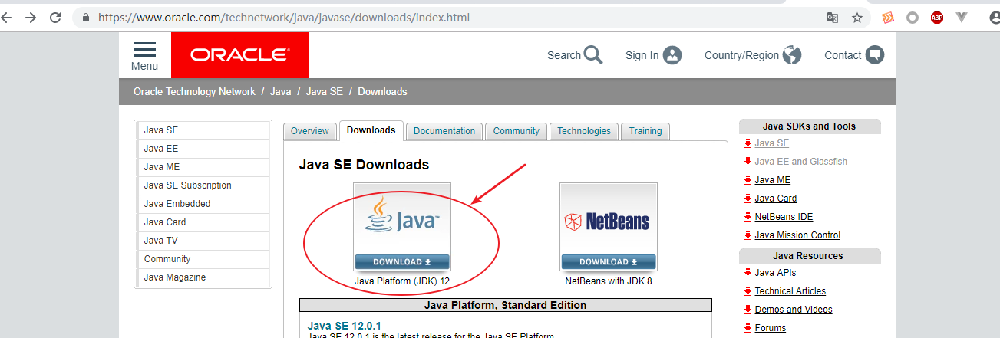


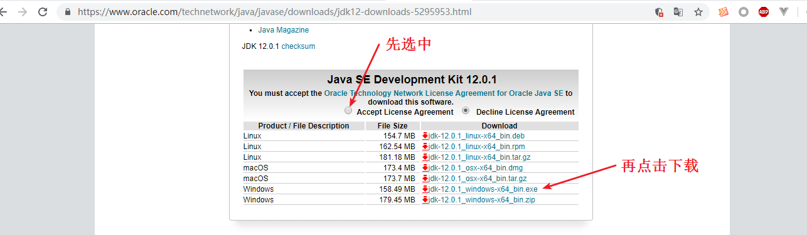


安装：双击 软件 打开安装界面


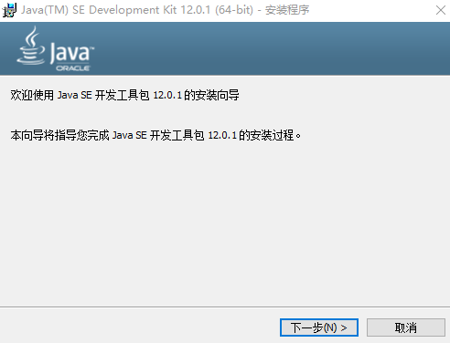


点击下一步 进入选择安装目录界面


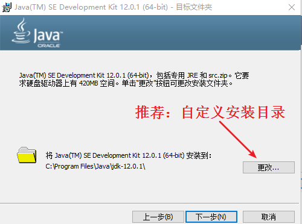


点击更改 自定义安装目录


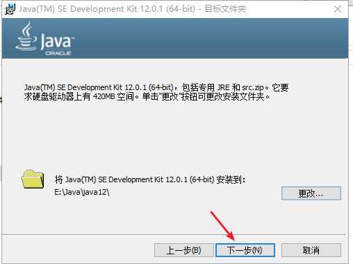


点击 下一步  进行安装


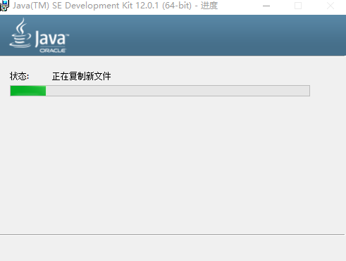


等待，出现以下界面，则安装完成，点击关闭即可。


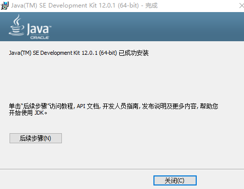


### 1.2 配置环境变量


配置 JAVA_HOME环境变量


配置Path环境变量


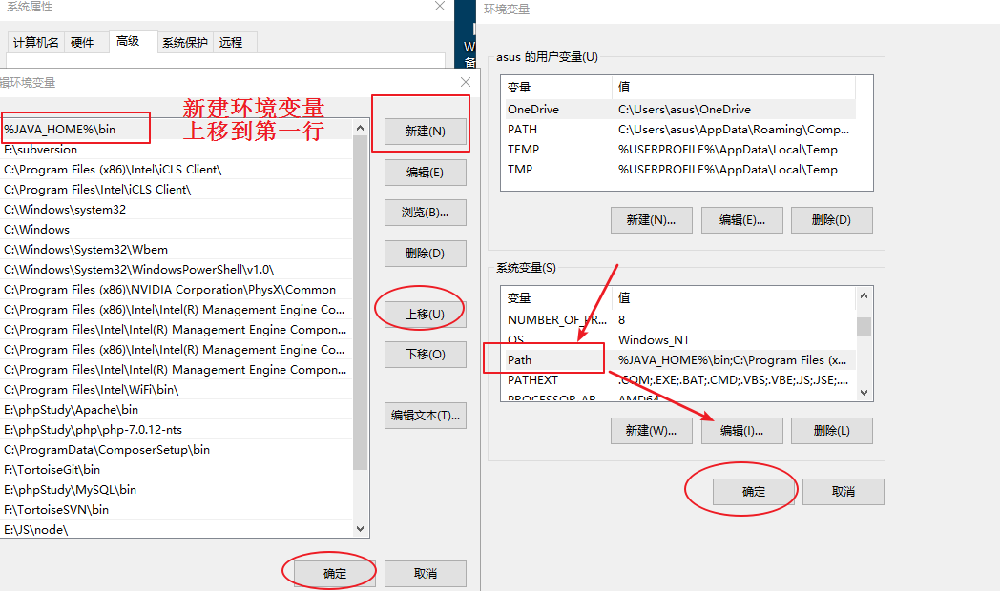


### 1.3 测试-查看JDK版本


打开命令行窗口，输入`java -version`查看JDK版本


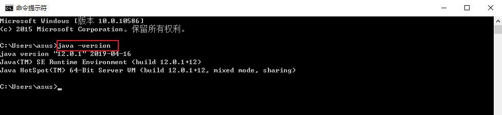


出现以上界面，说明安装成功。


## 2 安装Elasticsearch


权威指南[https://www.elastic.co/guide/cn/elasticsearch/guide/current/index.html](https://www.elastic.co/guide/cn/elasticsearch/guide/current/index.html)


### 2.1 下载安装


下载地址[https://www.elastic.co/downloads](https://www.elastic.co/downloads)


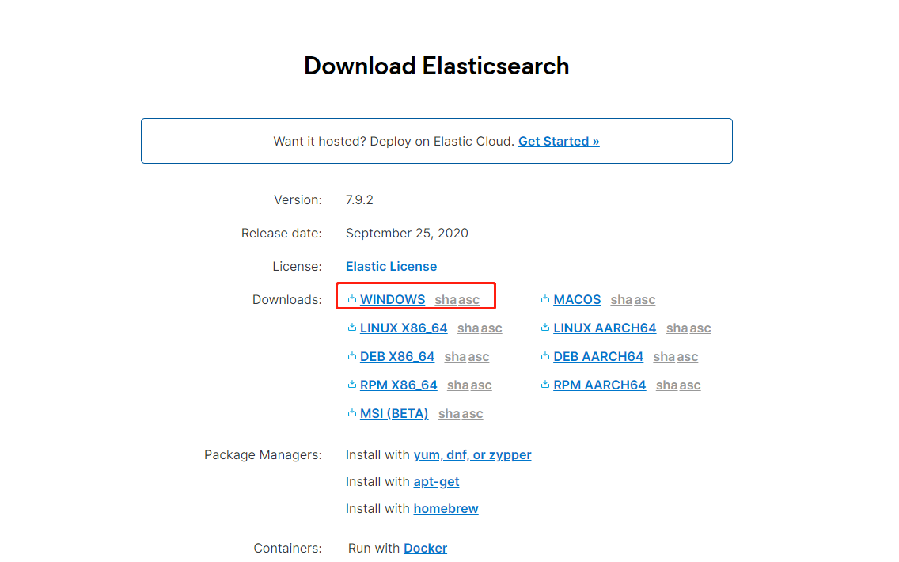


Windows 版的 Elasticsearch 的安装很简单，解压即安装完毕，解压后的 Elasticsearch 的目录结构如下


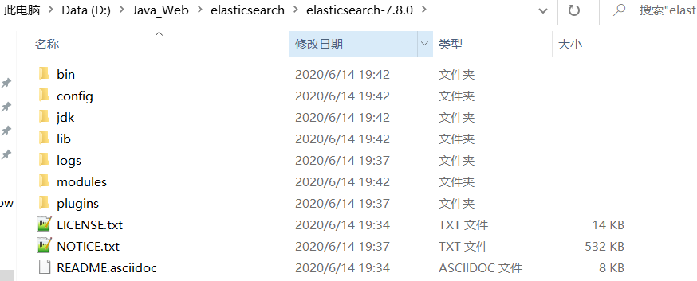

| 目录 | 含义 |
| --- | --- |
| bin | 可执行脚本目录 |
| config | 配置目录 |
| jdk | 内置 JDK 目录 |
| lib | 类库 |
| logs | 日志目录 |
| modules | 模块目录 |
| plugins | 插件目录 |


> bin：启动文件
>
>  
>
> config：配置文件
>
>  
>
>  
>
> data：索引数据目录
>
>  
>
> lib：相关类库Jar包
>
>  
>
> logs：日志目录
>
>  
>
> modules：功能模块
>
>  
>
> plugins：插件
>

> log4j2.properties：日志配置文件
>
>  
>
> jvm.options：java虚拟机的配置
>
>  
>
> elasticsearch.yml：es的配置文件
>


**解压后，进入 bin 文件目录，点击 elasticsearch.bat 文件启动 ES 服务**


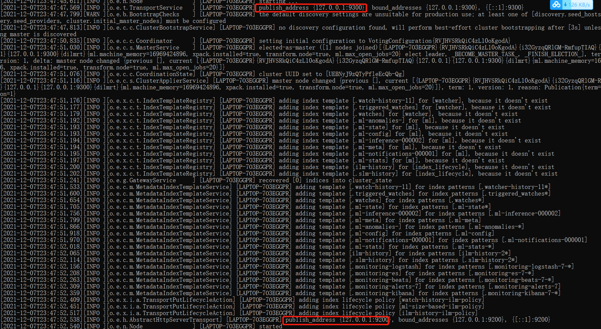


注意：**9300**  端口为 Elasticsearch  集群间组件的通信端口，**9200**  端口为浏览器访问的 http 协议 RESTful  端口。


打开浏览器，输入地址：http://localhost:9200，测试结果


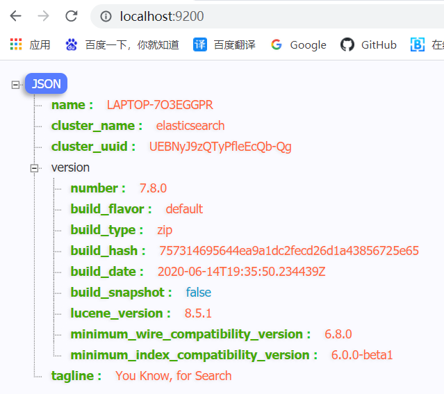


### 2.2  问题解决


+ Elasticsearch 是使用 java 开发的，且 7.8 版本的 ES 需要 JDK 版本 1.8 以上，默认安装包带有 jdk 环境，如果系统配置 JAVA_HOME，那么使用系统默认的 JDK，如果没有配置使用自带的 JDK，一般建议使用系统配置的 JDK。
+ 双击启动窗口闪退，通过路径访问追踪错误，如果是“空间不足”，请修改config/jvm.options 配置文件


```plain
# 设置 JVM 初始内存为 1G。此值可以设置与-Xmx 相同，以避免每次垃圾回收完成后 JVM 重新分配内存
# Xms represents the initial size of total heap space
# 设置 JVM 最大可用内存为 1G
# Xmx represents the maximum size of total heap space

-Xms1g
-Xmx1g
```


### 2.3 配置Path环境变量


(bin目录)


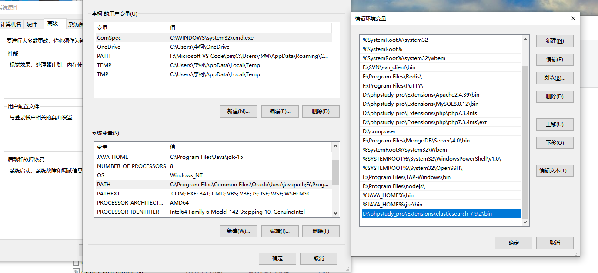


### 2.4 中文分词插件


GitHub：[https://github.com/medcl/elasticsearch-analysis-ik/releases](https://github.com/medcl/elasticsearch-analysis-ik/releases)


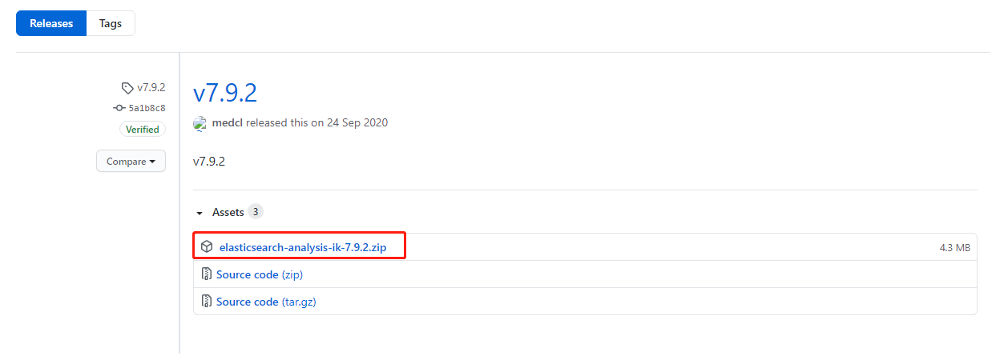


解压到elasticsearch插件目录


### 2.5 启动elasticsearch


打开命令行窗口  执行命令 elasticsearch -d  启动elasticsearch


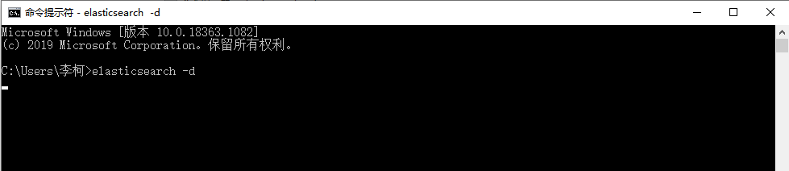


注：该命令行窗口 不要关闭。


浏览器打开 [http://localhost:9200](http://localhost:9200)


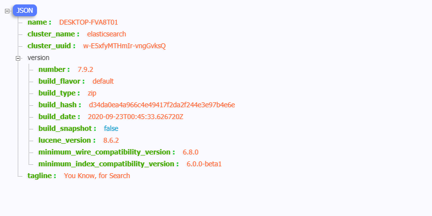


出现以上界面，则启动成功。


### 2.6 Elasticsearch-Head（可视化工具）


elasticsearch-head是一个用于浏览ElasticSearch集群并与其进行交互的Web项目


GitHub托管地址：[https://github.com/mobz/elasticsearch-head](https://github.com/mobz/elasticsearch-head)


下载并解压：


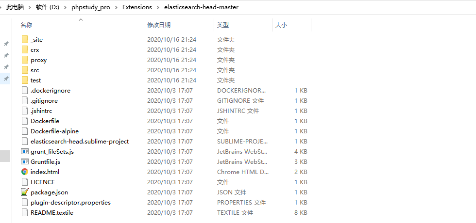


安装：打开命令行，切换到Elasticsearch-Head目录，执行以下命令


```plain
npm install
```


启动：打开命令行，切换到Elasticsearch-Head目录，执行以下命令


```plain
npm run start
```


启动成功后，可通过http://localhost:9100进行访问


由于跨域（Elasticsearch位于9200端口），需要添加配置： D:\Java_Web\elasticsearch\elasticsearch-7.8.0\config\elasticsearch.yml中


```yaml
#新添加的配置行
http.cors.enabled: true
http.cors.allow-origin: "*"
```


重新启动elasticsearch


访问效果：


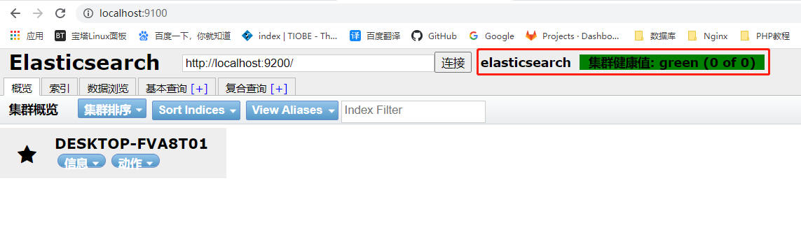


> 更新: 2022-08-17 23:51:26  
> 原文: <https://www.yuque.com/like321/fk7s34/ytg9du>