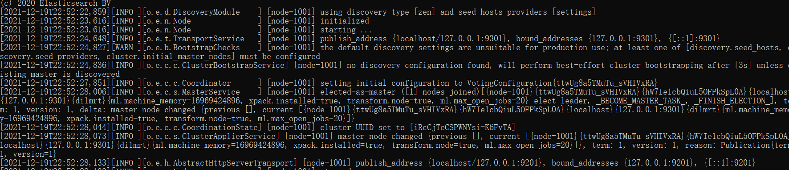
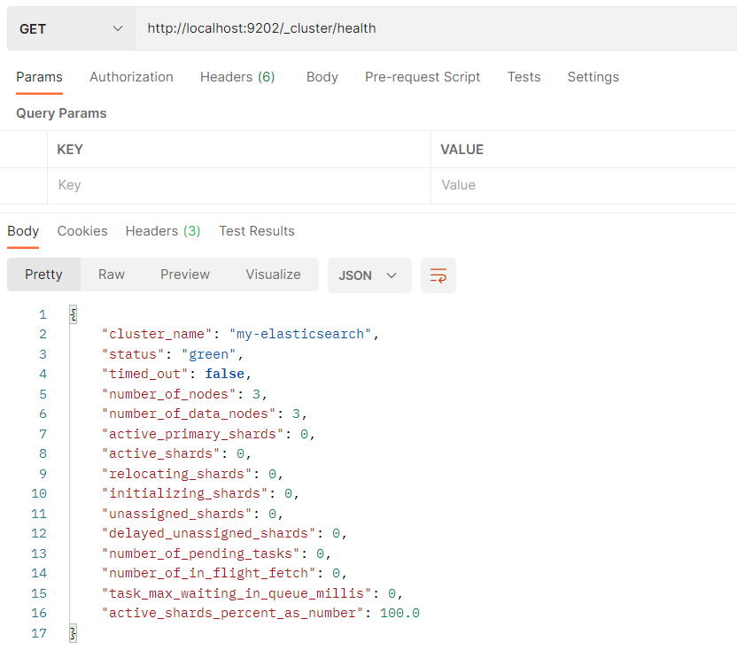
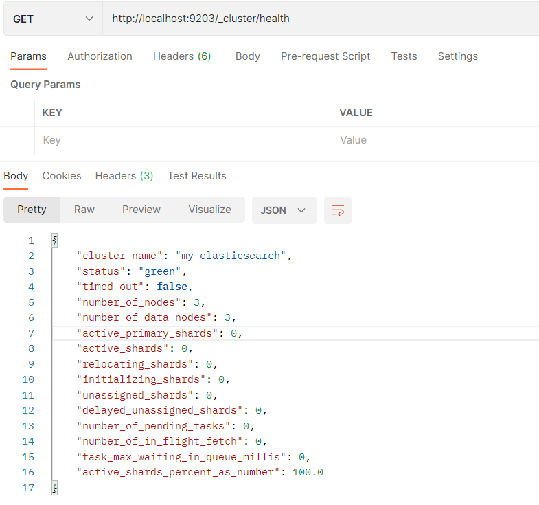
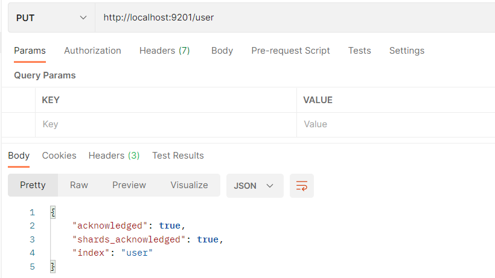
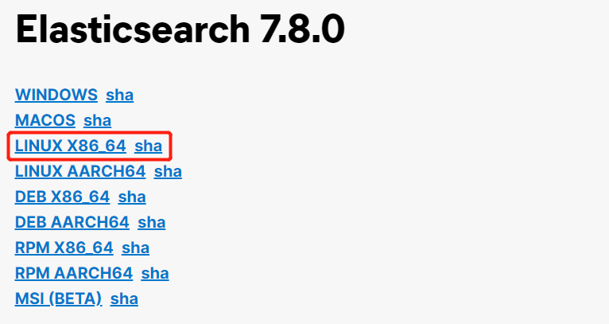
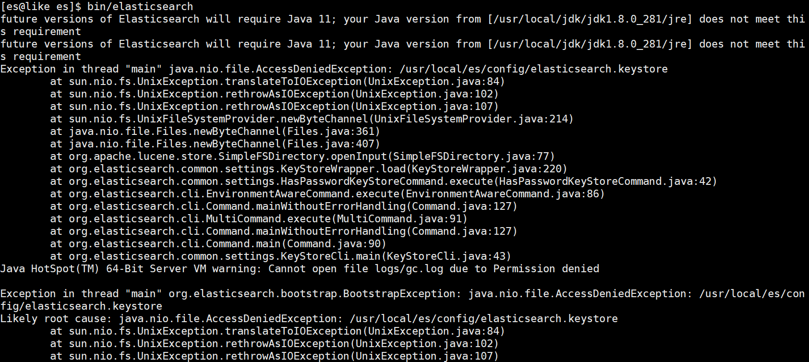
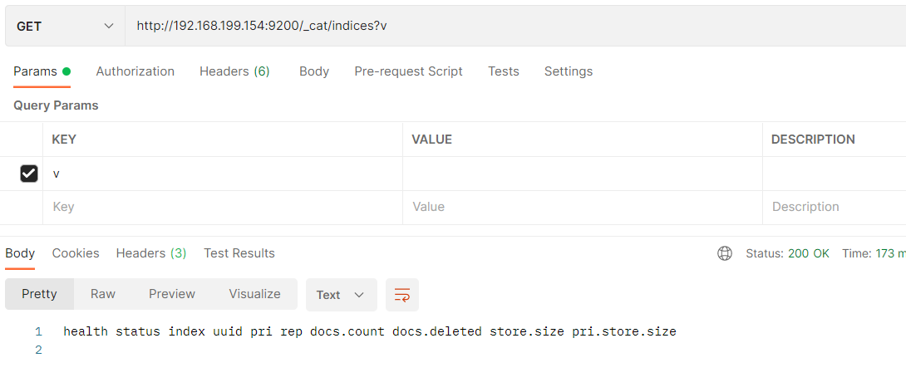

# 五、Elasticsearch环境

## 4.1、相关概念


### 4.1.1、单机&集群


单台 Elasticsearch 服务器提供服务，往往都有最大的负载能力，超过这个阈值，服务器性能就会大大降低甚至不可用，所以生产环境中，一般都是运行在指定服务器集群中。


除了负载能力，单点服务器也存在其他问题：


+ 单台机器存储容量有限
+ 单服务器容易出现单点故障，无法实现高可用
+ 单服务的并发处理能力有限


配置服务器集群时，集群中节点数量没有限制，大于等于 2 个节点就可以看做是集群了。


一般出于高性能及高可用方面来考虑集群中节点数量都是 3 个以上。


### 4.1.2、集群 Cluster


<font style="color:#E8323C;">一个集群就是由一个或多个服务器节点组织在一起，共同持有整个的数据，并一起提供索引和搜索功能。</font>


一个 Elasticsearch 集群有一个唯一的名字标识，这个名字默认就是 "elasticsearch”。


这个名字是重要的，因为一个节点只能通过指定某个集群的名字，来加入这个集群。


### 4.1.3、节点 Node


集群中包含很多服务器，<font style="color:#E8323C;">一个节点就是其中的一个服务器</font>。作为集群的一部分，它存储数据，参与集群的索引和搜索功能。


一个节点也是由一个名字来标识的，默认情况下，这个名字是一个随机的漫威漫画角色的名字，这个名字会在启动的时候赋予节点。这个名字对于管理工作来说挺重要的，因为在这个管理过程中，你会去确定网络中的哪些服务器对应于 Elasticsearch 集群中的哪些节点。


一个节点可以通过配置集群名称的方式来加入一个指定的集群。默认情况下，每个节点都会被安排加入到一个叫做“elasticsearch”的集群中，这意味着，如果你在你的网络中启动了若干个节点，并假定它们能够相互发现彼此，它们将会自动地形成并加入到一个叫做“elasticsearch”的集群中。


在一个集群里，只要你想，可以拥有任意多个节点。而且，如果当前你的网络中没有运行任何 Elasticsearch 节点，这时启动一个节点，会默认创建并加入一个叫做“elasticsearch”的集群。


## 4.2、Windos 集群


### 4.2.1、部署集群


1. 创建 elasticsearch-cluster 文件夹，在内部复制三个 elasticsearch 服务


2.  修改集群文件目录中每个节点的 config/elasticsearch.yml 配置文件 


    1. node-1001 节点

```yaml
#集群名称，节点之间要保持一致
cluster.name: my-elasticsearch

#节点名称，集群内要唯一
node.name: node-1001
node.master: true
node.data: true

#ip 地址
network.host: localhost
#http 端口
http.port: 9201
#tcp 监听端口
transport.tcp.port: 9301

#discovery.seed_hosts: ["localhost:9301", "localhost:9302","localhost:9303"]
#discovery.zen.fd.ping_timeout: 1m
#discovery.zen.fd.ping_retries: 5

#集群内的可以被选为主节点的节点列表
#cluster.initial_master_nodes: ["node-1", "node-2","node-3"]

#跨域配置
#action.destructive_requires_name: true
http.cors.enabled: true
http.cors.allow-origin: "*"
```


    2. node-1002节点

```yaml
#集群名称，节点之间要保持一致
cluster.name: my-elasticsearch

#节点名称，集群内要唯一
node.name: node-1002
node.master: true
node.data: true

#ip 地址
network.host: localhost
#http 端口
http.port: 9202
#tcp 监听端口
transport.tcp.port: 9302

discovery.seed_hosts: ["localhost:9301"]
discovery.zen.fd.ping_timeout: 1m
discovery.zen.fd.ping_retries: 5

#集群内的可以被选为主节点的节点列表
#cluster.initial_master_nodes: ["node-1", "node-2","node-3"]

#跨域配置
#action.destructive_requires_name: true
http.cors.enabled: true
http.cors.allow-origin: "*"
```


    3. node-1003节点

```yaml
#集群名称，节点之间要保持一致
cluster.name: my-elasticsearch

#节点名称，集群内要唯一
node.name: node-1003
node.master: true
node.data: true

#ip 地址
network.host: localhost
#http 端口
http.port: 9203
#tcp 监听端口
transport.tcp.port: 9303

#候选主节点的地址，在开启服务后可以被选为主节点
discovery.seed_hosts: ["localhost:9301", "localhost:9302"]
discovery.zen.fd.ping_timeout: 1m
discovery.zen.fd.ping_retries: 5

#集群内的可以被选为主节点的节点列表
#cluster.initial_master_nodes: ["node-1", "node-2","node-3"]

#跨域配置
#action.destructive_requires_name: true
http.cors.enabled: true
http.cors.allow-origin: "*"
```


### 4.2.2、启动集群


1. 启动前先删除每个节点中的 data 目录中所有内容（如果存在）


2. 分别双击执行 bin/elasticsearch.bat, 启动节点服务器，启动后，会自动加入指定名称的集群





### 4.2.3、测试集群


1. 查看集群状态


+ node-1001 节点


+ node-1002 节点





+ node-1003 节点





2. 含义：


status字段指示着当前集群在总体上是否工作正常。它的三种颜色含义如下：


+ green	<font style="color:#E8323C;">所有的主分片和副本分片都正常运行。</font>
+ yellow   <font style="color:#E8323C;">所有的主分片都正常运行，但不是所有的副本分片都正常运行</font>
+ red        <font style="color:#E8323C;">有主分片没能正常运行</font>


3. 向集群中的 node-1001 节点增加索引





4. 向集群中的 node-1002 节点查询索引


## 4.3、Linux单机


### 4.3.1、软件下载


软件下载地址：[https://www.elastic.co/cn/downloads/past-releases/elasticsearch-7-8-0](https://www.elastic.co/cn/downloads/past-releases/elasticsearch-7-8-0)





### 4.3.2、软件安装


+  解压软件  
将下载的软件解压缩 


```bash
# 解压缩
tar -zxvf elasticsearch-7.8.0-linux-x86_64.tar.gz -C /usr/local

# 改名
mv elasticsearch-7.8.0 es
```


+  创建用户  
因为安全问题，Elasticsearch 不允许 root 用户直接运行，所以要创建新用户，在 root 用户中创建新用户 


```bash
useradd es #新增 es 用户
passwd es #为 es 用户设置密码

userdel -r es #如果错了，可以删除再加
chown -R es:es /usr/local/es #文件夹所有者
```


+  修改配置文件  
修改 /usr/local/es/config/elasticsearch.yml 文件 


```yaml
# 加入如下配置
cluster.name: elasticsearch
node.name: node-1
network.host: 0.0.0.0
http.port: 9200
cluster.initial_master_nodes: ["node-1"]
```


	修改/etc/security/limits.conf


```nginx
vim /etc/security/limits.conf

# 在文件末尾中增加下面内容
# 每个进程可以打开的文件数的限制
es soft nofile 65536
es hard nofile 65536
```


	修改/etc/security/limits.d/20-nproc.conf


```plain
vim /etc/security/limits.d/20-nproc.conf

# 在文件末尾中增加下面内容
# 每个进程可以打开的文件数的限制
es soft nofile 65536
es hard nofile 65536

# 操作系统级别对每个用户创建的进程数的限制
# 注：* 带表 Linux 所有用户名称
* hard nproc 4096
```


	修改/etc/sysctl.conf


```plain
vim /etc/sysctl.conf

# 在文件中增加下面内容
# 一个进程可以拥有的 VMA(虚拟内存区域)的数量,默认值为 65536
vm.max_map_count=655360
```


重新加载


```plain
sysctl -p
```


### 4.3.3  启动软件


使用 ES 用户启动


```bash
cd /usr/local/es/

#启动
bin/elasticsearch

#后台启动
bin/elasticsearch -d
```


启动时，会动态生成文件，如果文件所属用户不匹配，会发生错误，需要重新进行修改用户和用户组





```bash
chown -R es:es /usr/local/es
```


关闭防火墙


```bash
#暂时关闭防火墙
systemctl stop firewalld

#永久关闭防火墙
systemctl enable firewalld.service #打开防火墙，永久性生效，重启后不会复原
systemctl disable firewalld.service #关闭防火墙，永久性生效，重启后不会复原
```


### 4.4.4、测试


浏览器中输入地址：[http://192.168.199.154:9200/](http://192.168.199.154:9200/)





## 4.4、Linux集群


### 4.4.1、软件安装


+  解压软件  
将下载的软件解压缩 


```bash
# 解压缩
tar -zxvf elasticsearch-7.8.0-linux-x86_64.tar.gz -C /usr/local

# 改名
mv elasticsearch-7.8.0 es-cluster
```


+ 将软件分发到其他节点：linux2, linux3


```bash
xsync es-cluster
```


+  创建用户  
因为安全问题，Elasticsearch 不允许 root 用户直接运行，所以要创建新用户，在 root 用户中创建新用户 


```bash
useradd es #新增 es 用户
passwd es #为 es 用户设置密码

userdel -r es #如果错了，可以删除再加
chown -R es:es /usr/local/es-cluster #文件夹所有者
```


+  修改配置文件  
修改 /usr/local/es-cluster/config/elasticsearch.yml 文件 


```yaml
# 加入如下配置
#集群名称
cluster.name: cluster-es
#节点名称，每个节点的名称不能重复
node.name: node-1
#ip 地址，每个节点的地址不能重复
network.host: linux1
#是不是有资格主节点
node.master: true
node.data: true
http.port: 9200
# head 插件需要这打开这两个配置
http.cors.allow-origin: "*"
http.cors.enabled: true
http.max_content_length: 200mb
#es7.x 之后新增的配置，初始化一个新的集群时需要此配置来选举 master
cluster.initial_master_nodes: ["node-1"]
#es7.x 之后新增的配置，节点发现
discovery.seed_hosts: ["linux1:9300","linux2:9300","linux3:9300"]
gateway.recover_after_nodes: 2
network.tcp.keep_alive: true
network.tcp.no_delay: true
transport.tcp.compress: true
#集群内同时启动的数据任务个数，默认是 2 个
cluster.routing.allocation.cluster_concurrent_rebalance: 16
#添加或删除节点及负载均衡时并发恢复的线程个数，默认 4 个
cluster.routing.allocation.node_concurrent_recoveries: 16
#初始化数据恢复时，并发恢复线程的个数，默认 4 个
cluster.routing.allocation.node_initial_primaries_recoveries: 16
```


+ 修改/etc/security/limits.conf ，分发文件


```plain
# 在文件末尾中增加下面内容
es soft nofile 65536
es hard nofile 65536
```


+ 修改/etc/security/limits.d/20-nproc.conf，分发文件


```plain
# 在文件末尾中增加下面内容
es soft nofile 65536
es hard nofile 65536
* hard nproc 4096
# 注：* 带表 Linux 所有用户名称
```


+ 修改/etc/sysctl.conf


```plain
# 在文件中增加下面内容
vm.max_map_count=655360
```


+ 重新加载


```plain
sysctl -p
```


### 4.4.2、启动软件


分别在不同节点上启动 ES 软件


```bash
cd /opt/module/es-cluster
#启动
bin/elasticsearch
#后台启动
bin/elasticsearch -d
```


> 更新: 2022-10-13 16:13:12  
> 原文: <https://www.yuque.com/like321/fk7s34/lnqktt>