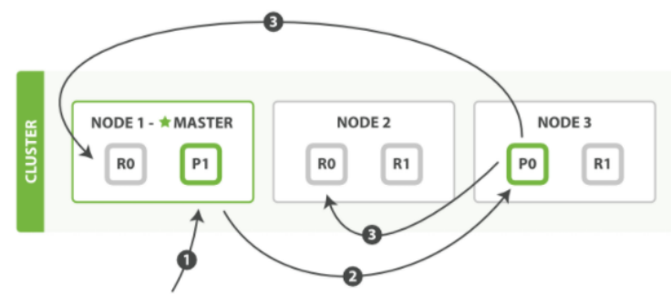
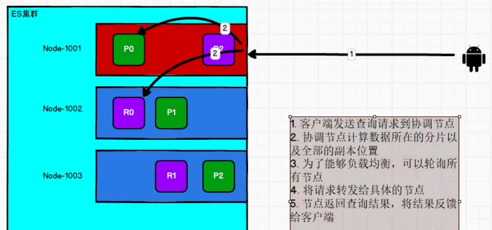
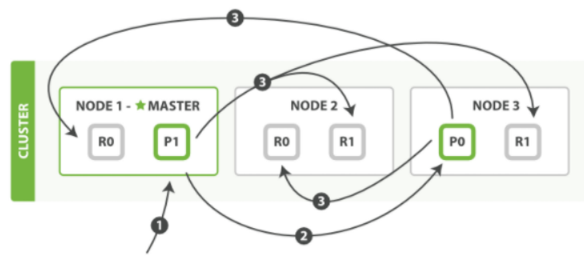
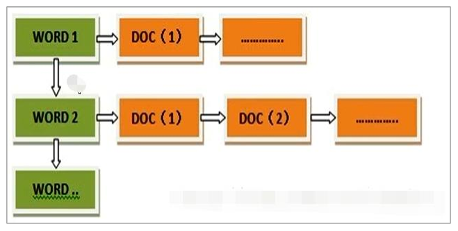

# 六、Elasticsearch进阶

## 1、 核心概念


### 1.1  索引（Index）


一个索引就是<font style="color:#E8323C;">一个拥有几分相似特征的文档的集合。</font>


比如说，你可以有一个客户数据的索引，有一个产品目录的索引，还有一个订单数据的索引。


一个索引由一个名字来标识（<font style="color:#E8323C;">必须全部是小写字母</font>），并且当我们要对这个索引中的文档进行索引、搜索、更新和删除的时候，都要使用到这个名字。


在一个集群中，可以定义任意多的索引。


能搜索的数据必须索引，这样的好处是可以提高查询速度，比如：新华字典前面的目录就是索引的意思，目录可以提高查询速度。


**Elasticsearch  索引的精髓：****<font style="color:#E8323C;">一切设计都是为了提高搜索的性能。</font>**


### 1.2  类型（Type）


在一个索引中，你可以定义一种或多种类型。


一个类型是你的索引的一个逻辑上的分类/分区，其语义完全由你来定。通常，会为具有一组共同字段的文档定义一个类型。


不同的版本，类型发生了不同的变化

| 版本 | Type |
| --- | --- |
| 5.x | 支持多种type |
| 6.x | 只能有一种type |
| 7.x | 默认不再支持自定义索引类型（默认类型为：_doc） |


### 1.3  文档（Document）


一个文档是一个可被索引的基础信息单元，也<font style="color:#E8323C;">就是一条数据</font>


比如：你可以拥有某一个客户的文档，某一个产品的一个文档，当然，也可以拥有某个订单的一个文档。


<font style="color:#E8323C;">文档以 JSON（Javascript Object Notation）格式来表示</font>，而 JSON 是一个到处存在的互联网数据交互格式。


在一个 index/type 里面，你可以存储任意多的文档。


### 1.4  字段（Field）


相当于是数据表的字段，对文档数据根据不同属性进行的分类标识。


### 1.5  映射（Mapping）


mapping 是处理数据的方式和规则方面做一些限制，如：某个字段的数据类型、默认值、分析器、是否被索引等等。


这些都是映射里面可以设置的，其它就是处理 ES 里面数据的一些使用规则设置也叫做映射，按着最优规则处理数据对性能提高很大，因此才需要建立映射，并且需要思考如何建立映射才能对性能更好。


### 1.6  分片（Shards）


一个索引可以存储超出单个节点硬件限制的大量数据。比如，一个具有 10 亿文档数据的索引占据 1TB 的磁盘空间，而任一节点都可能没有这样大的磁盘空间。


或者单个节点处理搜索请求，响应太慢。为了解决这个问题，<font style="color:#E8323C;">Elasticsearch 提供了将索引划分成多份的能力，</font>**<font style="color:#E8323C;">每一份就称之为分片。</font>**


当你创建一个索引的时候，你可以指定你想要的分片的数量。每个分片本身也是一个功能完善并且独立的“索引”，这个“索引”可以被放置到集群中的任何节点上。


分片很重要，主要有两方面的原因：


1. 允许你水平分割 / 扩展你的内容容量。
2. 允许你在分片之上进行分布式的、并行的操作，进而提高性能/吞吐量。


至于一个分片怎样分布，它的文档怎样聚合和搜索请求，是完全由 Elasticsearch 管理的，对于作为用户的你来说，这些都是透明的，无需过分关心。


**被混淆的概念是，一个 Lucene  索引  我们在 Elasticsearch  称作  分片  。  ****<font style="color:#E8323C;">一个Elasticsearch  索引  是分片的集合。  </font>**


**当 Elasticsearch  在索引中搜索的时候，  他发送查询到每一个属于索引的分片(Lucene  索引)  ，然后****<font style="color:#E8323C;">合并每个分片的结果到一个全局的结果集。</font>**


### 1.7  副本（Replicas）


在一个网络 / 云的环境里，失败随时都可能发生，在某个分片/节点不知怎么的就处于离线状态，或者由于任何原因消失了，这种情况下，有一个<font style="color:#E8323C;">故障转移机制</font>是非常有用并且是强烈推荐的。


为此目的，<font style="color:#E8323C;">Elasticsearch 允许你创建分片的一份或多份</font>**<font style="color:#E8323C;">拷贝</font>**<font style="color:#E8323C;">，这些拷贝叫做</font>**<font style="color:#E8323C;">复制分片(副本)。</font>**


复制分片之所以重要，有两个主要原因：


+  在分片/节点失败的情况下，提供了高可用性。  
因为这个原因，注意到<font style="color:#E8323C;">复制分片从不与原/主要（original/primary）分片置于同一节点上是非常重要的。 </font>
+  扩展你的搜索量/吞吐量，因为搜索可以在所有的副本上并行运行。 


总之，每个索引可以被分成多个分片。一个索引也可以被复制 0 次（意思是没有复制）或多次。一旦复制了，每个索引就有了主分片（作为复制源的原来的分片）和复制分片（主分片的拷贝）之别。


<font style="color:#E8323C;">分片和复制的数量可以在索引创建的时候指定。</font>在索引创建之后，你可以在<font style="color:#E8323C;">任何时候动态地改变</font>**<font style="color:#E8323C;">复制</font>**<font style="color:#E8323C;">的数量，但是你事后不能改变</font>**<font style="color:#E8323C;">分片</font>**<font style="color:#E8323C;">的数量。</font>


默认情况下，Elasticsearch 中的每个索引被分片 1 个主分片和 1 个复制，这意味着，如果你的集群中至少有两个节点，你的索引将会有 1 个主分片和另外 1 个复制分片（1 个完全拷贝），这样的话每个索引总共就有 2 个分片，我们需要根据索引需要确定分片个数。


### 1.8  分配（Allocation）


将分片分配给某个节点的过程，包括分配主分片或者副本。如果是副本，还包含从主分片复制数据的过程。这个过程是由 master 节点完成的。


## 2、系统架构


一个运行中的 Elasticsearch 实例称为一个节点，而集群是由一个或者多个拥有相同cluster.name 配置的节点组成， 它们共同承担数据和负载的压力。<font style="color:#E8323C;">当有节点加入集群中或者从集群中移除节点时，集群将会重新平均分布所有的数据。</font>


当一个节点被选举成为主节点时， 它将负责管理集群范围内的所有变更，例如增加、删除索引，或者增加、删除节点等。 而主节点并不需要涉及到文档级别的变更和搜索等操作，所以当集群只拥有一个主节点的情况下，即使流量的增加它也不会成为瓶颈。 任何节点都可以成为主节点。我们的示例集群就只有一个节点，所以它同时也成为了主节点。


作为用户，我们可以将请求发送到集群中的任何节点 ，包括主节点。 <font style="color:#E8323C;">每个节点都知道任意文档所处的位置，并且能够将我们的请求直接</font>**<font style="color:#E8323C;">转发</font>**<font style="color:#E8323C;">到存储我们所需文档的节点。</font> 无论我们将请求发送到哪个节点，它都能负责从各个包含我们所需文档的节点收集回数据，并将最终结果返回給客户端。 Elasticsearch 对这一切的管理都是透明的。


## 3、分布式集群


### 3.1  单节点集群


**注意：把data和logs中的文件删掉**


我们在包含一个空节点的集群内创建名为 users 的索引，为了演示目的，我们将分配 3个主分片和一份副本（<font style="color:#E8323C;">每个主分片拥有一个副本分片</font>）


```json
{
    "settings" : {
        "number_of_shards" : 3,
        "number_of_replicas" : 1
    }
}
```


我们的集群现在是拥有一个索引的单节点集群。所有 3 个主分片都被分配在 node-1 。


通过 elasticsearch-head 插件查看集群情况：


#### 集群健康值:yellow( 3 of 6 ) 


表示当前集群的全部**<font style="color:#E8323C;">主分片</font>**都正常运行，<font style="color:#E8323C;">但是副本分片没有全部处在正常状态</font>


:  3 个主分片正常

  
:  3 个副本分片都是 Unassigned —— 它们都没有被分配到任何节点。 <font style="color:#E8323C;">在同一个节点上既保存原始数据又保存副本是没有意义的</font>，因为一旦失去了那个节点，我们也将丢失该节点上的所有副本数据。


当前我们的集群是正常运行的，但是在硬件故障时有丢失数据的风险。


### 3.2、故障转移


当集群中只有一个节点在运行时，意味着会有一个单点故障问题——没有冗余。幸运的是，我们只需再启动一个节点即可防止数据丢失。


当你在同一台机器上启动了第二个节点时，只要它和第一个节点有同样的 cluster.name 配置，它就会自动发现集群并加入到其中。


但是在不同机器上启动节点的时候，为了加入到同一集群，你需要配置一个可连接到的单播主机列表。之所以配置为使用单播发现，以防止节点无意中加入集群。


<font style="color:#E8323C;">只有在同一台机器上运行的节点才会自动组成集群。</font>


如果启动了第二个节点，我们的集群将会拥有两个节点的集群 : 所有主分片和副本分片都已被分配


通过 elasticsearch-head 插件查看集群情况


#### 集群健康值:green( 6 of 6 ) 


表示所有 6 个分片（包括 3 个主分片和 3 个副本分片）都在正常运行。  
:  3 个主分片正常

  
:  当第二个节点加入到集群后，3 个副本分片将会分配到这个节点上——每个主分片对应一个副本分片。这意味着当集群内任何一个节点出现问题时，我们的数据都完好无损。所有新进被索引的文档都将会保存在主分片上，然后被并行的复制到对应的副本分片上。这就保证了我们既可以从主分片又可以从副本分片上获得文档。


### 3.3、水平扩容


怎样为我们的正在增长中的应用程序按需扩容呢？当启动了第三个节点，我们的集群将会拥有三个节点的集群 : 为了分散负载而对分片进行重新分配


通过 elasticsearch-head 插件查看集群情况


#### 集群健康值:green( 6 of 6 ) : 


表示所有 6 个分片（包括 3 个主分片和 3 个副本分片）都在正常运行。


Node 1 和 Node 2 上各有一个分片被迁移到了新的 Node 3 节点，现在每个节点上都拥有2个分片，而不是之前的 3 个。 这表示每个节点的硬件资源（CPU, RAM, I/O）将被更少的分片所共享，每个分片的性能将会得到提升。


分片是一个功能完整的搜索引擎，它拥有使用一个节点上的所有资源的能力。 我们这个拥有 6 个分片（3 个主分片和 3 个副本分片）的索引可以最大扩容到 6 个节点，每个节点上存在一个分片，并且每个分片拥有所在节点的全部资源。


#### 但是如果我们想要扩容超过 6 个节点怎么办呢？


<font style="color:#E8323C;">主分片的数目在索引创建时就已经确定了下来</font>。实际上，这个数目定义了这个<font style="color:#E8323C;">索引能够存储的最大数据量。</font>（实际大小取决于你的数据、硬件和使用场景。）


但是，读操作——搜索和返回数据——可以同时被主分片 或 副本分片所处理，所以当你拥有越多的副本分片时，也将拥有越高的吞吐量。


在运行中的集群上是可以动态调整副本分片数目的，我们可以按需伸缩集群。**<font style="color:#E8323C;">让我们把副本数从默认的 1 增加到 2</font>**


```json
{
	"number_of_replicas" : 2
}
```


users 索引现在拥有 9 个分片：3 个主分片和 6 个副本分片。 这意味着我们可以将集群扩容到 9 个节点，每个节点上一个分片。相比原来 3 个节点时，集群搜索性能可以提升 3 倍。


通过 elasticsearch-head 插件查看集群情况


当然，如果只是在相同节点数目的集群上增加更多的副本分片并不能提高性能，因为每个分片从节点上获得的资源会变少。 你需要增加更多的硬件资源来提升吞吐量。


但是更多的副本分片数提高了数据冗余量：按照上面的节点配置，我们可以在失去 2 个节点的情况下不丢失任何数据。


### 3.4、应对故障


我们关闭第一个节点，这时集群的状态为：关闭了一个节点后的集群。


我们关闭的节点是一个主节点。而集群必须拥有一个主节点来保证正常工作，所以发生的第一件事情就是**<font style="color:#E8323C;">选举一个新的主节点</font>**： Node 2 。


在我们关闭 Node 1 的同时也失去了主分片 1 和 2 ，并且在缺失主分片的时候索引也不能正常工作。 如果此时来检查集群的状况，我们看到的状态将会为 **<font style="color:#E8323C;">red </font>**：不是所有主分片都在正常工作。


幸运的是，在其它节点上存在着这两个主分片的完整副本， 所以新的主节点立即将这些分片在 Node 2 和 Node 3 上对应的**<font style="color:#E8323C;">副本分片提升为主分片</font>**， 此时集群的状态将会为**<font style="color:#E8323C;">yellow</font>**。这个提升主分片的过程是瞬间发生的，如同按下一个开关一般。


#### 为什么我们集群状态是 yellow  而不是 green  呢？


虽然我们拥有所有的三个主分片，但是同时设置了每个主分片需要对应 2 份副本分片，而此时只存在一份副本分片。所以集群不能为green 的状态，不过我们不必过于担心：如果我们同样关闭了 Node 2 ，我们的程序 依然 可以保持在不丢任何数据的情况下运行，因为 Node 3 为每一个分片都保留着一份副本。


如果我们重新启动 Node 1 ，集群可以将缺失的副本分片再次进行分配，那么集群的状态也将恢复成之前的green状态。 如果 Node 1 依然拥有着之前的分片，它将尝试去重用它们，<font style="color:#E8323C;">同时仅从主分片复制发生了修改的数据文件。</font>和之前的集群相比，只是 Master 节点切换了。


## 4、路由计算


当索引一个文档的时候，文档会被存储到一个主分片中。<font style="color:#E8323C;"> Elasticsearch 如何知道一个文档应该存放到哪个分片中呢？</font>


当我们创建文档时，它如何决定这个文档应当被存储在分片1 还是分片 2 中呢？首先这肯定不会是随机的，否则将来要获取文档的时候我们就不知道从何处寻找了。


实际上，这个过程是根据下面这个公式决定的：


**<font style="color:#E8323C;">shard = hash(routing) % number_of_primary_shards</font>**


routing 是一个可变值，默认是文档的 _id ，也可以设置成一个自定义的值。


<font style="color:#E8323C;">routing 通过hash 函数生成一个数字，然后这个数字再除以 number_of_primary_shards （主分片的数量）后得到余数 。</font>这个分布在 0 到 number_of_primary_shards-1 之间的余数，就是我们所寻求的文档所在分片的位置。


这就解释了**<font style="color:#E8323C;">为什么</font>**我们要在创建索引的时候就确定好主分片的数量 并且永远不会改变这个数量：<font style="color:#E8323C;">因为如果数量变化了，那么所有之前路由的值都会无效，文档也再也找不到了。</font>


所有的文档 API（ get 、 index 、 delete 、 bulk 、 update 以及 mget ）都接受一个叫做 routing 的路由参数 ，通过这个参数我们可以自定义文档到分片的映射。


一个自定义的路由参数可以用来确保所有相关的文档——例如所有属于同一个用户的文档——都被存储到同一个分片中。


## 5、分片控制


<font style="color:#E8323C;">我们可以发送请求到集群中的任一节点。 每个节点都有能力处理任意请求。</font>

<font style="color:#E8323C;"></font>

<font style="color:#E8323C;">每个节点都知道集群中任一文档位置，所以可以直接将请求转发到需要的节点上。</font>


例如，将所有的请求发送到 Node 1，我们将其称为 <font style="color:#E8323C;"> </font>**<font style="color:#E8323C;">协调节点(coordinating node) 。</font>**


**当发送请求的时候，  为了扩展负载，更好的做法是轮询集群中所有的节点**


### 5.1、写流程


新建、索引和删除 请求都是 写 操作， <font style="color:#E8323C;">必须在主分片上面完成之后才能被复制到相关的副本分片</font>





**<font style="color:#E8323C;">新建，索引和删除文档所需要的步骤顺序：</font>**


1.  客户端向 Node 1 发送新建、索引或者删除请求。 


2.  节点使用文档的 _id 确定文档属于分片 0 。请求会被转发到 Node 3，因为分片 0 的主分片目前被分配在 Node 3 上。 


3.  Node 3 在主分片上面执行请求。如果成功了，<font style="color:#E8323C;">它将请求并行转发到 Node 1 和 Node 2的副本分片上。</font>  
一旦所有的副本分片都报告成功，Node 3 将向协调节点报告成功，协调节点向客户端报告成功。 


在客户端收到成功响应时，文档变更已经在主分片和所有副本分片执行完成，变更是安全的。  
有一些可选的请求参数允许您影响这个过程，可能以数据安全为代价提升性能。


这些选项很少使用，因为 Elasticsearch 已经很快，但是为了完整起见，请参考下面：


+ **<font style="color:#E8323C;">consistency</font>**


consistency，即一致性。在默认设置下，即使仅仅是在试图执行一个**写**操作之前，主分片都会要求 必须要有 规定数量(quorum)（或者换种说法，也即必须要有大多数）的分片副本处于活跃可用状态，才会去执行**写**操作(其中分片副本可以是主分片或者副本分片)。


这是为了避免在发生网络分区故障（network partition）的时候进行**写**操作，进而导致数据不一致。


**<font style="color:#E8323C;">规定数量</font>**即：<font style="color:#E8323C;">int( (primary + number_of_replicas) / 2 ) + 1</font>


consistency 参数的值可以设为 one （只要主分片状态 ok 就允许执行**写**操作）,all（必须要主分片和所有副本分片的状态没问题才允许执行**写**操作）, 或quorum 。


默认值为 quorum , 即大多数的分片副本状态没问题就允许执行**写**操作。


注意，规定数量 的计算公式中 number_of_replicas 指的是在索引设置中的设定副本分片数，而不是指当前处理活动状态的副本分片数。如果你的索引设置中指定了当前索引拥有三个副本分片，那规定数量的计算结果即：int( (primary + 3 replicas) / 2 ) + 1 = 3


如果此时你只启动两个节点，那么处于活跃状态的分片副本数量就达不到规定数量，也因此您将无法索引和删除任何文档。


+ **<font style="color:#E8323C;">timeout</font>**


如果没有足够的副本分片会发生什么？ Elasticsearch 会等待，希望更多的分片出现。


默认情况下，它最多等待 1 分钟。 如果你需要，你可以使用 timeout 参数 使它更早终止： 100 100 毫秒，30s 是 30 秒。


**注意：新索引默认有 1 个副本分片，这意味着为满足规定数量应该需要两个活动的分片副本。**


**但是，这些默认的设置会阻止我们在单一节点上做任何事情。为了避免这个问题，要求只有当 number_of_replicas 大于 1 的时候，规定数量才会执行。**


### 5.2、读流程


我们<font style="color:#E8323C;">可以从主分片或者从其它任意副本分片检索文档</font>


从主分片或者副本分片检索文档的步骤顺序：


1. 客户端向 Node 1 发送获取请求。


2. 节点使用文档的 _id 来确定文档属于分片 0 。分片 0 的副本分片存在于所有的三个节点上。 在这种情况下，它将请求转发到 Node 2


3. Node 2 将文档返回给 Node 1 ，然后将文档返回给客户端。


在处理读取请求时，<font style="color:#E8323C;">协调结点在每次请求的时候都会通过</font>**<font style="color:#E8323C;">轮询</font>**<font style="color:#E8323C;">所有的副本分片来达到负载均衡。</font>


在文档被检索时，已经被索引的文档可能已经存在于主分片上但是还没有复制到副本分片。 在这种情况下，副本分片可能会报告文档不存在，但是主分片可能成功返回文档。 一旦索引请求成功返回给用户，文档在主分片和副本分片都是可用的。





### 5.3、更新流程


<font style="color:#E8323C;">部分更新一个文档</font>结合了先前说明的读取和写入流程：


**部分更新一个文档的步骤 如下：**


1.  客户端向 Node 1 发送更新请求。 


2.  节点使用文档的 _id 确定文档属于分片 0 。请求会被转发到 Node 3，因为分片 0 的主分片目前被分配在 Node 3 上。 


3.  Node 3 从主分片检索文档，修改 _source 字段中的 JSON ，并且尝试重新索引主分片的文档。 如果文档已经被另一个进程修改，它会重试步骤 3 ，超过 retry_on_conflict 次后放弃。 


4.  如果 Node 3 成功地更新文档，它将新版本的文档并行转发到 Node 1 和 Node 2 上的副本分片，重新建立索引。  
一旦所有副本分片都返回成功， Node 3 向协调节点也返回成功，协调节点向客户端返回成功。 


**当主分片把更改转发到副本分片时， 它不会转发更新请求。 相反，它转发完整文档的新版本。**


**请记住，这些更改将会异步转发到副本分片，并且不能保证它们以发送它们相同的顺序到达。 **


**如果 Elasticsearch 仅转发更改请求，则可能以错误的顺序应用更改，导致得到损坏的文档。**


### 5.4、多文档操作流程


mget 和 批量 bulk 的模式类似于单文档模式。区别在于协调节点知道每个文档存在于哪个分片中。<font style="color:#E8323C;">它将整个多文档请求分解成 每个分片 的多文档请求，并且将这些请求并行转发到每个参与节点。</font>


协调节点一旦收到来自每个节点的应答，就将每个节点的响应<font style="color:#E8323C;">收集整理成单个响应</font>，返回给客户端


**用单个 mget 请求取回多个文档所需的步骤顺序：**


1. 客户端向 Node 1 发送 mget 请求。


2. Node 1 为每个分片构建多文档获取请求，然后并行转发这些请求到托管在每个所需的主分片或者副本分片的节点上。一旦收到所有答复， Node 1 构建响应并将其返回给客户端。


可以对 docs 数组中每个文档设置 routing 参数。


**<font style="color:#E8323C;">bulk API</font>**

****

**允许在单个批量请求中执行多个创建、索引、删除和更新请求**





bulk API 按如下步骤顺序执行：


1. 客户端向 Node 1 发送 bulk 请求。


2. Node 1 为每个节点创建一个批量请求，并将这些请求并行转发到每个包含主分片的节点主机。


3. 主分片一个接一个按顺序执行每个操作。当每个操作成功时，主分片并行转发新文档（或删除）到副本分片，然后执行下一个操作。 一旦所有的副本分片报告所有操作成功，该节点将向协调节点报告成功，协调节点将这些响应收集整理并返回给客户端。


## 6、分片原理


分片是 Elasticsearch 最小的工作单元。但是究竟什么是一个分片，它是如何工作的？


传统的数据库每个字段存储单个值，但这对全文检索并不够。


文本字段中的每个单词需要被搜索，对数据库意味着需要<font style="color:#E8323C;">单个字段有索引多值的能力</font>。最好的支持是<font style="color:#E8323C;">一个字段多个值需求的数据结构是</font>**<font style="color:#E8323C;">倒排索引。</font>**


### 6.1、倒排索引


Elasticsearch 使用一种称为 倒排索引的结构，它适用于快速的全文搜索。


见其名，知其意，有倒排索引，肯定会对应有正向索引。正向索引（forward index），反向索引（inverted index）更熟悉的名字是倒排索引。


所谓的正向索引，就是搜索引擎会将待搜索的文件都对应一个文件 ID，搜索时将这个ID 和搜索关键字进行对应，形成 K-V 对，然后对关键字进行统计计数


但是互联网上收录在搜索引擎中的文档的数目是个天文数字，这样的索引结构根本无法满足实时返回排名结果的要求。


所以，搜索引擎会将正向索引重新构建为倒排索引，<font style="color:#E8323C;">即把</font>**<font style="color:#E8323C;">文件ID对应到关键词的映射</font>**<font style="color:#E8323C;">转换为</font>**<font style="color:#E8323C;">关键词到文件ID的映射</font>**<font style="color:#E8323C;">，每个关键词都对应着一系列的文件，这些文件中都出现这个关键词。</font>





<font style="color:#E8323C;">一个倒排索引由文档中所有不重复词的列表构成，对于其中每个词，有一个包含它的文档列表。</font>


例如，假设我们有两个文档，每个文档的 content 域包含如下内容：


+ The quick brown fox jumped over the lazy dog
+ Quick brown foxes leap over lazy dogs in summer


为了创建倒排索引，我们首先将每个文档的 content 域拆分成单独的 词（我们称它为 <font style="color:#E8323C;">词条</font>或 <font style="color:#E8323C;">tokens </font>），创建一个包含所有不重复词条的排序列表，然后列出每个词条出现在哪个文档。


结果如下所示：


现在，如果我们想搜索 **quick** **brown** ，我们只需要查找包含每个词条的文档：


两个文档都匹配，但是第一个文档比第二个匹配度更高。如果我们使用仅计算匹配词条数量的简单相似性算法，那么我们可以说，对于我们查询的相关性来讲，第一个文档比第二个文档更佳。


但是，我们目前的倒排索引有一些问题：


+ Quick 和 quick 以独立的词条出现，然而用户可能认为它们是相同的词。
+ fox 和 foxes 非常相似, 就像 dog 和 dogs ；他们有相同的词根。
+ jumped 和 leap, 尽管没有相同的词根，但他们的意思很相近。他们是同义词。


使用前面的索引搜索 **+Quick** **+fox** 不会得到任何匹配文档。（记住，+ 前缀表明这个词必须存在。）


只有同时出现 **Quick** 和 **fox** 的文档才满足这个查询条件，但是第一个文档包含quick fox ，第二个文档包含 Quick foxes 。


我们的用户可以合理的期望两个文档与查询匹配。我们可以做的更好。


如果我们将词条规范为标准模式，那么我们可以找到与用户搜索的词条不完全一致，但具有足够相关性的文档。


例如：


+ Quick 可以小写化为 quick 。
+ foxes 可以 词干提取 --变为词根的格式-- 为 fox 。类似的， dogs 可以为提取为 dog 。
+ jumped 和 leap 是同义词，可以索引为相同的单词 jump 。


现在索引看上去像这样：


这还远远不够。我们搜索 +Quick +fox 仍然 会失败，因为在我们的索引中，已经没有 Quick了。但是，如果我们对搜索的字符串使用与 content 域相同的标准化规则，会变成查询+quick +fox，这样两个文档都会匹配！分词和标准化的过程称为**<font style="color:#E8323C;">分析</font>**


这非常重要。你只能搜索在索引中出现的词条，所以索引文本和查询字符串必须标准化为相同的格式。


### 6.2、文档搜索


早期的全文检索会为整个文档集合建立一个很大的倒排索引并将其写入到磁盘。 一旦新的索引就绪，旧的就会被其替换，这样最近的变化便可以被检索到。


倒排索引被写入磁盘后是 不可改变 的：<font style="color:#E8323C;">它永远不会修改。</font>


不变性有重要的价值：


+ 不需要锁。如果你从来不更新索引，你就不需要担心多进程同时修改数据的问题。


+ 一旦索引被读入内核的文件系统缓存，便会留在哪里，由于其不变性。只要文件系统缓存中还有足够的空间，那么大部分读请求会直接请求内存，而不会命中磁盘。这提供了很大的性能提升。


+ 其它缓存(像 filter 缓存)，在索引的生命周期内始终有效。它们不需要在每次数据改变时被重建，因为数据不会变化。


+ 写入单个大的倒排索引允许数据被压缩，减少磁盘 I/O 和 需要被缓存到内存的索引的使用量。


当然，一个不变的索引也有不好的地方。主要事实是它是不可变的! 你不能修改它。如果你需要让一个新的文档 可被搜索，你需要重建整个索引。这要么对一个索引所能包含的数据量造成了很大的限制，要么对索引可被更新的频率造成了很大的限制。


### 6.3、动态更新索引


如何在保留不变性的前提下实现倒排索引的更新？


答案是：**<font style="color:#E8323C;">用更多的索引</font>**。通过增加**<font style="color:#E8323C;">新的补充索引</font>**来反映新近的修改，而不是直接重写整个倒排索引。每一个倒排索引都会被轮流查询到，从最早的开始查询完后再对结果进行合并。


Elasticsearch 基于 Lucene, 这个 java 库引入了<font style="color:#E8323C;"> </font>**<font style="color:#E8323C;">按段搜索</font>** 的概念。 每一段本身都是一个倒排索引， 但索引在 Lucene 中除表示所有段的集合外， 还增加了提交点的概念 — 一个列出了所有已知段的文件


**按段搜索**会以如下流程执行：


1. 新文档被收集到内存索引缓存


2. 不时地, 缓存被提交  
(1) 一个新的段—一个追加的倒排索引—被写入磁盘。  
(2) 一个新的包含新段名字的 提交点 被写入磁盘  
(3) 磁盘进行 同步 — 所有在文件系统缓存中等待的写入都刷新到磁盘，以确保它们被写入物理文件


3. 新的段被开启，让它包含的文档可见以被搜索


4. 内存缓存被清空，等待接收新的文档


当一个查询被触发，所有已知的段按顺序被查询。词项统计会对所有段的结果进行聚合，以保证每个词和每个文档的关联都被准确计算。 这种方式可以用相对较低的成本将新文档添加到索引。


段是不可改变的，所以既不能从把文档从旧的段中移除，也不能修改旧的段来进行反映文档的更新。 取而代之的是，每个提交点会包含一个 .del 文件，文件中会列出这些被删除文档的段信息。


当一个文档被 “删除” 时，它实际上只是在 <font style="color:#E8323C;">.del 文件中被 标记 删除。</font>一个被标记删除的文档仍然可以被查询匹配到， 但它会在最终结果被返回前从结果集中<font style="color:#E8323C;">移除。</font>


文档更新也是类似的操作方式：当一个文档被更新时，旧版本文档被标记删除，文档的新版本被索引到一个新的段中。 可能两个版本的文档都会被一个查询匹配到，但被删除的那个旧版本文档在结果集返回前就已经被<font style="color:#E8323C;">移除。</font>


### 6.4、近实时搜索


随着按段（per-segment）搜索的发展，一个新的文档从索引到可被搜索的延迟显著降低了。新文档在几分钟之内即可被检索，但这样还是不够快。磁盘在这里成为了瓶颈。提交（Commiting）一个新的段到磁盘需要一个 **fsync** 来确保段被物理性地写入磁盘，这样在断电的时候就不会丢失数据。 但是 **fsync** 操作代价很大; 如果每次索引一个文档都去执行一次的话会造成很大的性能问题。


我们需要的是一个更轻量的方式来使一个文档可被搜索，这意味着 **fsync** 要从整个过程中被移除。在Elasticsearch 和磁盘之间是文件系统缓存。 像之前描述的一样， 在内存索引缓冲区中的文档会被写入到一个新的段中。 但是这里新段会被先写入到文件系统缓存—这一步代价会比较低，稍后再被刷新到磁盘—这一步代价比较高。不过只要文件已经在缓存中，就可以像其它文件一样被打开和读取了。


Lucene 允许新段被写入和打开—使其包含的文档在未进行一次完整提交时便对搜索可见。  
这种方式比进行一次提交代价要小得多，并且在不影响性能的前提下可以被频繁地执行。


在 Elasticsearch 中，写入和打开一个新段的轻量的过程叫做 refresh 。 默认情况下每个分片会每秒自动刷新一次。这就是为什么我们说 Elasticsearch 是 近实时搜索: 文档的变化并不是立即对搜索可见，但会在一秒之内变为可见。


这些行为可能会对新用户造成困惑: 他们索引了一个文档然后尝试搜索它，但却没有搜到。  
这个问题的解决办法是用 refresh API 执行一次手动刷新: /users/_refresh


**尽管刷新是比提交轻量很多的操作，它还是会有性能开销。当写测试的时候， 手动刷新很有用，但是不要在生产环境下每次索引一个文档都去手动刷新。 相反，你的应用需要意识到 Elasticsearch 的近实时的性质，并接受它的不足 。**


并不是所有的情况都需要每秒刷新。可能你正在使用 Elasticsearch 索引大量的日志文件，你可能想优化索引速度而不是近实时搜索， 可以通过设置 refresh_interval ， 降低每个索引的刷新频率


```json
{
    "settings": {
    	"refresh_interval": "30s"
    }
}
```


refresh_interval 可以在既存索引上进行动态更新。 在生产环境中，当你正在建立一个大的新索引时，可以先关闭自动刷新，待开始使用该索引时，再把它们调回来


```json
# 关闭自动刷新
PUT /users/_settings
{ "refresh_interval": -1 }

# 每一秒刷新
PUT /users/_settings
{ "refresh_interval": "1s" }
```


### 6.5、持久化变更


如果没有用 fsync 把数据从文件系统缓存刷（flush）到硬盘，我们不能保证数据在断电甚至是程序正常退出之后依然存在。为了保证 Elasticsearch 的可靠性，需要确保数据变化被持久化到磁盘。在 动态更新索引，我们说一次完整的提交会将段刷到磁盘，并写入一个包含所有段列表的提交点。Elasticsearch 在启动或重新打开一个索引的过程中使用这个提交点来判断哪些段隶属于当前分片。


即使通过每秒刷新（refresh）实现了近实时搜索，我们仍然需要经常进行完整提交来确保能从失败中恢复。但在两次提交之间发生变化的文档怎么办？我们也不希望丢失掉这些数据。Elasticsearch 增加了一个 translog ，或者叫事务日志，在每一次对 Elasticsearch 进行操作时均进行了日志记录


整个流程如下：


1. 一个文档被索引之后，就会被添加到内存缓冲区，并且追加到了 translog


2. 刷新（refresh）使分片每秒被刷新（refresh）一次： 
    - 这些在内存缓冲区的文档被写入到一个新的段中，且没有进行 fsync 操作。
    - 这个段被打开，使其可被搜索
    - 内存缓冲区被清空


3. 这个进程继续工作，更多的文档被添加到内存缓冲区和追加到事务日志


4. 每隔一段时间—例如 translog 变得越来越大—索引被刷新（flush）；一个新的 translog被创建，并且一个全量提交被执行 
    - 所有在内存缓冲区的文档都被写入一个新的段。
    - 缓冲区被清空。
    - 一个提交点被写入硬盘。
    - 文件系统缓存通过 fsync 被刷新（flush）。
    - 老的 translog 被删除。


translog 提供所有还没有被刷到磁盘的操作的一个持久化纪录。当 Elasticsearch 启动的时候， 它会从磁盘中使用最后一个提交点去恢复已知的段，并且会重放 translog 中所有在最后一次提交后发生的变更操作。


translog 也被用来提供实时 CRUD 。当你试着通过 ID 查询、更新、删除一个文档，它会在尝试从相应的段中检索之前， 首先检查 translog 任何最近的变更。这意味着它总是能够实时地获取到文档的最新版本。


执行一个提交并且截断 translog 的行为在 Elasticsearch 被称作一次 **flush** 分片每 30 分钟被自动刷新（flush），或者在 translog 太大的时候也会刷新


你很少需要自己手动执行 flush 操作；通常情况下，自动刷新就足够了。这就是说，在重启节点或关闭索引之前执行 flush 有益于你的索引。当 Elasticsearch 尝试恢复或重新打开一个索引， 它需要重放 translog 中所有的操作，所以如果日志越短，恢复越快。


translog 的目的是保证操作不会丢失，在文件被 fsync 到磁盘前，被写入的文件在重启之后就会丢失。默认 translog 是每 5 秒被 fsync 刷新到硬盘， 或者在每次写请求完成之后执行(e.g. index, delete, update, bulk)。这个过程在主分片和复制分片都会发生。最终， 基  
本上，这意味着在整个请求被 fsync 到主分片和复制分片的 translog 之前，你的客户端不会得到一个 200 OK 响应。


在每次请求后都执行一个 fsync 会带来一些性能损失，尽管实践表明这种损失相对较小（特别是 bulk 导入，它在一次请求中平摊了大量文档的开销）。


但是对于一些大容量的偶尔丢失几秒数据问题也并不严重的集群，使用异步的 fsync还是比较有益的。比如，写入的数据被缓存到内存中，再每 5 秒执行一次 fsync 。如果你决定使用异步 translog 的话，你需要 保证 在发生 crash 时，丢失掉 sync_interval 时间段的数据也无所谓。请在决定前知晓这个特性。如果你不确定这个行为的后果，最好是使用默认的参数（ "index.translog.durability": "request" ）来避免数据丢失。


### 6.6、段合并


由于自动刷新流程每秒会创建一个新的段 ，这样会导致短时间内的段数量暴增。而段数目太多会带来较大的麻烦。 每一个段都会消耗文件句柄、内存和 cpu 运行周期。更重要的是，每个搜索请求都必须轮流检查每个段；所以段越多，搜索也就越慢。


Elasticsearch 通过在后台进行段合并来解决这个问题。小的段被合并到大的段，然后这些大的段再被合并到更大的段。


段合并的时候会将那些旧的已删除文档从文件系统中清除。被删除的文档（或被更新文档的旧版本）不会被拷贝到新的大段中。


启动段合并不需要你做任何事。进行索引和搜索时会自动进行。


1. 当索引的时候，刷新（refresh）操作会创建新的段并将段打开以供搜索使用。
2. 合并进程选择一小部分大小相似的段，并且在后台将它们合并到更大的段中。这并不会中断索引和搜索。


3. 一旦合并结束，老的段被删除 
    - 新的段被刷新（flush）到了磁盘。 **写入一个包含新段且排除旧的和较小的段的新提交点。**
    - 新的段被打开用来搜索。
    - 老的段被删除。


合并大的段需要消耗大量的 I/O 和 CPU 资源，如果任其发展会影响搜索性能。Elasticsearch在默认情况下会对合并流程进行资源限制，所以搜索仍然 有足够的资源很好地执行。


## 7、文档分析


分析 包含下面的过程：


+  将一块文本分成适合于倒排索引的独立的 词条 
+  将这些词条统一化为标准格式以提高它们的“可搜索性”，或者 recall 


分析器执行上面的工作。分析器实际上是将三个功能封装到了一个包里：


+ 字符过滤器


首先，字符串按顺序通过每个 字符过滤器 。他们的任务是在分词前整理字符串。一个字符过滤器可以用来去掉 HTML，或者将 & 转化成 and。


+ 分词器


其次，字符串被 分词器 分为单个的词条。一个简单的分词器遇到空格和标点的时候，可能会将文本拆分成词条。


+ Token 过滤器


最后，词条按顺序通过每个 token 过滤器 。这个过程可能会改变词条（例如，小写化Quick ），删除词条（例如， 像 a， and， the 等无用词），或者增加词条（例如，像 jump 和 leap 这种同义词）。


### 7.1、内置分析器


Elasticsearch 还附带了可以直接使用的预包装的分析器。接下来我们会列出最重要的分析器。为了证明它们的差异，我们看看每个分析器会从下面的字符串得到哪些词条：


"Set the shape to semi-transparent by calling set_trans(5)"


+ 标准分析器


标准分析器是 Elasticsearch 默认使用的分析器。它是分析各种语言文本最常用的选择。


它根据 Unicode 联盟 定义的 单词边界 划分文本。删除绝大部分标点。最后，将词条小写。


它会产生：


set, the, shape, to, semi, transparent, by, calling, set_trans, 5


+ 简单分析器


简单分析器在任何不是字母的地方分隔文本，将词条小写。它会产生：


set, the, shape, to, semi, transparent, by, calling, set, trans


+ 空格分析器


空格分析器在空格的地方划分文本。它会产生：


Set, the, shape, to, semi-transparent, by, calling, set_trans(5)


+ 语言分析器


特定语言分析器可用于 很多语言。它们可以考虑指定语言的特点。例如， 英语 分析器附带了一组英语无用词（常用单词，例如 and 或者 the ，它们对相关性没有多少影响），它们会被删除。 由于理解英语语法的规则，这个分词器可以提取英语单词的 词干 。


英语 分词器会产生下面的词条：


set, shape, semi, transpar, call, set_tran, 5


注意看 transparent、 calling 和 set_trans 已经变为词根格式


### 7.2、分析器使用场景


当我们 索引 一个文档，它的全文域被分析成词条以用来创建倒排索引。 但是，当我们在全文域 搜索 的时候，我们需要将查询字符串通过 相同的分析过程 ，以保证我们搜索的词条格式与索引中的词条格式一致。


全文查询，理解每个域是如何定义的，因此它们可以做正确的事：


+ 当你查询一个 全文 域时， 会对查询字符串应用相同的分析器，以产生正确的搜索词条列表。
+ 当你查询一个 精确值 域时，不会分析查询字符串，而是搜索你指定的精确值。


### 7.3、测试分析器


有些时候很难理解分词的过程和实际被存储到索引中的词条，特别是你刚接触Elasticsearch。为了理解发生了什么，你可以使用 analyze API 来看文本是如何被分析的。


在消息体里，指定分析器和要分析的文本


```plain
GET http://localhost:9200/_analyze

{
	"text": "Text to analyze",
	"analyzer": "standard"
}
```


结果中每个元素代表一个单独的词条：


```json
{
    "tokens": [
        {
            "token": "text",
            "start_offset": 0,
            "end_offset": 4,
            "type": "<ALPHANUM>",
            "position": 0
        },
        {
            "token": "to",
            "start_offset": 5,
            "end_offset": 7,
            "type": "<ALPHANUM>",
            "position": 1
        },
        {
            "token": "analyze",
            "start_offset": 8,
            "end_offset": 15,
            "type": "<ALPHANUM>",
            "position": 2
        }
    ]
}
```


token 是实际存储到索引中的词条。


position 指明词条在原始文本中出现的位置。


start_offset 和 end_offset 指明字符在原始字符串中的位置。


### 7.4、指定分析器


当Elasticsearch在你的文档中检测到一个新的字符串域，它会自动设置其为一个全文 字符串 域，使用 标准 分析器对它进行分析。


你不希望总是这样。可能你想使用一个不同的分析器，适用于你的数据使用的语言。


有时候你想要一个字符串域就是一个字符串域—不使用分析，直接索引你传入的精确值，例如用户 ID 或者一个内部的状态域或标签。要做到这一点，我们必须手动指定这些域的映射。


### 7.5、IK分词器


首先我们通过 Postman 发送 **GET** 请求查询分词效果


ES 的默认分词器无法识别中文中测试、单词这样的词汇，而是简单的将每个字拆完分为一个词


```json
{
    "tokens": [
        {
            "token": "测",
            "start_offset": 0,
            "end_offset": 1,
            "type": "<IDEOGRAPHIC>",
            "position": 0
        },
        {
            "token": "试",
            "start_offset": 1,
            "end_offset": 2,
            "type": "<IDEOGRAPHIC>",
            "position": 1
        },
        {
            "token": "单",
            "start_offset": 2,
            "end_offset": 3,
            "type": "<IDEOGRAPHIC>",
            "position": 2
        },
        {
            "token": "词",
            "start_offset": 3,
            "end_offset": 4,
            "type": "<IDEOGRAPHIC>",
            "position": 3
        }
    ]
}
```


这样的结果显然不符合我们的使用要求，所以我们需要下载 ES 对应版本的中文分词器。


我们这里采用 IK 中文分词器，下载地址为: [https://github.com/medcl/elasticsearch-analysis-ik/releases/tag/v7.8.0](https://github.com/medcl/elasticsearch-analysis-ik/releases/tag/v7.8.0)


将解压后的文件夹放入 ES 根目录下的 plugins 目录下，重启 ES 即可使用。


我们这次加入新的查询参数"analyzer":"ik_max_word"


```plain
# GET http://localhost:9200/_analyze

{
    "text":"测试单词",
    "analyzer":"ik_max_word"
}
```


+ ik_max_word：会将文本做最细粒度的拆分
+ ik_smart：会将文本做最粗粒度的拆分


使用中文分词后的结果为：


```json
{
    "tokens": [
        {
            "token": "测试",
            "start_offset": 0,
            "end_offset": 2,
            "type": "CN_WORD",
            "position": 0
        },
        {
            "token": "单词",
            "start_offset": 2,
            "end_offset": 4,
            "type": "CN_WORD",
            "position": 1
        }
    ]
}
```


ES 中也可以进行扩展词汇，首先查询


```plain
# GET http://localhost:9200/_analyze

{
    "text":"弗雷尔卓德",
    "analyzer":"ik_max_word"
}
```


仅仅可以得到每个字的分词结果，我们需要做的就是使分词器识别到弗雷尔卓德也是一个词语


```json
{
    "tokens": [
        {
            "token": "弗",
            "start_offset": 0,
            "end_offset": 1,
            "type": "CN_CHAR",
            "position": 0
        },
        {
            "token": "雷",
            "start_offset": 1,
            "end_offset": 2,
            "type": "CN_CHAR",
            "position": 1
        },
        {
            "token": "尔",
            "start_offset": 2,
            "end_offset": 3,
            "type": "CN_CHAR",
            "position": 2
        },
        {
            "token": "卓",
            "start_offset": 3,
            "end_offset": 4,
            "type": "CN_CHAR",
            "position": 3
        },
        {
            "token": "德",
            "start_offset": 4,
            "end_offset": 5,
            "type": "CN_CHAR",
            "position": 4
        }
    ]
}
```


首先进入 ES 根目录中的 plugins 文件夹下的 ik 文件夹，进入 config 目录，创建 custom.dic文件，写入弗雷尔卓德。


同时打开 IKAnalyzer.cfg.xml 文件，将新建的 custom.dic 配置其中，


重启 ES 服务器。


**注意：**  
 1.在添加扩展词典或停止词典时，一定 一定 一定 记住 .dic文件编码是UTF-8，否则不会生效。


2.在添加完扩展词典或停止词典后，重启ES，并且一定 一定 一定 要把之前Kibana中的索引全部删除掉 否则 有可能出现扩展词典或停止词典文件在启动ES时加载了，但就是不生效


### 7.6、自定义分析器


虽然 Elasticsearch 带有一些现成的分析器，然而在分析器上 Elasticsearch 真正的强大之处在于，你可以通过在一个适合你的特定数据的设置之中组合字符过滤器、分词器、词汇单元过滤器来创建自定义的分析器。


在 分析与分析器 我们说过，一个 分析器 就是在一个包里面组合了三种函数的一个包装器， 三种函数按照顺序被执行:


+ **字符过滤器**


字符过滤器 用来 整理 一个尚未被分词的字符串。例如，如果我们的文本是 HTML 格式的，它会包含像 

 或者 


+ **分词器**


一个分析器 必须 有一个唯一的分词器。 分词器把字符串分解成单个词条或者词汇单元。


标准 分析器里使用的 标准 分词器 把一个字符串根据单词边界分解成单个词条，并且移除掉大部分的标点符号，然而还有其他不同行为的分词器存在。


例如，


关键词 分词器 完整地输出 接收到的同样的字符串，并不做任何分词。


空格 分词器 只根据空格分割文本 。


正则 分词器 根据匹配正则表达式来分割文本 。


+ **词单元过滤器**


经过分词，作为结果的 词单元流 会按照指定的顺序通过指定的词单元过滤器 。词单元过滤器可以修改、添加或者移除词单元。


我们已经提到过 lowercase 和 stop 词过滤器 ，但是在 Elasticsearch 里面还有很多可供选择的词单元过滤器。


词干过滤器 把单词 遏 制 为 词干。


ascii_folding 过滤器移除变音符，把一个像 "très" 这样的词转换为 "tres" 。


ngram 和 edge_ngram 词单元过滤器 可以产生 适合用于部分匹配或者自动补全的词单元。


接下来，我们看看如何创建自定义的分析器：


```plain
# PUT http://localhost:9200/my_index

{
	"settings": {
		"analysis": {
			"char_filter": {
				"&_to_and": {
					"type": "mapping",
					"mappings": ["&=> and "]
				}
			},
			"filter": {
				"my_stopwords": {
					"type": "stop",
					"stopwords": ["the", "a"]
				}
			},
			"analyzer": {
				"my_analyzer": {
					"type": "custom",
					"char_filter": ["html_strip", "&_to_and"],
					"tokenizer": "standard",
					"filter": ["lowercase", "my_stopwords"]
				}
			}
		}
	}
}
```


索引被创建以后，使用 analyze API 来 测试这个新的分析器


```plain
# GET http://127.0.0.1:9200/my_index/_analyze

{
	"text": "The quick & brown fox",
	"analyzer": "my_analyzer"
}
```


下面的缩略结果展示出我们的分析器正在正确地运行


```json
{
    "tokens": [
        {
            "token": "quick",
            "start_offset": 4,
            "end_offset": 9,
            "type": "<ALPHANUM>",
            "position": 1
        },
        {
            "token": "and",
            "start_offset": 10,
            "end_offset": 11,
            "type": "<ALPHANUM>",
            "position": 2
        },
        {
            "token": "brown",
            "start_offset": 12,
            "end_offset": 17,
            "type": "<ALPHANUM>",
            "position": 3
        },
        {
            "token": "fox",
            "start_offset": 18,
            "end_offset": 21,
            "type": "<ALPHANUM>",
            "position": 4
        }
    ]
}
```


## 8、文档处理


### 8.1、文档冲突


当我们使用 index API 更新文档 ，可以一次性读取原始文档，做我们的修改，然后重新索引 整个文档 。 最近的索引请求将获胜：无论最后哪一个文档被索引，都将被唯一存储在 Elasticsearch 中。如果其他人同时更改这个文档，他们的更改将丢失。


很多时候这是没有问题的。也许我们的主数据存储是一个关系型数据库，我们只是将数据复制到 Elasticsearch 中并使其可被搜索。 也许两个人同时更改相同的文档的几率很小。或者对于我们的业务来说偶尔丢失更改并不是很严重的问题。


但有时丢失了一个变更就是 非常严重的 。试想我们使用 Elasticsearch 存储我们网上商城商品库存的数量， 每次我们卖一个商品的时候，我们在 Elasticsearch 中将库存数量减少。有一天，管理层决定做一次促销。突然地，我们一秒要卖好几个商品。 假设有两个 web 程序并行运行，每一个都同时处理所有商品的销售


web_1 对 stock_count 所做的更改已经丢失，因为 web_2 不知道它的 stock_count 的拷贝已经过期。 结果我们会认为有超过商品的实际数量的库存，因为卖给顾客的库存商品并不存在，我们将让他们非常失望。


变更越频繁，读数据和更新数据的间隙越长，也就越可能丢失变更。


在数据库领域中，有两种方法通常被用来确保并发更新时变更不会丢失：


+ **悲观并发控制**


这种方法被关系型数据库广泛使用，它假定有变更冲突可能发生，因此阻塞访问资源以防止冲突。 一个典型的例子是读取一行数据之前先将其锁住，确保只有放置锁的线程能够对这行数据进行修改。


+ **乐观并发控制**


Elasticsearch 中使用的这种方法假定冲突是不可能发生的，并且不会阻塞正在尝试的操作。 然而，如果源数据在读写当中被修改，更新将会失败。应用程序接下来将决定该如何解决冲突。 例如，可以重试更新、使用新的数据、或者将相关情况报告给用户。


### 8.2、乐观并发控制


Elasticsearch 是分布式的。当文档创建、更新或删除时， 新版本的文档必须复制到集群中的其他节点。Elasticsearch 也是异步和并发的，这意味着这些复制请求被并行发送，并且到达目的地时也许 顺序是乱的 。 Elasticsearch 需要一种方法确保文档的旧版本不会覆盖新的版本。


当我们之前讨论 index ， GET 和 delete 请求时，我们指出每个文档都有一个 _version（版本）号，当文档被修改时版本号递增。 Elasticsearch 使用这个 version 号来确保变更以正确顺序得到执行。如果旧版本的文档在新版本之后到达，它可以被简单的忽略。


我们可以利用 version 号来确保 应用中相互冲突的变更不会导致数据丢失。我们通过指定想要修改文档的 version 号来达到这个目的。 如果该版本不是当前版本号，我们的请求将会失败。


老的版本 es 使用 version，但是新版本不支持了，会报下面的错误，提示我们用 if_seq_no和 if_primary_term


新版本：


### 8.3、外部系统版本控制


一个常见的设置是使用其它数据库作为主要的数据存储，使用 Elasticsearch 做数据检索， 这意味着主数据库的所有更改发生时都需要被复制到 Elasticsearch ，如果多个进程负责这一数据同步，你可能遇到类似于之前描述的并发问题。


如果你的主数据库已经有了版本号 — 或一个能作为版本号的字段值比如 timestamp —那么你就可以在 Elasticsearch 中通过增加 version_type=external 到查询字符串的方式重用这些相同的版本号， 版本号必须是大于零的整数， 且小于 9.2E+18 — 一个 Java 中 long  
类型的正值。


外部版本号的处理方式和我们之前讨论的内部版本号的处理方式有些不同，Elasticsearch 不是检查当前 _version 和请求中指定的版本号是否相同， 而是检查当前_version 是否 小于 指定的版本号。 如果请求成功，外部的版本号作为文档的新 _version进行存储。


外部版本号不仅在索引和删除请求是可以指定，而且在 创建 新文档时也可以指定。


## 9、Kibana


Kibana 是一个免费且开放的用户界面，能够让你对 Elasticsearch 数据进行可视化，并让你在 Elastic Stack 中进行导航。你可以进行各种操作，从跟踪查询负载，到理解请求如何流经你的整个应用，都能轻松完成。


下载地址：[https://artifacts.elastic.co/downloads/kibana/kibana-7.8.0-windows-x86_64.zip](https://artifacts.elastic.co/downloads/kibana/kibana-7.8.0-windows-x86_64.zip)


1.  解压缩下载的 zip 文件  
 
2.  修改 config/kibana.yml 文件 


```yaml
# 默认端口
server.port: 5601
# ES 服务器的地址
elasticsearch.hosts: ["http://localhost:9200"]
# 索引名
kibana.index: ".kibana"
# 支持中文
i18n.locale: "zh-CN"
```


3. Windows 环境下执行 bin/kibana.bat 文件


4. 通过浏览器访问 : [http://localhost:5601](http://localhost:5601)


> 更新: 2022-10-13 17:34:44  
> 原文: <https://www.yuque.com/like321/fk7s34/wo94fr>