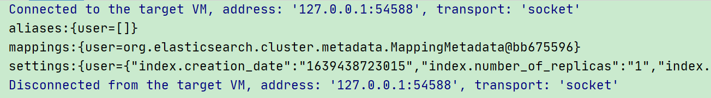
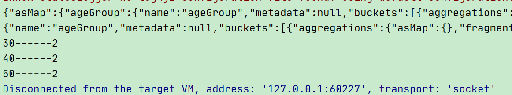

# 四、Java API操作

Elasticsearch软件是由Java语言开发的，所以也可以通过Java API的方式对Elasticsearch服务进行访问


## 1、创建 Maven  项目


在 IDEA 开发工具中创建 Maven 项目(模块也可)ES


+ 修改 pom 文件，增加 Maven 依赖关系


```xml
<dependencies>
    <dependency>
        <groupId>org.elasticsearch</groupId>
        <artifactId>elasticsearch</artifactId>
        <version>7.8.0</version>
    </dependency>
    <!-- elasticsearch 的客户端 -->
    <dependency>
        <groupId>org.elasticsearch.client</groupId>
        <artifactId>elasticsearch-rest-high-level-client</artifactId>
        <version>7.8.0</version>
    </dependency>
    <!-- elasticsearch 依赖 2.x 的 log4j -->
    <dependency>
        <groupId>org.apache.logging.log4j</groupId>
        <artifactId>log4j-api</artifactId>
        <version>2.8.2</version>
    </dependency>
    <dependency>
        <groupId>org.apache.logging.log4j</groupId>
        <artifactId>log4j-core</artifactId>
        <version>2.8.2</version>
    </dependency>
    <dependency>
        <groupId>com.fasterxml.jackson.core</groupId>
        <artifactId>jackson-databind</artifactId>
        <version>2.9.9</version>
    </dependency>
    <!-- junit 单元测试 -->
    <dependency>
        <groupId>junit</groupId>
        <artifactId>junit</artifactId>
        <version>4.12</version>
    </dependency>
</dependencies>
```


## 2、客户端对象


因为早期版本的客户端对象已经不再推荐使用，且在未来版本中会被删除，所以这里我们采用高级 REST 客户端对象


```java
public static void main(String[] args) throws IOException {
    //创建ES客户端
    RestHighLevelClient esClient = new RestHighLevelClient(
            RestClient.builder(new HttpHost("localhost", 9200, "http"))
    );


    //关闭ES客户端
    esClient.close();

}
```


注意：<font style="color:#E8323C;">9200 端口为 Elasticsearch 的 Web 通信端口</font> ，localhost 为启动 ES 服务的主机名


执行代码，查看控制台信息：


## 3、索引操作


ES 服务器正常启动后，可以通过 Java API 客户端对象对 ES 索引进行操作


### 3.1、创建索引


```java
public static void main(String[] args) throws IOException {

    RestHighLevelClient esClient = new RestHighLevelClient(
            RestClient.builder(new HttpHost("localhost", 9200, "http"))
    );

    //创建索引 - 请求对象
    CreateIndexRequest request = new CreateIndexRequest("user");
    //发送请求，获取响应
    CreateIndexResponse response = esClient.indices().create(request, RequestOptions.DEFAULT);
    //响应状态
    boolean acknowledged = response.isAcknowledged();
    System.out.println("索引操作：" + acknowledged);


    esClient.close();
}
```


### 3.2、查看索引


```java
public static void main(String[] args) throws IOException {

    RestHighLevelClient esClient = new RestHighLevelClient(
            RestClient.builder(new HttpHost("localhost", 9200, "http"))
    );

    //查询索引 - 请求对象
    GetIndexRequest request = new GetIndexRequest("user");
    //发送请求，获取响应
    GetIndexResponse response = esClient.indices().get(request, RequestOptions.DEFAULT);

    System.out.println("aliases:" + response.getAliases());
    System.out.println("mappings:" + response.getMappings());
    System.out.println("settings:" + response.getSettings());

    esClient.close();
}
```





### 3.3、删除索引


```java
public static void main(String[] args) throws IOException {

    RestHighLevelClient esClient = new RestHighLevelClient(
            RestClient.builder(new HttpHost("localhost", 9200, "http"))
    );

    //删除索引 - 请求对象
    DeleteIndexRequest request = new DeleteIndexRequest("user");
    //发送请求，获取响应
    AcknowledgedResponse response = esClient.indices().delete(request, RequestOptions.DEFAULT);
    //响应状态
    System.out.println("操作结果：" + response.isAcknowledged());

    esClient.close();
}
```


## 4、文档操作


### 4.1、新增文档


创建数据模型


```java
public class User {

    private String name;
    private Integer age;
    private String sex;


    public String getName() {
        return name;
    }

    public void setName(String name) {
        this.name = name;
    }

    public Integer getAge() {
        return age;
    }

    public void setAge(Integer age) {
        this.age = age;
    }

    public String getSex() {
        return sex;
    }

    public void setSex(String sex) {
        this.sex = sex;
    }
}
```


创建数据，添加到文档中


```java
public static void main(String[] args) throws IOException {

    RestHighLevelClient esClient = new RestHighLevelClient(
            RestClient.builder(new HttpHost("localhost", 9200, "http"))
    );

    //新增文档 - 请求对象
    IndexRequest request = new IndexRequest();
    //设置索引及唯一性标识
    request.index("user").id("1001");

    //创建数据对象
    User user = new User();
    user.setName("zhangsan");
    user.setAge(30);
    user.setSex("男");
    //向ES插入数据，必须将数据转换为JSON格式
    ObjectMapper mapper = new ObjectMapper();
    String userJson = mapper.writeValueAsString(user);
    request.source(userJson, XContentType.JSON);

    //客户端发送请求，获取响应对象
    IndexResponse response = esClient.index(request, RequestOptions.DEFAULT);

    System.out.println("_index:" + response.getIndex());
    System.out.println("_id:" + response.getId());
    System.out.println("_result:" + response.getResult());


    esClient.close();
}
```


### 4.2、修改文档


```java
public static void main(String[] args) throws IOException {

    RestHighLevelClient esClient = new RestHighLevelClient(
            RestClient.builder(new HttpHost("localhost", 9200, "http"))
    );

    //修改文档 - 请求对象
    UpdateRequest request = new UpdateRequest();
    //设置索引及唯一性标识
    request.index("user").id("1001");
    //设置请求体，对数据进行修改
    request.doc(XContentType.JSON, "sex", "女");

    //客户端发送请求，获取响应对象
    UpdateResponse response = esClient.update(request, RequestOptions.DEFAULT);

    System.out.println("_index:" + response.getIndex());
    System.out.println("_id:" + response.getId());
    System.out.println("_result:" + response.getResult());


    esClient.close();
}
```


### 4.3、查询文档


```java
public static void main(String[] args) throws IOException {

    RestHighLevelClient esClient = new RestHighLevelClient(
            RestClient.builder(new HttpHost("localhost", 9200, "http"))
    );

    //查询文档 - 请求对象
    GetRequest request = new GetRequest();
    //设置索引及唯一性标识
    request.index("user").id("1001");

    //客户端发送请求，获取响应对象
    GetResponse response = esClient.get(request, RequestOptions.DEFAULT);

    System.out.println("_index:" + response.getIndex());
    System.out.println("_type:" + response.getType());
    System.out.println("_id:" + response.getId());
    System.out.println("resource:" + response.getSourceAsString());


    esClient.close();
}
```


### 4.4、删除文档


```java
public static void main(String[] args) throws IOException {

    RestHighLevelClient esClient = new RestHighLevelClient(
            RestClient.builder(new HttpHost("localhost", 9200, "http"))
    );

    //查询文档 - 请求对象
    DeleteRequest request = new DeleteRequest();
    //设置索引及唯一性标识
    request.index("user").id("1001");

    //客户端发送请求，获取响应对象
    DeleteResponse response = esClient.delete(request, RequestOptions.DEFAULT);

    System.out.println(response.toString());

    esClient.close();
}
```


### 4.5、批量新增


```java
public static void main(String[] args) throws IOException {

    RestHighLevelClient esClient = new RestHighLevelClient(
            RestClient.builder(new HttpHost("localhost", 9200, "http"))
    );

    //创建批量新增请求对象
    BulkRequest request = new BulkRequest();

    request.add(new IndexRequest().index("user").id("1001").source(XContentType.JSON, "name", "zhangsan"));
    request.add(new IndexRequest().index("user").id("1002").source(XContentType.JSON, "name", "lisi"));
    request.add(new IndexRequest().index("user").id("1003").source(XContentType.JSON, "name", "wangwu"));

    //客户端发送请求，获取响应对象
    BulkResponse responses = esClient.bulk(request, RequestOptions.DEFAULT);

    //打印结果信息
    System.out.println("took:" + responses.getTook());
    System.out.println("items:" + responses.getItems());

    esClient.close();
}
```


### 4.6、批量删除


```java
public static void main(String[] args) throws IOException {

    RestHighLevelClient esClient = new RestHighLevelClient(
            RestClient.builder(new HttpHost("localhost", 9200, "http"))
    );

    //创建批量删除请求对象
    BulkRequest request = new BulkRequest();

    request.add(new DeleteRequest().index("user").id("1001"));
    request.add(new DeleteRequest().index("user").id("1002"));
    request.add(new DeleteRequest().index("user").id("1003"));

    //客户端发送请求，获取响应对象
    BulkResponse responses = esClient.bulk(request, RequestOptions.DEFAULT);

    //打印结果信息
    System.out.println("took:" + responses.getTook());
    System.out.println("items:" + responses.getItems());

    esClient.close();
}
```


## 5、高级查询


### 5.1、请求体查询


#### 查询所有索引数据


```java
public static void main(String[] args) throws IOException {

    RestHighLevelClient esClient = new RestHighLevelClient(
            RestClient.builder(new HttpHost("localhost", 9200, "http"))
    );

    // 创建搜索请求对象
    SearchRequest request = new SearchRequest();
    request.indices("user");

    // 构建查询的请求体
    SearchSourceBuilder searchSourceBuilder = new SearchSourceBuilder();
    // 查询所有数据
    searchSourceBuilder.query(QueryBuilders.matchAllQuery());
    request.source(searchSourceBuilder);

    //客户端发送请求，获取响应对象
    SearchResponse response = esClient.search(request, RequestOptions.DEFAULT);

    // 查询匹配
    System.out.println("took:" + response.getTook());
    System.out.println("timeout:" + response.isTimedOut());
    SearchHits hits = response.getHits();
    System.out.println("total:" + hits.getTotalHits());
    System.out.println("MaxScore:" + hits.getMaxScore());
    for (SearchHit hit : hits) {
        //输出每条查询的结果信息
        System.out.println(hit.getSourceAsString());
    }


    esClient.close();
}
```


#### term查询，查询条件为关键字


```java
public static void main(String[] args) throws IOException {

    RestHighLevelClient esClient = new RestHighLevelClient(
            RestClient.builder(new HttpHost("localhost", 9200, "http"))
    );

    // 创建搜索请求对象
    SearchRequest request = new SearchRequest();
    request.indices("user");

    // 构建查询的请求体
    SearchSourceBuilder searchSourceBuilder = new SearchSourceBuilder();
    // 条件查询 termQuery
    searchSourceBuilder.query(QueryBuilders.termQuery("age",30));
    request.source(searchSourceBuilder);

    //客户端发送请求，获取响应对象
    SearchResponse response = esClient.search(request, RequestOptions.DEFAULT);

    // 查询匹配
    System.out.println("took:" + response.getTook());
    System.out.println("timeout:" + response.isTimedOut());
    SearchHits hits = response.getHits();
    System.out.println("total:" + hits.getTotalHits());
    System.out.println("MaxScore:" + hits.getMaxScore());
    for (SearchHit hit : hits) {
        //输出每条查询的结果信息
        System.out.println(hit.getSourceAsString());
    }


    esClient.close();
}
```


#### 分页查询


```java
public static void main(String[] args) throws IOException {

    RestHighLevelClient esClient = new RestHighLevelClient(
            RestClient.builder(new HttpHost("localhost", 9200, "http"))
    );

    // 创建搜索请求对象
    SearchRequest request = new SearchRequest();
    request.indices("user");

    // 构建查询的请求体
    SearchSourceBuilder searchSourceBuilder = new SearchSourceBuilder();
    // 分页查询
    searchSourceBuilder.query(QueryBuilders.matchAllQuery());
    // (当前页码-1)*每页显示数据条数
    searchSourceBuilder.from(4);//第三页
    searchSourceBuilder.size(2);
    request.source(searchSourceBuilder);

    //客户端发送请求，获取响应对象
    SearchResponse response = esClient.search(request, RequestOptions.DEFAULT);

    // 查询匹配
    System.out.println("took:" + response.getTook());
    System.out.println("timeout:" + response.isTimedOut());
    SearchHits hits = response.getHits();
    System.out.println("total:" + hits.getTotalHits());
    System.out.println("MaxScore:" + hits.getMaxScore());
    for (SearchHit hit : hits) {
        //输出每条查询的结果信息
        System.out.println(hit.getSourceAsString());
    }


    esClient.close();
}
```


#### 数据排序


```java
public static void main(String[] args) throws IOException {

    RestHighLevelClient esClient = new RestHighLevelClient(
            RestClient.builder(new HttpHost("localhost", 9200, "http"))
    );

    // 创建搜索请求对象
    SearchRequest request = new SearchRequest();
    request.indices("user");

    // 构建查询的请求体
    SearchSourceBuilder searchSourceBuilder = new SearchSourceBuilder();
    searchSourceBuilder.query(QueryBuilders.matchAllQuery());
    // 排序
    searchSourceBuilder.sort("age", SortOrder.DESC);
    request.source(searchSourceBuilder);

    //客户端发送请求，获取响应对象
    SearchResponse response = esClient.search(request, RequestOptions.DEFAULT);

    // 查询匹配
    System.out.println("took:" + response.getTook());
    System.out.println("timeout:" + response.isTimedOut());
    SearchHits hits = response.getHits();
    System.out.println("total:" + hits.getTotalHits());
    System.out.println("MaxScore:" + hits.getMaxScore());
    for (SearchHit hit : hits) {
        //输出每条查询的结果信息
        System.out.println(hit.getSourceAsString());
    }


    esClient.close();
}
```


#### 过滤字段


```java
public static void main(String[] args) throws IOException {

    RestHighLevelClient esClient = new RestHighLevelClient(
            RestClient.builder(new HttpHost("localhost", 9200, "http"))
    );

    // 创建搜索请求对象
    SearchRequest request = new SearchRequest();
    request.indices("user");

    // 构建查询的请求体
    SearchSourceBuilder searchSourceBuilder = new SearchSourceBuilder();
    searchSourceBuilder.query(QueryBuilders.matchAllQuery());
    // 查询字段过滤
    String excludes[] = {};
    String includes[] = {"name"};
    searchSourceBuilder.fetchSource(includes, excludes);
    request.source(searchSourceBuilder);

    //客户端发送请求，获取响应对象
    SearchResponse response = esClient.search(request, RequestOptions.DEFAULT);

    // 查询匹配
    System.out.println("took:" + response.getTook());
    System.out.println("timeout:" + response.isTimedOut());
    SearchHits hits = response.getHits();
    System.out.println("total:" + hits.getTotalHits());
    System.out.println("MaxScore:" + hits.getMaxScore());
    for (SearchHit hit : hits) {
        //输出每条查询的结果信息
        System.out.println(hit.getSourceAsString());
    }


    esClient.close();
}
```


#### Bool查询


```java
public static void main(String[] args) throws IOException {

    RestHighLevelClient esClient = new RestHighLevelClient(
            RestClient.builder(new HttpHost("localhost", 9200, "http"))
    );

    // 创建搜索请求对象
    SearchRequest request = new SearchRequest();
    request.indices("user");

    // 构建查询的请求体
    SearchSourceBuilder searchSourceBuilder = new SearchSourceBuilder();

    BoolQueryBuilder boolQueryBuilder = QueryBuilders.boolQuery();
    // 必须包含
    boolQueryBuilder.must(QueryBuilders.matchQuery("age", "30"));
    // 一定不含
    boolQueryBuilder.mustNot(QueryBuilders.matchQuery("name", "zhangsan"));
    // 可能包含
    boolQueryBuilder.should(QueryBuilders.matchQuery("sex", "男"));

    searchSourceBuilder.query(boolQueryBuilder);
    request.source(searchSourceBuilder);

    //客户端发送请求，获取响应对象
    SearchResponse response = esClient.search(request, RequestOptions.DEFAULT);

    // 查询匹配
    System.out.println("took:" + response.getTook());
    System.out.println("timeout:" + response.isTimedOut());
    SearchHits hits = response.getHits();
    System.out.println("total:" + hits.getTotalHits());
    System.out.println("MaxScore:" + hits.getMaxScore());
    for (SearchHit hit : hits) {
        //输出每条查询的结果信息
        System.out.println(hit.getSourceAsString());
    }


    esClient.close();
}
```


#### 范围查询


```java
public static void main(String[] args) throws IOException {

    RestHighLevelClient esClient = new RestHighLevelClient(
            RestClient.builder(new HttpHost("localhost", 9200, "http"))
    );

    // 创建搜索请求对象
    SearchRequest request = new SearchRequest();
    request.indices("user");

    // 构建查询的请求体
    SearchSourceBuilder searchSourceBuilder = new SearchSourceBuilder();

    RangeQueryBuilder rangeQuery = QueryBuilders.rangeQuery("age");
    // 大于等于
    rangeQuery.gte("30");
    // 小于等于
    rangeQuery.lte("40");

    searchSourceBuilder.query(rangeQuery);
    request.source(searchSourceBuilder);

    //客户端发送请求，获取响应对象
    SearchResponse response = esClient.search(request, RequestOptions.DEFAULT);

    // 查询匹配
    System.out.println("took:" + response.getTook());
    System.out.println("timeout:" + response.isTimedOut());
    SearchHits hits = response.getHits();
    System.out.println("total:" + hits.getTotalHits());
    System.out.println("MaxScore:" + hits.getMaxScore());
    for (SearchHit hit : hits) {
        //输出每条查询的结果信息
        System.out.println(hit.getSourceAsString());
    }


    esClient.close();
}
```


#### 模糊查询


```java
public static void main(String[] args) throws IOException {

    RestHighLevelClient esClient = new RestHighLevelClient(
            RestClient.builder(new HttpHost("localhost", 9200, "http"))
    );

    // 创建搜索请求对象
    SearchRequest request = new SearchRequest();
    request.indices("user");

    // 构建查询的请求体
    SearchSourceBuilder searchSourceBuilder = new SearchSourceBuilder();

    FuzzyQueryBuilder fuzziness = QueryBuilders.fuzzyQuery("name", "wangwu").fuzziness(Fuzziness.ONE);

    searchSourceBuilder.query(fuzziness);
    request.source(searchSourceBuilder);

    //客户端发送请求，获取响应对象
    SearchResponse response = esClient.search(request, RequestOptions.DEFAULT);

    // 查询匹配
    System.out.println("took:" + response.getTook());
    System.out.println("timeout:" + response.isTimedOut());
    SearchHits hits = response.getHits();
    System.out.println("total:" + hits.getTotalHits());
    System.out.println("MaxScore:" + hits.getMaxScore());
    for (SearchHit hit : hits) {
        //输出每条查询的结果信息
        System.out.println(hit.getSourceAsString());
    }


    esClient.close();
}
```


### 5.2、高亮查询


```java
public static void main(String[] args) throws IOException {

    RestHighLevelClient esClient = new RestHighLevelClient(
            RestClient.builder(new HttpHost("localhost", 9200, "http"))
    );

    // 创建搜索请求对象
    SearchRequest request = new SearchRequest();
    request.indices("user");

    // 构建查询的请求体
    SearchSourceBuilder searchSourceBuilder = new SearchSourceBuilder();

    //构建查询方式：高亮查询
    TermQueryBuilder termQueryBuilder = QueryBuilders.termQuery("name", "zhangsan");
    //设置查询方式
    searchSourceBuilder.query(termQueryBuilder);

    //构建高亮字段
    HighlightBuilder highlightBuilder = new HighlightBuilder();
    highlightBuilder.preTags("<font color='red'>");
    highlightBuilder.postTags("</font>");
    highlightBuilder.field("name");
    //设置高亮对象
    searchSourceBuilder.highlighter(highlightBuilder);

    //设置请求体
    request.source(searchSourceBuilder);

    //客户端发送请求，获取响应对象
    SearchResponse response = esClient.search(request, RequestOptions.DEFAULT);

    // 查询匹配
    System.out.println("took:" + response.getTook());
    System.out.println("timeout:" + response.isTimedOut());
    SearchHits hits = response.getHits();
    System.out.println("total:" + hits.getTotalHits());
    System.out.println("MaxScore:" + hits.getMaxScore());
    for (SearchHit hit : hits) {
        //输出每条查询的结果信息
        System.out.println(hit.getSourceAsString());
        //打印高亮结果
        Map<String, HighlightField> highlightFields = hit.getHighlightFields();
        System.out.println(highlightFields);
    }


    esClient.close();
}
```


### 5.3、聚合查询


#### 最大


```java
public static void main(String[] args) throws IOException {

    RestHighLevelClient esClient = new RestHighLevelClient(
        RestClient.builder(new HttpHost("localhost", 9200, "http"))
    );

    // 创建搜索请求对象
    SearchRequest request = new SearchRequest();
    request.indices("user");

    // 构建查询的请求体
    SearchSourceBuilder searchSourceBuilder = new SearchSourceBuilder();

    //设置查询方式
    AggregationBuilder aggregationBuilder =AggregationBuilders.max("maxAge").field("age");
    searchSourceBuilder.aggregation(aggregationBuilder);

    //设置请求体
    request.source(searchSourceBuilder);

    //客户端发送请求，获取响应对象
    SearchResponse response = esClient.search(request, RequestOptions.DEFAULT);

    // 查询匹配
    ObjectMapper mapper = new ObjectMapper();

    Aggregations aggregations = response.getAggregations();
    System.out.println(mapper.writeValueAsString(aggregations));

    Aggregation maxAge = aggregations.getAsMap().get("maxAge");
    System.out.println(mapper.writeValueAsString(maxAge));

    String valueAsString = ((Max) maxAge).getValueAsString();
    System.out.println(valueAsString);


    esClient.close();
}
```


#### 分组统计


```java
public static void main(String[] args) throws IOException {

    RestHighLevelClient esClient = new RestHighLevelClient(
            RestClient.builder(new HttpHost("localhost", 9200, "http"))
    );

    // 创建搜索请求对象
    SearchRequest request = new SearchRequest();
    request.indices("user");

    // 构建查询的请求体
    SearchSourceBuilder searchSourceBuilder = new SearchSourceBuilder();

    //设置查询方式
    AggregationBuilder aggregationBuilder =AggregationBuilders.terms("ageGroup").field("age");
    searchSourceBuilder.aggregation(aggregationBuilder);

    //设置请求体
    request.source(searchSourceBuilder);

    //客户端发送请求，获取响应对象
    SearchResponse response = esClient.search(request, RequestOptions.DEFAULT);

    // 查询匹配
    ObjectMapper mapper = new ObjectMapper();

    Aggregations aggregations = response.getAggregations();
    System.out.println(mapper.writeValueAsString(aggregations));

    Aggregation ageGroup = aggregations.getAsMap().get("ageGroup");
    System.out.println(mapper.writeValueAsString(ageGroup));
    
    List<? extends Terms.Bucket> buckets = ((Terms) ageGroup).getBuckets();
    for (Terms.Bucket bucket : buckets) {
        //分组的key
        String key = bucket.getKeyAsString();
        //分组的值
        long docCount = bucket.getDocCount();

        System.out.println(key+"------"+docCount);
    }

    esClient.close();
}
```





> 更新: 2023-10-30 12:38:06  
> 原文: <https://www.yuque.com/like321/fk7s34/fz3raq>