# 2_JVM监控及诊断工具-命令行篇


## 2.1. 概述


性能诊断是软件工程师在日常工作中需要经常面对和解决的问题，在用户体验至上的今天，解决好应用的性能问题能带来非常大的收益。


Java 作为最流行的编程语言之一，其应用性能诊断一直受到业界广泛关注。可能造成 Java 应用出现性能问题的因素非常多，例如线程控制、磁盘读写、数据库访问、网络 I/O、垃圾收集等。想要定位这些问题，一款优秀的性能诊断工具必不可少。


<font style="background-color:#FADB14;">体会 1：使用数据说明问题，使用知识分析问题，使用工具处理问题。</font>


<font style="background-color:#FADB14;">体会 2：无监控、不调优！</font>


### 简单命令行工具


在我们刚接触 java 学习的时候，大家肯定最先了解的两个命令就是 javac，java，那么除此之外，还有没有其他的命令可以供我们使用呢？


我们进入到安装 jdk 的 bin 目录，发现还有一系列辅助工具。这些辅助工具用来获取目标 JVM 不同方面、不同层次的信息，帮助开发人员很好地解决 Java 应用程序的一些疑难杂症。


官方源码地址：[http://hg.openjdk.java.net/jdk/jdk11/file/1ddf9a99e4ad/src/jdk.jcmd/share/classes/sun/tools](http://hg.openjdk.java.net/jdk/jdk11/file/1ddf9a99e4ad/src/jdk.jcmd/share/classes/sun/tools)


## 2.2. jps：查看正在运行的 Java 进程


jps（Java Process Status）：显示指定系统内所有的 HotSpot 虚拟机进程（查看虚拟机进程信息），可用于查询正在运行的虚拟机进程。


说明：对于本地虚拟机进程来说，进程的本地虚拟机 ID 与操作系统的进程 ID 是一致的，是唯一的。


### 基本语法


基本使用语法为：

```java
jps [options] [hostid]
```


我们还可以通过追加参数，来打印额外的信息。


#### options 参数


+ -q：仅仅显示 LVMID（local virtual machine id），即本地虚拟机唯一 id。不显示主类的名称等
+ -l：输出应用程序主类的全类名 或 如果进程执行的是 jar 包，则输出 jar 完整路径
+ -m：输出虚拟机进程启动时传递给主类 main()的参数
+ -v：列出虚拟机进程启动时的 JVM 参数。比如：-Xms20m -Xmx50m 是启动程序指定的 jvm 参数。


说明：以上参数可以综合使用。


#### 补充：


如果某 Java 进程关闭了默认开启的 UsePerfData 参数（即使用参数-XX:-UsePerfData），那么 jps 命令（以及下面介绍的 jstat）将无法探知该 Java 进程。


#### hostid 参数


RMI 注册表中注册的主机名。

如果想要远程监控主机上的 java 程序，需要安装 jstatd。


对于具有更严格的安全实践的网络场所而言，可能使用一个自定义的策略文件来显示对特定的可信主机或网络的访问，尽管**这种技术容易受到 IP 地址欺诈攻击。**


如果安全问题无法使用一个定制的策略文件来处理，那么最安全的操作是不运行 jstatd 服务器，而是在本地使用 jstat 和 jps 工具。


## 2.3. jstat：查看 JVM 统计信息


jstat（JVM Statistics Monitoring Tool）：用于监视虚拟机各种运行状态信息的命令行工具。它可以显示本地或者远程虚拟机进程中的类装载、内存、垃圾收集、JIT 编译等运行数据。


在没有 GUI 图形界面，只提供了纯文本控制台环境的服务器上，它将是运行期定位虚拟机性能问题的首选工具。常用于检测垃圾回收问题以及内存泄漏问题。


官方文档：[https://docs.oracle.com/javase/8/docs/technotes/tools/unix/jstat.html](https://docs.oracle.com/javase/8/docs/technotes/tools/unix/jstat.html)


### 基本语法


基本使用语法为：

```java
jstat -<option> [-t] [-h<lines>] <vmid> [<interval> [<count>]]
```


查看命令相关参数：jstat -h 或 jstat -help


其中 vmid 是进程 id 号，也就是 jps 之后看到的前面的号码，如下：


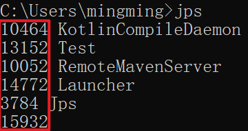


#### option 参数


选项 option 可以由以下值构成。


类装载相关的：


+ -class：显示 ClassLoader 的相关信息：类的装载、卸载数量、总空间、类装载所消耗的时间等


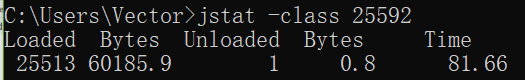


垃圾回收相关的：


+ -gc：显示与 GC 相关的堆信息。包括 Eden 区、两个 Survivor 区、老年代、永久代等的容量、已用空间、GC 时间合计等信息。

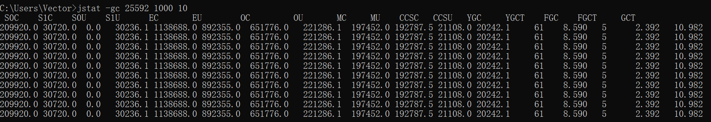


+ -gccapacity：显示内容与-gc 基本相同，但输出主要关注 Java 堆各个区域使用到的最大、最小空间。

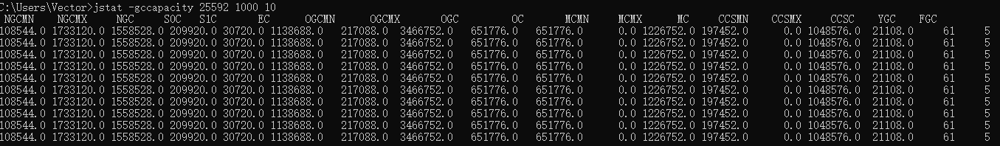


+ -gcutil：显示内容与-gc 基本相同，但输出主要关注已使用空间占总空间的百分比。

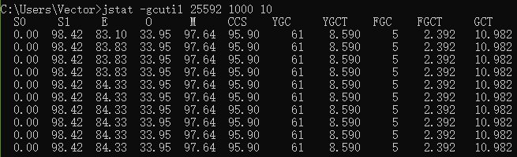


+ -gccause：与-gcutil 功能一样，但是会额外输出导致最后一次或当前正在发生的 GC 产生的原因。


+ -gcnew：显示新生代 GC 状况

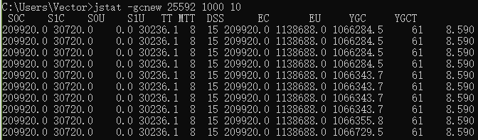


+ -gcnewcapacity：显示内容与-gcnew 基本相同，输出主要关注使用到的最大、最小空间

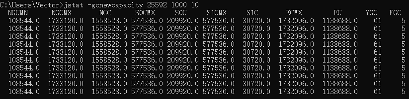


+ -geold：显示老年代 GC 状况


+ -gcoldcapacity：显示内容与-gcold 基本相同，输出主要关注使用到的最大、最小空间

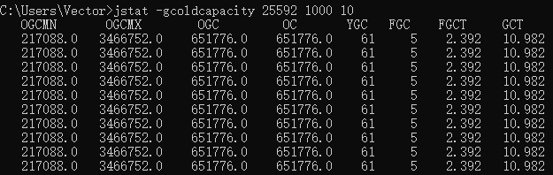


+ -gcpermcapacity：显示永久代使用到的最大、最小空间。


JIT 相关的：


+  -compiler：显示 JIT 编译器编译过的方法、耗时等信息 

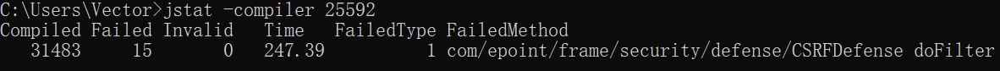

+  -printcompilation：输出已经被 JIT 编译的方法 


#### interval 参数：


用于指定输出统计数据的周期，单位为毫秒。即：查询间隔


#### count 参数： 


用于指定查询的总次数


#### -t 参数： 


可以在输出信息前加上一个 Timestamp 列，显示程序的运行时间。单位：秒

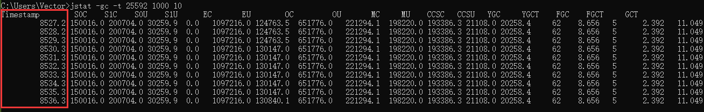


我们可以比较 Java 进程的启动时间以及总GC时间（GCT 列），或者两次测量的间隔时间

以及总GC时间的增量，来得出GC时间占运行时间的比例。


如果该比例超过20%， 则说明目前堆的压力较大；如果该比例超过90%， 则说明堆里几乎没有

可用空间，随时都可能抛出OOM异常。


#### -h 参数： 


可以在周期性数据输出时，输出多少行数据后输出一个表头信息

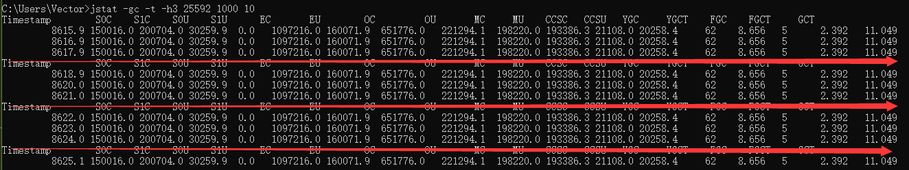


| 表头 | 含义（字节） |
| :--- | :--- |
| EC | Eden 区的大小 |
| EU | Eden 区已使用的大小 |
| S0C | 幸存者 0 区的大小 |
| S1C | 幸存者 1 区的大小 |
| S0U | 幸存者 0 区已使用的大小 |
| S1U | 幸存者 1 区已使用的大小 |
| MC | 元空间的大小 |
| MU | 元空间已使用的大小 |
| OC | 老年代的大小 |
| OU | 老年代已使用的大小 |
| CCSC | 压缩类空间的大小 |
| CCSU | 压缩类空间已使用的大小 |
| YGC | 从应用程序启动到采样时 young gc 的次数 |
| YGCT | 从应用程序启动到采样时 young gc 消耗时间（秒） |
| FGC | 从应用程序启动到采样时 full gc 的次数 |
| FGCT | 从应用程序启动到采样时的 full gc 的消耗时间（秒） |
| GCT | 从应用程序启动到采样时 gc 的总时间 |


#### 补充：


jstat 还可以用来判断是否出现内存泄漏。


第 1 步：在长时间运行的 Java 程序中，我们可以运行 jstat 命令连续获取多行性能数据，并取这几行数据中 OU 列（即已占用的老年代内存）的最小值。


第 2 步：然后，我们每隔一段较长的时间重复一次上述操作，来获得多组 OU 最小值。如果这些值呈上涨趋势，则说明该 Java 程序的老年代内存已使用量在不断上涨，这意味着无法回收的对象在不断增加，因此很有可能存在内存泄漏。


## 2.4. jinfo：实时查看和修改 JVM 配置参数


jinfo（Configuration Info for Java）：查看虚拟机配置参数信息，也可用于调整虚拟机的配置参数。


在很多情况下，Java 应用程序不会指定所有的 Java 虚拟机参数。而此时，开发人员可能不知道某一个具体的 Java 虚拟机参数的默认值。在这种情况下，可能需要通过查找文档获取某个参数的默认值。这个查找过程可能是非常艰难的。但有了 jinfo 工具，开发人员可以很方便地找到 Java 虚拟机参数的当前值。


### 基本语法


基本使用语法为：

```java
jinfo [options] pid
```


说明：java 进程 ID 必须要加上

| 选项 | 选项说明 |
| --- | --- |
| no option | 输出全部的参数和系统属性 |
| -flag name | 输出对应名称的参数 |
| -flag [+-]name | 开启或者关闭对应名称的参数 只有被标记为 manageable 的参数才可以被动态修改 |
| -flag name=value | 设定对应名称的参数 |
| -flags | 输出全部的参数 |
| -sysprops | 输出系统属性 |


#### 查看
****

**jinfo -sysprops PID	可以查看由System.getProperties()取得的参数**


```properties
> jinfo -sysprops
jboss.modules.system.pkgs = com.intellij.rt
java.vendor = Oracle Corporation
sun.java.launcher = SUN_STANDARD
sun.management.compiler = HotSpot 64-Bit Tiered Compilers
catalina.useNaming = true
os.name = Windows 10
...
```


**jinfo -flags PID		查看曾经赋过值的一些参数 **


```shell
> jinfo -flags 25592
Non-default VM flags: -XX:CICompilerCount=4 -XX:InitialHeapSize=333447168 -XX:MaxHeapSize=5324668928 -XX:MaxNewSize=1774714880 -XX:MinHeapDeltaBytes=524288 -XX:NewSize=111149056 -XX:OldSize=222298112 -XX:+UseCompressedClassPointers -XX:+UseCompressedOops -XX:+UseFastUnorderedTimeStamps -XX:-UseLargePagesIndividualAllocation -XX:+UseParallelGC
Command line:  -agentlib:jdwp=transport=dt_socket,address=127.0.0.1:8040,suspend=y,server=n -Drebel.base=C:\Users\Vector\.jrebel -Drebel.env.ide.plugin.version=2021.1.2 -Drebel.env.ide.version=2020.3.3 -Drebel.env.ide.product=IU -Drebel.env.ide=intellij -Drebel.notification.url=http://localhost:7976 -agentpath:C:\Users\Vector\AppData\Roaming\JetBrains\IntelliJIdea2020.3\plugins\jr-ide-idea\lib\jrebel6\lib\jrebel64.dll -Dmaven.home=D:\eclipse\env\maven -Didea.modules.paths.file=C:\Users\Vector\AppData\Local\JetBrains\IntelliJIdea2020.3\Maven\idea-projects-state-596682c7.properties -Dclassworlds.conf=C:\Users\Vector\AppData\Local\Temp\idea-6755-mvn.conf -Dmaven.ext.class.path=D:\IDEA\plugins\maven\lib\maven-event-listener.jar -javaagent:D:\IDEA\plugins\java\lib\rt\debugger-agent.jar -Dfile.encoding=UTF-8
```


**jinfo -flag 具体参数 PID	查看某个Java进程的具体参数的值**


```shell
> jinfo -flag UseParallelGC 25592
-XX:+UseParallelGC

> jinfo -flag UseG1GC 25592
-XX:-UseG1GC
```


#### 修改
****

jinfo不仅可以查看运行时某一个Java虚拟机参数的实际取值，甚至可以在运行时修改部分参数，并使之立即生效: 


但是，并非所有参数都支持动态修改。参数只有被标记为manageable的flag可以被实时修改。其实，这个修改能力是极其有限的。


可以查看被标记为manageable的参数

```java
java -XX:+PrintFlagsFinal -version | grep manageable
```


**针对boolean类型：jinfo -flag [+|-] 具体参数 PID**

```java
> jinfo -flag +PrintGCDetails 25592
> jinfo -flag PrintGCDetails 25592
-XX:+PrintGCDetails

> jinfo -flag -PrintGCDetails 25592
> jinfo -flag PrintGCDetails 25592
-XX:-PrintGCDetails
```


**针对非boolean类型：jinfo -flag 具体参数=具体参数值 PID**


```shell
> jinfo -flag MaxHeapFreeRatio=90 25592

> jinfo -flag MaxHeapFreeRatio 25592
-XX:MaxHeapFreeRatio=90
```


### 拓展：


#### java -XX:+PrintFlagsInitial 查看所有 JVM 参数启动的初始值 
```shell
[Global flags]
     intx ActiveProcessorCount                      = -1                                  {product}
    uintx AdaptiveSizeDecrementScaleFactor          = 4                                   {product}
    uintx AdaptiveSizeMajorGCDecayTimeScale         = 10                                  {product}
    uintx AdaptiveSizePausePolicy                   = 0                                   {product}
...
```

 

####  java -XX:+PrintFlagsFinal 查看所有 JVM 参数的最终值 
```shell
[Global flags]
     intx ActiveProcessorCount                      = -1                                  {product}
...
     intx CICompilerCount                          := 4                                   {product}
    uintx InitialHeapSize                          := 333447168                           {product}
    uintx MaxHeapSize                              := 1029701632                          {product}
    uintx MaxNewSize                               := 1774714880                          {product}
```

 

#### java -XX:+PrintCommandLineFlags 查看哪些已经被用户或者 JVM 设置过的详细的 XX 参数的名称和值 
```shell
-XX:InitialHeapSize=332790016 -XX:MaxHeapSize=5324640256 -XX:+PrintCommandLineFlags -XX:+UseCompressedClassPointers -XX:+UseCompressedOops -XX:-UseLargePagesIndividualAllocation -XX:+UseParallelGC
```

 


## 2.5. jmap：导出内存映像文件&内存使用情况


jmap（JVM Memory Map）：作用一方面是获取 dump 文件（堆转储快照文件，二进制文件），它还可以获取目标 Java 进程的内存相关信息，包括 Java 堆各区域的使用情况、堆中对象的统计信息、类加载信息等。


开发人员可以在控制台中输入命令“jmap -help”查阅 jmap 工具的具体使用方式和一些标准选项配置。


官方帮助文档：[https://docs.oracle.com/en/java/javase/11/tools/jmap.html](https://docs.oracle.com/en/java/javase/11/tools/jmap.html)


### 基本语法


基本使用语法为：


+ jmap [option] <pid>
+ jmap [option] <executable <core>
+ jmap [option] [server_id@] <remote server IP or hostname>

| 选项 | 作用 |
| --- | --- |
| -dump | 生成 Java 堆转储快照： dump 文件，   特别的：-dump:live 只保存堆中的存活对象 |
| -heap | 输出整个堆空间的详细信息，包括 GC 的使用、堆配置信息，以及内存的使用信息等 |
| -histo | 输出堆空间中对象的统计信息，包括类、实例数量和合计容量，   特别的：-histo:live 只统计堆中的存活对象 |
| -permstat | 以 ClassLoader 为统计口径输出永久代的内存状态信息，   仅 linux/solaris 平台有效 |
| -finalizerinfo | 显示在 F-Queue 中等待 Finalizer 线程执行 finalize 方法的对象，   仅 linux/solaris 平台有效 |
| -F | 当虚拟机进程对-dump 选项没有任何响应时，可使用此选项强制执行生成 dump 文件，   仅 linux/solaris 平台有效 |
| -h | -help | jmap工具使用的帮助命令 |
| -J <flag> | 传递参数给 jmap 启动的 jvm |


说明：这些参数和 linux 下输入显示的命令多少会有不同，包括也受 jdk 版本的影响。


### 使用1：导出内存映像文件


一般来说，使用jmap指令生成dump文件的操作算得上是最常用的jmap命令之一，将堆中所有存活对象导出至一个文件之中。


Heap Dump又叫做堆存储文件，指一个Java进程在某个时间点的内存快照。Heap Dump在触发内存快照的时候会保存此刻的信息如下:


+ All Objects

Class, fields, primitive values and references

+ All Classes

ClassLoader, name, super class,static fields

+ Garbage Collection Roots

Objects defined to be reachable by the JVM

+ Thread Stacks and Local Variables

The call-stacks of threads at the moment of the snapshot，and per-frame  information about local objects


说明:

1. 通常在写Heap Dump文件前会触发一次Full GC， 所以heap dump文件里保存的都是FullGC后留下的对象信息。
2. 由于生成dump文件比较耗时，因此大家需要耐心等待，尤其是大内存镜像生成dump文件则需要耗费更长的时间来完成。


**手动的方式**

```java
> jmap -dump:format=b,file=<filename.hprof> <pid>
```

```java
> jmap -dump:live,format=b,file=<filename.hprof> <pid>
```

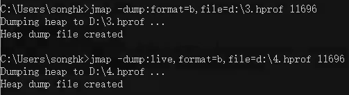

由于 jmap 将访问堆中的所有对象，为了保证在此过程中不被应用线程干扰，jmap 需要借助安全点机制，让所有线程停留在不改变堆中数据的状态。也就是说，由 jmap 导出的堆快照必定是安全点位置的。这可能导致基于该堆快照的分析结果存在偏差。


举个例子，假设在编译生成的机器码中，某些对象的生命周期在两个安全点之间，那么:live 选项将无法探知到这些对象。


另外，如果某个线程长时间无法跑到安全点，jmap 将一直等下去。与前面讲的 jstat 则不同，垃圾回收器会主动将 jstat 所需要的摘要数据保存至固定位置之中，而 jstat 只需直接读取即可。


**自动的方式**


当程序发生OOM退出系统时，一些瞬时信息都随着程序的终止而消失，而重现OOM问题往往比较困难或者耗时。此时若能在OOM时，自动导出dump文件就显得非常迫切。


这里介绍一种比较常用的取得堆快照文件的方法，即使用:

-XX:+HeapDumpOnOutOfMemoryError：在程序发生OOM时，导出应用程序的当前堆快照。

-XX:HeapDumpPath:可以指定堆快照的保存位置。


比如:

-Xmx100m -XX:+HeapDumpOnOutOfMemoryError -XX:HeapDumpPath=D:\m.hprof


```shell
-XX:+HeapDumpOnOutOfMemoryError
```

```java
-XX:HeapDumpPath=<filename.hprof>
```


### 使用2：显示堆内存相关信息


jmap -heap pid


-jmap -histo pid


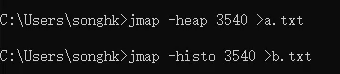


### 使用3：其它作用


jmap -permstat pid 	查看系统的ClassLoader信息


jmap -finalizerinfo		查看堆积在finalizer队列中的对象


### 小结


由于jmap将访问堆中的所有对象，为了保证在此过程中不被应用线程干扰，jmap需要借助安全点机制，让所有线程停留在不改变堆中数据的状态。也就是说，由jmap 导出的堆快照必定是安全点位置的。这可能导致基于该堆快照的分析结果存在偏差。


举个例子，假设在编译生成的机器码中，某些对象的生命周期在两个安全点之间，那么: live选项将无法探知到这些对象。


另外，如果某个线程长时间无法跑到安全点，jmap将一直等下去。与前面讲的jstat则不同，垃圾回收器会主动将jstat所需要的摘要数据保存至固定位置之中，而jstat只需直接读取即可。


## 2.6. jhat：JDK 自带堆分析工具


jhat（JVM Heap Analysis Tool）：


Sun JDK 提供的 jhat 命令与 jmap 命令搭配使用，用于分析 jmap 生成的 heap dump 文件（堆转储快照）。jhat 内置了一个微型的 HTTP/HTML 服务器，生成 dump 文件的分析结果后，用户可以在浏览器中查看分析结果（分析虚拟机转储快照信息）。


使用了 jhat 命令，就启动了一个 http 服务，端口是 7000，即 http://localhost:7000/，就可以在浏览器里分析。


说明：jhat 命令在 JDK9、JDK10 中已经被删除，官方建议用 VisualVM 代替。


### 基本语法


基本使用语法：jhat <option> <dumpfile>

| option 参数 | 作用 |
| :--- | :--- |
| -stack false ｜ true | 关闭｜打开对象分配调用栈跟踪 |
| -refs false ｜ true | 关闭｜打开对象引用跟踪 |
| -port port-number | 设置 jhat HTTP Server 的端口号，默认 7000 |
| -exclude exclude-file | 执行对象查询时需要排除的数据成员 |
| -baseline exclude-file | 指定一个基准堆转储 |
| -debug int | 设置 debug 级别 |
| -version | 启动后显示版本信息就退出 |
| -J <flag> | 传入启动参数，比如-J -Xmx512m |


## 2.7. jstack：打印 JVM 中线程快照


jstack（JVM Stack Trace）：用于生成虚拟机指定进程当前时刻的线程快照（虚拟机堆栈跟踪）。线程快照就是当前虚拟机内指定进程的每一条线程正在执行的方法堆栈的集合。


生成线程快照的作用：可用于定位线程出现长时间停顿的原因，如线程间死锁、死循环、请求外部资源导致的长时间等待等问题。这些都是导致线程长时间停顿的常见原因。当线程出现停顿时，就可以用 jstack 显示各个线程调用的堆栈情况。


官方帮助文档：[https://docs.oracle.com/en/java/javase/11/tools/jstack.html](https://docs.oracle.com/en/java/javase/11/tools/jstack.html)


在 thread dump 中，要留意下面几种状态


+ 死锁，Deadlock（重点关注）
+ 等待资源，Waiting on condition（重点关注）
+ 等待获取监视器，Waiting on monitor entry（重点关注）
+ 阻塞，Blocked（重点关注）
+ 执行中，Runnable
+ 暂停，Suspended
+ 对象等待中，Object.wait() 或 TIMED_WAITING
+ 停止，Parked


### 基本语法
```java
jstack option pid
```


| option 参数 | 作用 |
| --- | --- |
| -F | 当正常输出的请求不被响应时，强制输出线程堆栈 |
| -l | 除堆栈外，显示关于锁的附加信息 |
| -m | 如果调用本地方法的话，可以显示 C/C++的堆栈 |
| -h | 帮助操作 |


jstack管理远程进程的话，需要在远程程序的启动参数中增加：

-Djava.rmi.server.hostname=...

-Dcom.sun.management.jmxremote

-Dcom.sun.management.jmxremote.port=8888

-Dcom.sun.management.jmxremote.authenticate=false

-Dcom.sun.management.jmxremote.ssl=false


## 2.8. jcmd：多功能命令行


在 JDK 1.7 以后，新增了一个命令行工具 jcmd。

它是一个多功能的工具，可以用来实现前面除了 jstat 之外所有命令的功能。比如：用它来导出堆、内存使用、查看 Java 进程、导出线程信息、执行 GC、JVM 运行时间等。


官方帮助文档：[https://docs.oracle.com/en/java/javase/11/tools/jcmd.html](https://docs.oracle.com/en/java/javase/11/tools/jcmd.html)


jcmd 拥有 jmap 的大部分功能，并且在 Oracle 的官方网站上也推荐使用 jcmd 命令代 jmap 命令


### jcmd -l：


列出所有的 JVM 进程


### jcmd 进程号 help：


针对指定的进程，列出支持的所有具体命令

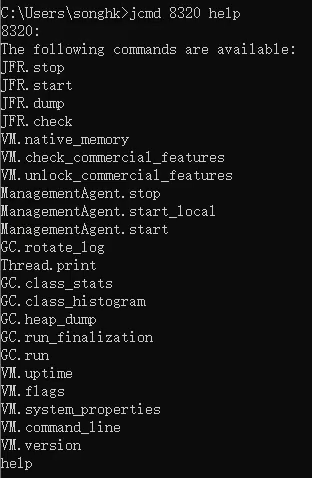

### jcmd 进程号 具体命令：


显示指定进程的指令命令的数据


+ Thread.print 			可以替换 jstack 指令
+ GC.class_histogram 	可以替换 jmap 中的-histo 操作
+ GC.heap_dump 		可以替换 jmap 中的-dump 操作
+ GC.run 				可以查看 GC 的执行情况
+ VM.uptime 			可以查看程序的总执行时间，可以替换 jstat 指令中的-t 操作
+ VM.system_properties 	可以替换 jinfo -sysprops 进程 id
+ VM.flags 				可以获取 JVM 的配置参数信息


## 2.9. jstatd：远程主机信息收集


之前的指令只涉及到监控本机的 Java 应用程序，而在这些工具中，一些监控工具也支持对远程计算机的监控（如 jps、jstat）。为了启用远程监控，则需要配合使用 jstatd 工具。


命令 jstatd 是一个 RMI 服务端程序，它的作用相当于代理服务器，建立本地计算机与远程监控工具的通信。jstatd 服务器将本机的 Java 应用程序信息传递到远程计算机。


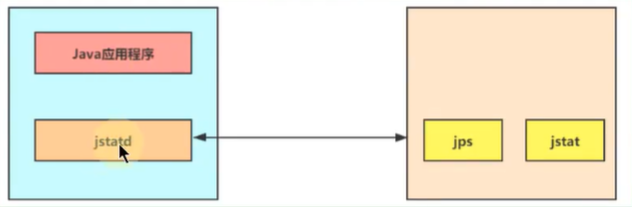


> 更新: 2023-10-09 16:40:17  
> 原文: <https://www.yuque.com/like321/uuypvk/ulcngz>