# 3_JVM监控及诊断工具-GUI篇

## 3.1. 工具概述


使用上一章命令行工具或组合能帮您获取目标 Java 应用性能相关的基础信息，但它们存在下列局限：


1. 无法获取方法级别的分析数据，如方法间的调用关系、各方法的调用次数和调用时间等（这对定位应用性能瓶颈至关重要）。
2. 要求用户登录到目标 Java 应用所在的宿主机上，使用起来不是很方便。
3. 分析数据通过终端输出，结果展示不够直观。


为此，JDK 提供了一些内存泄漏的分析工具，如 jconsole，jvisualvm 等，用于辅助开发人员定位问题，但是这些工具很多时候并不足以满足快速定位的需求。所以这里我们介绍的工具相对多一些、丰富一些。


### JDK 自带的工具


+ ** jconsole**：JDK 自带的可视化监控工具。查看 Java 应用程序的运行概况、监控堆信息、永久区（或元空间）使用情况、类加载情况等 
    - 位置：jdk\bin\jconsole.exe
+  **Visual VM**：Visual VM 是一个工具，它提供了一个可视界面，用于查看 Java 虚拟机上运行的基于 Java 技术的应用程序的详细信息。 
    - 位置：jdk\bin\jvisualvm.exe
+  **JMC**：Java Mission Control，内置 Java Flight Recorder。能够以极低的性能开销收集 Java 虚拟机的性能数据。 


### 第三方工具


+  **MAT**：MAT（Memory Analyzer Tool）是基于 Eclipse 的内存分析工具，是一个快速、功能丰富的 Java heap 分析工具，它可以帮助我们查找内存泄漏和减少内存消耗 
    - Eclipse的插件形式
+  **JProfiler**：商业软件，需要付费。功能强大。 
    - 与 VisualVM类似
+ **Arthas**：Alibaba开源的Java诊断工具。深受开发者喜爱。
+ **Btrace**：Java运行时追踪工具。可以在不停机的情况下，跟踪指定的方法调用、构造函数调用和系统内存等信息。


## 3.2. JConsole


jconsole：从 Java5 开始，在 JDK 中自带的 java 监控和管理控制台。


用于对 JVM 中内存、线程和类等的监控，是一个基于 JMX（java management extensions）的 GUI 性能监控工具。


官方教程：[https://docs.oracle.com/javase/7/docs/technotes/guides/management/jconsole.html](https://docs.oracle.com/javase/7/docs/technotes/guides/management/jconsole.html)


### 启动


jdk/bin目录下，启动jconsole.exe命令即可


不需要使用jps命令来查询


### 三种连接方式


**Local**


使用JConsole连接一个正在本地系统运行的JVM，并且执行程序的和运行JConsole的需要是同一个用户。JConsole使用文件系统的授权通过RMI连接器连接到平台的MBean服务器上。

这种从本地连接的监控能力只有Sun的JDK具有。


**Remote**


使用下面的URL通过RMI连接器连接到一个JMX代理，servce:jm:p:///jndi/rmi://hostName:portNum/jmxrmi。


JConsole为建立连接，需要在环境变量中设置mx.remote.credentials来指定用户名和密码，从而进行授权。


**Advanced**

****

使用一个特殊的URL连接JMX代理。一般情况使用自己定制的连接器而不是RMI提供的连接器来连接JMX代理，或者是一一个使用JDK1.4的实现了JMX和JMX Rmote的应用。


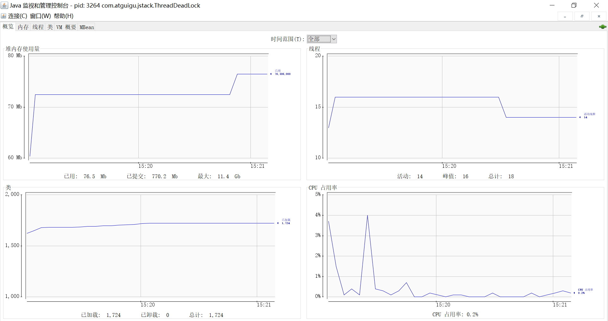


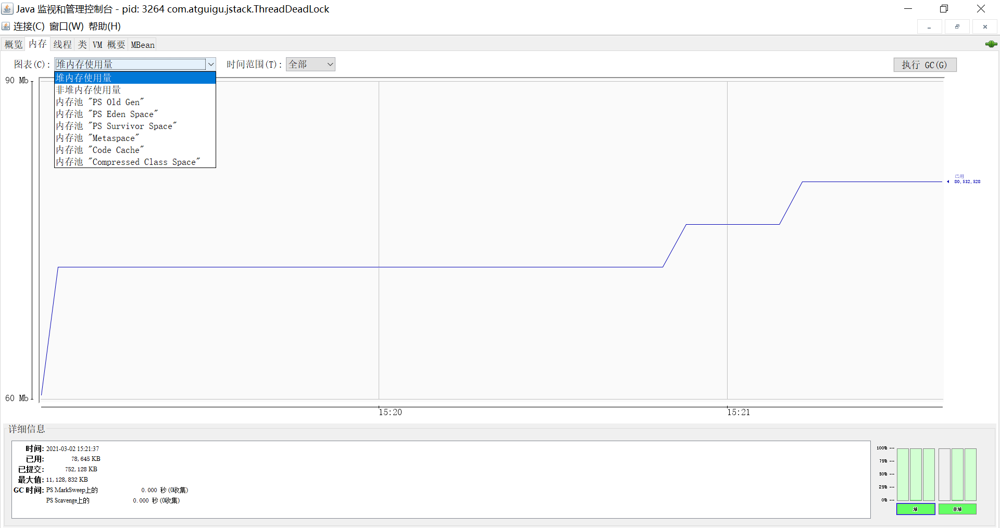


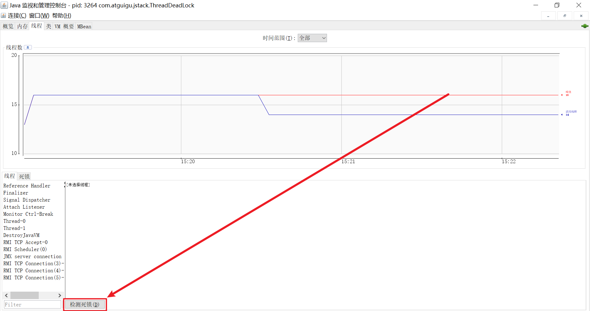


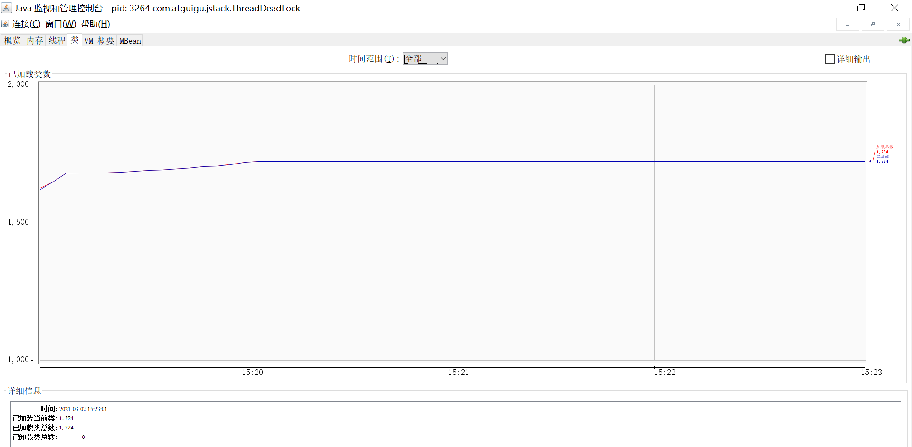


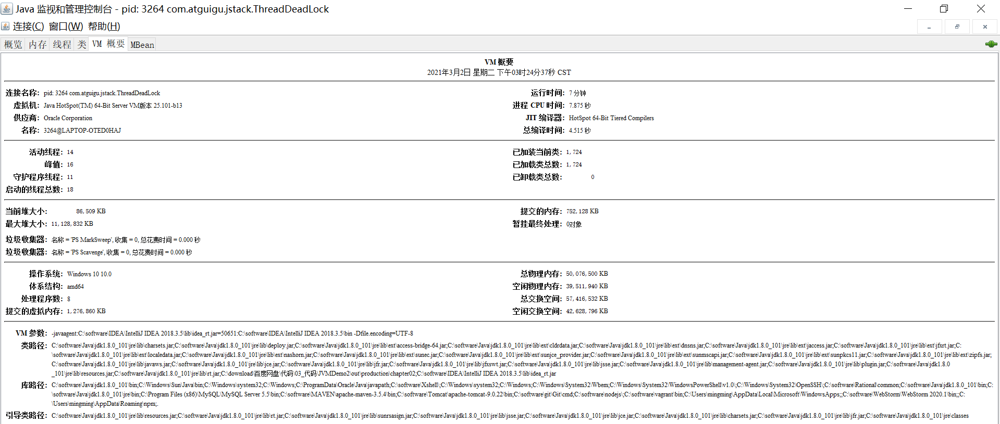


## 3.3. Visual VM ***


Visual VM 是一个功能强大的多合一故障诊断和性能监控的可视化工具。


它集成了多个 JDK 命令行工具，使用 Visual VM 可用于显示虚拟机进程及进程的配置和环境信息（jps，jinfo），监视应用程序的 CPU、GC、堆、方法区及线程的信息（jstat、jstack）等，甚至代替 JConsole。


在 JDK 6 Update 7 以后，Visual VM 便作为 JDK 的一部分发布（VisualVM 在 JDK／bin 目录下），即：它完全免费。


此外，Visual VM也可以作为独立的软件安装：


首页：[https://visualvm.github.io/index.html](https://visualvm.github.io/index.html)


### 插件的安装


Visual VM的一大特点是支持插件扩展，并且插件安装非常方便。我们既可以通过离线下载插件文件* .nbm，然后在Plugin对话框的已下载页面下，添加已下载的插件。也可以在可用插件页面下，在线安装插件。**(这里建议安装 上：VisualGC)**


插件地址：[https://visualvm.github.io/pluginscenters.html](https://visualvm.github.io/pluginscenters.html)


2. IDEA安装VisualVM Launcher插件


Preferences --> Plugins --> 搜索VisualVM Launcher，安装重启即可。


①在IDEA中 安装插件:


### 连接方式


**本地连接**


监控本地Java进程的CPU、类、线程等


**远程连接**


1-确定远程服务器的ip地址

2-添加JMX（通过JMX技术具体监控远端服务器哪个Java进程）

3-修改bin/catalina.sh文件，连接远程的tomcat

4-在../conf中添加jmxremote.access和jmxremote.password文件

5-将服务器地址改为公网ip地址

6-设置阿里云安全策略和防火墙策略

7-启动tomcat，查看tomcat启动日志和端口监听

8-JMX中输入端口号、用户名、密码登录


### 主要功能


1. 生成/读取堆内存/线程快照
2. 查看 JVM 参数和系统属性
3. 查看运行中的虚拟机进程
4. 生成/读取线程快照
5. 程序资源的实时监控
6. 其他功能
    1. JMX 代理连接、
    2. 远程环境监控、
    3. CPU 分析和内存分析

[  
  
  
](https://visualvm.github.io/index.html)


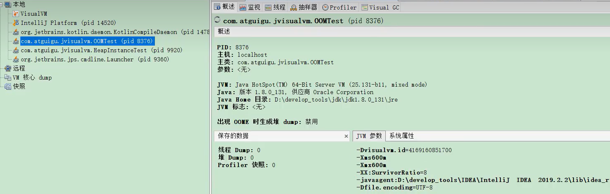


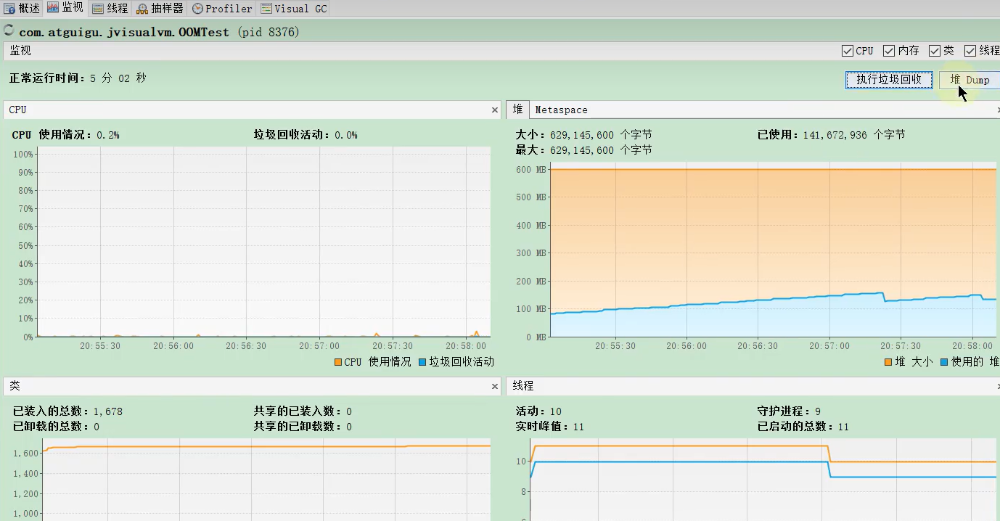


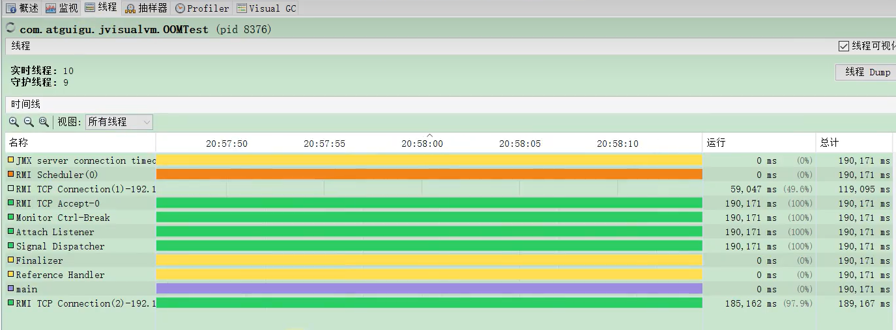


## 3.4. Eclipse MAT  **


MAT（Memory Analyzer Tool）工具是一款功能强大的 Java 堆内存分析器。可以用于查找内存泄漏以及查看内存消耗情况。


MAT 是基于 Eclipse 开发的，不仅可以单独使用，还可以作为插件的形式嵌入在 Eclipse 中使用。是一款免费的性能分析工具，使用起来非常方便。

大家可以在[https://www.eclipse.org/mat/downloads.php](https://www.eclipse.org/mat/downloads.php)下载并使用MAT。

[  
  
  
](https://www.eclipse.org/mat/downloads.php)

### 获取堆dump文件


**dump文件内容**


MAT 可以分析 heap dump 文件。在进行内存分析时，只要获得了反映当前设备内存映像的 hprof 文件，通过 MAT 打开就可以直观地看到当前的内存信息。


一般说来，这些内存信息包含：

+ 所有的对象信息，包括对象实例、成员变量、存储于栈中的基本类型值和存储于堆中的其他对象的引用值。
+ 所有的类信息，包括 classloader、类名称、父类、静态变量等
+ GCRoot 到所有的这些对象的引用路径
+ 线程信息，包括线程的调用栈及此线程的线程局部变量（TLS）


**两点说明**


说明1：缺点


MAT 不是一个万能工具，它并不能处理所有类型的堆存储文件。但是比较主流的厂家和格式，例如 Sun，HP，SAP 所采用的 HPROF 二进制堆存储文件，以及 IBM 的 PHD 堆存储文件等都能被很好的解析。


说明2：


最吸引人的还是能够快速为开发人员生成<font style="color:#E8323C;">内存泄漏报表</font>，方便定位问题和分析问题。虽然 MAT 有如此强大的功能，但是内存分析也没有简单到一键完成的程度，很多内存问题还是需要我们从 MAT 展现给我们的信息当中通过经验和直觉来判断才能发现。


**获取dump文件**


方法一：通过前一章介绍的 jmap 工具生成，可以生成任意一个java进程的dump文件;


方法二：通过配置JVM参数生成。

+ 选项"-XX:+HeapDumpOnOutOfMemoryError"或"-XX:+HeapDumpBeforeFullGC"
+ 选项"-XX:HeapDumpPath"所代表的含义就是当程序出现0utofMemory时，将会在相应的目录下生成一份dump文件。如果不指定选项“XX:HeapDumpPath”则在当前目录下生成dump文件。


对比：考虑到生产环境中几乎不可能在线对其进行分析，大都是采用离线分析，因此使用jmap+MAT工具是最常见的组合。


方法三：使用VisualVM可 以导出堆dump文件


方法四：

使用MAT既可以打开一个已有的堆快照，也可以通过MAT直接从活动Java程序中导出堆快照。

该功能将借助jps列出当前正在运行的Java进程，以供选择并获取快照。

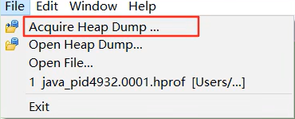


### 分析堆dump文件


#### histogram
****

展示了各个类的实例数目以及这些实例 heap 或 Retainedheap 的总和。


MAT的直方图和jmap的-histo子命令一样，都能够展示各个类的实例数目以及这些实例的Shallow heap总和。但是，MAT的直方图还能够计算Retained heap, 并支持基于实例数目或Retained heap的排序方式（默认为Shallow heap）。


此外，MAT还可以将直方图中的类按照超类、类加载器或者包名分组。


当选中某个类时，MAT界面左上角的Inspector 窗口将展示该类的Class 实例的相关信息，如类加载器等。


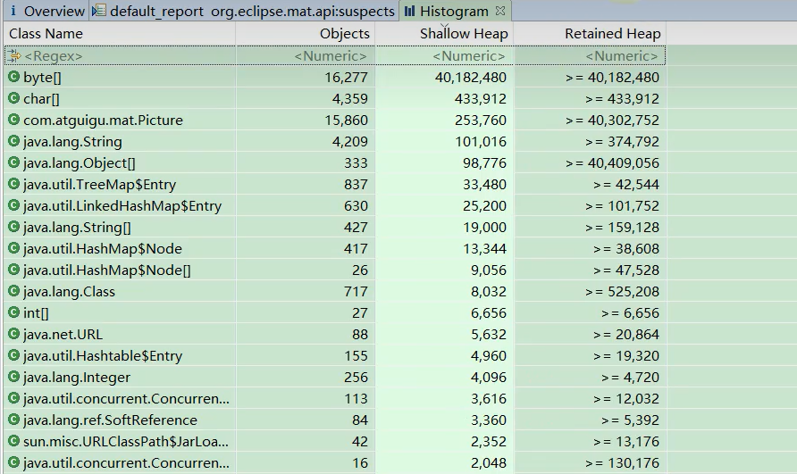


#### thread overview


**查看系统中的Java线程**


**查看局部变量的信息**


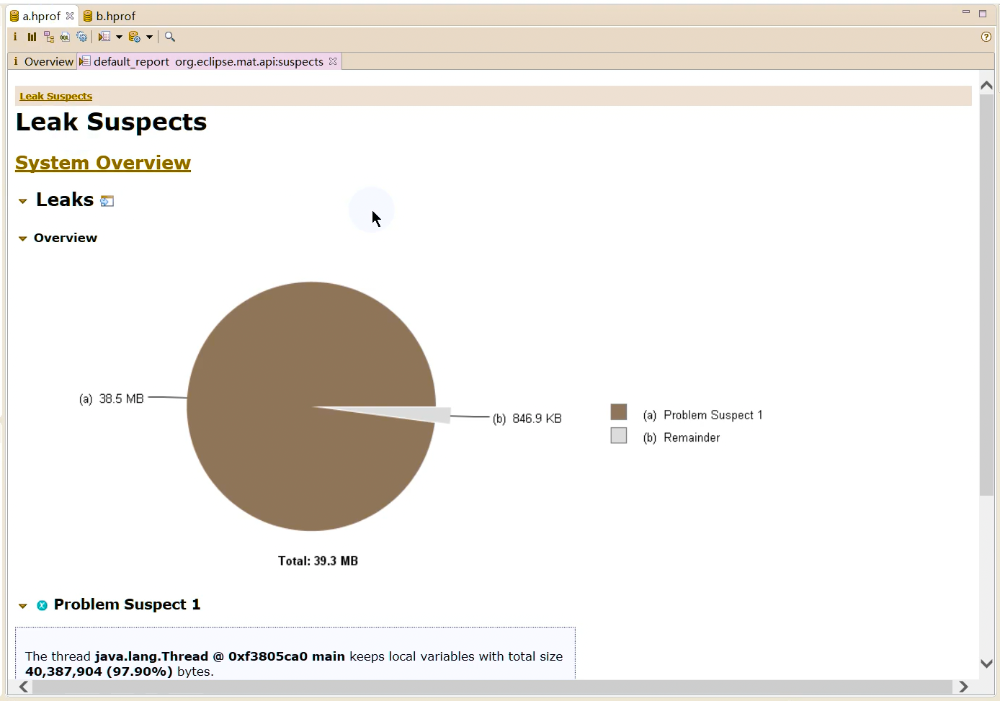


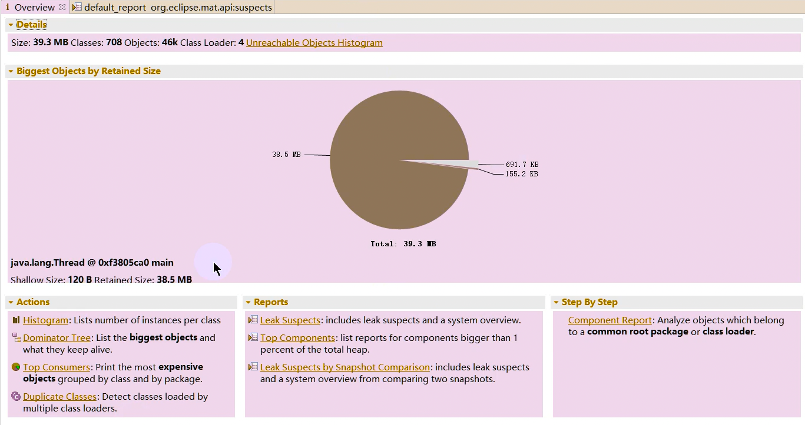


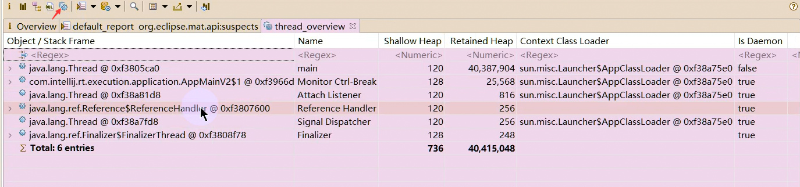


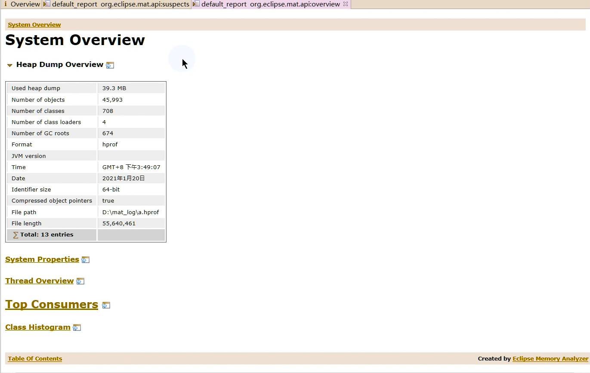

#### 获得对象相互引用的关系
****

**with outgoing references **


**with incoming references**


****


#### 浅堆与深堆
****

**shallow heap**

****

浅堆(Shallow Heap)是指一个对象所消耗的内存。在32位系统中，一个对象引用会占据4个字节，一个int类型会占据4个字节，long型变量会占据8个字节，每个对象头需要占用8个字节。根据堆快照格式不同，对象的大小可能会向8字节进行对齐。


以String为例：2个int值共占8字节，对象引用占用4字节，对象头8字节，合计20字节，向8字节对齐，故占24字节。(jdk7中)

| int | hash32 | 0 |
| --- | --- | --- |
| int | hash | 0 |
| ref | value | C:\Users\Administrat |


这24字节为String对象的浅堆大小。它与String的value实际取值无关，无论字符串长度如何，浅堆大小始终是24字节。


**retained heap**


<font style="background-color:#FADB14;">保留集(Retained Set)：</font>

对象A的保留集指当对象A被垃圾回收后，可以被释放的所有的对象集合(包括对象A本身)，即对象A的保留集可以被认为是<font style="color:#E8323C;">只能通过</font>对象A被直接或间接访问到的所有对象的集合。通俗地说，就是指仅被对象A所持有的对象的集合。


<font style="background-color:#FADB14;">深堆(Retained Heap)：</font>

深堆是指对象的保留集中所有的对象的浅堆大小之和。


注意：浅堆指对象本身占用的内存，不包括其内部引用对象的大小。一个对象的深堆指只能通过该对象访问到的(直接或间接)所有对象的浅堆之和，即对象被回收后，可以释放的真实空间。


**补充：对象实际大小**


另外一个常用的概念是对象的实际大小。这里，对象的实际大小定义为一个对象所能触及的所有对象的浅堆大小之和，也就是通常意义上我们说的对象大小。与深堆相比，似乎这个在日常开发中更为直观和被人接受，<font style="color:#E8323C;">但实际上，这个概念和垃圾回收无关。</font>


下图显示了一个简单的对象引用关系图，对象A引用了C和D，对象B引用了C和E。那么对象A的浅堆大小只是A本身，不含C和D，而A的实际大小为A、C、D三者之和。而A的深堆大小为A与D之和，由于对象C还可以通过对象B访问到，因此不在对象A的深堆范围内。

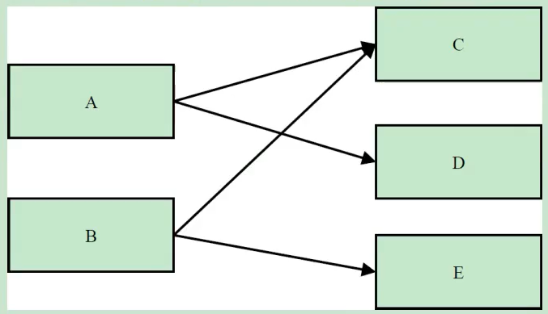


**练习**


看图理解Retained Size


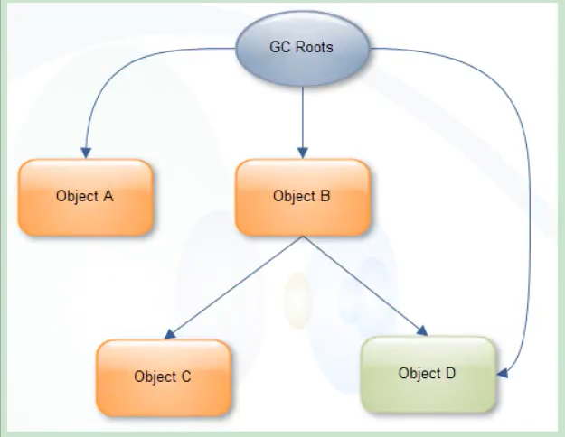

上图中， GC Roots直接引用 了A和B两个对象。


A对象的Retained Size=A对象的Shallow Size

B对象的Retained Size=B对象的Shallow Size + C对象的Shallow Size


**这里不包括D对象，因为D对象被GC Roots 直接引用。**

****

如果GC Roots 不引用D对象呢?


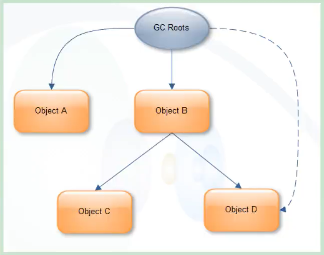


**案例分析：StudentTrace**


****


#### 支配树


支配树(Dominator Tree）

支配树的概念源自图论。


MAT提供了一个称为支配树(Dominator Tree) 的对象图。支配树体现了对象实例间的支配关系。在

对象引用图中，所有指向对象B的路径都经过对象A，则认为<font style="color:#E8323C;">对象A支配对象B</font>。如果对象A是离对象B最近的一个支配对象，则认为对象A为对象B的<font style="color:#E8323C;">直接支配者</font>。支配树是基于对象间的引用图所建立的，它有以下基本性质：


+ 对象A的子树(所有被对象A支配的对象集合)表示对象A的保留集(retained set) ，即深堆。
+ 如果对象A支配对象B，那么对象A的直接支配者也支配对象B。
+ 支配树的边与对象引用图的边不直接对应。


如下图所示：左图表示对象引用图，右图表示左图所对应的支配树。对象A和B由根对象直接支配，由于在到对象C的路径中，可以经过A，也可以经过B，因此对象C的直接支配者也是根对象。对象F与对象D相互引用，因为到对象F的所有路径必然经过对象D，因此，对象D是对象F的直接支配者。而到对象D的所有路径中，必然经过对象C，即使是从对象F到对象D的引用，从根节点出发，也是经过对象C的，所以，对象D的直接支配者为对象C。


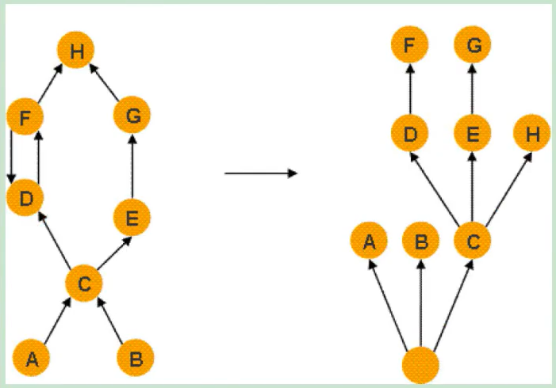


同理，对象E支配对象G。到达对象H的可以通过对象D，也可以通过对象E，因此对象D和E都不能支配对象H，而经过对象C既可以到达D也可以到达E，因此对象C为对象H的直接支配者。


在MAT中，单击工具栏上的对象支配树按钮，可以打开对象支配树视图。


### 案例：Tomcat堆溢出分析


Tomcat是最常用的Java Servlet容器之一，同时也可以当做单独的Web服务器使用。Tomcat本身使

用Java实现，并运行于Java虚拟机之上。在大规模请求时，Tomcat有可能会因为无法承受压力而发生内存溢出错误。这里根据一个被压垮的Tomcat的堆快照文件，来分析Tomcat在崩溃时的内部情况。


图1：

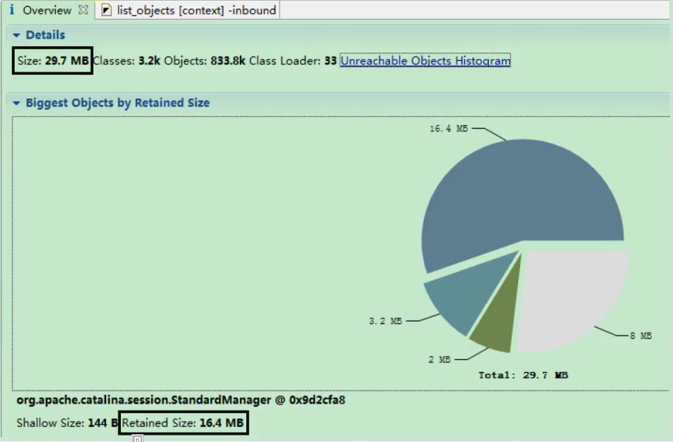

图2：


图3：sessions对象，它占用了约17MB空间

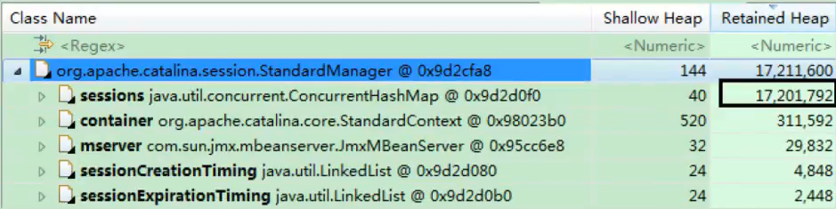

图4：可以看到sessions对象为ConcurrentHashMap，其内部分为16个Segment。从深堆大小看，每个Segment都比较平均，大约为1MB，合计17MB。


图5：


图6：当前堆中含有9941个session，并且每一个session的深堆为1592字节，合计约15MB, 达到当前堆大小的50%。

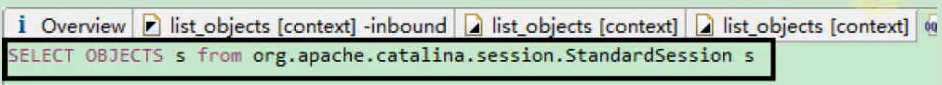

图7：


图8：

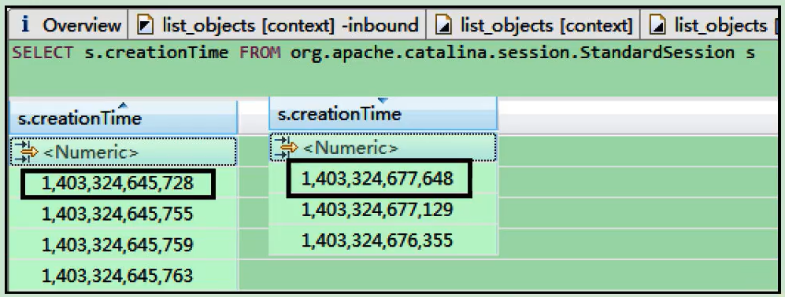

根据当前的session总数，可以计算每秒的平均压力为：9941/(1403324677648-1403324645728)*1000=311次/秒。


由此推断，在发生Tomcat堆溢出时，Tomcat 在连续30秒的时间内，平均每秒接收了约311次不同客户端的请求，创建了合计9941个session.


## 补充1：再谈内存泄漏


### 内存泄漏的理解与分类


<font style="background-color:#FADB14;">何为内存泄漏（memory leak）</font>

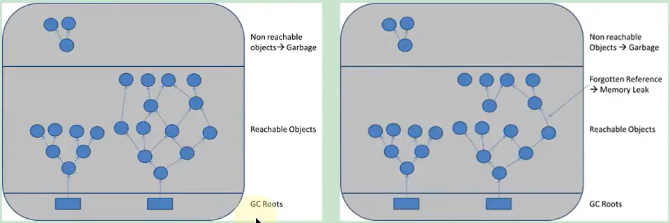

可达性分析算法来判断对象是否是不再使用的对象，本质都是判断一个对象是否还被引用。那么对于这种情况下，由于代码的实现不同就会出现很多种内存泄漏问题（让JVM误以为此对象还在引用中，无法回收，造成内存泄漏）。


+ 是否还被使用？	是
+ 是否还被需要？	否


<font style="background-color:#FADB14;">内存泄漏（memory leak）的理解</font>

<font style="background-color:#FADB14;"></font>

<font style="color:#E8323C;">严格来说</font>，<font style="color:#E8323C;">只有对象不会再被程序用到了，但是GC又不能回收他们的情况，才叫内存泄漏。</font>

但实际情况很多时候一些不太好的实践 (或疏忽)会导致对象的生命周期变得很长甚至导致OOM，也可以叫做<font style="color:#E8323C;">宽泛意义上的“内存泄漏”</font>。

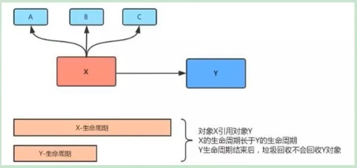

对象X引用对象Y，X的生命周期比Y的生命周期长;

那么当Y生命周期结束的时候，X依然引用着Y，这时候，垃圾回收期是不会回收对象Y的;

如果对象X还引用着生命周期比较短的A、B、C，对象A又引用着对象a、 b、c，这样就可能造成大量无用的对象不能被回收，进而占据了内存资源，造成内存泄漏，直到内存溢出。


<font style="background-color:#FADB14;">内存泄漏与内存溢出的关系：</font>


1. 内存泄漏(memory leak )


申请了内存用完了不释放，比如一共有1024M 的内存，分配了521M 的内存一直不回收，那么可以

用的内存只有521M了，仿佛泄露掉了一部分;


通俗一点讲的话，内存泄漏就是【占着茅坑不拉shi】。


2. 内存溢出(out of memory)


申请内存时，没有足够的内存可以使用;


通俗一点儿讲，一.个厕所就三个坑，有两个站着茅坑不走的(内存泄漏)，剩下最后一个坑，厕所表

示接待压力很大，这时候一下子来了两个人，坑位(内存)就不够了，内存泄漏变成内存溢出了。


可见，内存泄漏和内存溢出的关系:内存泄漏的增多，最终会导致内存溢出。


<font style="background-color:#FADB14;">泄漏的分类</font>

<font style="background-color:#FADB14;"></font>

**经常发生**：发生内存泄露的代码会被多次执行，每次执行，泄露一块内存;

**偶然发生**：在某些特定情况下才会发生;

**一次性**：发生内存泄露的方法只会执行一次;

**隐式泄漏**：一直占着内存不释放， 直到执行结束；严格的说这个不算内存泄漏，因为最终释放掉了，但是如果执行时间特别长，也可能会导致内存耗尽。


### Java中内存泄漏的8种情况


**1-静态集合类**

****

静态集合类，如HashMap、 LinkedList等等。 如果这些容器为静态的，那么它们的生命周期与JVM程序一致，则容器中的对象在程序结束之前将不能被释放，从而造成内存泄漏。简单而言，长生命周期的对象持有短生命周期对象的引用，尽管短生命周期的对象不再使用，但是因为长生命周期对象持有它的引用而导致不能被回收。

```java
public class MemoryLeak {

    static List list = new ArrayList();

    public void oomTests() {
        Object obj = new Object(); //局部变量
        list.add(obj);
    }

}
```


**2-单例模式**

****

单例模式，和静态集合导致内存泄露的原因类似，因为单例的静态特性，它的生命周期和JVM的生命周期一样长，所以如果单例对象如果持有外部对象的引用，那么这个外部对象也不会被回收，那么就会造成内存泄漏。


**3-内部类持有外部类**

****

内部类持有外部类，如果一个外部类的实例对象的方法返回了一个内部类的实例对象。


这个内部类对象被长期引用了，即使那个外部类实例对象不再被使用，但由于内部类持有外部类的实例对象，这个外部类对象将不会被垃圾回收，这也会造成内存泄漏。

****

**4-各种连接，如数据库连接、网络连接和IO连接等**

****

各种连接，如数据库连接、网络连接和IO连接等。


在对数据库进行操作的过程中，首先需要建立与数据库的连接，当不再使用时，需要调用close方法来释放与数据库的连接。只有连接被关闭后，垃圾回收器才会回收对应的对象。


否则，如果在访问数据库的过程中，对Connection、Statement或ResultSet不显性地关闭，将会造

成大量的对象无法被回收，从而引起内存泄漏。

****

```java
public static void main(String[] args) {
    try {
        Connection conn = null;
        Class.forName("com.mysql.jdbc.Driver");
        conn = DriverManager.getConnection("url", "", "");
        Statement stmt = conn.createStatement();
        ResultSet rs = stmt.executeQuery("....");
    } catch (Exception e) { //异常日志
    } finally {
        //1.关闭结果集Statement
        // 2.关闭声明的对象ResultSet
        // 3.关闭连接Connection
    }
}
```

****

**5-变显不合理的作用域**

****

变量不合理的作用域。一般而言，一个变量的定义的作用范围大于其使用范围，很有可能会造成内存泄漏。另一方面，如果没有及时地把对象设置为null，很有可能导致内存泄漏的发生。


```java
public class UsingRandom {

    private String msg;

    public void receiveMsg() {
        //private String msg;
        msg = readFromNet();//从网络中接受数据保存到msg中
        saveDB();//把msg保存到数据库中
    }
}

```

如上面这个伪代码，通过readFromNet方法把接受的消息保存在变量msg中，然后调用saveDB方法把msg的内容保存到数据库中，此时msg已经就没用了，由于msg的生命周期与对象的生命周期相同，此时msg还不能回收，因此造成了内存泄漏。


实际上这个msg变量可以放在receiveMsg方法内部，当方法使用完，那么msg的生命周期也就结束，此时就可以回收了。还有一种方法，在使用完msg后，把msg设置为null，这样垃圾回收器也会回收msg的内存空间。


**6-改变哈希值**

****

改变哈希值，当一个对象被存储进HashSet集合中以后，就不能修改这个对象中的那些参与计算哈希值的字段了。


否则，对象修改后的哈希值与最初存储进HashSet集合中时的哈希值就不同了，在这种情况下，即使在contains方法使用该对象的当前引用作为的参数去HashSet集合中检索对象，也将返回找不到对象的结果，这也会导致无法从HashSet集合中单独删除当前对象，造成内存泄漏。


这也是String 为什么被设置成了不可变类型，我们可以放心地把String 存入HashSet，或者把String当做HashMap的key值;


当我们想把自己定义的类保存到散列表的时候，需要保证对象的 hashCode 不可变。


****

**7-缓存泄漏**

****

内存泄漏的另一个常见来源是缓存，一旦你把对象引用放入到缓存中，他就很容易遗忘。比如：之前项目在一次上线的时候，应用启动奇慢直到夯死，就是因为代码中会加载一个表中的数据到缓存(内存)中，测试环境只有几百条数据，但是生产环境有几百万的数据。


对于这个问题，可以使用WeakHashMap代表缓存，此种Map的特点是，当除了自身有对key的引用外，此key没有其他引用那么此map会自动丢弃此值。


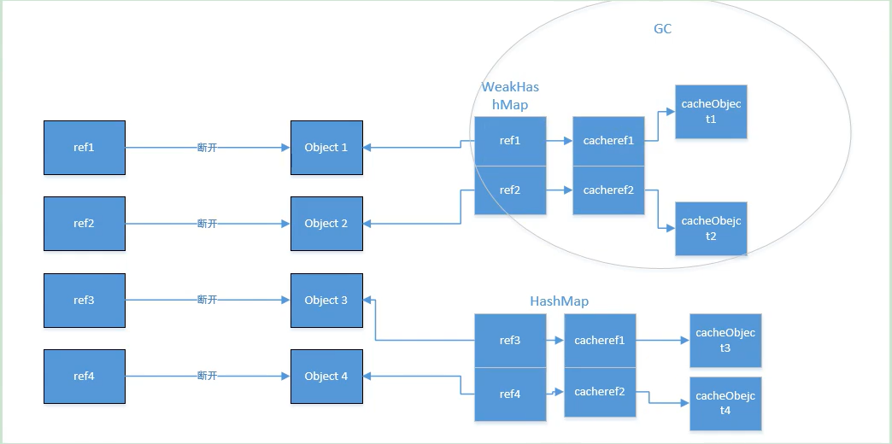

上面代码和图示主演演示WeakHashMap如何自动释放缓存对象，当init函数执行完成后，局部变量字符串引用weakd1,weakd2,d1,d2都会消失，此时只有静态map中保存中对字符串对象的引用，可以看到，调用gc之后，HashMap的没有被回收，而WeakHashMap 里面的缓存被回收了。


**8-监听器和回调**


内存泄漏另一个常见来源是监听器和其他回调，如果客户端在你实现的API中注册回调，却没有显示的取消，那么就会积聚。


需要确保回调立即被当作垃圾回收的最佳方法是只保存它的弱引用，例如将他们保存成为WeakHashMap中的键。


### 内存泄漏案例分析
```java
public class Stack {
    private Object[] elements;
    private int size = 0;
    private static final int DEFAULT_INITIAL_CAPACITY = 16;

    public Stack() {
        elements = new Object[DEFAULT_INITIAL_CAPACITY];
    }

    public void push(Object e) {
        ensureCapacity();
        elements[size++] = e;
    }

    public Object pop() {
        if (size == 0)
            throw new EmptyStackException();
        return elements[--size];
    }

    private void ensureCapacity() {
        if (elements.length == size)
            elements = Arrays.copyOf(elements, 2 * size + 1);
    }

}
```


上述程序并没有明显的错误，但是这段程序有一个内存泄漏，随着GC活动的增加，或者内存占用的不断增加，程序性能的降低就会表现出来，严重时可导致内存泄漏，但是这种失败情况相对较少。


代码的主要问题在pop函数，下面通过这张图示展现


假设这个栈一直增长，增长后如下图所示

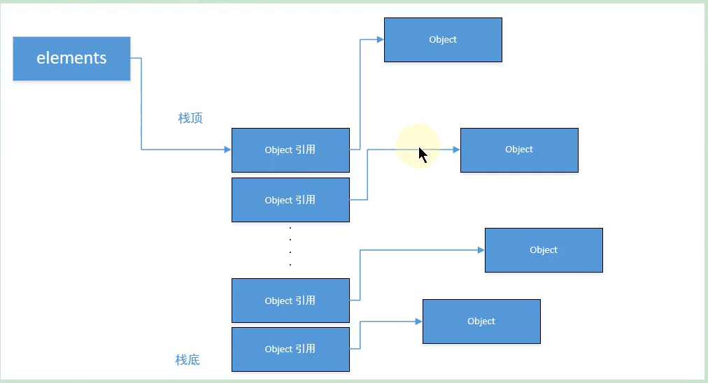

当进行大量的pop操作时，由于引用未进行置空，gc是不会释放的，如下图所示

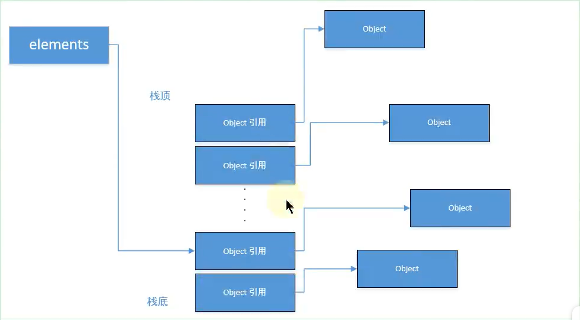

从上图中看以看出，如果栈先增长，在收缩，那么从栈中弹出的对象将不会被当作垃圾回收，即使程序不再使用栈中的这些队象，他们也不会回收，因为栈中仍然保存这对象的引用，俗称<font style="color:#E8323C;">过期引用</font>，这个内存泄露很隐蔽。


解决办法：

```java
public Object pop() {
    if (size == 0)
        throw new EmptyStackException();
    Object element = elements[--size];
    elements[size] = null;
    return element;
}
```

一且引用过期，清空这些引用，将引用置空。

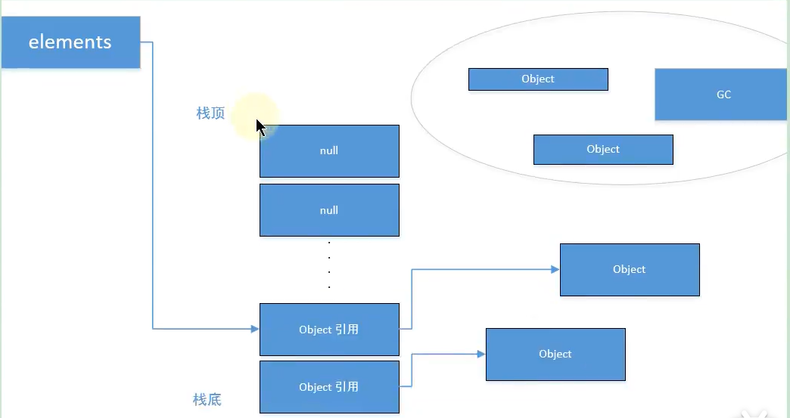

## 补充2：支持使用OQL语言查询对象信息


MAT支持一种类似于SQL 的查询语言OQL (Object Query Language)。OQL使用类SQL语法，可以在堆中进行对象的查找和筛选。


### SELECT子句


在MAT中，Select 子句的格式与SQL基本一致，用于指定要显示的列。Select子句中可以使

用“*”，查看结果对象的引用实例 (相当于outgoing references) 。


SELECT * FROM java.util.Vector v


使用“OBJECTS" 关键字，可以将返回结果集中的项以对象的形式显示。


SELECT objects v.elementData FROM java.util.Vector V

SELECT OBJECTS s.value FROM java.lang.String S


在Select子句中，使用“AS RETAINED SET” 关键字可以得到所得对象的保留集。

SELECT AS RETAINED SET * FROM com.atguigu.mat.Student


“DISTINCT”关键字用于在结果集中去除重复对象。

SELECT DISTINCT OBJECTS classof(s) FROM java.lang.String s


### FROM子句


From子句用于指定查询范围，它可以指定类名、正则表达式或者对象地址。

SELECT * FROM java.lang.String s


下例使用正则表达式，限定搜索范围，输出所有com.atguigu包下所有类的实例

SELECT * FROM  "com\.atguigu\..*"


也可以直接使用类的地址进行搜索。使用类的地址的好处是可以区分被不同ClassLoader加

载的同一种类型。

select * from 0x37a0b4d


### WHERE子句


Where子句用于指定OQL的查询条件。OQL查询将只返回满足Where子句指定条件的对象。

Where子句的格式与传统SQL极为相似。


下例返回长度大于10的char数组。

SELECT * FROM char[] s WHERE s.@length>10


下例返回包含“java”子字符串的所有字符串，使用“LIKE”操作符，“LIKE”操作符的操作参数为正则表达式。

SELECT * FROM java.lang.String S WHERE toString(s) LIKE ". *java.*"


下例返回所有value域不为null的字符串，使用“=”操作符。

SELECT * FROM java.lang.String s where S.value != null


Where子句支持多个条件的AND、OR运算。下例返回数组长度大于15，并且深堆大于1000字

节的所有Vector对象。

SELECT * FROM java.util.Vector v WHERE v.elementData.@length>15 AND V.@retainedHeapSize>1000


### 内置对象与方法


OQL中可以访问堆内对象的属性，也可以访问堆内代理对象的属性。访问堆内对象的属性时，

格式如下:

[ <alias>. ] <field> . <field>. <field>

其中alias为对象名称。


访问java.io.File对象的path属性，并进一步访问path的value属性:

SELECT toString(f.path.value) FROM java.io.File f


下例显示了String对象的内容、objectid和objectAddress。

SELECT s.toString(), s.@objectId, s.@objectAddress FROM java.lang.String s


下例显示java.util.Vector内部数组的长度。

SELECT v.elementData.@length FROM java.util.Vector V


下例显示了所有的java.util.Vector对象及其子类型

select * from INSTANCEOF java.util.Vector


## 3.5. JProfiler  **收费


在运行 Java 的时候有时候想测试运行时占用内存情况，这时候就需要使用测试工具查看了。在 eclipse 里面有 Eclipse Memory Analyzer tool（MAT）插件可以测试，而在 IDEA 中也有这么一个插件，就是 JProfiler。


JProfiler 是由 ej-technologies 公司开发的一款 Java 应用性能诊断工具。功能强大，但是收费。


官网下载地址：[https://www.ej-technologies.com/products/jprofiler/overview.html](https://www.ej-technologies.com/products/jprofiler/overview.html)


**特点：**

+ 使用方便、界面操作友好（简单且强大）
+ 对被分析的应用影响小（提供模板）
+ CPU，Thread，Memory 分析功能尤其强大
+ 支持对 jdbc，noSql，jsp，servlet，socket 等进行分析
+ 支持多种模式（离线，在线）的分析
+ 支持监控本地、远程的 JVM
+ 跨平台，拥有多种操作系统的安装版本


**主要功能：**


+ 方法调用：对方法调用的分析可以帮助您了解应用程序正在做什么，并找到提高其性能的方法
+ 内存分配：通过分析堆上对象、引用链和垃圾收集能帮您修复内存泄露问题，优化内存使用
+ 线程和锁：JProfiler 提供多种针对线程和锁的分析视图助您发现多线程问题
+ 高级子系统：许多性能问题都发生在更高的语义级别上。例如，对于 JDBC 调用，您可能希望找出执行最慢的 SQL 语句。JProfiler 支持对这些子系统进行集成分析


### 安装与配置


**下载与安装**


[https://www.ej-technologies.com/download/jprofiler/version_100](https://www.ej-technologies.com/download/jprofiler/version_100)


**JProfiler中配置IDEA**

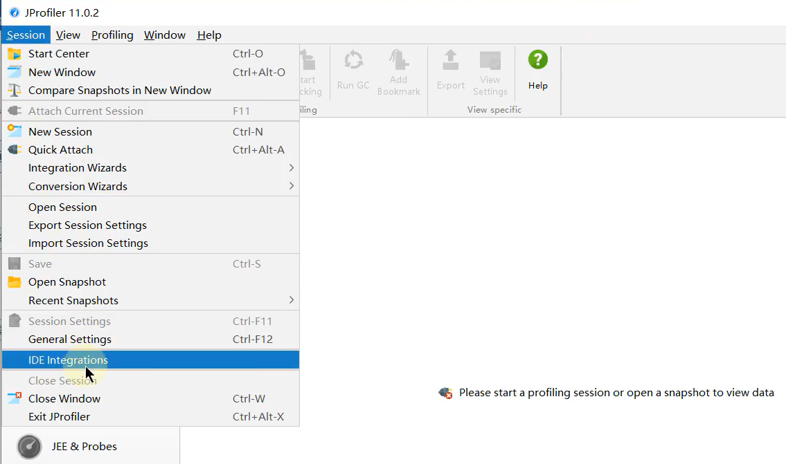

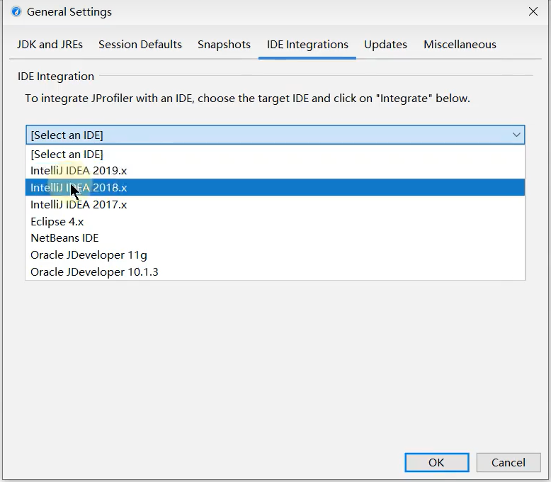

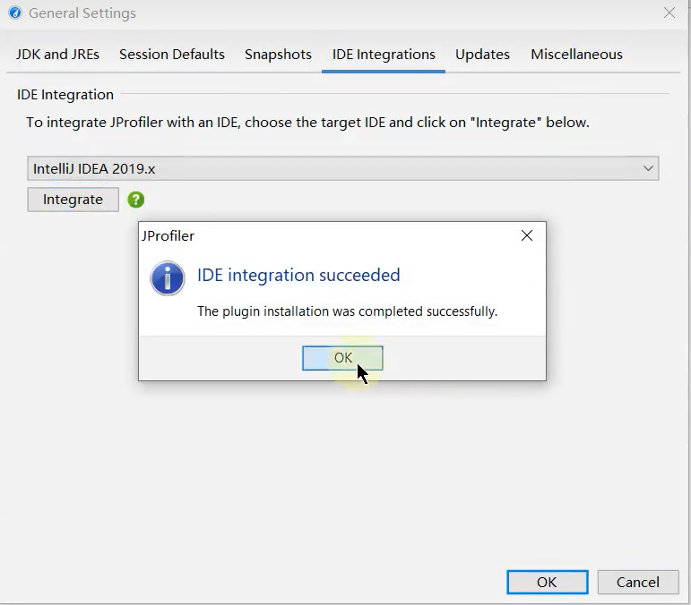


**IDEA集成JProfiler**

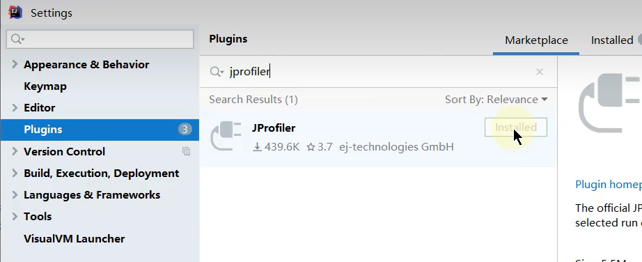

****

### 具体使用


#### 数据采集方式


JProfier 数据采集方式分为两种：Sampling（样本采集）和 Instrumentation（重构模式）


**Instrumentation**：这是 JProfiler 全功能模式。在 class 加载之前，JProfier 把相关功能代码写入到需要分析的 class 的 bytecode 中，对正在运行的 jvm 有一定影响。


+ 优点：功能强大。在此设置中，调用堆栈信息是准确的。
+ 缺点：若要分析的 class 较多，则对应用的性能影响较大，CPU 开销可能很高（取决于 Filter 的控制）。因此使用此模式一般配合 Filter 使用，只对特定的类或包进行分析


**Sampling**：类似于样本统计，每隔一定时间（5ms）将每个线程栈中方法栈中的信息统计出来。


+ 优点：对 CPU 的开销非常低，对应用影响小（即使你不配置任何 Filter）
+ 缺点：一些数据／特性不能提供（例如：方法的调用次数、执行时间）


注：JProfiler 本身没有指出数据的采集类型，这里的采集类型是针对方法调用的采集类型。因为 JProfiler 的绝大多数核心功能都依赖方法调用采集的数据，所以可以直接认为是 JProfiler 的数据采集类型。


#### 遥感监测 Telemetries


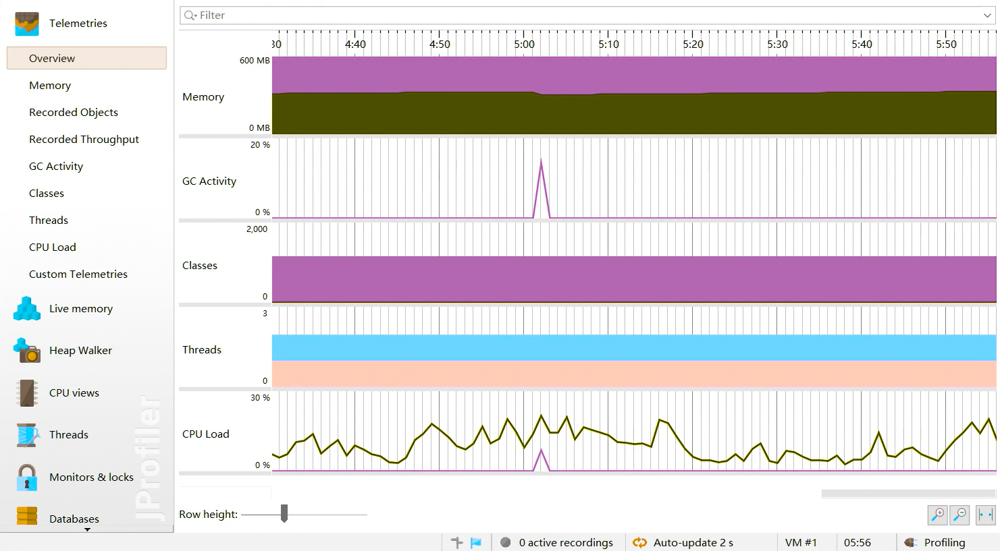


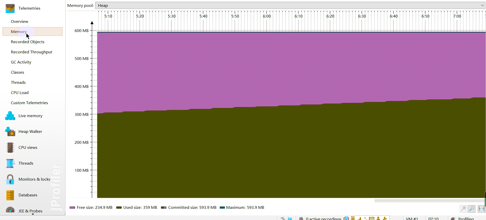


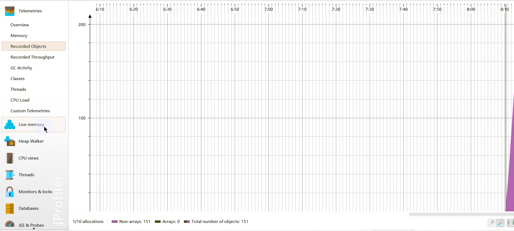


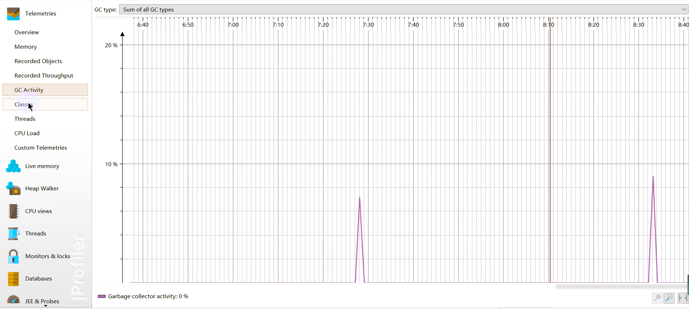


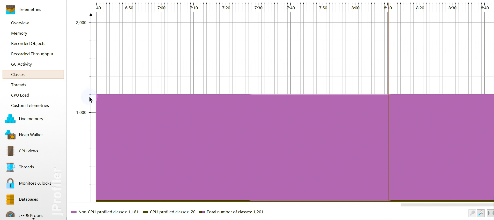


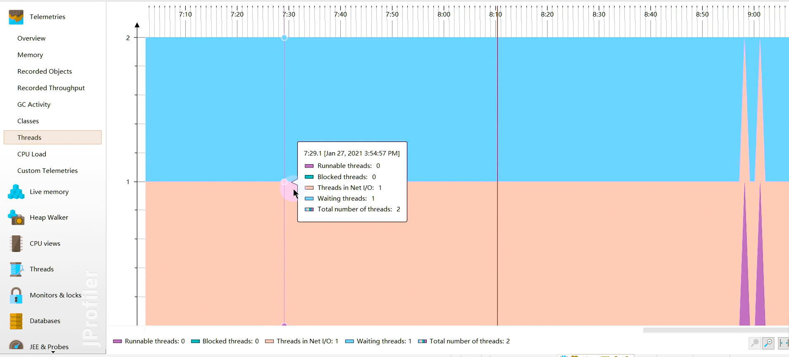


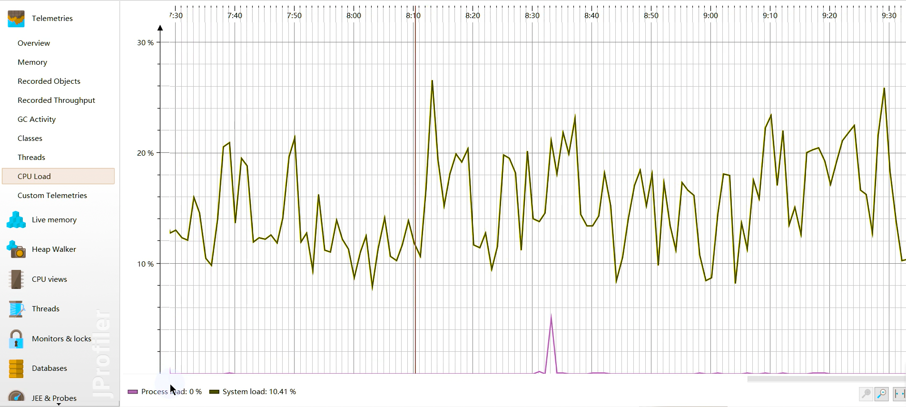


#### 内存视图 Live Memory


Live memory 内存剖析：class／class instance 的相关信息。例如对象的个数，大小，对象创建的方法执行栈，对象创建的热点。


+ **所有对象 All Objects**：显示所有加载的类的列表和在堆上分配的实例数。只有 Java 1.5（JVMTI）才会显示此视图。

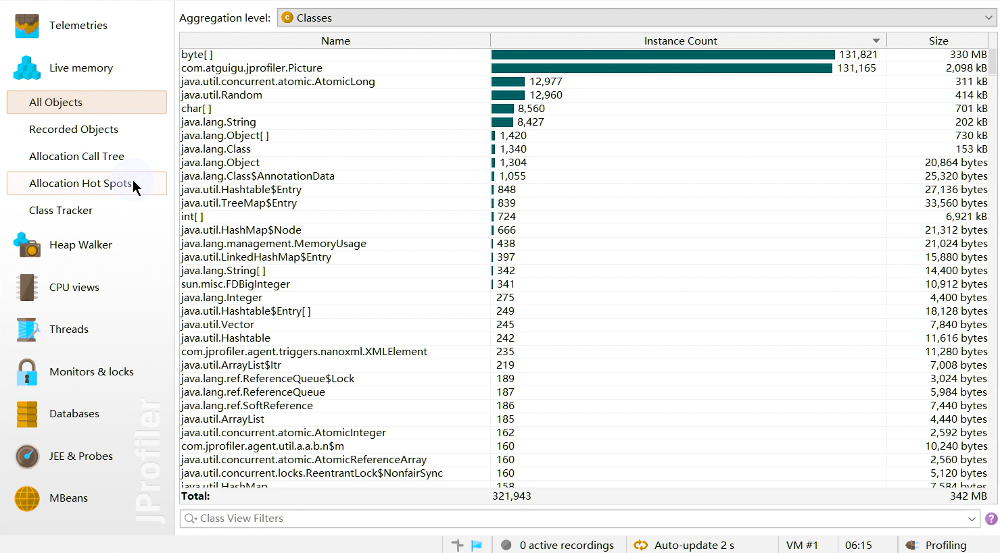


+ **记录对象 Record Objects**：查看特定时间段对象的分配，并记录分配的调用堆栈。

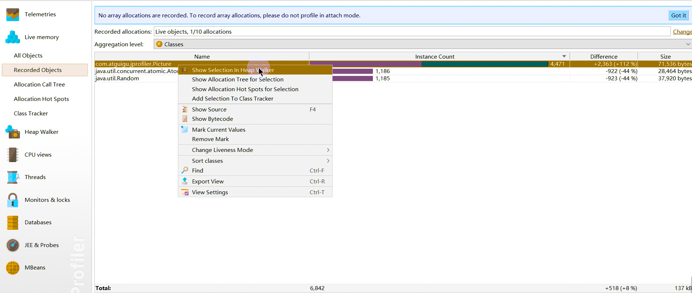


+ **分配访问树 Allocation Call Tree**：显示一棵请求树或者方法、类、包或对已选择类有带注释的分配信息的 J2EE 组件。


+ **分配热点 Allocation Hot Spots**：显示一个列表，包括方法、类、包或分配已选类的 J2EE 组件。你可以标注当前值并且显示差异值。对于每个热点都可以显示它的跟踪记录树。


+ **类追踪器 Class Tracker**：类跟踪视图可以包含任意数量的图表，显示选定的类和包的实例与时间。


分析：内存中的对象的情况

> 频繁创建的Java对象：死循环、循环次数过多
>

> 存在大的对象：读取文件时，byte[]应该边读边写。-->如果长时间不写出的话，导致byte[]过大
>

> 存在内存泄漏
>


#### 堆遍历 heap walker


**类Classes**

显示所有类和它们的实例，可以右击具体的类"Used Selected Instance"实现进一步跟踪。


**分配Allocations**

为所有记录对象显示分配树和分配热点。


**索引References**

为单个对象和“显示到垃圾回收根目录的路径”提供索引图的显示功能。还能提供合并输入视图和输出视图的功能。


**时间Time**

显示一个对已记录对象的解决时间的柱状图。


**检查Inspections**

显示了一个数量的操作，将分析当前对象集在某种条件下的子集，实质是一个筛选的过程。


**图表Graph**

你需要在references视图和biggest视图手动添加对象到图表，它可以显示对象的传入和传出引用，能方便的找到垃圾收集器根源。


Ps:在工具栏点击"Go To Start"可以使堆内存重新计数，也就是回到初始状态。


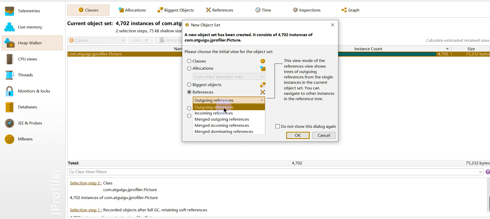


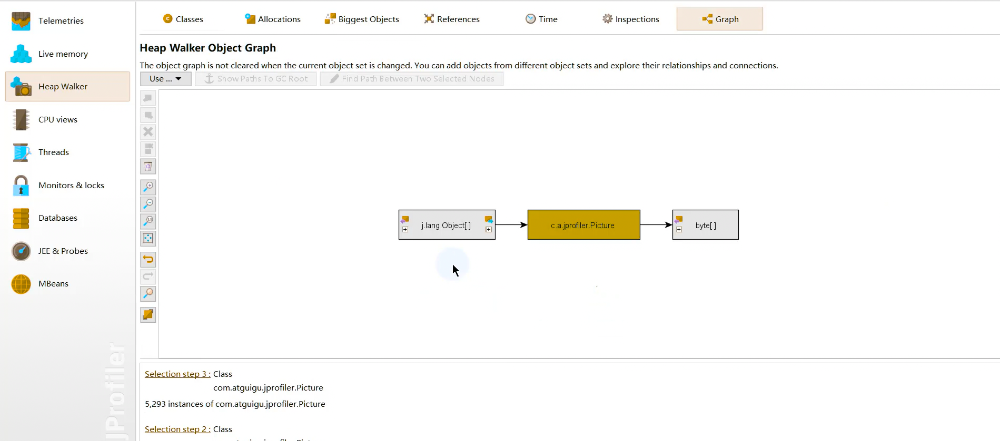


#### cpu 视图 cpu views


JProfiler 提供不同的方法来记录访问树以优化性能和细节。线程或者线程组以及线程状况可以被所有的视图选择。所有的视图都可以聚集到方法、类、包或 J2EE 组件等不同层上。


+ **访问树 Call Tree**：显示一个积累的自顶向下的树，树中包含所有在 JVM 中已记录的访问队列。JDBC，JMS 和 JNDI 服务请求都被注释在请求树中。请求树可以根据 Servlet 和 JSP 对 URL 的不同需要进行拆分。

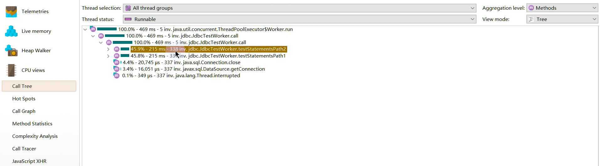


+ **热点 Hot Spots**：显示消耗时间最多的方法的列表。对每个热点都能够显示回溯树。该热点可以按照方法请求，JDBC，JMS 和 JNDI 服务请求以及按照 URL 请求来进行计算。


+ **访问图 Call Graph**：显示一个从已选方法、类、包或 J2EE 组件开始的访问队列的图。


+ **方法统计 Method Statistis**：显示一段时间内记录的方法的调用时间细节。


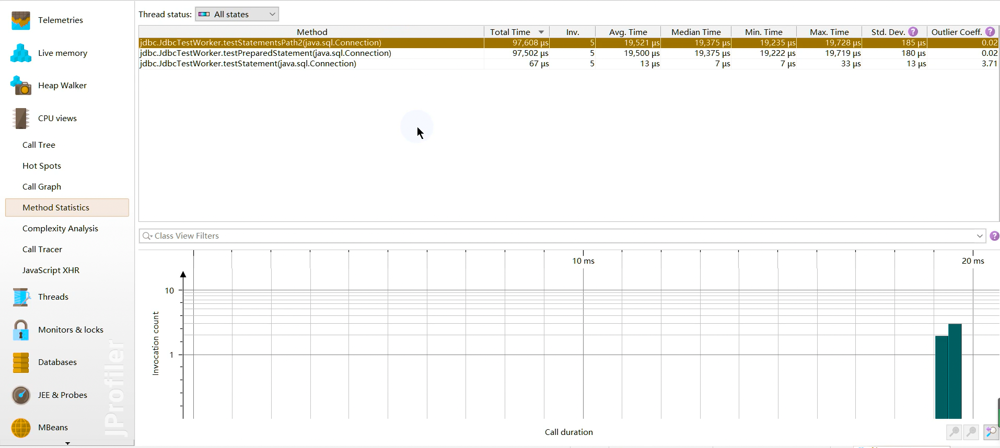


#### 线程视图 threads


JProfiler 通过对线程历史的监控判断其运行状态，并监控是否有线程阻塞产生，还能将一个线程所管理的方法以树状形式呈现。对线程剖析。


+ **线程历史 Thread History**：显示一个与线程活动和线程状态在一起的活动时间表。
+ **线程监控 Thread Monitor**：显示一个列表，包括所有的活动线程以及它们目前的活动状况。
+ **线程转储 Thread Dumps**：显示所有线程的堆栈跟踪。


线程分析主要关心三个方面：


1. web 容器的线程最大数。比如：Tomcat 的线程容量应该略大于最大并发数。
2. 线程阻塞
3. 线程死锁


#### 监控和锁 Monitors ＆Locks


所有线程持有锁的情况以及锁的信息。


观察 JVM 的内部线程并查看状态：


+ **死锁探测图表 Current Locking Graph**：显示 JVM 中的当前死锁图表。
+ **目前使用的监测器 Current Monitors**：显示目前使用的监测器并且包括它们的关联线程。
+ **锁定历史图表 Locking History Graph**：显示记录在 JVM 中的锁定历史。
+ **历史检测记录 Monitor History**：显示重大的等待事件和阻塞事件的历史记录。
+ **监控器使用统计 Monitor Usage Statistics**：显示分组监测，线程和监测类的统计监测数据


### 案例分析


案例1：

```java
public class JProfilerTest {

    public static void main(String[] args) {
        while (true) {
            ArrayList list = new ArrayList();
            for (int i = 0; i < 500; i++) {
                Data data = new Data();
                list.add(data);
            }
            try {
                TimeUnit.MILLISECONDS.sleep(500);
            } catch (InterruptedException e) {
                e.printStackTrace();
            }
        }
    }
}


class Data {
    private int size = 10;
    private byte[] buffer = new byte[1024 * 1024];//1mb
    private String info = "hello,atguigu";
}
```

## 3.6. Arthas  ***


**背景**


前面，我们介绍了jdk自带的jvijsualvm等免费工具，以及商业化工具Jprofiler。


这两款工具在业界知名度也比较高，他们的**优点**是可以图形界面上看到各维度的性能数据，使用者根据这些数据进行综合分析，然后判断哪里出现了性能问题。


但是这两款工具也有个**缺点**，都必须在服务端项目进程中配置相关的监控参数。然后工具通过远程连接到项目进程，获取相关的数据。这样就会带来一些不便， 比如线上环境的网络是隔离的，本地的监控工具根本连不上线上环境。并且类似于Jprofiler这样的商业工具，是需要付费的。


那么有没有一款工具不需要远程连接，也不需要配置监控参数，同时也提供了丰富的性能监控数据呢？


今天跟大家介绍一款**阿里巴巴开源的性能分析神器Arthas (阿尔萨斯)**


**概述**


**Arthas (阿尔萨斯)** 是 Alibaba 开源的 Java 诊断工具，深受开发者喜爱。在线排查问题，无需重启；动态跟踪 Java 代码；实时监控 JVM 状态。


Arthas 支持 JDK 6 ＋，支持 Linux／Mac／Windows，采用命令行交互模式，同时提供丰富的 Tab 自动补全功能，进一步方便进行问题的定位和诊断。


当你遇到以下类似问题而束手无策时，Arthas 可以帮助你解决：

+ 这个类从哪个 jar 包加载的？为什么会报各种类相关的 Exception？
+ 我改的代码为什么没有执行到？难道是我没 commit？分支搞错了？
+ 遇到问题无法在线上 debug，难道只能通过加日志再重新发布吗？
+ 线上遇到某个用户的数据处理有问题，但线上同样无法 debug，线下无法重现！
+ 是否有一个全局视角来查看系统的运行状况？
+ 有什么办法可以监控到 JVM 的实时运行状态？
+ 怎么快速定位应用的热点，生成火焰图？


**基于哪些工具开发而来**

****

greys-anatomy: Arthas代码基于Greys二次开发而来，非常感谢Greys之前所有的工作，以及Greys原作者对Arthas提出的意见和建议!


termd: Arthas的命令行实现基于termd开发，是一款优秀的命令行程序开发框架，感谢termd提供了优秀的框架。


crash:  Arthas 的文本渲染功能基于crash中的文本渲染功能开发，可以从这里看到源码，感谢crash在这方面所做的优秀工作。


cli: Arthas 的命令行界面基于vert.x提供的cli库进行开发，感谢vert.x在这方面做的优秀工作。


compiler Arthas里的内存编绎器代码来源


Apache Commons Net Arthas里的Telnet Client代码来源


JavaAgent: 运行在main方法之前的拦截器，它内定的方法名叫premain ，也就是说先执行premain方法然后再执行main方法


ASM: 一个通用的Java字节码操作和分析框架。它可以用于修改现有的类或直接以二进制形式动

态生成类。ASM提供了--些常见的字节码转换和分析算法，可以从它们构建定制的复杂转换和代

码分析工具。ASM提供了与其他Java字节码框架类似的功能，但是主要关注性能。因为它被设计

和实现得尽可能小和快，所以非常适合在动态系统中使用(当然也可以以静态方式使用，例如在

编译器中)


官网：[https://arthas.aliyun.com/zh-cn/](https://arthas.aliyun.com/zh-cn/)


### 安装与使用


**安装**


安装方式一：可以直接在Linux上通过命令下载

可以在官方Github 上进行下载，如果速度较慢，可以尝试国内的码云Gitee 下载。

+ github下载

```shell
wget https://alibaba.github.io/arthas/arthas-boot.jar
```

+ Gitee 下载

```shell
wget https://arthas.gitee.io/arthas-boot.jar
```

安装方式二：

也可以在浏览器直接访问[https://alibaba.github.io/arthas/arthas-boot.jar](https://alibaba.github.io/arthas/arthas-boot.jar)，等待下载成功后，上传到Linux服务器 上。


卸载：

在Linux/Unix/Mac 平台

删除下面文件：

rm -rf ~/.arthas/

rm -rf ~/ logs/ arthas

Windows平台直接删除user home 下面的 .arthas和logs/arthas目录


**工程目录**


arthas-agent：		基于JavaAgent技术的代理


bin：				一些启动脚本


arthas-boot：			Java版本的一键安装启动脚本


arthas-client: 			telnet client代码


arthas-common:		一些共用的工具类和枚举类


arthas-core:			核心库，各种arthas命令的交互和实现


arthas-demo:			示例代码


arthas-memorycompiler:	内存编绎器代码，Fork from	https://github.com/skalogs/SkaETL/ tree/master/compiler


arthas-packaging: 		maven打包相关的


arthas-site: 			arthas站点


arthas-spy:			编织到目标类中的各个切面


static:				静态资源


arthas-testcase:		测试


**启动**


Arthas 只是一一个java程序，所以可以直接用 java -jar 运行。


执行成功后，arthas提供了一种命令行方式的交互方式，arthas 会检测当前服务器上的Java进程，并将进程列表展示出来，用户输入对应的编号(1、 2、3、4...) 进行选择，然后回车。


方式1：

<font style="background-color:#FADB14;">java -jar arthas-boot.jar</font>

#选择进程(输入[]内编号(不是PID)回车)

[INFO] arthas-boot version: 3.1.4

[INFO] Found existing java process, please choose one and hit RETURN.


\* [1]: 11616 com.Arthas

    [2]: 8676

    [3]: 16200 org.jetbrains. jps . cmdl ine . Launcher

    [4]: 21032 org.jetbrains. idea. maven. server . RemoteMavenServer


方式2：运行时选择Java 进程PID

<font style="background-color:#FADB14;">java -jar arthas-boot.jar [PID]</font>


**查看日志**


cat ~/logs/arthas/arthas.log


**查看帮助**

****

java -jar arthas-boot.jar -h


**web console**

除了在命令行查看外，Arthas 目前还支持Web Console。在成功启动连接进程之后就已经自动启

动，可以直接访问 [http://127.0.0.1:8563/](http://127.0.0.1:8563/) 访问，页面上的操作模式和控制台完全一样。


**退出**


便用quit\exit：退出当前客户端


使用stop\shutdown：关闭arthas服务端，并退出所有客户端。


### 相关诊断指令


#### 基础指令


help 查看命令帮助信息


**cat **打印文件内容，和linux里的cat命令类似


**echo **打印参数，和linux里的echo命令类似


**grep **匹配查找，和linux里的gep命令类似


**tee **复制标隹输入到标准输出和指定的文件，和linux里的tee命令类似


**pwd **返回当前的工作目录，和linux命令类似


cls 清空当前屏幕区域


session 查看当前会话的信息


**reset **重置增强类，将被 Arthas增强过的类全部还原, Arthas服务端关闭时会重置所有增强过的类


version 输出当前目标Java进程所加载的 Arthas版本号


history 打印命令历史


quit- -- 退出当前Arthas客户端，其他Arthas客户端不受影响


stop- -- 关闭Arthas服务端，所有Arthas客户端全部退出


**keymap **Arthas快捷键列表及自定义快捷键


#### jvm 相关


dashboard 当前系统的实时数据面板


thread 查看当前JVM的线程堆栈信息


jvm 查看当前JVM的信息


sysprop 查看和修改JVM的系统属性


sysem 查看JVM的环境变量


vmoption 查看和修改JVM里诊断相关的option


perfcounter 查看当前JVM的 Perf Counter信息


logger 查看和修改logger


getstatic 查看类的静态属性


ognl 执行ognl表达式


mbean 查看 Mbean的信息


heapdump —— dump java heap，类似jmap命令的 heap dump功能


#### class/classloader 相关


+ sc 查看JVM已加载的类信息
    - -d 输出当前类的详细信息，包括这个类所加载的原始文件来源、类的声明、加载的Classloader等详细信息。如果一个类被多个Classloader所加载，则会出现多次
    - -E 开启正则表达式匹配，默认为通配符匹配
    - -f 输出当前类的成员变量信息（需要配合参数-d一起使用）
    - -X 指定输出静态变量时属性的遍历深度，默认为0，即直接使用toString输出


+ sm 查看已加载类的方法信息
    - -d 展示每个方法的详细信息
    - -E 开启正则表达式匹配,默认为通配符匹配


+ jad 反编译指定已加载类的源码
    - 在Arthas Console 上， 反编译出来的源码是带语法高亮的，阅读更方便
    - 当然，反编译出来的java 代码可能会存在语法错误，但不影响你进行阅读理解


+ mc 内存编译器，内存编译.java文件为.class文件


+ retransform 加载外部的.class文件, retransform到JVM里


+ redefine 加载外部的.class文件，redefine到JVM里


+ dump dump已加载类的byte code到特定目录


+ classloader 查看classloader的继承树，urts，类加载信息，使用classloader去getResource
    - -t 查看classloader的继承树
    - -l 按类加载实例查看统计信息
    - -c 用classloader对应的hashcode来查看对应的 Jar urls


#### monitor/watch/trace 相关


+ monitor 方法执行监控，调用次数、执行时间、失败率
    - -c 统计周期，默认值为120秒


+ watch 方法执行观测，能观察到的范围为：返回值、抛出异常、入参，通过编写groovy表达式进行对应变量的查看
    - -b 在方法调用之前观察(默认关闭)
    - -e 在方法异常之后观察(默认关闭)
    - -s 在方法返回之后观察(默认关闭)
    - -f 在方法结束之后(正常返回和异常返回)观察(默认开启)
    - -x 指定输岀结果的属性遍历深度,默认为0


+ trace 方法内部调用路径，并输出方法路径上的每个节点上耗时
    - -n 执行次数限制


+ stack 输出当前方法被调用的调用路径


+ tt 方法执行数据的时空隧道，记录下指定方法每次调用的入参和返回信息，并能对这些不同的时间下调用进行观测


#### 其他


jobs 列出所有job


kill 强制终止任务


fg 将暂停的任务拉到前台执行


bg 将暂停的任务放到后台执行


grep 搜索满足条件的结果


plaintext 将命令的结果去除ANSI颜色


wc 按行统计输出结果


options 查看或设置Arthas全局开关


profiler 使用async-profiler对应用采样，生成火焰图


## 3.7. Java Misssion Control


### 历史


在 Oracle 收购 Sun 之前，Oracle 的 JRockit 虚拟机提供了一款叫做 JRockit Mission Control 的虚拟机诊断工具。


在 Oracle 收购 sun 之后，Oracle 公司同时拥有了 Hotspot 和 JRockit 两款虚拟机。根据 Oracle 对于 Java 的战略，在今后的发展中，会将 JRokit 的优秀特性移植到 Hotspot 上。其中一个重要的改进就是在 Sun 的 JDK 中加入了 JRockit 的支持。


在 Oracle JDK 7u40 之后，Mission Control 这款工具己经绑定在 Oracle JDK 中发布。


自 Java11 开始，本节介绍的 JFR 己经开源。但在之前的 Java 版本，JFR 属于 Commercial Feature ，需要通过 Java 虚拟机参数-XX:+UnlockCommercialFeatures 开启。


### 启动


Mission Control 位于%JAVA_HOME%/bin/jmc.exe，打开这款软件。


### 概述


Java Mission Control（简称 JMC) ， Java 官方提供的性能强劲的工具，是一个用于对 Java 应用程序进行管理、监视、概要分析和故障排除的工具套件。


它包含一个 GUI 客户端，以及众多用来收集 Java 虚拟机性能数据的插件，如 JMX Console（能够访问用来存放虚拟机各个子系统运行数据的 MXBeans），以及虚拟机内置的高效 profiling 工具 Java Flight Recorder（JFR）。


JMC 的另一个优点就是：采用取样，而不是传统的代码植入技术，对应用性能的影响非常非常小，完全可以开着 JMC 来做压测（唯一影响可能是 full gc 多了）。


官方地址：[https://github.com/JDKMissionControl/jmc](https://github.com/JDKMissionControl/jmc)


### 功能:实时监控JVM运行时的状态


如果是远程服务器，使用前要开JMX。

-Dcom.sun.management.jmxremote.port=${YOUR PORT}

-Dcom.sun.management.jmxremote

-Dcom.sun.management.jmxremote.authenticate=false

-Dcom.sun.management.jmxremote.ssl=false

-Djava.rmi.server.hostname=${YOUR HOST/IP}


文件 -> 连接 -> 创建新连接，填入上面JMX参数的host和port


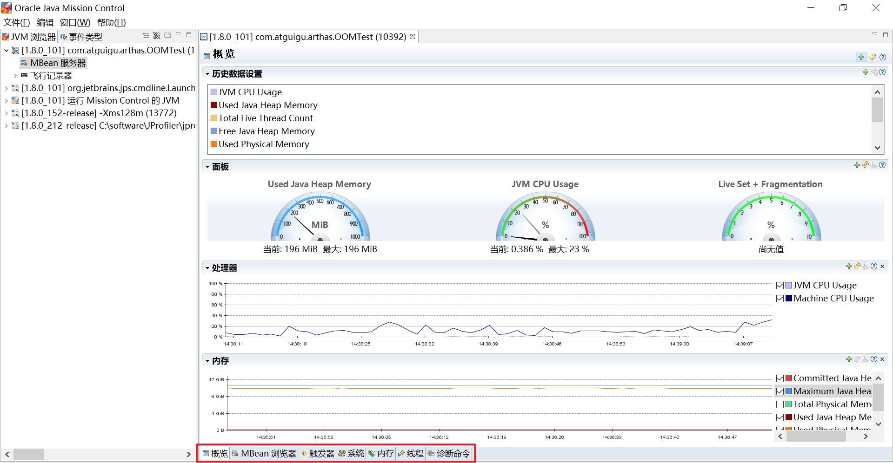


### Java Flight Recorder


Java Flight Recorder 是 JMC 的其中一个组件，能够以极低的性能开销收集 Java 虚拟机的性能数据。与其他工具相比，JFR 的性能开销很小，在默认配置下平均低于 1%。JFR 能够直接访问虚拟机内的敌据并且不会影响虚拟机的优化。因此它非常适用于生产环境下满负荷运行的 Java 程序。


Java Flight Recorder 和 JDK Mission Control 共同创建了一个完整的工具链。JDK Mission Control 可对 Java Flight Recorder 连续收集低水平和详细的运行时信息进行高效、详细的分析。


当启用时 JFR 将记录运行过程中发生的一系列事件。其中包括 Java 层面的事件如线程事件、锁事件，以及 Java 虚拟机内部的事件，如新建对象，垃圾回收和即时编译事件。按照发生时机以及持续时间来划分，JFR 的事件共有四种类型，它们分别为以下四种：


+  瞬时事件（Instant Event) ，用户关心的是它们发生与否，例如异常、线程启动事件。 
+  持续事件(Duration Event) ，用户关心的是它们的持续时间，例如垃圾回收事件。 
+  计时事件(Timed Event) ，是时长超出指定阈值的持续事件。 
+  取样事件（Sample Event)，是周期性取样的事件。 


取样事件的其中一个常见例子便是方法抽样（Method Sampling），即每隔一段时问统计各个线程的栈轨迹。如果在这些抽样取得的栈轨迹中存在一个反复出现的方法，那么我们可以推测该方法是热点方法


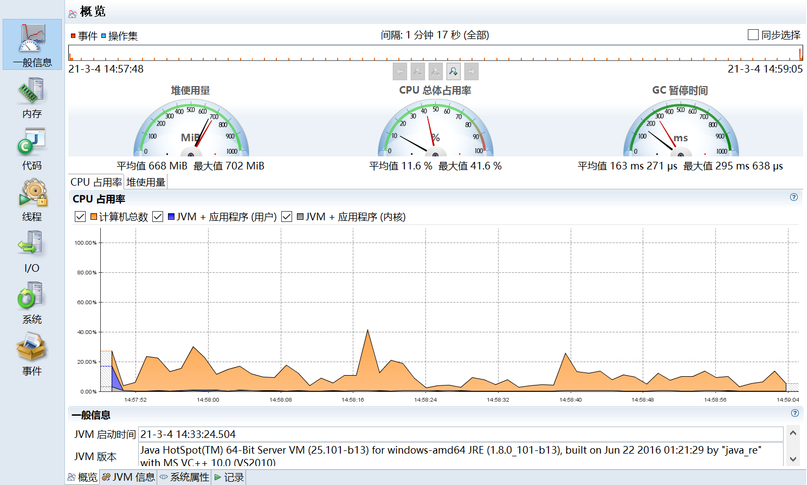


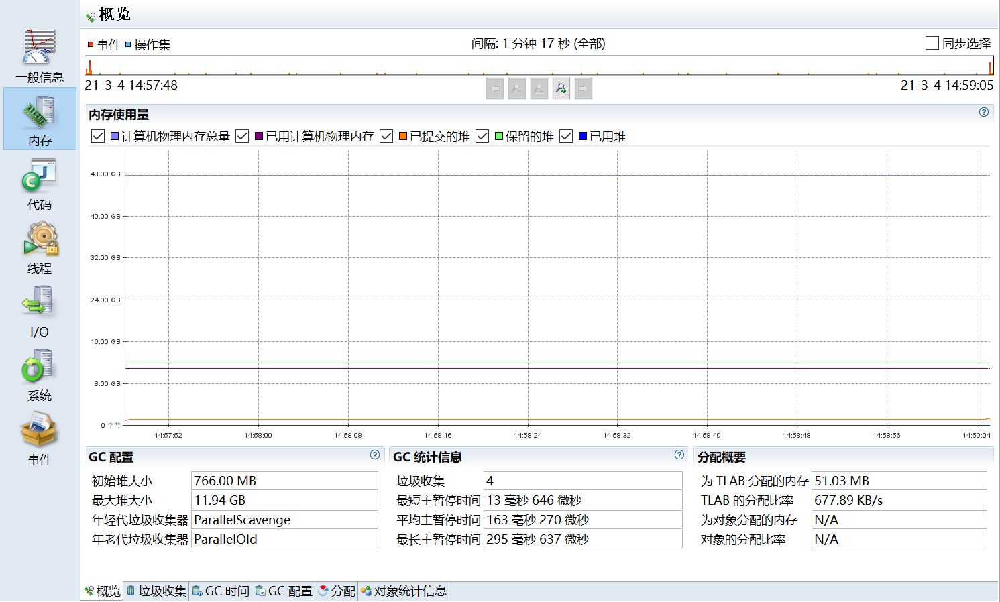


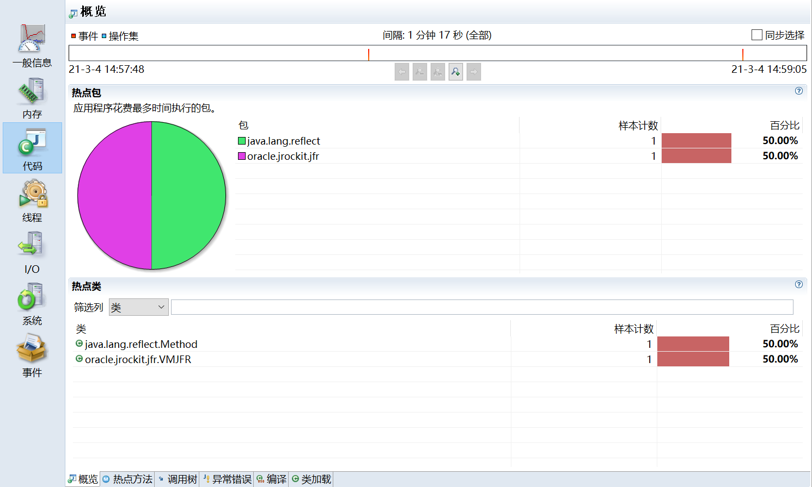


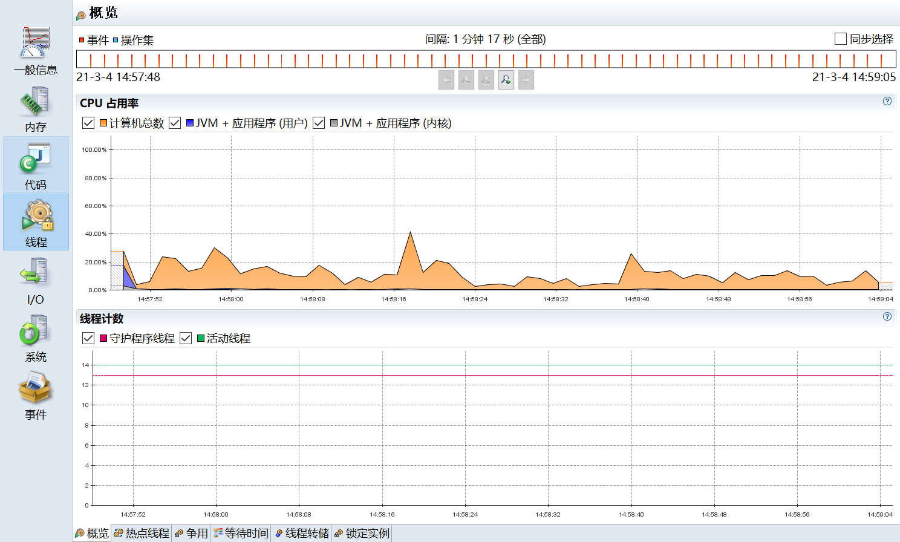


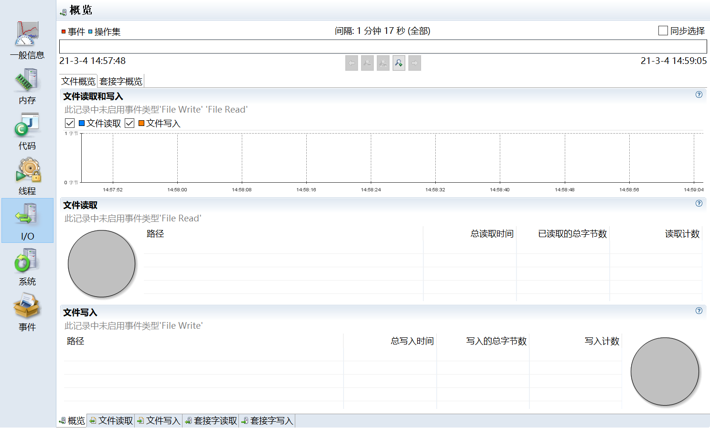


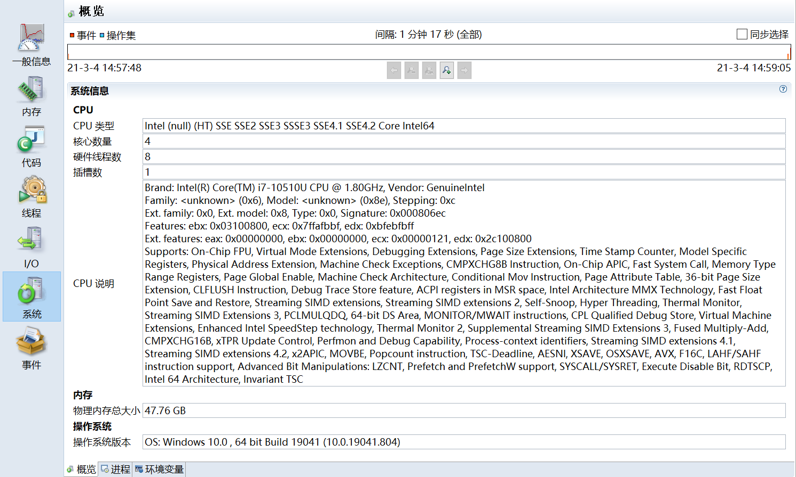


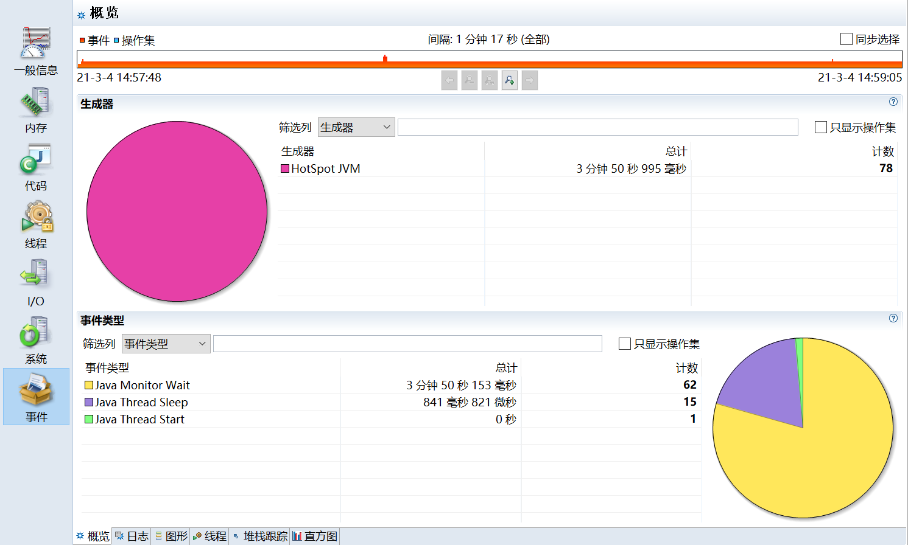


## 3.8. 其他工具


### Flame Graphs（火焰图）


在追求极致性能的场景下，了解你的程序运行过程中 cpu 在干什么很重要，火焰图就是一种非常直观的展示 CPU 在程序整个生命周期过程中时间分配的工具。


火焰图对于现代的程序员不应该陌生，这个工具可以非常直观的显示出调用找中的 CPU 消耗瓶颈。


网上的关于 Java 火焰图的讲解大部分来自于 Brenden Gregg 的博客 [https://www.brendangregg.com/flamegraphs.html](https://www.brendangregg.com/flamegraphs.html)


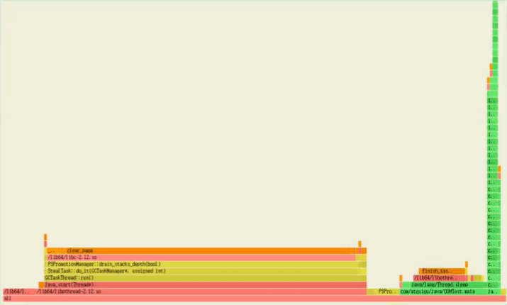


火焰图，简单通过 x 轴横条宽度来度量时间指标，y 轴代表线程栈的层次。


### Tprofiler


案例： 使用 JDK 自身提供的工具进行 JVM 调优可以将下 TPS 由 2.5 提升到 20（提升了 7 倍），并准确 定位系统瓶颈。


系统瓶颈有：应用里静态对象不是太多、有大量的业务线程在频繁创建一些生命周期很长的临时对象，代码里有问题。


那么，如何在海量业务代码里边准确定位这些性能代码？这里使用阿里开源工具 Tprofiler 来定位 这些性能代码，成功解决掉了 GC 过于频繁的性能瓶预，并最终在上次优化的基础上将 TPS 再提升了 4 倍，即提升到 100。


+ Tprofiler 配置部署、远程操作、 日志阅谈都不太复杂，操作还是很简单的。但是其却是能够 起到一针见血、立竿见影的效果，帮我们解决了 GC 过于频繁的性能瓶预。


+ Tprofiler 最重要的特性就是能够统汁出你指定时间段内 JVM 的 top method 这些 top method 极有可能就是造成你 JVM 性能瓶颈的元凶。这是其他大多数 JVM 调优工具所不具备的，包括 JRockit Mission Control。JRokit 首席开发者 Marcus Hirt 在其私人博客《 Low Overhead Method Profiling with Java Mission Control》下的评论中曾明确指出 JRMC 井不支持 TOP 方法的统计。


官方地址：[http://github.com/alibaba/Tprofiler](http://github.com/alibaba/Tprofiler)


### Btrace


Java运行时追踪工具


常见的动态追踪工具有 **BTrace**、**HouseHD**（该项目己经停止开发）、**Greys-Anatomy**（国人开发 个人开发者）、**Byteman**（JBoss 出品），注意 Java 运行时追踪工具井不限干这几种，但是这几个是相对比较常用的。


BTrace 是 SUN Kenai 云计算开发平台下的一个开源项目，旨在为 java 提供安全可靠的动态跟踪分析工具。先看一卜日 Trace 的官方定义：


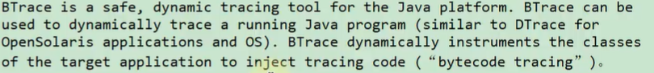


大意是一个 Java 平台的安全的动态追踪工具，可以用来动态地追踪一个运行的 Java 程序。BTrace 动态调整目标应用程序的类以注入跟踪代码（“字节码跟踪“）。


### YourKit


### JProbe


### Spring Insight


> 更新: 2023-10-13 14:07:12  
> 原文: <https://www.yuque.com/like321/uuypvk/cefzql>