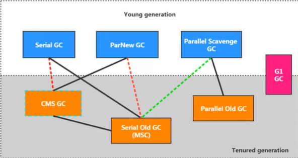
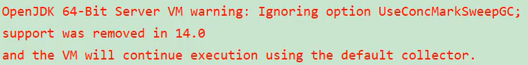
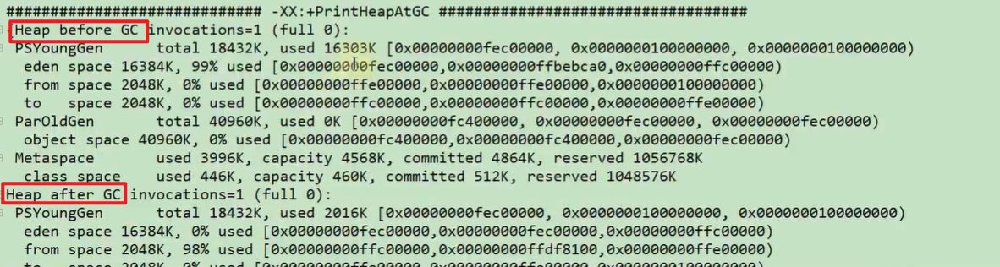

# 4_JVM运行时参数


## 4.1. JVM 参数选项


官网地址：[https://docs.oracle.com/javase/8/docs/technotes/tools/windows/java.html](https://docs.oracle.com/javase/8/docs/technotes/tools/windows/java.html)


### 类型一：标准参数选项


#### 特点
****

+ 比较稳定，后续版本基本不会变化
+ <font style="color:#E8323C;">以-开头</font>


#### 各种选项	
**	**运行java或者java -help可以看到所有的标准选项


```shell
> java -help
用法: java [-options] class [args...]
           (执行类)
   或  java [-options] -jar jarfile [args...]
           (执行 jar 文件)
其中选项包括:
    -d32          使用 32 位数据模型 (如果可用)
    -d64          使用 64 位数据模型 (如果可用)
    -server       选择 "server" VM
                  默认 VM 是 server.

    -cp <目录和 zip/jar 文件的类搜索路径>
    -classpath <目录和 zip/jar 文件的类搜索路径>
                  用 ; 分隔的目录, JAR 档案
                  和 ZIP 档案列表, 用于搜索类文件。
    -D<名称>=<值>
                  设置系统属性
    -verbose:[class|gc|jni]
                  启用详细输出
    -version      输出产品版本并退出
    -version:<值>
                  警告: 此功能已过时, 将在
                  未来发行版中删除。
                  需要指定的版本才能运行
    -showversion  输出产品版本并继续
    -jre-restrict-search | -no-jre-restrict-search
                  警告: 此功能已过时, 将在
                  未来发行版中删除。
                  在版本搜索中包括/排除用户专用 JRE
    -? -help      输出此帮助消息
    -X            输出非标准选项的帮助
    -ea[:<packagename>...|:<classname>]
    -enableassertions[:<packagename>...|:<classname>]
                  按指定的粒度启用断言
    -da[:<packagename>...|:<classname>]
    -disableassertions[:<packagename>...|:<classname>]
                  禁用具有指定粒度的断言
    -esa | -enablesystemassertions
                  启用系统断言
    -dsa | -disablesystemassertions
                  禁用系统断言
    -agentlib:<libname>[=<选项>]
                  加载本机代理库 <libname>, 例如 -agentlib:hprof
                  另请参阅 -agentlib:jdwp=help 和 -agentlib:hprof=help
    -agentpath:<pathname>[=<选项>]
                  按完整路径名加载本机代理库
    -javaagent:<jarpath>[=<选项>]
                  加载 Java 编程语言代理, 请参阅 java.lang.instrument
    -splash:<imagepath>
                  使用指定的图像显示启动屏幕
有关详细信息, 请参阅 http://www.oracle.com/technetwork/java/javase/documentation/index.html。
```


#### 补充内容: -server 与-client 


Hotspot JVM 有两种模式，分别是 server 和 client，分别通过-server 和-client 模式设置


+ 32 位系统上，默认使用 Client 类型的 JVM。要想使用 Server 模式，机器配置至少有 2 个以上的 CPU 和 2G 以上的物理内存。client 模式适用于对内存要求较小的桌面应用程序，默认使用 Serial 串行垃圾收集器
+ 64 位系统上，只支持 server 模式的 JVM，适用于需要大内存的应用程序，默认使用并行垃圾收集器


**关于server和client的官网介绍为:**

[https://docs.oracle.com/javase/8/docs/technotes/guides/vm/server-class.html](https://docs.oracle.com/javase/8/docs/technotes/guides/vm/server-class.html)


如何知道系统默认使用的是那种模式呢？


通过 java -version 命令：可以看到 Server VM 字样，代表当前系统使用是 Server 模式


```shell
> java -version
java version "1.8.0_201"
Java(TM) SE Runtime Environment (build 1.8.0_201-b09)
Java HotSpot(TM) 64-Bit Server VM (build 25.201-b09, mixed mode)
```


###  类型二：-X 参数选项


#### 特点
****

+ 非标准化参数
+ 功能还是比较稳定的。但官方说后续版本可能会变更
+ <font style="color:#E8323C;">以-X开头</font>


 


#### 各种选项		
运行java -X命令可以看到所有的X选项

```shell
> java -X
    -Xmixed           混合模式执行 (默认)
    -Xint             仅解释模式执行
    -Xbootclasspath:<用 ; 分隔的目录和 zip/jar 文件>
                      设置搜索路径以引导类和资源
    -Xbootclasspath/a:<用 ; 分隔的目录和 zip/jar 文件>
                      附加在引导类路径末尾
    -Xbootclasspath/p:<用 ; 分隔的目录和 zip/jar 文件>
                      置于引导类路径之前
    -Xdiag            显示附加诊断消息
    -Xnoclassgc       禁用类垃圾收集
    -Xincgc           启用增量垃圾收集
    -Xloggc:<file>    将 GC 状态记录在文件中 (带时间戳)
    -Xbatch           禁用后台编译
    -Xms<size>        设置初始 Java 堆大小
    -Xmx<size>        设置最大 Java 堆大小
    -Xss<size>        设置 Java 线程堆栈大小
    -Xprof            输出 cpu 配置文件数据
    -Xfuture          启用最严格的检查, 预期将来的默认值
    -Xrs              减少 Java/VM 对操作系统信号的使用 (请参阅文档)
    -Xcheck:jni       对 JNI 函数执行其他检查
    -Xshare:off       不尝试使用共享类数据
    -Xshare:auto      在可能的情况下使用共享类数据 (默认)
    -Xshare:on        要求使用共享类数据, 否则将失败。
    -XshowSettings    显示所有设置并继续
    -XshowSettings:all
                      显示所有设置并继续
    -XshowSettings:vm 显示所有与 vm 相关的设置并继续
    -XshowSettings:properties
                      显示所有属性设置并继续
    -XshowSettings:locale
                      显示所有与区域设置相关的设置并继续

-X 选项是非标准选项, 如有更改, 恕不另行通知。
```


#### JVM的JIT编译模式相关的选项
 

+ -Xint	禁用JIT，所有字节码都被解释执行，这个模式的速度最慢的
+ -Xcomp	所有字节码第一次使用就都被编译成本地代码，然后再执行
+ -Xmixed	混合模式，默认模式，让JIT根据程序运行的情况，有选择地将某些代码


如何知道 JVM 默认使用的是混合模式呢？


同样地，通过 java -version 命令：可以看到 mixed mode 字样，代表当前系统使用的是混合模式


#### 特别地：
****

-Xmx -Xms -Xss属于XX参数?


+ -Xms <size>		设置初始Java堆大小，等价于-XX:InitialHeapSize

 

+ -Xmx<size>		设置最大Java堆大小，等价于-XX:MaxHeapSize


+ -Xss<size>		设置Java线程堆栈大小，-XX:ThreadStackSize


### 类型三：-XX 参数选项


#### 特点：


+ 非标准化参数
+ <font style="color:#E8323C;">使用的最多的参数类型</font>
+ 这类选项属于实验性，不稳定
+ <font style="color:#E8323C;">以-XX开头</font>


#### 作用


用于开发和调试JVM


#### 分类


**Boolean 类型格式**


```shell
-XX:+<option>  启用option属性
-XX:-<option>  禁用option属性
```


**举例：**

```shell
-XX:+UseParallelGC	选择垃圾收集器为并行收集器

-XX:+UseG1GC				表示启用G1收集器

-XX:+UseAdaptiveSizePolicy		自动选择年轻代区大小和相应的Survivor区比例
```

说明：因为有的指令默认是开启的，所以可以使用-关闭


****

****

**非 Boolean 类型格式 	（key-value类型）**


```shell
子类型1：数值型格式-XX:<option>=<number>  
  
子类型2：非数值型格式-XX:<option>=<string> 
  设置option字符值
```


number表示数值，number可以带上单位，比如：'m'、'M' 表示兆，'k'、'K'表示Kb, 'g'、'G'表示g (例如32k跟32768是一 样的效果)


例如:

```java
-XX:NewSize=1024m			表示设置新生代初始大小为1024兆
-XX:MaxGCPauseMillis=500	表示设置GC停顿时间: 500毫秒
-XX:GCTimeRatio=19			表示设置吞吐量
-XX:NewRatio=2				表示新生代与老年代的比例
```

```java
-XX:HeapDumpPath=/usr/local/heapdump.hprof	用来指定heap转存文件的存储路径。
```


#### 特别地


-XX:+pringFlagsFinal


+ 输出所有参数的名称和默认值


+ 默认不包括Diagnostic和Experimental的参数


+ 可以配合-XX:+UnlockDiagnosticVMOptions和-XX:UnlockExperimentalVMOptions使用.


## 4.2. 添加 JVM 参数选项


eclipse 和 idea 中配置不必多说，在 Run Configurations 中 VM Options 中配置即可，大同小异


### 运行 jar 包


```shell
java -Xms100m -Xmx100m -XX:+PrintGCDetails -XX:+PrintGCDateStamps -XX:+PrintGCTimeStamps -jar demo.jar
```


### Tomcat 运行 war 包


```shell
# linux下tomcat/bin/catalina.sh添加
JAVA_OPTS="-Xms512M -Xmx1024M"

# windows下catalina.bat添加
set "JAVA_OPTS=-Xms512M -Xmx1024M"
```


### 程序运行过程中


```shell
# 设置Boolean类型参数
jinfo -flag [+|-]<name> <pid>

# 设置非Boolean类型参数
jinfo -flag <name>=<value> <pid>
```


## 4.3. 常用的 JVM 参数选项


### 4.3.1. 打印设置的 XX 选项及值


+ -XX:+PrintCommandLineFlags 	
    - 可以让在程序运行前打印出JVM默认设置或用户手动设置的XX选项


+ -XX:+PrintFlagsInitial 		打印所有XX选项的默认值


+ **-XX:+PrintFlagsFinal **		打印所有XX选项的实际值


+ -XX:+PrintVMOptions 		打印JVM的参数

### 4.3.2. 堆、栈、方法区等内存大小设置


#### 栈


-Xss128k <==> -XX:ThreadStackSize=128k 		设置线程栈的大小为128K


#### 堆


```shell
-Xms2048m <==> -XX:InitialHeapSize=2048m 设置JVM初始堆内存为2048M

-Xmx2048m <==> -XX:MaxHeapSize=2048m 设置JVM最大堆内存为2048M

-Xmn2g  设置年轻代大小为2G，官方推荐配置为整个堆大小的3/8

-XX:NewSize=2g	设置年轻代初始值为2G

-XX:MaxNewSize=2g 	设置年轻代最大值为1024M

-XX:SurvivorRatio=8 设置Eden区与Survivor区的比值，默认为8

-XX:+UseAdaptiveSizePolicy 自动选择各区大小比例，默认开启

-XX:NewRatio=2 设置老年代与年轻代的比例，默认为2

-XX:PretenureSizeThreadshold=1024 设置让大于此阈值的对象直接分配在老年代，单位为字节，
只对Serial、ParNew收集器有效

-XX:MaxTenuringThreshold=15 设置新生代晋升老年代的年龄限制，默认为15

-XX:TargetSurvivorRatio 设置MinorGC结束后Survivor区占用空间的期望比例
```


#### 方法区
```shell
# 永久代
-XX:PermSize=256m 		设置永久代初始值为256M

-XX:MaxPermSize=256m 	设置永久代最大值为256M

# 元空间
-XX:MetaspaceSize  		设置元空间初始值为256M

-XX:MaxMetaspaceSize  设置元空间最大值为256M，默认没有限制

-XX:+UseCompressedOops 	压缩对象指针

-XX:+UseCompressedClassPointers 	压缩类指针

-XX:CompressedClassSpaceSize 设置Klass Metaspace的大小，默认1G
```

#### 直接内存
```shell
-XX:MaxDirectMemorySize 指定DirectMemory容量，默认等于Java堆最大值
```

### 
### 4.3.3. OutOfMemory 相关的选项


```shell
-XX:+HeapDumpOnOutMemoryError 内存出现OOM时，生成Heap转储文件

-XX:+HeapDumpBeforeFullGC 出现FullGC之前，生成Heap转储文件

-XX:HeapDumpPath=<path> 指定heap转储文件的存储路径，默认当前目录

-XX:OnOutOfMemoryError=<path> 指定可行性程序或脚本的路径，当发生OOM时执行脚本
```


### 4.3.4. 垃圾收集器相关选项


**7款经典收集器与垃圾分代之间的关系**


**垃圾收集器的组合关系**


+ 红色虚线表示在 jdk8 时被 Deprecate，jdk9 时被删除
+ 绿色虚线表示在 jdk14 时被 Deprecate
+ 绿色虚框表示在 jdk9 时被 Deprecate，jdk14 时被删除





#### 查看默认的垃圾收集器


+ -xx:+PrintCommandLineFlags：	查看命令行相关参数(包含使用的垃圾收集器)


+ 使用命令行指令：jinfo  -flag	 相关垃圾回收器参数  进程ID


#### Serial回收器


Serial收集器作为HotSpot中Client模式下的默认新生代垃圾收集器。Serial 0ld是运行在Client模式下默认的老年代的垃圾回收器。


**- XX: +UseSerialGC**

指定年轻代和老年代都使用串行收集器。等价于新生代用Serial GC， 且老年代用Serial 0ld GC。可以获得最高的单线程收集效率。


#### ParNew回收器


-XX:+UseParNewGC

手动指定使用ParNew收集器执行内存回收任务。它表示年轻代使用并行收集器，不影响老

年代。


-XX:ParallelGCThreads=N

限制线程数量，默认开启和CPU数据相同的线程数。一般地，最好与CPU数量相等，以避免过多的线程数影响垃圾收集性能。


$ ParallelGCThreads =
\begin{cases}
CPU\_Count & \text (CPU\_Count <= 8) \\
3 + (5 * CPU＿Count / 8) & \text (CPU\_Count > 8)
\end{cases}
 $


#### Parallel回收器


+ -XX:+UseParallelGC  年轻代使用 Parallel Scavenge GC


+ -XX:+UseParallelOldGC  老年代使用 Parallel Old GC
    - 分别适用于新生代和老年代。默认jdk8是开启的。
    - 上面两个参数，默认开启一个，另一个也会被开启。(<font style="color:#E8323C;"> 互相激活</font>)


+ -XX:ParallelGCThreads	设置年轻代并行收集器的线程数。一般地，最好与CPU数量相等，以避免过多的线程数影响垃圾收集性能。
    - 在默认情况下，当CPU 数量小于8个，ParallelGCThreads 的值等于CPU数量。
    - 当CPU数量大于8个，ParallelGCThreads 的值等于**3+[5*CPU_Count]/8] **。


+ -XX:MaxGCPauseMillis  设置垃圾收集器最大停顿时间（即STW的时间），单位是毫秒。
    - 为了尽可能地把停顿时间控制在MaxGCPauseMills以内，收集器在工作时会调整Java堆大小或者其他一些参数。
    - 对于用户来讲，停顿时间越短体验越好；但是服务器端注重高并发，整体的吞吐量。所以服务器端适合Parallel，进行控制。
    - <font style="color:#E8323C;">该参数使用需谨慎。</font>


+ -XX:GCTimeRatio  垃圾收集时间占总时间的比例（= 1 / (N＋1)），用于衡量吞吐量的大小
    - 取值范围（0,100），默认值99，也就是垃圾回收时间不超过1％。
    - 与前一个-XX:MaxGCPauseMillis参数有一定矛盾性。暂停时间越长，Radio参数就容易超过设定的比例。


+ -XX:+UseAdaptiveSizePolicy  设置Parallel Scavenge收集器具有**自适应调节策略**。
    - 在这种模式下，年轻代的大小、Eden和Survivor的比例、晋升老年代的对象年龄等参数会被自动调整，已达到在堆大小、吞吐量和停顿时间之间的平衡点。
    - 在手动调优比较困难的场合，可以直接使用这种自适应的方式，仅指定虚拟机的最大堆、目标的吞吐量（GCTimeRatio）和停顿时间（MaxGCPauseMills），让虚拟机自己完成调优工作。


#### CMS回收器


+ -XX:+UseConcMarkSweepGC  手动制定使用CMS收集器执行内存回收任务。
    - 开启该参数后会自动将-XX:＋UseParNewGC打开。即：ParNew（Young区）+ CMS（Old区）+ Serial Old的组合


+ -XX:CMSInitiatingOccupanyFraction  设置堆内存使用率的阈值，一旦达到该阈值，便开始进行回收。
    - JDK5及以前版本的默认值为68，即当老年代的空间使用率达到68%时，会执行一次CMS回收。**<font style="color:#E8323C;">jDK6及以上版本默认值为92％。</font>**
    - 如果内存增长缓慢，则可以设置一个稍大的值，大的阈值可以有效降低CMS的触发频率，减少老年代回收的次数可以较为明显地改善应用程序性能。反之，如果应用程序内存使用率增长很快，则应该降低这个阈值，以避免频繁触发老年代串行收集器。因此<font style="color:#E8323C;">通过该选项便可以有效降低Full GC的执行次数。</font>

<font style="color:#E8323C;"></font>

+ -XX:+UseCMSInitiatingOccupancyOnly  是否动态可调，使CMS一直按CMSInitiatingOccupancyFraction设定的值启动


+ XX:+UseCMSCompactAtFullCollection  用于指定在执行完Full GC后对内存空间进行压缩整理，以此避免内存碎片的产生。不过由于内存压缩整理过程无法并发执行，所带来的问题就是停顿时间变得更长了。


+ -XX:CMSFullGCsBeforeCompaction  设置在执行多少次Full GC后对内存空间进行压缩整理。


+ -XX:ParallelCMSThreads  设置CMS的线程数量。
    - CMS 默认启动的线程数是(ParallelGCThreads＋3)/4，ParallelGCThreads 是年轻代并行收集器的线程数。当CPU 资源比较紧张时，受到CMS收集器线程的影响，应用程序的性能在垃圾回收阶段可能会非常糟糕。


**补充参数：**


另外，CMS收集器还有如下常用参数:


+ -XX:ConcGCThreads  设置并发垃圾收集的线程数，默认该值是基于ParallelGCThreads计算出来的


+ -XX:+CMSScavengeBeforeRemark  强制hotspot在cms remark阶段之前做一次minor gc，用于提高remark阶段的速度


+ -XX:+CMSClassUnloadingEnable  如果有的话，启用回收Perm 区（JDK8之前）


+ -XX:+CMSParallelInitialEnabled  用于开启CMS initial-mark阶段采用多线程的方式进行标记，	用于提高标记速度，在Java8开始已经默认开启


+ -XX:+CMSParallelRemarkEnabled  用户开启CMS remark阶段采用多线程的方式进行重新标记，默认开启


+ -XX:+ExplicitGCInvokesConcurrent、-XX:+ExplicitGCInvokesConcurrentAndUnloadsClasses

	这两个参数用户指定hotspot虚拟在执行System.gc()时使用CMS周期


+ -XX:+CMSPrecleaningEnabled  指定CMS是否需要进行Pre cleaning阶段


**特别说明**

****

<font style="color:#E8323C;">JDK9新特性：CMS 被标记为Deprecate了(JEP291)</font>


如果对JDK9及以上版本的HotSpot虚拟机使用参数-XX:+UseConcMarkSweepGC来开启CMS收集器的话，用户会收到一个警告信息，提示CMS未来将会被废弃。


<font style="color:#E8323C;">JDK14新特性：删除CMS 垃圾回收器(JEP363)</font>


移除了CMS垃圾收集器，如果在JDK14中使用-XX:+UseConcMarkSweepGC的话，JVM不会报错，只是给出一个warning信息，但是不会exit。JVM会自动回退以默认GC方式启动JVM




#### G1回收器


+ -XX:+UseG1GC 手动指定使用G1收集器执行内存回收任务。


+ -XX:G1HeapRegionSize 设置每个Region的大小。

	值是2的幂，范围是1MB到32MB之间，目标是根据最小的Java堆大小划分出约2048个区域。默认是堆内存的1/2000。


+ -XX:MaxGCPauseMillis  设置期望达到的最大GC停顿时间指标（JVM会尽力实现，但不保证达到）。默认值是200ms


+ -XX:ParallelGCThread  设置STW时GC线程数的值。最多设置为8


+ -XX:ConcGCThreads  设置并发标记的线程数。将n设置为并行垃圾回收线程数（ParallelGCThreads）的1/4左右。


+ -XX:InitiatingHeapOccupancyPercent 设置触发并发GC周期的Java堆占用率阈值。超过此值，就触发GC。默认值是45。


+ -XX:G1NewSizePercent  新生代占用整个堆内存的最小百分比（默认5％）


+ -XX:G1MaxNewSizePercent  新生代占用整个堆内存的最大百分比（默认60％）


+ -XX:G1ReservePercent=10  保留内存区域，防止 to space（Survivor中的to区）溢出


#### 怎么选择垃圾回收器？


+ 优先调整堆的大小让JVM自适应完成。
+ 如果内存小于100M，**使用串行收集器**
+ 如果是单核、单机程序，并且没有停顿时间的要求，**串行收集器**
+ 如果是多CPU、需要高吞吐量、允许停顿时间超过1秒，**选择并行或者JVM自己选择**
+ 如果是多CPU、追求低停顿时间，需快速响应(比如延迟不能超过1秒，如互联网应用)，使用**并发收集器**。官方推荐G1，性能高。<font style="color:#E8323C;">现在互联网的项目，基本都是使用G1。</font>


特别说明：

+ 没有最好的收集器，更没有万能的收集器
+ 调优永远是针对特定场景、特定需求，不存在一劳永逸的收集器


### 4.3.5. GC 日志相关选项


+ -verbose:gc 	输出gc日志信息，默认输出到标准输出


+ -XX:+PrintGC   等同于-verbose:gc  打印简要日志信息


+ -XX:+PrintGCDetails            在发生垃圾回收时打印内存回收详细的日志，并在进程退出时输出当前内存各区域分配情况


+ -XX:+PrintGCTimeStamps  打印程序启动到GC发生的时间，搭配-XX:+PrintGCDetails使用


+ -XX:+PrintGCDateStamps   	输出GC发生时的时间戳(以日期的形式，如2013 -05 -04T21:53:59.234+ 0800)


+ -XX:+PrintHeapAtGC   每一次GC前和GC后，都打印堆信息


+ -Xloggc:<file>  把GC日志写入到一个文件中去，而不是打印到标准输出中





**其他参数**


+ -XX:+TraceClassLoading  监控类的加载


+ -XX:+PrintGCApplicationStoppedTime  打印GC时线程的停顿时间


+ -XX:+PrintGCApplicationConcurrentTime  打印垃圾收集之前应用未中断的执行时间


+ -XX:+PrintReferenceGC 打印回收了多少种不同引用类型的引用


+ -XX:+PrintTenuringDistribution  打印JVM在每次MinorGC后当前使用的Survivor中对象的年龄分布


+ -XX:+UseGCLogFileRotation 启用GC日志文件的自动转储


+ -XX:NumberOfGCLogFiles=1  设置GC日志文件的循环数目


+ -XX:GCLogFileSize=1M  设置GC日志文件的大小


### 4.3.6. 其他参数


+ -XX:+DisableExplicitGC  禁用hotspot执行System.gc()，默认禁用


+ -XX:ReservedCodeCacheSize=<n>[g|m|k]、-XX:InitialCodeCacheSize=<n>[g|m|k]  指定代码缓存的大小


+ -XX:+UseCodeCacheFlushing  放弃一些被编译的代码，避免代码缓存被占满时JVM切换到interpreted-only的情况


+ -XX:+DoEscapeAnalysis  开启逃逸分析


+ -XX:+UseBiasedLocking  开启偏向锁


+ -XX:+UseLargePages  开启使用大页面


+ -XX:+UseTLAB	使用TLAB，默认打开


+ -XX:+PrintTLAB   打印TLAB的使用情况


+ -XX:TLABSize  设置TLAB大小


## 4.4. 通过 Java 代码获取 JVM 参数


Java 提供了 java.lang.management 包用于监视和管理 Java 虚拟机和 Java 运行时中的其他组件，它允许本地和远程监控和管理运行的 Java 虚拟机。其中 ManagementFactory 类较为常用，另外 Runtime 类可获取内存、CPU 核数等相关的数据。


通过使用这些 api，可以监控应用服务器的堆内存使用情况，设置一些阈值进行报警等处理。


```java
public class MemoryMonitor {
    public static void main(String[] args) {
        MemoryMXBean memorymbean = ManagementFactory.getMemoryMXBean();
        MemoryUsage usage = memorymbean.getHeapMemoryUsage();
        System.out.println("INIT HEAP: " + usage.getInit() / 1024 / 1024 + "m");
        System.out.println("MAX HEAP: " + usage.getMax() / 1024 / 1024 + "m");
        System.out.println("USE HEAP: " + usage.getUsed() / 1024 / 1024 + "m");
        System.out.println("\nFull Information:");
        System.out.println("Heap Memory Usage: " + memorymbean.getHeapMemoryUsage());
        System.out.println("Non-Heap Memory Usage: " + memorymbean.getNonHeapMemoryUsage());

        System.out.println("=============通过java来获取相关系统状态=============");
        System.out.println("当前堆内存大小totalMemory " + (int) Runtime.getRuntime().totalMemory() / 1024 / 1024 + "m");
        System.out.println("空闲堆内存大小freeMemory " + (int) Runtime.getRuntime().freeMemory() / 1024 / 1024 + "m");
        System.out.println("最大可用总堆内存maxMemory " + Runtime.getRuntime().maxMemory() / 1024 / 1024 + "m");
    }
}
```


> 更新: 2023-10-10 11:30:09  
> 原文: <https://www.yuque.com/like321/uuypvk/uh9g9k>