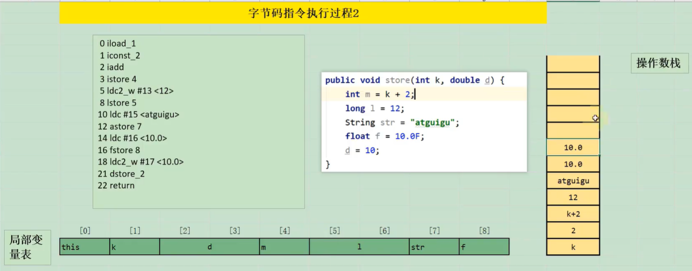
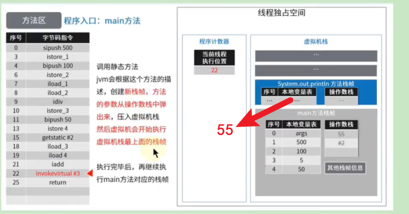

# 2_字节码指令集与解析举例


# 1. 概述


# 2. 加载与存储指令


  


---

## 2.1. 局部变量压栈指令


> iload 从局部变量中装载int类型值
>
>  
>
> lload 从局部变量中装载long类型值
>
>  
>
> fload 从局部变量中装载float类型值
>
>  
>
> dload 从局部变量中装载double类型值
>
>  
>
> aload 从局部变量中装载引用类型值（refernce）
>
>  
>
> iload_0 从局部变量0中装载int类型值
>
>  
>
> iload_1 从局部变量1中装载int类型值
>
>  
>
> iload_2 从局部变量2中装载int类型值
>
>  
>
> iload_3 从局部变量3中装载int类型值
>
>  
>
> lload_0 从局部变量0中装载long类型值
>
>  
>
> lload_1 从局部变量1中装载long类型值
>
>  
>
> lload_2 从局部变量2中装载long类型值
>
>  
>
> lload_3 从局部变量3中装载long类型值
>
>  
>
> fload_0 从局部变量0中装载float类型值
>
>  
>
> fload_1 从局部变量1中装载float类型值
>
>  
>
> fload_2 从局部变量2中装载float类型值
>
>  
>
> fload_3 从局部变量3中装载float类型值
>
>  
>
> dload_0 从局部变量0中装载double类型值
>
>  
>
> dload_1 从局部变量1中装载double类型值
>
>  
>
> dload_2 从局部变量2中装载double类型值
>
>  
>
> dload_3 从局部变量3中装载double类型值
>
>  
>
> aload_0 从局部变量0中装载引用类型值
>
>  
>
> aload_1 从局部变量1中装载引用类型值
>
>  
>
> aload_2 从局部变量2中装载引用类型值
>
>  
>
> aload_3 从局部变量3中装载引用类型值
>
>  
>
> iaload 从数组中装载int类型值
>
>  
>
> laload 从数组中装载long类型值
>
>  
>
> faload 从数组中装载float类型值
>
>  
>
> daload 从数组中装载double类型值
>
>  
>
> aaload 从数组中装载引用类型值
>
>  
>
> baload 从数组中装载byte类型或boolean类型值
>
>  
>
> caload 从数组中装载char类型值
>
>  
>
> saload 从数组中装载short类型值
>


## 局部变量压栈常用指令集
| xload_n | xload_0 | xload_1 | xload_2 | xload_3 |
| --- | --- | --- | --- | --- |
| **iload_n** | iload_0 | iload_1 | iload_2 | iload_3 |
| **lload_n** | lload_0 | lload_1 | lload_2 | lload_3 |
| **fload_n** | fload_0 | fload_1 | fload_2 | fload_3 |
| **dload_n** | dload_0 | dload_1 | dload_2 | dload_3 |
| **aload_n** | aload_0 | aload_1 | aload_2 | aload_3 |


## 局部变量压栈指令剖析


```java
public void load(int num, Object obj, long count, boolean flag, short[] arr) {
	System.out.println(num);
    System.out.println(obj);
    System.out.println(count);
    System.out.println(flag);
    System.out.println(arr);
}
```


---

## 2.2. 常量入栈指令


> aconst_null 将null对象引用压入栈
>
>  
>
> iconst_m1 将int类型常量-1压入栈
>
>  
>
> iconst_0 将int类型常量0压入栈
>
>  
>
> iconst_1 将int类型常量1压入栈
>
>  
>
> iconst_2 将int类型常量2压入栈
>
>  
>
> iconst_3 将int类型常量3压入栈
>
>  
>
> iconst_4 将int类型常量4压入栈
>
>  
>
> iconst_5 将int类型常量5压入栈
>
>  
>
> lconst_0 将long类型常量0压入栈
>
>  
>
> lconst_1 将long类型常量1压入栈
>
>  
>
> fconst_0 将float类型常量0压入栈
>
>  
>
> fconst_1 将float类型常量1压入栈
>
>  
>
> dconst_0 将double类型常量0压入栈
>
>  
>
> dconst_1 将double类型常量1压入栈
>
>  
>
> bipush 将一个8位带符号整数压入栈
>
>  
>
> sipush 将16位带符号整数压入栈
>
>  
>
> ldc 把常量池中的项压入栈
>
>  
>
> ldc_w 把常量池中的项压入栈（使用宽索引）
>
>  
>
> ldc2_w 把常量池中long类型或者double类型的项压入栈（使用宽索引）
>


## 常量入栈常用指令集
| xconst_n | 范围 | xconst_null | xconst_m1 | xconst_0 | xconst_1 | xconst_2 | xconst_3 | xconst_4 | xconst_5 |
| :---: | --- | --- | :---: | :---: | :---: | :---: | :---: | :---: | :---: |
| **iconst_n** | [-1, 5] | | iconst_m1 | iconst_0 | iconst_1 | iconst_2 | iconst_3 | iconst_4 | iconst_5 |
| **lconst_n** | 0, 1 | | | lconst_0 | lconst_1 | | | | |
| **fconst_n** | 0, 1, 2 | | | fconst_0 | fconst_1 | fconst_2 | | | |
| **dconst_n** | 0, 1 | | | dconst_0 | dconst_1 | | | | |
| **aconst_n** | null, String literal, Class literal | aconst_null | | | | | | | |
| **bipush** | 一个字节，2<sup>8</sup>，[-2<sup>7</sup>, 2<sup>7</sup> - 1]，即[-128, 127] | | | | | | | | |
| **sipush** | 两个字节，2<sup>16</sup>，[-2<sup>15</sup>, 2<sup>15</sup> - 1]，即[-32768, 32767] | | | | | | | | |
| **ldc** | 四个字节，2<sup>32</sup>，[-2<sup>31</sup>, 2<sup>31</sup> - 1] | | | | | | | | |
| **ldc_w** | 宽索引 | | | | | | | | |
| **ldc2_w** | 宽索引，long或double | | | | | | | | |


## 常量入栈指令剖析


  


| 类型 | 常数指令 | 范围 |
| --- | --- | --- |
| int(boolean,byte,char,short) | iconst | [-1, 5] |
| | bipush | [-128, 127] |
| | sipush | [-32768, 32767] |
| | ldc | any int value |
| long | lconst | 0, 1 |
| | ldc | any long value |
| float | fconst | 0, 1, 2 |
| | ldc | any float value |
| double | dconst | 0, 1 |
| | ldc | any double value |
| reference | aconst | null |
| | ldc | String literal, Class literal |


  


---

## 2.3. 出栈装入局部变量表指令


> istore 将int类型值存入局部变量
>
>  
>
> lstore 将long类型值存入局部变量
>
>  
>
> fstore 将float类型值存入局部变量
>
>  
>
> dstore 将double类型值存入局部变量
>
>  
>
> astore 将将引用类型或returnAddress类型值存入局部变量
>
>  
>
> istore_0 将int类型值存入局部变量0
>
>  
>
> istore_1 将int类型值存入局部变量1
>
>  
>
> istore_2 将int类型值存入局部变量2
>
>  
>
> istore_3 将int类型值存入局部变量3
>
>  
>
> lstore_0 将long类型值存入局部变量0
>
>  
>
> lstore_1 将long类型值存入局部变量1
>
>  
>
> lstore_2 将long类型值存入局部变量2
>
>  
>
> lstore_3 将long类型值存入局部变量3
>
>  
>
> fstore_0 将float类型值存入局部变量0
>
>  
>
> fstore_1 将float类型值存入局部变量1
>
>  
>
> fstore_2 将float类型值存入局部变量2
>
>  
>
> fstore_3 将float类型值存入局部变量3
>
>  
>
> dstore_0 将double类型值存入局部变量0
>
>  
>
> dstore_1 将double类型值存入局部变量1
>
>  
>
> dstore_2 将double类型值存入局部变量2
>
>  
>
> dstore_3 将double类型值存入局部变量3
>
>  
>
> astore_0 将引用类型或returnAddress类型值存入局部变量0
>
>  
>
> astore_1 将引用类型或returnAddress类型值存入局部变量1
>
>  
>
> astore_2 将引用类型或returnAddress类型值存入局部变量2
>
>  
>
> astore_3 将引用类型或returnAddress类型值存入局部变量3
>
>  
>
> iastore 将int类型值存入数组中
>
>  
>
> lastore 将long类型值存入数组中
>
>  
>
> fastore 将float类型值存入数组中
>
>  
>
> dastore 将double类型值存入数组中
>
>  
>
> aastore 将引用类型值存入数组中
>
>  
>
> bastore 将byte类型或者boolean类型值存入数组中
>
>  
>
> castore 将char类型值存入数组中
>
>  
>
> sastore 将short类型值存入数组中
>
>  
>
> wide指令
>
>  
>
> wide 使用附加字节扩展局部变量索引
>


## 出栈装入局部变量表常用指令集
| xstore_n | xstore_0 | xstore_1 | xstore_2 | xstore_3 |
| :---: | :---: | :---: | :---: | :---: |
| **istore_n** | istore_0 | istore_1 | istore_2 | istore_3 |
| **lstore_n** | lstore_0 | lstore_1 | lstore_2 | lstore_3 |
| **fstore_n** | fstore_0 | fstore_1 | fstore_2 | fstore_3 |
| **dstore_n** | dstore_0 | dstore_1 | dstore_2 | dstore_3 |
| **astore_n** | astore_0 | astore_1 | astore_2 | astore_3 |


## 出栈装入局部变量表指令剖析


  
  


---

# 3. 算术指令


> ## 整数运算
>  
>
> iadd 执行int类型的加法
>
>  
>
> ladd 执行long类型的加法
>
>  
>
> isub 执行int类型的减法
>
>  
>
> lsub 执行long类型的减法
>
>  
>
> imul 执行int类型的乘法
>
>  
>
> lmul 执行long类型的乘法
>
>  
>
> idiv 执行int类型的除法
>
>  
>
> ldiv 执行long类型的除法
>
>  
>
> irem 计算int类型除法的余数
>
>  
>
> lrem 计算long类型除法的余数
>
>  
>
> ineg 对一个int类型值进行取反操作
>
>  
>
> lneg 对一个long类型值进行取反操作
>
>  
>
> iinc 把一个常量值加到一个int类型的局部变量上
>
>  
>
> ## 逻辑运算
>  
>
> ### 移位操作
>  
>
> ishl 执行int类型的向左移位操作
>
>  
>
> lshl 执行long类型的向左移位操作
>
>  
>
> ishr 执行int类型的向右移位操作
>
>  
>
> lshr 执行long类型的向右移位操作
>
>  
>
> iushr 执行int类型的向右逻辑移位操作
>
>  
>
> lushr 执行long类型的向右逻辑移位操作
>
>  
>
> ### 按位布尔运算
>  
>
> iand 对int类型值进行“逻辑与”操作
>
>  
>
> land 对long类型值进行“逻辑与”操作
>
>  
>
> ior 对int类型值进行“逻辑或”操作
>
>  
>
> lor 对long类型值进行“逻辑或”操作
>
>  
>
> ixor 对int类型值进行“逻辑异或”操作
>
>  
>
> lxor 对long类型值进行“逻辑异或”操作
>
>  
>
> ### 浮点运算
>  
>
> fadd 执行float类型的加法
>
>  
>
> dadd 执行double类型的加法
>
>  
>
> fsub 执行float类型的减法
>
>  
>
> dsub 执行double类型的减法
>
>  
>
> fmul 执行float类型的乘法
>
>  
>
> dmul 执行double类型的乘法
>
>  
>
> fdiv 执行float类型的除法
>
>  
>
> ddiv 执行double类型的除法
>
>  
>
> frem 计算float类型除法的余数
>
>  
>
> drem 计算double类型除法的余数
>
>  
>
> fneg 将一个float类型的数值取反
>
>  
>
> dneg 将一个double类型的数值取反
>


## 算术指令集
| 算数指令 | | int(boolean,byte,char,short) | long | float | double |
| --- | --- | --- | --- | --- | --- |
| 加法指令 | | iadd | ladd | fadd | dadd |
| 减法指令 | | isub | lsub | fsub | dsub |
| 乘法指令 | | imul | lmul | fmul | dmul |
| 除法指令 | | idiv | ldiv | fdiv | ddiv |
| 求余指令 | | irem | lrem | frem | drem |
| 取反指令 | | ineg | lneg | fneg | dneg |
| 自增指令 | | iinc | | | |
| 位运算指令 | 按位或指令 | ior | lor | | |
| | 按位或指令 | ior | lor | | |
| | 按位与指令 | iand | land | | |
| | 按位异或指令 | ixor | lxor | | |
| 比较指令 | | | lcmp | fcmpg / fcmpl | dcmpg / dcmpl |


> 注意：NaN(Not a Number)表示不是一个数字
>


## 算术指令举例


### 举例1


```java
public static int bar(int i) {
	return ((i + 1) - 2) * 3 / 4;
}
```


### 举例2


```java
public void add() {
	byte i = 15;
	int j = 8;
	int k = i + j;
}
```


  
  


### 举例3


```java
public static void main(String[] args) {
	int x = 500;
	int y = 100;
	int a = x / y;
	int b = 50;
	System.out.println(a + b);
}
```


  


---

# 4. 类型转换指令


> ## 宽化类型转换
>  
>
> i2l 把int类型的数据转化为long类型
>
>  
>
> i2f 把int类型的数据转化为float类型
>
>  
>
> i2d 把int类型的数据转化为double类型
>
>  
>
> l2f 把long类型的数据转化为float类型
>
>  
>
> l2d 把long类型的数据转化为double类型
>
>  
>
> f2d 把float类型的数据转化为double类型
>
>  
>
> ## 窄化类型转换
>  
>
> i2b 把int类型的数据转化为byte类型
>
>  
>
> i2c 把int类型的数据转化为char类型
>
>  
>
> i2s 把int类型的数据转化为short类型
>
>  
>
> l2i 把long类型的数据转化为int类型
>
>  
>
> f2i 把float类型的数据转化为int类型
>
>  
>
> f2l 把float类型的数据转化为long类型
>
>  
>
> d2i 把double类型的数据转化为int类型
>
>  
>
> d2l 把double类型的数据转化为long类型
>
>  
>
> d2f 把double类型的数据转化为float类型
>

| | **byte** | **char** | **short** | **int** | **long** | **float** | **double** |
| --- | :---: | :---: | :---: | :---: | :---: | :---: | :---: |
| **int** | i2b | i2c | i2s | ○ | i2l | i2f | i2d |
| **long** | l2i i2b | l2i i2c | l2i i2s | l2i | ○ | l2f | l2d |
| **float** | f2i i2b | f2i i2c | f2i i2s | f2i | f2l | ○ | f2d |
| **double** | d2i i2b | d2i i2c | d2i i2s | d2i | d2l | d2f | ○ |


类型转换指令可以将两种不同的数值类型进行相互转换。这些转换操作一般用于实现用户代码中的显式类型转換操作，或者用来处理字节码指令集中数据类型相关指令无法与数据类型一一对应的问题。


## 4.1. 宽化类型转换剖析


> 宽化类型转换( Widening Numeric Conversions)
>
>  
>
> 1. 转换规则
>
>  
>
> Java虚拟机直接支持以下数值的宽化类型转换（ widening numeric conversion,小范围类型向大范围类型的安全转换）。也就是说，并不需要指令执行，包括
>
>  
>
>  
>
> 简化为：int-->long-->float-> double
>
>  
>
> 2. 精度损失问题
>
>  
>
>  
>
> 尽管宽化类型转换实际上是可能发生精度丢失的，但是这种转换永远不会导致Java虚拟机抛出运行时异常
>
>  
>
> 3. 补充说明
>
>  
>
> 从byte、char和 short类型到int类型的宽化类型转换实际上是不存在的。对于byte类型转为int,拟机并没有做实质性的转化处理，只是简单地通过操作数栈交換了两个数据。而将byte转为long时，使用的是i2l,可以看到在内部，byte在这里已经等同于int类型处理，类似的还有 short类型，这种处理方式有两个特点：
>
>  
>
> 一方面可以减少实际的数据类型，如果为 short和byte都准备一套指令，那么指令的数量就会大増，而虚拟机目前的设计上，只愿意使用一个字节表示指令，因此指令总数不能超过256个，为了节省指令资源，将 short和byte当做int处理也在情理之中。
>
>  
>
> 另一方面，由于局部变量表中的槽位固定为32位，无论是byte或者 short存入局部变量表，都会占用32位空间。从这个角度说，也没有必要特意区分这几种数据类型。
>

> 从int类型到long、float或者 double类型。对应的指令为：i21、i2f、i2d
>
>  
>
> 从long类型到float、 double类型。对应的指令为：i2f、i2d
>
>  
>
> 从float类型到double类型。对应的指令为：f2d
>

> 2.1. 宽化类型转换是不会因为超过目标类型最大值而丢失信息的，例如，从int转换到long,或者从int转换到double,都不会丢失任何信息，转换前后的值是精确相等的。
>
>  
>
> 2.2. 从int、long类型数值转换到float,或者long类型数值转换到double时，将可能发生精度丢失一一可能丢失掉几个最低有效位上的值，转换后的浮点数值是根据IEEE754最接近含入模式所得到的正确整数值。
>


## 4.2. 窄化类型转换剖析


> 窄化类型转换( Narrowing Numeric Conversion)
>
>  
>
> 1. 转换规则
>
>  
>
> Java虚拟机也直接支持以下窄化类型转换：
>
>  
>
>  
>
> 2. 精度损失问题
>
>  
>
> 窄化类型转换可能会导致转换结果具备不同的正负号、不同的数量级，因此，转换过程很可能会导致数值丢失精度。
>
>  
>
> 尽管数据类型窄化转换可能会发生上限溢出、下限溢出和精度丢失等情况，但是Java虚拟机规范中明确规定数值类型的窄化转换指令永远不可能导致虚拟机抛出运行时异常
>
>  
>
> 3. 补充说明
>
>  
>

> 从主int类型至byte、 short或者char类型。对应的指令有：i2b、i2c、i2s
>
>  
>
> 从long类型到int类型。对应的指令有：l2i
>
>  
>
> 从float类型到int或者long类型。对应的指令有：f2i、f2l
>
>  
>
> 从double类型到int、long或者float类型。对应的指令有：d2i、d2l、d2f
>

> 3.1. 当将一个浮点值窄化转换为整数类型T(T限于int或long类型之一)的时候，将遵循以下转换规则：
>
>  
>
>  
>
> 3.2. 当将一个double类型窄化转换为float类型时，将遵循以下转换规则
>
>  
>
>  
>

> 如果浮点值是NaN,那转换结果就是int或long类型的0.
>
>  
>
> 如果浮点值不是无穷大的话，浮点值使用IEEE754的向零含入模式取整，获得整数值Vv如果v在目标类型T(int或long)的表示范围之内，那转换结果就是v。否则，将根据v的符号，转换为T所能表示的最大或者最小正数
>

> 通过向最接近数舍入模式舍入一个可以使用float类型表示的数字。最后结果根据下面这3条规则判断
>
>  
>
> 如果转换结果的绝对值太小而无法使用float来表示，将返回float类型的正负零
>
>  
>
> 如果转换结果的绝对值太大而无法使用float来表示，将返回float类型的正负无穷大。
>
>  
>
> 对于double类型的NaN值将按规定转換为float类型的NaN值。
>

---

# 5. 对象的创建与访问指令


> ## 对象操作指令
>  
>
> new 创建一个新对象
>
>  
>
> getfield 从对象中获取字段
>
>  
>
> putfield 设置对象中字段的值
>
>  
>
> getstatic 从类中获取静态字段
>
>  
>
> putstatic 设置类中静态字段的值
>
>  
>
> checkcast 确定对象为所给定的类型。后跟目标类，判断栈顶元素是否为目标类 / 接口的实例。如果不是便抛出异常
>
>  
>
> instanceof 判断对象是否为给定的类型。后跟目标类，判断栈顶元素是否为目标类 / 接口的实例。是则压入 1，否则压入 0
>
>  
>
> ## 数组操作指令
>  
>
> newarray 分配数据成员类型为基本上数据类型的新数组
>
>  
>
> anewarray 分配数据成员类型为引用类型的新数组
>
>  
>
> arraylength 获取数组长度
>
>  
>
> multianewarray 分配新的多维数组
>


Java是面向对象的程序设计语言，虚拟机平台从字节码层面就对面向对象做了深层次的支持。有一系列指令专门用于对象操作，可进一步细分为创建指令、字段访问指令、数组操作指令、类型检查指令。


## 5.1. 创建指令
| 创建指令 | 含义 |
| :--- | :--- |
| new | 创建类实例 |
| newarray | 创建基本类型数组 |
| anewarray | 创建引用类型数组 |
| multilanewarra | 创建多维数组 |


## 5.2. 字段访问指令
| 字段访问指令 | 含义 |
| :--- | :--- |
| getstatic、putstatic | 访问类字段（static字段，或者称为类变量）的指令 |
| getfield、 putfield | 访问类实例字段（非static字段，或者称为实例变量）的指令 |


  


## 5.3. 数组操作指令
| 数组指令 | byte(boolean) | char | short | long | long | float | double | reference |
| --- | --- | --- | --- | --- | --- | --- | --- | --- |
| **xaload** | baload | caload | saload | iaload | laload | faload | daload | aaload |
| **xastore** | bastore | castore | sastore | iastore | lastore | fastore | dastore | aastore |


  


## 5.4. 类型检查指令
| 类型检查指令 | 含义 |
| --- | --- |
| instanceof | 检查类型强制转换是否可以进行 |
| checkcast | 判断给定对象是否是某一个类的实例 |


---

# 6. 方法调用与返回指令


> ## 方法调用指令
>  
>
> invokcvirtual 运行时按照对象的类来调用实例方法
>
>  
>
> invokespecial 根据编译时类型来调用实例方法
>
>  
>
> invokestatic 调用类（静态）方法
>
>  
>
> invokcinterface 调用接口方法
>
>  
>
> ## 方法返回指令
>  
>
> ireturn 从方法中返回int类型的数据
>
>  
>
> lreturn 从方法中返回long类型的数据
>
>  
>
> freturn 从方法中返回float类型的数据
>
>  
>
> dreturn 从方法中返回double类型的数据
>
>  
>
> areturn 从方法中返回引用类型的数据
>
>  
>
> return 从方法中返回，返回值为void
>


## 6.1. 方法调用指令
| 方法调用指令 | 含义 |
| --- | --- |
| invokevirtual | 调用对象的实例方法 |
| invokeinterface | 调用接口方法 |
| invokespecial | 调用一些需要特殊处理的实例方法，包括实例初始化方法（构造器）、私有方法和父类方法 |
| invokestatic | 调用命名类中的类方法（static方法） |
| invokedynamic | 调用动态绑定的方法 |


## 6.2. 方法返回指令
| 方法返回指令 | void | int | long | float | double | reference |
| --- | --- | --- | --- | --- | --- | --- |
| **xreturn** | return | ireturn | lreturn | freutrn | dreturn | areturn |


  


```java
public int methodReturn() {
    int i = 500;
    int j = 200;
    int k = 50;
    
    return (i + j) / k;
}
```


---

# 7. 操作数栈管理指令


> ## 通用(无类型）栈操作
>  
>
> nop 不做任何操作
>
>  
>
> pop 弹出栈顶端一个字长的内容
>
>  
>
> pop2 弹出栈顶端两个字长的内容
>
>  
>
> dup 复制栈顶部一个字长内容
>
>  
>
> dup_x1 复制栈顶部一个字长的内容，然后将复制内容及原来弹出的两个字长的内容压入栈
>
>  
>
> dup_x2 复制栈顶部一个字长的内容，然后将复制内容及原来弹出的三个字长的内容压入栈
>
>  
>
> dup2 复制栈顶部两个字长内容
>
>  
>
> dup2_x1 复制栈顶部两个字长的内容，然后将复制内容及原来弹出的三个字长的内容压入栈
>
>  
>
> dup2_x2 复制栈顶部两个字长的内容，然后将复制内容及原来弹出的四个字长的内容压入栈
>
>  
>
> swap 交换栈顶部两个字长内容
>


  


---

# 8. 控制转移指令


> ## 比较指令
>  
>
> lcmp 比较long类型值
>
>  
>
> fcmpl 比较float类型值（当遇到NaN时，返回-1）
>
>  
>
> fcmpg 比较float类型值（当遇到NaN时，返回1）
>
>  
>
> dcmpl 比较double类型值（当遇到NaN时，返回-1）
>
>  
>
> dcmpg 比较double类型值（当遇到NaN时，返回1）
>
>  
>
> ## 条件分支指令
>  
>
> ifeq 如果等于0，则跳转
>
>  
>
> ifne 如果不等于0，则跳转
>
>  
>
> iflt 如果小于0，则跳转
>
>  
>
> ifge 如果大于等于0，则跳转
>
>  
>
> ifgt 如果大于0，则跳转
>
>  
>
> ifle 如果小于等于0，则跳转
>
>  
>
> ## 比较条件分支指令
>  
>
> if_icmpeq 如果两个int值相等，则跳转
>
>  
>
> if_icmpne 如果两个int类型值不相等，则跳转
>
>  
>
> if_icmplt 如果一个int类型值小于另外一个int类型值，则跳转
>
>  
>
> if_icmpge 如果一个int类型值大于或者等于另外一个int类型值，则跳转
>
>  
>
> if_icmpgt 如果一个int类型值大于另外一个int类型值，则跳转
>
>  
>
> if_icmple 如果一个int类型值小于或者等于另外一个int类型值，则跳转
>
>  
>
> ifnull 如果等于null，则跳转
>
>  
>
> ifnonnull 如果不等于null，则跳转
>
>  
>
> if_acmpeq 如果两个对象引用相等，则跳转
>
>  
>
> if_acmpne 如果两个对象引用不相等，则跳转
>
>  
>
> ## 多条件分支跳转指令
>  
>
> tableswitch 通过索引访问跳转表，并跳转
>
>  
>
> lookupswitch 通过键值匹配访问跳转表，并执行跳转操作
>
>  
>
> ## 无条件跳转指令
>  
>
> goto 无条件跳转
>
>  
>
> goto_w 无条件跳转（宽索引）
>


## 8.1. 比较指令


> 比较指令的作用是比较占栈顶两个元素的大小，并将比较结果入栽。
>
>  
>
> 比较指令有： dcmpg,dcmpl、 fcmpg、fcmpl、lcmp
>
>  
>
> 与前面讲解的指令类似，首字符d表示double类型，f表示float,l表示long.
>
>  
>
> 对于double和float类型的数字，由于NaN的存在，各有两个版本的比较指令。以float为例，有fcmpg和fcmpl两个指令，它们的区别在于在数字比较时，若遇到NaN值，处理结果不同。
>
>  
>
> 指令dcmpl和 dcmpg也是类似的，根据其命名可以推测其含义，在此不再赘述。
>
>  
>
> 举例
>
>  
>
> 指令 fcmp和fcmpl都从中弹出两个操作数，并将它们做比较，设栈顶的元素为v2,顶顺位第2位的元素为v1,若v1=v2,则压入0:若v1>v2则压入1:若v1<v2则压入-1.
>
>  
>
> 两个指令的不同之处在于，如果遇到NaN值， fcmpg会压入1,而fcmpl会压入-1
>


## 8.2. 条件跳转指令
| < | <= | == | != | >= | > | null | not null |
| --- | --- | --- | --- | --- | --- | --- | --- |
| iflt | ifle | ifeq | ifng | ifge | ifgt | ifnull | ifnonnull |


  


## 8.3. 比较条件跳转指令
| < | <= | == | != | >= | > |
| --- | --- | --- | --- | --- | --- |
| if_icmplt | if_icmple | if_icmpeq、if_acmpeq | if_icmpne、if_acmpne | if_icmpge | if_icmpgt |


## 8.4. 多条件分支跳转


  
  


## 8.5. 无条件跳转


---

# 9. 异常处理指令


> ## 异常处理指令
>  
>
> athrow 抛出异常或错误。将栈顶异常抛出
>
>  
>
> jsr 跳转到子例程
>
>  
>
> jsr_w 跳转到子例程（宽索引）
>
>  
>
> rct 从子例程返回
>


  
  
  


---

# 10. 同步控制指令


> ### 线程同步
>  
>
> montiorenter 进入并获取对象监视器。即：为栈顶对象加锁
>
>  
>
> monitorexit 释放并退出对象监视器。即：为栈顶对象解锁
>


Java虚拟机支持两种同步结构：方法级的同步和方法内部一段指令序列的同步，这两种同步都是使用monitor来支持的


## 10.1. 方法级的同步


```java
private int i = 0;
public synchronized void add() {
	i++;
}
```


  


## 10.2. 方法内指令指令序列的同步


  
  
  


---


> 更新: 2022-07-11 18:51:26  
> 原文: <https://www.yuque.com/like321/vgtdsx/ovnp0u>