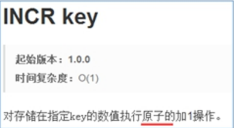
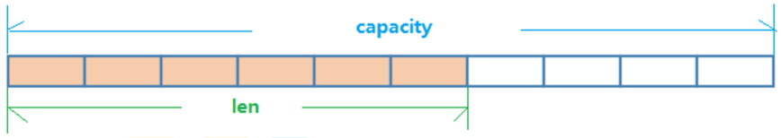
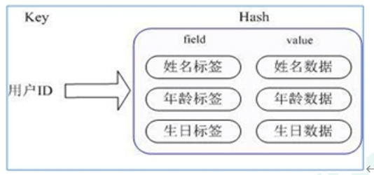
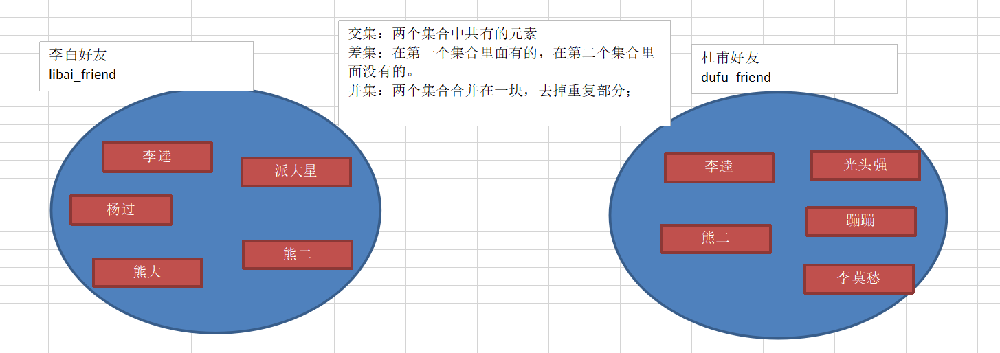
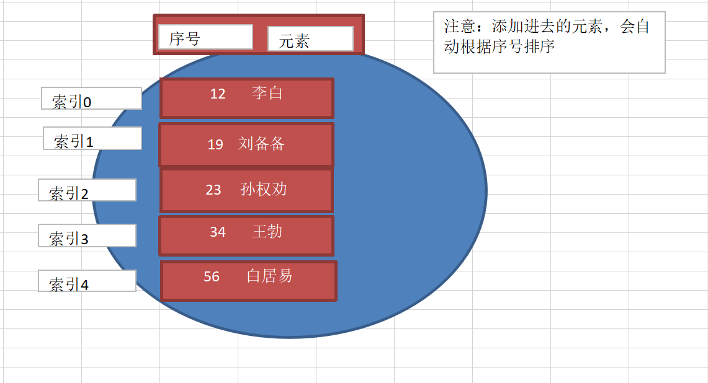
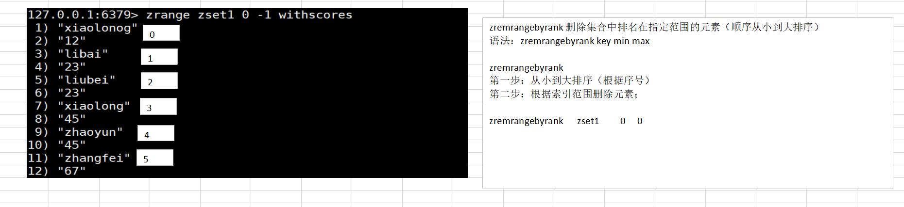
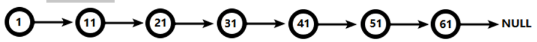
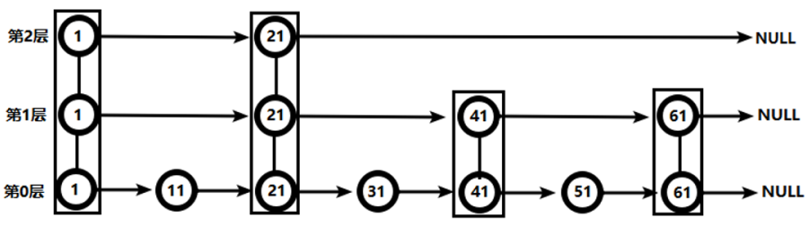
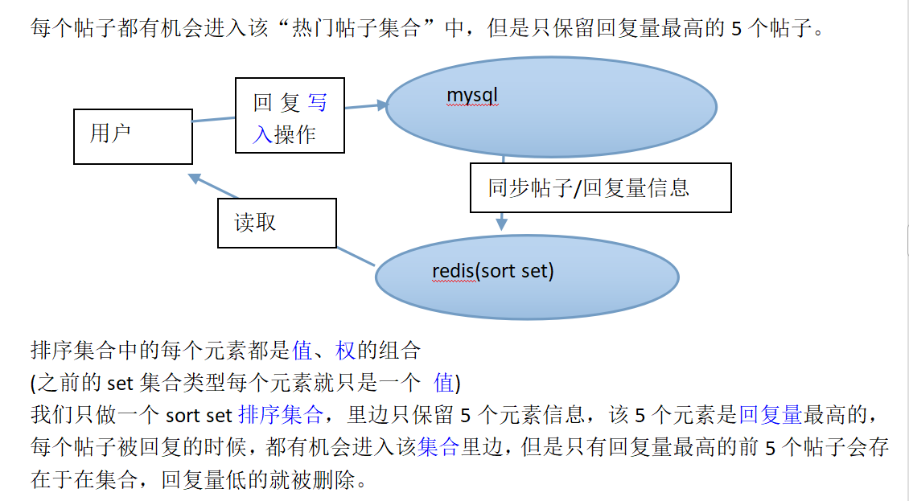
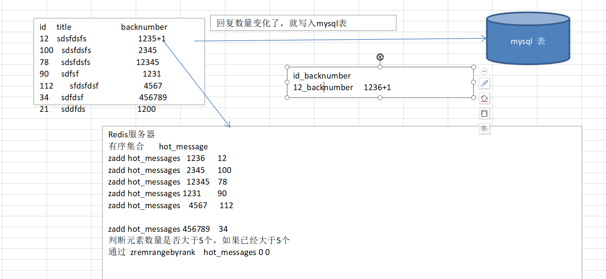

# 三、常用五大数据类型

哪里去获得redis常见数据类型操作命令：[http://www.redis.cn/commands.html](http://www.redis.cn/commands.html)


# 1、Redis键（key）


## key命名规范


key 单词与单词之间以 ： 分开


一般情况下：


> 第一段放置项目名或缩写，如 project
>
>  
>
> 第二段把表名转换为key前缀，如 user:
>
>  
>
> 第三段放置用于区分区key的字段，对应mysql中的主键的列名，如 userid
>
>  
>
> 第四段放置主键值，如18,16
>


例：


```plain
#项目名:表名:主键名:主键值
project:user:userid:3506728370			{id:3506728370,name:春晚,fans:12210947,blogs:6164,focus:83}

#表名:主键名:主键值:属性名	
user:id:3506728370:fans      12210947

user:id:3506728370:blogs     6164

user:id:3506728370:focus     83
```


## key基本操作


+  del key  该命令用于在 key 存在时删除 key。  
例：  
del name 


+  unlink key  根据value选择非阻塞删除  
仅将keys从keyspace元数据中删除，真正的删除会在后续异步操作。 


+  exists key   判断一个 key 是否存在。  
返回值：  
1代表存在(表示存在的数量)，0代表不存在  
例：  
exists name  
//1  
exists name  
//1  
exists age  
//1 
+  type key   返回 key 所储存的值的类型。  
例：  
type email  
//string  
type user2  
//hash  
type user_list  
//list 


## key时效性控制


**1、为指定key设置有效期**


+  expire key seconds 	为给定 key 设置过期时间，以秒计。  
例：  
expire user_list 10 
+  pexpire key milliseconds 	设置 key 的过期时间以毫秒计。 
+  expireat key timestamp 


> expireat 的作用和 expire 类似，都用于为 key 设置过期时间。  
不同在于 expireat 命令接受的时间参数是 unix 时间戳(unix timestamp)。
>


+ pexpireat key milliseconds-timestamp 	设置 key 过期时间的时间戳(unix timestamp) 以毫秒计


**2、获取key的有效时间**


+  ttl key 	以秒为单位，返回给定 key 的剩余生存时间(ttl, time to live)。  
返回值：-1表示永不过期，-2表示已过期  
例：  
ttl user_list 
+  pttl key 	以毫秒为单位返回 key 的剩余的过期时间。 


**3、切换key从时效性转换为永久性**


+ persist key 	移除 key 的过期时间，key 将持久保持。


## key查询


1、keys  pattern	返回当前数据库里面的键


> * 匹配任意数量的任意符号
>
>  
>
> ? 配合一个任意符号
>
>  
>
> [] 匹配一个指定符号
>


例：


```plain
keys *  查询所有

keys it* 查询所有以it开头

keys *heima 查询所有以heima结尾

keys ??heima 查询所有前面两个字符任意，后面以heima结尾

keys user:? 查询所有以user:开头，最后一个字符任意

keys u[st]er:1 查询所有以u开头，以er:1结尾，中间包含一个字母，s或t
```


## 其他key通用操作


+  rename key newkey 	修改 key 的名称 
+  renamenx key newkey 	仅当 newkey 不存在时，将 key 改名为 newkey 


+  sort	对所有key排序 
+  dump key 	序列化给定 key ，并返回被序列化的值。 


## db操作


+  select  
选择数据库，在redis里面默认有0-15号数据库，  
默认在0号数据库操作，可以通过redis.conf配置文件进行设置  
语法：  
select 数据库的编号  
例： 

```plain
select 1
// ok

keys *
// empty lisr or set

select 0
// ok 

keys *
//email
```

 

+  move key db 	将当前数据库的 key 移动到给定的数据库 db 当中。  
例：  
move name 1 


+  flushdb (慎重使用)	清空当前数据库里面所有的键  
例： 

```plain
flushdb
//ok
keys *
//empty list or set
```

 

+  flushall (慎重使用)	清空所有数据库里面的所有的键 
+  dbsize  	返回当前数据库里面键的个数  
例：  
dbsize  
// 8 
+  randomkey 	从当前数据库中随机返回一个 key 。 


# 2、Redis 字符串 (String)


## 简介


String是Redis最基本的类型，你可以理解成与Memcached一模一样的类型，一个key对应一个value。


String类型是二进制安全的。意味着Redis的string可以包含任何数据。比如jpg图片或者序列化的对象。


String类型是Redis最基本的数据类型，一个Redis中字符串value最多可以是512M


## 基本操作


+  set  添加/修改数据  
语法：  
set 键名称 值  
返回值：  
设置成功返回ok，设置失败返回nil  
例：  
添加一个name="xiaoqian"的键值对  
set name xiaoqian  
注意：  
重新设置则直接覆盖。 
+  get  
获取key对应的string值，如果key不存在返回nil  
语法：  
get key  
如果key不是string类型，返回错误信息。 
+  del  删除数据  
语法：	  
del key 
+  mset  
语法：  
mset key value [key value]  
同时设置多个key，如果key存在会覆盖，  
该命令是原子的，所有的键会同时设置成功或失败，成功返回ok  
例：  
mset name xiaohei age 12 email [xiaohei@163.com](mailto:xiaohei@163.com) 
+  mget  
语法：  
mget key [key...]  
查询所有key的值  
返回值：  
列出所有键的值，绝不会执行失败，  
如果键是string类型，返回其值，  
如果键不存在或者不是string类型，返回nil  
例：  
mget name email title  
// xiaohei  
// [xiaogei@163.com](mailto:xiaogei@163.com)  
// nil 
+  strlen  返回key的字符串长度  
语法：  
strlen key  
返回值：  
如果key不存在返回0  
如果不是字符串类型，返回错误信息。  
例：  
set age 300 

```plain
  strlen age //3
```

 

+  append 追加信息到原始信息后部(如果原始信息存在就追加，否则新建)  
语法：  
append key value  
例：  
append age 200  
get age //300200 


## 数值增减


+  incr  
对key的值做加加操作，每执行一次值加1，值类型要是数据类型。  
语法：  
incr key  
将key中存储的数字值增一操作，  
如果key不存在，则key的值会先被初始化为0，  
然后再执行incr操作，key的值必须是整型。  
例：age原先12  
incr age  
//13 
+  incrby  
执行加法的命令，可以指定相加的值  
语法：  
incrby key 相加的值 
+  decr(减1)  decrby(减指定的值) 


注意：


> string在redis内部存储默认就是一个字符串，当遇到增减类操作incr，decr时会转成数值型进行计算
>
>  
>
> redis所有的操作都是原子性的，采用单线程处理所有业务，命令是一个一个执行的，因此无需考虑并发带来的数据影响。
>





所谓**原子**操作是指不会被线程调度机制打断的操作；


这种操作一旦开始，就一直运行到结束，中间不会有任何 context switch （切换到另一个线程）。


（1）在单线程中， 能够在单条指令中完成的操作都可以认为是"原子操作"，因为中断只能发生于指令之间。


（2）在多线程中，不能被其它进程（线程）打断的操作就叫原子操作。


		Redis单命令的原子性主要得益于Redis的单线程。


## 时效性


+  setex	设置失效时间  
语法：  
setex key seconds value  
给一个键设置为字符串类型，并指定生存时间(单位：秒)，  
该命令是原子的，如果设置失败或指定生存时间失败，会恢复初始状态。  
返回值：  
如果设置成功，返回ok，如果设置失败，返回错误信息。  
例： 

```plain
setex height 10 198
```

 


## 其他


+  setnx	(判断键是否存在)  
语法：  
setnx key value  
如果key不存在，将其设置为字符串类型  
返回值：  
如果设置成功，返回1，设置失败，返回0  
例：name已经存在时，body不存在  
setnx name xiaobai  
// 0  
setnx body 1234  
//1 


+  msetnx  .....  
同时设置一个或多个 key-value 对，当且仅当所有给定 key 都不存在。  
**原子性，有一个失败则都失败** 
+  getrange <起始位置><结束位置>  
获得值的范围，类似java中的substring，**前包，后包** 

```plain
set name lucymary

getrange name 0 3  //lucy
```

 

+  setrange <起始位置>  
用  覆写所储存的字符串值，从<起始位置>开始(**索引从0开始**)。 

```plain
setrange name 3 abc

get name //lucabcry
```

 

+  getset  
语法：  
getset key value  
原子的给一个key设置新值，并且将旧值返回，  
返回值：  
如果key不是字符串类型，返回一个错误  
应用场景：  
比如获取计数器并且重置为0。  
例： 

```plain
get name
//xiaohei
getset name xiaohuihui
//xiaohei
get name
//xiaohuihui
```

 


## 数据结构


String的数据结构为简单动态字符串(Simple Dynamic String,缩写SDS)。


是可以修改的字符串，内部结构实现上类似于Java的ArrayList，采用预分配冗余空间的方式来减少内存的频繁分配.





如图中所示，内部为当前字符串实际分配的空间capacity一般要高于实际字符串长度len。


当字符串长度小于1M时，扩容都是加倍现有的空间，如果超过1M，扩容时一次只会多扩1M的空间。


需要注意的是字符串最大长度为512M。


# 3、Redis 哈希（Hash）


Redis hash 是一个键值对集合。


Redis hash是一个string类型的field和value的映射表，hash特别适合用于存储对象。


类似Java里面的Map<String,Object>


用户ID为查找的key，存储的value用户对象包含姓名，年龄，生日等信息，





**通过 key(用户ID) + field(属性标签) 就可以操作对应属性数据了，既不需要重复存储数据，也不会带来序列化和并发修改控制的问题**


## 基本操作


+  hset	设置哈希里面的field和value的值。  
语法：  
hset key field value  
例：  
hset user1 name xiaobai  
hset user1 age 12  
hset user1 email [xiaobai@sohu.com](mailto:xiaobai@sohu.com) 
+  hget	获取哈希里面的field的值  
语法：  
hget key 指定的field  
例：  
hget user1 name  
//xiaobai  
hget user1 age  
//12 
+  hgetall	获取指定哈希中所有的field和value  
语法：  
hgetall key  
例： 

```plain
hgetall user:id:2

//name
//xiaohong
//age
//12
//email
//xiaohong@sohu.com
```

 

+  hmset	一次性设置多个field和value。  
语法：  
hmset key field1 value1 field2 value2  
例： 

```plain
hmset user:id:2 name xiaohong age 12 email xiaohong@sohu.com
```

 

+  hmget	一次性获取 多个field的value  
语法：  
hmget key field1 field2......  
例： 

```plain
hmget user:id:2 name age email
//xiaohong
//12
//xiaohong@souhu.com
```

 


+  hsetnx 将哈希表 key 中的域 field 的值设置为 value ，当且仅当域 field 不存在 .  
语法：  
hsetnx  
+  hexists	获取哈希表中是否存在指定的字段  
语法：  
hexists key field  
例： 

```plain
hexists user:id:2 age
```

 


+  hlen 	获取哈希表中字段的数量  
语法：  
hlen key  
例： 

```plain
hlen user:id:2
//3
```

  
注意：  
看的是field的数量 


## 删除


+  hdel	删除数据  
语法：  
hdel field1 [field2] 


## 其他


+  hkeys	获取哈希表中所有的字段名  
语法：  
hkeys key 
+  hvals	获取哈希表中所有的字段值  
语法：  
hvals key 
+  设置指定字段的数值数据增加指定范围的值  
hincrby key field increment  
hincrbyfloat key field increment 


## 数据结构


Hash类型对应的数据结构是两种：ziplist（压缩列表），hashtable（哈希表）。


当field-value长度较短且个数较少时，使用ziplist，否则使用hashtable。


## 案例


**hash实现购物车**


业务分析


+  仅分析购物车的redis存储模型：添加、浏览、更改数量、删除、清空 
+  购物车与数据库间持久化同步(不讨论) 
+  购物车与订单间关系(不讨论)  
	提交购物车：读取数据生成订单  
	商家临时价格调整：隶属于订单级别 
+  未登录用户购物车信息存储(不讨论)  
	cookie存储 


解决方案：


+  以客户id作为key，每位客户创建一个hash存储结构存储对应的购物车信息 
+  将商品编号作为field，购买数量作为value进行存储 
+  添加商品：追加全新的field与value 
+  浏览：遍历hash 
+  更改数量：自增/自减，设置value值 
+  删除商品：删除field 
+  清空：删除key 


```plain
hmset user:id:1 g1 100 g2 200
hmset user:id:2 g2 1 g4 7 g5 100

//添加商品
hset user:id:1 g3 5

//查看购物车
hgetall user:id:1

//删除商品
hdel user:id:1 g1

//更改数量
hincrby user:id:1 g3 100
```


当前设计仅仅是将数据存储到了redis中，并没有起到加速的作用，商品信息还需要二次查询数据库


+  每条购物车中的商品记录保存成两条field 
+  field1专用于保存购买数量 
    - 命名格式：商品id:nums
    - 保存数据：数值
+  field2专用于保存购物车中显示的信息，包含文字描述，图片地址，所属商家信息等 
    - 命名格式：商品id:info
    - 保存数据：json


```plain
hmset user:id:3 g1:nums 100 g1:info {……}
hmset user:id:4 g1:nums 100 g1:info {……}
```


当前设计有很大的冗余，商品信息重复存储了


+ 可以把商品信息做成单独的hash


```plain
hset user:id:3 g1:nums 200 
hsetnx goods:info g1:info {……}

hset user:id:4 g1:nums 100 
hsetnx goods:info g1:info {……}
```


**hash实现抢购**


销售手机充值卡的商家对移动、联通、电信的30元、50元、100元商品推出抢购活动，每种商品抢购上限1000张


解决方案：


+  将商家id作为key 
+  将参与抢购的商品id作为field 
+  将参与抢购的商品数量作为对应的value 
+  抢购时使用降值的方式控制产品数量 
+  实际业务中还有超卖等实际问题，这里不做讨论 


```plain
hmset business:id:1 c30 1000 c50 1000 c100 1000

hincrby business:id:1 c50 -1
```


# 4、Redis 列表（List）


## 简介


单键多值


Redis 列表是简单的字符串列表，按照插入顺序排序。


你可以添加一个元素到列表的头部（左边）或者尾部（右边）。


它的底层实际是个双向链表，对两端的操作性能很高，通过索引下标的操作中间的节点性能会较差。


应用场景：


> 粉丝列表  
最新文章  
消息队列等
>


## 添加/修改


+  lpush    从链表的头部添加一个或多个元素  
语法：  
lpush key value1 [value2]  
操作为原子性操作，如果key不存在，一个空列表会被创建并执行lpush操作。  
返回值：  
执行lpush命令后，列表的长度。  
例： 

```plain
lpush user_list libai
//1
lpush user_list lihei
//2
lpush user_list songjiang
//3
```

  
 

+  rpush 	从链表的尾部添加元素  
语法：  
rpush key value1 [value2]  
例：  
rpush user_list wusong  
//5  
lrange user_list 0 -1  
//wuyong  
//dufu  
//lihei  
//libai  
//wusong 
+  linsert	将元素插入到链表中某个元素之前或之后  
语法：  
linsert key before|after 链表中的某个元素 新的元素  
返回值：  
执行成功，返回插入操作完成之后，列表的长度  
如果没有找到链表中的元素，返回-1  
如果链表不存在或空链表，返回0  
例： 

```plain
linsert user_list before lihei dufu
//4
```

 

+  lset(改值)	修改链表中指定下标的元素。  
语法：  
lset key 下标 新值  
例：  
lset user_list 0 wuyong  
lrange user_list 0 -1  
//wuyong  
//dufu  
//lihei  
//libai 


+  rpoplpush        从列表右边吐出一个值，插到列表左边  
例： 

```plain
rpoplpush k1 k2
```

 


## 获取


+  lrange   获取链表里面的元素  
语法：  
lrange key start(索引) stop(索引)  
注意：  
如果开始下标是0，结束下标是-1，则返回链表中所有的元素。  
链表里面的元素是序号的(从0开始，头部开始)，类似于索引数组。  
例： 

```plain
lrange user_list 0 -1
//songjiang
//lihei
//libai
```

 

+  lindex 	返回列表中指定下标的元素  
语法：  
lindex key index  
例： 

```plain
lindex user_list 2
//lihei
```

 

+  llen	返回列表的长度  
语法：  
llen key  
例： 

```plain
llen user_list
//5
```

 


## 获取并移除


+  lpop	删除并返回链表中头部的元素  
语法：  
lpop key  
例：  
lpop user_list  
//wuyong  
lrange user_list 0 -1  
//dufu  
//lihei  
//libai  
//wusong 
+  rpop	删除并返回链表尾部的元素  
语法：  
rpop key 


## 删除


+  lrem	删除链表中的元素  
语法：  
lrem key count value 

> 根据参数count的值，删除链表中与value相等的元素。  
count>0，  
从表头开始向表尾搜索，删除与value相等的元素，数量为count。  
count<0,  
从表尾开始向表头搜索，删除与value相等的元素，数量为count。  
count=0，  
删除表中所有与value相等的值。
>

  
返回值：  
被删除的元素的数量。  
例：   
 

+  ltrem	保留指定范围的元素，其他的删除  
语法：  
ltrim 链表的名称 开始下标 结束下标  
例：  
lrange user_list 0 -1  
//lihei  
//dufu  
//libai  
//wusong  
ltrim user_list 1 2  
//ok  
lrange user_list 0 -1  
//dufu  
//libai 


## 阻塞数据获取


规定时间内获取并移除数据


+  blpop key1 [key2] timeout  
例： 

```plain
blpop list0 30
```

 

+  brpop key1 [key2] timeout 


## 数据结构


List的数据结构为快速链表quickList。


首先在列表元素较少的情况下会使用一块连续的内存存储，这个结构是ziplist，也即是压缩列表。


它将所有的元素紧挨着一起存储，分配的是一块连续的内存。


当数据量比较多的时候才会改成quicklist。


因为普通的链表需要的附加指针空间太大，会比较浪费空间。比如这个列表里存的只是int类型的数据，结构上还需要两个额外的指针prev和next。


Redis将链表和ziplist结合起来组成了quicklist。


也就是将多个ziplist使用双向指针串起来使用。这样既满足了快速的插入删除性能，又不会出现太大的空间冗余。


## 案例


**一个网站中，想要获取最新登录的10个用户**


> 如果通过list链表实现以上功能，可以在list链表中只保留最新的10个数据，每进来一个新数据就删除一个旧数据。
>
>  
>
> 每次就可以从链表中直接获得需要的数据。极大节省各方面资源消耗。
>


```plain
例：
	lpush user_login songjiang 
	
	if (llen(user_login)>10) {
		//从尾部弹出元素
		rpop user_login
	}

	//查
	lrange user_login 0 -1
```


**案例：秒杀**


> 原理：  
使用redis链表中队列，进行pop操作，  
因为pop操作是原子的，即使有很多用户同时到达，也是依次执行。
>


```php
$redis = new redis();
$redis->connect('127.0.0.1',6379); 
$redis->auth('321612');

//1、先将商品库存加入队列
//商品数量
$goods_num = 100;
//添加到队列
for ($i=0; $i < $goods_num; $i++) { 
	$redis -> lpush('goods_store',1); //实际存商品id
}
```


```php
$redis = new redis();
$redis->connect('127.0.0.1',6379); 
$redis->auth('321612');

//2、开始抢购
//设置库存的失效时间
$redis->settimeout('goods_store',30);
```


```php
$redis = new redis();
$redis->connect('127.0.0.1',6379); 
$redis->auth('321612');

//3、客户端执行下单操作，下单前判断redis队列库存量
$id = $redis->lpop('goods_store');
if(!$id){
	echo '抢购失败！';
	return;  
}

echo '抢购成功！'; 
//跳转到下单页面，完成下单操作
```


**案例：注册发邮箱**


register.php


```php
$username = $_post['username'];
$email = $_post['email'];
//完成注册，插入到mysql数据库

//发送邮件到邮箱，让用户激活

$redis = new redis();
$redis->connect('127.0.0.1');
$redis->auth('321612');

//把发送邮件的操作添加到一个队列里面(异步操作)
$redis->lpush('email',json_encode(['email'=>$email,'username'=>$username]));
echo  'register success';
```


send_email.php


```php
$redis = new redis();
$redis->connect('127.0.0.1');
$redis->auth('321612');

//根据列表里面的队列执行发送邮件的操作
while(true){
    $info = $redis->lpop('email');
    
    //发送邮件
    
}
```


# 5、Redis 集合（Set）


## 简介


Redis set对外提供的功能与list类似是一个列表的功能，特殊之处在于set是可以**自动排重**的，当你需要存储一个列表数据，又不希望出现重复数据时，set是一个很好的选择，并且set提供了判断某个成员是否在一个set集合内的重要接口，这个也是list所不能提供的。


Redis的Set是string类型的**无序集合。它底层其实是一个value为null的hash表**，所以添加，删除，查找的**复杂度都是O(1)**。


一个算法，随着数据的增加，执行时间的长短，如果是O(1)，数据增加，查找数据的时间不变


## 基本操作


+  sadd    将一个或多个 member 元素加入到集合 key 中，已经存在的 member 元素将被忽略  
语法：  
sadd key member1 [member2]  
例： 

```plain
sadd libai_friend likui
// 1
sadd libai_friend xionger
// 1
sadd libai_friend xiongda
// 1
sadd libai_friend yangguo limochou
// 2
```

 

+  smembers   获取集合中的全部元素  
语法：  
smembers key  
例： 

```plain
smembers libai_friend
//xiongda
//xionger
//limochou
//likui
//yangguo
```

 


+  scard 	获取集合中元素的个数  
语法：  
scard 集合名称  
例：  
scard libai_friend  
// 6  
scard dufu_friend  
// 5 


+  sismember  判断集合中是否包含指定数据  
语法：	  
sismember key member 
+  smove  把集合中一个值从一个集合移动到另一个集合  
语法：  
	smove   value  
例： 

```plain
#把u2的w1移动到u1里
smove u2 u1 w1
```

 

+  srem 	删除集合中的元素  
语法：  
srem  key member1 member2 


## 操作随机数据


+  spop	随机获取集合中的某个数据并将该数据移出集合  
语法：  
spop  key  
例： 

```plain
spop news 
//n5
```

 


+  srandmember	随机从该集合中取出n个值。不会从集合中删除  
语法：  
srandmember  key [count]  
例：  
sadd news n1	  
sadd news n2	  
sadd news n3	  
sadd news n4  
srandmember news 2  
//n4  
//n1  
srandmember news 2  
//n2  
//n1 


## 交并差集


交集：两个集合中共有的元素


差集：在第一个集合里面有的，在第二个集合里面没有的。


并集：两个集合合并在一块，去掉重复部分





+  sinter	获取交集(在两个集合中都存在的元素)  
语法：  
sinter key1 key2  
例： 

```plain
sinter libai_friend dufu_friend
//xionger
//likui
```

 

+  sunion	求并集(两个集合合并后，去掉重复的元素)  
语法：  
sunion key1 key2  
例： 

```plain
sunion libai_friend dufu_friend
```

 

+  sdiff	获取集合中的差集(在集合1中存在，不在集合2中存在的元素)  
语法：  
sdiff key1 key2  
例：  
sdiff libai_friend dufu_friend  
sdiff dufu_friend libai_friend 
+  求两个集合的交并差集并存储到指定集合中 


```plain
sinterstore destination  key1 key2

例：
	sinterstore u3 u1 u2


sunionstore destination  key1 key2

例：
	sunionstore u3 u1 u2


sdiffstore destination  key1 key2

例：
	sdiffstore u3 u1 u2
```


## 数据结构


Set数据结构是dict字典，字典是用哈希表实现的。


Java中HashSet的内部实现使用的是HashMap，只不过所有的value都指向同一个对象。


Redis的set结构也是一样，它的内部也使用hash结构，所有的value都指向同一个内部值。


# 6、Redis 有序集合Zset（sorted set）


## 简介


Redis有序集合zset与普通集合set非常相似，是一个**没有重复元素**的字符串集合。


不同之处是有序集合的每个成员都关联了一个**评分（score）**,这个评分（score）被用来按照从最低分到最高分的方式排序集合中的成员。**集合的成员是唯一的，但是评分可以是重复了 。**


因为元素是有序的, 所以你也可以很快的根据评分（score）或者次序（position）来获取一个范围的元素。


访问有序集合的中间元素也是非常快的,因此你能够使用有序集合作为一个没有重复成员的智能列表。


sorted set 是 set 的一个升级版本，在set的基础上增加了一个顺序属性(权值)，


这一属性在添加修改元素的时候可以指定，每次指定后，zset会自动重新按新的值调整顺序。


注意：  
添加进去的元素，会自动根据序号排序。


	只要元素不一样即可，有序集合里面可以有相同序号


	取值的时候，索引跟序号没关系  





## 基本操作


+  zadd	向有序集合中添加元素。如果该元素存在，则更新其序号。  
语法：  
zadd key score1 member1 [score2 member2]  
例： 

```plain
zadd zst1 23 xiaolong
zadd zst1 67 libai
zadd zst1 88 xiaolong   //元素存在，则更新其顺序。
zadd zst1 67 liubei     //可以有相同序号
```

 

+  zrange 	按序号升序获取有序集合中的内容。  
(把集合排序后，返回名次[start, stop]的元素，默认是升序排列，withscores 是把score也打印出来)  
语法：  
zrange key start stop [withscores] 

```plain
例：
	zrange zset1 0 -1 withscores 
	//xiaolonog
	//12
	//libai
	//23
	//liubei
	//23
	//xiaolong
	//45
```

  
注意：  
下标不是序号，是数据的索引 

+  zrevrange	按序号降序获取有序集合中的内容。  
语法：  
zrevrange key start(索引) stop(索引) [withscores]  
例： 

```plain
zrevrange zset1 0 -1 withscores
//xiaolong
//45
//liubei
//23
//libai
//23
//xiaolonog
//12
```

 


## 按条件获取数据


+  zrangebyscore key min max [withscores] [limit offset count]  
返回有序集 key 中，所有 score 值介于 min 和 max 之间(包括等于 min 或 max )的成员。有序集成员按 score 值递增(从小到大)次序排列。  
例：  
zrangebyscore scores 50 80 withscores  
//zhangsan  
//67  
//zhouqi  
//71 
+  zrevrangebyscore key max min [withscores] [limit offset count]  
同上，改为从大到小排列。 


## 删除数据


+  zrem key member [member]	>删除该集合下，指定值的元素 
+  按条件删除数据  
zremrangebyrank		删除集合中 排名 在指定范围的元素（顺序从小到大排序）  
zremrangebyscore key min max  
语法：  
zremrangebyrank key start stop 

> 第一步：从小到大排序(根据序号)  
第二步：删除元素(根据索引范围)
>

  
例：删除根据序号从小到大排序后的索引从0到0的元素，也就是删除第一个元素(下标是0的)  
zremrangebyrank zset1 0 0 





## 集合交并操作


+  zinterstore destination mumkeys key [key ……] 
+  zunionstore destination numkeys key [key……] 


## 元素个数


+  zcard key 	返回有序集合中元素的个数  
例： 

```plain
zcard zset1 
//5
```

 

+  zcount key min max 	统计指定范围内集合中元素的个数 


## 索引(排名)


+  zrank key member    返回该值在集合中的排名，从0开始 
+  zrevrank key member  
例： 

```plain
zadd movies 143 aa 97 bb 201 cc

zrank movies bb
//0

zrevrank movies bb
//2
```

 


## score值


+ zscore key member	获取给定元素对应的score


```plain
zscore movies aa
//143

zscore movies cc
//201
```


+ zincrby key increment member	为元素的score加上增量


```plain
zincrby movies 1 aa

zscore movies aa
//144
```


## 数据结构


SortedSet（zset）是Redis提供的一个非常特别的数据结构，


一方面它等价于Java的数据结构Map<String, Double>，可以给每一个元素value赋予一个权重score，


另一方面它又类似于TreeSet，内部的元素会按照权重score进行排序，可以得到每个元素的名次，还可以通过score的范围来获取元素的列表。


zset底层使用了两个数据结构


（1）hash，hash的作用就是关联元素value和权重score，保障元素value的唯一性，可以通过元素value找到相应的score值。


（2）跳跃表，跳跃表的目的在于给元素value排序，根据score的范围获取元素列表。


## 跳跃表（跳表）


### 简介


有序集合在生活中比较常见，例如根据成绩对学生排名，根据得分对玩家排名等。


对于有序集合的底层实现，可以用数组、平衡树、链表等。


数组不便元素的插入、删除；平衡树或红黑树虽然效率高但结构复杂；链表查询需要遍历所有效率低。


**Redis采用的是跳跃表。跳跃表效率堪比红黑树，实现远比红黑树简单。**


### 实例


**对比有序链表和跳跃表，从链表中查询出51**


+ 有序链表





要查找值为51的元素，需要从第一个元素开始依次查找、比较才能找到。共需要6次比较。


+ 跳跃表





从第2层开始，1节点比51节点小，向后比较。


21节点比51节点小，继续向后比较，后面就是NULL了，所以从21节点向下到第1层


在第1层，41节点比51节点小，继续向后，61节点比51节点大，所以从41向下


在第0层，51节点为要查找的节点，节点被找到，共查找4次。


## 案例


**案例：利用 sort set 实现获取最热门的前5帖子信息**





思路：


> 以mysql中的id作为元素，回复量作为序号，  
判断元素数量是否大于5个，  
大于5个则 通过 zremrangebyrank hot_message 0 0  
查的时候查redis，不查mysql
>





```plain
zadd hotmsg 2345 12 
zadd hotmsg 3678 100
zadd hotmsg 23456 89 
zadd hotmsg 1234 13
zadd hotmsg 1234 78
```


	  
	//每增加一个新元素，就删除一个权值最小的旧元素，保留权值最高的5个元素  
	zadd hotmsg 5678 90


---

**案例：时效性任务管理**


例如观影试用vip、游戏vip体验、云盘下载体验vip、数据查看体验vip。当vip体验到期后，如何有效管理此类信息。即便对于正式vip用户也存在对应的管理方式。


网站会定期开启投票、讨论，限时进行，逾期作废。如何有效管理此类过期信息。


解决方案：


+ 对于基于时间线限定的任务管理，将处理时间记录为score值，利用排序功能区分处理的先后顺序
+ 记录下一个要处理的时间，到期后处理对应任务，移除redis中的记录，并记录下一个要处理的时间
+ 当新任务加入时，判定并更新当前下一个要处理的任务时间
+ 为提升sorted_set的性能，通常将任务根据特征存储成若干个sorted_set。例如1小时内，1天内，周内，月内，季内，年度等，操作时逐级提升，将即将操作的若干个任务纳入到1小时内处理的队列中


```plain
zadd tx 1509802345 uid:1
zadd tx 1509802390 uid:7
zadd tx 1510384284 uid:888

zrange tx 0 -1 withscores
//uid:1
//1509802345
//uid:7
//1509802390
//uid:888
//1510384284
```


**案例：带有权重的任务/消息队列**


当任务或者消息待处理，形成了任务队列或消息队列时，对于高优先级的任务要保障对其优先处理，如何实现任务权重管理


解决方案：对于带有权重的任务，优先处理权重高的任务，采用score记录权重即可


```plain
zadd tasks 4 order:id:5
zadd tasks 1 order:id:425
zadd tasks 9 order:id:345


zrevrange tasks 0 0
//order:id:345

zrem tasks order:id:345
```


**多条件任务权重设定**


如果权重条件过多时，需要对排序score值进行处理，保障score值能够兼容2条件或者多条件，


例如外贸订单优先于国内订单，总裁订单优先于员工订单，经理订单优先于员工订单


+ 因score长度受限，需要对数据进行阶段处理，尤其是时间设置为小时或分钟级即可(折算后)
+ 先设定订单类别，后设定订单发起角色类别，整体score长度必须是统一的，不足位补0。第一排序规则首位不得是0 
    - 例如外贸101，国内102，经理004，员工008
    - 员工下的外贸单score值为101008
    - 经理下的国内单score值为102004


```plain
zadd tt 102004 order:id:1
zadd tt 101008 order:id:2
```


> 更新: 2022-08-19 23:36:06  
> 原文: <https://www.yuque.com/like321/qgn2qc/vyasax>