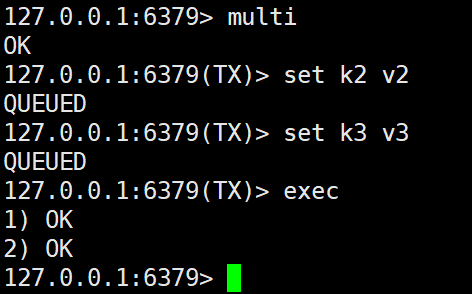
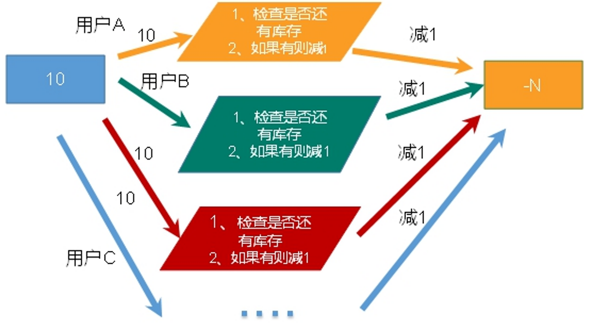

# 九、Reids的事务操作

## 1、Redis的事务定义


Redis事务是一个单独的隔离操作：事务中的所有命令都会序列化、按顺序地执行。事务在执行的过程中，不会被其他客户端发送来的命令请求所打断。


Redis事务的主要作用就是**串联多个命令**防止别的命令插队。


redis事务就是一个命令执行的队列，将一系列预定义命令包装成一个整体(一个队列)。当执行时，一次性按照添加顺序依次执行，中间不会被打断或者干扰。


redis 与 mysql 事务的对比

| | mysql | redis |
| --- | --- | --- |
| 开启 | start transaction | multi |
| 语句 | 普通sql | 普通命令 |
| 失败 | rollback回滚 | discard取消 |
| 成功 | commit | exec |


## 2、Multi、Exec、discard


从输入Multi命令开始，输入的命令都会依次进入命令队列中，但不会执行，<font style="color:#E8323C;">直到输入Exec后，Redis会将之前的命令队列中的命令依次执行。</font>


组队的过程中可以通过discard来放弃组队。





## 3、事务的错误处理2种情况
###  语法有问题
  
这种情况，exec时，报错，所有语句得不到执行  
组队中某个命令出现了报告错误，执行时整个的所有队列都会被取消。 


### 语法本身没错，但适用对象有问题，
  
exec之后，会执行正确的语句，并跳过有不适当的语句  
如果执行阶段某个命令报出了错误，则只有报错的命令不会被执行，而其他的命令都会执行，不会回滚。 


## 4、事务冲突的问题


想想一个场景：有很多人有你的账户，同时去参加双十一抢购


一个请求想给金额减8000


一个请求想给金额减5000


一个请求想给金额减1000


### 悲观锁


**悲观锁(Pessimistic Lock)**，顾名思义，就是很悲观，每次去拿数据的时候都认为别人会修改，所以每次在拿数据的时候都会上锁，这样别人想拿这个数据就会block直到它拿到锁。


**传统的关系型数据库里边就用到了很多这种锁机制**，比如**行锁**，**表锁**等，**读锁**，**写锁**等，都是在做操作之前先上锁。


### 乐观锁


**乐观锁(Optimistic Lock)，** 顾名思义，就是很乐观，每次去拿数据的时候都认为别人不会修改，所以不会上锁，但是在更新的时候会判断一下在此期间别人有没有去更新这个数据，可以使用版本号等机制。


**乐观锁适用于多读的应用类型，这样可以提高吞吐量**。<font style="color:#E8323C;">Redis就是利用这种check-and-set机制实现事务的。</font>


### WATCH key [key...]


在执行multi之前，先执行watch key1 [key2]，可以监视一个(或多个) key ，如果在事务**执行之前这个(或这些) key** **被其他命令所改动，那么事务将被打断。**


### unwatch


取消 WATCH 命令对所有 key 的监视。


如果在执行 WATCH 命令之后，<font style="color:#E8323C;">EXEC 命令 或 DISCARD 命令</font>先被执行了的话，那么就不需要再执行UNWATCH 了。


[http://doc.redisfans.com/transaction/exec.html](http://doc.redisfans.com/transaction/exec.html)


注意：


watch命令可以监控一个或多个key，一旦其中有一个key被修改(或删除)，之后的事务就不会执行，


监控一直持续到exec命令(事务中的命令是在exec之后才执行的，exec命令执行完之后被监控的key会自动被unwatch)


## 5、Redis事务三特性


### 单独的隔离操作


事务中的所有命令都会序列化、按顺序地执行。


事务在执行的过程中，不会被其他客户端发送来的命令请求所打断。


### 没有隔离级别的概念


队列中的命令没有提交之前都不会实际被执行，因为事务提交前任何指令都不会被实际执行


### 不保证原子性


事务中如果有一条命令执行失败，其后的命令仍然会被执行，没有回滚


## 6、Redis事务秒杀案例


```java
@Component
public class Skill {

    @Autowired
    private StringRedisTemplate stringRedisTemplate;

    public void skill() throws Exception {
        String userid = new Random().nextInt(50000) + "";
        String prodid = "1001";

        boolean isSuccess = doSecKill(userid, prodid);
        System.out.println(isSuccess);
    }


    //秒杀过程
    public boolean doSecKill(String uid, String prodid) throws Exception {
        //1、uid和prodid非空判断
        if (uid == null || prodid == null) {
            return false;
        }
        //2、连接redis

        //3、拼接key
        //3.1、库存key
        String kcKey = "sk:" + prodid + ":qt";
        //3.2、秒杀成功用户key
        String userKey = "sk:" + prodid + ":user";
        //4、获取库存，如果库存null，秒杀还没有开始
        String kc = stringRedisTemplate.opsForValue().get(kcKey);
        if (kc == null) {
            System.out.println("秒杀还没有开始，请等待！");
            return false;
        }
        //5、判断用户是否重复秒杀操作
        Boolean isExist = stringRedisTemplate.opsForSet().isMember(userKey, uid);
        if (isExist) {
            System.out.println("已经秒杀成功了，不能重复秒杀");
            return false;
        }
        //6、判断如果商品数量，库存数量小于1，秒杀结束
        if (Integer.parseInt(kc) <= 0) {
            System.out.println("秒杀已经结束了");
            return false;
        }
        //7、秒杀过程
        //7.1、库存-1
        stringRedisTemplate.boundValueOps(kcKey).decrement();
        //7.2、把秒杀成功用户添加清单里面
        stringRedisTemplate.opsForSet().add(userKey, uid);
        System.out.println("秒杀成功了");
        return true;
    }

}
```


### 超卖问题





### 利用乐观锁淘汰用户，解决超卖问题


```java
@Component
public class Skill {

    @Autowired
    private StringRedisTemplate stringRedisTemplate;

    public void skill() throws Exception {
        String userid = new Random().nextInt(50000) + "";
        String prodid = "1001";

        boolean isSuccess = doSecKill(userid, prodid);
        System.out.println(isSuccess);
    }


    //秒杀过程
    public boolean doSecKill(String uid, String prodid) throws Exception {
        //1、uid和prodid非空判断
        if (uid == null || prodid == null) {
            return false;
        }
        //2、连接redis

        //3、拼接key
        //3.1、库存key
        String kcKey = "sk:" + prodid + ":qt";
        //3.2、秒杀成功用户key
        String userKey = "sk:" + prodid + ":user";

        //监视库存
        stringRedisTemplate.watch(kcKey);


        //4、获取库存，如果库存null，秒杀还没有开始
        String kc = stringRedisTemplate.opsForValue().get(kcKey);
        if (kc == null) {
            System.out.println("秒杀还没有开始，请等待！");
            return false;
        }
        //5、判断用户是否重复秒杀操作
        Boolean isExist = stringRedisTemplate.opsForSet().isMember(userKey, uid);
        if (isExist) {
            System.out.println("已经秒杀成功了，不能重复秒杀");
            return false;
        }
        //6、判断如果商品数量，库存数量小于1，秒杀结束
        if (Integer.parseInt(kc) <= 0) {
            System.out.println("秒杀已经结束了");
            return false;
        }
        //7、秒杀过程
        //开启事务支持，在同一个Connection中执行命令
        stringRedisTemplate.setEnableTransactionSupport(true);
        //使用事务
        stringRedisTemplate.multi();


        //7.1、库存-1
        stringRedisTemplate.boundValueOps(kcKey).decrement();
        //7.2、把秒杀成功用户添加清单里面
        stringRedisTemplate.opsForSet().add(userKey, uid);


        List<Object> results = stringRedisTemplate.exec();
        if (results == null || results.size() == 0) {
            System.out.println("秒杀失败了");
            return false;
        }

        System.out.println("秒杀成功了");
        return true;
    }

}
```


<font style="color:rgb(77, 77, 77);">当使用redis乐观锁，通过watch对库存进行监控，当其他人使用库存key时，发现和原来的库存版本号不一致就提示秒杀失败。但是经过试验在并发下会发生</font><font style="color:#E8323C;">连接超时和少买情况</font><font style="color:rgb(77, 77, 77);">（即高并发下，300个人并发，只有一个成功，其他人都失败了，因为成功的那个人修改了版本号）；</font>


### 超时问题


使用redis连接池管理redis连接，设置超时时间


```java
   /*
	* maxTotal：控制一个pool可分配多少个jedis实例，通过pool.getResource()来获取；如果赋值为-1，则表示不限制；
    如果pool已经分配了MaxTotal个jedis实例，则此时pool的状态为exhausted。
	* maxIdle：控制一个pool最多有多少个状态为idle(空闲)的jedis实例；
	* maxWaitMillis：表示当borrow一个jedis实例时，最大的等待毫秒数，如果超过等待时间，则直接抛JedisConnectionException；
	* testOnBorrow：获得一个jedis实例的时候是否检查连接可用性（ping()）；如果为true，则得到的jedis实例均是可用的；
    */
    public static JedisPool getJedisPoolInstance() {
        if (null == jedisPool) {
            synchronized (JedisPoolUtil.class) {
                if (null == jedisPool) {
                    JedisPoolConfig poolConfig = new JedisPoolConfig();
                    poolConfig.setMaxTotal(200);
                    poolConfig.setMaxIdle(32);
                    poolConfig.setMaxWaitMillis(100 * 1000);
                    poolConfig.setBlockWhenExhausted(true);
                    poolConfig.setTestOnBorrow(true);  // ping  PONG

                    jedisPool = new JedisPool(poolConfig, "192.168.44.168", 6379, 60000);
                }
            }
        }
        return jedisPool;
    }
```

```java
//通过连接池得到jedis对象
JedisPool jedisPoolInstance = JedisPoolUtil.getJedisPoolInstance();
Jedis jedis = jedisPoolInstance.getResource();
```

### 库存遗留问题


#### 利用lua脚本淘汰用户，解决超卖问题


redis 2.6版本以后，通过lua脚本解决**争抢问题**，实际上是**redis** **利用其单线程的特性，用任务队列的方式解决多任务并发问题**。


```lua
local userid=KEYS[1];
local prodid=KEYS[2];
local qtkey="sk:"..prodid..":qt";
local usersKey="sk:"..prodid.":usr'; 
local userExists=redis.call("sismember",usersKey,userid);
if tonumber(userExists)==1 then
    return 2;
end
local num= redis.call("get" ,qtkey);
if tonumber(num)<=0 then
    return 0;
else
    redis.call("decr",qtkey);
    redis.call("sadd",usersKey,userid);
end
return 1;
```


```java
public class SecKill_redisByScript {
    
    static String secKillScript = "local userid=KEYS[1];" +
            "local prodid=KEYS[2];" +
            "local qtkey='sk:'..prodid..\":qt\";" +
            "local usersKey='sk:'..prodid..\":usr\";" +
            "local userExists=redis.call(\"sismember\",usersKey,userid);" +
            "if tonumber(userExists)==1 then " +
            "   return 2;" +
            "end" +
            "local num= redis.call(\"get\" ,qtkey);" +
            "if tonumber(num)<=0 then " +
            "   return 0;" +
            "else " +
            "   redis.call(\"decr\",qtkey);" +
            "   redis.call(\"sadd\",usersKey,userid);" +
            "end" +
            "return 1";

    static String secKillScript2 = "local userExists=redis.call(\"sismember\",\"{sk}:0101:usr\",userid);" + " return 1";

    //秒杀过程
    public static boolean doSecKill(String uid, String prodid) throws IOException {

        JedisPool jedispool = JedisPoolUtil.getJedisPoolInstance();
        Jedis jedis = jedispool.getResource();

        String sha1 = jedis.scriptLoad(secKillScript);
        Object result = jedis.evalsha(sha1, 2, uid, prodid);

        String reString = String.valueOf(result);
        if ("0".equals(reString)) {
            System.err.println("已抢空！！");
        } else if ("1".equals(reString)) {
            System.out.println("抢购成功！！！！");
        } else if ("2".equals(reString)) {
            System.err.println("该用户已抢过！！");
        } else {
            System.err.println("抢购异常！！");
        }
        jedis.close();
        return true;
    }
}
```


### 补充：LUA脚本


Lua 是一个小巧的[脚本语言](http://baike.baidu.com/item/%E8%84%9A%E6%9C%AC%E8%AF%AD%E8%A8%80)，Lua脚本可以很容易的被C/C++ 代码调用，也可以反过来调用C/C++的函数，Lua并没有提供强大的库，一个完整的Lua解释器不过200k，所以Lua不适合作为开发独立应用程序的语言，而是作为嵌入式脚本语言。


很多应用程序、游戏使用LUA作为自己的嵌入式脚本语言，以此来实现可配置性、可扩展性。


这其中包括魔兽争霸地图、魔兽世界、博德之门、愤怒的小鸟等众多游戏插件或外挂。


[https://www.w3cschool.cn/lua/](https://www.w3cschool.cn/lua/)


#### LUA脚本在Redis中的优势


将复杂的或者多步的redis操作，写为一个脚本，一次提交给redis执行，减少反复连接redis的次数。提升性能。


LUA脚本是类似redis事务，有一定的原子性，不会被其他命令插队，可以完成一些redis事务性的操作。


但是注意redis的lua脚本功能，只有在Redis 2.6以上的版本才可以使用。


> 更新: 2022-08-11 18:19:29  
> 原文: <https://www.yuque.com/like321/qgn2qc/zlh2sm>