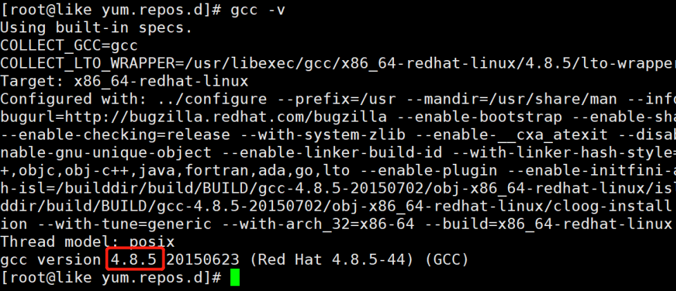
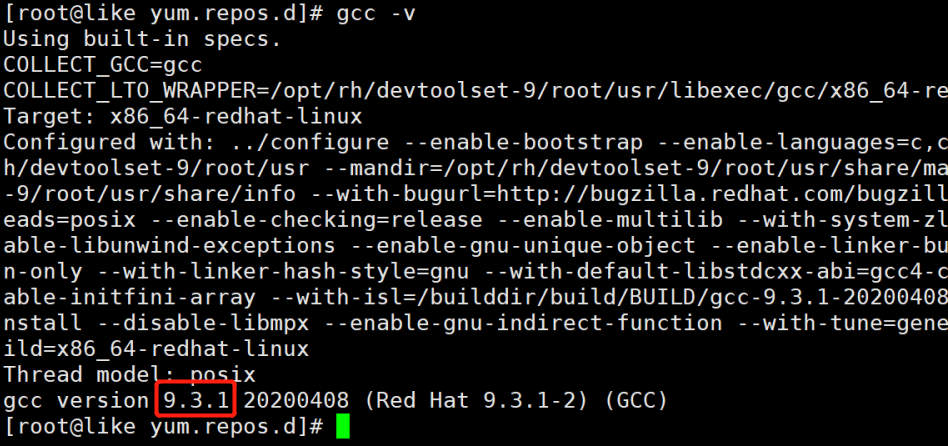
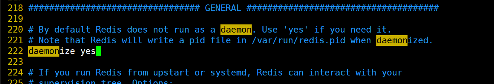
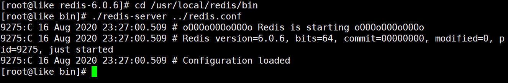

# 二、Redis概述和安装

+ Redis是一个开源的key-value存储系统。
+ 和Memcached类似，它支持存储的value类型相对更多，包括string(字符串)、list(链表)、set(集合)、zset(sorted set --有序集合)和hash（哈希类型）。
+ 这些数据类型都支持push/pop、add/remove及取交集并集和差集及更丰富的操作，而且这些操作都是原子性的。
+ 在此基础上，Redis支持各种不同方式的排序。
+ 与memcached一样，为了保证效率，数据都是缓存在内存中。
+ 区别的是Redis会周期性的把更新的数据写入磁盘或者把修改操作写入追加的记录文件。
+ 并且在此基础上实现了master-slave(主从)同步。


## 1、应用场景


### 1.1、配合关系型数据库做高速缓存


+  高频次，热门访问的数据，降低数据库IO 
+  分布式架构，做session共享 


### 1.2、多样的数据结构存储持久化数据


## 2、Redis安装


Redis官方网站：[http://redis.io](http://redis.io)


Redis中文官方网站：[http://redis.cn](http://redis.cn)


### 2.1、安装版本


+ 6.2.1 for Linux（redis-6.2.1.tar.gz）


### 2.2、安装步骤


1. 下载安装gcc编译器


```bash
yum -y install gcc
```





发现centos7默认的gcc版本为4.8.5，安装redis6.0需要将gcc版本升级到5.3以上，则升级gcc命令如下：


```bash
yum -y install centos-release-scl
yum -y install devtoolset-9-gcc devtoolset-9-gcc-c++ devtoolset-9-binutils
 
#临时修改gcc版本
scl enable devtoolset-9 bash
#永久修改gcc版本
echo "source /opt/rh/devtoolset-9/enable" >>/etc/profile
```





2. 下载redis-6.2.1.tar.gz放/opt目录


```bash
cd /opt

#下载
wget http://download.redis.io/releases/redis-6.2.1.tar.gz
```


3. 解压


```bash
tar -zxvf redis-6.2.1.tar.gz
```


4. 解压完成后进入目录：


```bash
cd redis-6.2.1
```


5. 无需配置，直接编译


```bash
make
```


6. 安装


```bash
#(安装编译后的文件)到指定目录：
make PREFIX=/usr/local/redis install

注意：
	prefix必须大写、同时会自动为我们创建redis目录，并将结果安装此目录
```


### 2.3、安装目录


安装完成后，会在redis的安装目录下面创建一个bin目录，该目录里面有5个文件。


> redis-benchmark:性能测试工具，可以在自己本机运行，看看自己本机性能如何
>
>  
>
> redis-check-aof：修复有问题的AOF文件
>
>  
>
> redis-check-rdb：修复有问题的dump.rdb文件
>
>  
>
> redis-sentinel：Redis集群使用
>
>  
>
> redis-server：Redis服务器启动命令
>
>  
>
> redis-cli：客户端，操作入口
>


### 2.4、配置文件详解


从redis的解压目录里面把redis.conf配置文件复制到redis的安装目录下面(与bin目录同级)。


```plain
cp /opt/redis-6.2.1/redis.conf /usr/local/redis
```


1、redis默认不是以守护进程的方式运行，可以通过该配置项修改，使用yes启用守护进程


```plain
daemonize no // 改为 yes，让redis的进程在后台执行，不占据当前终端。
```


2、当redis以守护进程方式运行时，redis默认会把pid写入/var/run/redis.pid文件，可以通过pidfile指定


```plain
pidfile /var/run/redis.pid
```


3、指定redis监听端口，默认端口为6379，


```plain
port 6379
```





4、安全认证


```plain
requirepass 321612
```


注意：  
设置的密码是明文的，因此要对redis.conf配置文件，进行严格的授权。


5、外网java客户端连接linux的redis


开启redis-server后，redis-cli只能访问到127.0.0.1，因为在配置文件中固定了ip，


```plain
bind 127.0.0.1   改为 #bind 127.0.0.1

protected-mode yes 改为 protected-mode no
```


> redis从3.2版本后增加了protected-mode参数，protected-mode参数是为了禁止外网访问redis，  
如果启用了，则只能通过lookbackip(127.0.0.1)访问redis，如果外网访问redis，会报出异常。
>


### 2.5、启动


`启动redis服务`


语法：  
redis-server(写路径) redis.conf(写路径)


```bash
cd /usr/local/redis/bin

./redis-server ../redis.conf
```





`启动redis客户端`


语法： redis-cli  -h  主机ip  -p端口号


```plain
./redis-cli
```


ping命令，该命令用于检测redis服务是否启动


`redis关闭服务`


+  断电、非正常关闭。容易数据丢失 

```plain
ps -ef | grep redis
kill -9 pid
```

 


+  正常关闭、数据保存  
通过客户端进行shutdown，关闭redis服务 

```plain
exit
/usr/local/redis/bin/redis-cli shutdown
```

 


## 3、Redis相关知识


+  默认16个数据库，类似数组下标从0开始，初始默认使用0号库  
使用命令 select  来切换数据库。如: select 8 
+  统一密码管理，所有库同样密码。 


Redis是单线程+多路IO复用技术


多路复用是指使用一个线程来检查多个文件描述符（Socket）的就绪状态，比如调用select和poll函数，传入多个文件描述符，如果有一个文件描述符就绪，则返回，否则阻塞直到超时。得到就绪状态后进行真正的操作可以在同一个线程里执行，也可以启动线程执行（比如使用线程池）


串行  vs  多线程+锁（memcached） vs  单线程+多路IO复用(Redis)


（与Memcache三点不同: 支持多数据类型，支持持久化，单线程+多路IO复用）


> 更新: 2022-08-11 16:07:37  
> 原文: <https://www.yuque.com/like321/qgn2qc/abccof>