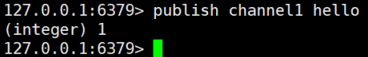

# 五、Redis的发布和订阅

## 1、什么是发布和订阅


Redis 发布订阅 (pub/sub) 是一种消息通信模式：发送者 (pub) 发送消息，订阅者 (sub) 接收消息。


Redis 客户端可以订阅任意数量的频道。


## 2、Redis的发布和订阅


1.  客户端可以订阅频道如下图：  
 


2.  当给这个频道发布消息后，消息就会发送给订阅的客户端 


## 3、发布订阅命令行实现


1.  打开一个客户端订阅 channel1 

```plain
subscribe channel1
```

  
 


2.  打开另一个客户端，给channel1发布消息hello 

```plain
publish channel1 hello
```

  
  
返回的1是订阅者数量 


3.  打开第一个客户端可以看到发送的消息  
  
注：发布的消息没有持久化，如果在订阅前的客户端收不到hello，只能收到订阅后发布的消息 


> 更新: 2022-08-11 16:07:18  
> 原文: <https://www.yuque.com/like321/qgn2qc/qfps8k>