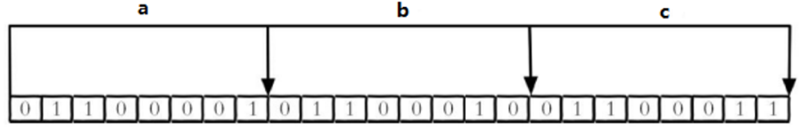
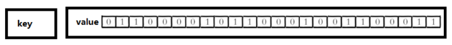
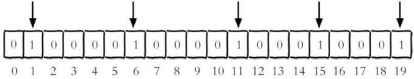
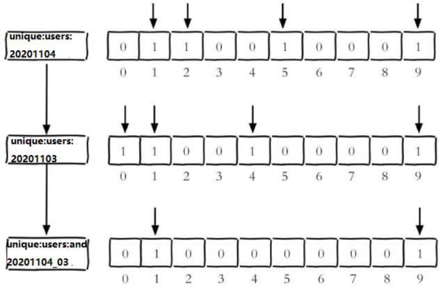
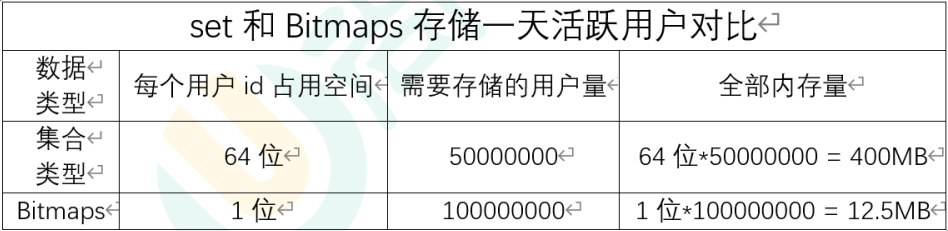
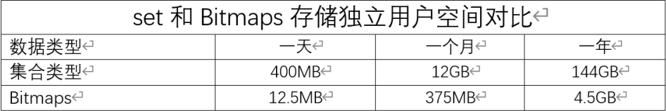
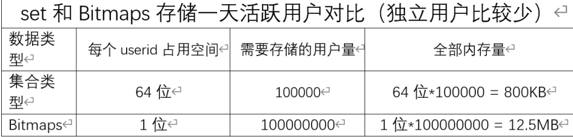

# 六、Redis新数据类型

## 1、bitmaps


### 1.1、简介


现代计算机用二进制（位） 作为信息的基础单位， 1个字节等于8位，


例如“abc”字符串是由3个字节组成， 但实际在计算机存储时将其用二进制表示，


“abc”分别对应的ASCII码分别是97、 98、 99， 对应的二进制分别是01100001、 01100010和01100011，


如下图





合理地使用操作位能够有效地提高内存使用率和开发效率。


Redis提供了Bitmaps这个“数据类型”可以实现对位的操作：


1.  Bitmaps本身不是一种数据类型， 实际上它就是字符串（key-value）， 但是它可以对字符串的位进行操作。 
2.  Bitmaps单独提供了一套命令， 所以在Redis中使用Bitmaps和使用字符串的方法不太相同。  
可以把Bitmaps想象成一个以位为单位的数组， 数组的每个单元只能存储0和1， 数组的下标在Bitmaps中叫做偏移量。 





### 1.2、基本操作


+  setbit key offset value	设置指定key对应偏移量上的bit值，value只能是1或0  
**offset:偏移量从0开始** 


**例：**


<font style="color:#E8323C;">每个独立用户是否访问过网站存放在Bitmaps中， 将访问的用户记做1， 没有访问的用户记做0， 用偏移量作为用户的id。</font>


设置键的第offset个位的值（从0算起） ， 假设现在有20个用户，userid=1， 6， 11， 15， 19的用户对网站进行了访问， 那么当前Bitmaps初始化结果如图





```plain
setbit unique:users:20201106 1 1

setbit unique:users:20201106 6 1

setbit unique:users:20201106 11 1

setbit unique:users:20201106 15 1

setbit unique:users:20201106 19 1
```


注：


很多应用的用户id以一个指定数字（例如10000） 开头， 直接将用户id和Bitmaps的偏移量对应势必会造成一定的浪费， 通常的做法是每次做setbit操作时将用户id减去这个指定数字。


在第一次初始化Bitmaps时， 假如偏移量非常大， 那么整个初始化过程执行会比较慢， 可能会造成Redis的阻塞。


+  getbit key offset 	获取指定key对应偏移量上的bit值  
**获取键的第offset位的值（从0开始算）** 


**例：**


获取id=8的用户是否在2020-11-06这天访问过， 返回0说明没有访问过


```plain
getbit unique:users:20201106 8
//0

getbit unique:users:20201106 1
//1

getbit unique:users:20201106 100
//0
```


注：因为100根本不存在，所以也是返回0


### 1.3、统计


统计**字符串**被设置为1的bit数。


一般情况下，给定的整个字符串都会被进行计数，通过指定额外的 start 或 end 参数，可以让计数只在特定的位上进行。


start 和 end 参数的设置，都可以使用负数值：比如 -1 表示最后一个位，而 -2 表示倒数第二个位，start、end 是指bit组的字节的下标数，二者皆包含。


+ bitcount key [start end]  统计指定key中1的数量


**例：**


```plain
bitcount unique:users:20201106 
//5
```


start和end代表起始和结束字节数， 下面操作计算用户id在第1个字节到第3个字节之间的独立访问用户数， 对应的用户id是11， 15， 19。


```plain
bitcount unique:users:20201106 1 3
//3
```


举例： K1 【01000001 01000000 00000000 00100001】，对应【0，1，2，3】


bitcount K1 1 2 ： 统计下标1、2字节组中bit=1的个数，即01000000 00000000   --》bitcount K1 1 2    --》1


bitcount K1 1 3 ： 统计下标1、3字节组中bit=1的个数，即01000000 00000000 00100001  --》bitcount K1 1 3　　--》3


bitcount K1 0 -2 ： 统计下标0到下标倒数第2，字节组中bit=1的个数，即01000001 01000000  00000000


--》bitcount K1 0 -2　--》3


**注意：redis的setbit设置或清除的是bit位置，而bitcount计算的是byte位置。**


### 1.4、交并集


+ bitop op destkey key1 [key2...]	对指定key按位进行交、并、非、异或操作，并将结果保存到destkey中


> and：交
>
>  
>
> or：并
>
>  
>
> not：非
>
>  
>
> xor：异或
>


bitop是一个复合操作， 它可以做多个Bitmaps的and（交集） 、 or（并集） 、 not（非） 、 xor（异或） 操作并将结果保存在destkey中。


**例：**


2020-11-04 日访问网站的userid=1,2,5,9。


```plain
setbit unique:users:20201104 1 1
setbit unique:users:20201104 2 1
setbit unique:users:20201104 5 1
setbit unique:users:20201104 9 1
```


2020-11-03 日访问网站的userid=0,1,4,9。


```plain
setbit unique:users:20201103 0 1
setbit unique:users:20201103 1 1
setbit unique:users:20201103 4 1
setbit unique:users:20201103 9 1
```


计算出两天都访问过网站的用户数量


```plain
bitop and unique:users:and:20201104_03 unique:users:20201103 unique:users:20201104
//2

bitcount unique:users:and:20201104_03
//2
```





计算出任意一天都访问过网站的用户数量（例如月活跃就是类似这种） ， 可以使用or求并集


```plain
bitop or unique:users:or:20201104_03 unique:users:20201103 unique:users:20201104
//2

bitcount unique:users:or:20201104_03
//6
```


### 1.5、Bitmaps与set对比


假设网站有1亿用户， 每天独立访问的用户有5千万， 如果每天用集合类型和Bitmaps分别存储活跃用户可以得到表





很明显， 这种情况下使用Bitmaps能节省很多的内存空间， 尤其是随着时间推移节省的内存还是非常可观的





但Bitmaps并不是万金油， 假如该网站每天的独立访问用户很少， 例如只有10万（大量的僵尸用户） ， 那么两者的对比如下表所示， 很显然， 这时候使用Bitmaps就不太合适了， 因为基本上大部分位都是0。





## 2、HyperLogLog


### 2.1、简介


在工作当中，我们经常会遇到与统计相关的功能需求，比如统计网站PV（PageView页面访问量），可以使用Redis的incr、incrby轻松实现。


但像UV（UniqueVisitor，独立访客）、独立IP数、搜索记录数等需要去重和计数的问题如何解决？<font style="color:#E8323C;">这种求集合中不重复元素个数的问题称为基数问题。</font>


解决基数问题有很多种方案：


（1）数据存储在MySQL表中，使用distinct count计算不重复个数


（2）使用Redis提供的hash、set、bitmaps等数据结构来处理


以上的方案结果精确，但随着数据不断增加，导致占用空间越来越大，对于非常大的数据集是不切实际的。


能否能够降低一定的精度来平衡存储空间？Redis推出了HyperLogLog


<font style="color:#E8323C;">Redis HyperLogLog 是用来做基数统计的算法，HyperLogLog 的优点是，在输入元素的数量或者体积非常非常大时，计算基数所需的空间总是固定的、并且是很小的。</font>


在 Redis 里面，每个 HyperLogLog 键只需要花费 12 KB 内存，就可以计算接近 2^64 个不同元素的基数。这和计算基数时，元素越多耗费内存就越多的集合形成鲜明对比。


但是，因为 HyperLogLog 只会根据输入元素来计算基数，而不会储存输入元素本身，所以 HyperLogLog 不能像集合那样，返回输入的各个元素。


什么是基数?


基数是数据集去重后元素个数。比如数据集 {1, 3, 5, 7, 5, 7, 8}， 那么这个数据集的基数集为 {1, 3, 5 ,7, 8}, 基数（不重复元素）为5。


基数估计就是在误差可接受的范围内，快速计算基数。


注意：


用于进行基数统计，不是集合，不保存数据，只记录数据而不是具体数据


核心是基数估算算法，最终数值存在一定误差


误差范围：基数估计的结果是一个带有0.81%标准错误的近似值


耗空间极少，每个hyperloglog key占用12k的内存用于标记基数


pfmerge命令合并后占用的存储空间为12k，无论合并之前数据量多少


### 2.2、基本操作


+ pfadd key element [element...]	添加指定元素到 HyperLogLog 中


```plain
pfadd hll "redis"
//1

pfadd hll "mysql"
//1

pfadd hll "redis"
//0
```


将所有元素添加到指定HyperLogLog数据结构中。如果执行命令后HLL估计的近似基数发生变化，则返回1，否则返回0。


+ pfcount key [key...]	计算HLL的近似基数


```plain
pfadd hll1 "redis"
//1

pfadd hll1 "mysql"
//1

pfadd hll1 "redis"
//0

pfcount hll1
//2


pfadd hll2 "redis"
//1

pfadd hll2 "mongodb"
//1

pfcount hll1 hll2
//3
```


+ pfmerge destkey sourcekey [sourcekey...]	将一个或多个HLL合并后的结果存储在另一个HLL中


```plain
pfcount hll1 hll2
//3

pfmerge hll1_2 hll1 hll2
//OK

pfcount hll1_2
//3
```


## 3、Geospatial


### 3.1、简介


Redis 3.2 中增加了对GEO类型的支持。GEO，Geographic，地理信息的缩写。


该类型，就是元素的2维坐标，在地图上就是经纬度。


<font style="color:#E8323C;">redis基于该类型，提供了经纬度设置，查询，范围查询，距离查询，经纬度Hash等常见操作。</font>


### 3.1、基本操作


+  添加地理位置的坐标  
geoadd key longitude latitude member [longitude latitude member ...]   添加地理位置（经度、纬度、名称） 


```plain
geoadd china:city 121.47 21.23 shanghai
//1
geoadd china:city 106.50 29.53 chongqing 114.05 22.52 shenzhen 116.38 39.90 beijing
//3
```


两极无法直接添加，一般会下载城市数据，直接通过 Java 程序一次性导入。


有效的经度从 -180 度到 180 度。有效的纬度从 -85.05112878 度到 85.05112878 度。


当坐标位置超出指定范围时，该命令将会返回一个错误。


已经添加的数据，是无法再次往里面添加的。


+  获取地理位置的坐标  
geopos key member [member...]   获得指定地区的坐标值 


```plain
geopos china:city shanghai
//"121.47000163793563843"
//"21.22999937888568667"
```


+  计算两个位置之间的距离  
geodist key member1 member2 [m|km|ft|mi]  获取两个位置之间的直线距离 


```plain
geodist china:city beijing shanghai km
//"2132.0213"
```


单位：


> m 表示单位为米[默认值]。
>
>  
>
> km 表示单位为千米。
>
>  
>
> mi 表示单位为英里。
>
>  
>
> ft 表示单位为英尺。
>


如果用户没有显式地指定单位参数， 那么 GEODIST 默认使用米作为单位


+  根据用户给定的经纬度坐标来获取指定范围内的地理位置集合  
georadius key longitude latitude radius m|km|ft|mi [withcoord] [withdist] [withhash] [count count] [asc|desc] [store key] [storedist key]  
以给定的经纬度为中心，找出某一半径内的元素 

```plain
georadius china:city 110 30 1000 km
//chongqing
//shenzhen
```

 

+  根据储存在位置集合里面的某个地点获取指定范围内的地理位置集合  
georadiusbymember key member radius m|km|ft|mi [withcoord] [withdist] [withhash] [count count] [asc|desc] [store key] [storedist key] 

```plain
geoadd geos 1 1 1,1
geoadd geos 1 2 1,2
geoadd geos 1 3 1,3
geoadd geos 2 1 2,1
geoadd geos 2 2 2,2
geoadd geos 2 3 2,3
geoadd geos 3 1 3,1
geoadd geos 3 2 3,2
geoadd geos 3 3 3,3
geoadd geos 5 5 5,5

georadiusbymember geos 2,2 180 km
//1,1
//2,1
//1,2
//2,2
//3,1
//3,2
//1,3
//2,3
//3,3
```

 

+  返回一个或多个位置对象的 geohash 值  
geohash key member [member ...] 

```plain
geohash geos 2,2
//s037ms06g70
```

 


> 更新: 2022-08-11 16:12:55  
> 原文: <https://www.yuque.com/like321/qgn2qc/bf6gtc>