# 十、Redis持久化

# 什么是持久化


> 利用永久性存储介质将数据进行保存，在特定的时间将保存的数据进行恢复的工作机制称为持久化。
>


redis为了内存数据的安全考虑，<font style="color:#E8323C;">会把内存中的数据以文件形式保存到硬盘中一份，在服务器重启之后会自动把硬盘的数据恢复到内存（redis）的里边。</font>


Redis 提供了2个不同形式的持久化方式。


+  RDB（Redis DataBase） /     snapshotting（快照）	默认方式 
+  AOF（Append Only File） 


# Redis持久化之RDB（Redis DataBase）


## 1、是什么


<font style="color:#E8323C;">在指定的</font>**<font style="color:#E8323C;">时间间隔</font>**<font style="color:#E8323C;">内将内存中的数据集</font>**<font style="color:#E8323C;">快照</font>**<font style="color:#E8323C;">写入磁盘，</font> 也就是行话讲的Snapshot快照，它<font style="color:#E8323C;">恢复时是将快照文件直接读到内存里</font>


该持久化默认开启，一次性把redis中全部的数据保存一份存储在硬盘中（备份文件名字默认是dump.rdb）,


如果数据非常多（10-20g）就不适合频繁进行该持久化操作。


## 2、备份是如何执行的


Redis会单独创建（fork）一个子进程来进行持久化，会**先**将数据**写**入到一个**临时文件**中，待持久化过程都结束了，再用这个**临时文件替换上次持久化**好的文件。


整个过程中，主进程是不进行任何IO操作的，这就确保了极高的性能。如果需要进行大规模数据的恢复，且对于数据恢复的完整性不是非常敏感，那RDB方式要比AOF方式更加的高效。**<font style="color:#E8323C;">RDB的缺点是最后一次持久化后的数据可能丢失</font>**<font style="color:#E8323C;">。</font>


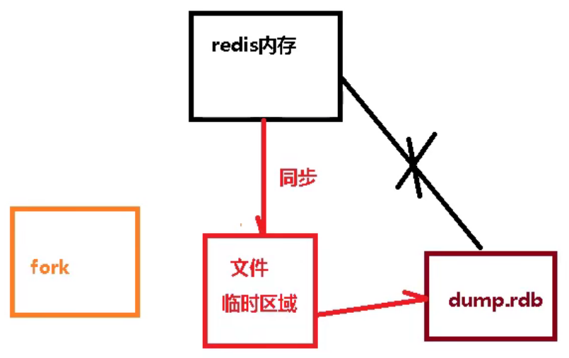


## 3、补充：Fork


+  Fork的作用是复制一个与当前进程**一样的进程**。新进程的所有数据（变量、环境变量、程序计数器等） 数值都和原进程一致，但是是一个全新的进程，并**作为原进程的子进程** 


+  在Linux程序中，fork()会产生一个和父进程完全相同的子进程，但子进程在此后多会exec系统调用，出于效率考虑，Linux中引入了“**写时复制技术**” 


+  **一般情况父进程和子进程会共用同一段物理内存**，只有进程空间的各段的内容要发生变化时，才会将父进程的内容复制一份给子进程。 


## 4、RDB持久化流程


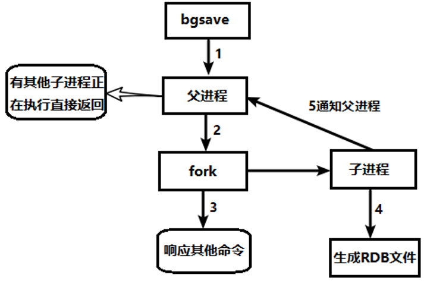


## 5、dump.rdb文件


在redis.conf中配置文件名称，默认为dump.rdb


## 6、配置位置


rdb文件的保存路径，也可以修改。


默认为Redis启动时命令行所在的目录下


## 7、如何触发RDB快照


### 7.1、自动（配置文件默认快照策略）


每隔n分钟或n次写操作后，从内存dump数据形成rdb文件，压缩放在备份的目录中。


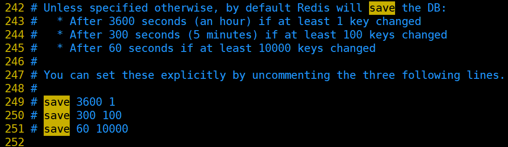


如何开启（默认开启，有自己的触发条件）


> save  900  1 		900秒内如果超过1个key被修改，则发起快照保存
>
>  
>
> save  300  10       	300秒超过10个key被修改，则发起快照保存
>
>  
>
> save   60   10000     60秒超过10000个key被修改，则发起快照保存
>


注意：

  
<font style="color:#E8323C;">屏蔽该触发条件，即可关闭快照方式。</font>


### 7.2、手动save VS bgsave


save ：save时只管保存，其它不管，全部阻塞。不建议。


bgsave：Redis会在后台异步进行快照操作， 快照同时还可以响应客户端请求。


+  登录状态
    - 直接执行bgsave即可 


+  没有登录状态 

```plain
./redis-cli -a 密码 bgsave
```

 


可以通过 <font style="color:#E8323C;">lastsave </font>命令获取最后一次成功执行快照的时间


```plain
lastsave
//(integer) 1642318813
```


### 7.3、flushall命令


执行flushall命令，也会产生dump.rdb文件，但里面是空的，无意义


## 8、stop-writes-on-bgsave-error


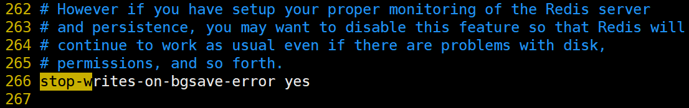


当Redis无法写入磁盘的话，直接关掉Redis的写操作。推荐yes.


## 9、rdbchecksum检查完整性


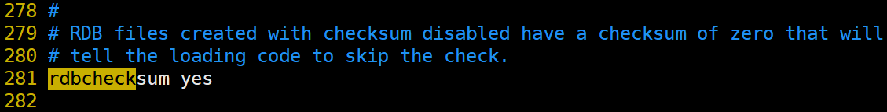


在存储快照后，还可以让redis使用CRC64算法来进行数据校验，


但是这样做会增加大约10%的性能消耗，如果希望获取到最大的性能提升，可以关闭此功能


推荐yes.


## 10、rdb的备份恢复


先通过config get dir  查询rdb文件的目录


```plain
config get dir
1) "dir"
2) "/usr/local/redis/bin"
```


rdb的恢复


+ 关闭Redis
+ 先把备份的文件拷贝到工作目录下 cp dump2.rdb dump.rdb
+ 启动Redis, 备份数据会直接加载


## 11、优势


+ <font style="color:#E8323C;">适合大规模的数据恢复</font>
+ <font style="color:#E8323C;">对数据完整性和一致性要求不高更适合使用</font>
+ <font style="color:#E8323C;">节省磁盘空间</font>
+ <font style="color:#E8323C;">恢复速度快</font>


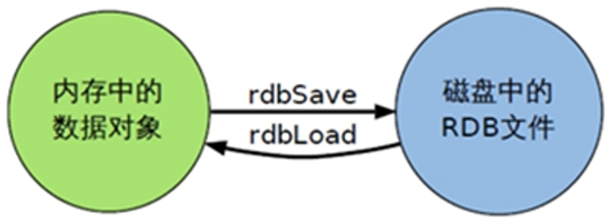


## 12、劣势


+  Fork的时候，内存中的数据被克隆了一份，大致2倍的膨胀性需要考虑 
+  虽然Redis在fork时使用了写时拷贝技术，但是如果数据庞大时还是比较消耗性能。 
+  在备份周期在一定间隔时间做一次备份，所以如果Redis意外down掉的话，<font style="color:#E8323C;">就会丢失最后一次快照后的所有修改。 </font>


## 13、如何停止


动态停止RDB：          

```java
redis-cli config set save ""	#save后给空值，表示禁用保存策略
```

## 14、小总结


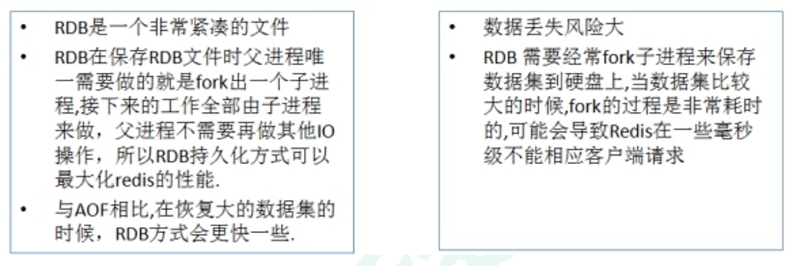


# Redis持久化之AOF


## 1、是什么


**以日志的形式来记录每个写操作（增量保存）**，<font style="color:#E8323C;">将Redis执行过的所有写指令记录下来（</font>**<font style="color:#E8323C;">读操作不记录</font>**<font style="color:#E8323C;">）， </font>**<font style="color:#E8323C;">只许追加文件但不可以改写文件</font>**<font style="color:#E8323C;">，</font>redis启动之初会读取该文件重新构建数据，


换言之，redis 重启的话就根据日志文件的内容将写指令从前到后执行一次以完成数据的恢复工作


本质：以独立日志的方式记录每次 “写”指令 (添加、修改、删除)，重启时再重新执行aof文件中命令达到恢复数据的目的。 <font style="color:#E8323C;">与rdb相比可以简单描述为 </font>`<font style="color:#E8323C;">改记录数据为记录数据产生的过程</font>`<font style="color:#E8323C;">。</font>


## 2、AOF持久化流程


1.  客户端的请求写命令会被append<font style="color:#E8323C;">追加到AOF缓冲区内； </font>


2.  AOF缓冲区根据AOF持久化策略（always、everysec、no）将操作sync同步到磁盘的AOF文件中； 


3.  AOF文件大小超过重写策略或手动重写时，会对AOF文件rewrite重写，压缩AOF文件容量； 


4.  Redis服务重启时，会重新load加载AOF文件中的写操作达到数据恢复的目的； 


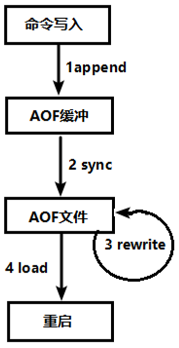


## 3、AOF默认不开启


可以在redis.conf中配置文件名称，默认为 appendonly.aof


AOF文件的保存路径，同RDB的路径一致。


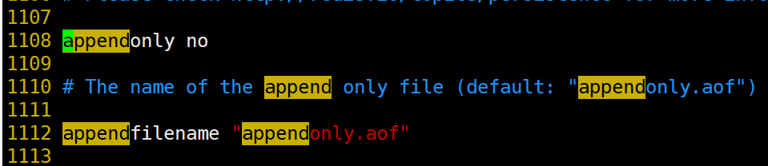


## 4、AOF和RDB同时开启，redis听谁的


AOF和RDB同时开启，系统默认取AOF的数据<font style="color:#E8323C;">（数据不会存在丢失）</font>


## 5、AOF启动/修复/恢复


+  AOF的备份机制和性能虽然和RDB不同，但是备份和恢复的操作同RDB一样，都是拷贝备份文件，需要恢复时再拷贝到Redis工作目录下，启动系统即加载。 


+  正常恢复 
    - 修改默认的appendonly no，改为yes
    - 将有数据的aof文件复制一份保存到对应目录（查看目录：config get dir）
    - 恢复：重启redis然后重新加载


+  异常恢复 
    - 修改默认的appendonly no，改为yes
    - 修复：如遇到**AOF文件损坏**，通过/usr/local/bin/**redis-check-aof--fix appendonly.aof**进行恢复
    - 备份被写坏的AOF文件
    - 恢复：重启redis，然后重新加载


## 6、AOF三种策略


appendfsync always	始终同步，每次Redis的写入都会立刻记入日志；性能较差但数据完整性比较好


appendfsync everysec	每秒同步，每秒记入日志一次，<font style="color:#E8323C;">如果宕机，本秒的数据可能丢失。</font>


appendfsync no	redis不主动进行同步，把同步时机交给操作系统。


## 7、Rewrite 重写


### 7.1、是什么


AOF采用文件追加方式，文件会越来越大。为避免出现此种情况，新增了重写机制，当AOF文件的大小超过所设定的阈值时，<font style="color:#E8323C;">Redis就会启动AOF文件的内容压缩， 只保留可以恢复数据的最小指令集.</font>


随着命令不断写入aof，文件会越来越大，为了解决这个问题，redis引入了aof重写机制压缩文件体积。


aof文件重写是<font style="color:#E8323C;">将redis进程内的数据转化为写命令同步到新aof文件的过程。</font>


简单说就是将对同一个数据的若干条命令执行结果转化成最终结果数据对应的指令进行记录。


作用：


+ 降低磁盘占用量，提高磁盘利用率
+ 提高持久化效率，降低持久化写时间，提高IO性能
+ 降低数据恢复时间，提高数据恢复效率


### 7.2、重写原理


AOF文件持续增长而过大时，会fork出一条新进程来将文件重写（也是先写临时文件最后再rename），**redis4.0版本后的重写，实质上就是把rdb的快照，以二进制的形式附在新的aof头部，作为已有的历史数据，替换掉原来的流水账操作。**


#### no-appendfsync-on-rewrite：


<font style="color:rgb(77, 77, 77);">bgrewriteaof机制，在一个子进程中进行aof的重写，从而不阻塞主进程对其余命令的处理，同时解决了aof文件过大问题。</font>

<font style="color:rgb(77, 77, 77);"></font>

<font style="color:rgb(77, 77, 77);">现在问题出现了，</font><font style="color:#E8323C;">同时在执行bgrewriteaof操作和主进程写aof文件的操作，两者都会操作磁盘，而bgrewriteaof往往会涉及大量磁盘操作，这样就会造成主进程在写aof文件的时候出现阻塞的情形</font><font style="color:rgb(77, 77, 77);">，现在no-appendfsync-on-rewrite参数出场了。</font>


+  如果 no-appendfsync-on-rewrite=yes，不写入aof文件只写入缓存，用户请求不会阻塞，但是在这段时间如果宕机会丢失这段时间的缓存数据。（降低数据安全性，提高性能） 

> <font style="color:rgb(77, 77, 77);">这就相当于将appendfsync设置为no，这说明并没有执行磁盘操作，只是写入了缓冲区，因此这样并不会造成阻塞（因为没有竞争磁盘），但是如果这个时候redis挂掉，就会丢失数据。丢失多少数据呢？在linux的操作系统的默认设置下，最多会丢失30s的数据。</font>
>

<font style="color:rgb(77, 77, 77);"></font>

+  如果 no-appendfsync-on-rewrite=no，主进程还是会把数据往磁盘里刷，但是遇到重写操作，可能会发生阻塞。（数据安全，但是性能降低） 


### 7.3、触发机制，何时重写


#### 手动执行重写命令：


> 登录状态：直接输入bgrewriteaof
>
>  
>
> 未登录状态：./bin/redis-cli -a 密码 bgrewriteaof
>


#### 执行自动重写条件：


> //文件大小比起上次重写时的大小，增长率100%时，重写  
auto-aof-rewrite-percentage  100
>
>  
>
> //aof文件，至少超过64m时，重写  
auto-aof-rewrite-min-size 64mb
>
>  
>
> //正在导出rdb快照的过程中，要不要停止同步aof  
no-appendfsync-on-rewrite yes
>


Redis会记录上次重写时的AOF大小，<font style="color:#E8323C;">默认配置是当AOF文件大小是上次rewrite后大小的一倍且文件大于64M时触发</font>


**重写虽然可以节约大量磁盘空间，减少恢复时间。但是每次重写还是有一定的负担的，因此设定Redis要满足一定条件才会进行重写。 **


> auto-aof-rewrite-percentage：设置重写的基准值，文件达到100%时开始重写（文件是原来重写后文件的2倍时触发）
>
>  
>
> auto-aof-rewrite-min-size：设置重写的基准值，最小文件64MB。达到这个值开始重写。
>


例如：文件达到70MB开始重写，降到50MB，下次什么时候开始重写？100MB


系统载入时或者上次重写完毕时，Redis会记录此时AOF大小，设为base_size,


如果Redis的**AOF当前大小>= base_size +base_size*100%** (默认)且**当前大小>=64mb**(默认)的情况下，Redis会对AOF进行重写。


### 7.3、重写流程


1.  bgrewriteaof触发重写，判断是否当前有bgsave或bgrewriteaof在运行，如果有，则等待该命令结束后再继续执行。 


2.  主进程fork出子进程执行重写操作，保证主进程不会阻塞。 


3.  子进程遍历redis内存中数据到临时文件，客户端的写请求同时写入aof_buf缓冲区和aof_rewrite_buf重写缓冲区保证原AOF文件完整以及新AOF文件生成期间的新的数据修改动作不会丢失。 


4.  
    1. 子进程写完新的AOF文件后，向主进程发信号，父进程更新统计信息。
    2. 主进程把aof_rewrite_buf中的数据写入到新的AOF文件。


5.  使用新的AOF文件覆盖旧的AOF文件，完成AOF重写。 


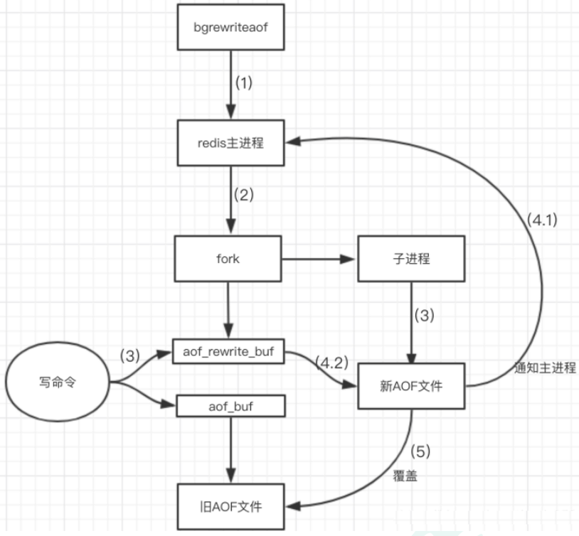


## 8、优势


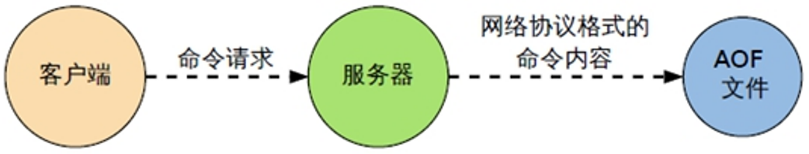


+  备份机制更稳健，丢失数据概率更低。 
+  可读的日志文本，通过操作AOF文件，可以处理误操作。 


## 9、劣势


+  比起RDB占用更多的磁盘空间。 
+  恢复备份速度要慢。 
+  每次读写都同步的话，有一定的性能压力。 
+  存在个别Bug，造成恢复不能。 


## 10、小总结


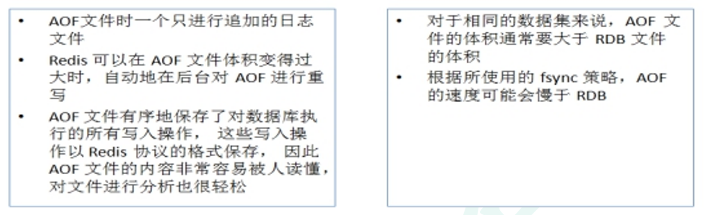


# 总结


## 1、用哪个好


官方推荐两个都启用。


如果对数据不敏感，可以选单独用RDB。


不建议单独用 AOF，因为可能会出现Bug。


如果只是做纯内存缓存，可以都不用。


## 2、官方建议


+  RDB持久化方式能够在指定的时间间隔能对你的数据进行快照存储 


+  AOF持久化方式记录每次对服务器写的操作，当服务器重启的时候会重新执行这些命令来恢复原始的数据，AOF命令以redis协议追加保存每次写的操作到文件末尾. 


+  Redis还能对AOF文件进行后台重写,使得AOF文件的体积不至于过大 


+  只做缓存：如果你只希望你的数据在服务器运行的时候存在,你也可以不使用任何持久化方式. 


+  同时开启两种持久化方式 


+  在这种情况下,当redis重启的时候会优先载入AOF文件来恢复原始的数据, 因为在通常情况下AOF文件保存的数据集要比RDB文件保存的数据集要完整. 


+  RDB的数据不实时，同时使用两者时服务器重启也只会找AOF文件。那要不要只使用AOF呢？ 


+  建议不要，因为RDB更适合用于备份数据库(AOF在不断变化不好备份)， 快速重启，而且不会有AOF可能潜在的bug，留着作为一个万一的手段。 


+  性能建议 

> 因为RDB文件只用作后备用途，建议**只在Slave上持久化RDB文件**，而且只要15分钟备份一次就够了，只保留**save 900 1**这条规则。
>
>  
>
> 如果使用AOF，好处是在最恶劣情况下也只会丢失不超过两秒数据，启动脚本较简单只load自己的AOF文件就可以了。
>
>  
>
> 代价,一是带来了持续的IO，二是AOF rewrite的最后将rewrite过程中产生的新数据写到新文件造成的阻塞几乎是不可避免的。
>
>  
>
> 只要硬盘许可，应该尽量减少AOF  rewrite的频率，AOF重写的基础大小默认值64M太小了，可以设到5G以上。
>
>  
>
> 默认超过原大小100%大小时重写可以改到适当的数值。
>

 


## 其他问题


+ 在dump rdb过程中，aof如果停止同步，会不会丢失？


> 不会，所有的操作缓存在内存的队列里，dump完成后，统一操作
>


+ aof重写是指什么


> aof重写是指把内存中的数据，逆化成命令，写入到.aof日志里，以解决aof日志过大的问题。
>


+ 如果rdb文件，和aof文件都存在，优先用谁来恢复数据


> aof
>


+ 两种是否可以同时使用


> 可以，而且推荐这么做
>


+ 恢复时，rdb和aof哪个恢复的快


> rdb快，因为其是数据的内存映射，直接载入到内存，而aof是命令，需要逐条执行。
>


注意点：  
如果两种持久化方式都开启，则以aof为准，  
虽然快照方式恢复速度快，但是最终被aof给覆盖，所以两种方式都开启时，以aof为准。


> 更新: 2022-08-11 23:52:46  
> 原文: <https://www.yuque.com/like321/qgn2qc/re20sc>