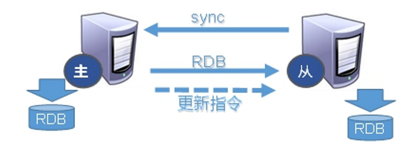

# 十一、主从复制(Replication)

## 1、是什么


主机数据更新后根据配置和策略， 自动同步到备机的master/slaver机制，**<font style="color:#E8323C;">Master以写为主，Slave以读为主</font>**


为了降低每个redis服务器的负载，可以多设置几个，并做主从模式


一个服务器负责“写”（添加、修改、删除）数据，其他服务器负责“读”数据，主服务器数据会“自动”同步给从服务器。


redis支持简单易用的主从复制（master-slave replication）功能，该功能可以让从服务器（slave server）成为主服务器（master server）的精确复制品。


## 2、能干嘛
## 
#### 读写分离：


master写，slave读，提高服务器的读写负载能力


#### 负载均衡：


基于主从结构，配合读写分离，由slave分担master负载，并根据需求的变化，改变slave的数量，通过多个从节点分担数据读取负载，大大提高redis服务器并发量与数据吞吐量


#### 故障恢复：


当master出现问题时，由slave提供服务，实现快速的故障恢复


#### 数据冗余：


实现数据热备份，是持久化之外的一种数据冗余方式


#### 高可用基石：


基于主从复制，构建哨兵模式与集群，实现redis的高可用方案


注意点：


+ redis使用异步复制，复制功能不能阻塞主、从服务器


+ 一个主服务器可以有多个从服务器，不仅主服务器可以有从服务器，从服务器也可以有自己的从服务器


## 3、主从复制


```bash
mkdir /myredis

cd /myredis

cp /usr/local/redis/redis.conf /myredis/redis.conf
```


开启daemonize yes


Pid文件名字pidfile


指定端口port


Log文件名字


dump.rdb名字dbfilename


Appendonly 关掉或者换名字


### 3.1、新建redis6379.conf


```plain
include /myredis/redis.conf
pidfile /var/run/redis_6379.pid
port 6379
dbfilename dump6379.rdb
```


### 3.2、新建redis6380.conf


```plain
include /myredis/redis.conf
pidfile /var/run/redis_6380.pid
port 6380
dbfilename dump6380.rdb
```


### 3.3、新建redis6381.conf


```plain
include /myredis/redis.conf
pidfile /var/run/redis_6381.pid
port 6381
dbfilename dump6381.rdb
```


### 3.4、启动三台redis服务器


```plain
ln -s /usr/local/redis/bin/redis-server /usr/bin/redis-server
```


```plain
redis-server redis6379.conf
redis-server redis6380.conf
redis-server redis6381.conf
```


### 3.5、查看系统进程


### 3.6、查看三台主机运行情况


info replication


打印主从复制的相关信息


### 3.7、配从库不配主库


1.  **从服务器配置**： 
    -  通过slaveof指定自己的角色，主服务器的地址和ip  
//slaveof 主服务器ip 端口号  
slaveof 127.0.0.1 6379 
    -  从服务器只读 

```plain
//从redis2.6开始，从服务器支持只读模式，通过slave-read-only配置项配置，该模式为从服务器的默认模式。
slave-read-only yes
```

 

    -  指定从服务器连接主服务器的密码  
如果主服务器通过requirepass选项设置了密码，为了让从服务器同步操作顺利进行，通过masterauth配置连接主服务器密码。 

```plain
masterauth 321612（主服务器密码）
```

 

2.  **验证**： 


> 在从服务器执行info replication 命令查看是否配置正确
>
>  
>
> master_link_status:	如果是up表示配置成功，如果是down表示不能同步，配置失败
>


3. 在主机上写，在从机上可以读取数据


4. 在从机上写数据报错


5. **撤销**：


> 只需在从服务器里面屏蔽上面的配置即可。
>


## 4、常用三招


### 4.1、一主二仆


切入点问题？slave1、slave2是从头开始复制还是从切入点开始复制？比如从k4进来，那之前的k1,k2,k3是否也可以复制？


#### 主机shutdown后情况如何？


从机是上位还是<font style="color:#E8323C;">原地待命</font>？


#### 主机又回来了后，


主机新增记录，从机还能否顺利复制？


#### 其中一台从机down后情况如何？


#### 依照原有它能跟上大部队吗？


<font style="color:#E8323C;">能</font>


### 4.2、薪火相传


上一个Slave可以是下一个slave的Master，Slave同样可以接收其他 slaves的连接和同步请求，那么该slave作为了链条中下一个的master, 可以有效减轻master的写压力，去中心化降低风险。


```plain
slaveof <ip><port>
```


中途变更转向：会清除之前的数据，重新建立拷贝最新的


注意：


> <font style="color:#E8323C;">风险是一旦某个slave宕机，后面的slave都没法备份</font>
>
>  
>
> 主机挂了，从机还是从机，无法写数据了
>


### 4.3、反客为主


当一个master宕机后，后面的slave可以立刻升为master，其后面的slave不用做任何修改。


<font style="color:#E8323C;">用 slaveof no one  将从机变为主机。</font>


## 5、复制原理


+  Slave启动成功连接到master后会发送一个sync命令 


+  Master接到命令启动后台的存盘进程，同时收集所有接收到的用于修改数据集命令， 在后台进程执行完毕之后，<font style="color:#E8323C;">master将传送整个数据文件到slave，以完成一次完全同步 </font>


+  全量复制：而slave服务在接收到数据库文件数据后，将其存盘并加载到内存中。 


+  增量复制：Master继续将新的所有收集到的修改命令依次传给slave，完成同步 


+  但是只要是重新连接master，<font style="color:#E8323C;">一次完全同步（全量复制）将被自动执行 </font>





主从复制三个阶段：


1. <font style="color:#E8323C;"> 建立连接阶段 </font>
2. <font style="color:#E8323C;"> 数据同步阶段 </font>
3. <font style="color:#E8323C;"> 命令传播阶段 </font>


### 5.1、数据同步阶段注意事项


#### master：


+  如果master数据量巨大，数据同步阶段应避开流量高峰期，避免造成master阻塞，影响业务正常执行 


+  复制缓冲区大小设定不合理，会导致数据溢出。如进行全量复制周期太长，进行部分复制时发现数据已经存在丢失的情况，必须进行第二次全量复制，致使slave陷入死循环状态。 


+  master单机内存占用主机内存的比例不应过大，建议使用50%-70%的内存，留下30%-50%的内存用于执行bgsave命令和创建复制缓冲区 


```plain
//默认1mb
repl-backlog-size 1mb
```


#### slave：


+  为避免slave进行全量复制、部分复制时服务器响应阻塞或数据不同步，建议关闭此期间的对外服务
    - slave-serve-stale-data yes|no 


+  数据同步阶段，master发送给slave信息（ping）可以理解master是slave的一个客户端，主动向slave发送命令 


+  多个slave同时对master请求数据同步，master发送的rdb文件增多，会给带宽造成巨大冲击，如果master带宽不足，因此数据同步需要根据业务需求，适量错峰 


### 5.2、命令传播阶段


+  当master数据库状态被修改后，导致主从服务器数据库状态不一致，此时需要让主从数据同步到一致的状态，同步的动作称为命令传播 


+  master将接收到的数据变更命令发送给slave，slave接收命令后执行命令 


命令传播阶段的部分复制：


+  命令传播阶段出现了断网现象 
    - 网络闪断闪连	忽略
    - 短时间网络中断   部分复制
    - 长时间网络中断   全量复制


+  部分复制的三个核心要素 
    - 服务器的运行id(run id)
    - 主服务器的复制积压缓冲区
    - 主从服务器的复制偏移量


### 5.3、主从复制常见问题


**频繁的全量复制**


**频繁的网络中断**


**数据不一致**


每次slave服务器断开后，无论是主动断开，还是网络故障，再连接master，从服务器都要从master服务器全部dump出来rdb，再aof;


即同步的过程都要重新执行一遍，


所以要记住如果是多台从服务器时，不要一下子都启动起来。


> 更新: 2022-08-12 10:22:07  
> 原文: <https://www.yuque.com/like321/qgn2qc/zlsq0a>