# 十三、集群(Cluster)

## 1、问题


容量不够，redis如何进行扩容？


并发写操作， redis如何分摊？


**另外，主从模式，薪火相传模式，主机宕机，导致ip地址发生变化，应用程序中配置需要修改对应的主机地址、端口等信息。**


之前通过代理主机来解决，但是**redis3.0**中提供了解决方案。就是**<font style="color:#E8323C;">无中心化集群</font>**配置。


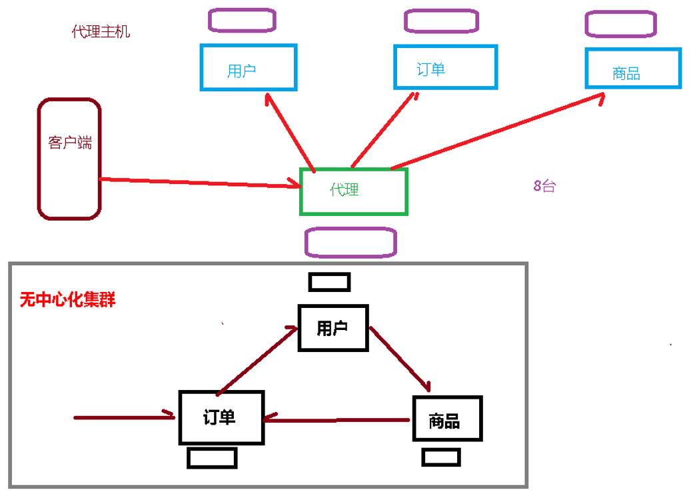


## 2、什么是集群


Redis 集群实现了对Redis的水平扩容，<font style="color:#E8323C;">即启动N个redis节点，将整个数据库分布存储在这N个节点中，每个节点存储总数据的1/N。</font>


Redis 集群通过分区（partition）来提供一定程度的可用性（availability）： <font style="color:#E8323C;">即使集群中有一部分节点失效或者无法进行通讯， 集群也可以继续处理命令请求。</font>


### 集群作用：


+ 分散单台服务器的访问压力，实现负载均衡


+ 分散单台服务器的存储压力，实现可扩展性


+ 降低单台服务器宕机带来的业务灾难


## 3、redis集群结构设计


### 数据存储设计


+ 通过算法设计，计算出key应该保存的位置


+ 将所有的存储空间计划切割成16384份，每台主机保存一部分 
    - 每份代表的是一个存储空间，不是一个key的保存空间


+ 将key按照计算出的结果放到对应的存储空间


+ 增强可扩展性


### 集群内部通讯设计


+ 各个数据库相互通信，保存各个库中槽的编号数据


+ 一次命中，直接返回


+ 一次未命中，告知具体位置


## 4、制作6个实例


删除持久化数据：将rdb，aof文件都删除掉


```plain
rm -rf *.rdb
```


<font style="color:#E8323C;">三组主从</font>（一对一）架构


**6379,6380,6381,6389,6390,6391**


### 4.1、配置基本信息


开启daemonize yes


**Pid文件名字**


**指定端口**


Log文件名字


**Dump.rdb名字**


Appendonly 关掉或者换名字


### 4.2、redis cluster配置修改


```plain
//设置加入cluster，成为其中的节点
cluster-enabled yes

//设定节点配置文件名，该文件属于自动生成，仅用于快速查找文件并查询文件内容
cluster-config-file nodes-6379.conf 

//节点服务响应超时时间，用于判定该节点是否下线或切换为从节点
cluster-node-timeout 15000   

//master连接的slave最小数量
cluster-migration-barrier <count>
```


完整示例：


```plain
include /myredis/redis.conf
pidfile "/var/run/redis_6379.pid"
port 6379
dbfilename "dump6379.rdb"
masterauth ***
daemonize yes
protected-mode no
requirepass "***"
dir "/myredis"

cluster-enabled yes
cluster-config-file nodes-6379.conf
cluster-node-timeout 15000
```


### 4.3、拷贝多个redis.conf文件


```plain
cp redis6379.conf redis6380.conf
cp redis6379.conf redis6381.conf
cp redis6379.conf redis6389.conf
cp redis6379.conf redis6390.conf
cp redis6379.conf redis6391.conf
```


使用查找替换修改另外5个文件


```plain
%s/6379/6380
%s/6379/6381
%s/6379/6389
%s/6379/6390
%s/6379/6391
```


### 4.4、启动6个redis服务


```plain
redis-server redis6379.conf
redis-server redis6380.conf
redis-server redis6381.conf
redis-server redis6389.conf
redis-server redis6390.conf
redis-server redis6391.conf
```


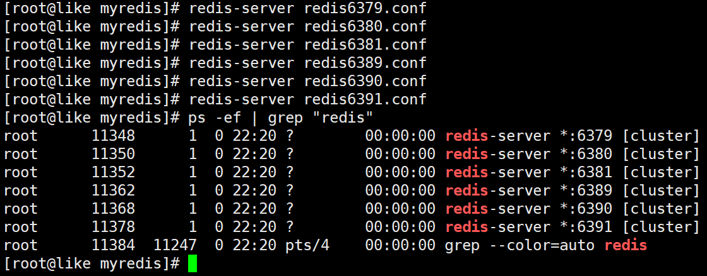


## 5、将六个节点合成一个集群


组合之前，请**<font style="color:#E8323C;">确保所有redis实例启动</font>**后，nodes-xxxx.conf文件都生成正常。


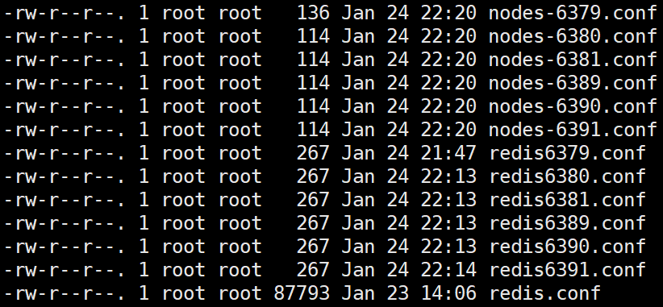


+ 合体：


```plain
cd /opt/redis-6.2.1/src
```


```plain
//1:一个master连1个slave	主在前，从在后   三组，前三个为主，后三个为从
redis-cli -a 321612 --cluster create --cluster-replicas 1 192.168.199.155:6379 
192.168.199.155:6380 192.168.199.155:6381 192.168.199.155:6389 192.168.199.155:6390 192.168.199.155:6391
```


注意：


> 此处不要用127.0.0.1， 请用真实IP地址
>
>  
>
> --replicas 1 采用最简单的方式配置集群，一台主机，一台从机，正好三组。
>


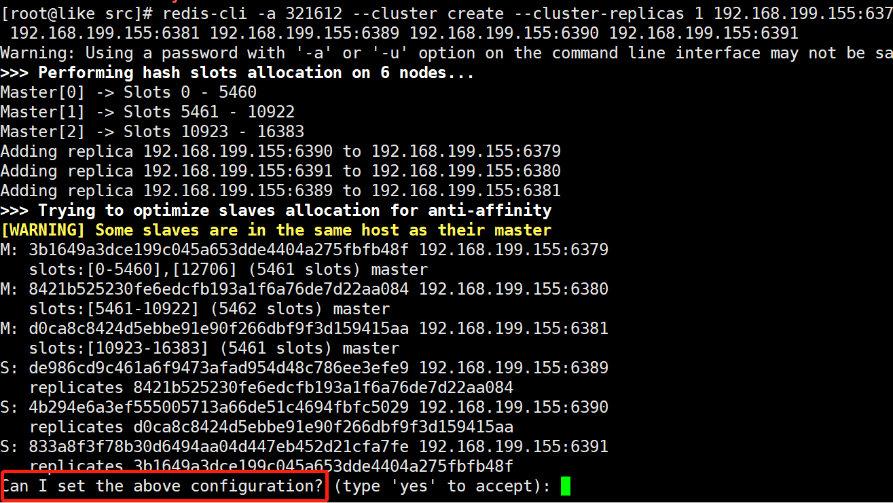


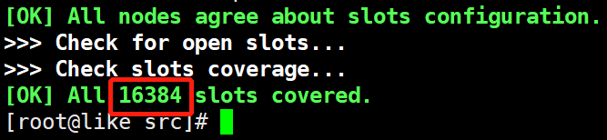


## 6、普通方式登录


可能直接进入读主机，存储数据时，会出现MOVED重定向操作。<font style="color:#E8323C;">所以，应该以集群方式登录。</font>


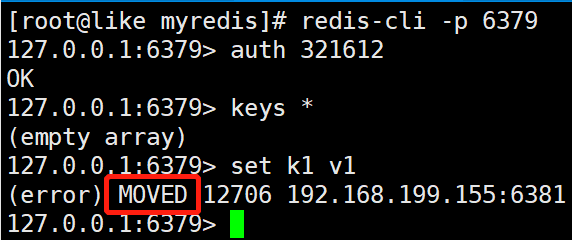


## 7、集群方式登录


<font style="color:#E8323C;">-c 采用集群策略连接，</font>设置数据会自动切换到相应的写主机


```plain
redis-cli -c -p 6379 -a 321612
```


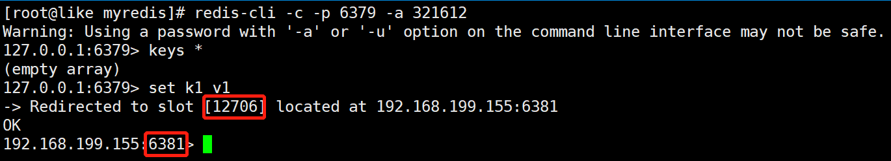


## 8、查看集群信息


通过 cluster nodes 命令


## 9、如何分配这六个节点


<font style="color:#E8323C;">一个集群至少要有三个主节点。</font>


选项 --cluster-replicas 1 表示我们希望为集群中的每个主节点创建一个从节点。


分配原则尽量保证每个主数据库运行在不同的IP地址，每个从库和主库不在一个IP地址上。


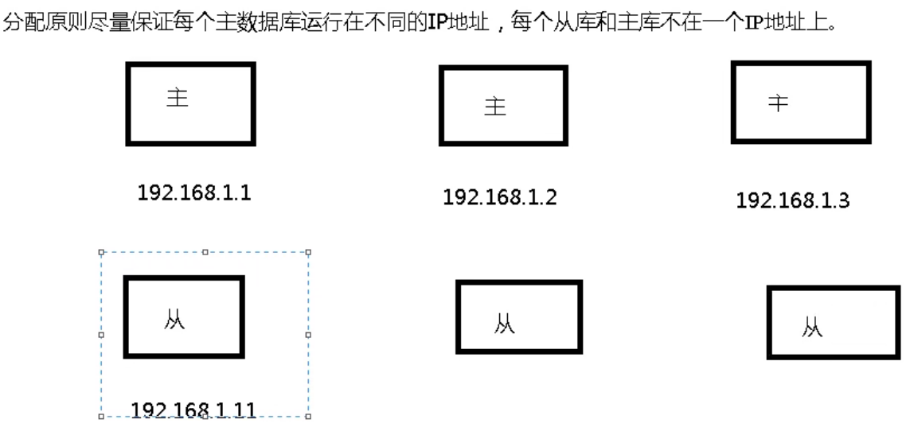


## 10、什么是slots


```plain
[OK] All nodes agree about slots configuration.
>>> Check for open slots...
>>> Check slots coverage...
[OK] All 16384 slots covered.
```


<font style="color:#E8323C;">一个 Redis 集群包含 16384 个插槽（hash slot）</font>， 数据库中的每个键都属于这 16384 个插槽的其中一个，


集群使用公式 CRC16(key) % 16384 来计算键 key 属于哪个槽， 其中 CRC16(key) 语句用于计算键 key 的 CRC16 校验和 。


集群中的每个节点负责处理一部分插槽。


举个例子， 如果一个集群可以有主节点， 其中：


节点 A 负责处理 0 号至 5460 号插槽。


节点 B 负责处理 5461 号至 10922 号插槽。


节点 C 负责处理 10923 号至 16383 号插槽。


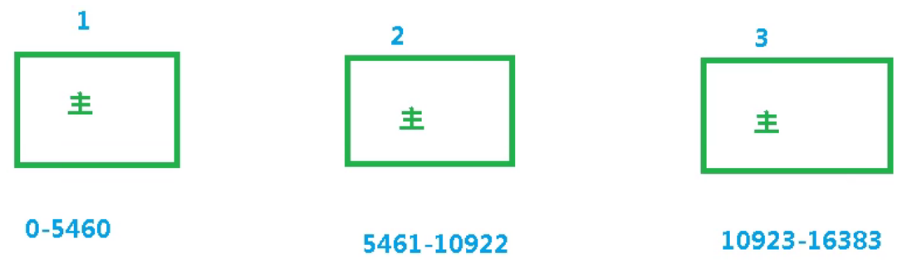


## 11、在集群中录入值


在redis-cli每次录入、查询键值，redis都会计算出该key应该送往的插槽，如果不是该客户端对应服务器的插槽，redis会报错，并告知应前往的redis实例地址和端口。


redis-cli客户端提供了 **<font style="color:#E8323C;">–c 参数实现自动重定向</font>**<font style="color:#E8323C;">。</font>


如 **redis-cli -c -p 6379 -a 321612** 登入后，再录入、查询键值对可以自动重定向。


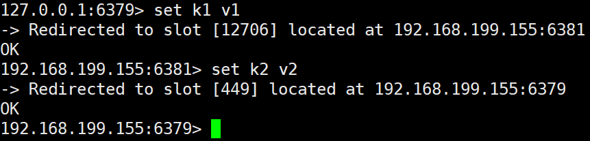


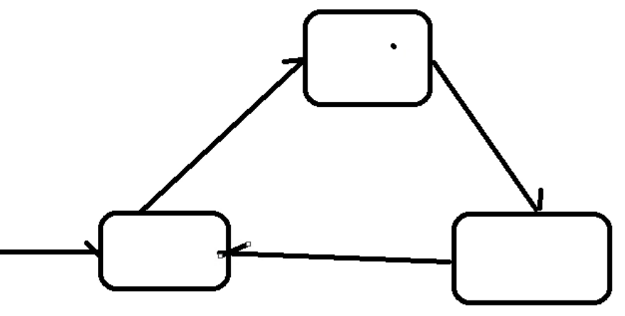


+ 不在一个slot下的键值，是不能使用mget，mset等多键操作


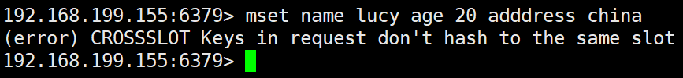


+ 可以通过{}来定义组的概念，从而使key中{}内相同内容的键值对放到一个slot中去


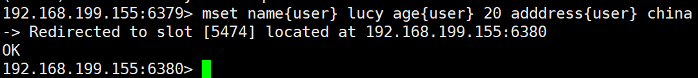


## 12、查询集群中的值


```plain
//得到key的插槽值
cluster keyslot key

//计算插槽值里面有几个键（只能看本服务器自己插槽中的）
cluster countkeysinslot <slot>

//返回 count 个 slot 槽中的键。
cluster getkeysinslot <slot> <count>
```


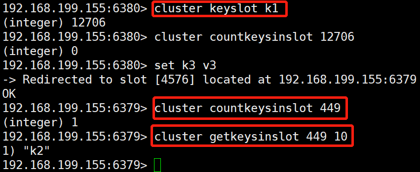


## 13、故障恢复


###  如果主节点下线？从节点能否自动升为主节点？


可以 


注意：**15秒超时**


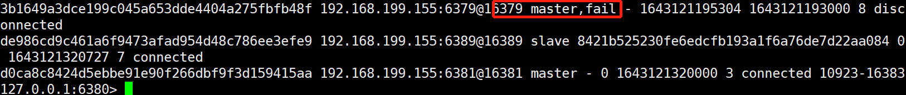


###  主节点恢复后，主从关系会如何？
  
主节点回来变成从机。 


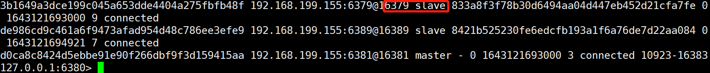


### 如果所有某一段插槽的主从节点都宕掉，redis服务是否还能继续? 


+ 如果某一段插槽的主从都挂掉，而cluster-require-full-coverage 为yes ，那么 ，<font style="color:#E8323C;">整个集群都挂掉</font>


+ 如果某一段插槽的主从都挂掉，而cluster-require-full-coverage 为no ，那么，<font style="color:#E8323C;">该插槽数据全都不能使用，也无法存储。</font>


redis.conf中的参数


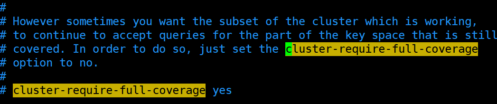


## 14、集群的Jedis开发


<font style="color:#E8323C;">即使连接的不是主机，集群会自动切换主机存储。主机写，从机读。</font>


无中心化主从集群。<font style="color:#E8323C;">无论从哪台主机写的数据，其他主机上都能读到数据。</font>


```java
package com.atguigu.jedis;

import redis.clients.jedis.HostAndPort;
import redis.clients.jedis.JedisCluster;
import redis.clients.jedis.JedisPoolConfig;

import java.util.HashSet;
import java.util.Set;

public class JedisClusterTest {

    public static void main(String[] args) {
        
        JedisPoolConfig config = new JedisPoolConfig();
        config.setMaxTotal(500);
        config.setMinIdle(2);
        config.setMaxIdle(500);
        config.setMaxWaitMillis(10000);
        config.setTestOnBorrow(true);
        config.setTestOnReturn(true);

        //创建对象
        Set<HostAndPort> nodes = new HashSet<>();
        nodes.add(new HostAndPort("192.168.199.155", 6379));
        JedisCluster jedisCluster = new JedisCluster(nodes, 10000, 10000, 100, "321612", config);

        //进行操作
        jedisCluster.set("k1", "v1");
        System.out.println(jedisCluster.get("k1"));

        //关闭
        jedisCluster.close();
    }

}
```


## 15、Redis集群优势


实现扩容


分摊压力


无中心配置相对简单


## 16、Redis集群的不足


多键操作是不被支持的


多键的Redis事务是不被支持的。lua脚本不被支持


由于集群方案出现较晚，很多公司已经采用了其他的集群方案，而代理或者客户端分片的方案想要迁移至redis cluster，需要整体迁移而不是逐步过渡，复杂度较大。


> 更新: 2022-08-12 17:32:07  
> 原文: <https://www.yuque.com/like321/qgn2qc/oubafd>