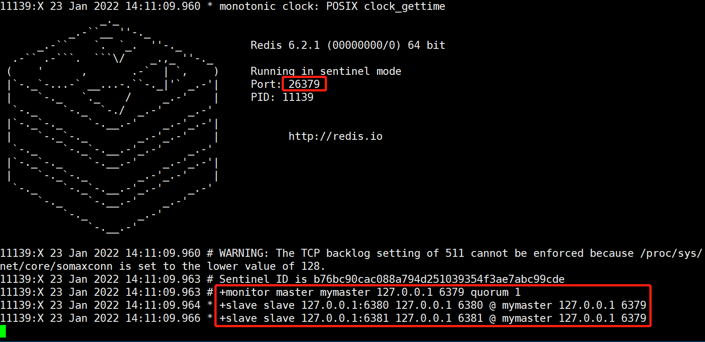

# 十二、哨兵(Sentinel)

## 6、哨兵模式


### 6.1、是什么


**<font style="color:#E8323C;">反客为主的自动版</font>**<font style="color:#E8323C;">，</font>能够后台监控主机是否故障，如果故障了根据投票数自动将从库转换为主库


哨兵(sentinel)是一个分布式系统，用于对主从结构中的每台服务器进行`监控`，当出现故障时通过投票机制`选择`新的master并将所有slave连接到新的master


#### 哨兵的作用：


+  监控 
    - 不断的检查master和slave是否正常运行
    - master存活检测、master与slave运行情况检测


+  通知（提醒） 


+  自动故障转移 
    - 断开master与slave连接，选取一个slave作为master，将其他slave连接到新的master，并告知客户端新的服务器地址


注意：


> <font style="color:#E8323C;">哨兵也是一台redis服务器，只是不提供数据服务</font>
>
>  
>
> 通常哨兵配置数量为单数
>


### 6.2、启用哨兵模式


1. 调整为一主二仆模式，6379带着6380、6381


#### 配置哨兵


自定义的/myredis目录下新建sentinel.conf文件，


```plain
//端口
port 26379

//信息存储目录
dir /tmp

//mymaster：自定义的名	
//1：多少个哨兵认为主挂掉，通常设定（哨兵数量/2）+1
sentinel monitor mymaster 127.0.0.1 6379 1

//设置sentinel连接的master和slave的密码，这个需要和redis.conf文件中设置的密码一样
sentinel auth-pass mymaster ***

//监控的主多长时间没响应
sentinel down-after-milliseconds mymaster 30000

//当在执行故障转移时，设置几个slave同时进行切换master,该值越大，则可能就有越多的slave在切换master时不可用，可以将该值设置为1，即一个一个来，
//这样在某个slave进行切换master同步数据时，其余的slave还能正常工作，以此保证每次只有一个从服务器处于不能处理命令请求的状态。
sentinel parallel-syncs mymaster 1

//在sentinel检测到O_DOWN后，是否对这台redis启动failover机制
sentinel can-failover mymaster yes

//failover过期时间，当failover开始后，在此时间内仍然没有触发任何failover操作，当前sentinel将会认为此次failoer失败。 
执行故障迁移超时时间，即在指定时间内没有大多数的sentinel 反馈master下线，该故障迁移计划则失效
sentinel failover-timeout mymaster 180000

//选项指定了在执行故障转移时， 最多可以有多少个从服务器同时对新的主服务器进行同步。这个数字越小， 完成故障转移所需的时间就越长。
sentinel config-epoch mymaster 0

//当failover时，可以指定一个"通知"脚本用来告知当前集群的情况。
脚本被允许执行的最大时间为60秒，如果超时，脚本将会被终止(KILL)
sentinel notification-script mymaster /var/redis/notify.sh


//同时一时间最多0个slave可同时更新配置,建议数字不要太大,以免影响正常对外提供服务。
sentinel leader-epoch mymaster 0
```


#### 启动哨兵 


redis-sentinel sentinel-端口号.conf


```plain
cd /usr/local/redis/bin

redis-sentinel  /myredis/sentinel.conf
```





#### 当主机挂掉，从机选举中产生新的主机


(大概10秒左右可以看到哨兵窗口日志，切换了新的主机)


哪个从机会被选举为主机呢？根据优先级别：<font style="color:#E8323C;">slave-priority</font>


注意：


> 原主机重启后会变为从机。
>


注意：


当一个master配置为需要密码才能连接时，客户端和slave在连接时都需要提供密码。


> master通过requirepass设置自身的密码，不提供密码无法连接到这个master。
>
>  
>
> slave通过masterauth来设置访问master时的密码。
>


但是当使用了sentinel时，由于一个master可能会变成一个slave，一个slave也可能会变成master，<font style="color:#E8323C;">所以需要同时设置上述两个配置项。</font>


####  复制延时
  
由于所有的写操作都是先在Master上操作，然后同步更新到Slave上，所以从Master同步到Slave机器有一定的延迟，当系统很繁忙的时候，延迟问题会更加严重，Slave机器数量的增加也会使这个问题更加严重。 


### 6.3、故障恢复


优先级在redis.conf中默认：<font style="color:#E8323C;">slave-priority 100，值越小优先级越高</font>


偏移量是指获得原主机数据最全的


每个redis实例启动后都会随机生成一个40位的runid


### 6.4、哨兵工作原理


哨兵在进行主从切换过程中经历三个阶段


####  监控	用于同步各个节点的状态信息 


+  获取各个sentinel的状态(是否在线) 


+  获取master的状态 
    - master属性 
        * runid
        * role：master
    - 各个slave的详细信息


+  获取所有slave的状态（根据master中的slave信息）
    - slave属性 
        * runid
        * role：slave
        * master_host、master_port
        * offset
        * ……


####  通知 


####  故障转移 
+ 投票选择哪个sentinel，来做处理者


+ 服务器列表中挑选备选master 
    - 在线的
    - 响应慢的
    - 与原master断开时间久的
    - 优先原则 
        * 优先级
        * offset
        * runid


+ 发送指令（sentinel） 
    - 向新的master发送slaveof no one
    - 向其他slave发送slaveof新masterip端口


### 6.5、java中使用哨兵模式


```java
private static JedisSentinelPool jedisSentinelPool = null;

public static Jedis getJedisFromSentinel() {

    if (jedisSentinelPool != null) {
        return jedisSentinelPool.getResource();
    }

    //哨兵信息
    Set<String> sentinelSet = new HashSet<>();
    sentinelSet.add("192.168.11.103:26379");

    JedisPoolConfig jedisPoolConfig = new JedisPoolConfig();
    jedisPoolConfig.setMaxTotal(10); //最大可用连接数
    jedisPoolConfig.setMaxIdle(5); //最大闲置连接数
    jedisPoolConfig.setMinIdle(5); //最小闲置连接数
    jedisPoolConfig.setBlockWhenExhausted(true); //连接耗尽是否等待
    jedisPoolConfig.setMaxWaitMillis(2000); //等待时间
    jedisPoolConfig.setTestOnBorrow(true); //连接的时候进行一下测试 ping pong
    //创建连接池
    jedisSentinelPool = new JedisSentinelPool("mymaster", sentinelSet, jedisPoolConfig, "321612");
    
    return jedisSentinelPool.getResource();
}
```


> 更新: 2022-08-12 16:44:35  
> 原文: <https://www.yuque.com/like321/qgn2qc/sxofk4>