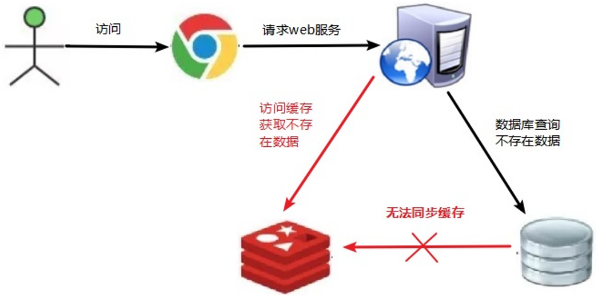
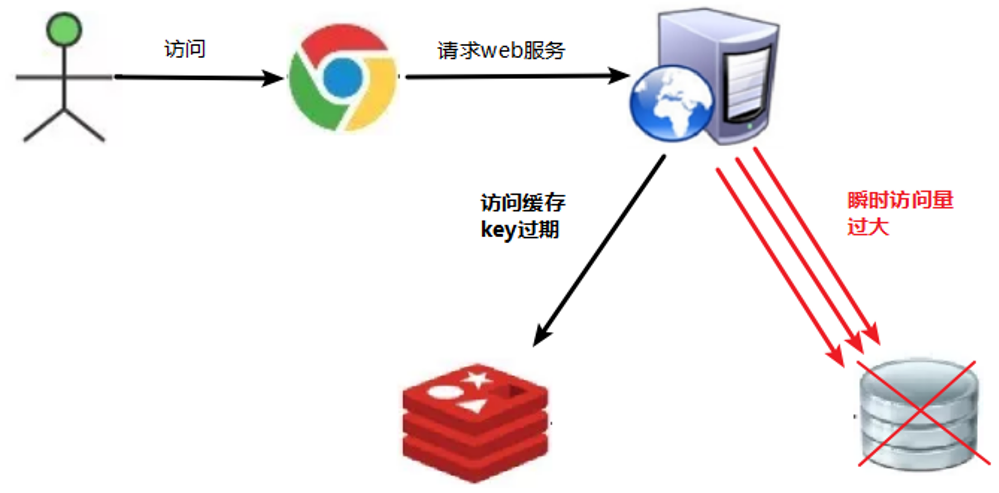
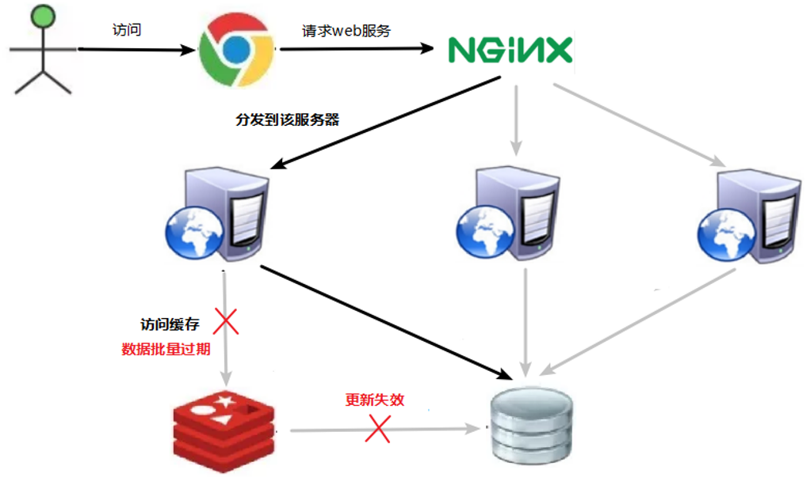
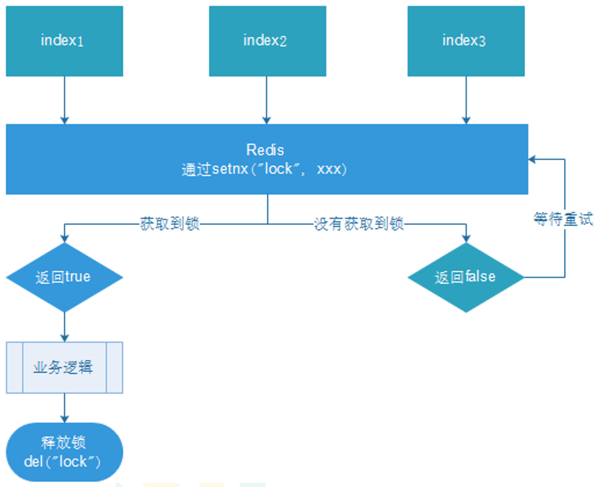
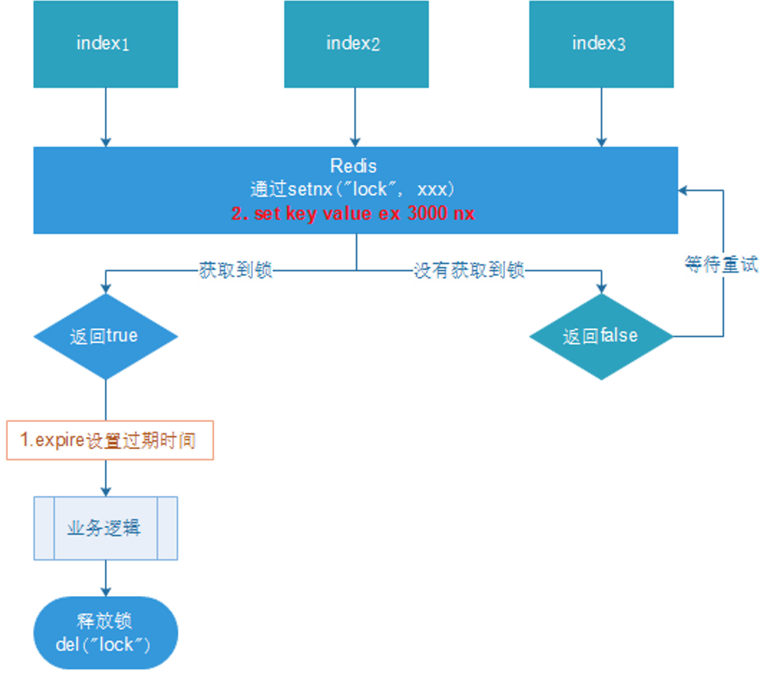
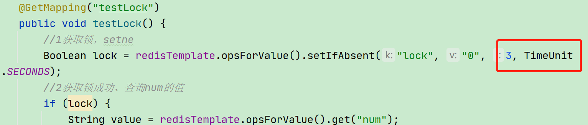
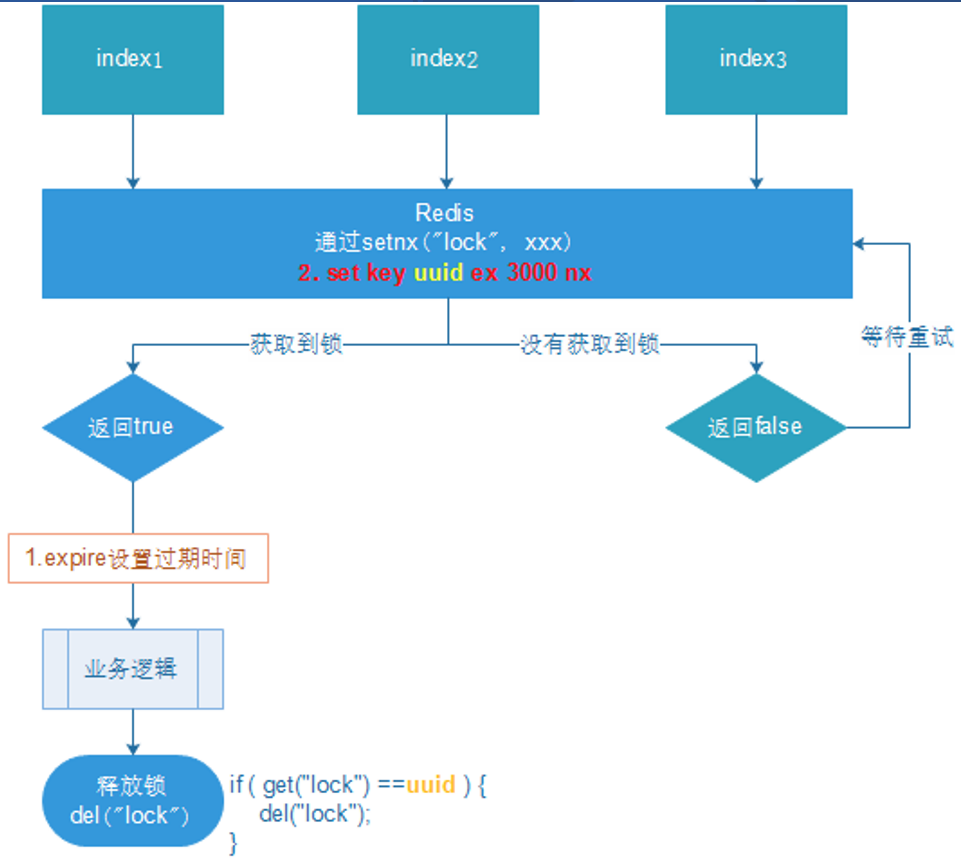
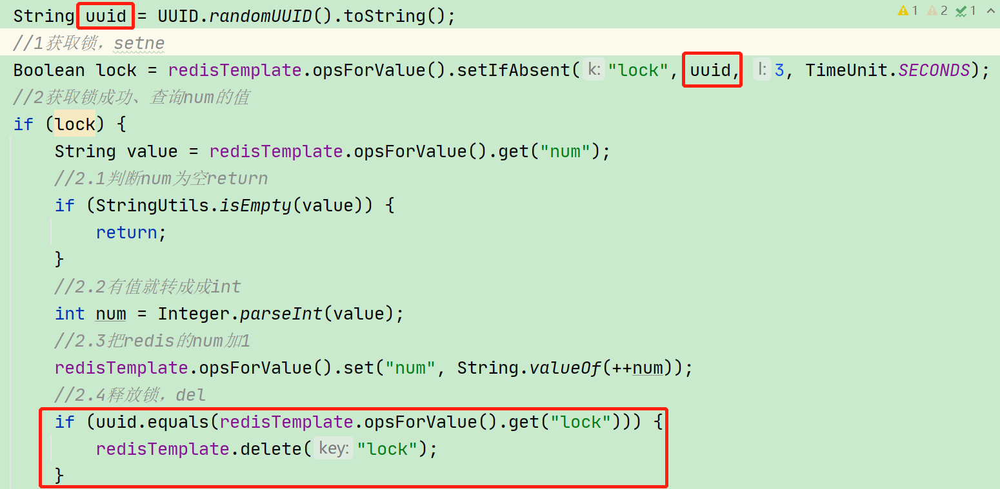

# 十五、企业级解决方案

## 1、缓存穿透


### 1、问题描述


key对应的数据在数据源并不存在，每次针对此key的请求从缓存获取不到，<font style="color:#E8323C;">请求都会压到数据源，从而可能压垮数据源。</font>


比如用一个不存在的用户id获取用户信息，不论缓存还是数据库都没有，若黑客利用此漏洞进行攻击可能压垮数据库。





### 2、解决方案


一个一定不存在缓存及查询不到的数据，由于缓存是不命中时被动写的，并且出于容错考虑，如果从存储层查不到数据则不写入缓存，这将导致这个不存在的数据每次请求都要到存储层去查询，失去了缓存的意义。


####  对空值缓存：
**  
**如果一个查询返回的数据为空（不管是数据是否不存在），我们仍然把这个空结果（null）进行缓存，设置空结果的过期时间会很短，最长不超过五分钟 


####  设置可访问的名单（白名单）： 


使用bitmaps类型定义一个可以访问的名单，名单id作为bitmaps的偏移量，每次访问和bitmap里面的id进行比较，如果访问id不在bitmaps里面，进行拦截，不允许访问。


#### 采用布隆过滤器：


(布隆过滤器（Bloom Filter）是1970年由布隆提出的。它实际上是一个很长的二进制向量(位图)和一系列随机映射函数（哈希函数）。


布隆过滤器可以用于检索一个元素是否在一个集合中。它的优点是空间效率和查询时间都远远超过一般的算法，缺点是有一定的误识别率和删除困难。)


将所有可能存在的数据哈希到一个足够大的bitmaps中，一个一定不存在的数据会被 这个bitmaps拦截掉，从而避免了对底层存储系统的查询压力。


#### 进行实时监控：


当发现Redis的命中率开始急速降低，需要排查访问对象和访问的数据，和运维人员配合，可以设置黑名单限制服务


### 数据库服务器崩溃


1.  系统平稳运行过程中 
2.  应用服务器流量随时间增量较大 
3.  redis服务器命中率随时间逐步降低 
4.  redis内存平稳，内存无压力 
5.  redis服务器cpu占用激增 
6.  数据库服务器压力激增 
7.  数据库崩溃 


### 问题排查


1.  redis中大面积出现未命中 
2.  出现非正常url访问 


### 问题分析


+  获取的数据在数据库中也不存在，数据库查询未得到对应数据 
+  redis获取到null数据未进行持久化，直接返回 
+  下次此类数据到达，重复上述过程 
+  出现黑客攻击服务器 


### 解决方案（术）


1.  缓存null  
对查询结果为null的数据进行缓存（长期使用，定期清理），设定短时限，例如30-60秒，最高5分钟 


2.  白名单策略 
    - 提前预热各种分类数据id对应的bitmaps，id作为bitmaps的offset，相当于设置了数据白名单。当加载正常数据时，放行，加载异常数据时直接拦截（效率偏低）
    - 使用布隆过滤器（有关布隆过滤器的命中问题对当前状况可以忽略）


3.  实施监控  
实时监控redis命中率（业务正常范围时，通常会有一个波动值）与null数据的占比 
    - 非活动时段波动：通常检测3-5倍，超过5倍纳入重点排查对象
    - 活动时段波动：通常检测10-50倍，超过50倍纳入重点排查对象

根据倍数不同，启动不同的排查流程。然后使用黑名单进行防控（运营）

 

4.  key加密  
问题出现后，临时启动防灾业务key，对key进行业务层传输加密服务，设定校验程序，过来的key校验  
例如每天随机分配60个加密串，挑选2到3个，混淆到页面数据id中，发现访问key不满足规则，驳回数据访问 


### 总结


缓存穿透：<font style="color:#E8323C;">访问了不存在的数据，跳过了合法数据的redis数据缓存阶段，每次访问数据库，导致对数据库服务器造成压力。</font>通常此类数据的出现量是一个较低的值，当出现此类情况以毒攻毒，并及时报警。


应对策略应该在临时预案防范方面多做文章。


无论是黑名单还是白名单，都是对整体系统的压力，警报解除后尽快移除。


## 2、缓存击穿


### 1、问题描述


key对应的数据存在，但在redis中过期，此时若有大量并发请求过来，这些请求发现缓存过期一般都会从后端DB加载数据并回设到缓存，这个时候大并发的请求可能会瞬间把后端DB压垮。





### 2、解决方案


key可能会在某些时间点被超高并发地访问，是一种非常“热点”的数据。这个时候，需要考虑一个问题：缓存被“击穿”的问题。


解决问题：


####  预先设置热门数据：


在redis高峰访问之前，把一些热门数据提前存入到redis里面，加大这些热门数据key的时长 


####  实时调整：


现场监控哪些数据热门，实时调整key的过期时长 


####  使用锁： 


1.  就是在缓存失效的时候（判断拿出来的值为空），不是立即去load db。 
2. 先使用缓存工具的某些带成功操作返回值的操作（比如Redis的SETNX）去set一个mutex key 
3. 当操作返回成功时，再进行load db的操作，并回设缓存，,最后删除mutex key； 
4.  当操作返回失败，证明有线程在load db，当前线程睡眠一段时间再重试整个get缓存的方法。 


### 数据库服务器崩溃


1.  系统平稳运行过程中 
2.  数据库连接量瞬间激增 
3.  redis服务器无大量key过期 
4.  redis内存平稳，无波动 
5.  redis服务器cpu正常 
6.  数据库崩溃 


### 问题排查


1.  redis中某个key过期，该key访问量巨大 
2.  多个数据请求从服务器直接压到redis后，均未命中 
3.  redis在短时间内发起了大量对数据库中同一数据的访问 


### 问题分析


+  单个key高热数据 
+  key过期 


### 解决方案（术）


1.  预先设定  
以电商为例，每个商家根据店铺等级，指定若干款主打商品，在购物节期间，加大此类信息key的过期时长  
注意：购物节不仅仅指当天，以及后续若干天，访问峰值呈现逐渐降低的趋势 


2.  现场调整  
监控访问量，对自然流量激增的数据延长过期时间或设置为永久性key 


3.  后台刷新数据  
启动定时任务，高峰期来临之前，刷新数据有效期，确保不丢失 


4.  二级缓存  
设置不同的失效时间，保障不会被同时淘汰就行 


5.  加锁  
分布式锁，防止被击穿，但是要注意也是性能瓶颈，慎重！ 


### 总结


<font style="color:#E8323C;">缓存击穿就是单个高热数据过期的瞬间，数据访问量较大，未命中redis后，发起了大量对同一数据的数据库访问，导致对数据库服务器造成压力。</font>


应对策略应该在业务数据分析与预防方面进行，配合运行监控测试与即时调整策略，毕竟单个key的过期监控难度较高，配合雪崩处理策略即可。


## 3、缓存雪崩


### 1、问题描述


key对应的数据存在，但在redis中过期，此时若有大量并发请求过来，这些请求发现缓存过期一般都会从后端DB加载数据并回设到缓存，这个时候大并发的请求可能会瞬间把后端DB压垮。


<font style="color:#E8323C;">缓存雪崩与缓存击穿的区别在于这里针对很多key缓存，前者则是某一个key正常访问</font>


缓存失效瞬间：





### 2、解决方案


缓存失效时的雪崩效应对底层系统的冲击非常可怕！


解决方案：


####  构建多级缓存架构：


nginx缓存 + redis缓存 +其他缓存（ehcache等） 


####  使用锁或队列：  

用加锁或者队列的方式保证来保证不会有大量的线程对数据库一次性进行读写，从而避免失效时大量的并发请求落到底层存储系统上。不适用高并发情况 


####  设置过期标志更新缓存：  

记录缓存数据是否过期（设置提前量），如果过期会触发通知另外的线程在后台去更新实际key的缓存。 


####  将缓存失效时间分散开：
  
比如我们可以在原有的失效时间基础上增加一个随机值，比如1-5分钟随机，这样每一个缓存的过期时间的重复率就会降低，就很难引发集体失效的事件。 


### 数据库服务器崩溃


1.  系统平稳运行过程中，忽然数据库连接量激增 
2.  应用服务器无法及时处理请求 
3.  大量408，500错误页面出现 
4.  客户反复刷新页面获取数据 
5.  数据库崩溃 
6.  应用服务器崩溃 
7.  重启应用服务器无效 
8.  redis服务器崩溃 
9.  redis集群崩溃 
10.  重启数据库后再次被瞬间流量放倒 


### 问题排查


1.  在一个**较短**的时间内，缓存中**较多**的key**集中过期** 
2.  此周期内请求访问过期的数据，redis未命中，redis向数据库获取数据 
3.  数据库同时接收到大量的请求无法及时处理 
4.  redis大量请求被积压，开始出现超时现象 
5.  数据库流量激增，数据库崩溃 
6.  重启后仍然面对缓存中无数据可用 
7.  redis服务器资源被严重占用，redis服务器崩溃 
8.  redis集群呈现崩塌，集群瓦解 
9.  应用服务器无法及时得到数据响应请求，来自客户端的请求数量越来越多，应用服务器崩溃 
10.  应用服务器，redis，数据库全部重启，效果不理想 


### 问题分析


+  短时间范围内 
+  大量key集中过期 


### 解决方案（道）


1.  更多的页面静态化处理 


2.  构建多级缓存架构  
nginx缓存+redis缓存+ehcache缓存 


3.  检测mysql严重耗时业务进行优化  
对数据库的瓶颈排查：例如超时查询、耗时较高事务等 


4.  灾难预警机制  
监控redis服务器性能指标 
    -  cpu占用、cpu使用率 
    -  内存容量 
    -  查询平均响应时间 
    -  线程数 


5.  限流、降级  
短时间范围内牺牲一些客户体验，限制一部分请求访问，降低应用服务器压力，待业务低速运转后再逐步放开访问 


### 解决方案（术）


1.  lru与lfu切换 


2.  数据有效期策略调整 
    -  根据业务数据有效期进行分类错峰，a类90分钟，b类80分钟，c类70分钟 
    -  过期时间使用固定时间+随机值的形式，稀释集中到期的key的数量 


3.  超热数据使用永久key 


4.  定期维护（自动+人工）  
对即将过期数据做访问量分析，确认是否延时，配合访问量统计，做热点数据的延时 


5.  加锁  
慎用！ 


### 总结


<font style="color:#E8323C;">缓存雪崩就是瞬间过期数据量太大，导致对数据库服务器造成压力。</font>


如能够有效避免过期时间集中，可以有效解决雪崩现象的出现（约40%），配合其他策略一起使用，并监控服务器的运行数据，根据运行记录做快速调整。


## 4、缓存预热


### 问题：


服务器启动后迅速宕机


### 排查：


1、请求数量较高


2、主从之间数据吞吐量较大，数据同步操作频度较高


### 解决方案：


+  前置准备工作：  
1、日常例行统计数据访问记录，统计访问频度较高的热点数据  
2、利用lru数据删除策略，构建数据留存队列 


+  准备工作：  
将统计结果中的数据分类，根据级别，redis优先加载级别较高的热点数据  
利用分布式多服务器同时进行数据读取，提速数据加载过程 


+  实施：  
使用脚本程序固定触发数据预热过程  
如果条件允许，使用了cdn(内容分发网络)，效果会更好 


### 总结：


<font style="color:#E8323C;">缓存预热就是系统启动前，提前将相关的缓存数据直接加载到缓存系统。</font>

<font style="color:#E8323C;"></font>

<font style="color:#E8323C;">避免在用户请求的时候，先查询数据库，然后再将数据缓存的问题！</font>


用户直接查询事先被预热的缓存数据。


## 5、性能指标监控


### 性能指标：performance
| name | description |
| --- | --- |
| latency | redis响应一个请求的时间 |
| instantaneous_ops_per_sec | 平均每秒处理请求总数 |
| hit rate（calculated） | 缓存命中率（计算出来的） |


### 内存指标：memory
| name | description |
| --- | --- |
| used_memory | 已使用内存 |
| mem_fragmentation_ratio | 内存碎片率 |
| evicted_keys | 由于最大内存限制被移除的key的数量 |
| blocked_clients | 由于blpoop，brpop，or brpoplpush而被阻塞的客户端 |


### 基本活动指标：basic activity
| name | description |
| --- | --- |
| connected_clients | 客户端连接数 |
| connected_slaves | slave数量 |
| master_last_io_seconds_ago | 最近一次主从交互之后的秒数 |
| keyspace | 数据库中的key值总数 |


### 持久性指标：persistence
| name | description |
| --- | --- |
| rdb_last_save_time | 最后一次持久化保存到磁盘的时间戳 |
| rdb_changes_since_last_save | 自最后一次持久化以来数据库的更改数 |


### 错误指标：error
| name | description |
| --- | --- |
| rejected_connections | 由于达到maxclient限制而被拒绝的连接数 |
| keyspace_misses | key值查找失败（没有命中）次数 |
| master_link_down_since_seconds | 主从断开的持续时间（以秒为单位） |


## 6、性能指标监控命令


### benchmark


```plain
redis-benchmark [-h ] [-p ] [-c ] [-n <requests]> [-k ]
```


```plain
//默认：50个连接，10000次请求对应的性能
redis-benchmark

//100个连接，5000次请求对应的性能
redis-benchmark -c 100 -n 5000
```


### monitor	


打印服务器调试信息


```plain
monitor
```


### slowlog  [operator] 


+  get ：获取慢查询日志 
+  len ：获取慢查询日志条目数 
+  reset ：重置慢查询日志 


```plain
slowlog get
```


相关配置


```plain
slowlog-log-slower-than 1000 #设置慢查询的时间下线，单位：微妙

slowlog-max-len 100 #设置慢查询命令对应的日志显示长度，单位：命令数
```


## 7、分布式锁


### 问题描述


随着业务发展的需要，原单体单机部署的系统被演化成分布式集群系统后，<font style="color:#E8323C;">由于分布式系统多线程、多进程并且分布在不同机器上，</font>这将使原单机部署情况下的并发控制锁策略失效，单纯的Java API并不能提供分布式锁的能力。


为了解决这个问题就需要一种跨JVM的互斥机制来控制共享资源的访问，这就是分布式锁要解决的问题！


分布式锁主流的实现方案：


1.  基于数据库实现分布式锁 
2.  基于缓存（Redis等） 
3.  基于Zookeeper 


每一种分布式锁解决方案都有各自的优缺点：


1.  性能：redis最高 
2.  可靠性：zookeeper最高 


这里，我们就基于redis实现分布式锁。


### 解决方案


**使用redis实现分布式锁**


> 使用setnx设置一个公共锁，利用setnx命令的返回值特征（有值则返回设置失败，无值则返回设置成功）
>
>  
>
>  
>
> 操作完毕通过del操作释放锁
>

> 对于返回设置成功的，拥有控制权，进行下一步的具体业务操作
>
>  
>
> 对于返回设置失败的，不具有控制权，排队或等待
>





1.  多个客户端同时获取锁（setnx） 
2.  获取成功，执行业务逻辑{从db获取数据，放入缓存}，执行完成释放锁（del） 
3.  其他客户端等待重试 


### 编写代码


Redis: set num 0


```java
@Autowired
private StringRedisTemplate redisTemplate;


@GetMapping("testLock")
public void testLock() {
    //1获取锁，setne
    Boolean lock = redisTemplate.opsForValue().setIfAbsent("lock", "0");
    //2获取锁成功、查询num的值
    if (lock) {
        String value = redisTemplate.opsForValue().get("num");
        //2.1判断num为空return
        if (StringUtils.isEmpty(value)) {
            return;
        }
        //2.2有值就转成成int
        int num = Integer.parseInt(value);
        //2.3把redis的num加1
        redisTemplate.opsForValue().set("num", String.valueOf(++num));
        //2.4释放锁，del
        redisTemplate.delete("lock");
    } else {
        //3获取锁失败、每隔0.1秒再获取
        try {
            Thread.sleep(100);
            testLock();
        } catch (InterruptedException e) {
            e.printStackTrace();
        }
    }
}
```


基本实现。


问题：setnx刚好获取到锁，业务逻辑出现异常，导致锁无法释放


解决：设置过期时间，自动释放锁


### 设置锁的过期时间


设置过期时间有两种方式：


1.  首先想到通过expire设置过期时间（缺乏原子性：如果在setnx和expire之间出现异常，锁也无法释放） 
2.  在set时指定过期时间（推荐） 





设置过期时间：





问题：可能会释放其他服务器的锁。


场景：如果业务逻辑的执行时间是7s。执行流程如下


1.  index1业务逻辑没执行完，3秒后锁被自动释放。 
2.  index2获取到锁，执行业务逻辑，3秒后锁被自动释放。 
3.  index3获取到锁，执行业务逻辑 
4.  index1业务逻辑执行完成，开始调用del释放锁，这时释放的是index3的锁，导致index3的业务只执行1s就被别人释放。 


最终等于没锁的情况。


解决：setnx获取锁时，设置一个指定的唯一值（例如：uuid）；释放前获取这个值，判断是否自己的锁


### UUID防误删








问题：删除操作缺乏原子性。


场景：


1.  index1执行删除时，查询到的lock值确实和uuid相等 

```plain
uuid=v1

set(lock,uuid)

if (uuid.equals(redisTemplate.opsForValue().get("lock"))) {
```

 

2.  index1执行删除前，lock刚好过期时间已到，被redis自动释放  
在redis中没有了lock，没有了锁。 

```plain
redisTemplate.delete("lock");
```

 

3.  index2获取了lock  
index2线程获取到了cpu的资源，开始执行方法 

```plain
uuid=v2

set(lock,uuid)
```

 

4.  index1执行删除，此时会把index2的lock删除  
index1 因为已经在方法中了，所以不需要重新上锁。index1有执行的权限。index1已经比较完成了，这个时候，开始执行 

```plain
redisTemplate.delete("lock");
```

  
删除的index2的锁！ 


### LUA脚本保证删除的原子性


```java
@GetMapping("testLockLua")
public void testLockLua() {
    //1 声明一个uuid ,将做为一个value 放入我们的key所对应的值中
    String uuid = UUID.randomUUID().toString();
    //2 定义一个锁：lua 脚本可以使用同一把锁，来实现删除！
    String skuId = "25"; // 访问skuId 为25号的商品 100008348542
    String locKey = "lock:" + skuId; // 锁住的是每个商品的数据
    // 3 获取锁
    Boolean lock = redisTemplate.opsForValue().setIfAbsent(locKey, uuid, 3, TimeUnit.SECONDS);

    // 如果true
    if (lock) {
        // 执行的业务逻辑开始
        // 获取缓存中的num 数据
        Object value = redisTemplate.opsForValue().get("num");
        // 如果是空直接返回
        if (StringUtils.isEmpty(value)) {
            return;
        }
        // 不是空 如果说在这出现了异常！ 那么delete 就删除失败！ 也就是说锁永远存在！
        int num = Integer.parseInt(value + "");
        // 使num 每次+1 放入缓存
        redisTemplate.opsForValue().set("num", String.valueOf(++num));
        /*使用lua脚本来锁*/
        // 定义lua 脚本
        String script = "if redis.call('get', KEYS[1]) == ARGV[1] then return redis.call('del', KEYS[1]) else return 0 end";
        // 使用redis执行lua执行
        DefaultRedisScript<Long> redisScript = new DefaultRedisScript<>();
        redisScript.setScriptText(script);
        // 设置一下返回值类型 为Long
        // 因为删除判断的时候，返回的0,给其封装为数据类型。如果不封装那么默认返回String 类型，
        // 那么返回字符串与0 会有发生错误。
        redisScript.setResultType(Long.class);
        // 第一个要是script 脚本 ，第二个需要判断的key，第三个就是key所对应的值。
        redisTemplate.execute(redisScript, Arrays.asList(locKey), uuid);
    } else {
        // 其他线程等待
        try {
            // 睡眠
            Thread.sleep(1000);
            // 睡醒了之后，调用方法。
            testLockLua();
        } catch (InterruptedException e) {
            e.printStackTrace();
        }
    }
}
```


### 总结


1. 加锁


```java
// 1. 从redis中获取锁,set k1 v1 px 20000 nx
String uuid = UUID.randomUUID().toString();
Boolean lock = redisTemplate.opsForValue().setIfAbsent("lock", uuid, 2, TimeUnit.SECONDS);
```


2. 使用lua释放锁


```java
// 2. 释放锁 del
String script = "if redis.call('get', KEYS[1]) == ARGV[1] then return redis.call('del', KEYS[1]) else return 0 end";
// 设置lua脚本返回的数据类型
DefaultRedisScript<Long> redisScript = new DefaultRedisScript<>();
// 设置lua脚本返回类型为Long
redisScript.setResultType(Long.class);
redisScript.setScriptText(script);
redisTemplate.execute(redisScript, Arrays.asList("lock"),uuid);
```


3. 重试


```java
Thread.sleep(500);
testLock();
```


为了确保分布式锁可用，我们至少要确保锁的实现同时**满足以下四个条件**：


+ 互斥性。
    - 在任意时刻，只有一个客户端能持有锁。


+ 不会发生死锁。
    - 即使有一个客户端在持有锁的期间崩溃而没有主动解锁，也能保证后续其他客户端能加锁。


+ 解铃还须系铃人。
    - 加锁和解锁必须是同一个客户端，客户端自己不能把别人加的锁给解了。


+ 加锁和解锁必须具有原子性。


> 更新: 2022-08-15 00:22:19  
> 原文: <https://www.yuque.com/like321/qgn2qc/epd9ad>