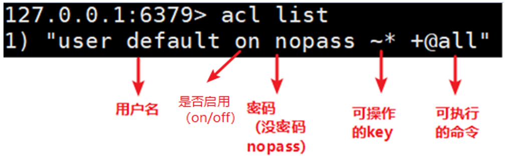
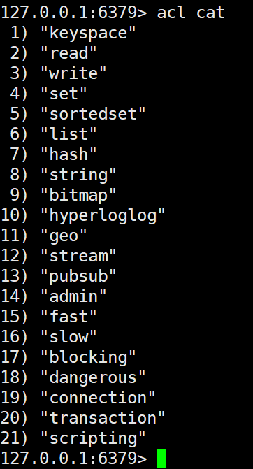
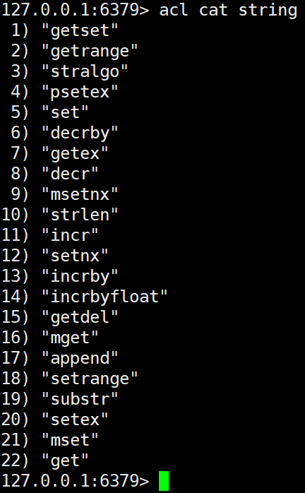
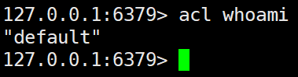
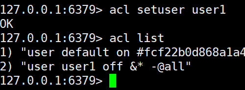
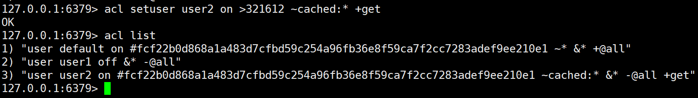
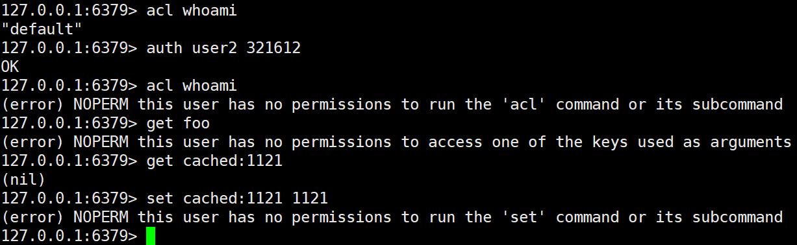
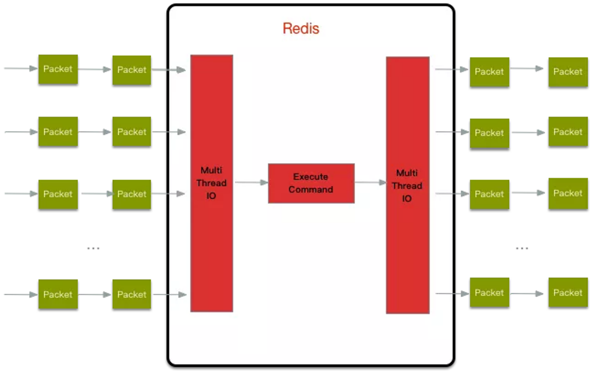
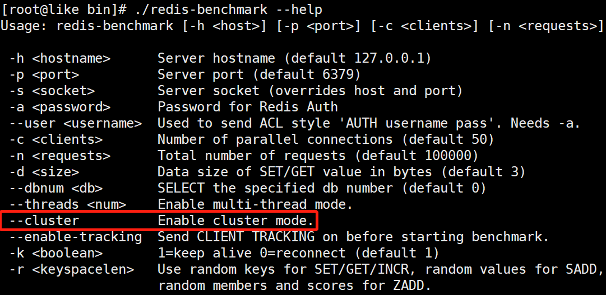

# 十六、Redis六新功能

## 1、ACL


### 1.1、简介


Redis ACL是Access Control List（访问控制列表）的缩写，该功能允许根据可以执行的命令和可以访问的键来限制某些连接。


在Redis 5版本之前，Redis 安全规则只有密码控制 还有通过rename 来调整高危命令比如 flushdb ， KEYS * ， shutdown 等。


Redis 6 则提供ACL的功能对用户进行更细粒度的权限控制 ：


1. 接入权限：用户名和密码
2. 可以执行的命令
3. 可以操作的 KEY


参考官网：[https://redis.io/topics/acl](https://redis.io/topics/acl)


### 1.2、命令


#### act list


使用acl list命令展现用户权限列表





#### acl cat


+ 查看添加权限指令类别





+ 加参数类型名可以查看类型下具体命令





#### acl whoami


使用acl whoami命令查看当前用户





#### aclsetuser


使用aclsetuser命令创建和编辑用户ACL


#### ACL规则


下面是有效ACL规则的列表。某些规则只是用于激活或删除标志，或对用户ACL执行给定更改的单个单词。其他规则是字符前缀，它们与命令或类别名称、键模式等连接在一起。

| ACL规则 | | |
| --- | --- | --- |
| 类型 | 参数 | 说明 |
| 启动和禁用用户 | **on** | 激活某用户账号 |
| | **off** | 禁用某用户账号。注意，已验证的连接仍然可以工作。如果默认用户被标记为off，则新连接将在未进行身份验证的情况下启动，并要求用户使用AUTH选项发送AUTH或HELLO，以便以某种方式进行身份验证。 |
| 权限的添加删除 | **+** | 将指令添加到用户可以调用的指令列表中 |
| | **-** | 从用户可执行指令列表移除指令 |
| | **+@** | 添加该类别中用户要调用的所有指令，有效类别为@admin、@set、@sortedset…等，通过调用ACL CAT命令查看完整列表。特殊类别@all表示所有命令，包括当前存在于服务器中的命令，以及将来将通过模块加载的命令。 |
| | -@ | 从用户可调用指令中移除类别 |
| | **allcommands** | +@all的别名 |
| | **nocommand** | -@all的别名 |
| 可操作键的添加或删除 | **~** | 添加可作为用户可操作的键的模式。例如~*允许所有的键 |


+ 通过命令创建新用户默认权限


```plain
acl setuser user1
```





在上面的示例中，我根本没有指定任何规则。如果用户不存在，这将使用just created的默认属性来创建用户。如果用户已经存在，则上面的命令将不执行任何操作。


+ 设置有用户名、密码、ACL权限、并启用的用户


```plain
acl setuser user2 on >321612 ~cached:* +get
```





+ 切换用户，验证权限





## 2、IO多线程


### 2.1、简介


Redis6终于支撑多线程了，告别单线程了吗？


<font style="color:#E8323C;">IO多线程其实指</font>**<font style="color:#E8323C;">客户端交互部分</font>**<font style="color:#E8323C;">的</font>**<font style="color:#E8323C;">网络IO</font>**<font style="color:#E8323C;">交互处理模块</font>**<font style="color:#E8323C;">多线程</font>**<font style="color:#E8323C;">，</font>而非**执行命令多线程**。


<font style="color:#E8323C;">Redis6执行命令依然是单线程。</font>


### 2.2、原理架构


Redis 6 加入多线程，但跟 Memcached 这种从 IO处理到数据访问多线程的实现模式有些差异。


Redis 的多线程部分只是用来处理网络数据的读写和协议解析，执行命令仍然是单线程。


之所以这么设计是不想因为多线程而变得复杂，需要去控制 key、lua、事务，LPUSH/LPOP 等等的并发问题。


整体的设计大体如下:





另外，多线程IO默认也是不开启的，需要再配置文件中配置


```plain
io-threads-do-reads yes 

io-threads 4
```


## 3、工具支持Cluster


之前老版Redis想要搭集群需要单独安装ruby环境，Redis5 将 redis-trib.rb 的功能集成到 redis-cli 。


另外官方 redis-benchmark 工具开始支持 cluster 模式了，通过多线程的方式对多个分片进行压测。





## 4、Redis新功能持续关注


Redis6新功能还有：


1、RESP3新的 Redis 通信协议：优化服务端与客户端之间通信


2、Client side caching客户端缓存：基于 RESP3 协议实现的客户端缓存功能。为了进一步提升缓存的性能，将客户端经常访问的数据cache到客户端。减少TCP网络交互。


3、Proxy集群代理模式：Proxy 功能，让 Cluster 拥有像单实例一样的接入方式，降低大家使用cluster的门槛。不过需要注意的是代理不改变 Cluster 的功能限制，不支持的命令还是不会支持，比如跨 slot 的多Key操作。


4、Modules API


Redis 6中模块API开发进展非常大，因为Redis Labs为了开发复杂的功能，从一开始就用上Redis模块。Redis可以变成一个框架，利用Modules来构建不同系统，而不需要从头开始写然后还要BSD许可。Redis一开始就是一个向编写各种系统开放的平台。


> 更新: 2022-08-13 11:05:41  
> 原文: <https://www.yuque.com/like321/qgn2qc/buupxx>