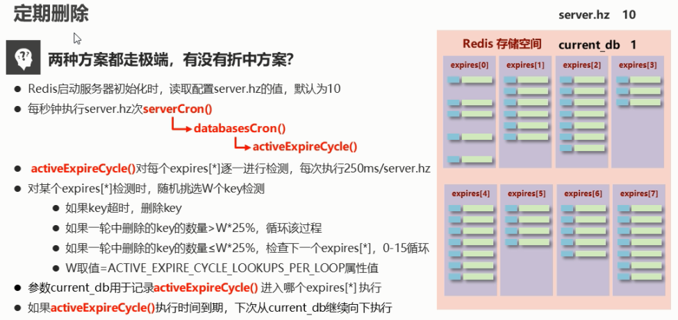
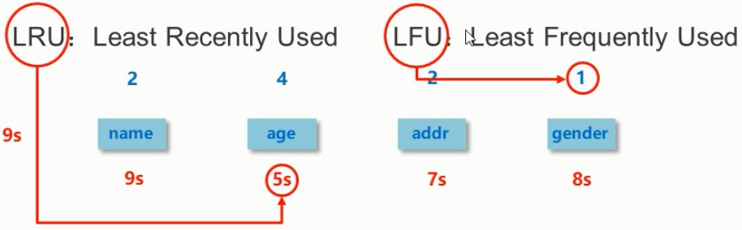
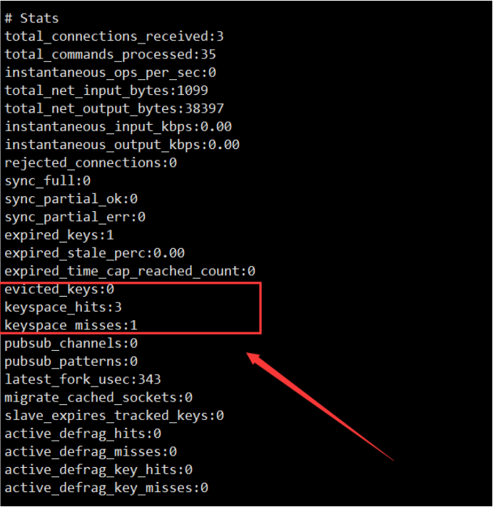
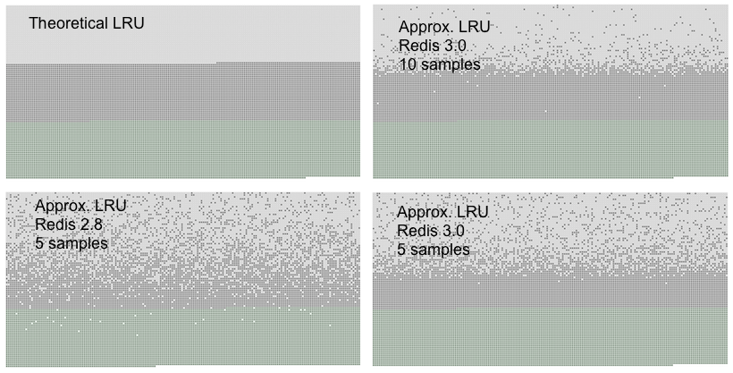

# 十四、删除策略


redis是一种内存级数据库，所有数据均存放在内存中，内存中的数据可以通过ttl指令获取其状态 

+ xx：具有时效性的数据
+ -1：永久有效的数据
+ -2：已经过期的数据 或 被删除的数据 或 未定义的数据


## 数据删除策略


**数据删除策略的目标：**


<font style="color:#E8323C;">在内存占用与cpu占用之间寻找一种平衡</font>，顾此失彼都会造成整体redis性能的下降，甚至引发服务器宕机或内存泄漏


<font style="color:rgb(77, 77, 77);">如果设定了一个数据的存活时间，则会有数据（如expires）专门记录 </font>**<font style="color:rgb(77, 77, 77);">存储数据地址</font>**<font style="color:rgb(77, 77, 77);">（0x0110）和</font>**<font style="color:rgb(77, 77, 77);">存活时间</font>**<font style="color:rgb(77, 77, 77);">（135954124）</font>

<font style="color:rgb(77, 77, 77);"></font>

### 定时删除


创建一个定时器，当key设置有<font style="color:#E8323C;">过期时间</font>，且过期时间到达时，由定时器任务立即执行对键的删除操作


#### 优点：


节约内存，到时就删除，快速释放掉不必要的内存占用


#### 缺点：


cpu压力很大，无论cpu此时负载量多高，均占用cpu，会影响redis服务器响应时间和指令吞吐量


#### 总结：


用处理器性能换取存储空间（拿时间换空间）


### 惰性删除


数据到达过期时间，不做处理。等<font style="color:#E8323C;">下次访问</font>该数据时


+  如果未过期，返回数据 
+  发现已过期，删除，返回不存在 


#### 优点：


节约cpu性能，发现必须删除的时候才删除


#### 缺点：


内存压力很大，出现长期占用内存的数据


#### 总结：


用存储空间换取处理器的性能（拿空间换时间）


### 定期删除


<font style="color:#E8323C;">周期性轮询</font>redis库中的时效性数据，采用随机抽取的策略，利用过期数据占比的方式控制删除频度


特点1：cpu性能占用设置有峰值，<font style="color:#E8323C;">检测频度可自定义设置</font>


特点2：内存压力不是很大，<font style="color:#E8323C;">长期占用内存的冷数据会被持续清理</font>


#### 总结：


周期性抽查存储空间（随机抽查，重点抽查）


#### 原理：





> 1.redis 启动时读取config文件中的service.hz的值（默认是10）
>
>  
>
> 2.每秒钟执行 service.hz次 serviceCron（）（定时轮训的方法）
>
>  
>
> 3.serviceCron（）->databaseCron（）（数据库的轮训）
>
>  
>
> 4.数据库轮训执行 activeExprireCycle（）进行过期检查
>


**activeExprireCycle（）内部**


> 0.25s/service.hz执行一次 随机从数据库找w（可配置）个key进行检查 如果删除率超过25% 再一次轮训 低于25%循环到下一个db
>


### 删除策略对比
| | 定时删除 | 惰性删除 | 定期删除 |
| --- | --- | --- | --- |
| 内存 | 节约内存，无占用 | 内存占用严重 | 内存定期随机清理 |
| cpu | 不分时段占用cpu资源，频度高 | 延时执行，cpu利用率高 | 每秒花费固定的cpu资源维护内存 |
| 总结 | 拿时间换空间 | 拿空间换时间 | 随机抽查，重点抽查 |


<font style="color:#E8323C;">redis内部使用惰性删除、定期删除</font>


## 逐出算法<font style="color:rgb(79, 79, 79);">（Redis内存淘汰机制）</font>


<font style="color:rgb(77, 77, 77);">之前的删除策略是针对于存活时间到了的数据，而逐出算法是对于都是属于存活状态的数据。</font>


**当新数据进入redis时，如果内存不足怎么办？**


+ Redis使用内存存储数据，在执行每一个命令前，会调用freeMemoryIfNeeded()检测内存是否充足。如果内存不满足新加入数据的最低存储要求，redis要临时删除一些数据为当前指令清理存储空间。<font style="color:#E8323C;">清理数据的策略被称为逐出算法。</font>


+  注意：逐出数据的过程不是100%能够清理出足够的可使用的内存空间，如果不成功则反复执行。当对所有数据尝试完毕后，如果不能达到内存清理的要求，将出现错误信息。  
 


### 影响数据逐出的相关配置


```plain
//最大可使用内存。
maxmemory	//占用物理内存的比例，默认值为0，表示不限制。生产环境中根据需求设定，通常设置在50%以上

//每次选取待删除数据的个数
maxmemory-samples	//选取数据时并不会全库扫描，导致严重的性能消耗，降低读写性能。因此采用随机获取数据的方式作为待检测删除数据

//逐出策略
maxmemory-policy	//达到最大内存后的，对被挑选出来的数据进行删除的策略
```


### 逐出策略有三类


+  <font style="color:#E8323C;">检测易失数据</font>（可能会过期的数据集server.db[i].expires） 
    -  volatile-lru：挑选<font style="color:#E8323C;">最近最少使用</font>的数据淘汰 （这个一般不太合适） 
    -  volatile-lfu：挑选最近<font style="color:#E8323C;">使用次数最少</font>的数据淘汰 
    -  volatile-ttl：挑选将要过期的数据淘汰 
    -  volatile-random：任意选择数据淘汰 




+  检测全库数据（所有数据集server.db[i].dict） 
    - allkeys-lru：挑选最近最少使用的数据淘汰 （**这个是最常用的**）
    - allkeys-lfu：挑选最近使用次数最少的数据淘汰
    - allkeys-random：任意选择数据淘汰


+  放弃数据驱逐 
    - no-enviction：禁止驱逐数据(redis4.0中默认策略)，会引发错误oom（out of memory）


例：具体配置


```plain
maxmemory-policy allkeys-lru
```


### 数据逐出策略配置依据


**使用info命令输出监控信息，查询缓存hit和miss的次数，根据业务需求调优redis配置**


```plain
keyspace_hits

keyspace_misses
```





## Redis回收使用的是什么算法？LRU算法


注意，<font style="color:#E8323C;">redis采用的lru算法只是使用了一种近似的lru算法，</font>真正的lru算法需要消耗大量的内存所以不被采用


### Redis中LRU的实现


[https://www.cnblogs.com/linxiyue/p/10945216.html](https://www.cnblogs.com/linxiyue/p/10945216.html)


我们知道，`LRU`算法需要一个双向链表来记录数据的最近被访问顺序，但是出于节省内存的考虑，`Redis`的`LRU`算法并非完整的实现。`Redis`并不会选择最久未被访问的键进行回收，相反它会尝试运行一个近似`LRU`的算法，通过对少量键进行取样，然后回收其中的最久未被访问的键。通过调整每次回收时的采样数量`maxmemory-samples`，可以实现调整算法的精度。


根据`Redis`作者的说法，每个`Redis Object`可以挤出24 bits的空间，但24 bits是不够存储两个指针的，而存储一个低位时间戳是足够的，`Redis Object`以秒为单位存储了对象新建或者更新时的`unix time`，也就是`LRU clock`，24 bits数据要溢出的话需要194天，而缓存的数据更新非常频繁，已经足够了。


`Redis`的键空间是放在一个哈希表中的，要从所有的键中选出一个最久未被访问的键，需要另外一个数据结构存储这些源信息，这显然不划算。最初，`Redis`只是随机的选3个key，然后从中淘汰，后来算法改进到了`N个key`的策略，默认是5个。


`Redis`3.0之后又改善了算法的性能，<font style="color:#E8323C;">会提供一个待淘汰候选key的</font>`<font style="color:#E8323C;">pool</font>`<font style="color:#E8323C;">，里面默认有16个key，按照空闲时间排好序。更新时从</font>`<font style="color:#E8323C;">Redis</font>`<font style="color:#E8323C;">键空间随机选择N个key，分别计算它们的空闲时间</font>`<font style="color:#E8323C;">idle</font>`<font style="color:#E8323C;">，key只会在</font>`<font style="color:#E8323C;">pool</font>`<font style="color:#E8323C;">不满或者空闲时间大于</font>`<font style="color:#E8323C;">pool</font>`<font style="color:#E8323C;">里最小的时，才会进入</font>`<font style="color:#E8323C;">pool</font>`<font style="color:#E8323C;">，然后从</font>`<font style="color:#E8323C;">pool</font>`<font style="color:#E8323C;">中选择空闲时间最大的key淘汰掉。</font>


真实`LRU`算法与近似`LRU`的算法可以通过下面的图像对比：





你可以从图中看到三种不同的原点，形成三个不同的带。


+ 浅灰色带是被回收的对象
+ 灰色带是没有被回收的对象
+ 绿色带是被添加的对象


可以看出，`maxmemory-samples`值为5时`Redis 3.0`效果比`Redis 2.8`要好。使用10个采样大小的`Redis 3.0`的近似`LRU`算法已经非常接近理论的性能了。


数据访问模式非常接近幂次分布时，也就是大部分的访问集中于部分键时，`LRU`近似算法会处理得很好。


在模拟实验的过程中，我们发现如果使用幂次分布的访问模式，真实`LRU`算法和近似`LRU`算法几乎没有差别。


### Redis中LFU的实现


[https://www.jianshu.com/p/c8aeb3eee6bc](https://www.jianshu.com/p/c8aeb3eee6bc)


LFU是在Redis4.0后出现的，LRU的最近最少使用实际上并不精确，考虑下面的情况，如果在|处删除，那么A距离的时间最久，但实际上A的使用频率要比B频繁，所以合理的淘汰策略应该是淘汰B。LFU就是为应对这种情况而生的。


```plain
A~~A~~A~~A~~A~~A~~A~~A~~A~~A~~~|
B~~~~~B~~~~~B~~~~~B~~~~~~~~~~~B|
```


+ LFU把原来的key对象的内部时钟的24位分成两部分，前16位还代表时钟，后8位代表一个计数器。16位的情况下如果还按照秒为单位就会导致不够用，所以一般这里以时钟为单位。而后8位表示当前key对象的访问频率，8位只能代表255，但是redis并没有采用线性上升的方式，而是通过一个复杂的公式，通过配置两个参数来调整数据的递增速度。


下图从左到右表示key的命中次数，从上到下表示影响因子，在影响因子为100的条件下，经过10M次命中才能把后8位值加满到255.


```plain
# +--------+------------+------------+------------+------------+------------+
# | factor | 100 hits   | 1000 hits  | 100K hits  | 1M hits    | 10M hits   |
# +--------+------------+------------+------------+------------+------------+
# | 0      | 104        | 255        | 255        | 255        | 255        |
# +--------+------------+------------+------------+------------+------------+
# | 1      | 18         | 49         | 255        | 255        | 255        |
# +--------+------------+------------+------------+------------+------------+
# | 10     | 10         | 18         | 142        | 255        | 255        |
# +--------+------------+------------+------------+------------+------------+
# | 100    | 8          | 11         | 49         | 143        | 255        |
# +--------+------------+------------+------------+------------+------------+
```


```plain
uint8_t LFULogIncr(uint8_t counter) {
      if (counter == 255) return 255;
      double r = (double)rand()/RAND_MAX;
      double baseval = counter - LFU_INIT_VAL;
      if (baseval < 0) baseval = 0;
      double p = 1.0/(baseval*server.lfu_log_factor+1);
      if (r < p) counter++;
      return counter;
  }
```


```plain
lfu-log-factor 10
lfu-decay-time 1
```


+ 上面说的情况是key一直被命中的情况，如果一个key经过几分钟没有被命中，那么后8位的值是需要递减几分钟，具体递减几分钟根据衰减因子lfu-decay-time来控制


```plain
unsigned long LFUDecrAndReturn(robj *o) {
   unsigned long ldt = o->lru >> 8;
   unsigned long counter = o->lru & 255;
   unsigned long num_periods = server.lfu_decay_time ? LFUTimeElapsed(ldt) / server.lfu_decay_time : 0;
   if (num_periods)
       counter = (num_periods > counter) ? 0 : counter - num_periods;
   return counter;
}
```


```plain
lfu-log-factor 10
lfu-decay-time 1
```


+  上面递增和衰减都有对应参数配置，那么对于新分配的key呢？如果新分配的key计数器开始为0，那么很有可能在内存不足的时候直接就给淘汰掉了，所以默认情况下新分配的key的后8位计数器的值为5（应该可配置），防止因为访问频率过低而直接被删除。 
+  低8位我们描述完了，那么高16位的时钟是用来干嘛的呢？目前我的理解是用来衰减低8位的计数器的，就是根据这个时钟与全局时钟进行比较，如果过了一定时间（做差）就会对计数器进行衰减。 
+  最后，redis会对内部时钟最小的key进行淘汰（最小表示最不频繁使用），注意这个过程也是根据策略随机选择键 


> 更新: 2022-08-17 08:33:43  
> 原文: <https://www.yuque.com/like321/qgn2qc/zuza3e>