# 四、Redis配置文件介绍

## 1、Units 单位

配置大小单位，开头定义了一些基本的度量单位，只支持bytes，不支持bit

大小写不敏感

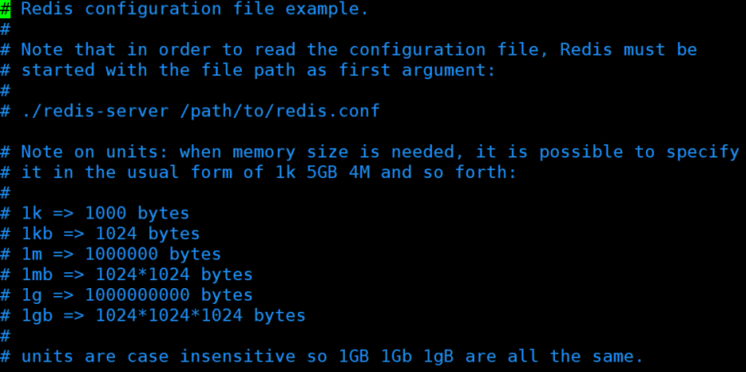

## 2、INCLUDES包含

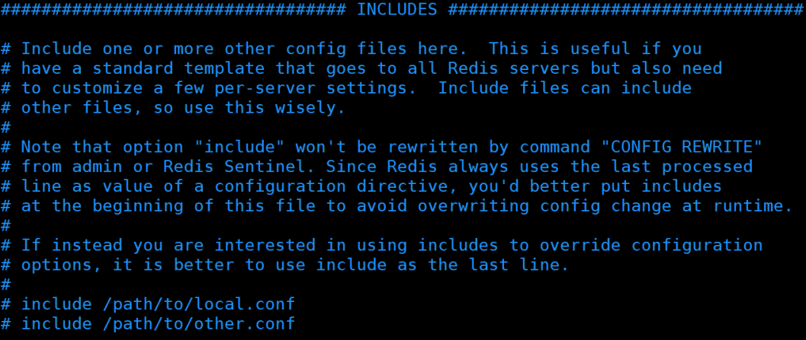

类似jsp中的include，多实例的情况可以把公用的配置文件提取出来

## 3、网络相关配置

### 3.1、bind

默认情况bind=127.0.0.1只能接受本机的访问请求

不写的情况下，无限制接受任何ip地址的访问

生产环境肯定要写你应用服务器的地址；服务器是需要远程访问的，所以需要将其注释掉

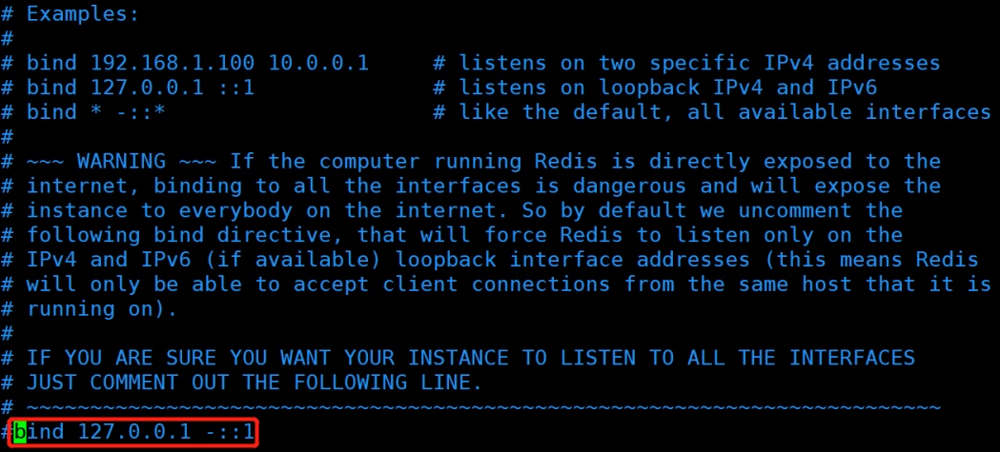

**如果开启了protected-mode，那么在没有设定bind ip且没有设密码的情况下，Redis只允许接受本机的响应**

### 3.2、protected-mode

将本机访问保护模式设置no

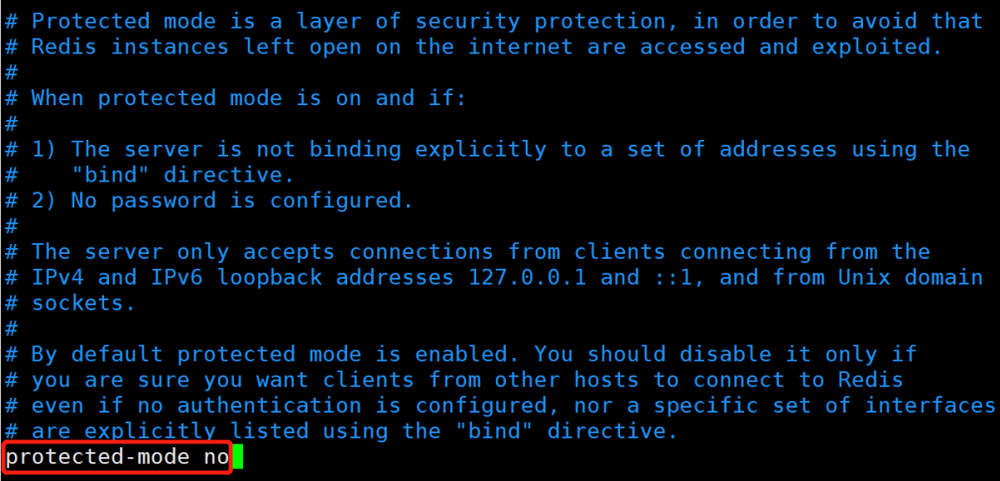

### 3.3、port

端口号，默认 6379

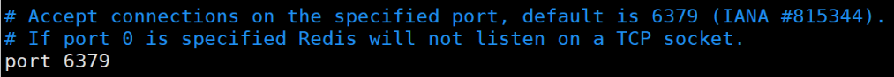

### 3.4、tcp-backlog

设置tcp的backlog，backlog其实是一个连接队列，backlog队列总和 = 未完成三次握手队列 + 已经完成三次握手队列。

在高并发环境下你需要一个高backlog值来避免慢客户端连接问题。

注意Linux内核会将这个值减小到/proc/sys/net/core/somaxconn的值（128），

所以需要确认增大/proc/sys/net/core/somaxconn和/proc/sys/net/ipv4/tcp_max_syn_backlog（128）两个值来达到想要的效果

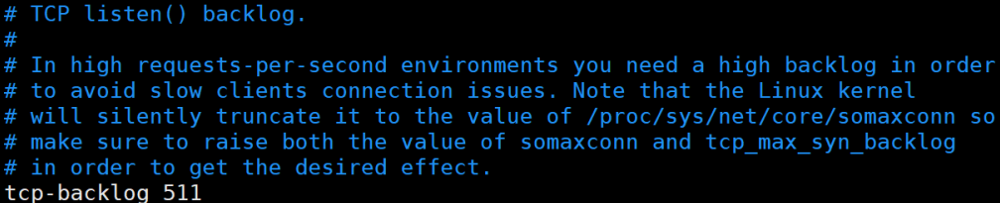

### 3.5、timeout

一个空闲的客户端维持多少秒会关闭，0表示关闭该功能。即**永不关闭**。

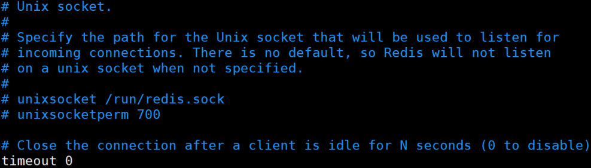

### 3.6、tcp-keepalive

对访问客户端的一种心跳检测，每个n秒检测一次。

单位为秒，如果设置为0，则不会进行Keepalive检测，建议设置成60

## 4、GENERAL

### 4.1、daemonize

是否为后台进程，设置为yes，启用守护进程，后台启动

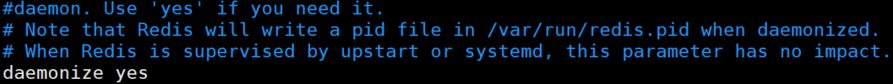

### 4.2、pidfile

当redis以守护进程方式运行时，redis默认会把pid写入/var/run/redis.pid文件，可以通过pidfile指定

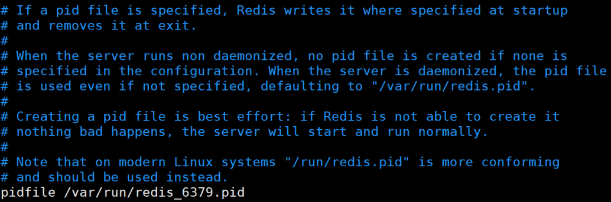

### 4.3、loglevel

指定日志记录级别，Redis总共支持四个级别：debug、verbose、notice、warning，默认为**notice**

四个级别根据使用阶段来选择，生产环境选择notice 或者warning

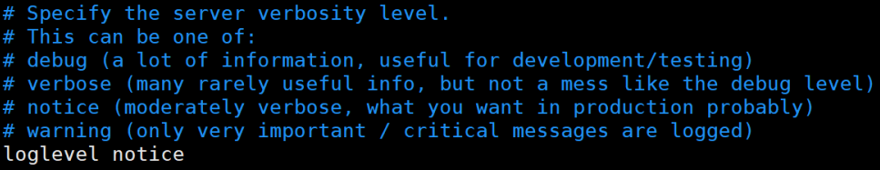

### 4.4、logfile

日志文件名称

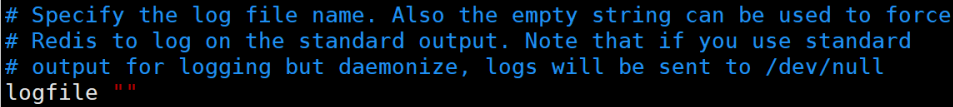

### 4.5、databases 16

设定库的数量 默认16，默认数据库为0，可以使用SELECT 命令在连接上指定数据库id

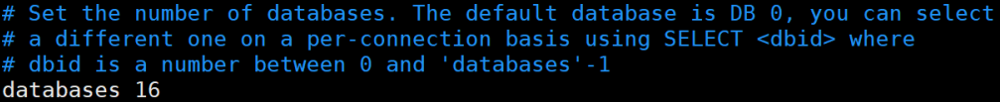

## 5、SECURITY 安全

### 5.1、设置密码

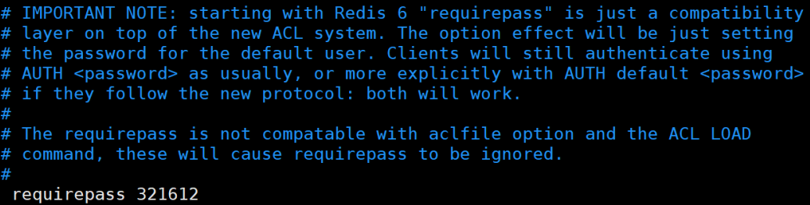

## 6、LIMITS限制

### 6.1、maxclients

+ 设置redis同时可以与多少个客户端进行连接。
+ 默认情况下为10000个客户端。
+ 如果达到了此限制，redis则会拒绝新的连接请求，并且向这些连接请求方发出“max number of clients reached”以作回应。

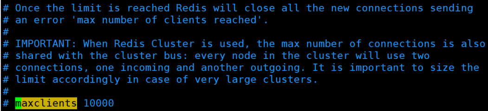

### 6.2、maxmemory

+  建议**必须设置**，否则，将内存占满，造成服务器宕机 
+  设置redis可以使用的内存量。一旦到达内存使用上限，redis将会试图移除内部数据，移除规则可以通过maxmemory-policy来指定。 
+  如果redis无法根据移除规则来移除内存中的数据，或者设置了“不允许移除”，那么redis则会针对那些需要申请内存的指令返回错误信息，比如SET、LPUSH等。 
+  但是对于无内存申请的指令，仍然会正常响应，比如GET等。如果你的redis是主redis（说明你的redis有从redis），那么在设置内存使用上限时，需要在系统中留出一些内存空间给同步队列缓存，只有在你设置的是“不移除”的情况下，才不用考虑这个因素。 

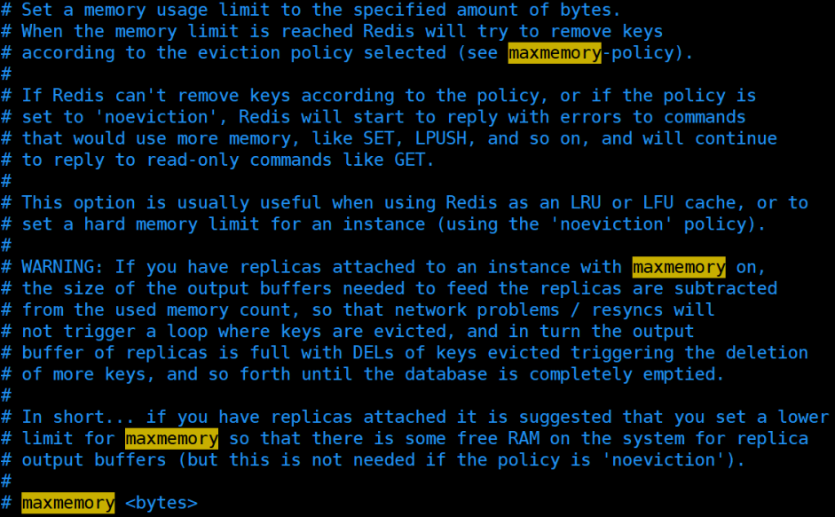

### 6.3、maxmemory-policy

+  volatile-lru：使用LRU算法移除key，只对设置了**过期时间**的键；（最近最少使用） 
+  allkeys-lru：在所有集合key中，使用LRU算法移除key 
+  volatile-random：在过期集合中移除随机的key，只对设置了过期时间的键 
+  allkeys-random：在所有集合key中，移除随机的key 
+  volatile-ttl：移除那些TTL值最小的key，即那些最近要过期的key 
+  noeviction：不进行移除。针对写操作，只是返回错误信息 

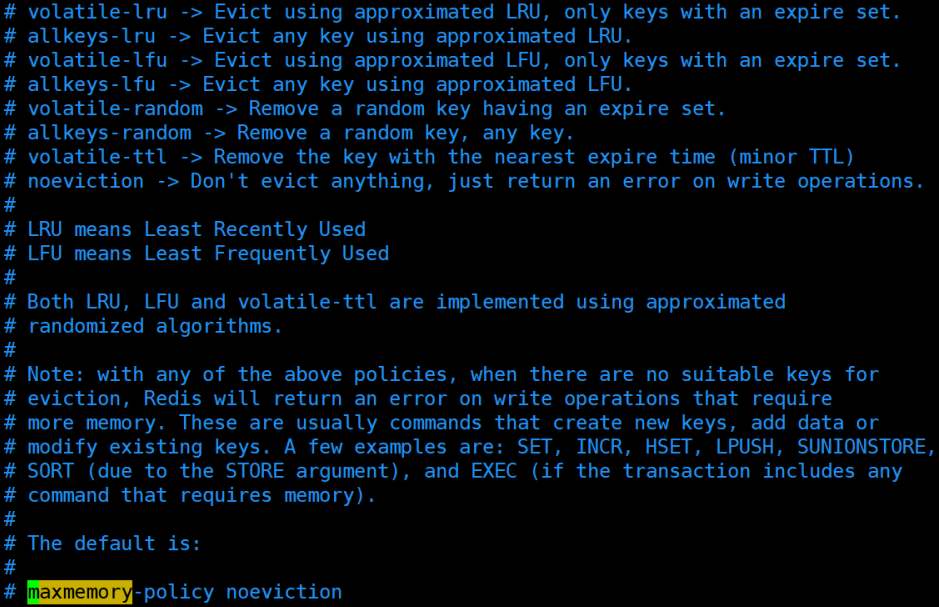

### 6.4、maxmemory-samples

+  设置样本数量，LRU算法和最小TTL算法都并非是精确的算法，而是估算值，所以你可以设置样本的大小，redis默认会检查这么多个key并选择其中LRU的那个。 
+  一般设置3到7的数字，数值越小样本越不准确，但性能消耗越小。 

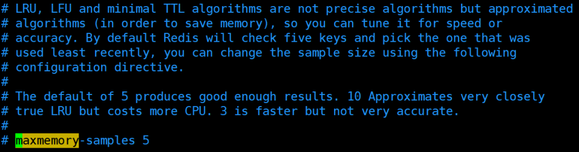

> 更新: 2022-08-11 16:03:06  
> 原文: <https://www.yuque.com/like321/qgn2qc/fut5kl>