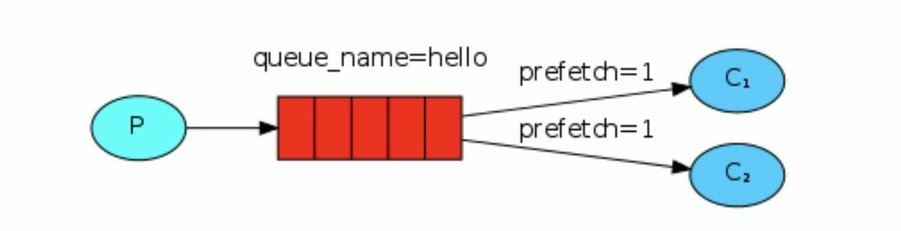
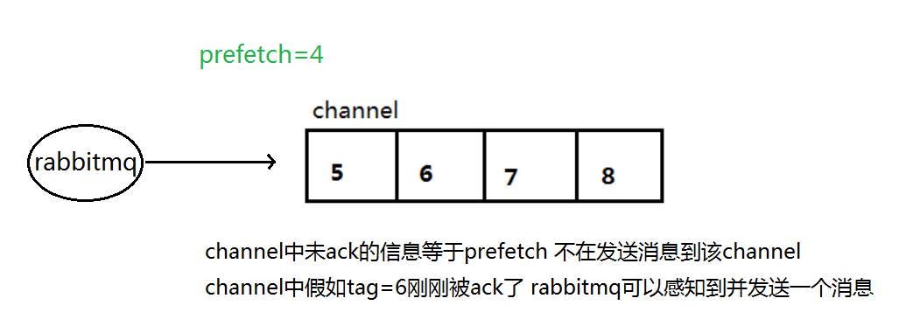
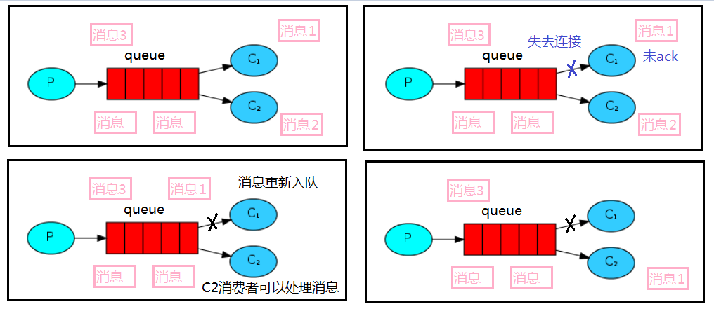
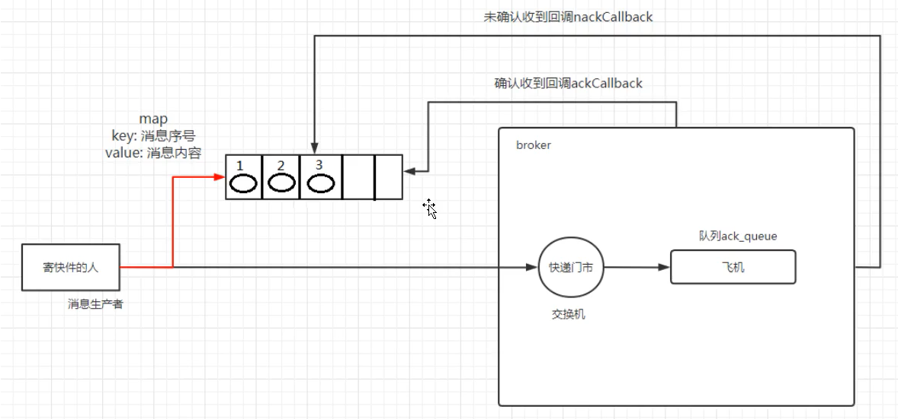
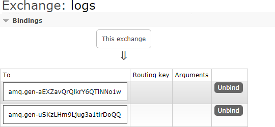
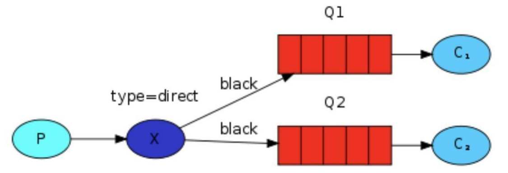

# 2_RabbitMQ工作模式

## 二、simple模式（最简单的收发模式）


1.  消息产生消息，将消息放入队列 
2.  消息的消费者(consumer) 监听 消息队列，如果队列中有消息，就消费掉，消息被拿走后，自动从队列中删除（隐患：消息可能没有被消费者正确处理，已经从队列中消失了，造成消息的<font style="color:#DF2A3F;">丢失</font>。这里可以设置成<font style="color:#DF2A3F;">手动的ack</font>，但如果设置成手动ack，处理完后要及时发送ack消息给队列，否则会造成<font style="color:#DF2A3F;">内存溢出</font>）。 
3. 应用场景聊天（中间有一个过度的服务器; p端， c端）


在下图中，“ P” 是我们的生产者，“ C” 是我们的消费者。中间的框是一个队列 RabbitMQ 代表使用者保留的消息缓冲区


连接的时候，需要开启 5672 端口


### 1、依赖


```xml
<!--指定 jdk 编译版本-->
<build>
    <plugins>
        <plugin>
            <groupId>org.apache.maven.plugins</groupId>
            <artifactId>maven-compiler-plugin</artifactId>
            <configuration>
                <source>8</source>
                <target>8</target>
            </configuration>
        </plugin>
    </plugins>
</build>
<dependencies>
    <!--rabbitmq 依赖客户端-->
    <dependency>
        <groupId>com.rabbitmq</groupId>
        <artifactId>amqp-client</artifactId>
        <version>5.8.0</version>
    </dependency>
    <!--操作文件流的一个依赖-->
    <dependency>
        <groupId>commons-io</groupId>
        <artifactId>commons-io</artifactId>
        <version>2.6</version>
    </dependency>
</dependencies>
```


### 2、消息生产者


```java
package com.atguigu.rabbitmq.one;

import com.rabbitmq.client.Channel;
import com.rabbitmq.client.Connection;
import com.rabbitmq.client.ConnectionFactory;

import java.io.IOException;
import java.util.concurrent.TimeoutException;

/**
 * @author: like
 * @Date: 2021/07/16 22:58
 */
public class Producer {

    //队列名称
    public static final String QUEUE_NAME = "hello";

    //发消息
    public static void main(String[] args) throws IOException, TimeoutException {
        //创建一个链接工厂
        ConnectionFactory factory = new ConnectionFactory();
        factory.setHost("*.*.*.*");
        factory.setUsername("admin");
        factory.setPassword("123456");

        //创建连接
        Connection connection = factory.newConnection();

        //获取信道
        Channel channel = connection.createChannel();

        /**
         * 生成一个队列
         * 1、队列名称
         * 2、队列里面的消息是否持久化(磁盘) 默认情况消息存储在内存中
         * 3、该队列是否只供一个消费者进行消费 是否进行消息共享，true可以多个消费者消费 false：只能一个消费者消费
         * 4、是否自动删除 最后一个消费者端开连接以后 该队列是否自动删除 true自动删除 false不自动删除
         * 5、其他参数
         */
        channel.queueDeclare(QUEUE_NAME, false, false, false, null);

        /**
         * 发送一个消息
         * 1、发送到哪个交换机
         * 2、路由的Key值是哪个 本次是队列的名称
         * 3、其他参数信息
         * 4、发送消息的消息体
         */
        String message = "hello world";
        channel.basicPublish("", QUEUE_NAME, null, message.getBytes());

        System.out.println("消息发送完毕");

        //channel 实现了自动 close 接口 自动关闭 不需要显示关闭
        
    }


}
```


### 3、消息消费者


```java
package com.atguigu.rabbitmq.one;

import com.rabbitmq.client.*;

import java.io.IOException;
import java.util.concurrent.TimeoutException;

/**
 * @author: like
 * @Date: 2021/07/16 22:58
 */
public class Consumer {

    //队列名称
    public static final String QUEUE_NAME = "hello";

    //接收消息
    public static void main(String[] args) throws IOException, TimeoutException {
        //创建一个链接工厂
        ConnectionFactory factory = new ConnectionFactory();
        factory.setHost("*.*.*.*");
        factory.setUsername("admin");
        factory.setPassword("123456");

        //创建连接
        Connection connection = factory.newConnection();

        //获取信道
        Channel channel = connection.createChannel();

        System.out.println("等待接收消息.........");


        //推送的消息如何进行消费的接口回调
        DeliverCallback deliverCallback = (consumerTag, delivery) -> {
            System.out.println(new String(delivery.getBody()));
        };
        //取消消费的一个回调接口 如在消费的时候队列被删除掉了
        CancelCallback cancelCallback = consumerTag -> {
            System.out.println("消费消息被中断");
        };

        /**
         * 消费者消费消息
         * 1、消费哪个队列
         * 2、消费成功之后是否要自动应答 true 自动应答 false 手动应答
         * 3、消费者未成功消费的回调
         * 4、消费者取消消费的回调
         */
        channel.basicConsume(QUEUE_NAME, true, deliverCallback, cancelCallback);


    }


}
```


## 三、Work工作模式（资源的竞争）


Work Queues——工作队列（又称任务队列）的主要思想是避免立即执行资源密集型任务，而不得不等待它完成。


相反我们安排任务在之后执行。我们把任务封装为消息并将其发送到队列。


在后台运行的工作进程将弹出任务并最终执行作业。当有多个工作线程时，这些工作线程将一起处理这些任务。


### 1、轮训分发消息


启动两个工作线程，一个消息发送线程，我们来看看两个工作线程是如何工作的。


**1、抽取工具类**


```java
package com.atguigu.rabbitmq.utils;

import com.rabbitmq.client.Channel;
import com.rabbitmq.client.Connection;
import com.rabbitmq.client.ConnectionFactory;

public class RabbitMqUtils {

    //得到一个连接的 channel
    public static Channel getChannel() throws Exception {
        //创建一个连接工厂
        ConnectionFactory factory = new ConnectionFactory();
        factory.setHost("*.*.*.*");
        factory.setUsername("admin");
        factory.setPassword("123456");
        Connection connection = factory.newConnection();
        Channel channel = connection.createChannel();
        return channel;
    }
    
}
```


**2、启动两个工作线程来接受消息**


```java
package com.atguigu.rabbitmq.two;

import com.atguigu.rabbitmq.utils.RabbitMqUtils;
import com.rabbitmq.client.CancelCallback;
import com.rabbitmq.client.Channel;
import com.rabbitmq.client.DeliverCallback;

/**
 * @author: like
 * @Date: 2021/07/17 7:06
 */
public class Worker01 {

    //队列的名称
    public static final String QUEUE_NAME = "hello";

    //接收消息
    public static void main(String[] args) throws Exception {
        Channel channel = RabbitMqUtils.getChannel();

        //推送的消息如何进行消费的接口回调
        DeliverCallback deliverCallback = (consumerTag, delivery) -> {
            System.out.println("接收到的消息：" + new String(delivery.getBody()));
        };
        
        //取消消费的一个回调接口 如在消费的时候队列被删除掉了
        CancelCallback cancelCallback = consumerTag -> {
            System.out.println(consumerTag + "消费者取消消费接口回调逻辑");
        };

        System.out.println("c1等待接收消息……");

        /**
         * 消费者消费消息
         * 1、消费哪个队列
         * 2、消费成功之后是否要自动应答 true 自动应答 false 手动应答
         * 3、消费者未成功消费的回调
         * 4、消费者取消消费的回调
         */
        channel.basicConsume(QUEUE_NAME, true, deliverCallback, cancelCallback);
    }
}
```


选中 `Allow multiple instances`  


启动后


**3、启动一个发送消息线程**


```java
package com.atguigu.rabbitmq.two;

import com.atguigu.rabbitmq.utils.RabbitMqUtils;
import com.rabbitmq.client.Channel;

import java.util.Scanner;

/**
 * @author: like
 * @Date: 2021/07/17 7:39
 */
public class Task01 {

    //队列的名称
    public static final String QUEUE_NAME = "hello";

    public static void main(String[] args) throws Exception {
        Channel channel = RabbitMqUtils.getChannel();

        /**
         * 声明一个队列
         * 1、队列名称
         * 2、队列里面的消息是否持久化(磁盘) 默认情况消息存储在内存中
         * 3、该队列是否只供一个消费者进行消费 是否进行消息共享，true可以多个消费者消费 false：只能一个消费者消费
         * 4、是否自动删除 最后一个消费者端开连接以后 该队列是否自动删除 true自动删除 false不自动删除
         * 5、其他参数
         */
        channel.queueDeclare(QUEUE_NAME, false, false, false, null);
        
		//从控制台当中接收信息
        Scanner scanner = new Scanner(System.in);
        while (scanner.hasNext()) {
             /**
             * 发送一个消息
             * 1、发送到哪个交换机
             * 2、路由的Key值是哪个 本次是队列的名称
             * 3、其他参数信息
             * 4、发送消息的消息体
             */
            String message = scanner.next();
            channel.basicPublish("", QUEUE_NAME, null, message.getBytes());
            System.out.println("发送消息完成：" + message);
        }

    }

}
```


+ **结果展示**


通过程序执行发现生产者总共发送 4 个消息，消费者 1 和消费者 2 分别分得两个消息，并且是按照有序的一个接收一次消息


### 2、不公平分发


在最开始的时候我们学习到 RabbitMQ 分发消息采用的轮训分发，


但是在某种场景下这种策略并不是很好，比方说有两个消费者在处理任务，其中有个**消费者 1** 处理任务的速度非常快，而另外一个**消费者 2** 处理速度却很慢，


这个时候我们还是采用轮训分发的话就会导致处理速度快的这个消费者很大一部分时间处于空闲状态，而处理慢的那个消费者一直在干活，这种分配方式在这种情况下其实就不太好，但是 RabbitMQ 并不知道这种情况它依然很公平的进行分发。


为了避免这种情况，**在消费者中消费之前**，我们可以设置参数 `channel.basicQos(1);`


```java
//不公平分发
int prefetchCount = 1;
channel.basicQos(prefetchCount);
```


```java
public class work01 {

    //队列名称
    public static final String TASK_QUEUE_NAME = "ack_queue";

    public static void main(String[] args) throws Exception {
        Channel channel = RabbitMqUtils.getChannel();
        System.out.println("c1等待接收消息处理时间较短");

        //推送的消息如何进行消费的接口回调
        DeliverCallback deliverCallback = (consumerTag, message) -> {
            try {
                Thread.sleep(1000);
            } catch (InterruptedException e) {
                e.printStackTrace();
            }
            System.out.println("接收到的消息：" + new String(message.getBody(), "UTF-8"));
            /*** 
             * 手动应答
             * 1、消息的标记 tag
             * 2、是否批量应答 false 不批量应答信道中的消息 true 批量
             */
            channel.basicAck(message.getEnvelope().getDeliveryTag(), false);
        };

        //取消消费的一个回调接口 如在消费的时候队列被删除掉了
        CancelCallback cancelCallback = consumerTag -> {
            System.out.println(consumerTag + "消费者取消消费接口回调逻辑");
        };

        //设置不公平分发
        int prefetchCount = 1;
        channel.basicQos(prefetchCount);


        //采用手动应答
        boolean autoAck = false;
         /**
         * 消费者消费消息
         * 1、消费哪个队列
         * 2、消费成功之后是否要自动应答 true 自动应答 false 手动应答
         * 3、消费者未成功消费的回调
         * 4、消费者取消消费的回调
         */
        channel.basicConsume(TASK_QUEUE_NAME, autoAck, deliverCallback, cancelCallback);
    }
}
```





意思就是如果这个任务我还没有处理完或者我还没有应答你，你先别分配给我，我目前只能处理一个任务，


然后 rabbitmq 就会把该任务分配给没有那么忙的那个空闲消费者，当然如果所有的消费者都没有完成手上任务，


队列还在不停的添加新任务，队列有可能就会遇到队列被撑满的情况，


这个时候就只能添加 新的 worker 或者改变其他存储任务的策略。


### 3、预取值分发


带权的消息分发


本身消息的发送就是异步发送的，所以在任何时候，channel 上肯定不止只有一个消息，另外来自消费者的手动确认本质上也是异步的。


因此这里就存在一个未确认的消息缓冲区，因此希望开发人员能**限制此缓冲区的大小**，**以避免缓冲区里面无限制的未确认消息问题**。


这个时候就可以通过使用 basic.qos 方法设置“预取计数”值来完成的。**该值定义通道上允许的未确认消息的最大数量。**


一旦数量达到配置的数量， RabbitMQ 将停止在通道上传递更多消息，除非至少有一个未处理的消息被确认，


例如，假设在通道上有未确认的消息 5、6、7，8，并且通道的预取计数设置为 4，此时RabbitMQ 将不会在该通道上再传递任何消息，除非至少有一个未应答的消息被 ack。


比方说 tag=6 这个消息刚刚被确认 ACK，RabbitMQ 将会感知 这个情况到并再发送一条消息。


消息应答和 QoS 预取值对用户吞吐量有重大影响。


通常，**<font style="color:#DF2A3F;">增加预取将提高 向消费者传递消息的速度。</font>**


**虽然自动应答传输消息速率是最佳的，但是，在这种情况下已传递但尚未处理的消息的数量也会增加，从而增加了消费者的 RAM 消耗**(随机存取存储器)，应该小心使用具有无限预处理的自动确认模式或手动确认模式，消费者消费了大量的消息如果没有确认的话，会导致消费者连接节点的 内存消耗变大，


所以找到合适的预取值是一个反复试验的过程，不同的负载，该值取值也不同 100 到 300 范 围内的值通常可提供最佳的吞吐量，并且不会给消费者带来太大的风险。


预取值为 1 是最保守的。当然这将使吞吐量变得很低，特别是消费者连接延迟很严重的情况下，特别是在消费者连接等待时间较长的环境 中。对于大多数应用来说，稍微高一点的值将是最佳的。




## 四、消息接收确认  **<font style="color:#E8323C;">如何确保消息接收方消费了消息？ </font>**


消费者完成一个任务可能需要一段时间，如果其中一个消费者处理一个长的任务并仅只完成了部分突然它挂掉了，会发生什么情况。


**默认RabbitMQ 一旦向消费者传递了一条消息，便立即将该消息标记为删除。**


在这种情况下，突然有个消费者挂掉了，我们将丢失正在处理的消息。以及后续发送给该消费者的消息，因为它无法接收到。


为了保证消息被成功消费不丢失，**rabbitmq 引入消息应答机制**，消息应答就是：**消费者在接收到消息并且处理该消息之后，****<font style="color:#E8323C;">告诉 rabbitmq 它已经处理了，rabbitmq 可以把该消息删除了</font>****。**


### 1、应答模式
```java
public enum AcknowledgeMode {
    NONE,	//无应答模式
    MANUAL, //自动应答模式
    AUTO;	//手动应答模式

    private AcknowledgeMode() {
    }

    public boolean isTransactionAllowed() {
        return this == AUTO || this == MANUAL;
    }

    public boolean isAutoAck() {
        return this == NONE;
    }

    public boolean isManual() {
        return this == MANUAL;
    }
}
```

消费者接收消息有三种不同的确认模式：

1. **AcknowledgeMode.NONE**：不确认，<font style="color:#E8323C;">这是默认的模式</font>，默认所有消息都被成功消费了，直接从队列删除消息。存在消息被消费过程中由于异常未被成功消费而掉丢失的风险。


2. **AcknowledgeMode.AUTO**：自动确认，根据消息被消费过程中是否发生异常来发送确认收到消息或拒绝消息的指令到 RabbitMQ 服务。这个确认时机开发人员是不可控的，同样存在消息丢失的风险。


3. **AcknowledgeMode.MANUAL**：手动确认，开发人员可以根据实际的业务，在合适的时机手动发送确认收到消息或拒绝消息指令到 RabbitMQ 服务，整个过程开发人是可控的。这种模式也是我们要重点介绍的。


### 2、<font style="color:rgb(77, 77, 77);">无应答模式</font>
```java
AcknowledgeMode.NONE
```

消息发送后立即被认为已经传送成功，这种模式需要在**高吞吐量和数据传输安全性方面做权衡**，因为这种模式如果消息在接收到之前，消费者那边出现连接或者 channel 关闭，那么消息就丢失 了,


当然另一方面这种模式消费者那边可以传递过载的消息，**没有对传递的消息数量进行限制**，当然这样有可能使得消费者这边由于接收太多还来不及处理的消息，导致这些消息的积压，


最终使得内存耗尽，最终这些消费者线程被操作系统杀死，**所以这种模式仅适用在消费者可以高效并以某种速率能够处理这些消息的情况下使用。**


### 3、自动应答
```java
AcknowledgeMode.AUTO
```


### 4、手动应答
```java
AcknowledgeMode.MANUAL
```

<font style="color:rgb(77, 77, 77);">消费者收到消息后，手动调用 Basic.Ack 或 Basic.Nack 或 Basic.Reject 后，RabbitMQ 收到这些消息后，才认为本次投递完成。</font>


####  basicAck-用于肯定确认
+ RabbitMQ 已知道该消息并且成功的处理消息，可以将其丢弃了 


<font style="color:rgb(77, 77, 77);">basicAck 方法用于确认当前消息，Channel 类中的 basicAck 方法定义如下：</font>

```java
void basicAck(long deliveryTag, boolean multiple) throws IOException;
```

参数说明：

+ long deliveryTag：<font style="color:#DF2A3F;">唯一标识 ID</font>，当一个消费者向 RabbitMQ 注册后，会建立起一个 Channel ，RabbitMQ 会用 basic.deliver 方法向消费者推送消息，这个方法携带了一个 delivery tag， 它代表了 RabbitMQ 向该 Channel 投递的这条消息的唯一标识 ID，是一个单调递增的正整数，delivery tag 的范围仅限于 Channel。


+ boolean multiple：是否批处理，当该参数为 true 时，则可以一次性确认 delivery_tag 小于等于传入值的所有消息。


#### basicNack-用于否定确认
+ <font style="color:rgb(18, 18, 18);">重新放入队列（会导致</font><font style="color:rgb(77, 77, 77);">死循环，需配合最大重试次数</font><font style="color:rgb(18, 18, 18);">）</font>


<font style="color:rgb(77, 77, 77);">basicNack 方法用于否定当前消息。 由于 basicReject 方法一次只能拒绝一条消息，如果想批量拒绝消息，则可以使用 basicNack 方法。消费者客户端可以使用 channel.basicNack 方法来实现，方法定义如下：</font>

```java
void basicNack(long deliveryTag, boolean multiple, boolean requeue) throws IOException;
```

参数说明：


+ long deliveryTag：唯一标识 ID。


+ boolean multiple：上面已经解释。


+ boolean requeue：
    - 如果 requeue 参数设置为 true，则 RabbitMQ 会重新将这条消息存入队列，以便发送给下一个订阅的消费者；
    - 如果 requeue 参数设置为 false，则 RabbitMQ 立即会还把消息从队列中移除，而不会把它发送给新的消费者。


#### basicReject-<font style="color:rgb(51, 51, 51);">用于拒绝当前消息</font>
+ 与 Channel.basicNack 相比少一个参数，不处理该消息了直接拒绝，可以将其丢弃了 


<font style="color:rgb(77, 77, 77);">basicReject 方法用于明确拒绝当前的消息而不是确认。 RabbitMQ 在 2.0.0 版本开始引入 Basic.Reject 命令，消费者客户端可以调用与其对应的 channel.basicReject 方法来告诉 RabbitMQ 拒绝这个消息。</font>

<font style="color:rgb(77, 77, 77);"></font>

<font style="color:rgb(77, 77, 77);">Channel 类中的basicReject 方法定义如下：</font>

```java
void basicReject(long deliveryTag, boolean requeue) throws IOException;
```

参数说明：


+ long deliveryTag：唯一标识 ID。


+ boolean multiple：上面已经解释。


#### Multiple 的解释


手动应答的好处是<font style="color:#DF2A3F;">可以批量应答并且减少网络拥堵</font>


multiple 的 true 和 false 代表不同意思


+  true 代表批量应答 channel 上未应答的消息  
比如说 channel 上有传送 tag 的消息 5,6,7,8 当前 tag 是8 那么此时5-8 的这些还未应答的消息都会被确认收到消息应答 


+  false 同上面相比只会应答 tag=8 的消息 5,6,7 这三个消息依然不会被确认收到消息应答 


#### 消息自动重新入队


如果消费者由于某些原因失去连接（其通道已关闭，连接已关闭或 TCP 连接丢失），导致消息未发送 ACK 确认，RabbitMQ 将了解到消息未完全处理，并将对其重新排队。


如果此时其他消费者可以处理，它将很快将其重新分发给另一个消费者。


这样，即使某个消费者偶尔死亡，也可以确保不会丢失任何消息。





#### 消息手动应答代码


**默认消息采用的是自动应答，所以我们要想实现消息消费过程中不丢失，需要把自动应答改为手动应答**


消费者在上面代码的基础上增加了以下内容


```java
/***
 * 1、消息标记tag
 * 2、false代表只应答接收到的那个传递的消息  true为应答所有消息 包括传递过来的消息
 */
channel.basicAck(delivery.getEnvelope().getDeliveryTag(), false);
```


**消息生产者：**


```java
package com.atguigu.rabbitmq.three;

import com.atguigu.rabbitmq.utils.RabbitMqUtils;
import com.rabbitmq.client.Channel;

import java.util.Scanner;

/**
 * @author: like
 * @Date: 2021/07/17 8:17
 */
public class Task {

    //队列名称
    public static final String TASK_QUEUE_NAME = "ack_queue";


    public static void main(String[] args) throws Exception {
        Channel channel = RabbitMqUtils.getChannel();
         /**
         * 声明一个队列
         * 1、队列名称
         * 2、队列里面的消息是否持久化(磁盘) 默认情况消息存储在内存中
         * 3、该队列是否只供一个消费者进行消费 是否进行消息共享，true可以多个消费者消费 false：只能一个消费者消费
         * 4、是否自动删除 最后一个消费者端开连接以后 该队列是否自动删除 true自动删除 false不自动删除
         * 5、其他参数
         */
        channel.queueDeclare(TASK_QUEUE_NAME, false, false, false, null);

        Scanner scanner = new Scanner(System.in);
        while (scanner.hasNext()) {
             /**
             * 发送一个消息
             * 1、发送到哪个交换机
             * 2、路由的Key值是哪个 本次是队列的名称
             * 3、其他参数信息
             * 4、发送消息的消息体
             */
            String message = scanner.next();
            channel.basicPublish("", TASK_QUEUE_NAME, null, message.getBytes("UTF-8"));
            System.out.println("生产者发出消息：" + message);
        }

    }

}
```


**消费者 01：**


```java
package com.atguigu.rabbitmq.three;

import com.atguigu.rabbitmq.utils.RabbitMqUtils;
import com.rabbitmq.client.CancelCallback;
import com.rabbitmq.client.Channel;
import com.rabbitmq.client.DeliverCallback;

/**
 * @author: like
 * @Date: 2021/07/17 8:25
 */
public class work01 {

    //队列名称
    public static final String TASK_QUEUE_NAME = "ack_queue";

    public static void main(String[] args) throws Exception {
        Channel channel = RabbitMqUtils.getChannel();
        System.out.println("c1等待接收消息处理时间较短");

        //推送的消息如何进行消费的接口回调
        DeliverCallback deliverCallback = (consumerTag, message) -> {
            try {
                Thread.sleep(1000);
            } catch (InterruptedException e) {
                e.printStackTrace();
            }
            System.out.println("接收到的消息：" + new String(message.getBody(), "UTF-8"));
            /*** 
             * 手动应答
             * 1、消息的标记 tag
             * 2、是否批量应答 false 不批量应答信道中的消息 true 批量
             */
            channel.basicAck(message.getEnvelope().getDeliveryTag(), false);
        };

        //取消消费的一个回调接口 如在消费的时候队列被删除掉了
        CancelCallback cancelCallback = consumerTag -> {
            System.out.println(consumerTag + "消费者取消消费接口回调逻辑");
        };

         /**
         * 消费者消费消息
         * 1、消费哪个队列
         * 2、消费成功之后是否要自动应答 true 自动应答 false 手动应答
         * 3、消费者未成功消费的回调
         * 4、消费者取消消费的回调
         */
        //采用手动应答
        boolean autoAck = false;
        channel.basicConsume(TASK_QUEUE_NAME, autoAck, deliverCallback, cancelCallback);
    }
}
```


**消费者 02：**


	把时间改成30秒


#### 手动应答效果演示


正常情况下消息发送方发送两个消息 C1 和 C2 分别接收到消息并进行处理


在发送者发送消息 dd，发出消息之后的把 C2 消费者停掉，


按理说该 C2 来处理该消息，但是由于它处理时间较长，在还未处理完，也就是说 C2 还没有执行 ack 代码的时候，C2 被停掉了，


此时会看到消息被 C1 接收到了，说明消息 dd 被重新入队，然后分配给能处理消息的 C1 处理了


## 五、RabbitMQ 持久化


刚刚我们已经看到了如何处理任务不丢失的情况，但是如何保障当 RabbitMQ 服务停掉以后，消息生产者发送过来的消息不丢失？


默认情况下 RabbitMQ 退出或由于某种原因崩溃时，它忽视队列和消息，除非告知它不要这样做。


确保消息不会丢失需要做两件事：**我们需要****<font style="color:#DF2A3F;">将队列和消息都标记为持久化。</font>**


### 1、队列实现持久化


之前我们创建的队列都是非持久化的，rabbitmq 如果重启的话，该队列就会被删除掉，如果要队列实现持久化


需要在声明队列的时候把 durable 参数设置为持久化


```java
/**
 * 声明一个队列
 * 1、队列名称
 * 2、队列里面的消息是否持久化(磁盘) 默认情况消息存储在内存中
 * 3、该队列是否只供一个消费者进行消费 是否进行消息共享，true可以多个消费者消费 false：只能一个消费者消费
 * 4、是否自动删除 最后一个消费者端开连接以后 该队列是否自动删除 true自动删除 false不自动删除
 * 5、其他参数
 */
//让队列持久化
boolean durable = true;
channel.queueDeclare(TASK_QUEUE_NAME, durable, false, false, null);
```


注意：如果之前声明的队列不是持久化的，需要把原先队列先删除，或者重新创建一个持久化的队列，不然就会出现错误


以下为控制台中持久化与非持久化队列的 UI 显示区、


这个时候即使重启rabbitmq队列也依然存在


### 2、消息实现持久化


要想让消息实现持久化，需要在消息**<font style="color:#DF2A3F;">生产者</font>**修改代码，`MessageProperties.PERSISTENT_TEXT_PLAIN` 添加这个属性。


```java
public class Task02 {

    //队列名称
    public static final String TASK_QUEUE_NAME = "ack_queue";

    public static void main(String[] args) throws Exception {
        Channel channel = RabbitMqUtils.getChannel();

        /**
         * 声明一个队列
         * 1、队列名称
         * 2、队列里面的消息是否持久化(磁盘) 默认情况消息存储在内存中
         * 3、该队列是否只供一个消费者进行消费 是否进行消息共享，true可以多个消费者消费 false：只能一个消费者消费
         * 4、是否自动删除 最后一个消费者端开连接以后 该队列是否自动删除 true自动删除 false不自动删除
         * 5、其他参数
         */
        //让Queue进行持久化
        boolean durable = true;
        channel.queueDeclare(TASK_QUEUE_NAME, durable, false, false, null);

        Scanner scanner = new Scanner(System.in);
        while (scanner.hasNext()) {

            /**
             * 发送一个消息
             * 1、发送到哪个交换机
             * 2、路由的Key值是哪个 本次是队列的名称
             * 3、其他参数信息		设置生产者发送消息为持久化消息（要求保存到磁盘上）
             * 4、发送消息的消息体
             */
            String message = scanner.next();
            AMQP.BasicProperties props = MessageProperties.PERSISTENT_TEXT_PLAIN;
            channel.basicPublish("", TASK_QUEUE_NAME, props, message.getBytes("UTF-8"));
            System.out.println("生产者发出消息：" + message);
        }

    }

}
```


**将消息标记为持久化并不能完全保证不会丢失消息。**


尽管它告诉 RabbitMQ 将消息保存到磁盘，但是这里依然存在**当消息刚准备存储在磁盘的时候 但是还没有存储完，消息还在缓存的一个间隔点。**


此时并没有真正写入磁盘。持久性保证并不强，但是对于我们的简单任务队列而言，这已经绰绰有余了。


**如果需要更强有力的持久化策略，参考后边发布确认章节。**


## 六、发布确认	**<font style="color:#E8323C;">如何确保消息正确地发送至 RabbitMQ？</font>**


<font style="color:#E8323C;"></font>


### 1、发布确认原理


+ 生产者将信道设置成 confirm 模式<font style="color:rgb(51,51,51);">（</font><font style="color:#E8323C;">发送方确认模式</font><font style="color:rgb(51,51,51);">）</font>，一旦信道进入 confirm 模式，**所有在该信道上面发布的消息都将会被指派一个唯一的 ID**(从 1 开始)，


+ 一旦消息被投递到所有匹配的队列之后，broker 就会发送一个确认给生产者（包含消息的唯一 ID），这就使得生产者知道消息已经正确到达目的队列了，
    - **如果消息和队列是可持久化的，那么确认消息会在将消息写入磁盘之后发出，broker 回传给生产者的确认消息中delivery-tag 域包含了确认消息的序列号，**
    - 此外 broker 也可以设置basic.ack 的 multiple 域，表示到这个序列号之前的所有消息都已经得到了处理。


+ confirm 模式最大的好处在于他是异步的，一旦发布一条消息，生产者应用程序就可以在等信道返回确认的同时继续发送下一条消息，当消息最终得到确认之后，生产者应用便可以通过回调方法来处理该确认消息，


+ 如果RabbitMQ 因为自身内部错误导致消息丢失，就会发送一条 nack <font style="color:rgb(51,51,51);">（notacknowledged，未确 </font>

<font style="color:rgb(51,51,51);">认）</font>消息， 生产者应用程序同样可以在回调方法中处理该 nack 消息。


### 2、发布确认的策略


#### 开启发布确认


发布确认<font style="color:#E8323C;">默认是没有开启的</font>，如果要开启需要调用方法 confirmSelect，每当你要想使用发布确认，都需要在 channel 上调用该方法


```java
Channel channel = connection.createChannel();
//开启发布确认
channel.confirmSelect();
```


#### 单个确认发布


这是一种简单的确认方式，它是一种**<font style="color:#E8323C;">同步确认发布</font>****的方式，也就是发布一个消息之后只有它被确认发布，后续的消息才能继续发布，**

```java
 channel.waitForConfirmsOrDie(long timeout) 
```

这个方法只有在消息被确认的时候才返回，如果在指定时间范围内这个消息没有被确认那么它将抛出异常。


这种确认方式有一个最大的缺点就是：**<font style="color:#DF2A3F;">发布速度特别的慢</font>**，**因为如果没有确认发布的消息就会阻塞所有后续消息的发布**，这种方式最多提供每秒不超过数百条发布消息的吞吐量。


```java
package com.atguigu.rabbitmq.four;

import com.atguigu.rabbitmq.utils.RabbitMqUtils;
import com.rabbitmq.client.Channel;

import java.util.UUID;

/**
 * @author: like
 * @Date: 2021/07/18 18:30
 */
public class ConfirmMessage {

    public static final int MESSAGE_COUNT = 100; 


    public static void main(String[] args) throws Exception {
        //1、单个确认
        publishMessageIndividually();//发布100个，单独确认消息，耗时3894ms
    }


    //单个确认
    public static void publishMessageIndividually() throws Exception {

        Channel channel = RabbitMqUtils.getChannel();

        /**
         * 声明一个队列
         * 1、队列名称
         * 2、队列里面的消息是否持久化(磁盘) 默认情况消息存储在内存中
         * 3、该队列是否只供一个消费者进行消费 是否进行消息共享，true可以多个消费者消费 false：只能一个消费者消费
         * 4、是否自动删除 最后一个消费者端开连接以后 该队列是否自动删除 true自动删除 false不自动删除
         * 5、其他参数
         */
        String queueName = UUID.randomUUID().toString();
        channel.queueDeclare(queueName, true, false, false, null);
        //开启发布确认
        channel.confirmSelect();


        long begin = System.currentTimeMillis();

        for (int i = 0; i < MESSAGE_COUNT; i++) {
            /**
             * 发送一个消息
             * 1、发送到哪个交换机
             * 2、路由的Key值是哪个 本次是队列的名称
             * 3、其他参数信息
             * 4、发送消息的消息体
             */
            String message = String.valueOf(i);
            channel.basicPublish("", queueName, null, message.getBytes());
            //单个消息就马上进行发布确认
            boolean flag = channel.waitForConfirms();
            if (flag) {
                System.out.println("消息发送成功");
            }
        }

        long end = System.currentTimeMillis();

        System.out.println("发布" + MESSAGE_COUNT + "个，单独确认消息，耗时" + (end - begin) + "ms");

    }

}
```


#### 批量确认发布


上面那种方式非常慢，与单个等待确认消息相比，先发布一批消息然后一起确认可以极大地提高吞吐量，


当然这种方式的缺点就是：当发生故障导致发布出现问题时，不知道是哪个消息出问题了，我们必须将整个批处理保存在内存中，以记录重要的信息而后重新发布消息。


当然这种方案仍然是同步的，也一样阻塞消息的发布。


```java
package com.atguigu.rabbitmq.four;

import com.atguigu.rabbitmq.utils.RabbitMqUtils;
import com.rabbitmq.client.Channel;

import java.util.UUID;

/**
 * @author: like
 * @Date: 2021/07/18 18:30
 */
public class ConfirmMessage {

    public static final int MESSAGE_COUNT = 100;

    public static void main(String[] args) throws Exception {

        //2、批量确认
        publishMessageBatch(); //发布100个，批量确认消息，耗时325ms

    }

    //批量发布确认
    public static void publishMessageBatch() throws Exception {
        Channel channel = RabbitMqUtils.getChannel();

        /**
         * 声明一个队列
         * 1、队列名称
         * 2、队列里面的消息是否持久化(磁盘) 默认情况消息存储在内存中
         * 3、该队列是否只供一个消费者进行消费 是否进行消息共享，true可以多个消费者消费 false：只能一个消费者消费
         * 4、是否自动删除 最后一个消费者端开连接以后 该队列是否自动删除 true自动删除 false不自动删除
         * 5、其他参数
         */
        String queueName = UUID.randomUUID().toString();
        channel.queueDeclare(queueName, true, false, false, null);
        //开启发布确认
        channel.confirmSelect();

        long begin = System.currentTimeMillis();

        //批量确认消息大小
        int batchSize = 10;

        //批量发布确认
        for (int i = 0; i < MESSAGE_COUNT; i++) {
             /**
             * 发送一个消息
             * 1、发送到哪个交换机
             * 2、路由的Key值是哪个 本次是队列的名称
             * 3、其他参数信息
             * 4、发送消息的消息体
             */
            String message = String.valueOf(i);
            channel.basicPublish("", queueName, null, message.getBytes());

            //判断达到10条消息的时候 批量确认一次
            if (i % batchSize == 0) {
                //发布确认
                channel.waitForConfirms();
            }

        }

        long end = System.currentTimeMillis();
        System.out.println("发布" + MESSAGE_COUNT + "个，批量确认消息，耗时" + (end - begin) + "ms");
    }
    
}
```


#### 异步确认发布


异步确认虽然编程逻辑比上两个要复杂，但是性价比最高，无论是可靠性还是效率都没得说，


他是**利用回调函数来达到消息可靠性传递的，这个中间件也是通过函数回调来保证是否投递成功**。





```java
package com.atguigu.rabbitmq.four;

import com.atguigu.rabbitmq.utils.RabbitMqUtils;
import com.rabbitmq.client.Channel;
import com.rabbitmq.client.ConfirmCallback;

import java.util.UUID;

/**
 * @author: like
 * @Date: 2021/07/18 18:30
 */
public class ConfirmMessage {

    public static final int MESSAGE_COUNT = 100;


    public static void main(String[] args) throws Exception {

        //3、异步批量确认
        publishMessageAsync(); //发布100个，异步确认消息，耗时14ms
    }


    //异步发布确认
    public static void publishMessageAsync() throws Exception {
        Channel channel = RabbitMqUtils.getChannel();
        
        /**
         * 声明一个队列
         * 1、队列名称
         * 2、队列里面的消息是否持久化(磁盘) 默认情况消息存储在内存中
         * 3、该队列是否只供一个消费者进行消费 是否进行消息共享，true可以多个消费者消费 false：只能一个消费者消费
         * 4、是否自动删除 最后一个消费者端开连接以后 该队列是否自动删除 true自动删除 false不自动删除
         * 5、其他参数
         */
        String queueName = UUID.randomUUID().toString();
        channel.queueDeclare(queueName, true, false, false, null);

        //开启发布确认
        channel.confirmSelect();

        long begin = System.currentTimeMillis();

        //准备消息的监听器 监听哪些消息成功了 哪些消息失败了
        /**
         *  消息确认成功，回调函数
         *  1、消息的标记
         *  2、是否为批量确认
         */
        ConfirmCallback ackCallback = (deliveryTag, multiple) -> {
            System.out.println("确认的消息：" + deliveryTag);
        };

        /**
         *  消息确认失败，回调函数
         *  1、消息的标记
         *  2、是否为批量确认
         */
        ConfirmCallback nackCallback = (deliveryTag, multiple) -> {
            System.out.println("未确认的消息：" + deliveryTag);
        };
        
        /**
        *  添加一个异步确认的监听器 
        *  1. 确认收到消息的回调 
        *  2. 未收到消息的回调 
        */
        channel.addConfirmListener(ackCallback, nackCallback); //异步通知


        for (int i = 0; i < MESSAGE_COUNT; i++) {
            /**
             * 发送一个消息
             * 1、发送到哪个交换机
             * 2、路由的Key值是哪个 本次是队列的名称
             * 3、其他参数信息
             * 4、发送消息的消息体
             */
            String message = String.valueOf(i);
            channel.basicPublish("", queueName, null, message.getBytes());
        }


        long end = System.currentTimeMillis();
        System.out.println("发布" + MESSAGE_COUNT + "个，异步确认消息，耗时" + (end - begin) + "ms");
    }
}
```


##### 如何处理异步未确认消息?


**<font style="color:#E8323C;">最好的解决方案就是把未确认的消息放到一个基于内存的能被发布线程访问的队列，</font>**


比如说用 ConcurrentLinkedQueue 这个队列在 confirm callbacks 与发布线程之间进行消息的传递。


```java
/**
 * @author: like
 * @Date: 2021/07/18 18:30
 */
public class ConfirmMessage {

    public static final int MESSAGE_COUNT = 100;


    public static void main(String[] args) throws Exception {

        //3、异步批量确认
        publishMessageAsync(); //发布100个，异步确认消息，耗时14ms
    }


    //异步发布确认
    public static void publishMessageAsync() throws Exception {
        Channel channel = RabbitMqUtils.getChannel();
        /**
         * 声明一个队列
         * 1、队列名称
         * 2、队列里面的消息是否持久化(磁盘) 默认情况消息存储在内存中
         * 3、该队列是否只供一个消费者进行消费 是否进行消息共享，true可以多个消费者消费 false：只能一个消费者消费
         * 4、是否自动删除 最后一个消费者端开连接以后 该队列是否自动删除 true自动删除 false不自动删除
         * 5、其他参数
         */
        String queueName = UUID.randomUUID().toString();
        channel.queueDeclare(queueName, true, false, false, null);

        //开启发布确认
        channel.confirmSelect();

        /**
         *
         *  线程安全有序的一个hash表 适用于高并发的情况下
         *  1、轻松的将序号与消息进行关联
         *  2、轻松批量删除条目 只要给到序号
         *  3、支持高并发（多线程）
         */
        ConcurrentSkipListMap<Long, String> outstandingConfirms = new ConcurrentSkipListMap<>();

        long begin = System.currentTimeMillis();

        //准备消息的监听器 监听哪些消息成功了 哪些消息失败了
        /**
         *  消息确认成功，回调函数
         *  1、消息的标记
         *  2、是否为批量确认
         */
        ConfirmCallback ackCallback = (deliveryTag, multiple) -> {
            //2、删除掉已经确认的消息 剩下的就是未确认的消息
            if (multiple) {
                ConcurrentNavigableMap<Long, String> confirmed = outstandingConfirms.headMap(deliveryTag);
                confirmed.clear();
            } else {
                outstandingConfirms.remove(deliveryTag);
            }
            System.out.println("确认的消息：" + deliveryTag);
        };

        /**
         *  消息确认失败，回调函数
         *  1、消息的标记
         *  2、是否为批量确认
         */
        ConfirmCallback nackCallback = (deliveryTag, multiple) -> {
            //3、打印一下未确认的消息都有哪些
            String message = outstandingConfirms.get(deliveryTag);
            System.out.println("未确认的消息是：" + message + "未确认的消息tag：" + deliveryTag);
        };


        /**
         *  添加一个异步确认的监听器
         *  1. 确认收到消息的回调
         *  2. 未收到消息的回调
         */
        channel.addConfirmListener(ackCallback, nackCallback); //异步通知


        for (int i = 0; i < MESSAGE_COUNT; i++) {
            /**
             * 发送一个消息
             * 1、发送到哪个交换机
             * 2、路由的Key值是哪个 本次是队列的名称
             * 3、其他参数信息
             * 4、发送消息的消息体
             */
            String message = String.valueOf(i);
            channel.basicPublish("", queueName, null, message.getBytes());
            //1、此处记录下所有要发送的消息 消息的总和
            outstandingConfirms.put(channel.getNextPublishSeqNo(), message);
        }


        long end = System.currentTimeMillis();
        System.out.println("发布" + MESSAGE_COUNT + "个，异步确认消息，耗时" + (end - begin) + "ms");
    }
}
```


#### 以上 3 种发布确认速度对比


+  单独发布消息  
同步等待确认，简单，但吞吐量非常有限。 


+  批量发布消息  
批量同步等待确认，简单，合理的吞吐量，一旦出现问题但很难推断出是哪条消息出现了问题。 


+  异步处理  
最佳性能和资源使用，在出现错误的情况下可以很好地控制，但是实现起来稍微难些 


## 七、临时队列


之前的章节我们使用的是具有特定名称的队列（还记得 hello 和 ack_queue 吗？）。


队列的名称对我们来说至关重要，我们需要指定我们的消费者去消费哪个队列的消息。


每当我们连接到 Rabbit 时，我们都需要一个全新的空队列，为此我们可以创建一个具有**随机名称的队列**，或者能让服务器为我们选择一个随机队列名称那就更好了。


其次**一旦我们断开了消费者的连接，队列将被自动删除。**


创建临时队列的方式如下:


```java
String queueName = channel.queueDeclare().getQueue();
```


创建出来之后长成这样：


## 八、绑定 bindings


什么是 bingding 呢，binding 其实是 Exchange 和 Queue 之间的桥梁，它告诉我们 Exchange 和哪个队列进行了绑定关系。


比如说下面这张图告诉我们的就是 X 与 Q1 和 Q2 进行了绑定


## 九、Exchanges


RabbitMQ 消息传递模型的核心思想是：**生产者生产的消息从不会直接发送到队列**。实际上，通常生产者甚至都不知道这些消息传递到了哪些队列中。


相反，**生产者只能将消息发送到交换机(exchange)**，交换机工作的内容非常简单，<font style="color:#DF2A3F;">一方面它接收来自生产者的消息，另一方面将它们推入队列。</font>


交换机必须确切知道如何处理收到的消息。是应该把这些消息放到<font style="color:#DF2A3F;">特定队列</font>还是说把他们放到<font style="color:#DF2A3F;">许多队列</font>中还是说应该<font style="color:#DF2A3F;">丢弃</font>它们。这就得由<font style="color:#DF2A3F;">交换机的类型来决定。</font>


### 1、Exchanges 的类型


+ 直接交换机(direct)		routing 路由模式
    - 消息队列<font style="color:rgb(77, 77, 77);">通过routingKey与交换机进行绑定，相同的routingKey会获得相同的消息。一个队列可以通过多个不同的routingKey与交换机进行绑定。不同的队列也可以通过相同的routingKey绑定交换机。</font>


+ 主题交换机(topic)		路由模式的一种


+ 头交换机(headers)


+ 扇出交换机(fanout)		**扇出  也叫  发布订阅模式**
    - <font style="color:rgb(77, 77, 77);">类似于广播，只要队列与该类型的交换机绑定，所有发送到该交换机的信息都会被转发到所有与之绑定的队列，与routingKey无关。</font>
    - 


### 2、无名exchange


	在前面部分我们对 exchange 一无所知，但仍然能够将消息发送到队列。


	之前能实现的 原因是因为我们使用的是默认交换，我们通过空字符串(“”)进行标识。


第一个参数是交换机的名称。空字符串表示默认或无名称交换机

消息能路由发送到队列中其实是由 routingKey（bindingkey）绑定 key 指定的，如果它存在的话。


## 模式三、publish/subscribe发布订阅模式(共享资源)


在这一部分中，我们将做一些完全不同的事情—我们将消息传达给多个消费者。这种模式称为 "发布/订阅“.


为了说明这种模式，我们将构建一个简单的日志系统。它将由两个程序组成：第一个程序将发出日志消息，第二个程序是消费者。


其中我们会启动两个消费者，其中一个消费者接收到消息后把日志存储在磁盘，另外一个消费者接收到消息后把消息打印在屏幕上，事实上第一个程序发出的日志消息将广播给所有消费者


### Fanout exchange


**扇出  也叫  发布订阅模式**


Fanout 这种类型非常简单。正如从名称中猜到的那样，它是将接收到的所有消息广播到它知道的 所有队列中。


系统中默认有些 exchange 类型


### Fanout 实战


Logs 和临时队列的绑定关系如下图





为了说明这种模式，我们将构建一个简单的日志系统。


它将由两个程序组成：第一个程序将发出日志消息，第二个程序是消费者。


其中我们会启动两个消费者，其中一个消费者接收到消息后把日志存储在磁盘，


ReceiveLogs01 将接收到的消息打印在控制台


```java
package com.atguigu.rabbitmq.five;

import com.atguigu.rabbitmq.utils.RabbitMqUtils;
import com.rabbitmq.client.Channel;
import com.rabbitmq.client.DeliverCallback;

/**
 * @author: like
 * @Date: 2021/07/18 22:44
 */
public class ReceiveLogs01 {

    //交换机的名称
    public static final String EXCHANGE_NAME = "logs";

    public static void main(String[] args) throws Exception {
        Channel channel = RabbitMqUtils.getChannel();

        //声明交换机
        channel.exchangeDeclare(EXCHANGE_NAME, BuiltinExchangeType.FANOUT);

        //声明一个队列 临时队列
        /**
         * 生成一个临时队列、队列的名称是随机的
         * 当消费者断开与队列的连接的时候 队列就自动删除了
         */
        String queueName = channel.queueDeclare().getQueue();

        /**
         * 绑定交换机与队列
         * 把该临时队列绑定我们的 exchange 其中 routingkey(也称之为 binding key)为空字符串
         */
        channel.queueBind(queueName, EXCHANGE_NAME, "");
        System.out.println("ReceiveLogs01等待接收消息，把接收到的消息打印在屏幕上……");

        //推送的消息如何进行消费的接口回调
        DeliverCallback deliverCallback = (consumerTag, delivery) -> {
            String message = new String(delivery.getBody(), "UTF-8");
            System.out.println("ReceiveLogs01控制台打印接收到的消息：" + message);
        };
        //取消消费的一个回调接口 如在消费的时候队列被删除掉了
        CancelCallback cancelCallback = consumerTag -> {
            System.out.println("消费消息被中断");
        };
        
        /**
         * 消费者消费消息
         * 1、消费哪个队列
         * 2、消费成功之后是否要自动应答 true 自动应答 false 手动应答
         * 3、消费者未成功消费的回调
         * 4、消费者取消消费的回调
         */
        channel.basicConsume(queueName, true, deliverCallback, cancelCallback);

    }

}
```


ReceiveLogs02 把消息存储到文件


```java
package com.atguigu.rabbitmq.five;

import com.atguigu.rabbitmq.utils.RabbitMqUtils;
import com.rabbitmq.client.Channel;
import com.rabbitmq.client.DeliverCallback;
import org.apache.commons.io.FileUtils;

import java.io.File;

/**
 * @author: like
 * @Date: 2021/07/18 22:44
 */
public class ReceiveLogs02 {

    //交换机的名称
    public static final String EXCHANGE_NAME = "logs";

    public static void main(String[] args) throws Exception {
        Channel channel = RabbitMqUtils.getChannel();

        //声明交换机
        channel.exchangeDeclare(EXCHANGE_NAME, BuiltinExchangeType.FANOUT);

        //声明一个队列 临时队列
        /**
         * 生成一个临时队列、队列的名称是随机的
         * 当消费者断开与队列的连接的时候 队列就自动删除了
         */
        String queueName = channel.queueDeclare().getQueue();

        /**
         * 绑定交换机与队列
         * 把该临时队列绑定我们的 exchange 其中 routingkey(也称之为 binding key)为空字符串
         */
        channel.queueBind(queueName, EXCHANGE_NAME, "");
        System.out.println("ReceiveLogs02等待接收消息，把接收到的消息写到文件……");

        //发送回调
        DeliverCallback deliverCallback = (consumerTag, delivery) -> {
            String message = new String(delivery.getBody(), "UTF-8");
            File file = new File("D:\\test\\rabbitmq_info.txt");
            FileUtils.writeStringToFile(file, message, "UTF-8");
            System.out.println("ReceiveLogs02数据写入文件成功：" + message);
        };
        //取消消费的一个回调接口 如在消费的时候队列被删除掉了
        CancelCallback cancelCallback = consumerTag -> {
            System.out.println("消费消息被中断");
        };
        
        /**
         * 消费者消费消息
         * 1、消费哪个队列
         * 2、消费成功之后是否要自动应答 true 自动应答 false 手动应答
         * 3、消费者未成功消费的回调
         * 4、消费者取消消费的回调
         */
        channel.basicConsume(queueName, true, deliverCallback, cancelCallback);

    }

}
```


EmitLog 发送消息给两个消费者接收：


```java
package com.atguigu.rabbitmq.five;

import com.atguigu.rabbitmq.utils.RabbitMqUtils;
import com.rabbitmq.client.Channel;

import java.util.Scanner;

/**
 * @author: like
 * @Date: 2021/07/18 23:23
 */
public class EmitLog {

    //交换机的名称
    public static final String EXCHANGE_NAME = "logs";

    public static void main(String[] args) throws Exception {
        Channel channel = RabbitMqUtils.getChannel();
        /**
         * 声明一个 exchange
         * 1.exchange 的名称
         * 2.exchange 的类型
         */
        channel.exchangeDeclare(EXCHANGE_NAME, BuiltinExchangeType.FANOUT);

        Scanner scanner = new Scanner(System.in);
        System.out.println("请输入信息");
        while (scanner.hasNext()) {
            /**
             * 发送一个消息
             * 1、发送到哪个交换机
             * 2、路由的Key值是哪个
             * 3、其他参数信息
             * 4、发送消息的消息体
             */
            String message = scanner.next();
            channel.basicPublish(EXCHANGE_NAME, "", null, message.getBytes("UTF-8"));
            System.out.println("生产者发出消息：" + message);
        }
    }

}
```


## 模式四、routing路由模式


1、每个消费者监听自己的队列，并且<font style="color:#E8323C;">设置routingkey</font>。


2、生产者将消息发给交换机，由交换机根据routingkey来转发消息到指定的队列。


### Direct exchange 


在本节我们将向其中添加一些特别的功能——让某个消费者订阅发布的部分消息。


我们再次来回顾一下什么是 bindings，绑定是交换机和队列之间的桥梁关系。


也可以这么理解： **队列只对它绑定的交换机的消息感兴趣**。


绑定用参数：routingKey 来表示也可称该参数为 binding key， 创建绑定我们用代码:

```java
channel.queueBind(queueName, EXCHANGE_NAME, "routingKey");
```

**绑定之后的意义由其交换类型决定。**


例如我们希望将日志消息写入磁盘的程序仅接收严重错误(errros)，而不存储哪些警告(warning)或信息(info)日志 消息避免浪费磁盘空间。


Fanout 这种交换类型并不能给我们带来很大的灵活性—它只能进行无意识的广播，在这里我们将使用 direct 这种类型来进行替换，这种类型的工作方式是，消息只去到它绑定的 routingKey 队列中去。


在上面这张图中，我们可以看到 X 绑定了两个队列，绑定类型是 direct。


队列Q1 绑定键为 orange， 队列 Q2 绑定键有两个：一个绑定键为 black，另一个绑定键为 green.


在这种绑定情况下，生产者发布消息到 exchange 上，

+ 绑定键为 orange 的消息会被发布到队列 Q1。
+ 绑定键为 black 和 green 的消息会被发布到队列 Q2，
+ 其他消息类型的消息将被丢弃。


### 多重绑定





当然如果 exchange 的绑定类型是direct，**但是它绑定的多个队列的 key 如果都相同**，在这种情况下虽然绑定类型是 direct ，**但是它表现的就和 fanout 有点类似了**，就跟广播差不多，如上图所示。


### Direct 实战


关系：


交换机：


ReceiveLogsDirect01	c1：绑定console，routingKey为info、warning


```java
package com.atguigu.rabbitmq.six;

import com.atguigu.rabbitmq.utils.RabbitMqUtils;
import com.rabbitmq.client.BuiltinExchangeType;
import com.rabbitmq.client.Channel;
import com.rabbitmq.client.DeliverCallback;

/**
 * @author: like
 * @Date: 2021/07/18 23:57
 */
public class ReceiveLogsDirect01 {

    public static final String EXCHANGE_NAME = "direct_logs";

    public static void main(String[] args) throws Exception {

        Channel channel = RabbitMqUtils.getChannel();

        //声明交换机
        channel.exchangeDeclare(EXCHANGE_NAME, BuiltinExchangeType.DIRECT);

        /**
         * 声明一个队列
         * 1、队列名称
         * 2、队列里面的消息是否持久化(磁盘) 默认情况消息存储在内存中
         * 3、该队列是否只供一个消费者进行消费 是否进行消息共享，true可以多个消费者消费 false：只能一个消费者消费
         * 4、是否自动删除 最后一个消费者端开连接以后 该队列是否自动删除 true自动删除 false不自动删除
         * 5、其他参数
         */
        String queueName = "console";
        channel.queueDeclare(queueName,false,false,false,null);

        /**
         * 绑定交换机与队列
         */
        channel.queueBind(queueName, EXCHANGE_NAME, "info");
        channel.queueBind(queueName, EXCHANGE_NAME, "warning");

        System.out.println("等待接收消息...");

        //发送回调
        DeliverCallback deliverCallback = (consumerTag, delivery) -> {
            String message = new String(delivery.getBody(), "UTF-8");
            message = "接收绑定键:" + delivery.getEnvelope().getRoutingKey() + ",消息:" + message;
            System.out.println("info和warning 消息已经接收：\n" + message);
        };
        //取消消费的一个回调接口 如在消费的时候队列被删除掉了
        CancelCallback cancelCallback = consumerTag -> {
            System.out.println("消费消息被中断");
        };

        /**
         * 消费者消费消息
         * 1、消费哪个队列
         * 2、消费成功之后是否要自动应答 true 自动应答 false 手动应答
         * 3、消费者未成功消费的回调
         * 4、消费者取消消费的回调
         */
        channel.basicConsume(queueName, true, deliverCallback, cancelCallback);

    }

}
```


ReceiveLogsDirect02 c2：绑定disk，routingKey为error


```java
package com.atguigu.rabbitmq.six;

import com.atguigu.rabbitmq.utils.RabbitMqUtils;
import com.rabbitmq.client.BuiltinExchangeType;
import com.rabbitmq.client.Channel;
import com.rabbitmq.client.DeliverCallback;

/**
 * @author: like
 * @Date: 2021/07/19 0:04
 */
public class ReceiveLogsDirect02 {

    public static final String EXCHANGE_NAME = "direct_logs";

    public static void main(String[] args) throws Exception {

        Channel channel = RabbitMqUtils.getChannel();

        //声明交换机
        channel.exchangeDeclare(EXCHANGE_NAME, BuiltinExchangeType.DIRECT);

        /**
         * 声明一个队列
         * 1、队列名称
         * 2、队列里面的消息是否持久化(磁盘) 默认情况消息存储在内存中
         * 3、该队列是否只供一个消费者进行消费 是否进行消息共享，true可以多个消费者消费 false：只能一个消费者消费
         * 4、是否自动删除 最后一个消费者端开连接以后 该队列是否自动删除 true自动删除 false不自动删除
         * 5、其他参数
         */
        String queueName = "disk";
        channel.queueDeclare(queueName,false,false,false,null);

        /**
         * 绑定交换机与队列
         */
        channel.queueBind(queueName, EXCHANGE_NAME, "error");

        System.out.println("等待接收消息...");

        //发送回调
        DeliverCallback deliverCallback = (consumerTag, delivery) -> {
            String message = new String(delivery.getBody(), "UTF-8");
            message = "接收绑定键:" + delivery.getEnvelope().getRoutingKey() + ",消息:" + message;
            System.out.println("error 消息已经接收：\n" + message);
        };
        //取消消费的一个回调接口 如在消费的时候队列被删除掉了
        CancelCallback cancelCallback = consumerTag -> {
            System.out.println("消费消息被中断");
        };

        /**
         * 消费者消费消息
         * 1、消费哪个队列
         * 2、消费成功之后是否要自动应答 true 自动应答 false 手动应答
         * 3、消费者未成功消费的回调
         * 4、消费者取消消费的回调
         */
        channel.basicConsume(queueName, true, deliverCallback, cancelCallback);

    }

}
```


EmitLogDirect


```java
package com.atguigu.rabbitmq.six;

import com.atguigu.rabbitmq.utils.RabbitMqUtils;
import com.rabbitmq.client.BuiltinExchangeType;
import com.rabbitmq.client.Channel;

import java.util.HashMap;
import java.util.Map;

/**
 * @author: like
 * @Date: 2021/07/19 0:13
 */
public class EmitLogDirect {

    private static final String EXCHANGE_NAME = "direct_logs";

    public static void main(String[] args) throws Exception {
        Channel channel = RabbitMqUtils.getChannel();
        //声明交换机
        channel.exchangeDeclare(EXCHANGE_NAME, BuiltinExchangeType.DIRECT);

        //创建多个 bindingKey
        Map<String, String> bindingKeyMap = new HashMap<>();
        bindingKeyMap.put("info", "普通 info 信息");
        bindingKeyMap.put("warning", "警告 warning 信息");
        bindingKeyMap.put("error", "错误 error 信息");
        //debug 没有消费这接收这个消息 所有就丢失了
        bindingKeyMap.put("debug", "调试 debug 信息");

        for (Map.Entry<String, String> bindingKeyEntry : bindingKeyMap.entrySet()) {
            //获取 key value
            String bindingKey = bindingKeyEntry.getKey();
            String message = bindingKeyEntry.getValue();

            /**
             * 发送一个消息
             * 1、发送到哪个交换机
             * 2、路由的Key值是哪个 本次是队列的名称
             * 3、其他参数信息
             * 4、发送消息的消息体
             */
            channel.basicPublish(EXCHANGE_NAME, bindingKey, null, message.getBytes("UTF-8"));

            System.out.println("生产者发出消息:" + message);
        }

    }

}
```


## 模式五、topic主题模式(路由模式的一种)


### Topics exchange


### 之前类型的问题


在上一个小节中，我们改进了日志记录系统。我们没有使用只能进行随意广播的 fanout 交换机，而是使用了 direct 交换机，从而有能实现有选择性地接收日志。


尽管使用 direct 交换机改进了我们的系统，但是它仍然存在局限性——比方说我们想接收的日志类型有 info.base 和 info.advantage，某个队列只想 info.base 的消息，那这个时候direct 就办不到了。


这个时候就只能使用 **topic** 类型


### Topic的要求


发送到类型是 topic 交换机的消息的 routing_key 不能随意写，必须满足一定的要求，它必须是**一个单词列表**，**以点号分隔开**。


这些单词可以是任意单词，比如说："stock.usd.nyse", "nyse.vmw", "quick.orange.rabbit".  这种类型的。


当然这个单词列表最多不能超过 255 个字节。


在这个规则列表中，其中有两个替换符是大家需要注意的：


+ ** *(星号)可以代替一个单词**
+ **#(井号)可以替代零个或多个单词**


### Topic 匹配案例


下图绑定关系如下


+  Q1-->绑定的是 
    - 中间带 orange 带 3 个单词的字符串 `(*.orange.*)`


+  Q2-->绑定的是 
    - 最后一个单词是 rabbit 的 3 个单词 `(*.*.rabbit)`
    - 第一个单词是 lazy 的多个单词 `(lazy.#)`


上图是一个队列绑定关系图，我们来看看他们之间数据接收情况是怎么样的

| 例子 | 说明 |
| --- | --- |
| quick.orange.rabbit | 被队列 Q1Q2 接收到 |
| lazy.orange.elephant | 被队列 Q1Q2 接收到 |
| quick.orange.fox | 被队列 Q1 接收到 |
| lazy.brown.fox | 被队列 Q2 接收到 |
| lazy.pink.rabbit | 虽然满足两个绑定但只被队列 Q2 接收一次 |
| quick.brown.fox | 不匹配任何绑定不会被任何队列接收到会被丢弃 |
| quick.orange.male.rabbit | 是四个单词，不匹配任何绑定会被丢弃 |
| lazy.orange.male.rabbit | 是四个单词，但匹配 Q2 |


当队列绑定关系是下列这种情况时注意：


+ 当一个队列绑定键是#，那么这个队列将接收所有数据，就有点像 fanout 了
+ 如果队列绑定键当中没有#和*出现，那么该队列绑定类型就是 direct 了


### Topic 实战


ReceiveLogsTopic01：


```java
package com.atguigu.rabbitmq.seven;

import com.atguigu.rabbitmq.utils.RabbitMqUtils;
import com.rabbitmq.client.BuiltinExchangeType;
import com.rabbitmq.client.Channel;
import com.rabbitmq.client.DeliverCallback;

/**
 * @author: like
 * @Date: 2021/07/19 0:34
 */
public class ReceiveLogsTopic01 {

    //交换机的名称
    public static final String EXCHANGE_NAME = "topic_logs";

    public static void main(String[] args) throws Exception {
        Channel channel = RabbitMqUtils.getChannel();
        //声明交换机
        channel.exchangeDeclare(EXCHANGE_NAME, BuiltinExchangeType.TOPIC);
        /**
         * 声明一个队列
         * 1、队列名称
         * 2、队列里面的消息是否持久化(磁盘) 默认情况消息存储在内存中
         * 3、该队列是否只供一个消费者进行消费 是否进行消息共享，true可以多个消费者消费 false：只能一个消费者消费
         * 4、是否自动删除 最后一个消费者端开连接以后 该队列是否自动删除 true自动删除 false不自动删除
         * 5、其他参数
         */
        String queueName = "Q1";
        channel.queueDeclare(queueName, false, false, false, null);

        //绑定
        channel.queueBind(queueName,EXCHANGE_NAME,"*.orange.*");

        System.out.println("等待接收消息");

        //发送回调
        DeliverCallback deliverCallback = (consumerTag, delivery) -> {
            String message = new String(delivery.getBody(), "UTF-8");
            System.out.println(" 接收队列:" + queueName + " 绑定键:" + delivery.getEnvelope().getRoutingKey() + ",消息:" + message);
        };
       //取消消费的一个回调接口 如在消费的时候队列被删除掉了
        CancelCallback cancelCallback = consumerTag -> {
            System.out.println("消费消息被中断");
        };

        /**
         * 消费者消费消息
         * 1、消费哪个队列
         * 2、消费成功之后是否要自动应答 true 自动应答 false 手动应答
         * 3、消费者未成功消费的回调
         * 4、消费者取消消费的回调
         */
        channel.basicConsume(queueName, true, deliverCallback, cancelCallback);

    }

}
```


ReceiveLogsTopic02：


```java
package com.atguigu.rabbitmq.seven;

import com.atguigu.rabbitmq.utils.RabbitMqUtils;
import com.rabbitmq.client.BuiltinExchangeType;
import com.rabbitmq.client.Channel;
import com.rabbitmq.client.DeliverCallback;

/**
 * @author: like
 * @Date: 2021/07/19 0:34
 */
public class ReceiveLogsTopic02 {

    //交换机的名称
    public static final String EXCHANGE_NAME = "topic_logs";

    public static void main(String[] args) throws Exception {
        Channel channel = RabbitMqUtils.getChannel();
        //声明交换机
        channel.exchangeDeclare(EXCHANGE_NAME, BuiltinExchangeType.TOPIC);
        /**
         * 声明一个队列
         * 1、队列名称
         * 2、队列里面的消息是否持久化(磁盘) 默认情况消息存储在内存中
         * 3、该队列是否只供一个消费者进行消费 是否进行消息共享，true可以多个消费者消费 false：只能一个消费者消费
         * 4、是否自动删除 最后一个消费者端开连接以后 该队列是否自动删除 true自动删除 false不自动删除
         * 5、其他参数
         */
        String queueName = "Q2";
        channel.queueDeclare(queueName, false, false, false, null);

        //绑定
        channel.queueBind(queueName,EXCHANGE_NAME,"*.*.rabbit");
        channel.queueBind(queueName,EXCHANGE_NAME,"lazy.#");

        System.out.println("等待接收消息");

        //发送回调
        DeliverCallback deliverCallback = (consumerTag, delivery) -> {
            String message = new String(delivery.getBody(), "UTF-8");
            System.out.println(" 接收队列:" + queueName + " 绑定键:" + delivery.getEnvelope().getRoutingKey() + ",消息:" + message);
        };
        //取消消费的一个回调接口 如在消费的时候队列被删除掉了
        CancelCallback cancelCallback = consumerTag -> {
            System.out.println("消费消息被中断");
        };

        /**
         * 消费者消费消息
         * 1、消费哪个队列
         * 2、消费成功之后是否要自动应答 true 自动应答 false 手动应答
         * 3、消费者未成功消费的回调
         * 4、消费者取消消费的回调
         */
        channel.basicConsume(queueName, true, deliverCallback, cancelCallback);

    }

}
```


EmitLogTopic：


```java
package com.atguigu.rabbitmq.seven;

import com.atguigu.rabbitmq.utils.RabbitMqUtils;
import com.rabbitmq.client.BuiltinExchangeType;
import com.rabbitmq.client.Channel;

import java.util.HashMap;
import java.util.Map;

/**
 * @author: like
 * @Date: 2021/07/19 0:50
 */
public class EmitLogTopic {

    //交换机的名称
    public static final String EXCHANGE_NAME = "topic_logs";

    public static void main(String[] args) throws Exception {
        Channel channel = RabbitMqUtils.getChannel();
        //声明交换机
        channel.exchangeDeclare(EXCHANGE_NAME, BuiltinExchangeType.TOPIC);
        /**
         * Q1-->绑定的是
         *      中间带 orange 带 3 个单词的字符串(*.orange.*)
         * Q2-->绑定的是
         *      最后一个单词是 rabbit 的 3 个单词(*.*.rabbit)
         *      第一个单词是 lazy 的多个单词(lazy.#)
         *
         */
        Map<String, String> bindingKeyMap = new HashMap<>();
        bindingKeyMap.put("quick.orange.rabbit", "被队列 Q1Q2 接收到");
        bindingKeyMap.put("lazy.orange.elephant", "被队列 Q1Q2 接收到");
        bindingKeyMap.put("quick.orange.fox", "被队列 Q1 接收到");
        bindingKeyMap.put("lazy.brown.fox", "被队列 Q2 接收到");
        bindingKeyMap.put("lazy.pink.rabbit", "虽然满足两个绑定但只被队列 Q2 接收一次");
        bindingKeyMap.put("quick.brown.fox", "不匹配任何绑定不会被任何队列接收到会被丢弃");
        bindingKeyMap.put("quick.orange.male.rabbit", "是四个单词不匹配任何绑定会被丢弃");
        bindingKeyMap.put("lazy.orange.male.rabbit", "是四个单词但匹配 Q2");

        for (Map.Entry<String, String> bindingKeyEntry : bindingKeyMap.entrySet()) {
            String bindingKey = bindingKeyEntry.getKey();
            String message = bindingKeyEntry.getValue();
            /**
             * 发送一个消息
             * 1、发送到哪个交换机
             * 2、路由的Key值是哪个 本次是队列的名称
             * 3、其他参数信息
             * 4、发送消息的消息体
             */
            channel.basicPublish(EXCHANGE_NAME, bindingKey, null, message.getBytes("UTF-8"));
            System.out.println("生产者发出消息：" + message);
        }

    }

}
```


> 更新: 2023-08-25 15:54:22  
> 原文: <https://www.yuque.com/like321/wzux58/exf6fr>