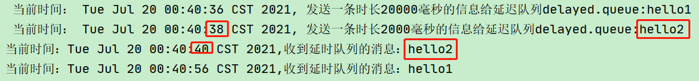

# 4_延时队列

# 七、RabbitMQ 中的 TTL


TTL 是什么呢？TTL 是 RabbitMQ 中一个消息或者队列的属性，表明一条消息或者该队列中的所有消息的<font style="color:#DF2A3F;">最大存活时间</font>，单位是<font style="color:#DF2A3F;">毫秒</font>。


换句话说，如果一条消息设置了 TTL 属性或者进入了设置TTL 属性的队列，那么这条消息如果在 TTL 设置的时间内没有被消费，则会成为"死信"。


如果同时配置了队列的TTL 和消息的 TTL，那么<font style="color:#DF2A3F;">较小的那个值将会被使用</font>，有两种方式设置 TTL。


## 1、队列设置TTL


在创建队列的时候设置队列的“x-message-ttl”属性


## 2、消息设置TTL


是针对每条消息设置TTL


## 3、两者的区别


如果设置了队列的 TTL 属性，那么一旦消息过期，就会被队列丢弃（**如果配置了死信队列被丢到死信队列中**），

而第二种方式，消息即使过期，<font style="color:#DF2A3F;">也不一定会被马上丢弃</font>，因为消息是否过期是在即将投递到消费者之前判定的，如果当前队列有严重的消息积压情况，则已过期的消息也许还能存活较长时间；


另外，还需要注意的一点是，

+ 如果不设置 TTL，表示消息永远不会过期，
+ 如果将 TTL 设置为 0，则表示除非此时可以直接投递该消息到消费者，否则该消息将会被丢弃。

# 八、死信队列
## 1、死信的概念


先从概念解释上搞清楚这个定义，死信，顾名思义就是无法被消费的消息，字面意思可以这样理解，


一般来说，producer 将消息投递到 broker 或者直接到queue 里了，consumer 从 queue 取出消息 进行消费，但某些时候由于特定的原因**导致 queue 中的某些消息无法被消费**，这样的消息如果没有后续的处理，就变成了死信，有死信自然就有了死信队列。


应用场景：


为了保证订单业务的消息数据不丢失，需要使用到 RabbitMQ 的死信队列机制，当消息消费发生异常时，将消息投入死信队列中。


还有比如说：用户在商城下单成功并点击去支付后在指定时间未支付时自动失效


## 2、死信的来源


+  消息 TTL 过期  
TTL是Time To Live的缩写, 也就是生存时间 


+  队列达到最大长度  
队列满了，无法再添加数据到 mq 中 


+  消息被拒绝  
(basic.reject 或 basic.nack) 并且 requeue=false. 

requeue 设置为 false 代表拒绝重新入队 该队列如果配置了死信交换机将发送到死信队列中

## 3、死信实战


### 死信之消息TTl 过期


消费者 C1 代码：


```java
package com.atguigu.rabbitmq.eight;

import com.atguigu.rabbitmq.utils.RabbitMqUtils;
import com.rabbitmq.client.BuiltinExchangeType;
import com.rabbitmq.client.Channel;
import com.rabbitmq.client.DeliverCallback;

import java.util.HashMap;
import java.util.Map;

/**
 * @author: like
 * @Date: 2021/07/19 7:10
 */
public class Consumer01 {

    //普通交换机的名称
    public static final String NORMAL_EXCHANGE = "normal_exchange";
    //死信交换机的名称
    public static final String DEAD_EXCHANGE = "dead_exchange";
    //普通队列的名称
    public static final String NORMAL_QUEUE = "normal_queue";
    //死信队列的名称
    public static final String DEAD_QUEUE = "dead_queue";


    public static void main(String[] args) throws Exception {
        Channel channel = RabbitMqUtils.getChannel();

        //声明死信和普通交换机 类型为direct
        channel.exchangeDeclare(NORMAL_EXCHANGE, BuiltinExchangeType.DIRECT);
        channel.exchangeDeclare(DEAD_EXCHANGE, BuiltinExchangeType.DIRECT);


        /**
         * 声明一个死信队列
         * 1、队列名称
         * 2、队列里面的消息是否持久化(磁盘) 默认情况消息存储在内存中
         * 3、该队列是否只供一个消费者进行消费 是否进行消息共享，true可以多个消费者消费 false：只能一个消费者消费
         * 4、是否自动删除 最后一个消费者端开连接以后 该队列是否自动删除 true自动删除 false不自动删除
         * 5、其他参数
         */
        channel.queueDeclare(DEAD_QUEUE, false, false, false, null);
        //绑定死信的交换机与死信的队列
        channel.queueBind(DEAD_QUEUE, DEAD_EXCHANGE, "lisi");

         /**
         * 声明一个普通队列
         * 1、队列名称
         * 2、队列里面的消息是否持久化(磁盘) 默认情况消息存储在内存中
         * 3、该队列是否只供一个消费者进行消费 是否进行消息共享，true可以多个消费者消费 false：只能一个消费者消费
         * 4、是否自动删除 最后一个消费者端开连接以后 该队列是否自动删除 true自动删除 false不自动删除
         * 5、其他参数
         */
        Map<String, Object> arguments = new HashMap<>();
        //过期时间
//        arguments.put("x-message-ttl",10000);
        //正常队列设置死信交换机
        arguments.put("x-dead-letter-exchange", DEAD_EXCHANGE);
        //设置死信RoutingKey
        arguments.put("x-dead-letter-routing-key", "lisi");
        channel.queueDeclare(NORMAL_QUEUE, false, false, false, arguments);
        //绑定普通的交换机与普通的队列
        channel.queueBind(NORMAL_QUEUE, NORMAL_EXCHANGE, "zhangsan");


        System.out.println("等待接收消息........... ");

        //接收消息
        DeliverCallback deliverCallback = (consumerTag, delivery) -> {

            System.out.println("Consumer01接收到的消息是：" + new String(delivery.getBody(), "UTF-8"));
        };
        //取消消费的一个回调接口 如在消费的时候队列被删除掉了
        CancelCallback cancelCallback = consumerTag -> {
            System.out.println("消费消息被中断");
        };

        /**
         * 消费者消费消息
         * 1、消费哪个队列
         * 2、消费成功之后是否要自动应答 true 自动应答 false 手动应答
         * 3、消费者未成功消费的回调
         * 4、消费者取消消费的回调
         */
        channel.basicConsume(NORMAL_QUEUE, true, deliverCallback, cancelCallback);
    }

}
```


生产者代码


```java
package com.atguigu.rabbitmq.eight;

import com.atguigu.rabbitmq.utils.RabbitMqUtils;
import com.rabbitmq.client.AMQP;
import com.rabbitmq.client.BuiltinExchangeType;
import com.rabbitmq.client.Channel;

/**
 * @author: like
 * @Date: 2021/07/19 7:37
 */
public class Producer {

    //普通交换机的名称
    public static final String NORMAL_EXCHANGE = "normal_exchange";

    public static void main(String[] args) throws Exception {
        Channel channel = RabbitMqUtils.getChannel();
         //声明普通交换机 类型为direct
        channel.exchangeDeclare(NORMAL_EXCHANGE, BuiltinExchangeType.DIRECT);

        //死信消息 设置 TTL时间 10000ms
        AMQP.BasicProperties properties = new AMQP.BasicProperties()
                .builder()
                .expiration("10000")
                .build();

        for (int i = 1; i <11; i++) {
            String message = "info"+i;
            /**
             * 发送一个消息
             * 1、发送到哪个交换机
             * 2、路由的Key值是哪个 本次是队列的名称
             * 3、其他参数信息
             * 4、发送消息的消息体
             */
            channel.basicPublish(NORMAL_EXCHANGE,"zhangsan",properties,message.getBytes());
            System.out.println("生产者发送消息:" + message);
        }

    }

}
```


启动 C1 ，之后关闭C1，模拟其接收不到消息。再启动 Producer


消费者 C2 代码：（以上步骤完成后，启动 C2 消费者，它消费死信队列里面的消息）


```java
package com.atguigu.rabbitmq.eight;

import com.atguigu.rabbitmq.utils.RabbitMqUtils;
import com.rabbitmq.client.Channel;
import com.rabbitmq.client.DeliverCallback;


/**
 * @author: like
 * @Date: 2021/07/19 7:10
 */
public class Consumer02 {


    //死信交换机的名称
    public static final String DEAD_EXCHANGE = "dead_exchange";
    //死信队列的名称
    public static final String DEAD_QUEUE = "dead_queue";


    public static void main(String[] args) throws Exception {
        Channel channel = RabbitMqUtils.getChannel();

//        //声明交换机
//        channel.exchangeDeclare(DEAD_EXCHANGE, BuiltinExchangeType.DIRECT);
//        //声明队列
//        channel.queueDeclare(DEAD_QUEUE, false, false, false, null);
//        channel.queueBind(DEAD_QUEUE, DEAD_EXCHANGE, "lisi");

        System.out.println("等待接收死信消息........... ");

        //接收消息
        DeliverCallback deliverCallback = (consumerTag, delivery) -> {

            System.out.println("Consumer02接收到的消息是：" + new String(delivery.getBody(), "UTF-8"));
        };
        //取消消费的一个回调接口 如在消费的时候队列被删除掉了
        CancelCallback cancelCallback = consumerTag -> {
            System.out.println("消费消息被中断");
        };

        /**
         * 消费者消费消息
         * 1、消费哪个队列
         * 2、消费成功之后是否要自动应答 true 自动应答 false 手动应答
         * 3、消费者未成功消费的回调
         * 4、消费者取消消费的回调
         */
        channel.basicConsume(DEAD_QUEUE, true, deliverCallback, cancelCallback);
    }

}
```


### 死信之队列达到最大长度


1、消息生产者代码去掉 TTL 属性


2、C1 消费者修改以下代码**（启动之后关闭该消费者 模拟其接收不到消息）**


```java
//设置正常队列的长度限制，例如发10个，4个则为死信
params.put("x-max-length",6);
```


注意此时需要把原先队列删除 因为参数改变了


3、C2 消费者代码不变(启动 C2 消费者)


### 死信之消息被拒


1、消息生产者代码


```java
public class Producer {

    //普通交换机的名称
    public static final String NORMAL_EXCHANGE = "normal_exchange";

    public static void main(String[] args) throws Exception {
        Channel channel = RabbitMqUtils.getChannel();
        //声明交换机
        channel.exchangeDeclare(NORMAL_EXCHANGE, BuiltinExchangeType.DIRECT);

        for (int i = 1; i <11; i++) {
            String message = "info"+i;
            /**
             * 发送一个消息
             * 1、发送到哪个交换机
             * 2、路由的Key值是哪个
             * 3、其他参数信息
             * 4、发送消息的消息体
             */
            channel.basicPublish(NORMAL_EXCHANGE,"zhangsan",null,message.getBytes());
            System.out.println("生产者发送消息:" + message);
        }

    }

}
```


2、C1 消费者代码（启动之后关闭该消费者 模拟其接收不到消息）


拒收消息 "info5"


```java
public class Consumer01 {

    //普通交换机的名称
    public static final String NORMAL_EXCHANGE = "normal_exchange";
    //死信交换机的名称
    public static final String DEAD_EXCHANGE = "dead_exchange";
    //普通队列的名称
    public static final String NORMAL_QUEUE = "normal_queue";
    //死信队列的名称
    public static final String DEAD_QUEUE = "dead_queue";


    public static void main(String[] args) throws Exception {
        Channel channel = RabbitMqUtils.getChannel();

        //声明死信和普通交换机 类型为direct
        channel.exchangeDeclare(NORMAL_EXCHANGE, BuiltinExchangeType.DIRECT);
        channel.exchangeDeclare(DEAD_EXCHANGE, BuiltinExchangeType.DIRECT);


         /**
         * 声明一个死信队列
         * 1、队列名称
         * 2、队列里面的消息是否持久化(磁盘) 默认情况消息存储在内存中
         * 3、该队列是否只供一个消费者进行消费 是否进行消息共享，true可以多个消费者消费 false：只能一个消费者消费
         * 4、是否自动删除 最后一个消费者端开连接以后 该队列是否自动删除 true自动删除 false不自动删除
         * 5、其他参数
         */
        channel.queueDeclare(DEAD_QUEUE, false, false, false, null);
        //绑定死信的交换机与死信的队列
        channel.queueBind(DEAD_QUEUE, DEAD_EXCHANGE, "lisi");

         /**
         * 声明一个普通队列
         * 1、队列名称
         * 2、队列里面的消息是否持久化(磁盘) 默认情况消息存储在内存中
         * 3、该队列是否只供一个消费者进行消费 是否进行消息共享，true可以多个消费者消费 false：只能一个消费者消费
         * 4、是否自动删除 最后一个消费者端开连接以后 该队列是否自动删除 true自动删除 false不自动删除
         * 5、其他参数
         */
        Map<String, Object> arguments = new HashMap<>();
        //正常队列设置死信交换机
        arguments.put("x-dead-letter-exchange", DEAD_EXCHANGE);
        //设置死信RoutingKey
        arguments.put("x-dead-letter-routing-key", "lisi");
        channel.queueDeclare(NORMAL_QUEUE, false, false, false, arguments);
        //绑定普通的交换机与普通的队列
        channel.queueBind(NORMAL_QUEUE, NORMAL_EXCHANGE, "zhangsan");


        System.out.println("等待接收消息........... ");

        //接收消息
        DeliverCallback deliverCallback = (consumerTag, delivery) -> {
            String message = new String(delivery.getBody(), "UTF-8");
            if(message.equalsIgnoreCase("info5")){
                System.out.println("Consumer01拒绝接收到的消息是：" +message );
                //requeue 设置为 false 代表拒绝重新入队 该队列如果配置了死信交换机将发送到死信队列中
                channel.basicReject(delivery.getEnvelope().getDeliveryTag(),false);
            }else{
                System.out.println("Consumer01接收到的消息是：" +message );
                channel.basicAck(delivery.getEnvelope().getDeliveryTag(),false);
            }
        };
        //取消消费的一个回调接口 如在消费的时候队列被删除掉了
        CancelCallback cancelCallback = consumerTag -> {
            System.out.println("消费消息被中断");
        };

        /**
         * 消费者消费消息
         * 1、消费哪个队列
         * 2、消费成功之后是否要自动应答 true 自动应答 false 手动应答
         * 3、消费者未成功消费的回调
         * 4、消费者取消消费的回调
         */
        channel.basicConsume(NORMAL_QUEUE, false, deliverCallback, cancelCallback);
    }

}
```


3、C2 消费者代码不变


启动消费者 1 然后再启动消费者 2


# 九、延迟队列
前一小节我们介绍了**死信队列**，又介绍了** TTL**，至此**利用 RabbitMQ 实现延时队列的两大要素**已经集齐，接下来只需要将它们进行融合，再加入一点点调味料，延时队列就可以新鲜出炉了。


想想看，延时队列，不就是想要消息延迟多久被处理吗，TTL 则刚好能让消息在延迟多久之后成为死信，另一方面，成为死信的消息都会被投递到死信队列里，**这样只需要****<font style="color:#DF2A3F;">消费者一直消费死信队列里的消息</font>****就完事了**，因为里面的消息都是希望被立即处理的消息。

## 1、延迟队列概念：


延时队列，队列内部是有序的，最重要的特性就现在它的延时属性上，延时队列中的元素是希望 在指定时间到了以后或之前取出和处理，


简单来说，延时队列就是用来存放需要在指定时间被处理的 元素的队列。

## 2、延迟队列使用场景：


1. 订单在十分钟之内未支付则自动取消


2. 新创建的店铺，如果在十天内都没有上传过商品，则自动发送消息提醒。


3. 用户注册成功后，如果三天内没有登陆则进行短信提醒。


4. 用户发起退款，如果三天内没有得到处理则通知相关运营人员。


5. 预定会议后，需要在预定的时间点前十分钟通知各个与会人员参加会议


这些场景都有一个特点，需要在某个事件发生之后或者之前的指定时间点完成某一项任务，如： 发生订单生成事件，在十分钟之后检查该订单支付状态，然后将未支付的订单进行关闭；看起来似乎使用定时任务，一直轮询数据，每秒查一次，取出需要被处理的数据，然后处理不就完事了吗？


如果数据量比较少，确实可以这样做，比如：对于“如果账单一周内未支付则进行自动结算”这样的需求， 如果对于时间不是严格限制，而是宽松意义上的一周，那么每天晚上跑个定时任务检查一下所有未支付的账单，确实也是一个可行的方案。


但对于数据量比较大，并且时效性较强的场景，如：“订单十分钟内未支付则关闭“，短期内未支付的订单数据可能会有很多，活动期间甚至会达到百万甚至千万级别，对这么庞大的数据量仍旧使用轮询的方式显然是不可取的，很可能在一秒内无法完成所有订单的检查，同时会给数据库带来很大压力，无法满足业务要求而且性能低下。


## 3、整合 springboot


### 创建一个空项目


### pom.xml添加依赖


```xml
<dependencies>
    
   <dependency>
        <groupId>org.springframework.boot</groupId>
        <artifactId>spring-boot-starter</artifactId>
    </dependency>
    
    <!--RabbitMQ 依赖-->
    <dependency>
        <groupId>org.springframework.boot</groupId>
        <artifactId>spring-boot-starter-amqp</artifactId>
    </dependency>
    
    <dependency>
        <groupId>org.springframework.boot</groupId>
        <artifactId>spring-boot-starter-web</artifactId>
    </dependency>
    
    <dependency>
        <groupId>org.springframework.boot</groupId>
        <artifactId>spring-boot-starter-test</artifactId>
        <scope>test</scope>
    </dependency>
    
    <dependency>
        <groupId>com.alibaba</groupId>
        <artifactId>fastjson</artifactId>
        <version>1.2.47</version>
    </dependency>
    
    <dependency>
        <groupId>org.projectlombok</groupId>
        <artifactId>lombok</artifactId>
    </dependency>
    
    <!--swagger-->
    <dependency>
        <groupId>io.springfox</groupId>
        <artifactId>springfox-swagger2</artifactId>
        <version>3.0.0</version>
    </dependency>
    
    <dependency>
        <groupId>io.springfox</groupId>
        <artifactId>springfox-swagger-ui</artifactId>
        <version>3.0.0</version>
    </dependency>
    
    <!--RabbitMQ 测试依赖-->
    <dependency>
        <groupId>org.springframework.amqp</groupId>
        <artifactId>spring-rabbit-test</artifactId>
        <scope>test</scope>
    </dependency>
    
</dependencies>
```


### application.properties配置文件


```properties
spring.rabbitmq.host=*.*.*.*
spring.rabbitmq.port=5672
spring.rabbitmq.username=admin
spring.rabbitmq.password=123456
```


### 添加Swagger 配置类


```java
package com.atguigu.rabbitmq.springbootrabbitmq.config;

import org.springframework.context.annotation.Bean;
import org.springframework.context.annotation.Configuration;
import springfox.documentation.builders.ApiInfoBuilder;
import springfox.documentation.service.ApiInfo;
import springfox.documentation.spi.DocumentationType;
import springfox.documentation.spring.web.plugins.Docket;
import springfox.documentation.swagger2.annotations.EnableSwagger2;
import springfox.documentation.service.Contact;

@Configuration
@EnableSwagger2
public class SwaggerConfig {

    @Bean
    public Docket webApiConfig() {
        return new Docket(DocumentationType.SWAGGER_2)
                .groupName("webApi")
                .apiInfo(webApiInfo())
                .select()
                .build();
    }

    private ApiInfo webApiInfo() {
        return new ApiInfoBuilder()
                .title("rabbitmq 接口文档")
                .description("本文档描述了 rabbitmq 微服务接口定义")
                .version("1.0")
                .contact(new Contact("like", "http://like.com", "test@qq.com"))
                .build();
    }

}
```


## 4、延时队列 TTL


### 代码架构图


创建两个队列 QA 和 QB，两者队列 TTL 分别设置为 10S 和 40S，然后再创建一个交换机 X 和死信交换机 Y，它们的类型都是direct，创建一个死信队列 QD，它们的绑定关系如下：


原先配置队列信息，写在了生产者和消费者代码中，现在可写在配置类中，生产者只发消息，消费者只接受消息


### 配置文件类


```java
package com.atguigu.rabbitmq.springbootrabbitmq.config;

import org.springframework.amqp.core.*;
import org.springframework.beans.factory.annotation.Qualifier;
import org.springframework.context.annotation.Bean;
import org.springframework.context.annotation.Configuration;

import java.util.HashMap;
import java.util.Map;

/***
 * @description: TTL队列 配置文件类代码
 * @author like
 * @date: 2021/7/19 19:31
 */
@Configuration
public class TtlQueueConfig {

    //普通交换机的名称
    public static final String X_EXCHANGE = "X";
    //普通队列的名称
    public static final String QUEUE_A = "QA";
    public static final String QUEUE_B = "QB";

    //死信交换机的名称
    public static final String Y_DEAD_LETTER_EXCHANGE = "Y";
    //死信队列的名称
    public static final String DEAD_LETTER_QUEUE = "QD";

    //声明xExchange
    @Bean("xExchange")
    public DirectExchange xExchange() {
        return new DirectExchange(X_EXCHANGE);
    }

    //声明yExchange
    @Bean("yExchange")
    public DirectExchange yExchange() {
        return new DirectExchange(Y_DEAD_LETTER_EXCHANGE);
    }

    //声明普通队列A TTL 为 10s 并绑定到对应的死信交换机
    @Bean("queueA")
    public Queue queueA() {

        Map<String, Object> arguments = new HashMap<>(3);
        //设置死信交换机
        arguments.put("x-dead-letter-exchange", Y_DEAD_LETTER_EXCHANGE);
        //设置死信RoutingKey
        arguments.put("x-dead-letter-routing-key", "YD");
        //设置TTL
        arguments.put("x-message-ttl", 10000);

        return QueueBuilder.durable(QUEUE_A).withArguments(arguments).build();
    }


    // 声明队列 A 绑定 X 交换机
    @Bean
    public Binding queueABindIngX(@Qualifier("queueA") Queue queueA, @Qualifier("xExchange") DirectExchange xExchange) {
        return BindingBuilder.bind(queueA).to(xExchange).with("XA");
    }


    //声明普通队列B TTL 为 40s 并绑定到对应的死信交换机
    @Bean("queueB")
    public Queue queueB() {

        Map<String, Object> arguments = new HashMap<>(3);
        //设置死信交换机
        arguments.put("x-dead-letter-exchange", Y_DEAD_LETTER_EXCHANGE);
        //设置死信RoutingKey
        arguments.put("x-dead-letter-routing-key", "YD");
        //设置TTL
        arguments.put("x-message-ttl", 40000);

        return QueueBuilder.durable(QUEUE_B).withArguments(arguments).build();
    }

    //声明队列 B 绑定 X 交换机
    @Bean
    public Binding queueBBindIngX(@Qualifier("queueB") Queue queueB, @Qualifier("xExchange") DirectExchange xExchange) {
        return BindingBuilder.bind(queueB).to(xExchange).with("XB");
    }

    //声明死信队列
    @Bean("queueD")
    public Queue queueD() {
        return QueueBuilder.durable(DEAD_LETTER_QUEUE).build();
    }

    //声明死信队列 QD 绑定关系
    @Bean
    public Binding queueDBindIngY(@Qualifier("queueD") Queue queueD, @Qualifier("yExchange") DirectExchange yExchange) {
        return BindingBuilder.bind(queueD).to(yExchange).with("YD");
    }

}
```


### 消息生产者


```java
package com.atguigu.rabbitmq.springbootrabbitmq.controller;

import lombok.extern.slf4j.Slf4j;
import org.springframework.amqp.rabbit.core.RabbitTemplate;
import org.springframework.beans.factory.annotation.Autowired;
import org.springframework.web.bind.annotation.GetMapping;
import org.springframework.web.bind.annotation.PathVariable;
import org.springframework.web.bind.annotation.RequestMapping;
import org.springframework.web.bind.annotation.RestController;

import java.util.Date;

/***
 * @description: 发送延迟消息
 * @author like
 * @date: 2021/7/19 20:09
 */
@Slf4j
@RestController
@RequestMapping("/ttl")
public class SendMsgController {

    @Autowired
    private RabbitTemplate rabbitTemplate;

    //开始发消息
    @GetMapping("/sendMsg/{message}")
    public void sendMsg(@PathVariable String message) {
        log.info("当前时间：{}，发送一条信息给两个TTL队列：{}", new Date().toString(), message);

        rabbitTemplate.convertAndSend("X","XA","消息来自TTL为10s的队列："+message);
        rabbitTemplate.convertAndSend("X","XB","消息来自TTL为40s的队列："+message);
    }

}
```


### 消息消费者


```java
package com.atguigu.rabbitmq.springbootrabbitmq.consumer;

import com.rabbitmq.client.Channel;
import lombok.extern.slf4j.Slf4j;
import org.springframework.amqp.core.Message;
import org.springframework.amqp.rabbit.annotation.RabbitListener;
import org.springframework.stereotype.Component;


import java.util.Date;

/***
 * @description: 队列TTL 消费者
 * @author like
 * @date: 2021/7/19 20:16
 */
@Slf4j
@Component
public class DeadLetterQueueConsumer {

    //接收消息
    @RabbitListener(queues = "QD")
    public void receiveD(Message message, Channel channel) throws Exception {
        String msg = new String(message.getBody());
        log.info("当前时间：{}，收到死信队列的消息：{}", new Date().toString(), msg);
    }
}
```


发起一个请求 [http://localhost:8080/ttl/sendMsg/嘻嘻嘻](http://localhost:8080/ttl/sendMsg/%E5%98%BB%E5%98%BB%E5%98%BB)


第一条消息在 10S 后变成了死信消息，然后被消费者消费掉，第二条消息在 40S 之后变成了死信消息， 然后被消费掉，这样一个延时队列就打造完成了。


不过，如果这样使用的话，岂不是**每增加一个新的时间需求，就要新增一个队列，**这里只有 10S 和 40S 两个时间选项，如果需要一个小时后处理，那么就需要增加TTL 为一个小时的队列，如果是预定会议室然后提前通知这样的场景，岂不是要增加无数个队列才能满足需求？


## 5、延时队列TTL优化


### 代码架构图


在这里新增了一个队列 QC，绑定关系如下,该队列不设置TTL 时间


### 配置文件类


```java
@Configuration
public class MsgTtlQueueConfig {
    public static final String Y_DEAD_LETTER_EXCHANGE = "Y";
    public static final String QUEUE_C = "QC";

    //声明QC队列 并绑定到对应的死信交换机
    @Bean("queueC")
    public Queue queueC() {

        Map<String, Object> arguments = new HashMap<>(3);
        //设置死信交换机
        arguments.put("x-dead-letter-exchange", Y_DEAD_LETTER_EXCHANGE);
        //设置死信RoutingKey
        arguments.put("x-dead-letter-routing-key", "YD");

        return QueueBuilder.durable(QUEUE_C).withArguments(arguments).build();
    }

    //声明QC队列 绑定 X 交换机
    @Bean
    public Binding queueCBindingX(@Qualifier("queueC") Queue queueC,
                                  @Qualifier("xExchange") DirectExchange xExchange){
        return BindingBuilder.bind(queueC).to(xExchange).with("XC");
    }
}
```


### 生产者代码


```java
/**
 * 延时队列优化
 * @param message 消息
 * @param ttlTime 延时的毫秒
 */
@GetMapping("/sendExpirationMsg/{message}/{ttlTime}")
public void sendMsg(@PathVariable String message, @PathVariable String ttlTime) {
    log.info("当前时间：{}，发送一条时长{}毫秒TTL信息给队列QC：{}", new Date().toString(), ttlTime, message);

    rabbitTemplate.convertAndSend("X", "XC", message, msg -> {
        //设置发送消息的 延迟时长
        msg.getMessageProperties().setExpiration(ttlTime);
        return msg;
    });
}
```


发起请求


[http://localhost:8080/ttl/sendExpirationMsg/你好1/20000](http://localhost:8080/ttl/sendExpirationMsg/%E4%BD%A0%E5%A5%BD1/20000)


[http://localhost:8080/ttl/sendExpirationMsg/你好2/2000](http://localhost:8080/ttl/sendExpirationMsg/%E4%BD%A0%E5%A5%BD2/2000)


看起来似乎没什么问题，但是在最开始的时候，就介绍过如果使用在消息属性上设置 TTL 的方式，消息可能并不会按时“死亡“。


因为 **RabbitMQ ****<font style="color:#DF2A3F;">只会检查第一个消息是否过期</font>**，如果过期则丢到死信队列， **如果第一个消息的延时时长很长，而第二个消息的延时时长很短，第二个消息****<font style="color:#DF2A3F;">并不会优先得到执行</font>**。


**这也就是为什么第二个延时2秒，却后执行。**


## 6、Rabbitmq 插件实现延迟队列


上文中提到的问题，确实是一个问题，如果不能实现在消息粒度上的 TTL，并使其在设置的TTL 时间及时死亡，就无法设计成一个通用的延时队列。


那如何解决呢，接下来我们就去解决该问题。


### 安装延时队列插件


可去[官网下载](https://www.rabbitmq.com/community-plugins.html) **rabbitmq_delayed_message_exchange** 插件，解压放置到 RabbitMQ 的插件目录。


进入 RabbitMQ 的安装目录下的 plugins目录，


```plain
/usr/lib/rabbitmq/lib/rabbitmq_server-3.8.8/plugins
```


执行下面命令让该插件生效，然后重启 RabbitMQ


```plain
rabbitmq-plugins enable rabbitmq_delayed_message_exchange
```


### 代码架构图


在这里新增了一个队列delayed.queue，一个自定义交换机 delayed.exchange，绑定关系如下:


### 配置文件类


在我们自定义的交换机中，**这是一种新的交换类型，该类型消息支持延迟投递机制**


消息传递后并不会立即投递到目标队列中，而是存储在 mnesia(一个分布式数据系统)表中，当达到投递时间时，才投递到目标队列中。


```java
package com.atguigu.rabbitmq.springbootrabbitmq.config;


import org.springframework.amqp.core.Binding;
import org.springframework.amqp.core.BindingBuilder;
import org.springframework.amqp.core.CustomExchange;
import org.springframework.amqp.core.Queue;
import org.springframework.beans.factory.annotation.Qualifier;
import org.springframework.context.annotation.Bean;
import org.springframework.context.annotation.Configuration;

import java.util.HashMap;
import java.util.Map;

/**
 * @author: like
 * @Date: 2021/07/20 0:03
 */
@Configuration
public class DelayedQueueConfig {

    //交换机
    public static final String DELAYED_EXCHANGE_NAME = "delayed.exchange";
    //队列
    public static final String DELAYED_QUEUE_NAME = "delayed.queue";
    //routingKey
    public static final String DELAYED_ROUTING_KEY = "delayed.routingKey";

    //声明交换机  基于插件的
    @Bean
    public CustomExchange delayedExchange() {

        Map<String, Object> arguments = new HashMap<>();
        arguments.put("x-delayed-type", "direct");
        /*
         * 1、交换机的名称
         * 2、交换机的类型
         * 3、是否需要持久化
         * 4、是否需要自动删除
         * 5、其他的参数
         */
        return new CustomExchange(DELAYED_EXCHANGE_NAME,
                "x-delayed-message",
                true,
                false,
                arguments);
    }

    @Bean
    public Queue delayedQueue() {
        return new Queue(DELAYED_QUEUE_NAME);
    }


    //绑定
    @Bean
    public Binding bindingDelayedQueue(@Qualifier("delayedQueue") Queue delayedQueue,
                                                      @Qualifier("delayedExchange") CustomExchange delayedExchange) {
        return BindingBuilder.bind(delayedQueue).to(delayedExchange).with(DELAYED_ROUTING_KEY).noargs();
    }


}
```


### 生产者代码


```java
//开始发消息 消息 TTL
@GetMapping("/sendDelayMsg/{message}/{delayTime}")
public void sendMsg(@PathVariable String message, @PathVariable Integer delayTime) {

    log.info(" 当前时间： {}, 发送一条时长{}毫秒的信息给延迟队列delayed.queue:{}", new Date(), delayTime, message);

    rabbitTemplate.convertAndSend(
        DelayedQueueConfig.DELAYED_EXCHANGE_NAME,
        DelayedQueueConfig.DELAYED_ROUTING_KEY, 
        message,
        correlationData -> {
            //发送消息的时候 延迟时长
            correlationData.getMessageProperties().setDelay(delayTime);
            return correlationData;
        });
}
```


### 消费者代码


```java
package com.atguigu.rabbitmq.springbootrabbitmq.consumer;

import com.atguigu.rabbitmq.springbootrabbitmq.config.DelayedQueueConfig;
import lombok.extern.slf4j.Slf4j;
import org.springframework.amqp.core.Message;
import org.springframework.amqp.rabbit.annotation.RabbitListener;
import org.springframework.stereotype.Component;

import java.util.Date;

/*
 * 消费者 - 基于插件的延时队列
 * @author: like
 * @Date: 2021/07/20 0:28
 */
@Slf4j
@Component
public class DelayQueueConsumer {

    //监听消息
    @RabbitListener(queues = DelayedQueueConfig.DELAYED_QUEUE_NAME)
    public void receiveDelayedQueue(Message message) {

        String msg = new String(message.getBody());
        log.info("当前时间：{},收到延时队列的消息：{}", new Date().toString(), msg);
    }

}
```


发送请求：


+ [http://localhost:8080/ttl/sendDelayMsg/hello1/20000](http://localhost:8080/ttl/sendDelayMsg/hello1/20000)
+ [http://localhost:8080/ttl/sendDelayMsg/hello2/2000](http://localhost:8080/ttl/sendDelayMsg/hello2/2000)





第二个消息被先消费掉了，符合预期


## 7、总结


延时队列在需要延时处理的场景下非常有用，使用 RabbitMQ 来实现延时队列可以很好的利用 RabbitMQ 的特性，


如：消息可靠发送、消息可靠投递、死信队列来保障消息至少被消费一次以及未被正确处理的消息不会被丢弃。


另外，通过 RabbitMQ 集群的特性，可以很好的解决单点故障问题，不会因为 单个节点挂掉导致延时队列不可用或者消息丢失。


当然，延时队列还有很多其它选择，比如利用 Java 的 <font style="color:#DF2A3F;">DelayQueue</font>，利用 Redis 的 <font style="color:#DF2A3F;">zset</font>，利用 <font style="color:#DF2A3F;">Quartz</font> 或者利用 <font style="color:#DF2A3F;">kafka</font> 的时间轮，这些方式各有特点，看需要适用的场景


> 更新: 2023-08-23 16:21:34  
> 原文: <https://www.yuque.com/like321/wzux58/lbv06x>