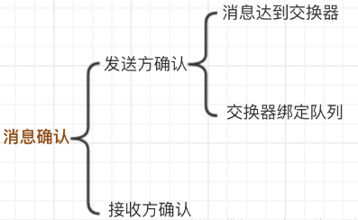
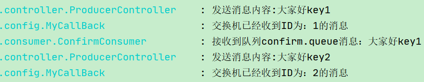

# 5_发布确认高级

# 十、发布确认高级(SpringBoot版)


在生产环境中由于一些不明原因，导致 RabbitMQ  重启，在 RabbitMQ 重启期间生产者消息投递失败， 导致消息丢失，需要手动处理和恢复。


于是，我们开始思考，如何才能进行 RabbitMQ 的消息可靠投递呢？



## 1、<font style="color:rgb(79, 79, 79);">ConfirmCallback </font><font style="color:#E8323C;">发布端到交换机的回调</font>
<font style="color:rgb(77, 77, 77);">ConfirmCallback 是一个回调接口，消息发送到 Broker 后触发回调，确认消息是否到达 Broker 服务器，</font>**<font style="color:#E8323C;">也就是只确认是否正确到达 Exchange 中</font>****<font style="color:rgb(77, 77, 77);">。</font>**

<font style="color:rgb(77, 77, 77);">我们需要在生产者的配置中添加下面配置，表示开启发布者确认。</font>

```properties
spring.rabbitmq.publisher-confirm-type=correlated 	#新版本
spring.rabbitmq.publisher-confirms=true 						#老版本
```

### 确认机制方案


### 代码架构图


### 配置文件


```properties
spring.rabbitmq.host=*.*.*.*
spring.rabbitmq.port=5672
spring.rabbitmq.username=admin
spring.rabbitmq.password=123456
spring.rabbitmq.publisher-confirm-type=correlated	#确认消息已发送到交换机(Exchange)
```


+  `NONE`  禁用发布确认模式，是默认值 
+  `CORRELATED`   发布消息成功到交换器后会触发回调方法 
+  `SIMPLE`   经测试有两种效果，
    - 其一效果和 CORRELATED 值一样会触发回调方法，
    - 其二在发布消息成功后使用 rabbitTemplate 调用 waitForConfirms 或 waitForConfirmsOrDie 方法等待 broker 节点返回发送结果，根据返回结果来判定下一步的逻辑，要注意的点是 waitForConfirmsOrDie 方法如果返回 false 则会关闭 channel，则接下来无法发送消息到 broker; 


### 添加配置类


```java
package com.atguigu.rabbitmq.springbootrabbitmq.config;

import org.springframework.amqp.core.*;
import org.springframework.beans.factory.annotation.Qualifier;
import org.springframework.context.annotation.Bean;
import org.springframework.context.annotation.Configuration;

/**
 * @author: like
 * @Date: 2021/07/20 8:07
 */
@Configuration
public class ConfirmConfig {

    //交换机
    public static final String CONFIRM_EXCHANGE_NAME = "confirm.exchange";
    //队列
    public static final String CONFIRM_QUEUE_NAME = "confirm.queue";

    //RoutingKey
    public static final String CONFIRM_ROUTING_KEY = "key1";


    //声明交换机
    @Bean("confirmExchange")
    public DirectExchange confirmExchange() {
        return new DirectExchange(CONFIRM_EXCHANGE_NAME);
    }

    //声明队列
    @Bean("confirmQueue")
    public Queue confirmQueue() {
        return QueueBuilder.durable(CONFIRM_QUEUE_NAME).build();
    }

    //绑定
    @Bean
    public Binding queueBindingExchange(@Qualifier("confirmQueue") Queue confirmQueue,
                                        @Qualifier("confirmExchange") DirectExchange confirmExchange) {
        return BindingBuilder.bind(confirmQueue).to(confirmExchange).with(CONFIRM_ROUTING_KEY);
    }

}
```


### 消息生产者


```java
package com.atguigu.rabbitmq.springbootrabbitmq.controller;

import com.atguigu.rabbitmq.springbootrabbitmq.config.ConfirmConfig;
import com.atguigu.rabbitmq.springbootrabbitmq.config.MyCallBack;
import lombok.extern.slf4j.Slf4j;
import org.springframework.amqp.rabbit.connection.CorrelationData;
import org.springframework.amqp.rabbit.core.RabbitTemplate;
import org.springframework.beans.factory.annotation.Autowired;
import org.springframework.web.bind.annotation.GetMapping;
import org.springframework.web.bind.annotation.PathVariable;
import org.springframework.web.bind.annotation.RequestMapping;
import org.springframework.web.bind.annotation.RestController;

import javax.annotation.PostConstruct;

/**
 * @author: like
 * @Date: 2021/07/20 8:20
 */
@Slf4j
@RestController
@RequestMapping("/confirm")
public class ProducerController {

    @Autowired
    private RabbitTemplate rabbitTemplate;

    @Autowired
    private MyCallBack myCallBack;

    //依赖注入 rabbitTemplate 之后再设置它的回调对象
    @PostConstruct
    public void init() {
        //注入
        rabbitTemplate.setConfirmCallback(myCallBack);
    }


    /**
     * 发消息 消息回调和退回
     *
     * @param message
     */
    @GetMapping("/sendMessage/{message}")
    public void sendMsg(@PathVariable String message) {
        //指定消息 id 为 1
        CorrelationData correlationData1 = new CorrelationData("1");
        rabbitTemplate.convertAndSend(
                ConfirmConfig.CONFIRM_EXCHANGE_NAME,
                ConfirmConfig.CONFIRM_ROUTING_KEY,
                message + "key1",
                correlationData1);
        log.info("发送消息内容:{}", message + "key1");

        //指定消息 id 为 2
        CorrelationData correlationData2 = new CorrelationData("2");
        rabbitTemplate.convertAndSend(ConfirmConfig.CONFIRM_EXCHANGE_NAME,
                ConfirmConfig.CONFIRM_ROUTING_KEY + "2",	//故意写错RoutingKey
                message + "key2",
                correlationData2);
        log.info("发送消息内容:{}", message + "key2");
    }


}
```


### 回调接口


交换机如果收不到消息，可以进行回调接口


```java
package com.atguigu.rabbitmq.springbootrabbitmq.config;

import lombok.extern.slf4j.Slf4j;
import org.springframework.amqp.rabbit.connection.CorrelationData;
import org.springframework.amqp.rabbit.core.RabbitTemplate;
import org.springframework.stereotype.Component;


@Component
@Slf4j
public class MyCallBack implements RabbitTemplate.ConfirmCallback {

    /**
     * 交换机不管是否收到消息 都回调
     *
     * @param correlationData 保存回调消息的ID及相关信息
     * @param ack             交换机是否收到消息 true false
     * @param cause           未收到消息的原因
     */
    @Override
    public void confirm(CorrelationData correlationData, boolean ack, String cause) {
        String id = correlationData != null ? correlationData.getId() : "";

        if (ack) {
            log.info("交换机已经收到ID为：{}的消息", id);
        } else {
            log.info("交换机还未收到ID为：{}的消息，由于原因：{}", id, cause);
        }

    }

}
```


### 消息消费者


```java
package com.atguigu.rabbitmq.springbootrabbitmq.consumer;

import com.atguigu.rabbitmq.springbootrabbitmq.config.ConfirmConfig;
import lombok.extern.slf4j.Slf4j;
import org.springframework.amqp.core.Message;
import org.springframework.amqp.rabbit.annotation.RabbitListener;
import org.springframework.stereotype.Component;

/**
 * @author: like
 * @Date: 2021/07/20 8:23
 */
@Component
@Slf4j
public class ConfirmConsumer {

    @RabbitListener(queues = ConfirmConfig.CONFIRM_QUEUE_NAME)
    public void receiveConfirmMessage(Message message) {

        String msg = new String(message.getBody());
        log.info("接收到队列confirm.queue消息：{}", msg);
    }


}
```


访问： [http://localhost:8080/confirm/sendMessage/大家好](http://localhost:8080/confirm/sendMessage/%E5%A4%A7%E5%AE%B6%E5%A5%BD)


### 结果分析





可以看到，发送了两条消息，第一条消息的 RoutingKey 为 "key1"，第二条消息的 RoutingKey 为 "key2"，两条消息都成功被交换机接收，也收到了交换机的确认回调，


但消费者只收到了一条消息，因为第二条消息的 RoutingKey 与队列的 BindingKey 不一致，也没有其它队列能接收这个消息，所有第二条消息被直接丢弃了。


**丢弃的消息交换机是不知道的，需要解决告诉生产者消息传送失败**


## 2、回退消息  <font style="color:rgb(79, 79, 79);">ReturnCallback </font><font style="color:#E8323C;">交换机到队列的回调</font>
通过实现 ReturnCallback 接口，启动消息失败返回，<font style="color:#E8323C;">此接口是在交换器路由不到队列时触发回调</font>，该方法可以不使用，因为交换器和队列是在代码里绑定的，如果消息成功投递到 Broker 后几乎不存在绑定队列失败，除非你代码写错了。


使用此接口需要在生产者配置中加入一下配置，表示发布者返回。

```properties
spring.rabbitmq.publisher-returns=true  #确认消息已发送到队列(Queue)
```

### Mandatory 参数


```java
rabbitTemplate.setMandatory(true);
rabbitTemplate.setReturnsCallback(myCallBack);
```


**在仅开启了生产者确认机制的情况下，交换机接收到消息后，会直接给消息生产者发送确认消息，如果发现该消息不可路由，那么消息会被直接丢弃，此时生产者是不知道消息被丢弃这个事件的。**


那么如何让无法被路由的消息帮我想办法处理一下？最起码通知我一声，我好自己处理啊。


通过设置 mandatory 参数可以在当消息传递过程中不可达目的地时将消息返回给生产者。


### 修改配置


```properties
#消息退回
spring.rabbitmq.publisher-returns=true
```


### 修改回调接口


```java
package com.atguigu.rabbitmq.springbootrabbitmq.config;

import lombok.extern.slf4j.Slf4j;
import org.springframework.amqp.core.Message;
import org.springframework.amqp.rabbit.connection.CorrelationData;
import org.springframework.amqp.rabbit.core.RabbitTemplate;
import org.springframework.stereotype.Component;


@Component
@Slf4j
public class MyCallBack implements RabbitTemplate.ConfirmCallback, RabbitTemplate.ReturnCallback {

    /**
     * 交换机确认回调方法
     * <p>
     * 不管是否收到消息 都回调
     *
     * @param correlationData 保存回调消息的ID及相关信息
     * @param ack             交换机是否收到消息 true false
     * @param cause           未收到消息的原因
     */
    @Override
    public void confirm(CorrelationData correlationData, boolean ack, String cause) {
        String id = correlationData != null ? correlationData.getId() : "";

        if (ack) {
            log.info("交换机已经收到ID为：{}的消息", id);
        } else {
            log.info("交换机还未收到ID为：{}的消息，由于原因：{}", id, cause);
        }

    }

    //当消息无法路由的时候的回调方法
    //只有不可达目的地的时候 才进行回退
    @Override
    public void returnedMessage(Message message, int replyCode, String replyText, String exchange, String routingKey) {
        log.error("消息{}，被交换机{}退回，退回原因：{}，路由key为：{}",
                new String(message.getBody()),
                exchange,
                replyText,
                routingKey);
    }


}
```


### 修改消息生产者


```java
//依赖注入 rabbitTemplate 之后再设置它的回调对象
@PostConstruct
public void init() {
    //注入
    rabbitTemplate.setConfirmCallback(myCallBack);
    /**
     * true：交换机无法将消息进行路由时，会将该消息返回给生产者
     * false：如果发现消息无法进行路由，则直接丢弃
     */
    rabbitTemplate.setMandatory(true);
    //设置回退消息交给谁处理
    rabbitTemplate.setReturnCallback(myCallBack);
}
```


访问： [http://localhost:8080/confirm/sendMessage/大家好](http://localhost:8080/confirm/sendMessage/%E5%A4%A7%E5%AE%B6%E5%A5%BD)


### 结果分析


## 3、备份交换机


有了 mandatory 参数和回退消息，我们获得了对无法投递消息的感知能力，有机会在生产者的消息无法被投递时发现并处理。


但有时候，我们并不知道该如何处理这些无法路由的消息，最多打个日志，然后触发报警，再来手动处理。


而通过日志来处理这些无法路由的消息是很不优雅的做法，特别是当生产者所在的服务有多台机器的时候，手动复制日志会更加麻烦而且容易出错。


而且设置 mandatory 参数会增加生产者的复杂性，需要添加处理这些被退回的消息的逻辑。


如果既不想丢失消息，又不想增加生产者的复杂性，该怎么做呢？


前面在设置死信队列的文章中，我们提到，**可以为队列设置死信交换机来存储那些处理失败的消息，可是这些不可路由消息根本没有机会进入到队列，因此无法使用死信队列来保存消息。**


在 RabbitMQ 中，有一种备份交换机的机制存在，可以很好的应对这个问题。


**什么是备份交换机呢？备份交换机可以理解为 RabbitMQ 中交换机的“备胎”，**


**当我们为某一个交换机声明一个对应的备份交换机时，就是为它创建一个备胎，当交换机接收到一条不可路由消息时，将会把这条消息转发到备份交换机中，由备份交换机来进行转发和处理，**


通常备份交换机的类型为 Fanout ，这样就能把所有消息都投递到与其绑定的队列中，然后我们在备份交换机下绑定一个队列，这样所有那些原交换机无法被路由的消息，就会都进入这个队列了。


当然，我们还可以建立一个报警队列，用独立的消费者来进行监测和报警。


### 代码架构图


### 修改配置类


```java
package com.atguigu.rabbitmq.springbootrabbitmq.config;

import org.springframework.amqp.core.*;
import org.springframework.beans.factory.annotation.Qualifier;
import org.springframework.context.annotation.Bean;
import org.springframework.context.annotation.Configuration;

/**
 * @author: like
 * @Date: 2021/07/20 8:07
 */
@Configuration
public class ConfirmConfig {

    //交换机
    public static final String CONFIRM_EXCHANGE_NAME = "confirm.exchange";
    //队列
    public static final String CONFIRM_QUEUE_NAME = "confirm.queue";
    //RoutingKey
    public static final String CONFIRM_ROUTING_KEY = "key1";

    ///////////////////////////关于备份的

    //备份交换机
    public static final String BACKUP_EXCHANGE_NAME = "backup.exchange";
    //备份队列
    public static final String BACKUP_QUEUE_NAME = "backup.queue";
    //报警队列
    public static final String WARNING_QUEUE_NAME = "warning.queue";


//    //声明交换机 Exchange
//    @Bean("confirmExchange")
//    public DirectExchange confirmExchange() {
//        return new DirectExchange(CONFIRM_EXCHANGE_NAME);
//    }
    
    //声明确认 Exchange 交换机的备份交换机
    @Bean("confirmExchange")
    public DirectExchange confirmExchange() {
      return  ExchangeBuilder.directExchange(CONFIRM_EXCHANGE_NAME)
                .durable(true)
                //设置该交换机的备份交换机
                .withArgument("alternate-exchange", BACKUP_EXCHANGE_NAME)
                .build();
    }

    //声明确认队列
    @Bean("confirmQueue")
    public Queue confirmQueue() {
        return QueueBuilder.durable(CONFIRM_QUEUE_NAME).build();
    }

    //声明确认队列绑定关系
    @Bean
    public Binding queueBindingExchange(@Qualifier("confirmQueue") Queue confirmQueue,
                                        @Qualifier("confirmExchange") DirectExchange confirmExchange) {
        return BindingBuilder.bind(confirmQueue).to(confirmExchange).with(CONFIRM_ROUTING_KEY);
    }

    //************************以下是关于备份的******************************

    //备份交换机
    @Bean("backupExchange")
    public FanoutExchange backupExchange() {
        return new FanoutExchange(BACKUP_EXCHANGE_NAME);
    }

    //备份队列
    @Bean("backupQueue")
    public Queue backupQueue() {
        return QueueBuilder.durable(BACKUP_QUEUE_NAME).build();
    }

    // 声明备份队列绑定关系
    @Bean
    public Binding backupQueueBindingBackupExchange(@Qualifier("backupQueue") Queue backupQueue,
                                                    @Qualifier("backupExchange") FanoutExchange backupExchange) {
        return BindingBuilder.bind(backupQueue).to(backupExchange);
    }

    //报警队列
    @Bean("warningQueue")
    public Queue warningQueue() {
        return QueueBuilder.durable(WARNING_QUEUE_NAME).build();
    }

    // 声明报警队列绑定关系
    @Bean
    public Binding warningQueueBindingBackupExchange(@Qualifier("warningQueue") Queue warningQueue,
                                                     @Qualifier("backupExchange") FanoutExchange backupExchange) {
        return BindingBuilder.bind(warningQueue).to(backupExchange);
    }

}
```


### 报警消费者


```java
package com.atguigu.rabbitmq.springbootrabbitmq.consumer;

import com.atguigu.rabbitmq.springbootrabbitmq.config.ConfirmConfig;
import lombok.extern.slf4j.Slf4j;
import org.springframework.amqp.core.Message;
import org.springframework.amqp.rabbit.annotation.RabbitListener;
import org.springframework.stereotype.Component;

/**
 * @author: like
 * @Date: 2021/07/21 8:14
 */
@Component
@Slf4j
public class WarningConsumer {

    //接收报警消息
    @RabbitListener(queues = ConfirmConfig.WARNING_QUEUE_NAME)
    public void receiveWarningMsg(Message message){
        String msg = new String(message.getBody());
        log.error("报警发现不可路由消息：{}",msg);
    }

}
```


### 测试注意事项


之前已写过 `confirm.exchange` 交换机，由于更改配置，需要删掉，不然会报错


### 结果分析


访问： [http://localhost:8080/confirm/sendMessage/大家好](http://localhost:8080/confirm/sendMessage/%E5%A4%A7%E5%AE%B6%E5%A5%BD)


mandatory 参数（回退消息）与备份交换机可以一起使用的时候，如果两者同时开启，消息究竟何去何从，谁优先级高？


经过上面结果显示答案是**备份交换机优先级高**。


> 更新: 2023-02-02 17:20:24  
> 原文: <https://www.yuque.com/like321/wzux58/padfd0>