# 6_RabbitMQ深入

# 十一、Rabbitmq其他知识点


## 1、幂等性


用户对于同一操作发起的一次请求或者多次请求的结果是一致的，不会因为多次点击而产生了副作用。


举个最简单的例子，那就是支付，用户购买商品后支付，支付扣款成功，但是返回结果的时候网络异常， 此时钱已经扣了，用户再次点击按钮，此时会进行第二次扣款，返回结果成功，用户查询余额发现多扣钱 了，流水记录也变成了两条。


在以前的单应用系统中，我们只需要把数据操作放入事务中即可，发生错误立即回滚，但是在响应客户端的时候也有可能出现网络中断或者异常等等


### 消息重复消费


消费者在消费 MQ 中的消息时，MQ 已把消息发送给消费者，消费者在给 MQ 返回 ack 时网络中断， 故 MQ 未收到确认信息，


该条消息会重新发给其他的消费者，或者在网络重连后再次发送给该消费者，但实际上该消费者已成功消费了该条消息，造成消费者消费了重复的消息。


### 解决思路


MQ 消费者的幂等性的解决：


一般使用全局 ID


或者写个唯一标识比如时间戳


或者 UUID


或者订单消费者消费 MQ 中的消息也可利用 MQ 的该 id 来判断，


或者可按自己的规则生成一个全局唯一 id，每次消费消息时用该 id 先判断该消息是否已消费过。


### 消费端的幂等性保障


在海量订单生成的业务高峰期，生产端有可能就会重复发生了消息，这时候消费端就要实现幂等性， 这就意味着我们的消息永远不会被消费多次，即使我们收到了一样的消息。


业界主流的幂等性有两种操作:


+ **唯一 ID+指纹码机制，利用数据库主键去重, **
+ **利用 redis 的原子性去实现**


#### 唯一ID+指纹码机制


指纹码：我们的一些规则或者时间戳加别的服务给到的唯一信息码,它并不一定是我们系统生成的，基本都是由我们的业务规则拼接而来，但是一定要保证唯一性，


然后就利用查询语句进行判断这个 id 是否存在数据库中，


优势就是实现简单就一个拼接，然后查询判断是否重复；


劣势就是在高并发时，如果是单个数据库就会有写入性能瓶颈当然也可以采用分库分表提升性能，但也不是我们最推荐的方式。

#### 
#### Redis 原子性


利用 redis 执行 setnx 命令，天然具有幂等性。从而实现不重复消费


## 2、优先级队列


### 使用场景


在我们系统中有一个**订单催付**的场景，我们的客户在天猫下的订单，淘宝会及时将订单推送给我们，如果在用户设定的时间内未付款那么就会给用户推送一条短信提醒，很简单的一个功能对吧。


但是，tmall 商家对我们来说，肯定是要分大客户和小客户的对吧，比如像苹果，小米这样大商家一年起码能给我们创造很大的利润，所以理应当然，他们的订单必须得到优先处理，


而曾经我们的后端系统是使用 redis 来存放的定时轮询，大家都知道 redis 只能用 List 做一个简简单单的消息队列，并不能实现一个优先级的场景，


所以订单量大了后采用 RabbitMQ 进行改造和优化，如果发现是大客户的订单给一个相对比较高的优先级， 否则就是默认优先级。


### 如何添加？


1. **控制台页面添加**


2. **队列中代码添加优先级**


```java
Map<String, Object> params = new HashMap();
params.put("x-max-priority", 10);
channel.queueDeclare("hello", true, false, false, params);
```


3. **消息中代码添加优先级**


```java
AMQP.BasicProperties properties = new AMQP.BasicProperties().builder().priority(5).build();
```


**注意事项：**


要让队列实现优先级需要做的事情有如下事情：


队列需要设置为优先级队列，消息需要设置消息的优先级，


消费者需要等待消息已经发送到队列中才去消费，因为，这样才有机会对消息进行排序


### 实战


生产者：


```java
package com.atguigu.rabbitmq.priority;

import com.atguigu.rabbitmq.utils.RabbitMqUtils;
import com.rabbitmq.client.AMQP;
import com.rabbitmq.client.Channel;

import java.util.HashMap;
import java.util.Map;

/**
 * @author: like
 * @Date: 2021/07/21 22:22
 */
public class PriorityProducer {

    //队列名称
    public static final String QUEUE_NAME = "hello";

    //发消息
    public static void main(String[] args) throws Exception {

        //获取信道
        Channel channel = RabbitMqUtils.getChannel();

        Map<String, Object> arguments = new HashMap<>();
        //官方允许是0-255之间 此处设置10 允许优先级范围为0-10 不要设置过大浪费CPU和内存
        arguments.put("x-max-priority", 10);
        /**
         * 生成一个队列
         * 1、队列名称
         * 2、队列里面的消息是否持久化(磁盘) 默认情况消息存储在内存中
         * 3、该队列是否只供一个消费者进行消费 是否进行消息共享，true可以多个消费者消费 false：只能一个消费者消费
         * 4、是否自动删除 最后一个消费者端开连接以后 该队列是否自动删除 true自动删除 false不自动删除
         * 5、其他参数
         */
        channel.queueDeclare(QUEUE_NAME, true, false, false, arguments);

        //给消息赋予一个 priority 属性
        AMQP.BasicProperties properties = new AMQP.BasicProperties().builder().priority(5).build();

        for (int i = 0; i < 10; i++) {
            //发消息
            String message = "info" + i;
            /**
             * 发送一个消息
             * 1、发送到哪个交换机
             * 2、路由的Key值是哪个 本次是队列的名称
             * 3、其他参数信息
             * 4、发送消息的消息体
             */
            if (i == 5) {
                channel.basicPublish("", QUEUE_NAME, properties, message.getBytes());
            } else {
                channel.basicPublish("", QUEUE_NAME, null, message.getBytes());
            }
        }

        System.out.println("消息发送完毕");

    }
}
```


消费者：


```java
package com.atguigu.rabbitmq.priority;

import com.atguigu.rabbitmq.utils.RabbitMqUtils;
import com.rabbitmq.client.*;


/**
 * @author: like
 * @Date: 2021/07/21 22:35
 */
public class PriorityConsumer  {

    //队列名称
    public static final String QUEUE_NAME = "hello";

    //接收消息
    public static void main(String[] args) throws Exception {


        //获取信道
        Channel channel = RabbitMqUtils.getChannel();

        System.out.println("等待接收消息.........");

//        //设置队列的最大优先级 最大可以设置到 255 官网推荐 1-10 如果设置太高比较吃内存和 CPU
//        Map<String, Object> params = new HashMap();
//        params.put("x-max-priority", 10);
//        channel.queueDeclare(QUEUE_NAME, true, false, false, params);

        //推送的消息如何进行消费的接口回调
        DeliverCallback deliverCallback = (consumerTag, message) -> {
            System.out.println(new String(message.getBody()));
        };
        //取消消费的一个回调接口 如在消费的时候队列被删除掉了
        CancelCallback cancelCallback = consumerTag -> {
            System.out.println("消费消息被中断");
        };

        /**
         * 消费者消费消息
         * 1、消费哪个队列
         * 2、消费成功之后是否要自动应答 true 自动应答 false 手动应答
         * 3、消费者未成功消费的回调
         * 4、消费者取消消费的回调
         */
        channel.basicConsume(QUEUE_NAME, true, deliverCallback, cancelCallback);

    }

}
```


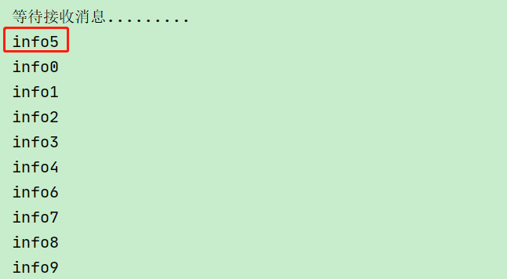


## 3、惰性队列


### 使用场景


RabbitMQ 从 3.6.0 版本开始引入了惰性队列的概念。


惰性队列会尽可能的将消息存入磁盘中，而在消费者消费到相应的消息时才会被加载到内存中，它的一个重要的设计目标是能够支持更长的队列，即支持更多的消息存储。


当消费者由于各种各样的原因(比如消费者下线、宕机亦或者是由于维护而关闭等)而致使长时间内不能消费消息造成堆积时，惰性队列就很有必要了。


默认情况下，当生产者将消息发送到 RabbitMQ 的时候，队列中的消息会尽可能的存储在内存之中， 这样可以更加快速的将消息发送给消费者。


即使是持久化的消息，在被写入磁盘的同时也会在内存中驻留一份备份。


当RabbitMQ 需要释放内存的时候，会将内存中的消息换页至磁盘中，这个操作会耗费较长的时间，也会阻塞队列的操作，进而无法接收新的消息。


虽然 RabbitMQ 的开发者们一直在升级相关的算法， 但是效果始终不太理想，尤其是在消息量特别大的时候。


### 两种模式


队列具备两种模式：default 和 lazy。


默认的为default 模式，在3.6.0 之前的版本无需做任何变更。


lazy 模式即为惰性队列的模式，

+ 可以通过调用 channel.queueDeclare 方法的时候在参数中设置，
+ 也可以通过 Policy 的方式设置，

如果一个队列同时使用这两种方式设置的话，那么 Policy 的方式具备更高的优先级。


如果要通过声明的方式改变已有队列的模式的话，那么只能先删除队列，然后再重新声明一个新的。


在队列声明的时候可以通过“x-queue-mode”参数来设置队列的模式，取值为“default”和“lazy”。


下面示例中演示了一个惰性队列的声明细节：


```java
Map<String, Object> args = new HashMap<String, Object>();
args.put("x-queue-mode", "lazy");
channel.queueDeclare("myqueue", false, false, false, args);
```


### 内存开销对比


在发送 1 百万条消息，每条消息大概占 1KB 的情况下，普通队列占用内存是 1.2GB，而惰性队列仅仅 占用 1.5MB


# 十二、RabbitMQ集群


## 1、clustering


### 使用集群的原因


最开始我们介绍了如何安装及运行RabbitMQ服务，不过这些是单机版的，无法满足目前真实应用的要求。


如果RabbitMQ服务器遇到内存崩溃、机器掉电或者主板故障等情况，该怎么办？


单台RabbitMQ服务器可以满足每秒1000条消息的吞吐量，那么如果应用需要RabbitMQ服务满足每秒10万条消息的吞吐量呢？


购买昂贵的服务器来增强单机RabbitMQ务的性能显得捉襟见肘，搭建一个RabbitMQ集群才是解决实际问题的关键.


### 搭建步骤


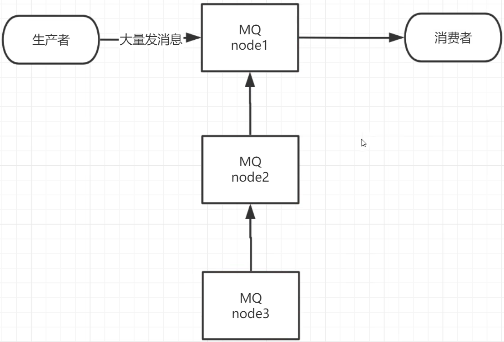


1. <font style="color:rgb(0,0,0);">修改 3 台机器的主机名称 </font>

```java
vim /etc/hostname
```

2. <font style="color:rgb(0,0,0);">配置各个节点的 hosts 文件，让各个节点都能互相识别对方 </font>

```java
vim /etc/hosts 

10.211.55.74 node1 
10.211.55.75 node2 
10.211.55.76 node3
```

3. <font style="color:rgb(0,0,0);">以确保各个节点的 cookie 文件使用的是同一个值，在 </font><font style="color:#E8323C;">node1</font><font style="color:rgb(0,0,0);"> 上执行远程操作命令</font>

```java
scp /var/lib/rabbitmq/.erlang.cookie root@node2:/var/lib/rabbitmq/.erlang.cookie

scp /var/lib/rabbitmq/.erlang.cookie root@node3:/var/lib/rabbitmq/.erlang.cookie
```

4. <font style="color:rgb(0,0,0);">启动 RabbitMQ 服务，顺带启动 Erlang 虚拟机和 RbbitMQ 应用服务(在三台节点上分别执行以下命令) </font>

```java
rabbitmq-server -detached 
```

5. <font style="color:rgb(0,0,0);">在节点 2 执行 </font>

```java
rabbitmqctl stop_app 
(rabbitmqctl stop 会将Erlang 虚拟机关闭，rabbitmqctl stop_app 只关闭 RabbitMQ 服务) 
rabbitmqctl reset 
rabbitmqctl join_cluster rabbit@node1 
rabbitmqctl start_app(只启动应用服务)
```

6. <font style="color:rgb(0,0,0);">在节点 3 执行</font>

```java
rabbitmqctl stop_app
rabbitmqctl reset
rabbitmqctl join_cluster rabbit@node2
rabbitmqctl start_app
```

7. <font style="color:rgb(0,0,0);">集群状态 </font>

```java
rabbitmqctl cluster_status
```

8. <font style="color:rgb(0,0,0);">需要重新设置用户 </font>

```java
创建账号 
rabbitmqctl add_user admin 123 
    
设置用户角色 
rabbitmqctl set_user_tags admin administrator 

设置用户权限 
rabbitmqctl set_permissions -p "/" admin ".*" ".*" ".*" 
```

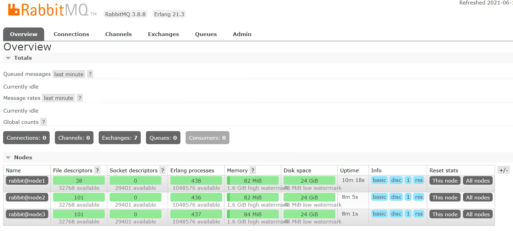


9. <font style="color:rgb(0,0,0);">解除集群节点(node2 和 node3 机器分别执行) </font>

```java
rabbitmqctl stop_app 
rabbitmqctl reset 
rabbitmqctl start_app 
rabbitmqctl cluster_status 

rabbitmqctl forget_cluster_node rabbit@node2(node1 机器上执行)
```

## 2、镜像队列


### <font style="color:rgb(0,0,0);">使用镜像的原因</font>


<font style="color:rgb(0,0,0);">如果 RabbitMQ 集群中只有一个 Broker 节点，那么该节点的失效将导致整体服务的临时性不可用，并且也可能会导致消息的丢失。</font>

<font style="color:rgb(0,0,0);">可以将所有消息都设置为持久化，并且对应队列的durable属性也设置为true，但是这样仍然无法避免由于缓存导致的问题：因为消息在发送之后和被写入磁盘井执行刷盘动作之间存在一个短暂却会产生问题的时间窗。通过 publisherconfirm 机制能够确保客户端知道哪些消息己经存入磁盘，尽管如此，一般不希望遇到因单点故障导致的服务不可用。</font>

<font style="color:rgb(0,0,0);"></font>

<font style="color:rgb(0,0,0);">引入镜像队列(Mirror Queue)的机制，可以将队列镜像到集群中的其他 Broker 节点之上，如果集群中的一个节点失效了，队列能自动地切换到镜像中的另一个节点上以保证服务的可用性。</font>

<font style="color:rgb(0,0,0);"></font>

### <font style="color:rgb(0,0,0);">搭建步骤</font>


1. <font style="color:rgb(0,0,0);">启动三台集群节点 </font>

<font style="color:rgb(0,0,0);"></font>

2. <font style="color:rgb(0,0,0);">随便找一个节点添加 policy</font>

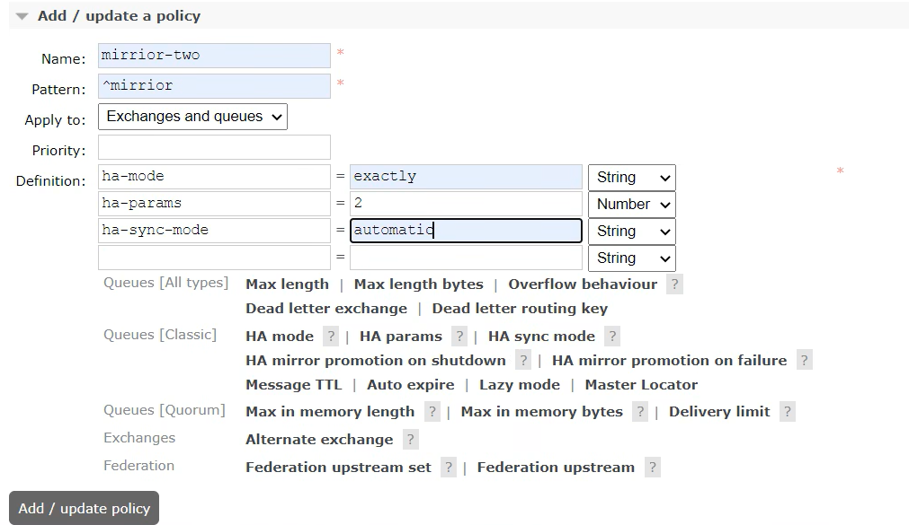


3. <font style="color:rgb(0,0,0);">在 node1 上创建一个队列发送一条消息，队列存在镜像队列</font>


4. <font style="color:rgb(0,0,0);">停掉 node1 之后发现 node2 成为镜像队列</font>

```java
rabbitmqctl stop_app 
```

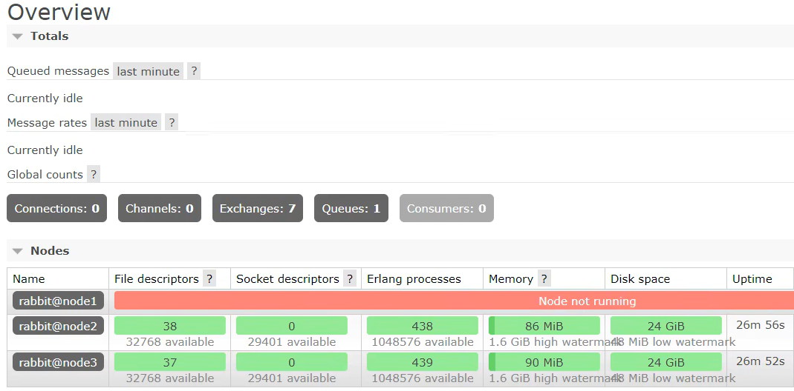


5. <font style="color:rgb(0,0,0);">就算整个集群只剩下一台机器了 依然能消费队列里面的消息 </font>

<font style="color:rgb(0,0,0);">说明队列里面的消息被镜像队列传递到相应机器里面了</font>

<font style="color:rgb(0,0,0);"></font>

<font style="color:rgb(0,0,0);"></font>

## <font style="color:rgb(0,0,0);">3、Haproxy+Keepalive 实现高可用负载均衡</font>


### <font style="color:rgb(0,0,0);">整体架构图</font>


### <font style="color:rgb(0,0,0);">Haproxy 实现负载均衡</font>


<font style="color:rgb(0,0,0);">HAProxy 提供高可用性、负载均衡及基于TCPHTTP 应用的代理，支持虚拟主机，它是免费、快速并且可靠的一种解决方案，包括 Twitter,Reddit,StackOverflow,GitHub 在内的多家知名互联网公司在使用。 </font>

<font style="color:rgb(0,0,0);"></font>

<font style="color:rgb(0,0,0);">HAProxy </font><font style="color:rgb(0,0,0);">实现了一种事件驱动、单一进程模型，此模型支持非常大的井发连接数。 </font>

<font style="color:rgb(0,0,0);"></font>

<font style="color:rgb(0,0,0);">扩展 nginx,lvs,haproxy 之间的区别: </font>[http://www.ha97.com/5646.html](http://www.ha97.com/5646.html)


### <font style="color:rgb(0,0,0);">搭建步骤</font>


1. <font style="color:rgb(0,0,0);">下载 haproxy(在 node1 和 node2) </font>

```java
yum -y install haproxy 
```

2. <font style="color:rgb(0,0,0);">修改 node1 和 node2 的 haproxy.cfg</font>

```java
vim /etc/haproxy/haproxy.cfg
```

<font style="color:rgb(0,0,0);">需要修改红色 IP 为当前机器 IP</font>


3. <font style="color:rgb(0,0,0);">在两台节点启动 haproxy </font>

```java
haproxy -f /etc/haproxy/haproxy.cfg 
ps -ef | grep haproxy 
```

4. <font style="color:rgb(0,0,0);">访问地址 </font>

```java
http://10.211.55.71:8888/stats
```

### <font style="color:rgb(0,0,0);">Keepalived 实现双机(主备)热备</font>


<font style="color:rgb(0,0,0);">试想如果前面配置的 HAProxy 主机突然宕机或者网卡失效，那么虽然 RbbitMQ 集群没有任何故障，但是对于外界的客户端来说所有的连接都会被断开，结果将是灾难性的。为了确保负载均衡服务的可靠性同样显得十分重要，这里就要引入 Keepalived 它能够通过自身健康检查、资源接管功能做高可用(双机热备)，实现故障转移。</font>

<font style="color:rgb(0,0,0);"></font>

### <font style="color:rgb(0,0,0);">搭建步骤</font>


1. <font style="color:rgb(0,0,0);">下载 keepalived </font>

```java
yum -y install keepalived 
```

2. <font style="color:rgb(0,0,0);">节点 node1 配置文件 </font>

```java
vim /etc/keepalived/keepalived.conf 
把资料里面的 keepalived.conf 修改之后替换 
```

3. <font style="color:rgb(0,0,0);">节点 node2 配置文件 </font>

```java
需要修改global_defs 的 router_id,如:nodeB 
其次要修改 vrrp_instance_VI 中 state 为"BACKUP"； 
最后要将priority 设置为小于 100 的值 
```

4. <font style="color:rgb(0,0,0);">添加 haproxy_chk.sh</font>

<font style="color:rgb(0,0,0);">(为了防止 HAProxy 服务挂掉之后 Keepalived 还在正常工作而没有切换到 Backup 上，所以这里需要编写一个脚本来检测 HAProxy 务的状态，当 HAProxy 服务挂掉之后该脚本会自动重启 HAProxy 的服务，如果不成功则关闭 Keepalived 服务，这样便可以切换到 Backup 继续工作)</font>

```java
vim /etc/keepalived/haproxy_chk.sh(可以直接上传文件)
    

chmod 777 /etc/keepalived/haproxy_chk.sh	修改权限 
```

5. <font style="color:rgb(0,0,0);">启动 keepalive 命令(node1 和 node2 启动) </font>

```java
systemctl start keepalived 
```

<font style="color:rgb(0,0,0);">6. </font><font style="color:rgb(0,0,0);">观察 </font><font style="color:rgb(0,0,0);">Keepalived </font><font style="color:rgb(0,0,0);">的日志 </font>

```java
tail -f /var/log/messages -n 200 
```

7. <font style="color:rgb(0,0,0);">观察最新添加的 vip </font>

```java
ip add show 
```

8. <font style="color:rgb(0,0,0);">node1 模拟 keepalived 关闭状态 </font>

```java
systemctl stop keepalived 
```

9. <font style="color:rgb(0,0,0);">使用 vip 地址来访问 rabbitmq 集群</font>

<font style="color:rgb(0,0,0);"></font>

## <font style="color:rgb(0,0,0);">4、Federation Exchange</font>


### <font style="color:rgb(0,0,0);">使用它的原因</font>


<font style="color:rgb(0,0,0);">(broker 北京)，(broker 深圳)彼此之间相距甚远，网络延迟是一个不得不面对的问题。有一个在北京的业务(Client 北京) 需要连接(broker 北京)，向其中的交换器 exchangeA 发送消息，此时的网络延迟很小， (Client 北京)可以迅速将消息发送至 exchangeA 中，就算在开启了 publisherconfirm 机制或者事务机制的情况下，也可以迅速收到确认信息。</font>

<font style="color:rgb(0,0,0);">此时又有个在深圳的业务(Client 深圳)需要向 exchangeA 发送消息， 那么(Client 深圳) (broker 北京)之间有很大的网络延迟，(Client 深圳) 将发送消息至 exchangeA 会经历一定 </font>

<font style="color:rgb(0,0,0);">的延迟，尤其是在开启了 publisherconfirm 机制或者事务机制的情况下，(Client 深圳) 会等待很长的延迟时间来接收(broker 北京)的确认信息，进而必然造成这条发送线程的性能降低，甚至造成一定程度上的阻塞。 </font>

<font style="color:rgb(0,0,0);">将业务(Client 深圳)部署到北京的机房可以解决这个问题，但是如果(Client 深圳)调用的另些服务都部署在深圳，那么又会引发新的时延问题，总不见得将所有业务全部部署在一个机房，那么容灾又何以实现？ 这里使用 Federation 插件就可以很好地解决这个问题.</font>

<font style="color:rgb(0,0,0);"></font>


### 搭建步骤


1. <font style="color:rgb(0,0,0);">需要保证每台节点单独运行 </font>
2. <font style="color:rgb(0,0,0);">在每台机器上开启 federation 相关插件 </font>

```java
rabbitmq-plugins enable rabbitmq_federation 

rabbitmq-plugins enable rabbitmq_federation_management
```

3. <font style="color:rgb(0,0,0);">原理图(先运行 consumer 在 node2 创建 fed_exchange)</font>

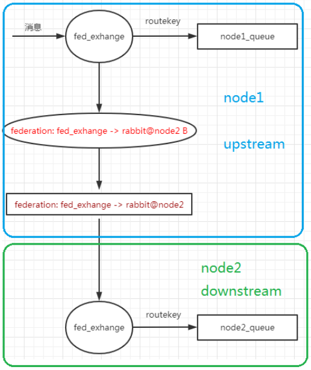

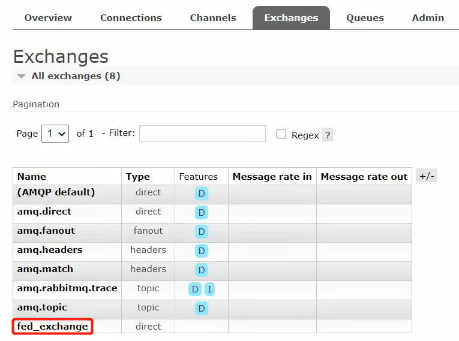


4. <font style="color:rgb(0,0,0);">在 downstream(node2)配置 upstream(node1)</font>


5. <font style="color:rgb(0,0,0);">添加 policy</font>

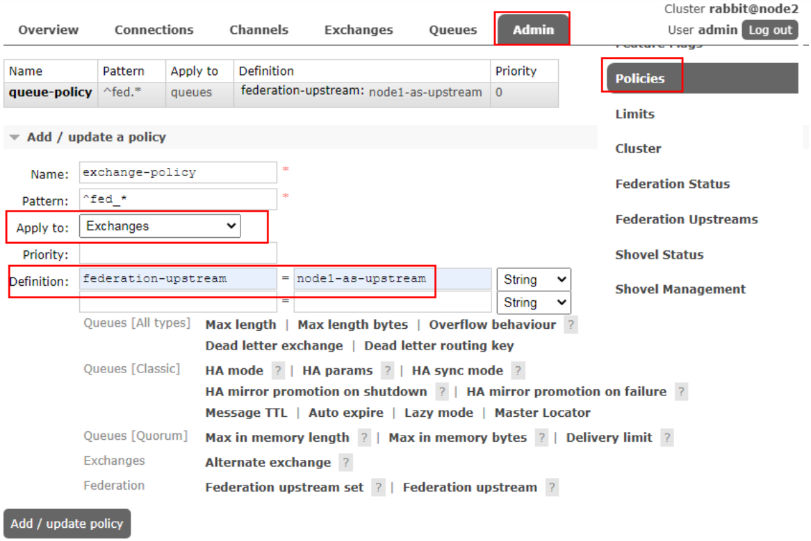


6. <font style="color:rgb(0,0,0);">成功的前提</font>


## <font style="color:rgb(0,0,0);">5、Federation Queue</font>


### <font style="color:rgb(0,0,0);">使用它的原因</font>
**<font style="color:rgb(0,0,0);"></font>**

<font style="color:rgb(0,0,0);">联邦队列可以在多个 </font><font style="color:rgb(0,0,0);">Broker </font><font style="color:rgb(0,0,0);">节点</font><font style="color:rgb(0,0,0);">(</font><font style="color:rgb(0,0,0);">或者集群</font><font style="color:rgb(0,0,0);">)</font><font style="color:rgb(0,0,0);">之间为单个队列提供均衡负载的功能。</font>

<font style="color:rgb(0,0,0);">一个联邦队列可以连接一个或者多个上游队列(upstream queue)，并从这些上游队列中获取消息以满足本地消费者消费消息的需求。</font>

<font style="color:rgb(0,0,0);"></font>

### <font style="color:rgb(0,0,0);">搭建步骤</font>


1. 原理图


2. <font style="color:rgb(0,0,0);">添加 upstream(同上)</font>

<font style="color:rgb(0,0,0);"></font>

3. <font style="color:rgb(0,0,0);">添加 policy</font>

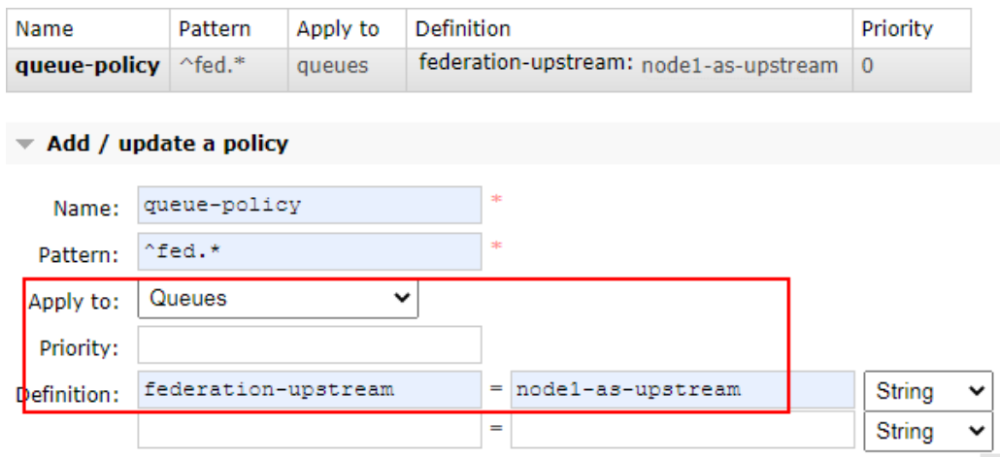


## <font style="color:rgb(0,0,0);">6、Shovel</font>


### <font style="color:rgb(0,0,0);">使用它的原因</font>
**<font style="color:rgb(0,0,0);"></font>**

<font style="color:rgb(0,0,0);">Federation 具备的数据转发功能类似，Shovel 够可靠、持续地从一个 Broker 中的队列(作为源端，即source)拉取数据并转发至另一个 Broker 中的交换器(作为目的端，即 destination)。</font>

<font style="color:rgb(0,0,0);">作为源端的队列和作为目的端的交换器可以同时位于同一个 Broker，也可以位于不同的Broker上。</font>

<font style="color:rgb(0,0,0);">Shovel 可以翻译为"铲子"，是一种比较形象的比喻，这个"铲子"可以将消息从一方"铲子"另一方。Shovel 行为就像优秀的客户端应用程序能够负责连接源和目的地、负责消息的读写及负责连接失败问题的处理。</font>

<font style="color:rgb(0,0,0);"></font>

### <font style="color:rgb(0,0,0);">搭建步骤</font>


1. <font style="color:rgb(0,0,0);">开启插件(需要的机器都开启) </font>

```java
rabbitmq-plugins enable rabbitmq_shovel 

rabbitmq-plugins enable rabbitmq_shovel_management
```

2. <font style="color:rgb(0,0,0);">原理图(在源头发送的消息直接回进入到目的地队列)</font>

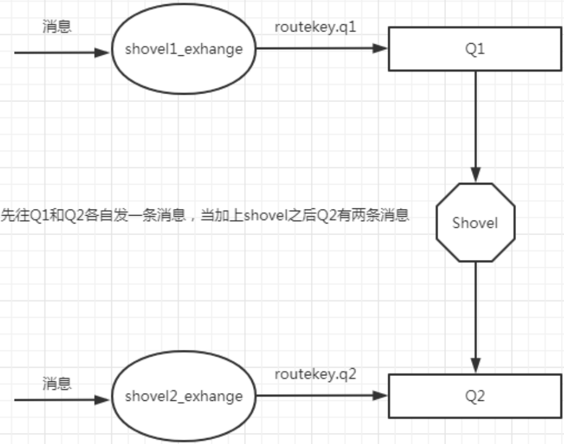


3. <font style="color:rgb(0,0,0);">添加 shovel 源和目的地</font>

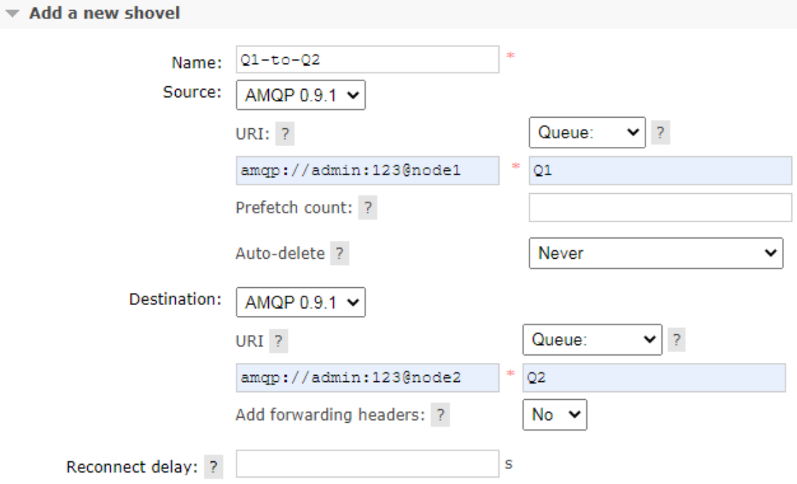


> 更新: 2023-08-25 15:44:57  
> 原文: <https://www.yuque.com/like321/wzux58/gz9kza>