# 第01章_Linux下MySQL的安装与使用

# 1. 安装前说明


## 1.1 Linux系统及工具的准备


+  安装并启动好两台虚拟机： **CentOS 7 **
    -  掌握克隆虚拟机的操作 
        *  mac地址 
        *  主机名 
        *  ip地址 
        *  UUID 
+  安装有**Xshell**和**Xftp**等访问CentOS系统的工具 
+  CentOS6和CentOS7在MySQL的使用中的区别 

```sql
1. 防火墙：6是iptables，7是firewalld

2. 启动服务的命令：6是service，7是systemctl
```

 


## 1.2 查看是否安装过MySQL


+  如果你是用rpm安装, 检查一下RPM PACKAGE： 

```shell
rpm -qa | grep -i mysql  # -i 忽略大小写
```

 

+  检查mysql service： 

```shell
systemctl status mysqld.service
```

 

+  如果存在mysql-libs的旧版本包，显示如下：  
 
+  如果不存在mysql-lib的版本，显示如下： 


## 1.3 MySQL的卸载


**1. 关闭 mysql 服务**


```sql
systemctl stop mysqld.service
```


**2. 查看当前 mysql 安装状况**


```sql
rpm -qa | grep -i mysql

# 或

yum list installed | grep mysql
```


**3. 卸载上述命令查询出的已安装程序**


```sql
yum remove mysql-xxx mysql-xxx mysql-xxx mysqk-xxxx
```


务必卸载干净，反复执行**rpm -qa | grep -i mysql**确认是否有卸载残留


**4. 删除 mysql 相关文件**


+  查找相关文件 

```sql
find / -name mysql
```

 

+  删除上述命令查找出的相关文件 

```sql
rm -rf xxx
```

 


**5. 删除 my.cnf**


```sql
rm -rf /etc/my.cnf
```


# 2. MySQL的Linux版安装


## 2.1 MySQL的4大版本


>  
>
> + MySQL Community Server 社区版本，开源免费，自由下载，但不提供官方技术支持，适用于大多数普通用户。
> + MySQL Enterprise Edition 企业版本，需付费，不能在线下载，可以试用30天。提供了更多的功能和更完备的技术支持，更适合于对数据库的功能和可靠性要求较高的企业客户。
> + MySQL Cluster 集群版，开源免费。用于架设集群服务器，可将几个MySQL Server封装成一个Server。需要在社区版或企业版的基础上使用。
> + MySQL Cluster CGE 高级集群版，需付费。
>
>  
>


+  截止目前，官方最新版本为** 8.0.27** 。此前，8.0.0 在 2016.9.12日就发布了。 
+  本课程中主要使用 **8.0.25**版本 。同时为了更好的说明MySQL8.0新特性，还会安装 **MySQL5.7** 版本，作为对比。 


此外，官方还提供了**MySQL Workbench**（GUITOOL）一款专为MySQL设计的**ER/数据库建模工具**。它是著名的数据库设计工具DBDesigner4的继任者。MySQLWorkbench又分为两个版本，分别是**社区版**（MySQL Workbench OSS）、**商用版**（MySQL WorkbenchSE）。


## 2.2 下载MySQL指定版本


**1. 下载地址**


官网： [**https://www.mysql.com**](https://www.mysql.com/)


**2. 打开官网，点击DOWNLOADS**


然后，点击**MySQL Community(GPL) Downloads**


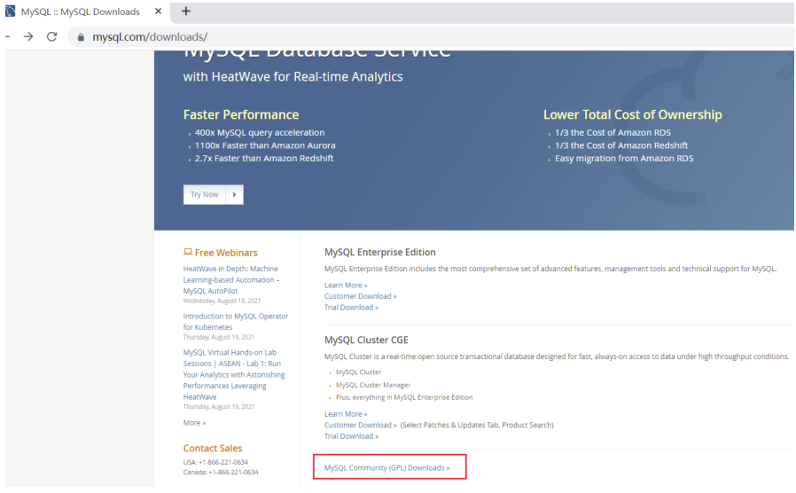


**3. 点击 MySQL Community Server**


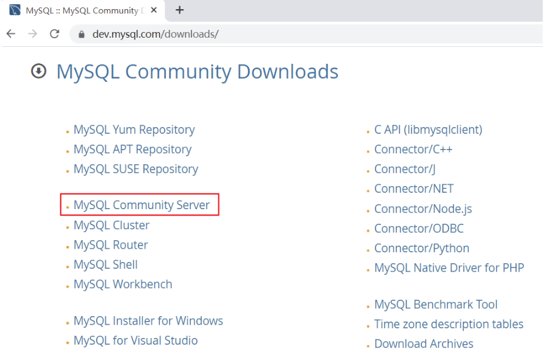


**4. 在General Availability(GA) Releases中选择适合的版本**


+  如果安装Windows 系统下MySQL ，推荐下载 **MSI安装程序** ；点击 **Go to Download Page** 进行下载即可  
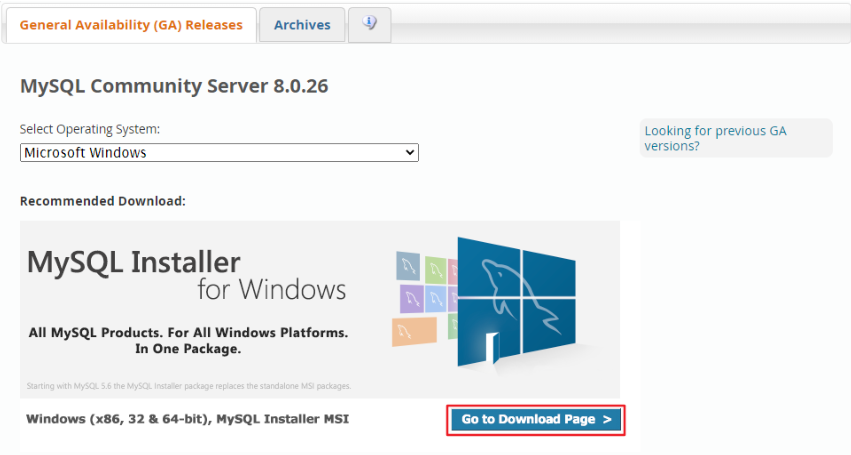 
+  Windows下的MySQL安装有两种安装程序 
    - mysql-installer-web-community-8.0.25.0.msi 下载程序大小：2.4M；安装时需要联网安装组件。
    - mysql-installer-community-8.0.25.0.msi 下载程序大小：435.7M；安装时离线安装即可。**推荐。**


**5. Linux系统下安装MySQL的几种方式**


**5.1 Linux系统下安装软件的常用三种方式：**


**方式1：rpm命令**


使用rpm命令安装扩展名为".rpm"的软件包。


.rpm包的一般格式：


**方式2：yum命令**


需联网，从 **互联网获取** 的yum源，直接使用yum命令安装。


**方式3：编译安装源码包**


针对**tar.gz **这样的压缩格式，要用tar命令来解压；如果是其它压缩格式，就使用其它命令。


**5.2 Linux系统下安装MySQL，官方给出多种安装方式**

| 安装方式 | 特点 |
| --- | --- |
| rpm | 安装简单，灵活性差，无法灵活选择版本、升级 |
| yum repository | 安装包极小，版本安装简单灵活，升级方便，需要联网安装 |
| 通用二进制包 | 安装比较复杂，灵活性高，平台通用性好 |
| 源码包 | 安装最复杂，时间长，参数设置灵活，性能好 |


+  这里不能直接选择CentOS 7系统的版本，所以选择与之对应的 **Red Hat Enterprise Linux **
+  [https://downloads.mysql.com/archives/community/](https://downloads.mysql.com/archives/community/) 直接点Download下载RPM Bundle全量包。包括了所有下面的组件。不需要一个一个下载了。 


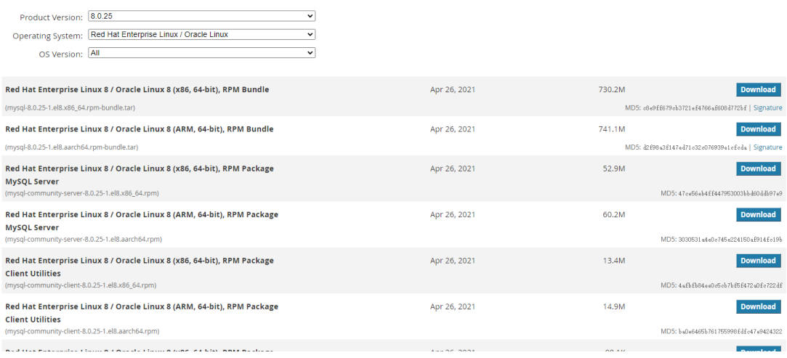


**6. 下载的tar包，用压缩工具打开**


	


+ 解压后rpm安装包 （红框为抽取出来的安装包）


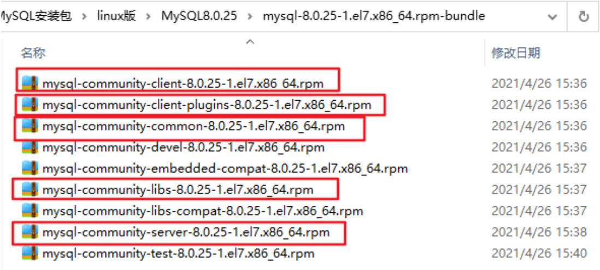


## 2.3 CentOS7下检查MySQL依赖


### 1. 检查/tmp临时目录权限（必不可少）


由于mysql安装过程中，会通过mysql用户在/tmp目录下新建tmp_db文件，所以请给/tmp较大的权限。执 行 ：


```sql
chmod -R 777 /tmp
```


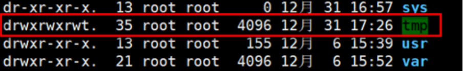


### 2. 安装前，检查依赖


```sql
rpm -qa|grep libaio
```


+  如果存在libaio包如下：  
 

```sql
rpm -qa|grep net-tools
```

 

+  如果存在net-tools包如下：  
 

```sql
rpm -qa|grep net-tools
```

 

+  如果不存在需要到centos安装盘里进行rpm安装。安装linux如果带图形化界面，这些都是安装好的。 


## 2.4 CentOS7下MySQL安装过程


### 1. 将安装程序拷贝到/opt目录下


在mysql的安装文件目录下执行：（必须按照顺序执行）


```sql
rpm -ivh mysql-community-common-8.0.25-1.el7.x86_64.rpm

rpm -ivh mysql-community-client-plugins-8.0.25-1.el7.x86_64.rpm

rpm -ivh mysql-community-libs-8.0.25-1.el7.x86_64.rpm

rpm -ivh mysql-community-client-8.0.25-1.el7.x86_64.rpm

rpm -ivh mysql-community-server-8.0.25-1.el7.x86_64.rpm
```


+  注意: 如在检查工作时，没有检查mysql依赖环境在安装mysql-community-server会报错 
+  **rpm** 是Redhat Package Manage缩写，通过RPM的管理，用户可以把源代码包装成以rpm为扩展名的文件形式，易于安装。 
+  **-i** , --install 安装软件包 
+  **-v** , --verbose 提供更多的详细信息输出 
+  **-h** , --hash 软件包安装的时候列出哈希标记 (和 -v 一起使用效果更好)，展示进度条 


### 安装过程截图


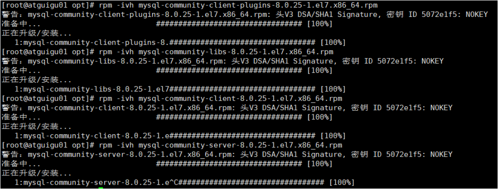


安装过程中可能的报错信息：


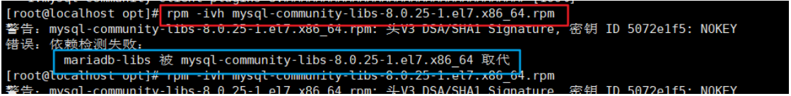


> 一个命令：**yum remove mysql-libs **解决，清除之前安装过的依赖即可
>


### 3. 查看MySQL版本


执行如下命令，如果成功表示安装mysql成功。类似java -version如果打出版本等信息


```sql
mysql --version
#或
mysqladmin --version
```


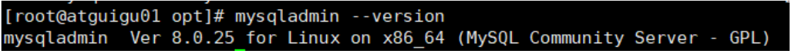


执行如下命令，查看是否安装成功。需要增加 -i 不用去区分大小写，否则搜索不到。


```sql
rpm -qa|grep -i mysql
```


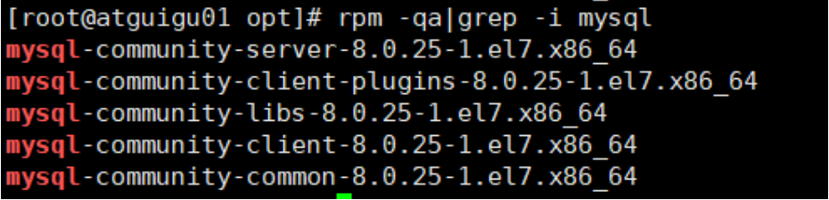


### 4. 服务的初始化


为了保证数据库目录与文件的所有者为 mysql 登录用户，如果你是以 root 身份运行 mysql 服务，需要执行下面的命令初始化：


```sql
mysqld --initialize --user=mysql
```


说明： --initialize 选项默认以"安全"模式来初始化，则会为 root 用户生成一个密码并将**该密码标记为过期**，登录后你需要设置一个新的密码。生成的**临时密码**会往日志中记录一份。


查看密码：


```sql
cat /var/log/mysqld.log
```


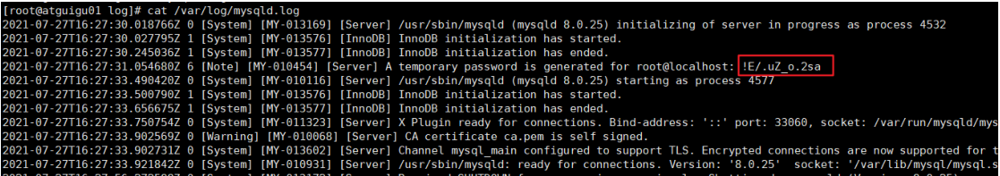


root@localhost: 后面就是初始化的密码


### 5. 启动MySQL，查看状态


```sql
#加不加.service后缀都可以

启动：systemctl start mysqld.service

关闭：systemctl stop mysqld.service

重启：systemctl restart mysqld.service

查看状态：systemctl status mysqld.service
```


> **mysqld**这个可执行文件就代表着**MySQL**服务器程序，运行这个可执行文件就可以直接启动一个服务器进程。
>


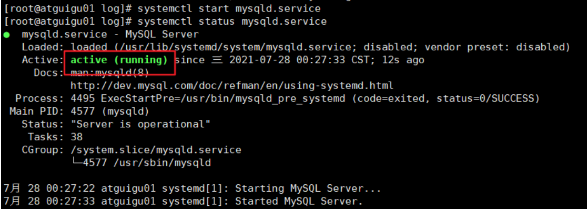


查看进程：


```sql
ps -ef | grep -i mysql
```


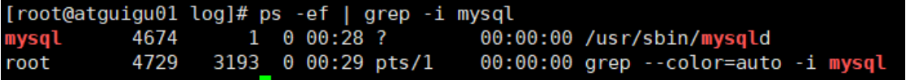


### 6. 查看MySQL服务是否自启动


```sql
systemctl list-unit-files|grep mysqld.service
```


默认是enabled。


+  如不是enabled可以运行如下命令设置自启动 

```sql
systemctl enable mysqld.service
```

  
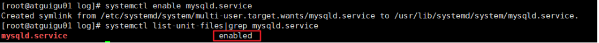 

+  如果希望不进行自启动，运行如下命令设置 

```sql
systemctl disable mysqld.service
```

  
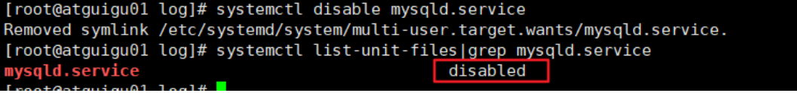 


# 3. MySQL登录


## 3.1 首次登录


通过 **mysql -hlocalhost -P3306 -uroot -p** 进行登录，在Enter password：录入初始化密码


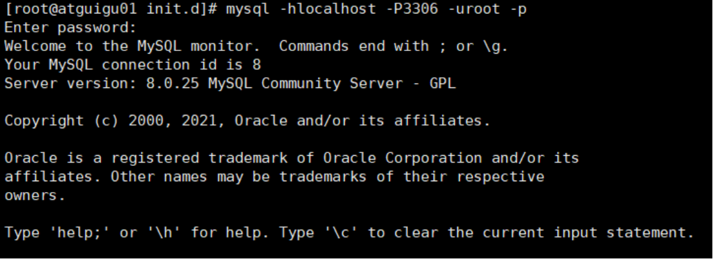


## 3.2 修改密码


+  因为初始化密码默认是过期的，所以查看数据库会报错 
+  修改密码： 

```sql
ALTER USER 'root'@'localhost' IDENTIFIED BY 'new_password';
```

 

+  5.7版本之后（不含5.7），mysql加入了全新的密码安全机制。设置新密码太简单会报错。  
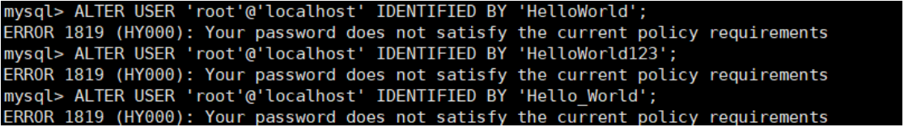 
+  改为更复杂的密码规则之后，设置成功，可以正常使用数据库了  
 


## 3.3 设置远程登录


### 1. 当前问题


在用SQLyog或Navicat中配置远程连接Mysql数据库时遇到如下报错信息，这是由于Mysql配置了不支持远 程连接引起的。


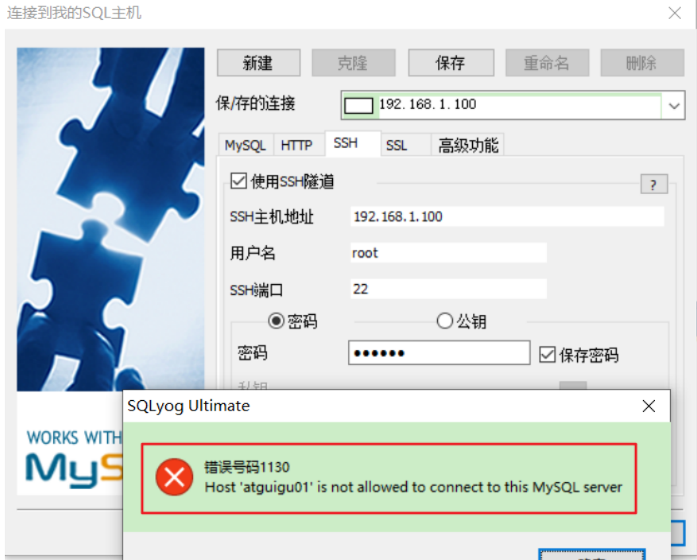


### 2. 确认网络


1.  在远程机器上使用ping ip地址**保证网络畅通** 
2.  在远程机器上使用telnet命令**保证端口号开放**访问 

```sql
telnet ip地址 端口号
```

 


> 拓展： telnet命令开启 :
>


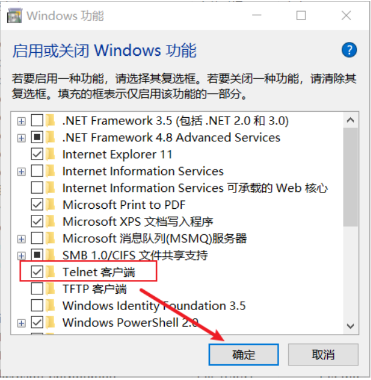


### 3. 关闭防火墙或开放端口


**方式一：关闭防火墙**


+  CentOS6 ： 

```sql
service iptables stop
```

 

+  CentOS7： 

```sql
systemctl start firewalld.service

systemctl status firewalld.service

systemctl stop firewalld.service

#设置开机启用防火墙
systemctl enable firewalld.service

#设置开机禁用防火墙
systemctl disable firewalld.service
```

 


**方式二：开放端口**


+  查看开放的端口号 

```sql
firewall-cmd --list-all
```

 

+  设置开放的端口号 

```sql
firewall-cmd --add-service=http --permanent

firewall-cmd --add-port=3306/tcp --permanent
```

 

+  重启防火墙 

```sql
firewall-cmd --reload
```

 


### 4. Linux下修改配置


在Linux系统MySQL下测试：


```sql
use mysql;
select Host,User from user;
```


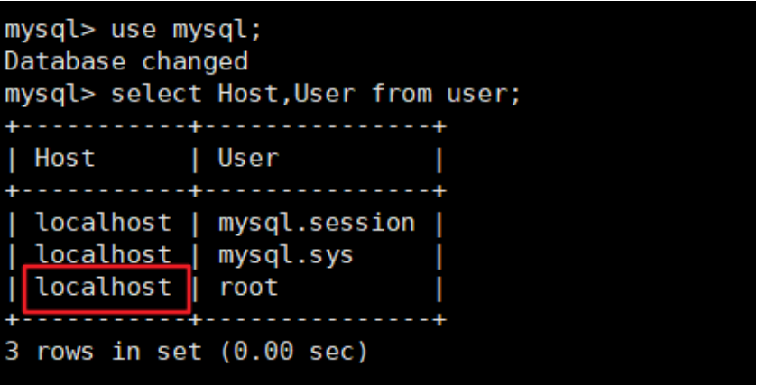


可以看到root用户的当前主机配置信息为localhost。


+  **修改Host为通配符%**  
Host列指定了允许用户登录所使用的IP，比如user=root Host=192.168.1.1。这里的意思就是说root用户只能通过192.168.1.1的客户端去访问。 user=root Host=localhost，表示只能通过本机客户端去访问。而 % 是个 **通配符**，如果Host=192.168.1.%，那么就表示只要是IP地址前缀为"192.168.1."的客户端都可以连接。如果 **Host=%**，表示所有IP都有连接权限。 


注意：在生产环境下不能为了省事将host设置为%，这样做会存在安全问题，具体的设置可以根据生产环境的IP进行设置。


```sql
update user set host = '%' where user ='root';
```


Host设置了"%"后便可以允许远程访问。


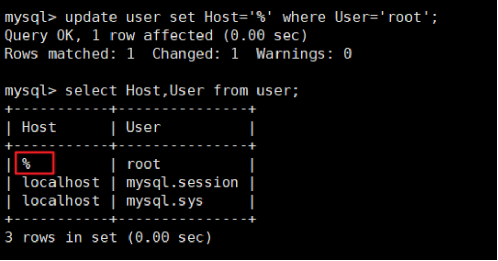


Host修改完成后记得执行flush privileges使配置立即生效：


```sql
flush privileges;
```


### 5. 测试


+ 如果是 MySQL5.7 版本，接下来就可以使用SQLyog或者Navicat成功连接至MySQL了。
+ 如果是 MySQL8 版本，连接时还会出现如下问题：


配置新连接报错：错误号码 2058，分析是 mysql 密码加密方法变了。


**解决方法：**Linux下 mysql -u root -p 登录你的 mysql 数据库，然后 执行这条SQL：


```sql
ALTER USER 'root'@'%' IDENTIFIED WITH mysql_native_password BY 'abc123';
```


然后在重新配置SQLyog的连接，则可连接成功了，OK。


# 4. MySQL8的密码强度评估（了解）


## 4.1 MySQL不同版本设置密码(可能出现)


MySQL5.7中：成功


```sql
mysql> alter user 'root' identified by 'abcd1234';
Query OK, 0 rows affected (0.00 sec)
```


+  MySQL8.0中：失败 

```sql
mysql> alter user 'root' identified by 'abcd1234';  # HelloWorld_123
ERROR 1819 (HY000): Your password does not satisfy the current policy requirements
```

 


## 4.2 MySQL8之前的安全策略


在MySQL 8.0之前，MySQL使用的是validate_password插件检测、验证账号密码强度，保障账号的安全性。


**安装/启用插件方式1：在参数文件my.cnf中添加参数**


```sql
[mysqld]

plugin-load-add=validate_password.so

\#ON/OFF/FORCE/FORCE_PLUS_PERMANENT: 是否使用该插件(及强制/永久强制使用)

validate-password=FORCE_PLUS_PERMANENT
```


> 说明1： plugin library中的validate_password文件名的后缀名根据平台不同有所差异。 对于Unix和Unix-like系统而言，它的文件后缀名是.so，对于Windows系统而言，它的文件后缀名是.dll。
>
>  
>
> 说明2： 修改参数后必须重启MySQL服务才能生效。
>
>  
>
> 说明3： 参数FORCE_PLUS_PERMANENT是为了防止插件在MySQL运行时的时候被卸载。当你卸载插件时就会报错。如下所示。
>


```sql
mysql> SELECT PLUGIN_NAME, PLUGIN_LIBRARY, PLUGIN_STATUS, LOAD_OPTION
 -> FROM INFORMATION_SCHEMA.PLUGINS
 -> WHERE PLUGIN_NAME = 'validate_password';
+-------------------+----------------------+---------------+----------------------+
| PLUGIN_NAME    		| PLUGIN_LIBRARY    	 | PLUGIN_STATUS | LOAD_OPTION     			|
+-------------------+----------------------+---------------+----------------------+
| validate_password | validate_password.so | ACTIVE    		 | FORCE_PLUS_PERMANENT |
+-------------------+----------------------+---------------+----------------------+
1 row in set (0.00 sec)

mysql>  UNINSTALL PLUGIN validate_password;
ERROR 1702 (HY000): Plugin 'validate_password' is force_plus_permanent and can not be
unloaded
mysql>
```


**安装/启用插件方式2：运行时命令安装**（推荐）


```sql
mysql> INSTALL PLUGIN validate_password SONAME 'validate_password.so';
Query OK, 0 rows affected, 1 warning (0.11 sec)
```


此方法也会注册到元数据，也就是mysql.plugin表中，所以不用担心MySQL重启后插件会失效。


## 4.3 MySQL8的安全策略


**1. validate_password说明**


MySQL 8.0，引入了服务器组件（Components）这个特性，validate_password插件已用服务器组件重新实现。8.0.25版本的数据库中，默认自动安装validate_password组件。


**未安装插件前，执行如下两个指令**，执行效果：


```sql
mysql> show variables like 'validate_password%';
Empty set (0.04 sec)

mysql> SELECT * FROM mysql.component;
ERROR 1146 (42S02): Table 'mysql.component' doesn't exist
```


**安装插件后，执行如下两个指令**，执行效果：


```sql
mysql> SELECT * FROM mysql.component;
+--------------+--------------------+------------------------------------+
| component_id | component_group_id | component_urn           					 |
+--------------+--------------------+------------------------------------+
|       1 		 |          1 				| file://component_validate_password |
+--------------+--------------------+------------------------------------+
1 row in set (0.00 sec)
```


```sql
mysql> show variables like 'validate_password%';
+--------------------------------------+--------+
| Variable_name            						 | Value  |
+--------------------------------------+--------+
| validate_password.check_user_name  	 | ON   	|
| validate_password.dictionary_file  	 |    		|
| validate_password.length       			 | 8   		|
| validate_password.mixed_case_count   | 1   		|
| validate_password.number_count    	 | 1   		|
| validate_password.policy       			 | MEDIUM |
| validate_password.special_char_count | 1   		|
+--------------------------------------+--------+
7 rows in set (0.01 sec)
```


关于**validate_password**组件对应的系统变量说明：

| 选项 | 默认值 | 参数描述 |
| --- | --- | --- |
| validate_password_check_user_name | ON | 设置为ON的时候表示能将密码设置成当前用户名。 |
| validate_password_dictionary_file | | 用于检查密码的字典文件的路径名，默认为空 |
| **validate_password_length** | 8 | 密码的最小长度，也就是说密码长度必须大于或等于8 |
| validate_password_mixed_case_count | 1 | 如果密码策略是中等或更强的，validate_password要求密码具有的小写和大写字符的最小数量。对于给定的这个值密码必须有那么多小写字符和那么多大写字符。 |
| validate_password_number_count | 1 | 密码必须包含的数字个数 |
| **validate_password_policy** | MEDIUM | 密码强度检验等级，可以使用数值0、1、2或相应的符号值LOW、MEDIUM、STRONG来指定。 **0/LOW** ：只检查长度。**1/MEDIUM** ：检查长度、数字、大小写、特殊字符。 **2/STRONG** ：检查长度、数字、大小写、特殊字符、字典文件。 |
| validate_password_special_char_count | 1 | 密码必须包含的特殊字符个数 |


> 提示：
>
>  
>
> 组件和插件的默认值可能有所不同。例如，MySQL 5.7. validate_password_check_user_name的默认值为OFF。
>


**2. 修改安全策略**


修改密码验证安全强度


```sql
SET GLOBAL validate_password_policy=LOW;

SET GLOBAL validate_password_policy=MEDIUM;

SET GLOBAL validate_password_policy=STRONG;

SET GLOBAL validate_password_policy=0;  # For LOW

SET GLOBAL validate_password_policy=1;  # For MEDIUM

SET GLOBAL validate_password_policy=2;  # For HIGH

#注意，如果是插件的话,SQL为set global validate_password_policy=LOW
```


> 此外，还可以修改密码中字符的长度
>


```sql
set global validate_password_length=1;
```


**3. 密码强度测试**


如果你创建密码是遇到"Your password does not satisfy the current policy requirements"，可以通过函数组件去检测密码是否满足条件： 0-100。当评估在100时就是说明使用上了最基本的规则：大写+小写+特殊字符+数字组成的8位以上密码


```sql
mysql>  SELECT VALIDATE_PASSWORD_STRENGTH('medium');
+--------------------------------------+
| VALIDATE_PASSWORD_STRENGTH('medium') |
+--------------------------------------+
|                  25 								 |
+--------------------------------------+
1 row in set (0.00 sec)
```


```sql
mysql> SELECT VALIDATE_PASSWORD_STRENGTH('K354*45jKd5');
+-------------------------------------------+
| VALIDATE_PASSWORD_STRENGTH('K354*45jKd5') |
+-------------------------------------------+
|                    100 										|
+-------------------------------------------+
1 row in set (0.00 sec)
```


> 注意：如果没有安装validate_password组件或插件的话，那么这个函数永远都返回0。 关于密码复杂度对应的密码复杂度策略。如下表格所示：
>

| Password Test | Return Value |
| --- | --- |
| Length < 4 | 0 |
| Length ≥ 4 and < validate_password.length | 25 |
| Satisfies policy 1 (LOW) | 50 |
| Satisfies policy 2 (MEDIUM) | 75 |
| Satisfies policy 3 (STRONG) | 100 |


## 4.4 卸载插件、组件(了解)


**卸载插件**


```sql
mysql> UNINSTALL PLUGIN validate_password;
Query OK, 0 rows affected, 1 warning (0.01 sec)
```


**卸载组件**


```sql
mysql> UNINSTALL COMPONENT 'file://component_validate_password';
Query OK, 0 rows affected (0.02 sec)
```


# 5. 字符集的相关操作


## 5.1 修改MySQL5.7字符集


### 1. 修改步骤


在MySQL 8.0版本之前，默认字符集为 **latin1** ，utf8字符集指向的是 **utf8mb3 **。网站开发人员在数据库设计的时候往往会将编码修改为utf8字符集。如果遗忘修改默认的编码，就会出现乱码的问题。从MySQL 8.0开始，数据库的默认编码将改为 **utf8mb4** ，从而避免上述乱码的问题。


**操作1：查看默认使用的字符集**


```sql
show variables like 'character%';
# 或者
show variables like '%char%';
```


+  MySQL8.0中执行：  
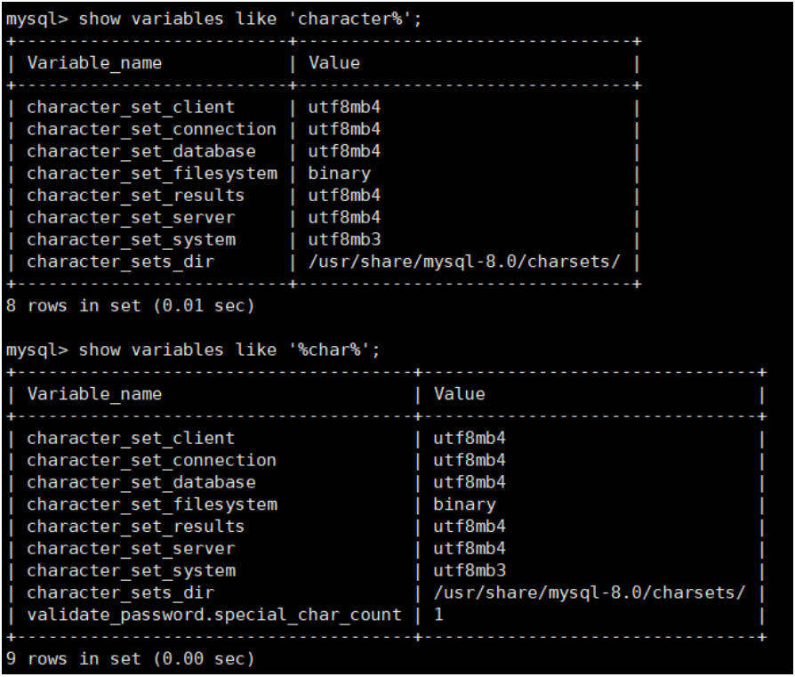 
+  MySQL5.7中执行：  
MySQL 5.7 默认的客户端和服务器都用了 **latin1** ，不支持中文，保存中文会报错。MySQL5.7截图如下：  
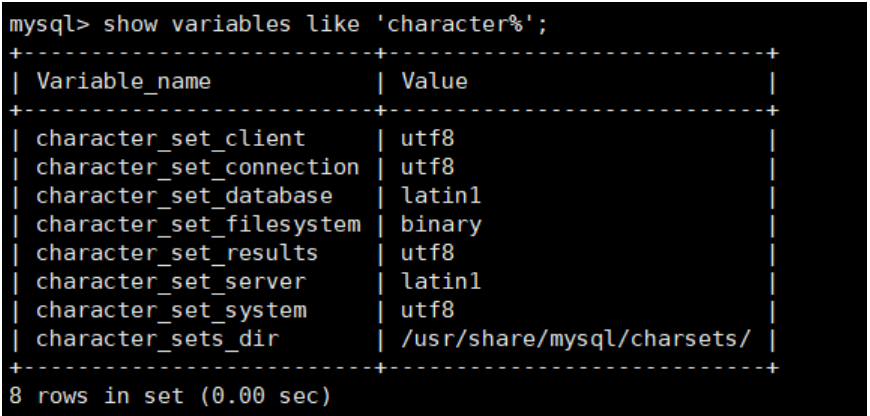  
在MySQL5.7中添加中文数据时，报错：  
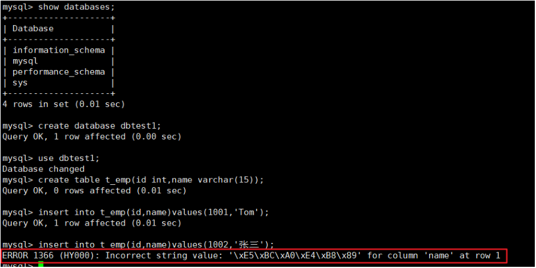  
因为默认情况下，创建表使用的是**latin1** 。如下：  
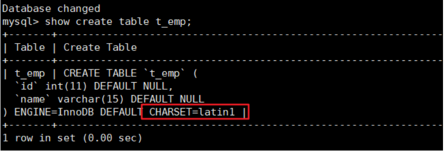 


**操作2：修改字符集**


```sql
vim /etc/my.cnf
```


在MySQL5.7或之前的版本中，在文件最后加上中文字符集配置：


```sql
character_set_server=utf8
```


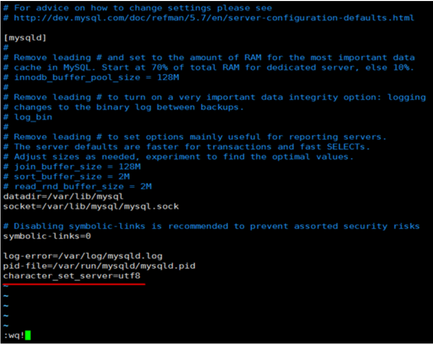


**操作3：重新启动MySQL服务**


```sql
systemctl restart mysqld
```


> 但是原库、原表的设定不会发生变化，参数修改只对新建的数据库生效。
>


### 2. 已有库&表字符集的变更


MySQL5.7版本中，以前创建的库，创建的表字符集还是latin1。


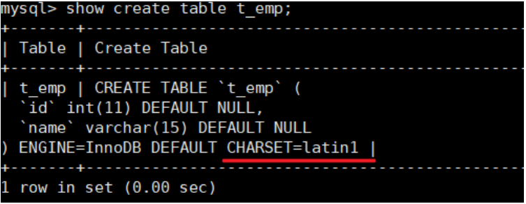


	修改已创建数据库的字符集


```sql
alter database dbtest1 character set 'utf8';
```


修改已创建数据表的字符集


```sql
alter table t_emp convert to character set 'utf8';
```


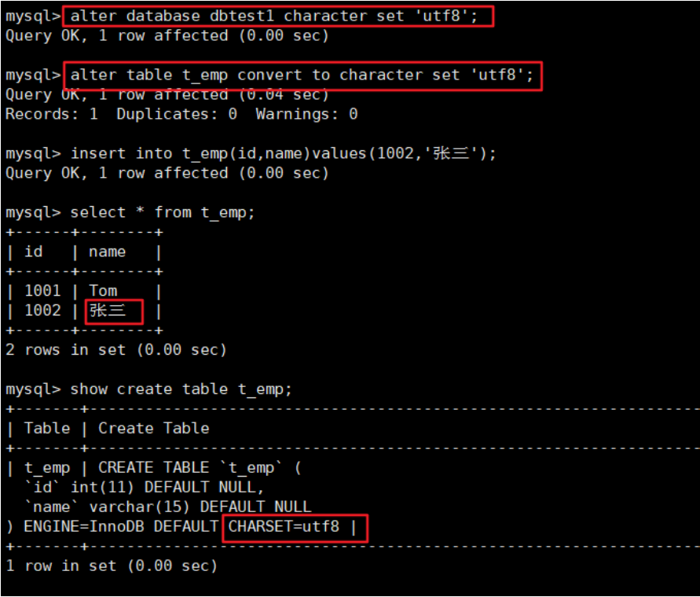


> 注意：但是原有的数据如果是用非'utf8'编码的话，数据本身编码不会发生改变。已有数据需要导出或删除，然后重新插入。
>


## 5.2 各级别的字符集


MySQL有4个级别的字符集和比较规则，分别是：


+  服务器级别 
+  数据库级别 
+  表级别 
+  列级别 


执行如下SQL语句：


```sql
show variables like 'character%';
```


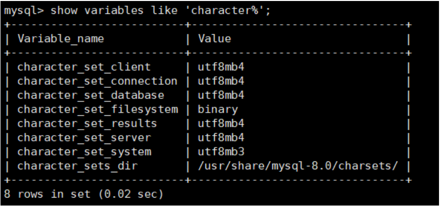


+ character_set_server：服务器级别的字符集
+ character_set_database：当前数据库的字符集
+ character_set_client：服务器解码请求时使用的字符集
+ character_set_connection：服务器处理请求时会把请求字符串从character_set_client转为character_set_connection
+ character_set_results：服务器向客户端返回数据时使用的字符集


### 1. 服务器级别


**character_set_server **：服务器级别的字符集。


我们可以在启动服务器程序时通过启动选项或者在服务器程序运行过程中使用**SET**语句修改这两个变量的值。比如我们可以在配置文件中这样写：


```sql
[server]
character_set_server=gbk  # 默认字符集
collation_server=gbk_chinese_ci  #对应的默认的比较规则
```


当服务器启动的时候读取这个配置文件后这两个系统变量的值便修改了。


### 2. 数据库级别


+ **character_set_database** ：当前数据库的字符集


我们在创建和修改数据库的时候可以指定该数据库的字符集和比较规则，具体语法如下：


```sql
CREATE DATABASE 数据库名
 [[DEFAULT] CHARACTER SET 字符集名称]
 [[DEFAULT] COLLATE 比较规则名称];
 
ALTER DATABASE 数据库名
 [[DEFAULT] CHARACTER SET 字符集名称]
 [[DEFAULT] COLLATE 比较规则名称];
```


### 3. 表级别


我们也可以在创建和修改表的时候指定表的字符集和比较规则，语法如下：


```sql
CREATE TABLE 表名 (列的信息)
 [[DEFAULT] CHARACTER SET 字符集名称]
 [COLLATE 比较规则名称]]

ALTER TABLE 表名
 [[DEFAULT] CHARACTER SET 字符集名称]
 [COLLATE 比较规则名称]
```


**如果创建和修改表的语句中没有指明字符集和比较规则，将使用该表所在数据库的字符集和比较规则作 为该表的字符集和比较规则。**


### 4. 列级别


对于存储字符串的列，同一个表中的不同的列也可以有不同的字符集和比较规则。我们在创建和修改列 定义的时候可以指定该列的字符集和比较规则，语法如下：


```sql
CREATE TABLE 表名(
 列名 字符串类型 [CHARACTER SET 字符集名称] [COLLATE 比较规则名称],
 其他列...
);

ALTER TABLE 表名 MODIFY 列名 字符串类型 [CHARACTER SET 字符集名称] [COLLATE 比较规则名称];
```


**对于某个列来说，如果在创建和修改的语句中没有指明字符集和比较规则，将使用该列所在表的字符集 和比较规则作为该列的字符集和比较规则。**


> 提示
>
>  
>
> 在转换列的字符集时需要注意，如果转换前列中存储的数据不能用转换后的字符集进行表示会发生错误。比方说原先列使用的字符集是utf8，列中存储了一些汉字，现在把列的字符集转换为ascii的话就会出错，因为ascii字符集并不能表示汉字字符。
>


### 5. 小结


我们介绍的这4个级别字符集和比较规则的联系如下：


+  如果 **创建或修改列** 时没有显式的指定字符集和比较规则，则该列 **默认用表的** 字符集和比较规则 
+  如果 **创建表时** 没有显式的指定字符集和比较规则，则该表 **默认用数据库的** 字符集和比较规则 
+  如果 **创建数据库时** 没有显式的指定字符集和比较规则，则该数据库 **默认用服务器的** 字符集和比较规则 


知道了这些规则之后，对于给定的表，我们应该知道它的各个列的字符集和比较规则是什么，从而根据 这个列的类型来确定存储数据时每个列的实际数据占用的存储空间大小了。比方说我们向表 **t** 中插入一条记录：


```sql
mysql> INSERT INTO t(col) VALUES('我们');
Query OK, 1 row affected (0.00 sec)

mysql> SELECT * FROM t;
+--------+
| s   	 |
+--------+
| 我们   |
+--------+
1 row in set (0.00 sec)
```


首先列 **col** 使用的字符集是 **gbk**，一个字符 '**我**' 在 **gbk** 中的编码为 **0xCED2** ，占用两个字节，两个字符的实际数据就占用4个字节。如果把该列的字符集修改为 **utf8 **的话，这两个字符就实际占用6个字节


## 5.3 字符集与比较规则(了解)


### 1. utf8 与 utf8mb4


**utf8** 字符集表示一个字符需要使用1～4个字节，但是我们常用的一些字符使用1～3个字节就可以表示了。而字符集表示一个字符所用的最大字节长度，在某些方面会影响系统的存储和性能，所以设计MySQL的设计者偷偷的定义了两个概念：


+  **utf8mb3** ：阉割过的 **utf8** 字符集，只使用1～3个字节表示字符。 
+  **utf8mb4** ：正宗的 **utf8 **字符集，使用1～4个字节表示字符。 


### 2. 比较规则


上表中，MySQL版本一共支持41种字符集，其中的 **Default collation **列表示这种字符集中一种默认的比较规则，里面包含着该比较规则主要作用于哪种语言，比如 **utf8_polish_ci** 表示以波兰语的规则比较， **utf8_spanish_ci** 是以西班牙语的规则比较， **utf8_general_ci **是一种通用的比较规则。


后缀表示该比较规则是否区分语言中的重音、大小写。具体如下：

| 后缀 | 英文释义 | 描述 |
| --- | --- | --- |
| _ai | accent insensitive | 不区分重音 |
| _as | accent sensitive | 区分重音 |
| _ci | case insensitive | 不区分大小写 |
| _cs | case sensitive | 区分大小写 |
| _bin | binary | 以二进制方式比较 |


最后一列 **Maxlen **，它代表该种字符集表示一个字符最多需要几个字节。


**常用操作1**：


```sql
#查看GBK字符集的比较规则
SHOW COLLATION LIKE 'gbk%';

#查看UTF-8字符集的比较规则
SHOW COLLATION LIKE 'utf8%';
```


**常用操作2**：


```sql
#查看服务器的字符集和比较规则
SHOW VARIABLES LIKE '%_server';

#查看数据库的字符集和比较规则
SHOW VARIABLES LIKE '%_database';

#查看具体数据库的字符集
SHOW CREATE DATABASE dbtest1;

#修改具体数据库的字符集
ALTER DATABASE dbtest1 DEFAULT CHARACTER SET 'utf8' COLLATE 'utf8_general_ci';
```


**常用操作3：**


```sql
#查看表的字符集
show create table employees;

#查看表的比较规则
show table status from atguigudb like 'employees';

#修改表的字符集和比较规则
ALTER TABLE emp1 DEFAULT CHARACTER SET 'utf8' COLLATE 'utf8_general_ci';
```


## 5.4 请求到响应过程中字符集的变化
| 系统变量 | 描述 |
| --- | --- |
| character_set_client | 服务器解码请求时使用的字符集 |
| character_set_connection | 服务器处理请求时会把请求字符串从character_set_client 转为 character_set_connection |
| character_set_results | 服务器向客户端返回数据时使用的字符集 |


这几个系统变量在我的计算机上的默认值如下（不同操作系统的默认值可能不同）：


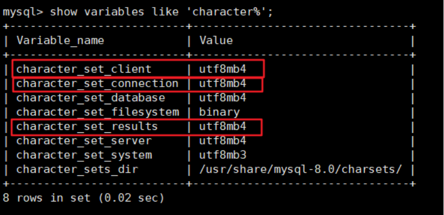


为了体现出字符集在请求处理过程中的变化，我们这里特意修改一个系统变量的值：


```sql
mysql> set character_set_connection = gbk;
Query OK, 0 rows affected (0.00 sec)
```


现在假设我们客户端发送的请求是下边这个字符串：


```sql
SELECT * FROM t WHERE s = '我';
```


为了方便大家理解这个过程，我们只分析字符** '我' **在这个过程中字符集的转换。


现在看一下在请求从发送到结果返回过程中字符集的变化：


1.  客户端发送请求所使用的字符集  
一般情况下客户端所使用的字符集和当前操作系统一致，不同操作系统使用的字符集可能不一 样，如下： 
    - 类 **Unix** 系统使用的是 **utf8**
    - **Windows** 使用的是 **gbk**

当客户端使用的是 **utf8** 字符集，字符**'我' **在发送给服务器的请求中的字节形式就是：**0xE68891** 

> 提示
>
>  
>
> 如果你使用的是可视化工具，比如navicat之类的，这些工具可能会使用自定义的字符集来编码发送到服务器的字符串，而不采用操作系统默认的字符集（所以在学习的时候还是尽量用命令行窗口）。
>

2.  服务器接收到客户端发送来的请求其实是一串二进制的字节，它会认为这串字节采用的字符集是**character_set_client** ，然后把这串字节转换为**character_set_connection**字符集编码的字符。  
由于我的计算机上** character_set_client** 的值是 **utf8** ，首先会按照 **utf8** 字符集对字节串**0xE68891** 进行解码，得到的字符串就是 **'我'** ，然后按照 **character_set_connection** 代表的字符集，也就是 **gbk** 进行编码，得到的结果就是字节串** 0xCED2** 。 
3.  因为表 **t** 的列 **col **采用的是 **gbk** 字符集，与 **character_set_connection** 一致，所以直接到列中找字节值为 **0xCED2** 的记录，最后找到了一条记录。 


> 提示
>
>  
>
> 如果某个列使用的字符集和character_set_connection代表的字符集不一致的话，还需要进行一次字符集转换。
>


4.  上一步骤找到的记录中的 **col** 列其实是一个字节串 **0xCED2** ， **col **列是采用 **gbk** 进行编码的，所以首先会将这个字节串使用 **gbk** 进行解码，得到字符串 **'我'** ，然后再把这个字符串使用**character_set_results** 代表的字符集，也就是 **utf8 **进行编码，得到了新的字节串： **0xE68891** ，然后发送给客户端。 
5.  由于客户端是用的字符集是 **utf8 **，所以可以顺利的将 **0xE68891** 解释成字符** 我** ，从而显示到我们的显示器上，所以我们人类也读懂了返回的结果。 


总结图示如下：


# 6. SQL大小写规范


## 6.1 Windows和Linux平台区别


在 SQL 中，关键字和函数名是不用区分字母大小写的，比如 SELECT、WHERE、ORDER、GROUP BY 等关键字，以及 ABS、MOD、ROUND、MAX 等函数名。


不过在 SQL 中，你还是要确定大小写的规范，因为在 Linux 和 Windows 环境下，你可能会遇到不同的大小写问题。** windows系统默认大小写不敏感** ，但是 **linux系统是大小写敏感的** 。


通过如下命令查看：


```sql
SHOW VARIABLES LIKE '%lower_case_table_names%'
```


+  Windows系统下：  
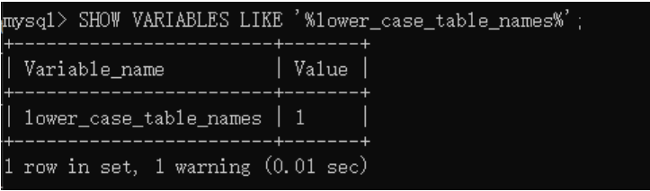 
+  Linux系统下：  
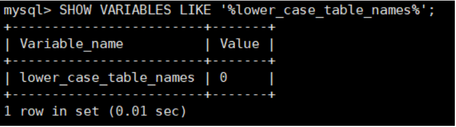 
+  lower_case_table_names参数值的设置： 
    -  **默认为0，大小写敏感 **. 
    -  设置1，大小写不敏感。创建的表，数据库都是以小写形式存放在磁盘上，对于sql语句都是转换为小写对表和数据库进行查找。 
    -  设置2，创建的表和数据库依据语句上格式存放，凡是查找都是转换为小写进行。 
+  两个平台上SQL大小写的区别具体来说： 


> MySQL在Linux下数据库名、表名、列名、别名大小写规则是这样的：  
1、数据库名、表名、表的别名、变量名是严格区分大小写的；  
2、关键字、函数名称在 SQL 中不区分大小写；  
3、列名（或字段名）与列的别名（或字段别名）在所有的情况下均是忽略大小写的；
>
>  
>
> **MySQL在Windows的环境下全部不区分大小写**
>


## 6.2 Linux下大小写规则设置


当想设置为大小写不敏感时，要在 **my.cnf **这个配置文件 [mysqld] 中加入 **lower_case_table_names=1**，然后重启服务器。


+  但是要在重启数据库实例之前就需要将原来的数据库和表转换为小写，否则将找不到数据库名。 
+  此参数适用于MySQL5.7。在MySQL 8下禁止在重新启动 MySQL 服务时将 **lower_case_table_names **设置成不同于初始化 MySQL 服务时设置的 **lower_case_table_names **值。如果非要将MySQL8设置为大小写不敏感，具体步骤为： 

```sql
1、停止MySQL服务
2、删除数据目录，即删除 /var/lib/mysql 目录
3、在MySQL配置文件（ /etc/my.cnf ）中添加 lower_case_table_names=1
4、启动MySQL服务
```

 


## 6.3 SQL编写建议


如果你的变量名命名规范没有统一，就可能产生错误。这里有一个有关命名规范的建议：


>  
>
> 1. 关键字和函数名称全部大写；
> 2. 数据库名、表名、表别名、字段名、字段别名等全部小写；
> 3. SQL 语句必须以分号结尾。
>
>  
>


数据库名、表名和字段名在 Linux MySQL 环境下是区分大小写的，因此建议你统一这些字段的命名规则，比如全部采用小写的方式。


虽然关键字和函数名称在 SQL 中不区分大小写，也就是如果小写的话同样可以执行。但是同时将关键词和函数名称全部大写，以便于区分数据库名、表名、字段名。


# 7. sql_mode的合理设置


## 7.1 宽松模式 vs 严格模式


**宽松模式：**


如果设置的是宽松模式，那么我们在插入数据的时候，即便是给了一个错误的数据，也可能会被接受， 并且不报错。


**举例**：我在创建一个表时，该表中有一个字段为name，给name设置的字段类型时 **char(10) **，如果我在插入数据的时候，其中name这个字段对应的有一条数据的 **长度超过了10 **，例如'1234567890abc'，超过了设定的字段长度10，那么不会报错，并且取前10个字符存上，也就是说你这个数据被存为了'1234567890'，而'abc'就没有了。但是，我们给的这条数据是错误的，因为超过了字段长度，但是并没 有报错，并且mysql自行处理并接受了，这就是宽松模式的效果。


**应用场景** ：通过设置sql mode为宽松模式，来保证大多数sql符合标准的sql语法，这样应用在不同数据库之间进行 **迁移** 时，则不需要对业务sql 进行较大的修改。


**严格模式：**


出现上面宽松模式的错误，应该报错才对，所以MySQL5.7版本就将sql_mode默认值改为了严格模式。所 以在 **生产等环境** 中，我们必须采用的是严格模式，进而 **开发、测试环境 **的数据库也必须要设置，这样在开发测试阶段就可以发现问题。并且我们即便是用的MySQL5.6，也应该自行将其改为严格模式。


**开发经验 **：MySQL等数据库总想把关于数据的所有操作都自己包揽下来，包括数据的校验，其实开发中，我们应该在自己 **开发的项目程序级别将这些校验给做了 **，虽然写项目的时候麻烦了一些步骤，但是这样做之后，我们在进行数据库迁移或者在项目的迁移时，就会方便很多。


改为严格模式后可能会存在的问题：


若设置模式中包含了** NO_ZERO_DATE** ，那么MySQL数据库不允许插入零日期，插入零日期会抛出错误而不是警告。例如，表中含字段TIMESTAMP列（如果未声明为NULL或显示DEFAULT子句）将自动分配DEFAULT '0000-00-00 00:00:00'（零时间戳），这显然是不满足sql_mode中的NO_ZERO_DATE而报错。


## 7.2 宽松模式再举例


**宽松模式举例1**：


```sql
select * from employees group by department_id limit 10;

set sql_mode = ONLY_FULL_GROUP_BY;

select * from employees group by department_id limit 10;
```


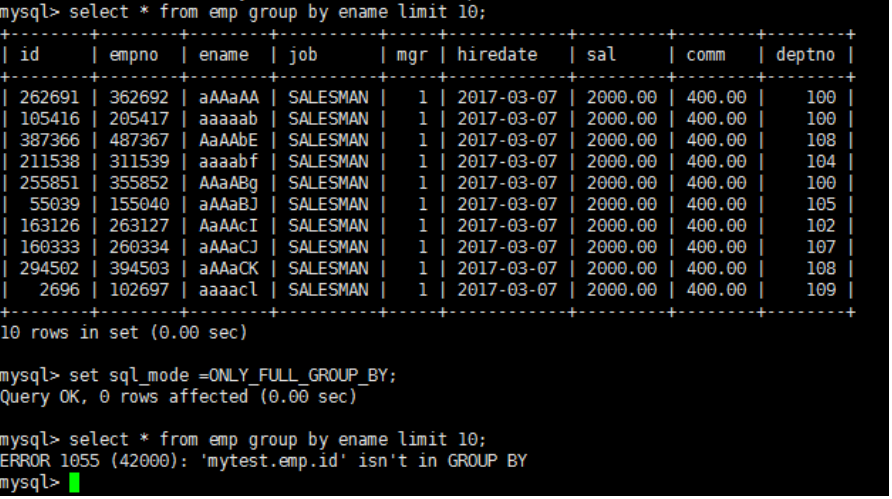


**宽松模式举例2：**


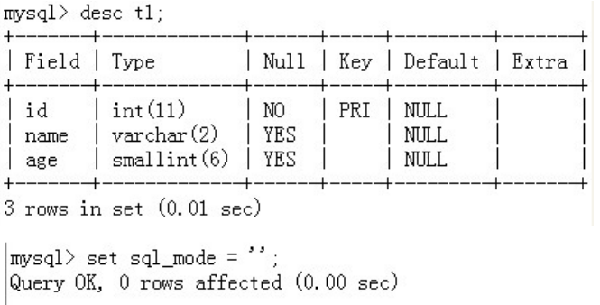


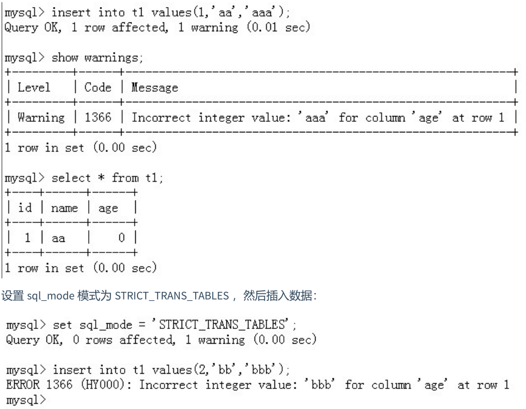


## 7.3 模式查看和设置


+  **查看当前的sql_mode** 

```sql
select @@session.sql_mode

select @@global.sql_mode

#或者

show variables like 'sql_mode';
```

  
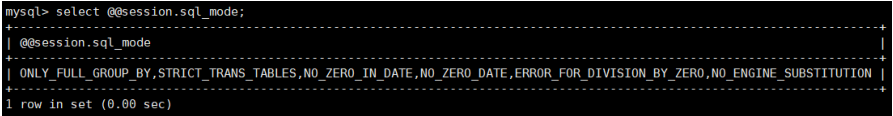  
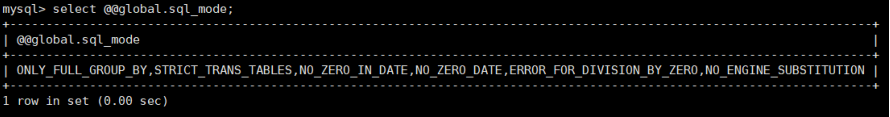 

+  **临时设置方式：设置当前窗口中设置sql_mode** 

```sql
SET GLOBAL sql_mode = 'modes...'; #全局
SET SESSION sql_mode = 'modes...'; #当前会话
```

  
举例：   

```sql
#改为严格模式。此方法只在当前会话中生效，关闭当前会话就不生效了。 
set SESSION sql_mode='STRICT_TRANS_TABLES';
```

```sql
#改为严格模式。此方法在当前服务中生效，重启MySQL服务后失效。 
set GLOBAL sql_mode='STRICT_TRANS_TABLES';
```


+  **永久设置方式：在/etc/my.cnf中配置sql_mode**  
在my.cnf文件(windows系统是my.ini文件)，新增： 

```sql
[mysqld]
sql_mode=ONLY_FULL_GROUP_BY,STRICT_TRANS_TABLES,NO_ZERO_IN_DATE,NO_ZERO_DATE,ERROR_FOR
_DIVISION_BY_ZERO,NO_ENGINE_SUBSTITUTION
```

  
然后** 重启MySQL** 。 


当然生产环境上是禁止重启MySQL服务的，所以采用 **临时设置方式 + 永久设置方式** 来解决线上的问题， 那么即便是有一天真的重启了MySQL服务，也会永久生效了。


> 更新: 2022-06-14 08:54:30  
> 原文: <https://www.yuque.com/like321/rloti7/opi6lp>