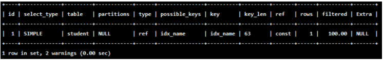
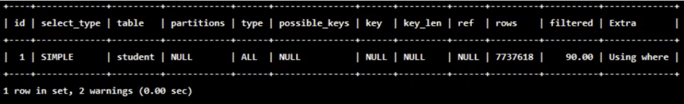
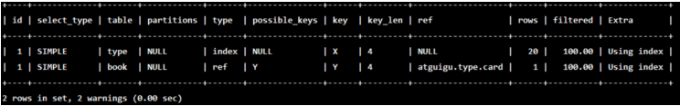
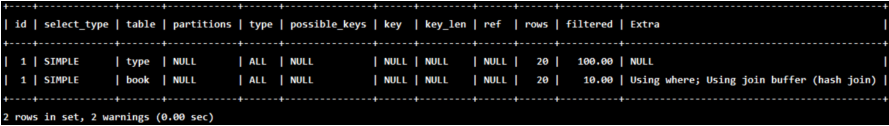
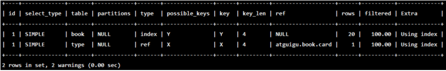
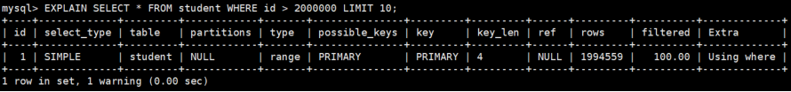
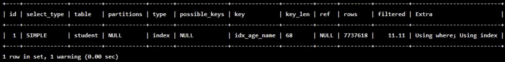
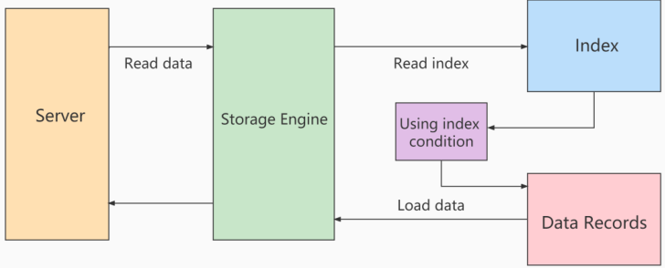
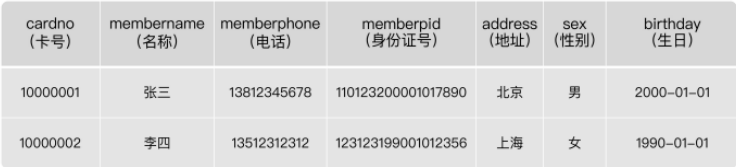

# 第10章_索引优化与查询优化

都有哪些维度可以进行数据库调优？简言之：


+ 索引失效、没有充分利用到索引--<font style="color:#E8323C;">索引建立</font>
+ 关联查询太多JOIN（设计缺陷或不得已的需求）--<font style="color:#E8323C;">SQL优化</font>
+ 服务器调优及各个参数设置（缓冲、线程数等）--<font style="color:#E8323C;">调整my.cnf</font>
+ 数据过多--<font style="color:#E8323C;">分库分表</font>


关于数据库调优的知识点非常分散。不同的DBMS，不同的公司，不同的职位，不同的项目遇到的问题都不尽相同。


虽然SQL查询优化的技术有很多，但是大方向上完全可以分成**<font style="color:#E8323C;">物理查询优化</font>**和**<font style="color:#E8323C;">逻辑查询优化</font>**两大块。


+ 物理查询优化是通过**<font style="color:#E8323C;">索引</font>**和**<font style="color:#E8323C;">表连接方式</font>**等技术来进行优化，这里重点需要掌握索引的使用。
+ 逻辑查询优化就是通过SQL**<font style="color:#E8323C;">等价变换</font>**提升查询效率，直白一点就是说，换一种查询写法执行效率可能更高。


# 1. 数据准备


**学员表**插**50万**条，**班级表**插**1万**条。


**步骤1：建表**


```sql
CREATE TABLE `class` (
    `id` INT(11) NOT NULL AUTO_INCREMENT,
    `className` VARCHAR(30) DEFAULT NULL,
    `address` VARCHAR(40) DEFAULT NULL,
    `monitor` INT NULL ,
    PRIMARY KEY (`id`)
) ENGINE=INNODB AUTO_INCREMENT=1 DEFAULT CHARSET=utf8;

CREATE TABLE `student` (
    `id` INT(11) NOT NULL AUTO_INCREMENT,
    `stuno` INT NOT NULL ,
    `name` VARCHAR(20) DEFAULT NULL,
    `age` INT(3) DEFAULT NULL,
    `classId` INT(11) DEFAULT NULL,
    PRIMARY KEY (`id`)
    #CONSTRAINT `fk_class_id` FOREIGN KEY (`classId`) REFERENCES `t_class` (`id`)
) ENGINE=INNODB AUTO_INCREMENT=1 DEFAULT CHARSET=utf8;
```


**步骤2：设置参数**


+ 命令开启：允许创建函数设置：


```sql
set global log_bin_trust_function_creators=1;   # 不加global只是当前窗口有效。
```


**步骤3：创建函数**


保证每条数据都不同。


```sql
#随机产生字符串
DELIMITER //
CREATE FUNCTION rand_string(n INT) RETURNS VARCHAR(255)
BEGIN  
    DECLARE chars_str VARCHAR(100) DEFAULT
    'abcdefghijklmnopqrstuvwxyzABCDEFJHIJKLMNOPQRSTUVWXYZ';
    DECLARE return_str VARCHAR(255) DEFAULT '';
    DECLARE i INT DEFAULT 0;
    WHILE i < n DO 
    SET return_str =CONCAT(return_str,SUBSTRING(chars_str,FLOOR(1+RAND()*52),1)); 
    SET i = i + 1;
    END WHILE;
    RETURN return_str;
END //
DELIMITER ;

#假如要删除
#drop function rand_string;
```


+ 随机产生班级编号


```sql
#用于随机产生多少到多少的编号
DELIMITER //
CREATE FUNCTION rand_num (from_num INT ,to_num INT) RETURNS INT(11)
BEGIN 
DECLARE i INT DEFAULT 0; 
SET i = FLOOR(from_num +RAND()*(to_num - from_num+1))  ;
RETURN i; 
END //
DELIMITER ;

#假如要删除
#drop function rand_num;
```


**步骤4：创建存储过程**


```sql
#创建往stu表中插入数据的存储过程
DELIMITER //
CREATE PROCEDURE insert_stu(  START INT , max_num INT )
BEGIN 
    DECLARE i INT DEFAULT 0; 
    SET autocommit = 0;   #设置手动提交事务
    REPEAT  #循环
    SET i = i + 1;  #赋值
    INSERT INTO student (stuno, name ,age ,classId ) VALUES
    ((START+i),rand_string(6),rand_num(1,50),rand_num(1,1000)); 
    UNTIL i = max_num 
    END REPEAT; 
    COMMIT;  #提交事务
END //
DELIMITER ;

#假如要删除
#drop PROCEDURE insert_stu;
```


创建往class表中插入数据的存储过程


```sql
#执行存储过程，往class表添加随机数据
DELIMITER //
CREATE PROCEDURE `insert_class`( max_num INT )
BEGIN 
    DECLARE i INT DEFAULT 0; 
    SET autocommit = 0;  
    REPEAT 
    SET i = i + 1; 
    INSERT INTO class ( classname,address,monitor ) VALUES
    (rand_string(8),rand_string(10),rand_num(1,100000)); 
    UNTIL i = max_num 
    END REPEAT; 
    COMMIT;
    END //
DELIMITER ;

#假如要删除
#drop PROCEDURE insert_class;
```


**步骤5：调用存储过程**


class


```sql
#执行存储过程，往class表添加1万条数据 
CALL insert_class(10000);
```


stu


```sql
#执行存储过程，往stu表添加50万条数据 
CALL insert_stu(100000,500000);
```


**步骤6：删除某表上的索引**


创建存储过程


```sql
DELIMITER //
CREATE  PROCEDURE `proc_drop_index`(dbname VARCHAR(200),tablename VARCHAR(200))
BEGIN
   DECLARE done INT DEFAULT 0;
   DECLARE ct INT DEFAULT 0;
   DECLARE _index VARCHAR(200) DEFAULT '';
   DECLARE _cur CURSOR FOR  SELECT  index_name  FROM
information_schema.STATISTICS  WHERE table_schema=dbname AND table_name=tablename AND
seq_in_index=1 AND  index_name <>'PRIMARY' ;
#每个游标必须使用不同的declare continue handler for not found set done=1来控制游标的结束
   DECLARE  CONTINUE HANDLER FOR NOT FOUND set done=2 ;   
#若没有数据返回,程序继续,并将变量done设为2
    OPEN _cur;
    FETCH _cur INTO _index;
    WHILE _index<>'' DO
       SET @str = CONCAT("drop index " , _index , " on " , tablename );
       PREPARE sql_str FROM @str ;
       EXECUTE sql_str;
       DEALLOCATE PREPARE sql_str;
       SET _index='';
       FETCH _cur INTO _index;
    END WHILE;
 CLOSE _cur;
END //
DELIMITER ;
```


执行存储过程


```sql
CALL proc_drop_index("dbname","tablename");
```


# 2. 索引失效案例


MySQL中提高性能的一个最有效的方式是对数据表**<font style="color:#E8323C;">设计合理的索引</font>**。索引提供了高效访问数据的方法，并且加快查询的速度，因此索引对查询的速度有着至关重要的影响。


+ 使用索引可以**<font style="color:#E8323C;">快速地定位</font>**表中的某条记录，从而提高数据库查询的速度，提高数据库的性能。
+ 如果查询时没有使用索引，查询语句就会**<font style="color:#E8323C;">扫描表中的所有记录</font>**。在数据量大的情况下，这样查询的速度会很慢。


大多数情况下都（默认）采用**<font style="color:#E8323C;">B+树</font>**来构建索引。只是空间列类型的索引使用**<font style="color:#E8323C;">R-树</font>**，并且MEMORY表还支持**<font style="color:#E8323C;">Hash索引</font>**<font style="color:#E8323C;">。</font>


其实，用不用索引，最终都是优化器说了算，优化器是基于什么的优化器？

基于**<font style="color:#E8323C;">COST开销（CostBaseOptimizer）</font>**，它不是基于**<font style="color:#E8323C;">规则（Rule-BasedOptimizer）</font>**，也不是基于**<font style="color:#E8323C;">语义</font>**。怎么样开销小就怎么来。另外，**<font style="color:#E8323C;">SQL语句是否使用索引，跟数据库版本、数据量、数据选择度都有关系</font>**<font style="color:#E8323C;">。</font>


## 2.1 全值匹配我最爱
系统中经常出现的sql语句如下:

```sql
EXPLAIN SELECT SQL_NO_CACHE * FROM student WHERE age=30;
EXPLAIN SELECT SQL_NO_CACHE * FROM student WHERE age=30 and classId=4;
EXPLAIN SELECT SQL_NO_CACHE * FROM student WHERE age=30 and classId=4 AND name = 'abcd' 
```

建立索引前执行: (关注执行时间)

```sql
mysql> SELECT SQL_NO_CACHE * FROM student WHERE age=30 and classId=4 AND name = 'abcd';
Empty set， 1 warning (0.28 sec)
```

建立索引

```sql
CREATE INDEX idx_age ON student(age) ;
CREATE INDEX idx_age_classid ON student (age, classId);
CREATE INDEX idx_age_classid_name ON student (age, classId, name);
```

建立索引后执行: 

```sql
mysql> SELECT SQL_NO_CACHE * FROM student WHERE age=30 and classId=4 AND name ='abcd' ;
Empty set, 1 warning (0.01 sec)
```

可以看到，创建索引前的查询时间是**0.28**秒，创建索引后的查询时间是**0.01**秒，索引帮助我们极大的提高了查询效率。


## 2.2 最佳左前缀法则


在MySQL建立<font style="color:#E8323C;">联合索引</font>时会遵守<font style="color:#E8323C;">最佳左前缀匹配原则</font>，即最左优先，在检索数据时从联合索引的最左边开始匹配。

举例1:

```sql
EXPLAIN SELECT SQL_NO_CACHE * FROM student WHERE student.age=30 AND student.name = 'abcd';
```

举例2:

```sql
EXPLAIN SELECT SQL_NO_CACHE * FROM student WHERE student.classid=1 AND student.name = 'abcd' ;
```

举例3:**索引idx_ age_classid_name 还能否正常使用?**

```sql
EXPLAIN SELECT SQL_NO_CACHE * FROM student 
WHERE classid=4 AND student.age=30 AND student.name = 'abcd' ;
```

如果索引了多列，要遵守最左前缀法则。指的是查询从索引的最左前列开始并且不跳过索引中的列。

```sql
mysql> EXPLAIN SELECT SQL_NO_CACHE * FROM student
WHERE student.age=30 AND student.name = 'abcd' ;
```


虽然可以正常使用，但是只有部分被使用到了。

```sql
mysql> EXPLAIN SELECT SQL_NO_CACHE * FROM student 
WHERE student.classid=1 AND student.name = 'abcd' ;
```


完全没有使用上索引。


结论：MySQL可以为多个字段创建索引，一个索引可以包括16个字段。对于多列索引，**<font style="color:#E8323C;">过滤条件要使用索引必须按照索引建立时的顺序，依次满足，一旦跳过某个字段，索引后面的字段都无法被使用</font>****。**如果查询条件中没有使用这些字段中第1个字段时，多列（或联合）索引不会被使用。


> 拓展：Alibaba《Java开发手册》
>
>  
>
> 索引文件具有 B-Tree 的最左前缀匹配特性，如果左边的值未确定，那么无法使用此索引。
>


## 2.3 主键插入顺序


对于一个使用**InnoDB**存储引擎的表来说，在我们没有显示的创建索引时，表中的数据实际上都是存储在**<font style="color:#E8323C;">聚簇索引</font>**的叶子节点的。而记录又是存储在数据页中大的，数据页和记录又是按照记录**<font style="color:#E8323C;">主键值从小到大</font>**的顺序进行排序，所以如果我们**插入**的记录的**主键值是依次增大**的话，那我们每插满一个数据页就换到下一个数据页继续插，而如果我们插入的**主键值忽大忽小**的话，就比较麻烦了，假设某个数据页存储的记录已经满了，它存储的主键值在**1~100**之间：


如果此时再插入一条主键值为**9**的记录，那它插入的位置就如下图：


可这个数据页已经满了，再插进来咋办呢？我们需要把当前**<font style="color:#E8323C;">页面分裂</font>**成两个页面，把本页中的一些记录移动到新创建的这个页中。页面分裂和记录移位意味着什么？意味着：**<font style="color:#E8323C;">性能损耗</font>**<font style="color:#E8323C;">！</font>所以如果我们想尽量避免这样无谓的性能损耗，最好让插入的记录的**主键值依次递增** ，这样就不会发生这样的性能损耗了。所以我们建议：让主键具有**AUTO_INCREMENT**，让存储引擎自己为表生成主键，而不是我们手动插入 ，


比如：**person_info** 表：


```sql
CREATE TABLE person_info(
    id INT UNSIGNED NOT NULL AUTO_INCREMENT,
    name VARCHAR(100) NOT NULL,
    birthday DATE NOT NULL,
    phone_number CHAR(11) NOT NULL,
    country varchar(100) NOT NULL,
    PRIMARY KEY (id),
    KEY idx_name_birthday_phone_number (name(10), birthday, phone_number)
);
```


我们自定义的主键列**id**拥有**AUTO_INCREMENT**属性，在插入记录时存储引擎会自动为我们填入自增的主键值。这样的主键占用空间小，顺序写入，减少页分裂。


## 2.4 计算、函数、导致索引失效


1. 这两条SQL哪种写法更好


```sql
EXPLAIN SELECT SQL_NO_CACHE * FROM student WHERE student.name LIKE 'abc%';

EXPLAIN SELECT SQL_NO_CACHE * FROM student WHERE LEFT(student.name,3) = 'abc';
```


2. 创建索引


```sql
CREATE INDEX idx_name ON student(NAME);
```


3. 第一种：索引优化生效


```sql
mysql> EXPLAIN SELECT SQL_NO_CACHE * FROM student WHERE student.name LIKE 'abc%';
```


```sql
mysql>  SELECT SQL_NO_CACHE * FROM student WHERE student.name LIKE 'abc%';
+---------+---------+--------+------+---------+
| id   		| stuno   | name   | age  | classId |
+---------+---------+--------+------+---------+
| 5301379 | 1233401 | AbCHEa |  164 |   259 	|
| 7170042 | 3102064 | ABcHeB |  199 |   161 	|
| 1901614 | 1833636 | ABcHeC |  226 |   275 	|
| 5195021 | 1127043 | abchEC |  486 |    72 	|
| 4047089 | 3810031 | AbCHFd |  268 |   210 	|
| 4917074 |  849096 | ABcHfD |  264 |   442 	|
| 1540859 |  141979 | abchFF |  119 |   140 	|
| 5121801 | 1053823 | AbCHFg |  412 |   327 	|
| 2441254 | 2373276 | abchFJ |  170 |   362 	|
| 7039146 | 2971168 | ABcHgI |  502 |   465 	|
| 1636826 | 1580286 | ABcHgK |  71  |   262 	|
|  374344 |  474345 | abchHL |  367 |   212 	|
| 1596534 |  169191 | AbCHHl |  102 |   146 	|
         ...
| 5266837 | 1198859 | abclXe |  292 |   298 	|
| 8126968 | 4058990 | aBClxE |  316 |   150 	|
| 4298305 |  399962 | AbCLXF |  72  |   423 	|
| 5813628 | 1745650 | aBClxF |  356 |   323 	|
| 6980448 | 2912470 | AbCLXF |  107 |    78 	|
| 7881979 | 3814001 | AbCLXF |  89  |   497 	|
| 4955576 |  887598 | ABcLxg |  121 |   385 	|
| 3653460 | 3585482 | AbCLXJ |  130 |   174 	|
| 1231990 | 1283439 | AbCLYH |  189 |   429 	|
| 6110615 | 2042637 | ABcLyh |  157 |    40 	|
+---------+---------+--------+------+---------+
401 rows in set, 1 warning (0.01 sec)
```


type为“range”，表示有使用到索引，查询时间仅为0.01秒。


第二种：索引优化失效


```sql
mysql> EXPLAIN SELECT SQL_NO_CACHE * FROM student WHERE LEFT(student.name,3) = 'abc';
```


```sql
mysql>  SELECT SQL_NO_CACHE * FROM student WHERE LEFT(student.name,3) = 'abc';
+---------+---------+--------+------+---------+
| id   		| stuno   | name   | age  | classId |
+---------+---------+--------+------+---------+
| 5301379 | 1233401 | AbCHEa |  164 |   259 	|
| 7170042 | 3102064 | ABcHeB |  199 |   161 	|
| 1901614 | 1833636 | ABcHeC |  226 |   275 	|
| 5195021 | 1127043 | abchEC |  486 |    72 	|
| 4047089 | 3810031 | AbCHFd |  268 |   210 	|
| 4917074 |  849096 | ABcHfD |  264 |   442 	|
| 1540859 |  141979 | abchFF |  119 |   140 	|
| 5121801 | 1053823 | AbCHFg |  412 |   327 	|
| 2441254 | 2373276 | abchFJ |  170 |   362 	|
| 7039146 | 2971168 | ABcHgI |  502 |   465 	|
| 1636826 | 1580286 | ABcHgK |  71  |   262 	|
|  374344 |  474345 | abchHL |  367 |   212 	|
| 1596534 |  169191 | AbCHHl |  102 |   146 	|
         ...
| 5266837 | 1198859 | abclXe |  292 |   298 	|
| 8126968 | 4058990 | aBClxE |  316 |   150 	|
| 4298305 |  399962 | AbCLXF |  72  |   423 	|
| 5813628 | 1745650 | aBClxF |  356 |   323 	|
| 6980448 | 2912470 | AbCLXF |  107 |    78 	|
| 7881979 | 3814001 | AbCLXF |  89  |   497 	|
| 4955576 |  887598 | ABcLxg |  121 |   385 	|
| 3653460 | 3585482 | AbCLXJ |  130 |   174 	|
| 1231990 | 1283439 | AbCLYH |  189 |   429 	|
| 6110615 | 2042637 | ABcLyh |  157 |    40 	|
+---------+---------+--------+------+---------+
401 rows in set, 1 warning (3.62 sec)
```


type为"ALL"，表示没有使用到索引，查询时间为**3.62**秒，查询效率较之前低很多。


**再举例：**


+  student表的字段stuno上设置有索引 

```sql
CREATE INDEX idx_sno ON student(stuno);
```

 

索引优化失效: (假设: student表的字段stuno 上设置有索引)

```sql
EXPLAIN SELECT SQL_NO_CACHE id，stuno， NAME FROM student WHERE stuno+1 = 900001 ;
```

  
运行结果：  


你能看到如果对索进行了表达式计算，索引就失效了。这是因为我们需要把索引字段的取值都取出来，然后依次进行表达式的计算来进行条件判断，因此采用的就是**<font style="color:#E8323C;">全表扫描</font>**的方式，运行时间也会慢很多，最终运行时间为**2.538**秒。


+  索引优化生效： 

```sql
EXPLAIN SELECT SQL_NO_CACHE id, stuno, NAME FROM student WHERE stuno = 900000;
```

 

运行时间为**0. 039**秒。


**再举例：**


+  student表的字段name上设置有索引 

```sql
CREATE INDEX idx_name ON student(NAME);
```

我们想要对name的前三位为abc的内容进行条件筛选，这里我们来查看下执行计划:


+ 索引优化失效:

```sql
EXPLAIN SELECT id, stuno, name FROM student WHERE SUBSTRING(name, 1,3)='abc' ;
```

  
 

+ 索引优化生效:


```sql
EXPLAIN SELECT id, stuno, NAME FROM student WHERE NAME LIKE 'abc%';
```


你能看到经过查询重写后，可以使用索引进行范围检索，从而提升查询效率。


## 2.5 类型转换(自动或手动)导致索引失效


下列哪个sql语句可以用到索引。（假设name字段上设置有索引）


```sql
# 未使用到索引
EXPLAIN SELECT SQL_NO_CACHE * FROM student WHERE name=123;
```


```sql
# 使用到索引
EXPLAIN SELECT SQL_NO_CACHE * FROM student WHERE name='123';
```





+ name=123发生类型转换，索引失效。

> 结论:设计实体类属性时，一定要与数据库字段类型相对应。否则，就会出现类型转换的情况。
>

## 2.6 范围条件右边的列索引失效


1. 如果系统经常出现的SQL如下：


```sql
ALTER TABLE student DROP INDEX idx_name;
ALTER TABLE student DROP INDEX idx_age;
ALTER TABLE student DROP INDEX idx_age_classid;

EXPLAIN SELECT SQL_NO_CACHE * FROM student
WHERE student.age = 30 AND student.classId > 20 AND student.name = 'abc' ;
```


2.  那么索引 idx_age_classid_name这个索引还能正常使用么？  


不能，范围右边的列不能使用。比如：（<）（<=）（>）（>=）和 between等 


+  如果这种SQL出现较多，应该建立： 

```sql
create index idx_age_name_classid on student(age,name,classid);
```

 

+ <font style="color:#E8323C;"> 将范围查询条件放置语句最后： </font>

```sql
EXPLAIN SELECT SQL_NO_CACHE * FROM student 
WHERE student.age=30 AND student.name = 'abc' AND student.classId>20 ;
```

 

> 应用开发中范围查询，例如：金额查询，日期查询往往都是范围查询。应将查询条件放置where语句最后。
>
>  
>
> <font style="color:#E8323C;">(创建的联合索引中，务必把范围涉及到的字段写在最后)</font>
>


3.效果

```sql
EXPLAIN SELECT SQL_NO_CACHE * FROM student 
WHERE student.age=30 AND student.classId>20 AND student.name = 'abc';
```


## 2.7 不等于(!= 或者<>)索引失效


+ 为name字段创建索引

```sql
CREATE INDEX idx_name ON student (NAME) ;
```

+ 查看索引是否失效

```sql
EXPLAIN SELECT SQL_NO_CACHE * FROM student WHERE student.name <> 'abc' ;
```



或者

```sql
EXPLAIN SELECT SQL_NO_CACHE * FROM student WHERE student.name != 'abc’;
```

场景举例:用户提出需求，将财务数据，产品利润金额不等于0的都统计出来。


## 2.8  is null可以使用索引，is not null无法使用索引


+ IS NULL ：可以触发索引


```sql
EXPLAIN SELECT SQL_NO_CACHE * FROM student WHERE age IS NULL;
```


+ <font style="color:#E8323C;">IS NOT NULL：无法触发索引</font>


```sql
EXPLAIN SELECT SQL_NO_CACHE * FROM student WHERE age IS NOT NULL;
```


> 结论：最好在设计数据表大的时候将 **字段设置为 NOT NULL 约束**，比如你可以将INT类型的字段，默认值设置为0。将字符类型大的默认值设置为空字符串（''）。
>
>  
>
> 拓展：<font style="color:#E8323C;">同理，在查询中使用 </font>**<font style="color:#E8323C;">not like</font>**<font style="color:#E8323C;"> 也无法使用索引，导致全表扫描。</font>
>


## 2.9 like以通配符%开头索引失效


在使用LIKE关键字进行查询的查询语句中，如果匹配字符串的第一个字符为”%“，索引就不会起作用。只有”%“不在第一个位置，索引才会起作用。


+ 使用到索引

```sql
EXPLAIN SELECT SQL_NO_CACHE * FROM student WHERE name LIKE 'ab%';
```


+ 未使用到索引

```sql
EXPLAIN SELECT SQL_NO_CACHE * FROM student WHERE name LIKE '%ab%' ;
```


> 拓展：Alibaba《Java开发手册》
>
>  
>
> 【强制】页面搜索严禁左模糊或者全模糊，如果需要请走搜索引擎来解决。
>


## 2.10 OR 前后存在非索引的列，索引失效


在WHERE字句中，如果在OR前的条件列进行了索引，而在OR后的条件列没有进行索引，那么索引会失效。也就是说，**<font style="color:#E8323C;">OR前后的两个条件中的列都是索引时，查询中才使用索引</font>**<font style="color:#E8323C;">。</font>


因为OR的含义就是两个只要满足一个即可，因此**只有一个条件列进行了索引是没有意义的**，只要有条件列没有进行索引，就会进行**全表扫描**，因此索引的条件列也会失效。


查询语句使用OR关键字的情况：


```sql
# 未使用到索引
EXPLAIN SELECT SQL_NO_CACHE * FROM student WHERE age = 10 OR classid = 100;
```


因为classid字段.上没有索引，所以上述查询语句没有使用索引。


```sql
#使用到索引
EXPLAIN SELECT SQL_NO_CACHE * FROM student WHERE age = 10 OR name = 'Abel';
```


因为age字段和name字段上都有索引，所以查询中使用了索引。你能看到这里使用到了**index_ merge**, 简单来说index_merge就是对age和name分别进行了扫描，然后将这两个结果集进行了合并。这样做的好处就是**避免了全表扫描**。


## 2.11 数据库和表的字符集统一使用utf8mb4


统一使用utf8mb4( 5.5.3版本以上支持)兼容性更好，统一字符集可以避免由于字符集转换产生的乱码。不<font style="color:#E8323C;">同的 </font>**<font style="color:#E8323C;">字符集 </font>**<font style="color:#E8323C;">进行比较前需要进行 </font>**<font style="color:#E8323C;">转换 </font>**<font style="color:#E8323C;">会造成索引失效。</font>


## 2.12 一般性建议


+ 对于单列索引，，尽量选择针对当前query过滤性更好的索引
+ 在选择组合索引的时候，当前query中过滤性最好的字段在索引字段顺序中，位置越靠前越好。
+ 在选择组合索引的时候，尽量选择能够包含当前query中的where字句中更多字段的索引。
+ 在选择组合索引的时候，如果某个字段可能出现范围查询时，尽量把这个字段放在索引次序的最后面。


**总之，书写SQL语句时，尽量避免造成索引失效的情况。**


# 3. 关联查询优化
## 3.1 数据准备
```sql
#分类
CREATE TABLE IF NOT EXISTS `type` (
  `id` INT(10) UNSIGNED NOT NULL AUTO_INCREMENT,
  `card` INT(10) UNSIGNED NOT NULL,
  PRIMARY KEY (`id`)
);

#图书
CREATE TABLE IF NOT EXISTS `book` (
  `bookid` INT(10) UNSIGNED NOT NULL AUTO_INCREMENT,
  `card` INT(10) UNSIGNED NOT NULL，
  PRIMARY KEY (`bookid`)
);


#向分类表中添加20条记录
INSERT INTO type(card) VALUES(FL0OR(1 + ( RAND() * 20)));

#向图书表中添加20条记录
INSERT INTO book(card) VALUES(FL0OR(1 + ( RAND() * 20)));

```

## 3.2 采用左外连接


左外连接：<font style="color:#E8323C;">左边是驱动表，右边是被驱动表</font>


下面开始 EXPLAIN 分析


```sql
EXPLAIN SELECT SQL_NO_CACHE * FROM `type` LEFT JOIN book ON type.card = book.card;
```


结论：<font style="color:#E8323C;">type 有All</font>


添加索引优化


```sql
ALTER TABLE book ADD INDEX Y (card);  #【被驱动表】，可以避免全表扫描

EXPLAIN SELECT SQL_NO_CACHE * FROM `type` LEFT JOIN book ON type.card = book.card;
```


可以看到第二行的 type 变为了 <font style="color:#E8323C;">ref</font>，rows 也变成了优化比较明显。这是由左连接特性决定的。


LEFT JOIN 条件用于确定如何从右表搜索行，左边一定都有，所以**<font style="color:#E8323C;">右边是我们的关键点，一定需要建立索引</font>**<font style="color:#E8323C;">。</font>


```sql
ALTER TABLE `type` ADD INDEX X (card); #【驱动表】，无法避免全表扫描

EXPLAIN SELECT SQL_NO_CACHE * FROM `type` LEFT JOIN book ON type.card = book.card;
```





接着：


```sql
DROP INDEX Y ON book;

EXPLAIN SELECT SQL_NO_CACHE * FROM `type` LEFT JOIN book ON type.card = book.card;
```


## 3.3 采用内连接


内连接：驱动表、被驱动表 <font style="color:#E8323C;">由优化器决定</font>


```sql
drop index X on type;

drop index Y on book;
```


换成 inner join（MySQL自动选择驱动表）


```sql
EXPLAIN  SELECT SQL_NO_CACHE * FROM type INNER JOIN book ON type.card=book.card;
```





添加索引优化


```sql
ALTER  TABLE book ADD INDEX Y (card);

EXPLAIN  SELECT SQL_NO_CACHE * FROM type INNER JOIN book ON type.card=book.card;
```


```sql
ALTER  TABLE type ADD INDEX X (card); 

EXPLAIN  SELECT SQL_NO_CACHE * FROM type INNER JOIN book ON type.card=book.card;
```


### 结论1：
<font style="color:#E8323C;">对于内连接来说，查询优化器可以决定谁作为驱动表，谁作为被驱动表出现的</font>


接着：


```sql
DROP INDEX X ON `type`;

EXPLAIN  SELECT SQL_NO_CACHE * FROM TYPE INNER JOIN book ON type.card=book.card;
```


### 结论2：
对于内连接来讲，如果表的连接条件中只能有一个字段有索引，<font style="color:#E8323C;">则有索引的字段所在的表会被作为被驱动表出现。</font>


接着：


```sql
ALTER  TABLE `type` ADD INDEX X (card); 

EXPLAIN  SELECT SQL_NO_CACHE * FROM  `type` INNER JOIN book ON type.card=book.card;
```





### 结论3：
对于内连接来说，在两个表的连接条件都存在索引的情况下，<font style="color:#E8323C;">会选择小表作为驱动表。“小表驱动大表”</font>


## 3.4 join语句原理


join方式连接多个表，<font style="color:#E8323C;">本质就是各个表之间数据的循环匹配</font>。MySQL5.5版本之前，MySQL只支持一种表间关联方式，就是嵌套循环（Nested Loop Join）。如果关联表的数据量很大，则join关联的执行时间会非常长。在MySQL5.5以后的版本中，MySQL通过引入BNLJ 算法来优化嵌套执行。


### 1、驱动表和被驱动表


<font style="color:#E8323C;">驱动表就是主表，被驱动表就是从表、非驱动表。</font>


+  **对于内连接来说** 

```sql
SELECT * FROM A JOIN B ON ...
```

  
A一定是驱动表吗？<font style="color:#E8323C;">不一定，优化器会根据你查询语句做优化，决定先查哪张表。</font>先查询的那张表就是驱动表，反之就是被驱动表。通过explain关键字可以查看。 


+  对于外连接来说 

```sql
SELECT * FROM A LEFT JOIN B ON ...
或
SELECT * FROM B RIGHT JOIN A ON ...
```

  
通常，大家会认为A就是驱动表，B就是被驱动表。但也未必。测试如下  

```sql
CREATE TABLE a(f1 INT，f2 INT，INDEX(f1)) ENGINE=INNODB;

CREATE TABLE b(f1 INT，f2 INT) ENGINE=INNODB;

INSERT INTO a VALUES(1,1),(2,2),(3,3),(4,4),(5,5),(6,6);
  
INSERT INTO b VALUES(3,3),(4,4),(5,5),(6,6),(7,7),(8,8);

SELECT * FROM b;

#测试1
EXPLAIN SELECT * FROM a LEFT JOIN b ON(a.f1=b.f1) WHERE (a.f2=b.f2);

#测试2
EXPLAIN SELECT * FROM a LEFT JOIN b ON(a.f1=b.f1) AND (a.f2=b.f2)	;
```


### 2. Simple Nested-Loop Join（简单嵌套循环连接）


算法相当简单，从表A中取出一条数据1，遍历表B，将匹配到的数据放到result...以此类推，驱动表A中的每一条记录与被驱动表B的记录进行判断：


可以看到这种方式效率是非常低的，以上述表A数据100条，表B数据1000条计算，则A*B=10万次。开销统计如下：

| 开销统计 | SNLJ |
| --- | --- |
| 外表扫描次数 | 1 |
| 内标扫描次数： | A |
| 读取记录数： | A+B*A |
| JOIN比较次数： | B*A |
| 回表读取记录次数 | 0 |


当然MySQL肯定不会这么粗暴的去进行表的连接，所以就出现了后面的两种对Nested-Loop Join优化算法。


### 3. Index Nested-Loop Join（索引嵌套循环连接）


Index Nested-Loop Join其优化的思路主要是为了**<font style="color:#E8323C;">减少内层表数据的匹配次数</font>**，所以要求被驱动表上必须**<font style="color:#E8323C;">有索引</font>**才行。通过外层表匹配条件直接与内存表索引进行匹配，避免和内层表的每条记录去进行比较，这样极大的减少了对内层表的匹配次数。


驱动表中的每条记录通过被驱动表的索引进行访问，因为索引查询的成本是计较固定的，故mysql优化器都倾向于使用记录数少的表作为驱动表（外表）。

| 开销统计 | SNLJ | INLJ |
| --- | --- | --- |
| 外表扫描次数 | 1 | 1 |
| 内标扫描次数： | A | 0 |
| 读取记录数： | A+B*A | A+B(match) |
| JOIN比较次数： | B*A | A*Index(Height) |
| 回表读取记录次数 | 0 | B(match) (if possible) |


<font style="color:#E8323C;">如果被驱动表加索引，效率是非常高的，但如果索引不是主键索引，索引还得进行依次回表查询。</font>


相比，被驱动表的索引是主键索引，效率会更高。


### 4. Block Nested-Loop Join（块嵌套循环连接）


如果存在索引，那么会使用index的方式进行join，<font style="color:#E8323C;">如果join的列没有索引，被驱动表要扫描的次数太多了。</font>每次访问被驱动表，其表中的记录都会被加载到内存中，然后再从驱动表中取一条与其匹配，匹配结束后清除内存，然后再从驱动表中加载一条记录， 然后把被驱动表的记录在加载到内存匹配，这样周而复始，大大增加了IO的次数。<font style="color:#E8323C;">为了减少被驱动表的IO次数，就出现了Block Nested-Loop Join的方式。</font>


<font style="color:#E8323C;">不再是逐条获取驱动表的数据，而是一块一块的获取，</font>引入了**join buffer缓冲区**，将驱动表join相关的部分数据列（大小受join buffer的限制）缓存到join buffer中，然后全表扫描被驱动表，<font style="color:#E8323C;">被驱动表的每一条记录一次性和join buffer中的所有驱动表记录进行匹配</font>（内存中操作），将简单嵌套循环中的多次比较合并成一次， 降低了被驱动表的访问频率。


> 注意:  
<font style="color:#E8323C;">这里缓存的不只是关联表的列，select 后面的列也会缓存起来。</font>
>
>  
>
> 在一个有N个join关联的sql中会分配N-1个join buffer。所以查询的时候尽量减少不必要的字段，可以让join buffer中可以存放更多的列。
>


| 开销统计 | SNLJ | INLJ | BNLJ |
| --- | --- | --- | --- |
| 外表扫描次数 | 1 | 1 | 1 |
| 内标扫描次数： | A | 0 | A*used_column_size/join_buffer_size+1 |
| 读取记录数： | A+B*A | A+B(match) | A+B*_(_A*used_column_size/join_buffer_size) |
| JOIN比较次数： | B*A | A*Index(Height) | B*A |
| 回表读取记录次数 | 0 | B(match) (if possible) | 0 |


参数设置:


+  block_nested_loop  
通过**show variables like '%optimizer_switch%' **查看 **block_nested_loop**状态。默认是开启的。 


+ join_buffer_size  
驱动表能不能一次加载完， 要看join_buffer能不能存储所有的数据，默认情况下**join_buffer_size=256k**。 


```sql
mysql> show variables like '%join_buffer%';
+------------------+--------+
| Variable_name		 | Value	|
+------------------+--------+
|join_buffer_size  | 262144 |
+------------------+--------+
1 row in set (0.00 sec)
```


join_buffer_size的最大值在32位系统可以申请4G，而在64位操做系统下可以申请大于4G的Join Buffer空间（64 位Windows除外，其大值会被截断为4GB并发出警告）。


### 5. join小结


1、**整体效率比较: INLJ> BNLJ> SNLJ**


2、永远用小结果集驱动大结果集（<font style="color:#E8323C;">其本质就是减少外层循环的数据数量</font>） (小的度量单位指的是 表行数 * 每行大小)

```sql
如果直接使用join语句，MySQL优化器可能会选择表t1或t2作为驱动表，这样会影响我们分析SQL语句的执行过程。
所以，为了便于分析执行过程中的性能问题，我改用straight_join让MySQL使用固定的连接方式执行查询，
这样优化器只会按照我们指定的方式去join。在这个语句里，t1 是驱动表，t2是被驱动表。
select t1.b, t2.* from t1 straight_join t2 on (t1.b=t2.b) where t2.id<=100; #推荐

select t1.b, t2.* from t2 straight_join t1 on (t1.b=t2.b) where t2.id<=100; #不推荐
```

3、<font style="color:#E8323C;">为被驱动表匹配的条件增加索引（减少内层表的循环匹配次数）</font>


4、增大join_buffer_size的大小（一次缓存的数据越多，那么内层包的扫表次数就越少）


5、减少驱动表不必要的字段查询（字段越少，join buffer所缓存的数据就越多）


### 6. Hash Join


**从MySQL的8.0.20版本开始将废弃BNLJ，因为从MySQL8.0.18版本开始就加入了hash join默认都会使用hash join**


+  Nested Loop:  
对于被连接的数据子集较小的情况，Nested Loop是个较好的选择。 


+  Hash Join是做**大数据集连接**时的常用方式，优化器使用两个表中较小（相对较小）的表利用Join Key在内存中建立**散列表**，然后扫描较大的表并探测散列表，找出与Hash表匹配的行。 


    - 这种方式适用于较小的表完全可以放于内存中的情况，这样总成本就是访问两个表的成本之和。
    - 在表很大的情况下并不能完全放入内存，这时优化器会将它分割成**<font style="color:#E8323C;">若干不同的分区</font>**，不能放入内存的部分就把该分区写入磁盘的临时段，此时要求有较大的临时段从而尽量提高I/O的性能。
    - 它能够很好的工作于没有索引的大表和并行查询的环境中，并提供最好的性能。大多数人都说它是Join的重型升降机。Hash Join只能应用于等值连接（如WHERE A.COL1 = B.COL2），这是由Hash的特点决定的。

| 类别 | Nested Loop | Hash Join |
| --- | --- | --- |
| 使用条件 | 任何条件 | 等值连接（=） |
| 相关资源 | CPU、磁盘I/O | 内存、临时空间 |
| 特点 | 当有高选择性索引或进行限制性搜索时效率比较高，能够快速返回第一次的搜索结果。 | 当缺乏索引或者索引条件模糊时，Hash Join比Nested Loop有效。在数据仓库环境下，如果表的记录数多，效率高。 |
| 缺点 | 当索引丢失或者查询条件限制不够时，效率很低；当表的记录数多时，效率低。 | 为建立哈希表，需要大量内存。第一次的结果返回较慢。 |


## 3.5 小结


+  保证被驱动表的JOIN字段已经创建了索引 
+  需要JOIN 的字段，数据类型保持绝对一致。 
+  LEFT JOIN 时，选择小表作为驱动表，**大表作为被驱动表**。减少外层循环的次数。 
+  INNER JOIN 时，MySQL会自动将**小结果集的表选为驱动表**。选择相信MySQL优化策略。 
+  能够直接多表关联的尽量直接关联，不用子查询。(减少查询的趟数) 
+  不建议使用子查询，建议将子查询SQL拆开结合程序多次查询，或使用 JOIN 来代替子查询。 
+  衍生表建不了索引 


# 4. 子查询优化


MySQL从4.1版本开始支持子查询，使用子查询可以进行SELECT语句的嵌套查询，即一个SELECT查询的结果作为另一个SELECT语句的条件。**子查询可以一次性完成很多逻辑上需要多个步骤才能完成的SQL操作**。


**子查询是 MySQL 的一项重要的功能，可以帮助我们通过一个 SQL 语句实现比较复杂的查询。但是，子查询的执行效率不高。**原因：


① 执行子查询时，MySQL需要为内层查询语句的查询结果**<font style="color:#E8323C;">建立一个临时表</font>**，然后外层查询语句从临时表中查询记录。查询完毕后，再**<font style="color:#E8323C;">撤销这些临时表</font>**。这样会消耗过多的CPU和IO资源，产生大量的慢查询。


② 子查询的结果集存储的临时表，不论是内存临时表还是磁盘临时表都**<font style="color:#E8323C;">不会存在索引</font>**，所以查询性能会受到一定的影响。


③ 对于返回结果集比较大的子查询，其对查询性能的影响也就越大。


**在MySQL中，可以使用连接（JOIN）查询来替代子查询。**连接查询**不需要建立临时表**，其**速度比子查询要快** ，如果查询中使用索引的话，性能就会更好。


## In子查询


举例：查询学生表中是班长的学生信息


+ 使用子查询


```sql
#创建班级表中班长的索引
CREATE INDEX idx_monitor ON class (monitor) ;

EXPLAIN SELECT * FROM student stu1
WHERE stu1.`stuno` IN (
    SELECT monitor FROM class C WHERE monitor IS NOT NULL
);
```


+ 推荐：使用多表查询


```sql
EXPLAIN SELECT stu1.* FROM student stu1 JOIN class C
ON stu1.`stuno` = C.`monitor`
WHERE C.`monitor` IS NOT NULL ;
```


## not in 子查询  

举例：取所有不为班长的同学


+ 不推荐


```sql
EXPLAIN SELECT SQL_NO_CACHE a. *
FROM student a
WHERE a.stuno NOT IN (
    SELECT monitor FROM class b WHERE monitor IS NOT NULL
)
```


+ 推荐：


```sql
EXPLAIN SELECT SQL_NO_CACHE a.*
FROM
student a LEFT OUTER JOIN class b
ON a. stuno = b.monitor
WHERE b.monitor Is NULL;
```


> 结论：<font style="color:#E8323C;">尽量不要使用NOT IN 或者 NOT EXISTS，用LEFT JOIN xxx ON xx WHERE xx IS NULL替代</font>
>


# 5. 排序优化


## 5.1 排序优化


**问题：**在 WHERE 条件字段上加索引，但是为什么在 ORDER BY 字段上还要加索引呢？


**回答:**:


在MySQL中，支持两种排序方式，分别是**<font style="color:#E8323C;">FileSort</font>**和**<font style="color:#E8323C;">Index</font>**排序。


+ Index排序中，索引可以保证数据的有序性，不需要再进行排序， **<font style="color:#E8323C;">效率更高</font>**。


+ FileSort 排序则一般在**内存中**进行排序，占用**CPU较多**。如果待排结果较大，会产生临时文件I/O到磁盘进行排序的情况，效率较低。


**优化建议：**


1. SQL 中，可以在 WHERE 子句和 ORDER BY 子句中使用索引，目的是在 WHERE 子句中**避免全表扫描**，在 ORDER BY 子句**<font style="color:#E8323C;">避免使用 FileSort 排序</font>**。当然，某些情况下全表扫描，或者 FileSort 排序不一定比索引慢。但总的来说，我们还是要避免，以提高查询效率。


2. 尽量使用 Index 完成 ORDER BY 排序。如果 WHERE 和 ORDER BY 后面是相同的列就使用单索引列； <font style="color:#E8323C;">如果不同就使用联合索引。</font>


3. 无法使用 Index 时，需要对 FileSort 方式进行调优。


## 5.2 测试


删除student表和class表中已创建的索引


```sql
#方式1:
DROP INDEX idx_monitor ON class;
    
DROP INDEX idx_cid ON student;
DROP INDEX idx_age ON student;
DROP INDEX idx_name ON student;
DROP INDEX idx_age_name_classid ON student ;
DROP INDEX idx_age_classid_name ON student ;

#方式2:
call proc_drop_index('atguigudb2' , 'student') ;
```


以下是否能使用到索引，**能否去掉using filesort**


**过程一：**


```sql
EXPLAIN SELECT SQL_NO_CACHE * FROM student ORDER BY age, classid;
```


```sql
EXPLAIN SELECT SQL_NO_CACHE	 * FROM student ORDER BY age, classid LIMIT 10;
```


**过程二：order by 时不limit，索引失效**


```sql
#创建索引
CREATE INDEX idx_age_classid_name ON student ( age, classid, NAME) ;

#不限制，索引失效
EXPLAIN SELECT SQL_NO_CACHE * FROM student ORDER BY age, classid;
```


```sql
#增加limit过滤条件，使用上索引了。
EXPLAIN SELECT SQL_NO_CACHE * FROM student ORDER BY age, classid LIMIT 10;
```


**过程三：order by时顺序错误，索引失效**


```sql
#创建索引age, classid, stuno 
CREATE INDEX idx_age_classid_stuno ON student (age, classid, stuno);

#以下哪些索引失效?
EXPLAIN SELECT * FROM student ORDER BY classid LIMIT 10; #失效

EXPLAIN SELECT * FROM student ORDER BY classid, NAME LIMIT 10; #失效

EXPLAIN SELECT * FROM student ORDER BY age, classid, stuno LIMIT 10;

EXPLAIN SELECT * FROM student ORDER BY age, classid LIMIT 10;

EXPLAIN SELECT * FROM student ORDER BY age LIMIT 10;
```


**过程四: order by时规则不一致，索引失效(顺序错, 不索引;方向反，不索引)**


```sql
EXPLAIN SELECT * FROM student ORDER BY age DESC, classid ASC LIMIT 10; #失效

EXPLAIN SELECT * FROM student ORDER BY classid DESC, NAME DESC LIMIT 10; #失效

EXPLAIN SELECT * FROM student ORDER BY age ASC, classid DESC LIMIT 10; #失效

EXPLAIN SELECT * FROM student ORDER BY age DESC, classid DESC LIMIT 10;
```


> 结论: ORDER BY子句，尽量使用Index方式排序，避免使用FileSort方式排序
>


**过程五:无过滤，不索引**


```sql
EXPLAIN SELECT * FROM student WHERE age=45 ORDER BY classid;

EXPLAIN SELECT * FROM student WHERE age=45 ORDER BY classid, name ;

EXPLAIN SELECT * FROM student WHERE classid=45 order by age; #失效	

EXPLAIN SELECT * FROM student WHERE classid=45 order by age limit 10;
```


**小结**：


```sql
INDEX a_b_c(a,b,c)

order by 能使用索引最左前缀
- ORDER BY a
- ORDER BY a,b
- ORDER BY a,b,c
- ORDER BY a DESC,b DESC,c DESC

如果WHERE使用索引的最左前缀定义为常量，则order by 能使用索引
- WHERE a = const ORDER BY b,c
- WHERE a = const AND b = const ORDER BY c
- WHERE a = const ORDER BY b,c
- WHERE a = const AND b > const ORDER BY b,c

不能使用索引进行排序
- ORDER BY a ASC,b DESC,c DESC  /* 排序不一致 */
- WHERE g = const ORDER BY b,c  /*丢失a索引*/
- WHERE a = const ORDER BY c   /*丢失b索引*/
- WHERE a = const ORDER BY a,d  /*d不是索引的一部分*/
- WHERE a in (...) ORDER BY b,c /*对于排序来说，多个相等条件也是范围查询*/
```


## 5.3 案例实战


ORDER BY子句，尽量使用Index方式排序，避免使用FileSort方式排序。


执行案例前先清除student上的索引，只留主键：


```sql
DROP INDEX idx_age ON student;
DROP INDEX idx_age_classid_stuno ON student;
DROP INDEX idx_age_classid_name ON student;

#或者
call proc_drop_index('atguigudb2','student');
```


**场景:查询年龄为30岁的，且学生编号小于101000的学生，按用户名称排序**


```sql
EXPLAIN SELECT SQL_NO_CACHE * FROM student WHERE age = 30 AND stuno <101000 ORDER BY
NAME;
```


查询结果如下：


```sql
mysql>  SELECT SQL_NO_CACHE * FROM student WHERE age = 30 AND stuno <101000 ORDER BY
NAME ;
+---------+--------+--------+------+---------+
| id   		| stuno  | name   | age  | classId |
+---------+--------+--------+------+---------+
|   922   | 100923 | elTLXD |  30  |   249 	 |
| 3723263 | 100412 | hKcjLb |  30  |    59 	 |
| 3724152 | 100827 | iHLJmh |  30  |   387 	 |
| 3724030 | 100776 | LgxWoD |  30  |   253 	 |
|    30   | 100031 | LZMOIa |  30  |    97 	 |
| 3722887 | 100237 | QzbJdx |  30  |   440 	 |
|   609   | 100610 | vbRimN |  30  |   481 	 |
|   139   | 100140 | ZqFbuR |  30  |   351 	 |
+---------+--------+--------+------+---------+
8 rows in set, 1 warning (3.16 sec)
```


> 结论：type 是 ALL，即最坏的情况。Extra 里还出现了 Using filesort,也是最坏的情况。优化是必须的。
>


优化思路：


**方案一: 为了去掉filesort我们可以把索引建成**


```sql
#创建新索引
CREATE INDEX idx_age_name ON student(age,NAME);
```


```sql
EXPLAIN SELECT SQL_NO_CACHE * FROM student WHERE age = 30 AND stuno <101000 ORDER BY NAME
```


结果如下：


这样我们优化掉了using filesort。


查询结果如下：

1.13sec


**方案二: 尽量让where的过滤条件和排序使用上索引**


建一个三个字段的组合索引：


```sql
DROP INDEX idx_age_name ON student;

CREATE INDEX idx_age_stuno_name ON student (age,stuno,NAME);

EXPLAIN SELECT SQL_NO_CACHE * FROM student WHERE age = 30 AND stuno <101000 ORDER BY
NAME ;
```


结果如下：


我们发现using filesort依然存在，所以name并没有用到索引，而且type还是range光看字面其实并不美好。原因

是，因为**stuno是一个范围过滤**，所以索引后面的字段不会再使用索引了。


运行结果:

```sql
mysql> SELECT SQL_NO_CACHE * FROM student
 -> WHERE age = 30 AND stuno <101000 ORDER BY NAME ;
+-----+--------+--------+------+---------+
| id 	| stuno  | name   | age  | classId |
+-----+--------+--------+------+---------+
| 167 | 100168 | AClxEF |  30  |   319   |
| 323 | 100324 | bwbTpQ |  30  |   654   |
| 651 | 100652 | DRwIac |  30  |   997   |
| 517 | 100518 | HNSYqJ |  30  |   256   |
| 344 | 100345 | JuepiX |  30  |   329   |
| 905 | 100906 | JuWALd |  30  |   892   |
| 574 | 100575 | kbyqjX |  30  |   260   |
| 703 | 100704 | KJbprS |  30  |   594   |
| 723 | 100724 | OTdJkY |  30  |   236   |
| 656 | 100657 | Pfgqmj |  30  |   600   |
| 982 | 100983 | qywLqw |  30  |   837   |
| 468 | 100469 | sLEKQW |  30  |   346   |
| 988 | 100989 | UBYqJl |  30  |   457   |
| 173 | 100174 | UltkTN |  30  |   830   |
| 332 | 100333 | YjWiZw |  30  |   824   |
+-----+--------+--------+------+---------+
15 rows in set, 1 warning (0.00 sec)
```


结果竟然有 filesort的 sql 运行速度，**超过了已经优化掉 filesort的 sql**，而且快了很多，几乎一瞬间就出现了结果。


原因:


所有的排序都是在条件过滤之后才执行的。所以，如果条件过滤掉大部分数据的话，剩下几百几千条数据进行排序其实并不是很消耗性能，即使索引优化了排序，但实际提升性能很有限。

相对的stuno<101000这个条件，如果没有用到索引的话，要对几万条的数据进行扫描，这是非常消耗性能的，所以索引放在这个字段上性价比最高，是最优选择。


> 结论：
>
>  
>
> 1.  两个索引同时存在，mysql自动选择最优的方案。（对于这个例子，mysql选择 idx_age_stuno_name）。但是，**随着数据量的变化，选择的索引也会随之变化的**。
>
>  
>
> 2.  **当【范围条件】和【group by 或者 order by】的字段出现二选一时，优先观察条件字段的过滤数量，如果过滤的数据足够多，而需要排序的数据并不多时，优先把索引放在范围字段上。反之，亦然。** 
>


思考：这里我们使用如下索引，是否可行？


```sql
DROP INDEX idx_age_stuno_name ON student;

CREATE INDEX idx_age_stuno ON student(age,stuno); 可以
```


## 5.4 filesort算法：双路排序和单路排序


排序的字段若如果不在索引列上，则filesort会有两种算法: **双路排序**和**单路排序**


### 双路排序 （慢）


+  **MySQL 4.1之前是使用双路排序**，字面意思就是两次扫描磁盘，最终得到数据， 读取行指针和order by列 ，对他们进行排序，然后扫描已经排序好的列表，按照列表中的值重新从列表中读取对应的数据输出 


+  从磁盘取排序字段，在buffer进行排序，再从**磁盘取其他字段**。 


取一批数据，要对磁盘进行两次扫描，众所周知，IO是很耗时的，所以在mysql4.1之后，出现了第二种改进的算法，就是单路排序。


### 单路排序 （快）


从磁盘读取查询需要的**所有列**，按照order by列在buffer对它们进行排序，然后扫描排序后的列表进行输出， 它的效率更快一些，避免了第二次读取数据。并且把随机IO变成了顺序IO，但是它会使用更多的空间， 因为它把每一行都保存在内存中了。


**结论及引申出的问题**


+  由于单路是后出的，总体而言好过双路 
+  但是用单路有问题 
    - 在sort_buffer中， 单路比多路要**多占用很多空间**，因为单路是把所有字段都取出，所以有可能取出的数据的总大小超出了**sort_buffer**的容量，导致每次只能取**sort_buffer**容量大小的数据，进行排序(创建 tmp文件，多路合并) , 排完再取**sort_buffer**容量大小，再排..... 从而多次I/O。
    - 单路本来想省一次I/O操作，**反而导致了大量的I/0操作**，反而得不偿失。


**优化策略**


**1. 尝试提高 sort_buffer_size**


+  不管用哪种算法,提高这个参数都会提高效率，要根据系统的能力去提高，因为这个参数是针对每个进程  
(connection)的1M-8M之间调整。MySQL5.7, InnoDB存储弓|擎默认值是1048576字节，1MB。 

```sql
SHOW VARIABLES LIKE '%sort_buffer_size%'
```


**2. 尝试提高 max_length_for_sort_data**


+  提高这个参数，会增加用改进算法的概率。 

```sql
SHOW VARIABLES LIKE '%max_length_for_sort_data%' ; #默认1024字节
```

 

+  但是如果设的太高，数据总容量超出sort___buffer_size的概率就增大，明显症状是高的磁盘I/0活动和低的处理  
器使用率。如果需要返回的列的总长度大于max_length_for_sort_data, 使用双路算法，否则使用单路算法。  
1024-8192字节之间调整 


**3. Order by 时select * 是一个大忌。最好只Query需要的字段。**原因：


+ 当Query的字段大小总和小于**max_length_for_sort_data**，而且排序字段不是TEXT|BLOB类型时，会用改进后的算法—单路排序，否则用老算法—多路排序。


+ 两种算法的数据都有可能超出sort_buffer_size的容量，超出之后，会创建tmp文件进行合并排序，导致多次I/O，但是用单路排序算法的风险会更大一些， 所以要提高**sort_buffer_size**。


# 6. GROUP BY优化


+  group by 使用索引的原则几乎跟order by一致 ，group by 即使没有过滤条件用到索引，也可以直接使用索引。 


+  group by 先排序再分组，遵照索引建的最佳左前缀法则 


+  当无法使用索引列，增大**max_length_for_sort_data**和**sort_buffer_size**参数的设置 


+  where效率高于having，能写在where限定的条件就不要写在having中了 


+  减少使用order by，和业务沟通能不排序就不排序，或将排序放到程序端去做。Order by、group by、distinct这些语句较为耗费CPU，数据库的CPU资源是极其宝贵的。 


+  包含了order by、group by、distinct这些查询的语句，where条件过滤出来的结果集请保持在1000行以内，否则SQL会很慢。 


# 7. 优化分页查询


一般分页查询时， 通过创建覆盖索引能够比较好地提高性能。一个常见又非常头疼的问题就是limit 200000,10，此时需要MySQL排序前2000010记录，仅仅返回000000 - 2000010的记录，其他记录丢弃，查询排序的代价非常大。


```sql
EXPLAIN SELECT * FROM student LIMIT 2000000,10 ;
```


## 优化思路一


在索引上完成排序分页操作，最后根据主键关联回原表查询所需要的其他列内容。


```sql
EXPLAIN SELECT * FROM student t,
(SELECT id FROM student ORDER BY id LIMIT 2000000,10)
a WHERE t.id = a.id;
```


## 优化思路二


该方案适用于主键自增的表，可以把Limit 查询转换成某个位置的查询 。


```sql
EXPLAIN SELECT * FROM student WHERE id > 2000000 LIMIT 10;
```





# 8. 优先考虑覆盖索引


## 8.1 什么是覆盖索引？


**理解方式一**：索引是高效找到行的一个方法，但是一般数据库也能使用索引找到一个列的数据，因此它不必读取整个行。毕竟索引叶子节点存储了它们索引的数据；当能通过读取索引就可以得到想要的数据，那就不需要读取行了。**<font style="color:#E8323C;">一个索引包含了满足查询结果的数据就叫做覆盖索引。</font>**


**理解方式二**：非聚簇复合索引的一种形式，它包括在查询里的SELECT、JOIN和WHERE子句用到的所有列（即建索引的字段正好是覆盖查询条件中所涉及的字段）。


简单说就是**索引列+主键**包含**SELECT 到 FROM之间查询的列**。


**举例一：**


```sql
#删除之前的索引
DROP INDEX idx_age_stuno ON student;

CREATE INDEX idx_age_name ON student (age, NAME) ;

EXPLAIN SELECT * FROM student WHERE age <> 20;
```


```sql
EXPLAIN SELECT id,age,NAME FROM student WHERE age <> 20;
```


上述都使用到了声明的索引，下面的情况则不然，在查询列中多了一列classid,显示未使用到索引:


```sql
EXPLAIN SELECT id, age, NAME, classid FROM student WHERE age <> 20;
```


**举例二：**


```sql
EXPLAIN SELECT * FROM student WHERE NAME LIKE '%abc';
```


```sql
CREATE INDEX idx_age_name ON student (age , NAME) ;

EXPIAIN SELECT id, age, NAME FROM student WHERE NAME LIKE '%abc' ;
```



上述都使用到了声明的索引，下面的情况则不然，查询列依然多了classid,结果是未使用到索引:

```sql
EXPLAIN SELECT id,age,NAME,classid FROM student WHERE NAME LIKE '%abc'; 
```


## 8.2 覆盖索引的利弊


**好处：**


**1. ****<font style="color:#E8323C;">避免Innodb表进行索引的二次查询（回表）</font>**


Innodb是以聚集索引的顺序来存储的，对于Innodb来说，二级索引在叶子节点中所保存的是行的主键信息，如果是用二级索引查询数据，在查找到相应的键值后, 还需通过主键进行二次查询才能获取我们真实所需要的数据。


在覆盖索引中，二级索引的键值中可以获取所要的数据，**避免了对主键的二次查询，减少了I0操作，**提升了查询效率。


**2. ****<font style="color:#E8323C;">可以把随机IO变成顺序IO加快查询效率</font>**


由于覆盖索引是按键值的顺序存储的，对于I0密集型的范围查找来说，对比随机从磁盘读取每一行的数据IO要少的多，因此利用覆盖索引在访问时也可以把磁盘的**随机读取的IO**转变成索引查找的**顺序IO**。


**由于覆盖索引可以减少树的搜索次数，显著提升查询性能，所以使用覆盖索引是一个常用的性能优化手段。**


**弊端：**


**索引字段的维护**总是有代价的。因此，在建立冗余索引来支持覆盖索引时就需要权衡考虑了。这是业务DBA，或者称为业务数据架构师的工作。


# 9. 如何给字符串添加索引


有一张教师表，表定义如下：


```sql
create table teacher(
    ID bigint unsigned primary key,
    email varchar(64),
    ...
)engine=innodb;
```


讲师要使用邮箱登录，所以业务代码中一定会出现类似于这样的语句：


```sql
mysql> select col1, col2 from teacher where email='xxx';
```


如果email这个字段上没有索引，那么这个语句就只能做**全表扫描**。


## 9.1 前缀索引


MySQL是支持前缀索引的。默认地，如果你创建索引的语句不指定前缀长度，那么索引就会包含整个字符串。


```sql
mysql> alter table teacher add index index1(email);
#或
mysql> alter table teacher add index index2(email(6));
```


这两种不同的定义在数据结构和存储上有什么区别呢？下图就是这两个索引的示意图。


以及


**如果使用的是index1**（即email整个字符串的索引结构），执行顺序是这样的：


1.  从index1索引树找到满足索引值是'[**zhangssxyz@xxx.com**](mailto:zhangssxyz@xxx.com)'的这条记录，取得ID2的值； 
2.  到主键上查到主键值是ID2的行，判断email的值是正确的，将这行记录加入结果集； 
3.  取index1索引树上刚刚查到的位置的下一条记录，发现已经不满足email='[**zhangssxyz@xxx.com**](mailto:zhangssxyz@xxx.com)'的条件了，循环结束。 


这个过程中，<font style="color:#E8323C;">只需要回主键索引取一次数据，所以系统认为只扫描了一行。</font>


**如果使用的是index2**（即email(6)索引结构），执行顺序是这样的：


1.  从index2索引树找到满足索引值是'zhangs'的记录，找到的第一个是ID1； 
2.  到主键上查到主键值是ID1的行，判断出email的值不是' [**zhangssxyz@xxx.com**](mailto:zhangssxyz@xxx.com) '，这行记录丢弃； 
3.  取index2上刚刚查到的位置的下一条记录，发现仍然是'zhangs'，取出ID2，再到ID索引上取整行然后判断，这次值对了，将这行记录加入结果集； 
4.  重复上一步，直到在idxe2上取到的值不是'zhangs'时，循环结束。 


也就是说**使用前缀索引，定义好长度，就可以做到既节省空间，又不用额外增加太多的查询成本。**前面 已经讲过区分度，区分度越高越好。因为区分度越高，意味着重复的键值越少。


## 9.2 前缀索引对覆盖索引的影响


> 结论：
>
>  
>
> 使用前缀索引就用不上覆盖索引对查询性能的优化了，这也是你在选择是否使用前缀索引时需要考虑的一个因素。
>


# 10 索引条件下推


Index Condition Pushdown（ICP）是MySQL 5.6中新特性，是一种<font style="color:#E8323C;">在存储引擎层使用索引过滤数据的一种优化式。</font>


+ 如果没有ICP， 存储引擎会遍历索引以定位基表中的行，并将它们返回给MySQL服务器，由MySQL服务器评估**WHERE**后面的条件是否保留行。


+ 启用ICP后，如果部分**WHERE**条件可以仅使用索引中的列进行筛选，则MySQL服务器会把这部分**WHERE**条件放到存储引擎筛选。然后，存储引擎通过使用索引条目来筛选数据，并且只有在满足这一条件时才从表中读取行。
    - 好处：ICP可以减少存储引擎必须访问基表的次数和MySQL服务器必须访问存储引擎的次数。
    - 但是，ICP的**加速效果**取决于在存储引擎内通过**ICP筛选**掉的数据的比例。

## 10.1 ICP的开启/关闭


+ 默认情况下启用索引条件下推。可以通过设置系统变量**optimizer_switch**控制**index_condition_pushdown**

```sql
#关闭索引下推
SET optimizer_switch = 'index_condition_pushdown=off';

#打开索引下推
SET optimizer_switch = 'index_condition_pushdown=on';
```

    - 当使用索引条件下推时，**EXPLAIN**语句输出结果中**Extra**列内容显示为**Using index condition。**

## 10.2 使用前后的扫描过程


**在不使用ICP索引扫描的过程：		**


storage层：只将满足index key条件的索引记录对应的整行记录取出，返回给server层


server 层：对返回的数据，使用后面的where条件过滤，直至返回最后一行。


**使用ICP扫描的过程：**


+ storage层：


首先将index key条件满足的索引记录区间确定，然后在索引上使用index filter进行过滤。将满足的index filter条件的索引记录才去回表取出整行记录返回server层。不满足index filter条件的索引记录丢弃，不回表、也不会返回server层。


+ server 层：


对返回的数据，使用table filter条件做最后的过滤。





**使用前后的成本差别**


使用前，<font style="color:#E8323C;">存储层多返回了需要被index filter过滤掉的整行记录</font>


使用ICP后，直接就去掉了不满足index filter条件的记录，省去了他们回表和传递到server层的成本。


ICP的**加速效果**取决于在存储引擎内通过**ICP筛选**掉的数据的比例。


## 10.3 ICP使用案例
建表

```sql
CREATE TABLE `people` (
	id INT NOT NULL AUTO_INCREMENT,
	zipcode VARCHAR ( 20 ) COLLATE utf8_bin DEFAULT NULL,
	firstname VARCHAR ( 20 ) COLLATE utf8_bin DEFAULT NULL,
	lastname VARCHAR ( 20 ) COLLATE utf8_bin DEFAULT NULL,
	address VARCHAR ( 50 ) COLLATE utf8_bin DEFAULT NULL,
	PRIMARY KEY ( "id" ),
	KEY `zip_last_first` ( `zipcode`, `lastname`, `firstname` ) 
) ENGINE = INNODB AUTO_INCREMENT = 5 DEFAULT CHARSET = utf8mb3 COLLATE = utf8_bin;
```

插入数据

```sql
INSERT INTO `people` VALUES
('1'，'000001'，'三'，'张'，'北京市'),
('2'，'000002'，'四'，'李'，'南京市'),
('3'，'000003'，'五'，'王'，'上海市'),
('4'，'000001'，'六'，'赵'，'天津市');
```

为该表定义联合索引 zip_last_first (zipcode, lastname, firstname) 。如果我们知道了一个人的邮编，但是不确定这个人的姓氏，我们可以进行如下检索：

```sql
SELECT * FROM people
WHERE zipcode = '000001' AND lastname LIKE '%张%' AND address LIKE '%北京市%';
```

执行查看SQL的查询计划，**Extra **中显示了**Using index condition，**这表示使用了**索引下推**。另外，<font style="color:#E8323C;">Using where表示条件中包含需要过滤的非索引列的数据</font>，即address LIKE '%北京市%这个条件并不是索引列，需要在服务端过滤掉。


如果不想出现Using where，把address LIKE '%北京市%'去掉即可


这个表中存在两个索引，分别是:


+ 主键索引(简图)


+ 二级索引 zip_last_first (简图，这里省略了数据页等信息)


下面我们关闭ICP查看执行计划

```sql
mysq1> SET optimizer_switch = 'index_condition_pushdown=off' ;
Query 0K，0 rows affected (0.02 秒)
```

查看执行计划，已经没有了Using index condition，表示没有使用ICP

```sql
mysql> explain SELECT * FROM people
WHERE zipcode= '000001' AND lastname LIKE '%张%' AND address LIKE '%北京市%';
```


**案例1**


```sql
SELECT * FROM tuser
WHERE NAME LIKE '张%' AND age = 10 AND ismale = 1;
```


**案例2**


## 10.4 开启和关闭ICP的性能对比
创建存储过程，主要目的就是插入很多000001的数据，这样查询的时候为了在存储引擎层做过滤，减少I0，也为了减少缓冲池(缓存数据页，没有I0)的作用。

```sql
DELIMITER //
CREATE PROCEDURE insert_people ( max_num INT ) 
BEGIN
	DECLARE i INT DEFAULT 0;
	SET autocommit = 0;
	REPEAT
	SET i = i + 1;
	INSERT INTO people ( zipcode, firstname, lastname, address)
	VALUES ('000001'，'六'，'赵'，'天津市');
	UNTIL i = max_num 
	END REPEAT;
	COMMIT;
END // 

DELIMITER;
```

调用存储过程

```sql
call insert_people(1000000);
```

首先打开**profiling**。

```sql
set profiling=1 ;
```

执行SQL语句，此时默认打开索引下推。

```sql
SELECT * FROM people WHERE zipcode= '000001' AND lastname LIKE '%张%’ ;
```


再次执行SQL语句，不使用索引下推

```sql
SELECT /*+ no_icp (people) */ * FROM people 
WHERE zipcode= '000001' AND lastname LIKE '%张%' ;
```


查看当前会话所产生的所有profiles

```sql
show profiles\G;
```

结果如下


多次测试效率对比来看，使用ICP优化的查询效率会好一些。 这里建议多存储一些数据效果更明显。


## 10.5 ICP的使用条件


**ICP的使用条件：**


1. 对于**InnoDB**表， ICP 仅用于**二级索引**（secondary index）。ICP的目标是减少全行读取次数，从而减少I/O操作。


2. explain显示的执行计划中type值（join 类型）为 range 、 ref 、 eq_ref 或者 ref_or_null 。


3. ICP可以用于**InnoDB**和**MyISAM**存储引擎，包括分区表**InnoDB**和**MyISAM**表（MySQL 5.6版本的不支持分区表的ICP功能，5.7版本的开始支持。)


4. 当SQL使用覆盖索引|时，不支持ICP。因为这种情况下使用ICP不会减少I/0。


5. 并非全部where条件都可以用ICP筛选，如果where条件的字段不在索引列中，还是要读取整表的记录到server端做where过滤。


6. 相关子查询的条件不能使用ICP

# 11. 普通索引 vs 唯一索引


**从性能的角度考虑，你选择唯一索引还是普通索引呢？选择的依据是什么呢？**


假设，我们有一个主键列为ID的表，表中有字段k，并且在k上有索引，假设字段 k 上的值都不重复。


这个表的建表语句是：


```sql
mysql> create table test(
    id int primary key,
    k int not null,
    name varchar(16),
    index (k)
)engine=InnoDB;
```


表中R1~R5的(ID,k)值分别为(100,1)、(200,2)、(300,3)、(500,5)和(600,6)。


## 11.1 查询过程


假设，执行查询的语句是 select id from test where k=5。


+  对于普通索引来说，查找到满足条件的第一个记录(5,500)后，需要查找下一个记录，直到碰到第一个不满足k=5条件的记录。 


+  对于唯一索引来说，由于索引定义了唯一性，查找到第一个满足条件的记录后，就会停止继续检索。 


那么，这个不同带来的性能差距会有多少呢？答案是，**<font style="color:#E8323C;">微乎其微</font>**。


## 11.2 更新过程


为了说明普通索引和唯一索引对更新语句性能的影响这个问题，介绍一下change buffer。


当需要更新一个数据页时，如果数据页在内存中就直接更新，而如果这个数据页还没有在内存中的话，


在不影响数据一致性的前提下，** InooDB会将这些更新操作缓存在change buffer中** ，这样就不需要从磁盘中读入这个数据页了。在下次查询需要访问这个数据页的时候，将数据页读入内存，然后执行change buffer中与这个页有关的操作。通过这种方式就能保证这个数据逻辑的正确性。


将change buffer中的操作应用到原数据页，得到最新结果的过程称为**merge**。除了**访问这个数据页**会触发merge外，系统有**后台线程会定期**merge。在**数据库正常关闭（shutdown）**的过程中，也会执行merge 操作。


如果能够将更新操作先记录在change buffer，**减少读磁盘**，语句的执行速度会得到明显的提升。而且， 数据读入内存是需要占用 buffer pool 的，所以这种方式还能够**避免占用内存**，提高内存利用率。


**唯一索引的更新就不能使用change buffer**，实际上也只有普通索引可以使用。


**如果要在这张表中插入一个新记录(4,400)的话，InnoDB的处理流程是怎样的？**


## 11.3 change buffer的使用场景


1.  普通索引和唯一索引应该怎么选择？其实，这两类索引在查询能力上是没差别的，主要考虑的是 对**更新性能**的影响。所以，建议你 **尽量选择普通索引**。 


2.  在实际使用中会发现， **普通索引**和**change buffer**的配合使用，对于**数据量大**的表的更新优化还是很明显的。 


3.  如果所有的更新后面，都马上**伴随着对这个记录的查询**，那么你应该**关闭change buffer**。而在其他情况下，change buffer都能提升更新性能。 


4.  由于唯一索引用不上change buffer的优化机制，因此如果**业务可以接受**，从性能角度出发建议优先考虑非唯一索引。但是如果"业务可能无法确保"的情况下，怎么处理呢？ 


+  首先，**业务正确性优先**。我们的前提是"业务代码已经保证不会写入重复数据"的情况下，讨论性能问题。如果业务不能保证，或者业务就是要求数据库来做约束，那么没得选，必须创建唯一索引。 这种情况下，本节的意义在于，如果碰上了大量插入数据慢、内存命中率低的时候，给你多提供一 个排查思路。 


+  然后，在一些"**归档库**"的场景，你是可以考虑使用唯一索引的。比如，线上数据只需要保留半年， 然后历史数据保存在归档库。这时候，归档数据已经是确保没有唯一键冲突了。要提高归档效率， 可以考虑把表里面的唯一索引改成普通索引。 


# 12 其它查询优化策略


## 12.1 EXISTS 和 IN 的区分


**问题：**


不太理解哪种情况下应该使用 EXISTS，哪种情况应该用 IN。选择的标准是看能否使用表的索引吗？


**回答:**


索引是个前提，其实选择与否还是要看表的大小。你可以将选择的标准理解为**小表驱动大表**。在这种方式下效率是最高的。


比如下面这样:


```sql
SELECT * FROM A WHERE cc IN (SELECT cc FROM B)

SELECT * FROM A WHERE EXISTS (SELECT cc FROM B WHERE B.cc=A.cc)
```


当A小于B时，用EXISTS。因为EXISTS的实现，相当于外表循环，实现的逻辑类似于:


```sql
for i in A
	for j in B
		if j.cC == i.CC then ...
```


当B小于A时用IN，因为实现的逻辑类似于:


```sql
for i in B
	for j in A
		if j.cc == i.cc then ...
```


<font style="color:#E8323C;">哪个表小就用哪个表来驱动，A表小就用EXISTS，B表小就用IN。</font>


## 12.2 COUNT(*)与COUNT(具体字段)效率


问：在 MySQL 中统计数据表的行数，可以使用三种方式： **SELECT COUNT(*) **、 **SELECT COUNT(1)** 和 **SELECT COUNT(具体字段)**，使用这三者之间的查询效率是怎样的？


答:


前提：如果你要统计的是某个字段的非空数据行数，则另当别论，毕竟比较执行效率的前提是结果一样才可以。


**环节1:** **COUNT(*)** 和**COUNT(1)**都是对所有结果进行**COUNT**，**COUNT(*)** 和**COUNT(1)**本质上并没有区别(二者执行时间可能略有差别，不过你还是可以把它俩的执行效率看成是相等的)。如果有WHERE子句，则是对所有符合筛选条件的数据行进行统计；如果没有WHERE子句，则是对数据表的数据行数进行统计。


**环节2**:如果是MyISAM存储引擎，统计数据表的行数只需要**O(1)**的复杂度，这是因为每张MyISAM的数据表都有一个meta信息存储了**row_count**值，而一致性则由表级锁来保证。


如果是InnoDB存储引擎，因为InnoDB支持事务，采用行级锁和MVCC机制，所以无法像MyISAM一样，维护一个row_count变量，因此需要采用**<font style="color:#E8323C;">扫描全表</font>**，是**O(n)**的复杂度，<font style="color:#E8323C;">进行循环+计数的方式来完成统计。</font>


**环节3**:在InnoDB引擎中，如果采用**COUNT(具体字段)**来统计数据行数，要尽量<font style="color:#E8323C;">采用二级索引</font>。因为主键采用的索引是聚簇索引，聚簇索引包含的信息多，明显会大于二级索引 (非聚簇索引)。

对于**COUNT(*)**和**COUNT(1)**来说，它们不需要查找具体的行，只是统计行数，系统会**自动**采用占用空间更小的二级索引来进行统计。


如果有多个二级索引，会使用key_len 小的二级索引进行扫描。<font style="color:#E8323C;">当没有二级索引的时候，才会采用主键索引来进行统计。</font>


## 12.3 关于SELECT(*)


在表查询中，建议明确字段，不要使用 * 作为查询的字段列表，推荐使用SELECT <字段列表> 查询。原因：


① MySQL 在解析的过程中，会通过**查询数据字典**将"*"按序转换成所有列名，这会大大的耗费资源和时间。


② 无法使用**<font style="color:#E8323C;">覆盖索引</font>**


## 12.4 LIMIT 1 对优化的影响


针对的是会扫描全表的 SQL 语句，如果你可以确定结果集只有一条，那么加上**LIMIT 1**的时候，当找到一条结果的时候就不会继续扫描了，这样会加快查询速度。


如果数据表已经对字段建立了唯一索引，那么可以通过索引进行查询，不会全表扫描的话，就不需要加上**LIMIT 1**了。


## 12.5 多使用COMMIT


只要有可能，在程序中尽量多使用 COMMIT，这样程序的性能得到提高，需求也会因为 COMMIT 所释放的资源而减少。


COMMIT 所释放的资源：


+  回滚段上用于恢复数据的信息 
+  被程序语句获得的锁 
+  redo / undo log buffer 中的空间 
+  管理上述 3 种资源中的内部花费 


# 13. 淘宝数据库，主键如何设计的？


聊一个实际问题：淘宝的数据库，主键是如何设计的？


某些错的离谱的答案还在网上年复一年的流传着，甚至还成为了所谓的MySQL军规。其中，一个最明显的错误就是关于MySQL的主键设计。


大部分人的回答如此自信：用8字节的 BIGINT 做主键，而不要用INT。**错** ！


这样的回答，只站在了数据库这一层，而没有**从业务的角度**思考主键。主键就是一个自增ID吗？站在2022年的新年档口，用自增做主键，架构设计上可能**连及格都拿不到**。


## 13.1 自增ID的问题


自增ID做主键，简单易懂，几乎所有数据库都支持自增类型，只是实现上各自有所不同而已。自增ID除了简单，其他都是缺点，总体来看存在以下几方面的问题：


**1. 可靠性不高**


存在自增ID回溯的问题，这个问题直到最新版本的MySQL 8.0才修复。


**2. 安全性不高**


对外暴露的接口可以非常容易猜测对应的信息。比如：/User/1/这样的接口，可以非常容易猜测用户ID的值为多少，总用户数量有多少，也可以非常容易地通过接口进行数据的爬取。


**3. 性能差**


自增ID的性能较差，需要在数据库服务器端生成。


**4. 交互多**


业务还需要额外执行一次类似**last_insert_id()**的函数才能知道刚才插入的自增值，这需要多一次的网络交互。在海量并发的系统中，多1条SQL，就多一次性能上的开销。


**5. 局部唯一性**


最重要的一点，自增ID是局部唯一，只在当前数据库实例中唯一，而不是全局唯一，在任意服务器间都是唯一的。对于目前分布式系统来说，这简直就是噩梦。


## 13.2 业务字段做主键


为了能够唯一地标识一个会员的信息，需要为**会员信息表**设置一个主键。那么，怎么为这个表设置主键，才能达到我们理想的目标呢？ 这里我们考虑业务字段做主键。


表数据如下：





在这个表里，哪个字段比较合适呢？


+ **选择卡号（cardno）**


会员卡号（cardno）看起来比较合适，因为会员卡号不能为空，而且有唯一性，可以用来 标识一条会员记录。


```sql
mysql> CREATE TABLE demo.membermaster
-> (
-> cardno CHAR(8) PRIMARY KEY, -- 会员卡号为主键
-> membername TEXT,
-> memberphone TEXT,
-> memberpid TEXT,
-> memberaddress TEXT,
-> sex TEXT,
-> birthday DATETIME
-> );
Query OK, 0 rows affected (0.06 sec)
```


不同的会员卡号对应不同的会员，字段"cardno"唯一地标识某一个会员。如果都是这样，会员卡号与会员一一对应，系统是可以正常运行的。


但实际情况是，**会员卡号可能存在重复使用**的情况。比如，张三因为工作变动搬离了原来的地址，不再到商家的门店消费了 （退还了会员卡），于是张三就不再是这个商家门店的会员了。但是，商家不想让这个会 员卡空着，就把卡号是"10000001"的会员卡发给了王五。


从系统设计的角度看，这个变化只是修改了会员信息表中的卡号是"10000001"这个会员 信息，并不会影响到数据一致性。也就是说，修改会员卡号是"10000001"的会员信息， 系统的各个模块，都会获取到修改后的会员信息，不会出现"有的模块获取到修改之前的会员信息，有的模块获取到修改后的会员信息， 而导致系统内部数据不一致"的情况。因此，从**信息系统层面**上看是没问题的。


但是从使用**系统的业务层面**来看，就有很大的问题 了，会对商家造成影响。


比如，我们有一个销售流水表（trans），记录了所有的销售流水明细。2020 年 12 月 01 日，张三在门店购买了一本书，消费了 89 元。那么，系统中就有了张三买书的流水记录，如下所示：


接着，我们查询一下 2020 年 12 月 01 日的会员销售记录：


```sql
mysql> SELECT b.membername,c.goodsname,a.quantity,a.salesvalue,a.transdate
-> FROM demo.trans AS a
-> JOIN demo.membermaster AS b
-> JOIN demo.goodsmaster AS c
-> ON (a.cardno = b.cardno AND a.itemnumber=c.itemnumber);
+------------+-----------+----------+------------+---------------------+
| membername | goodsname | quantity | salesvalue | transdate      		 |
+------------+-----------+----------+------------+---------------------+
| 张三    	 | 书    		| 1.000  	 | 89.00   		| 2020-12-01 00:00:00 |
+------------+-----------+----------+------------+---------------------+
1 row in set (0.00 sec)
```


如果会员卡"10000001"又发给了王五，我们会更改会员信息表。导致查询时：


```sql
mysql> SELECT b.membername,c.goodsname,a.quantity,a.salesvalue,a.transdate
-> FROM demo.trans AS a
-> JOIN demo.membermaster AS b
-> JOIN demo.goodsmaster AS c
-> ON (a.cardno = b.cardno AND a.itemnumber=c.itemnumber);
+------------+-----------+----------+------------+---------------------+
| membername | goodsname | quantity | salesvalue | transdate      		 |
+------------+-----------+----------+------------+---------------------+
| 王五    	 | 书    		| 1.000  		| 89.00   	| 2020-12-01 00:00:00 |
+------------+-----------+----------+------------+---------------------+
1 row in set (0.01 sec)
```


这次得到的结果是：王五在 2020 年 12 月 01 日，买了一本书，消费 89 元。显然是错误的！


结论：千万不能把会员卡号当做主键。


+ **选择会员电话 或 身份证号**


会员电话可以做主键吗？不行的。在实际操作中，手机号也存在**被运营商收回**，重新发给别人用的情况。


那身份证号行不行呢？好像可以。因为身份证决不会重复，身份证号与一个人存在一一对 应的关系。可问题是，身份证号属于**个人隐私**，顾客不一定愿意给你。要是强制要求会员必须登记身份证号，会把很多客人赶跑的。其实，客户电话也有这个问题，这也是我们在设计会员信息表的时候，允许身份证号和 电话都为空的原因。


**所以，建议尽量不要用跟业务有关的字段做主键。毕竟，作为项目设计的技术人员，我们谁也无法预测 在项目的整个生命周期中，哪个业务字段会因为项目的业务需求而有重复，或者重用之类的情况出现。**


> 经验：
>
>  
>
> 刚开始使用 MySQL 时，很多人都很容易犯的错误是喜欢用业务字段做主键，想当然地认为了解业务需求，但实际情况往往出乎意料，而更改主键设置的成本非常高。
>


## 13.3 淘宝的主键设计


在淘宝的电商业务中，订单服务是一个核心业务。请问， **订单表的主键**淘宝是如何设计的呢？是自增ID 吗？


打开淘宝，看一下订单信息：


从上图可以发现，订单号不是自增ID！我们详细看下上述3个订单号：


```sql
1550672064762308113
1481195847180308113
1431156171142308113
```


订单号是19位的长度，且订单的最后5位都是一样的，都是08113。且订单号的前面14位部分是单调递增的。


大胆猜测，淘宝的订单ID设计应该是：


```sql
订单ID = 时间 + 去重字段 + 用户ID后6位尾号
```


这样的设计能做到全局唯一，且对分布式系统查询及其友好。


## 13.4 推荐的主键设计


**非核心业务**：对应表的主键自增ID，如告警、日志、监控等信息。


**核心业务**：**主键设计至少应该是全局唯一且是单调递增**。全局唯一保证在各系统之间都是唯一的，单调递增是希望插入时不影响数据库性能。


这里推荐最简单的一种主键设计：UUID。


**UUID的特点：**


全局唯一，占用36字节，数据无序，插入性能差。


**认识UUID：**


+ 为什么UUID是全局唯一的？
+ 为什么UUID占用36个字节？
+ 为什么UUID是无序的？


MySQL数据库的UUID组成如下所示：


```sql
UUID = 时间+UUID版本（16字节）- 时钟序列（4字节） - MAC地址（12字节）
```


我们以UUID值e0ea12d4-6473-11eb-943c-00155dbaa39d举例：


**为什么UUID是全局唯一的？**


在UUID中时间部分占用60位，存储的类似TIMESTAMP的时间戳，但表示的是从1582-10-15 00：00：00.00 到现在的100ns的计数。可以看到UUID存储的时间精度比TIMESTAMPE更高，时间维度发生重复的概率降低到1/100ns。


时钟序列是为了避免时钟被回拨导致产生时间重复的可能性。MAC地址用于全局唯一。


**为什么UUID占用36个字节？**


UUID根据字符串进行存储，设计时还带有无用"-"字符串，因此总共需要36个字节。


**为什么UUID是随机无序的呢？**


因为UUID的设计中，将时间低位放在最前面，而这部分的数据是一直在变化的，并且是无序。


**改造UUID**


若将时间高低位互换，则时间就是单调递增的了，也就变得单调递增了。MySQL 8.0可以更换时间低位和时间高位的存储方式，这样UUID就是有序的UUID了。


MySQL 8.0还解决了UUID存在的空间占用的问题，除去了UUID字符串中无意义的"-"字符串，并且将字符串用二进制类型保存，这样存储空间降低为了16字节。


可以通过MySQL8.0提供的uuid_to_bin函数实现上述功能，同样的，MySQL也提供了bin_to_uuid函数进行转化：


```sql
SET @uuid = UUID();

SELECT @uuid,uuid_to_bin(@uuid),uuid_to_bin(@uuid,TRUE);
```


**通过函数uuid_to_bin(@uuid,true)将UUID转化为有序UUID**了。全局唯一 + 单调递增，这不就是我们想要的主键！


**4、有序UUID性能测试**


16字节的有序UUID，相比之前8字节的自增ID，性能和存储空间对比究竟如何呢？


我们来做一个测试，插入1亿条数据，每条数据占用500字节，含有3个二级索引，最终的结果如下所示：


从上图可以看到插入1亿条数据有序UUID是最快的，而且在实际业务使用中有序UUID在**业务端就可以生成** 。还可以进一步减少SQL的交互次数。


另外，虽然有序UUID相比自增ID多了8个字节，但实际只增大了3G的存储空间，还可以接受。


> 在当今的互联网环境中，非常不推荐自增ID作为主键的数据库设计。更推荐类似有序UUID的全局  
唯一的实现。
>
>  
>
> 另外在真实的业务系统中，主键还可以加入业务和系统属性，如用户的尾号，机房的信息等。这样  
的主键设计就更为考验架构师的水平了。
>


**如果不是MySQL8.0 肿么办？**


手动赋值字段做主键！


比如，设计各个分店的会员表的主键，因为如果每台机器各自产生的数据需要合并，就可能会出现主键 重复的问题。


可以在总部 MySQL 数据库中，有一个管理信息表，在这个表中添加一个字段，专门用来记录当前会员编号的最大值。


门店在添加会员的时候，先到总部 MySQL 数据库中获取这个最大值，在这个基础上加 1，然后用这个值作为新会员的"id"，同时，更新总部 MySQL 数据库管理信息表中的当 前会员编号的最大值。


这样一来，各个门店添加会员的时候，都对同一个总部 MySQL 数据库中的数据表字段进 行操作，就解决了各门店添加会员时会员编号冲突的问题。


> 更新: 2022-08-23 15:34:49  
> 原文: <https://www.yuque.com/like321/rloti7/pzr0pc>