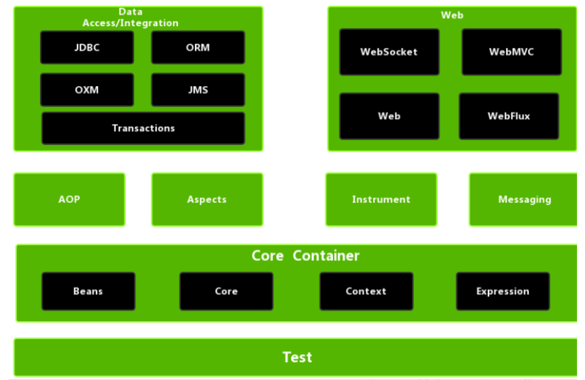
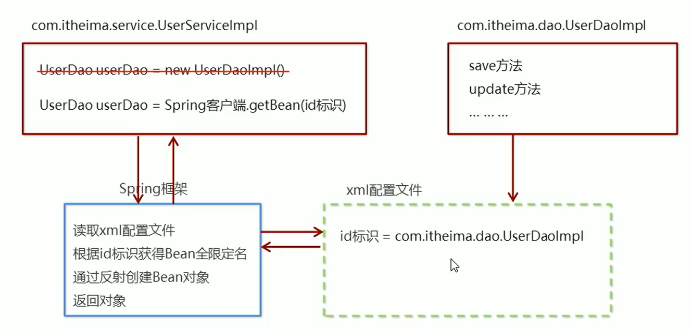

# 一、spring概述

## 1、Spring是什么（理解）


Spring是分层的 Java SE/EE应用 full-stack 轻量级开源框架，


以 IOC（Inverse Of Control：反转控制）和 AOP（Aspect Oriented Programming：面向切面编程）为内核。


提供了展现层 SpringMVC和持久层 Spring JDBCTemplate以及业务层事务管理等众多的企业级应用技术，还能整合开源世界众多著名的第三方框架和类库，逐渐成为使用最多的Java EE 企业应用开源框架


+  Spring 有两个核心部分：IOC 和 Aop 
    -  IOC：控制反转，把创建对象过程交给 Spring 进行管理 
    - Aop：面向切面，不修改源代码进行功能增强 


## 2、Spring发展历程 （了解）


Rod Johnson （ Spring 之父）


2017  年  
9 月份发布了 Spring 的最新版本 Spring5.0  
通用版（GA）


## 3、Spring的优势（理解）


方便解耦，简化开发


AOP 编程的支持


声明式事务的支持


方便程序的测试


方便集成各种优秀的框架


降低JavaEE API的使用难度


java源码是经典学习范例


## 4、Spring的体系结构（了解）





## 5、spring快速入门





①导入 Spring 开发的基本包坐标


②编写 Dao 接口和实现类


③创建 Spring 核心配置文件


④在 Spring 配置文件中配置 UserDaoImpl


⑤使用 Spring 的 API 获得 Bean 实例


1. pom.xml导入Spring开发的基本包坐标


```xml
<properties>
	<spring.version>5.0.5.RELEASE</spring.version>
</properties>

<!--导入spring的context坐标，context依赖core、beans、expression-->
<dependencies> 
    <dependency>  
        <groupId>org.springframework</groupId> 
        <artifactId>spring-context</artifactId> 
        <version>${spring.version}</version>
    </dependency>
</dependencies>
```


2. 编写Dao接口和实现类


```java
public interface UserDao {  
    public void save();
}
```


```java
public class UserDaoImpl implements UserDao {  
    @Override  
    public void save() {
        System.out.println("UserDao save method running....");
    }
}
```


3.  创建Spring核心配置文件

  
在类路径下（resources）创建applicationContext.xml配置文件 


```xml
<?xml version="1.0" encoding="UTF-8"?>
<beans xmlns="http://www.springframework.org/schema/beans"
       xmlns:xsi="http://www.w3.org/2001/XMLSchema-instance"
       xsi:schemaLocation="http://www.springframework.org/schema/beans http://www.springframework.org/schema/beans/spring-beans.xsd">

</beans>
```


4. 在Spring配置文件中配置UserDaoImpl


```xml
<?xml version="1.0" encoding="UTF-8"?>
<beans xmlns="http://www.springframework.org/schema/beans"
       xmlns:xsi="http://www.w3.org/2001/XMLSchema-instance"
       xsi:schemaLocation="http://www.springframework.org/schema/beans http://www.springframework.org/schema/beans/spring-beans.xsd">

    
    <bean id="userDao" class="com.itheima.dao.impl.UserDaoImpl"></bean>

</beans>
```


5. 使用Spring的API获得Bean实例


```java
@Test
public void test1() {

    ApplicationContext context = new ClassPathXmlApplicationContext("applicationContext.xml");
    UserDao userDao = context.getBean("userDao", UserDao.class);
    userDao.save();

}
```


> 更新: 2023-06-13 09:52:01  
> 原文: <https://www.yuque.com/like321/kwpbuz/mcfa20>