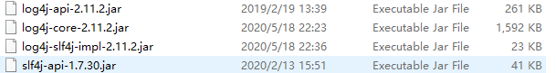

# 七、整合日志框架

Spring 5.0 框架自带了通用的日志封装


+  Spring5 已经移除 Log4jConfigListener，官方建议使用 Log4j2 
+  Spring5 框架整合 Log4j2 


## 引入 jar 包





## 创建 log4j2.xml 配置文件


```xml
<?xml version="1.0" encoding="UTF-8"?>
<!--日志级别以及优先级排序: OFF > FATAL > ERROR > WARN > INFO > DEBUG > TRACE > ALL -->
<!--Configuration后面的status用于设置log4j2自身内部的信息输出，可以不设置，当设置成trace时，可以看到log4j2内部各种详细输出-->
<configuration status="INFO">
    <!--先定义所有的appender-->
    <appenders>
        <!--输出日志信息到控制台-->
        <console name="Console" target="SYSTEM_OUT">
            <!--控制日志输出的格式-->
            <PatternLayout pattern="%d{yyyy-MM-dd HH:mm:ss.SSS} [%t] %-5level %logger{36} - %msg%n"/>
        </console>
    </appenders>
    <!--然后定义logger，只有定义了logger并引入的appender，appender才会生效-->
    <!--root：用于指定项目的根日志，如果没有单独指定Logger，则会使用root作为默认的日志输出-->
    <loggers>
        <root level="info">
            <appender-ref ref="Console"/>
        </root>
    </loggers>
</configuration>
```


## 直接运行代码


因为引入了log4j的日志，所以会在控制台有相关的日志输出


## 手动日志输出


```java
public class UserLog {

    private static final Logger log = LoggerFactory.getLogger(UserLog.class);

    public static void main(String[] args) {
        //输出信息
        log.info("hello log4j2");

        //输出信息
        log.warn("hello log4j2");
    }

}
```


> 更新: 2023-06-13 15:03:27  
> 原文: <https://www.yuque.com/like321/kwpbuz/graif4>