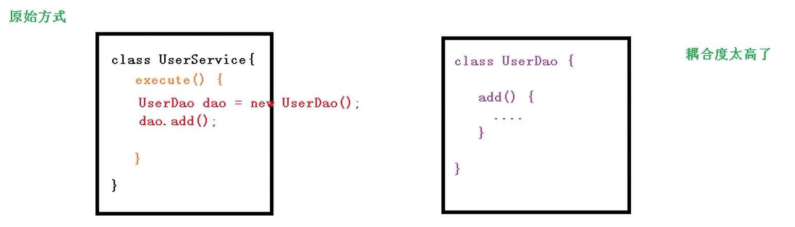
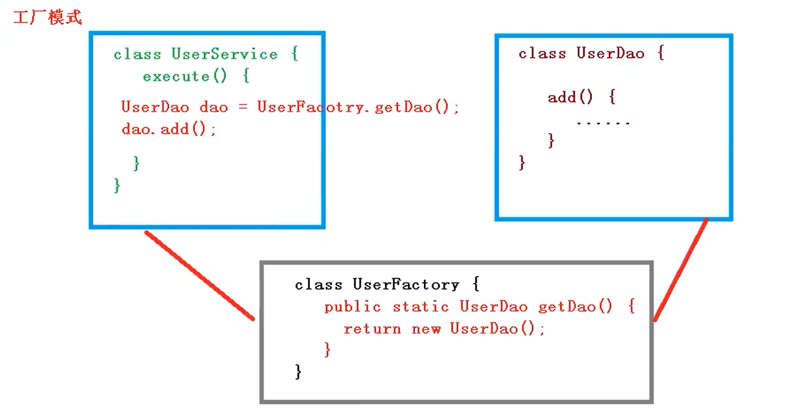
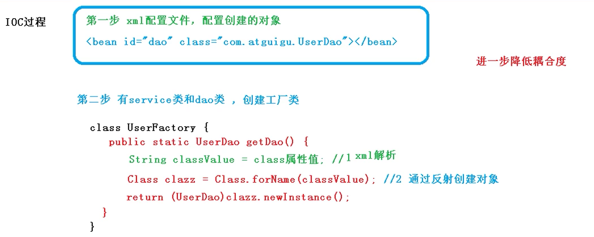
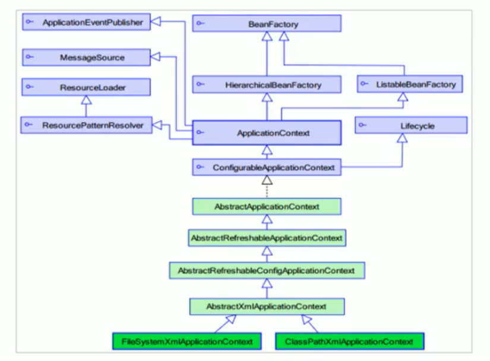
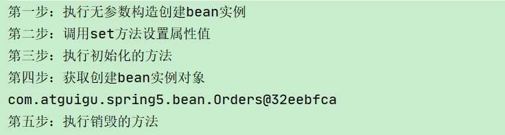
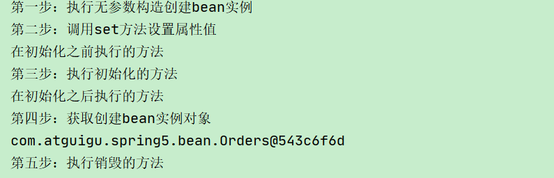
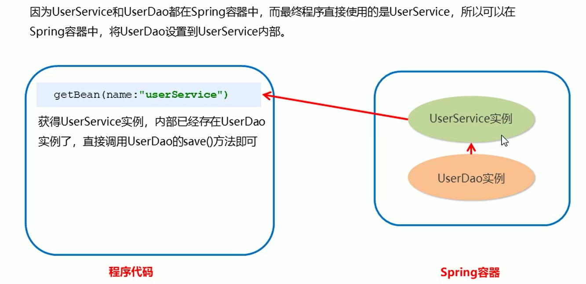
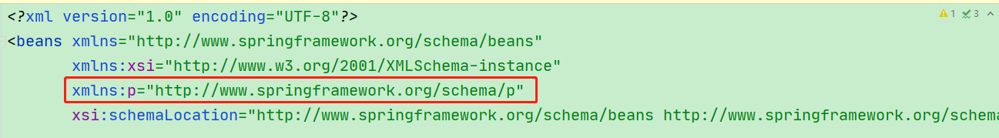

# 二、IOC和DI

什么是 IOC


（1）控制反转，把对象创建和对象之间的调用过程，交给 Spring 进行管理


（2）使用 IOC 目的：为了降低耦合度








## IOC 底层原理


+ xml 解析、
+ 工厂模式、
+ 反射





## BeanFactory接口


+ IOC 思想基于 IOC 容器完成，IOC 容器底层就是对象工厂


+ Spring 提供 IOC 容器实现两种方式：（两个接口） 
    - BeanFactory：IOC 容器基本实现，是 Spring 内部的使用接口，不提供开发人员进行使用 
        * 特点：加载配置文件时候不会创建对象，在获取对象（使用）才去创建对象
    - ApplicationContext：BeanFactory 接口的子接口，提供更多更强大的功能，一般由开发人员进行使用 
        * 特点：<font style="color:#E8323C;">加载配置文件时候就会把在配置文件的对象进行创建</font>


+ ApplicationContext 接口有实现类 
    - FileSystemXmlApplicationContext 
        * 特点：从磁盘路径上加载配置文件
    - ClassPathXmlApplicationContext 
        * 特点：从类的根路径下加载配置文件


### ApplicationContext的继承体系


applicationContext：接口类型，代表应用上下文，可以通过其实例获得 Spring 容器中的 Bean 对象





### ApplicationContext的实现类


+ ClassPathXmlApplicationContext      它是从类的根路径下加载配置文件 推荐使用这种


+ FileSystemXmlApplicationContext      它是从磁盘路径上加载配置文件，配置文件可以在磁盘的任意位置。


+ AnnotationConfigApplicationContext      当使用注解配置容器对象时，需要使用此类来创建 spring 容器。它用来读取注解。


### getBean()方法
使用getBean()方法<font style="color:#E8323C;">从spring容器中获取需要的bean</font>


```java
public Object getBean(String name) throws BeansException {  
	assertBeanFactoryActive();   
	return getBeanFactory().getBean(name);
}

public <T> T getBean(Class<T> requiredType) throws BeansException {   			    	
    assertBeanFactoryActive();
	return getBeanFactory().getBean(requiredType);
}
```


+  当参数的数据类型是字符串时，表示根据Bean的id从容器中获得Bean实例，返回是Object，需要强转。 


+  当参数的数据类型是Class类型时，表示根据类型从容器中匹配Bean实例，当容器中相同类型的Bean有多个时，则此方法会报错 


```java
ApplicationContext applicationContext = new ClassPathXmlApplicationContext("applicationContext.xml");

UserService userService1 = (UserService) applicationContext.getBean("userService");
UserService userService2 = applicationContext.getBean(UserService.class);
```


## IOC 操作 Bean 管理


+  Bean 管理指的是两个操作 
    - Spring 创建对象
    - Spirng 注入属性


+  Bean 管理操作有两种方式 
    - 基于 xml 配置文件
    - 基于注解


# 二、IOC和DI基于XML


### Bean标签


在 spring 配置文件中，使用 bean 标签，标签里面添加对应属性，就可以<font style="color:#E8323C;">实现对象创建</font>


```xml
<!--用于配置对象交由Spring 来创建-->
<bean id="user" class="com.atguigu.spring5.User" ></bean>
```


默认情况下它调用的是<font style="color:#E8323C;">类中的无参构造</font>函数，如果没有无参构造函数则不能创建成功。


基本属性：

+ id：Bean实例在Spring容器中的<font style="color:#E8323C;">唯一标识</font>
+ class：Bean的全限定名称


### Bean实例化三种方式
#### 无参构造


      它会根据默认无参构造方法来创建类对象，如果bean中没有默认无参构造函数，将会创建失败


```xml
<bean id="userDao" class="com.itheima.dao.impl.UserDaoImpl"/>
```


#### 工厂静态


      工厂的静态方法返回Bean实例


```java
public class StaticFactory {

    public static UserDao getUserDao() {
        return new UserDaoImpl();
    }

}
```


```xml
<bean id="userDao" class="com.itheima.factory.StaticFactory" factory-method="getUserDao"/>
```


#### 工厂实例


      工厂的非静态方法返回Bean实例


```java
public class DynamicFactory {

    public UserDao getUserDao() {
        return new UserDaoImpl();
    }

}
```


```xml
<bean id="factory" class="com.itheima.factory.DynamicFactory"/>

<bean id="userDao" factory-bean="factory" factory-method="getUserDao"/>
```


### Bean的作用域


+  在 Spring 里面，设置创建 bean 实例是单实例还是多实例 
+  在 Spring 里面，默认情况下，bean 是单实例对象 


scope：指对象的作用范围

| 取值范围 | 说明 |
| --- | --- |
| singleton | 默认值，单例的 |
| prototype | 多例的 |
| request | WEB   项目中，Spring   创建一个   Bean   的对象，将对象存入到   request   域中 |
| session | WEB   项目中，Spring   创建一个   Bean   的对象，将对象存入到   session   域中 |
| global   session | WEB   项目中，应用在   Portlet   环境，如果没有   Portlet   环境那么globalSession   相当于   session |


#### singleton


+  Bean的实例化个数：1个 
+  Bean的实例化时机：当Spring核心文件被加载时，实例化配置的Bean实例 
+  Bean的生命周期： 
    - 对象创建：当应用加载，创建容器时，对象就被创建了
    - 对象运行：只要容器在，对象一直活着
    - 对象销毁：当应用卸载，销毁容器时，对象就被销毁了


```xml
<bean id="userDao" class="com.itheima.dao.impl.UserDaoImpl" scope="singleton" />
```


```java
//测试scope属性 singleton
@Test
public void test2(){
    ApplicationContext context = new ClassPathXmlApplicationContext("applicationContext.xml");
    
    UserDao userDao1 = context.getBean("userDao", UserDao.class);
    UserDao userDao2 = context.getBean("userDao", UserDao.class);
    System.out.println(userDao1);
    System.out.println(userDao2);
}
```


#### prototype


+ Bean的实例化个数：多个
+ Bean的实例化时机：当调用getBean()方法时实例化Bean
+ Bean的生命周期： 
    - 对象创建：当使用对象时，创建新的对象实例
    - 对象运行：只要对象在使用中，就一直活着
    - 对象销毁：当对象长时间不用时，被 Java 的垃圾回收器回收了


```xml
<bean id="userDao" class="com.itheima.dao.impl.UserDaoImpl" scope="prototype" />
```


```java
//测试scope属性 prototype
@Test
public void test2(){
    ApplicationContext context = new ClassPathXmlApplicationContext("applicationContext.xml");
    
    UserDao userDao1 = context.getBean("userDao", UserDao.class);
    UserDao userDao2 = context.getBean("userDao", UserDao.class);
    System.out.println(userDao1);
    System.out.println(userDao2);
}
```


### Bean生命周期


+ 生命周期：从对象创建到对象销毁的过程
+ bean 生命周期 
    - 通过构造器创建 bean 实例（无参数构造）
    - 为 bean 的属性设置值和对其他 bean 引用（调用 set 方法）
    - 调用 bean 的初始化的方法（需要进行配置初始化的方法）
    - bean 可以使用了（对象获取到了）
    - 当容器关闭时候，调用 bean 的销毁的方法（需要进行配置销毁的方法）


**init-method：指定类中的初始化方法名称**


**destroy-method：指定类中的销毁方法名称**


+ 演示 bean 生命周期


```xml
<bean id="orders" class="com.atguigu.spring5.bean.Orders" init-method="initMethod" destroy-method="destroyMethod">
    <property name="oname" value="手机"></property>
</bean>
```


```java
public class Orders {

    private String oname;

    public Orders() {
        System.out.println("第一步：执行无参数构造创建bean实例");
    }
    
    public void setOname(String oname) {
        this.oname = oname;
        System.out.println("第二步：调用set方法设置属性值");
    }
    
    //创建执行的初始化方法
    public void initMethod() {
        System.out.println("第三步：执行初始化的方法");
    }

    //创建执行的销毁的方法
    public void destroyMethod() {
        System.out.println("第五步：执行销毁的方法");
    }
}
```


```java
    @Test
    public void test2() {
        
//        ApplicationContext context = new ClassPathXmlApplicationContext("applicationContext.xml");
        ClassPathXmlApplicationContext context = new ClassPathXmlApplicationContext("applicationContext.xml");

        Orders orders = context.getBean("orders", Orders.class);
        System.out.println("第四步：获取创建bean实例对象");
        System.out.println(orders);
        
        //手动让bean销毁
        //        ((ClassPathXmlApplicationContext) context).close();
        context.close();
    }
```





#### bean 的后置处理器


bean 生命周期有七步


+ 通过构造器创建 bean 实例（无参数构造）
+ 为 bean 的属性设置值和对其他 bean 引用（调用 set 方法）
+ **<font style="color:#E8323C;">把 bean 实例传递 bean 后置处理器的方法 postProcessBeforeInitialization </font>**
+ 调用 bean 的初始化的方法（需要进行配置初始化的方法）
+ **<font style="color:#E8323C;">把 bean 实例传递 bean 后置处理器的方法 postProcessAfterInitialization</font>**
+ bean 可以使用了（对象获取到了）
+ 当容器关闭时候，调用 bean 的销毁的方法（需要进行配置销毁的方法）


**添加后置处理器效果**


（1）创建类，实现接口 BeanPostProcessor，创建后置处理器


```java
public class MyBeanPost implements BeanPostProcessor {

    @Override
    public Object postProcessBeforeInitialization(Object bean, String beanName) throws BeansException {
        System.out.println("在初始化之前执行的方法");
        return bean;
    }

    @Override
    public Object postProcessAfterInitialization(Object bean, String beanName) throws BeansException {
        System.out.println("在初始化之后执行的方法");
        return bean;
    }

}
```


（2）配置后置处理器


```xml
<bean id="orders" class="com.atguigu.spring5.bean.Orders" init-method="initMethod" destroy-method="destroyMethod">
    <property name="oname" value="手机"></property>
</bean>

<!--    配置后置处理器 会为当前配置文件里所有对象都执行后置处理器方法 -->
<bean id="myBeanPost" class="com.atguigu.spring5.bean.MyBeanPost"></bean>
```




### Bean的DI概念


**DI：****<font style="color:#E8323C;">依赖注入，就是注入属性</font>**


依赖注入（Dependency Injection）：它是 Spring 框架核心<font style="color:#E8323C;"> IOC 的具体实现。</font>


在编写程序时，通过<font style="color:#E8323C;">控制反转，把对象的创建交给了 Spring</font>，但是代码中不可能出现没有依赖的情况。


IOC 解耦只是降低他们的依赖关系，但不会消除。


例如：业务层仍会调用持久层的方法。

那这种业务层和持久层的依赖关系，在使用Spring之后，就让Spring来维护了。

简单的说，就是坐等框架把持久层对象传入业务层，而不用我们自己去获取




### Bean的依赖注入入门


+ 创建 UserService接口


```java
public interface UserService {

    public void save();

}
```


UserServiceImpl 内部再调用 UserDao 的 save() 方法


```java
public class UserServiceImpl implements UserService {
    
    @Override
    public void save() {
        ApplicationContext context = new ClassPathXmlApplicationContext("applicationContext.xml");   
        
        UserDao userDao = (UserDao) context.getBean("userDao");	
        userDao.save();
    }
    
}
```


+ 将 UserServiceImpl 的创建权交给 Spring


```xml
<bean id="userService" class="com.itheima.service.impl.UserServiceImpl" />
```


+ 从 Spring 容器中获得 UserService 进行操作


```java
@Test
public void test() {
    ApplicationContext context = new ClassPathXmlApplicationContext("applicationContext.xml");

    UserService userService = context.getBean("userService", UserService.class);
    userService.save();
}
```


### Bean的依赖注入方式


#### 有参构造


+ 创建类，定义属性，创建属性对应有参数构造方法


```java
public class UserServiceImpl implements UserService {

    private UserDao userDao;

    public UserServiceImpl() {
    }

    public UserServiceImpl(UserDao userDao) {
        this.userDao = userDao;
    }

    @Override
    public void save() {
        userDao.save();
    }
}
```


+ 配置Spring容器调用有参构造时进行注入


```xml
<bean id="userDao" class="com.itheima.dao.impl.UserDaoImpl" />

<bean id="userService" class="com.itheima.service.impl.UserServiceImpl">
    <constructor-arg name="userDao" ref="userDao"></constructor-arg>
</bean>
```


```java
@Test
public void test() {
    ApplicationContext context = new ClassPathXmlApplicationContext("applicationContext.xml");

    UserService userService = context.getBean("userService", UserService.class);
    userService.save();
}
```


#### set方法


+ 创建类，定义属性和对应的set方法


```java
public class UserServiceImpl implements UserService {

    private UserDao userDao;

    public void setUserDao(UserDao userDao) {
        this.userDao = userDao;
    }

    @Override
    public void save() {
        userDao.save();
    }
}
```


+ 配置Spring容器调用set方法进行注入


```xml
<bean id="userDao" class="com.itheima.dao.impl.UserDaoImpl" />

<bean id="userService" class="com.itheima.service.impl.UserServiceImpl">
    <!--使用 property 完成属性注入
     name：类里面属性名称
     value：向属性注入的值
     -->
    <property name="userDao" ref="userDao"></property>
</bean>
```


```java
@Test
public void test() {
    ApplicationContext context = new ClassPathXmlApplicationContext("applicationContext.xml");

    UserService userService = context.getBean("userService", UserService.class);
    userService.save();
}
```


#### P命名空间


P命名空间注入本质也是set方法注入，但比起上述的set方法注入更加方便，主要体现在配置文件中：


+ 首先，需要引入P命名空间：


```xml
xmlns:p="http://www.springframework.org/schema/p"
```





+ 其次，需要修改注入方式，在 bean 标签里面进行操作


```xml
<bean id="userDao" class="com.itheima.dao.impl.UserDaoImpl" />

<bean id="userService" class="com.itheima.service.impl.UserServiceImpl" p:userDao-ref="userDao"/>
```


### Bean的依赖注入的数据类型


上面的操作，都是注入的引用Bean，除了对象的引用可以注入，普通数据类型，集合等都可以在容器中进行注入。


注入数据的三种数据类型

+  普通数据类型 
+  引用数据类型 
+  集合数据类型 


下面将以set方法注入为例：


#### 注入空值和特殊符号


```java
public class Book {

    private String bname;
    private String bauthor;
    private String address;


    public void setBname(String bname){
        this.bname = bname;
    }

    public void setBauthor(String bauthor) {
        this.bauthor = bauthor;
    }

    public void setAddress(String address) {
        this.address = address;
    }
}
```


+ 注入null值


```xml
<bean id="book" class="com.atguigu.spring5.Book">
    <!--        使用property完成属性注入-->
    <property name="bname" value="书名"></property>
    <property name="bauthor" value="作者"></property>
    <property name="address">
        <null></null>
    </property>
</bean>
```


+ 属性值包含特殊符号


```xml
<bean id="book" class="com.atguigu.spring5.Book">
    <!--        使用property完成属性注入-->
    <property name="bname" value="书名"></property>
    <property name="bauthor" value="作者"></property>
    <!--属性值包含特殊符号
     1 把<>进行转义 &lt; &gt;
     2 把带特殊符号内容写到 CDATA
    -->
    <property name="address">
        <value><![CDATA[<<南京>>]]></value>
    </property>
</bean>
```


#### 注入属性-外部bean


+ 创建两个类 service 类和 dao 类
+ 在 service 调用 dao 里面的方法


```java
public class UserService {

    //创建UserDao类型属性
    private UserDao userDao;

    //生成set方法
    public void setUserDao(UserDao userDao) {
        this.userDao = userDao;
    }

    public void add() {
        System.out.println("service add ...........");
        userDao.update();
    }
}
```


```java
public interface UserDao {
    public void update();
}
```


```java
public class UserDaoImpl implements UserDao{

    @Override
    public void update(){
        System.out.println("dao update");
    }

}
```


+ 在 spring 配置文件中进行配置


```xml
<bean id="userDaoImpl" class="com.atguigu.spring5.dao.UserDaoImpl"></bean>

<bean id="userService" class="com.atguigu.spring5.service.UserService">
 <!--注入 userDao 对象
 name 属性：类里面属性名称
 ref 属性：创建 userDao 对象 bean 标签 id 值
 -->
 <property name="userDao" ref="userDaoImpl"></property>
</bean>
```


#### 注入属性-内部bean


（1）一对多关系：一个部门有多个员工，一个员工属于一个部门。部门是一，员工是多


（2）在实体类之间表示一对多关系，员工表示所属部门，使用对象类型属性进行表示


+ 部门类：


```java
public class Dept {

    private String dname;

    public void setDname(String dname) {
        this.dname = dname;
    }

    @Override
    public String toString() {
        return "Dept{" +
                "dname='" + dname + '\'' +
                '}';
    }
}
```


+ 员工类


```java
public class Emp {
    
    private String ename;
    private String gender;

    //员工属于某一个部门，使用对象形式表示
    private Dept dept;

    public void setDept(Dept dept) {
        this.dept = dept;
    }

    public void setEname(String ename) {
        this.ename = ename;
    }

    public void setGender(String gender) {
        this.gender = gender;
    }

    public void add() {
        System.out.println(ename + "," + gender + "," + dept);
    }

}
```


（3）在 spring 配置文件中进行配置


```xml
<!--内部 bean--> 
<bean id="emp" class="com.atguigu.spring5.bean.Emp">
    
    <!--设置两个普通属性-->
    <property name="ename" value="lucy"></property>
    <property name="gender" value="女"></property>
    
    <!--设置对象类型属性-->
    <property name="dept">
        <bean id="dept" class="com.atguigu.spring5.bean.Dept">
            <property name="dname" value="安保部"></property>
        </bean>
    </property>
    
</bean>
```


#### 注入属性-级联赋值


+ 第一种写法：


```xml
<bean id="dept" class="com.atguigu.spring5.bean.Dept">
    <property name="dname" value="财务部"></property>
</bean>

<!--级联赋值--> 
<bean id="emp" class="com.atguigu.spring5.bean.Emp">
    
    <!--设置两个普通属性-->
    <property name="ename" value="lucy"></property>
    <property name="gender" value="女"></property>
    
    <!--级联赋值-->
    <property name="dept" ref="dept"></property>
</bean>
```


+ 第二种写法：一定要写get()方法


```java
public class Emp {
    private String ename;
    private String gender;

    //员工属于某一个部门，使用对象形式表示
    private Dept dept;

    //一定要写get
    public Dept getDept() {
        return dept;
    }

    public void setDept(Dept dept) {
        this.dept = dept;
    }

    public void setEname(String ename) {
        this.ename = ename;
    }

    public void setGender(String gender) {
        this.gender = gender;
    }

    public void add() {
        System.out.println(ename + "," + gender + "," + dept);
    }

}
```


```xml
<bean id="dept" class="com.atguigu.spring5.bean.Dept"></bean>

<!--级联赋值--> 
<bean id="emp" class="com.atguigu.spring5.bean.Emp">
    <!--设置两个普通属性-->
    <property name="ename" value="lucy"></property>
    <property name="gender" value="女"></property>
    <!--级联赋值-->
    <property name="dept" ref="dept"></property>
    <property name="dept.dname" value="技术部"></property>
</bean>
```


#### 普通数据类型注入


```java
public class UserDaoImpl implements UserDao {

    private String username;
    private int age;

    public void setUsername(String username) {
        this.username = username;
    }

    public void setAge(int age) {
        this.age = age;
    }

    @Override
    public void save() {
        System.out.println("username" + "----------" + username);
        System.out.println("age" + "----------" + age);
        System.out.println("save running...");
    }
}
```


```xml
<bean id="userDao" class="com.itheima.dao.impl.UserDaoImpl">
    <property name="username" value="张三"></property>
    <property name="age" value="22"></property>
</bean>
```


#### 集合 Array 注入


```java
public class Student {

    //数组类型的属性
    private String[] courses;

    public void setCourses(String[] courses) {
        this.courses = courses;
    }
}
```


```xml
<bean id="student" class="com.atguigu.spring5.collectiontype.Student">
    <!--     数组类型属性注入-->
    <property name="courses">
        <array>
            <value>java课程</value>
            <value>数据库课程</value>
        </array>
    </property>
</bean>
```


#### 集合 List< String> 注入


```java
public class UserDaoImpl implements UserDao {

    private List<String> stringList;

    public void setStringList(List<String> stringList) {
        this.stringList = stringList;
    }

    @Override
    public void save() {
        System.out.println(stringList);
        System.out.println("save running...");
    }
}
```


```xml
<bean id="userDao" class="com.itheima.dao.impl.UserDaoImpl">
    <property name="stringList">
        <list>
            <value>aaa</value>
            <value>bbb</value>
            <value>ccc</value>
        </list>
    </property>
</bean>
```


#### 集合 List< User> 注入


```java
public class UserDaoImpl implements UserDao {

    private List<User> userList;

    public void setUserList(List<User> userList) {
        this.userList = userList;  
    }
    
    public void save() {
        System.out.println(userList);
        System.out.println("UserDao save method running....");
    }
}
```


```xml
<bean id="user1" class="com.itheima.domain.User">
    <property name="name" value="Tom"></property>
    <property name="address" value="北京"></property>
</bean>
<bean id="user2" class="com.itheima.domain.User">
    <property name="name" value="Lucy"></property>
    <property name="address" value="天津"></property>
</bean>

<bean id="userDao" class="com.itheima.dao.impl.UserDaoImpl">
    <property name="userList">
        <list>
            <bean class="com.itheima.domain.User"/>
            <bean class="com.itheima.domain.User"/>
            <ref bean="user1"/>
            <ref bean="user2"/>       
        </list>
    </property>
</bean>
```


#### 集合 Map<String,String> 注入


```java
public class Student {

    //创建Map集合类型属性
    private Map<String,String> maps;

    public void setMaps(Map<String, String> maps) {
        this.maps = maps;
    }
 
}
```


```xml
<bean id="student" class="com.atguigu.spring5.collectiontype.Student">
    <!--     map类型属性注入-->
    <property name="maps">
        <map>
            <entry key="JAVA" value="java"></entry>
            <entry key="PHP" value="php"></entry>
        </map>
    </property>
</bean>
```


#### 集合 Map<String,User> 注入


```java
public class UserDaoImpl implements UserDao {

    private Map<String, User> userMap;

    public void setUserMap(Map<String, User> userMap) {
        this.userMap = userMap;
    }

    @Override
    public void save() {
        System.out.println(userMap);
        System.out.println("save running...");
    }
}
```


```xml
<bean id="user1" class="com.itheima.domain.User">
    <property name="name" value="Tom"></property>
    <property name="address" value="北京"></property>
</bean>
<bean id="user2" class="com.itheima.domain.User">
    <property name="name" value="Lucy"></property>
    <property name="address" value="天津"></property>
</bean>


<bean id="userDao" class="com.itheima.dao.impl.UserDaoImpl">
    <property name="userMap">
        <map>
            <entry key="user1" value-ref="user1"></entry>
            <entry key="user2" value-ref="user2"></entry>
        </map>
    </property>
</bean>
```


#### 集合 set 注入


```java
public class Student {

    //创建set集合类型属性
    private Set<String> sets;

    public void setSets(Set<String> sets) {
        this.sets = sets;
    }

}
```


```xml
<bean id="student" class="com.atguigu.spring5.collectiontype.Student">
    <!--     set类型属性注入-->
    <property name="sets">
        <set>
            <value>MySQL</value>
            <value>Redis</value>
        </set>
    </property>
</bean>
```


#### 集合 Properties 注入


```java
public class UserDaoImpl implements UserDao {

    private Properties properties;

    public void setProperties(Properties properties) {
        this.properties = properties;
    }

    @Override
    public void save() {
        System.out.println(properties);
        System.out.println("save running...");
    }
}
```


```xml
<bean id="userDao" class="com.itheima.dao.impl.UserDaoImpl">
    <property name="properties">
        <props>
            <prop key="p1">ppp1</prop>
            <prop key="p2">ppp2</prop>
            <prop key="p3">ppp3</prop>
        </props>
    </property>
</bean>
```


#### 把集合注入部分提取：util 标签


```java
public class Book {

    private List<String> list;

    public void setList(List<String> list) {
        this.list = list;
    }

    public void test(){
        System.out.println(list);
    }
}
```


（1）在 spring 配置文件中引入名称空间 util


```xml
<beans xmlns="http://www.springframework.org/schema/beans"
       xmlns:xsi="http://www.w3.org/2001/XMLSchema-instance"
       xmlns:util="http://www.springframework.org/schema/util"
       xsi:schemaLocation="http://www.springframework.org/schema/beans http://www.springframework.org/schema/beans/spring-beans.xsd
                            http://www.springframework.org/schema/util http://www.springframework.org/schema/util/spring-util.xsd">
```


（2）使用 util 标签完成 list 集合注入提取


```xml
<!--    提取list集合类型属性注入-->
<util:list id="bookList">
    <value>易筋经</value>
    <value>九阴真经</value>
    <value>九阳神功</value>
</util:list>

<!--    提取list集合类型属性注入-->
<bean id="book" class="com.atguigu.spring5.collectiontype.Book">
    <property name="list" ref="bookList"></property>
</bean>
```


### xml自动装配
**<font style="color:#DF2A3F;">什么是bean的自动装配？</font>**

<font style="color:rgb(51,51,51);">在Spring框架中，在配置文件中设定bean的依赖关系是一个很好的机制，Spring 容器能够自动装配相互合作的bean，这意味着容器不需要和配置，能通过Bean工厂自动处理bean之间的协作。 </font>

<font style="color:rgb(51,51,51);">这意味着 Spring可以通过向Bean Factory中注入的方式自动搞定bean之间的依赖关系。自动装配可以设置在每个bean上，也可以设定在特定的bean上。</font>


<font style="color:rgb(51,51,51);">Spring 容器能够自动装配相互合作的bean ， 这意味着容器不需要 <constructor-arg>和<property>配置，能通过 Bean 工厂自动处理 bean 之间的协作。</font>


根据指定装配规则（属性名称或者属性类型），Spring 自动将匹配的属性值进行注入

```java
public class Dept {

    @Override
    public String toString() {
        return "Dept{}";
    }
}
```


```java
public class Emp {

    private Dept dept;

    public void setDept(Dept dept) {
        this.dept = dept;
    }

    @Override
    public String toString() {
        return "Emp{" +
                "dept=" + dept +
                '}';
    }

}
```


#### byName 根据属性名称


```xml
<!--实现自动装配
 bean 标签属性 autowire，配置自动装配
 autowire 属性常用两个值：
   byName 根据属性名称注入 ，注入值 bean 的 id 值和类属性名称一样
   byType 根据属性类型注入
-->
<bean id="emp" class="com.atguigu.spring5.autowire.Emp" autowire="byName"/>
<bean id="dept" class="com.atguigu.spring5.autowire.Dept" />
```


#### byType 根据属性类型


```xml
<!--实现自动装配
 bean 标签属性 autowire，配置自动装配
 autowire 属性常用两个值：
   byName 根据属性名称注入 ，注入值 bean 的 id 值和类属性名称一样
   byType 根据属性类型注入
-->
<bean id="emp" class="com.atguigu.spring5.autowire.Emp" autowire="byType"/>
<bean id="dept" class="com.atguigu.spring5.autowire.Dept" />
```


### 引入外部属性文件


引入外部属性文件配置数据库连接池


（1）创建外部属性文件，properties 格式文件，写数据库信息


```properties
prop.driverClass=com.mysql.jdbc.Driver
prop.url=jdbc:mysql://localhost:3306/userDb
prop.userName=root
prop.password=root
```


（2）把外部 properties 属性文件引入到 spring 配置文件中


**<font style="color:#DF2A3F;">引入 context 名称空间</font>**

```xml
<beans xmlns="http://www.springframework.org/schema/beans"
       xmlns:xsi="http://www.w3.org/2001/XMLSchema-instance"
       xmlns:util="http://www.springframework.org/schema/util"
       xmlns:context="http://www.springframework.org/schema/context"
       xsi:schemaLocation="http://www.springframework.org/schema/beans http://www.springframework.org/schema/beans/spring-beans.xsd
                            http://www.springframework.org/schema/util http://www.springframework.org/schema/util/spring-util.xsd
http://www.springframework.org/schema/context http://www.springframework.org/schema/context/spring-context.xsd">
```


**在spring配置文件使用标签引入外部属性文件**

```xml
<!--    引入外部属性文件-->
<context:property-placeholder location="classpath:jdbc.properties"></context:property-placeholder>
     
<bean id ="dataSource" class="com.alibaba.druid.pool.DruidDataSource">
  <property name="driverClassName" value="${prop.driverClass}"></property>
  <property name="url" value="${prop.url}"></property>
  <property name="username" value="${prop.userName}"></property>
  <property name="password" value="${prop.password}"></property>
</bean>
```


### 引入其他配置文件


实际开发中，Spring的配置内容非常多，这就导致Spring配置很繁杂且体积很大，所以，可以将部分配置拆解到其他配置文件中，而在Spring主配置文件通过import标签进行加载


```xml
<import resource="applicationContext-user.xml"></import>
<import resource="applicationContext-product.xml"></import>
```


### FactoryBean


Spring 有两种类型 bean ，一种普通 bean，另外一种工厂 bean（FactoryBean）


+ 普通 bean：在配置文件中定义的 bean 类型就是返回类型
+ 工厂 bean（FactoryBean） ：在配置文件定义的 bean 类型可以和返回类型不一样


```java
//第一步 创建类，让这个类作为工厂 bean，实现接口 FactoryBean
public class MyBean implements FactoryBean<Course> {

    //定义返回bean  第二步 实现接口里面的方法，在实现的方法中定义返回的 bean 类型
    @Override
    public Course getObject() throws Exception {
        Course course = new Course();
        course.setCname("abc");
        return course;
    }

    @Override
    public Class<?> getObjectType() {
        return null;
    }

    @Override
    public boolean isSingleton() {
        return false;
    }
}
```


```xml
<bean id="myBean" class="com.atguigu.spring5.factorybean.MyBean"></bean>
```


```java
@Test
public void test3() {
    ApplicationContext context = new ClassPathXmlApplicationContext("bean3.xml");
    Course course = context.getBean("myBean", Course.class);
    System.out.println(course);
}
```

# 三、IOC和DI基于注解


Spring是轻代码而重配置的框架，配置比较繁重，影响开发效率，所以注解开发是一种趋势，注解代替xml配置文件可以简化配置，提高开发效率。


什么是注解

+ 注解是代码特殊标记，格式：@注解名称(属性名称=属性值, 属性名称=属性值..)
+ 使用注解：注解作用在类上面，方法上面，属性上面
+ 使用注解目的：<font style="color:#E8323C;">简化 xml 配置</font>


## 组件扫描


注意：使用注解进行开发时，需要在applicationContext.xml中配置组件扫描，


作用：指定哪个包及其子包下的Bean需要进行扫描以便识别使用注解配置的类、字段和方法。


```xml
<!--开启组件扫描
   1 如果扫描多个包，多个包使用逗号隔开
   2 扫描包上层目录
-->
<context:component-scan base-package="com.atguigu.spring5"></context:component-scan>

<context:component-scan base-package="com.atguigu.spring5.dao,com.atguigu.spring5.service"></context:component-scan>
```


**<font style="color:#DF2A3F;">组件扫描细节配置</font>**

```xml
<!--示例 1
 use-default-filters="false" 表示现在不使用默认 filter，自己配置 filter
 context:include-filter ，设置扫描哪些内容
-->
<context:component-scan base-package="com.atguigu" use-default-filters="false">
    <context:include-filter type="annotation" expression="org.springframework.stereotype.Controller"/>
</context:component-scan>

<!--示例 2
 使用默认 filter, 扫描所有内容
 context:exclude-filter： 设置哪些内容不进行扫描
-->
<context:component-scan base-package="com.atguigu">
    <context:exclude-filter type="annotation" expression="org.springframework.stereotype.Controller"/>
</context:component-scan>
```


## Spring原始注解


Spring原始注解主要是替代<Bean>的配置

| 注解 | 说明 |
| --- | --- |
| [@Component ](/Component ) | 使用在类上  用于实例化Bean |
| [@Controller ](/Controller ) | 使用在web层类上  用于实例化Bean |
| [@Service ](/Service ) | 使用在service层类上  用于实例化Bean |
| [@Repository ](/Repository ) | 使用在dao层类上  用于实例化Bean |
| [@Autowired ](/Autowired ) | 使用在字段上  用于根据<font style="color:#DF2A3F;">类型</font>依赖注入 |
| [@Qualifier ](/Qualifier ) | 结合@Autowired一起使用  用于根据<font style="color:#DF2A3F;">名称</font>进行依赖注入 |
| [@Resource ](/Resource ) | 相当于@Autowired+@Qualifier，按照<font style="color:#DF2A3F;">名称</font>进行注入 |
| [@Value ](/Value ) | 注入普通属性 |
| [@Scope ](/Scope ) | 标注Bean的作用范围 |
| [@PostConstruct ](/PostConstruct ) | 使用在方法上  标注该方法是Bean的初始化方法 |
| [@PreDestroy ](/PreDestroy ) | 使用在方法上  标注该方法是Bean的销毁方法 |


### @Compont或@Repository  


使用@Compont或@Repository标识UserDaoImpl需要Spring进行实例化。


```java
//@Component("userDao")
@Repository("userDao")
public class UserDaoImpl implements UserDao {
    
    @Override
    public void save() {
        System.out.println("save running... ...");
    }
    
}
```


### @Compont或@Service  


使用@Compont或@Service标识UserServiceImpl需要Spring进行实例化


使用@Autowired或者@Autowired+@Qulifier或者@Resource进行userDao的注入


```java
//@Component("userService")
@Service("userService")
public class UserServiceImpl implements UserService {

    /*
    	@Autowired //按照数据类型从Spring容器中进行匹配
	    @Qualifier("userDao") //按照id值从spring容器中进行匹配，但是@Qualifier要结合@Autowired一起使用
    */
    @Resource(name="userDao") //@Resource相当于@Qualifier+@Autowired
    private UserDao userDao;

    @Override
    public void save() {       
        userDao.save();
    }

}
```


### @Value  


使用@Value进行字符串的注入


jdbc.properties

```properties
jdbc.driver=com.mysql.jdbc.Driver
jdbc.url=jdbc:mysql://localhost:3306/book
jdbc.username=root
jdbc.password=root
```


applicationContext.xml

```xml
<context:property-placeholder location="classpath:jdbc.properties"></context:property-placeholder>
```


```java
@Repository("userDao")
public class UserDaoImpl implements UserDao {
  
    @Value("${jdbc.driver}")
    private String driver;
    
    @Override
    public void save() {
        System.out.println(driver);
        System.out.println("save running... ...");
    }
    
}
```


### @Scope  


使用@Scope标注Bean的范围


```java
//@Scope("prototype")
@Scope("singleton")
public class UserDaoImpl implements UserDao {
   //此处省略代码
}
```


### @PostConstruct/@PreDestroy  


使用@PostConstruct标注初始化方法，使用@PreDestroy标注销毁方法


```java
@PostConstruct
public void init(){
	System.out.println("初始化方法....");
}

@PreDestroy
public void destroy(){
	System.out.println("销毁方法.....");
}
```


## Spring新注解


使用上面的注解还不能全部替代xml配置文件，还需要使用注解替代的配置如下：

+  非自定义的Bean的配置：<bean> 
+  加载properties文件的配置：<context:property-placeholder> 
+  组件扫描的配置：<context:component-scan> 
+  引入其他文件：<import> 

| 注解 | 说明 |
| --- | --- |
| [@Configuration ](/Configuration ) | 用于指定当前类是一个 Spring   配置类，当创建容器时会从该类上加载注解 |
| [@ComponentScan ](/ComponentScan ) | 用于指定 Spring 在初始化容器时要扫描的包。作用和在 Spring 的 xml 配置文件中的  <context:component-scan   base-package="com.itheima"/>一样 |
| [@Bean ](/Bean ) | 使用在方法上，标注将该方法的返回值存储到   Spring   容器中 |
| [@PropertySource ](/PropertySource ) | 用于加载.properties   文件中的配置 |
| [@Import ](/Import ) | 用于导入其他配置类 |


### @Configuration/@ComponentScan/@Import  


@Configuration   作为配置类，替代xml配置文件 


```java
@Configuration //标志该类是Spring的核心配置类
@ComponentScan("com.itheima") // 配置组件扫描 <context:component-scan base-package="com.itheima"/>
@Import({DataSourceConfiguration.class}) // 加载分配置文件 <import resource=""/>
public class SpringConfiguration {


}
```


### @PropertySource/@value  


```java
@PropertySource("classpath:jdbc.properties")  //加载properties配置文件 <context:property-placeholder location="classpath:jdbc.properties" />
public class DataSourceConfiguration {

    @Value("${jdbc.driver}")
    private String driver;
    @Value("${jdbc.url}")
    private String url;
    @Value("${jdbc.username}")
    private String username;
    @Value("${jdbc.password}")
    private String password;

}
```


### @Bean   


```java
@PropertySource("classpath:jdbc.properties")  //加载properties配置文件 <context:property-placeholder location="classpath:jdbc.properties" />
public class DataSourceConfiguration {

    @Value("${jdbc.driver}")
    private String driver;
    @Value("${jdbc.url}")
    private String url;
    @Value("${jdbc.username}")
    private String username;
    @Value("${jdbc.password}")
    private String password;

	//Spring会将当前方法的返回值以指定名称存储到Spring容器中
    @Bean(name="dataSource") 
    public DataSource getDataSource() throws PropertyVetoException {
        
        ComboPooledDataSource dataSource = new ComboPooledDataSource();
        
        dataSource.setDriverClass(driver);
        dataSource.setJdbcUrl(url);
        dataSource.setUser(username);
        dataSource.setPassword(password);
        
        return dataSource;
    }

}
```


### AnnotationConfigApplicationContext创建Spring容器


```java
@Test
public void testAnnoConfiguration() throws Exception {
	//加载配置类
    ApplicationContext context = new AnnotationConfigApplicationContext(SpringConfiguration.class);

    UserService userService = context.getBean("userService", UserService.class);
    userService.save();

    DataSource dataSource = context.getBean("dataSource", DataSource.class);
    Connection connection = dataSource.getConnection();
    System.out.println(connection);
}
```


> 更新: 2023-06-13 10:38:07  
> 原文: <https://www.yuque.com/like321/kwpbuz/ossd7x>