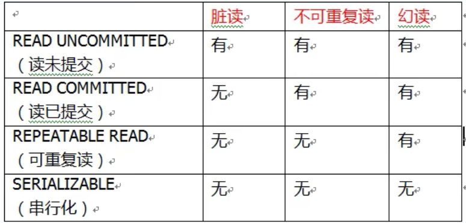

# 六、声明式事务控制


+  事务添加到 JavaEE 三层结构里面 Service 层（业务逻辑层） 
+  在 Spring 进行事务管理操作 有两种方式：
    - 编程式事务管理	
    - 声明式事务管理（使用）
+  声明式事务管理 
    - 基于注解方式（使用）
    - 基于 xml 配置文件方式
+  在 Spring 进行声明式事务管理，<font style="color:#E8323C;">底层使用 AOP 原理 </font>


## 一、编程式事务控制相关对象(了解)


编程式事务控制三大对象

+  PlatformTransactionManager 
+  TransactionDefinition 
+  TransactionStatus 


### 1、PlatformTransactionManager


PlatformTransactionManager 接口是 spring 的事务管理器，它里面提供了我们常用的操作事务的方法。


注意：PlatformTransactionManager 是接口类型，不同的 Dao 层技术则有不同的实现类，


+ **DataSourceTransactionManager **
    - Dao 层技术是jdbc 或 mybatis 时：org.springframework.jdbc.datasource.DataSourceTransactionManager


+ **HibernateTransactionManager**
    - Dao 层技术是hibernate时：org.springframework.orm.hibernate5.HibernateTransactionManager


### 2、TransactionDefinition


TransactionDefinition 是事务的定义信息对象，里面有如下方法：


1. 事务隔离级别

设置隔离级别，可以解决事务并发产生的问题，如脏读、不可重复读和虚读。

    1. ISOLATION_DEFAULT 
    2. ISOLATION_READ_UNCOMMITTED 
    3. ISOLATION_READ_COMMITTED 
    4. ISOLATION_REPEATABLE_READ 
    5. ISOLATION_SERIALIZABLE 


2. 事务传播行为

**<font style="color:#E8323C;">当事务方法被另一个方法调用时，必须指定事务应该如何传播。</font>**

例如：方法可能继续在现有事务中运行，也可能开启一个新事务，并在自己的事务中运行。

事务的传播行为可以由传播属性指定。Spring定义了7种类传播行为。

    1. **REQUIRED：如果当前没有事务，就新建一个事务，如果已经存在一个事务中，加入到这个事务中。（默认）** 
    2. REQUERS_NEW：新建事务，如果当前存在事务，把当前事务挂起。 
    3. **SUPPORTS：支持当前事务，如果当前没有事务，就以非事务方式执行（没有事务）**
    4. NOT_SUPPORTED：不支持当前事务，如果当前存在事务，把当前事务挂起 
    5. MANDATORY：强制使用当前的事务，如果当前没有事务，抛出异常 
    6. NEVER：绝不使用当前事务，如果当前存在事务，抛出异常 
    7. NESTED：如果当前存在事务，则在嵌套事务内执行。如果当前没有事务，则执行 REQUIRED 类似的操作 


3. 超时时间

默认值是-1，没有超时限制。

如果有，以秒为单位进行设置。


4. 是否只读

建议查询时设置为只读


### 3、TransactionStatus


TransactionStatus 接口提供的是事务具体的运行状态，方法介绍如下。


## 二、声明式事务控制（基于 XML）


### 1、什么是声明式事务控制


Spring 的声明式事务顾名思义就是<font style="color:#E8323C;">采用声明的方式来处理事务。</font>


这里所说的声明，就是指在配置文件中声明，用在 Spring 配置文件中声明式的处理事务来代替代码式的处理事务。


**声明式事务处理的作用**

+  事务管理不侵入开发的组件。  
具体来说，业务逻辑对象就不会意识到正在事务管理之中，事实上也应该如此，因为事务管理是属于系统层面的服务，而不是业务逻辑的一部分，如果想要改变事务管理策划的话，也只需要在定义文件中重新配置即可 
+  在不需要事务管理的时候，只要在设定文件上修改一下，即可移去事务管理服务，无需改变代码重新编译，这样维护起来极其方便 


**注意：****<font style="color:#E8323C;">Spring 声明式事务控制底层就是AOP</font>****。**


### 2、声明式事务控制的实现


声明式事务控制明确事项：

+ 谁是切点？
+ 谁是通知？
+ 配置切面？


#### 引入tx命名空间


```xml
<beans xmlns="http://www.springframework.org/schema/beans"
       xmlns:xsi="http://www.w3.org/2001/XMLSchema-instance"
       xmlns:context="http://www.springframework.org/schema/context"
       xmlns:aop="http://www.springframework.org/schema/aop"
       xmlns:tx="http://www.springframework.org/schema/tx"
       xsi:schemaLocation="
        http://www.springframework.org/schema/context
        http://www.springframework.org/schema/context/spring-context.xsd
        http://www.springframework.org/schema/aop
        http://www.springframework.org/schema/aop/spring-aop.xsd
        http://www.springframework.org/schema/tx 
        http://www.springframework.org/schema/tx/spring-tx.xsd
        http://www.springframework.org/schema/beans
        http://www.springframework.org/schema/beans/spring-beans.xsd">
```


#### 配置事务增强


```xml
    <!--    开启组件扫描-->
	<context:component-scan base-package="com.itheima"/>
    
    <!-- 数据库连接池 -->
    <bean id="dataSource" class="com.mchange.v2.c3p0.ComboPooledDataSource">
        <property name="driverClass" value="com.mysql.jdbc.Driver"/>
        <property name="jdbcUrl" value="jdbc:mysql://localhost:3306/book"/>
        <property name="user" value="root"/>
        <property name="password" value="root"/>
    </bean>

    <!--    JdbcTemplate对象-->
    <bean id="jdbcTemplate" class="org.springframework.jdbc.core.JdbcTemplate">
        <property name="dataSource" ref="dataSource"/>
    </bean>

    <bean id="accountDao" class="com.itheima.dao.impl.AccountDaoImpl">
        <property name="jdbcTemplate" ref="jdbcTemplate"/>
    </bean>

    <!--    目标对象  内部的方法就是切点-->
    <bean id="accountService" class="com.itheima.service.impl.AccountServiceImpl">
        <property name="accountDao" ref="accountDao"/>
    </bean>
    


<!--    1、配置事务管理器-->
<bean id="transactionManager" class="org.springframework.jdbc.datasource.DataSourceTransactionManager">
    <!--        注入数据源-->
    <property name="dataSource" ref="dataSource"></property>
</bean>

<!--    2、配置通知  事务的增强-->
<tx:advice id="txAdvice" transaction-manager="transactionManager">
    <!--        配置事务参数-->
    <tx:attributes>
         <!--      指定哪种规则的方法上面添加事务-->
        <tx:method name="*"/>
    </tx:attributes>
</tx:advice>
```


#### 配置事务 AOP 织入


```xml
<!--    3、 配置切入点和切面-->
<aop:config>
    <!--        配置切入点-->
    <aop:pointcut id="myPointcut" expression="execution(* com.itheima.service.impl.*.*(..))"/>
    <!--        配置切面-->
    <aop:advisor advice-ref="txAdvice" pointcut-ref="myPointcut"></aop:advisor>
</aop:config>
```


#### 测试


```java
@Override
public void transfer(String outMan, String inMan, double money) {
    accountDao.out(outMan, money);
    int i = 1 / 0;
    accountDao.in(inMan, money);
}
```


### 3、切点方法的事务参数配置详解


```xml
<!--    通知  事务的增强-->
<tx:advice id="txAdvice" transaction-manager="transactionManager">
    <!--        设置事务的属性信息-->
    <tx:attributes>
        <tx:method name="transfer" isolation="REPEATABLE_READ" propagation="REQUIRED" read-only="false"/>
        <tx:method name="update*" isolation="REPEATABLE_READ" propagation="REQUIRED" read-only="false"/>
        <tx:method name="findAll" isolation="REPEATABLE_READ" propagation="REQUIRED" read-only="true"/>
        <tx:method name="*"/>
    </tx:attributes>
</tx:advice>
```


其中，< tx:method> 代表切点方法的事务参数的配置，例如：


```xml
<tx:method name="transfer" isolation="REPEATABLE_READ" propagation="REQUIRED" timeout="-1" read-only="false"/>
```


+  name：切点方法名称 
+  isolation：事务的隔离级别 





+ propogation：事务的传播行为


+  timeout：超时时间 
    - 事务需要在一定时间内进行提交，如果不提交进行回滚
    - 默认值是 -1 ，设置时间以秒单位进行计算


+  read-only：是否只读 
    - 读：查询操作，写：添加修改删除操作
    - readOnly 默认值 false，表示可以查询，可以添加修改删除操作
    - 设置 readOnly 值是 true，设置成 true 之后，只能查询


#### 声明式事务控制的配置要点
+  平台事务管理器配置 
+  事务通知的配置 
+  事务aop织入的配置 


## 三、声明式事务控制（基于注解）


### 1、使用注解配置声明式事务控制


#### 编写 AccountDao


```java
public interface AccountDao {

    public void out(String outMan, double money);

    public void in(String inMan, double money);

}
```


```java
@Repository("accountDao")
public class AccountDaoImpl implements AccountDao {

    @Autowired
    private JdbcTemplate jdbcTemplate;

    public void out(String outMan, double money) {
        jdbcTemplate.update("update t_account set money=money-? where name=?", money, outMan);
    }

    public void in(String inMan, double money) {
        jdbcTemplate.update("update t_account set money=money+? where name=?", money, inMan);
    }
}
```


#### 编写 AccoutService


```java
public interface AccountService {

    public void transfer(String outMan, String inMan, double money);

}
```


```java
@Service("accountService")
@Transactional(isolation = Isolation.READ_COMMITTED) //添加事务
public class AccountServiceImpl implements AccountService {

    @Autowired
    private AccountDao accountDao;

    @Override
    //@Transactional(isolation = Isolation.READ_COMMITTED,propagation = Propagation.REQUIRED) //添加事务
    public void transfer(String outMan, String inMan, double money) {
        accountDao.out(outMan, money);
        int i = 1 / 0;
        accountDao.in(inMan, money);
    }
}
```


#### 编写 applicationContext.xml 配置文件


```xml
    
<!--    开启组件扫描-->
<context:component-scan base-package="com.itheima"/>

<bean id="dataSource" class="com.mchange.v2.c3p0.ComboPooledDataSource">
    <property name="driverClass" value="com.mysql.jdbc.Driver"/>
    <property name="jdbcUrl" value="jdbc:mysql://localhost:3306/book"/>
    <property name="user" value="root"/>
    <property name="password" value="root"/>
</bean>

<bean id="jdbcTemplate" class="org.springframework.jdbc.core.JdbcTemplate">
    <property name="dataSource" ref="dataSource"/>
</bean>


<!--    配置平台事务管理器-->
<bean id="transactionManager" class="org.springframework.jdbc.datasource.DataSourceTransactionManager">
    <property name="dataSource" ref="dataSource"></property>
</bean>

<!--    开启事务注解-->
<tx:annotation-driven transaction-manager="transactionManager"/>
```


### 2、注解配置声明式事务控制详解


+ Xml配置文件中要开启事务的注解驱动<tx:annotation-driven /> 
+ 使用 @Transactional  在需要进行事务控制的类或是方法上修饰，注解可用的属性同 xml 配置方式，例如隔离级别、传播行为等。  
    - @Transactional使用在类上，那么该类下的所有方法都使用同一套注解参数配置。
    - @Transactional使用在方法上，不同的方法可以采用不同的事务参数配置。

在这个注解里面可以配置事务相关参数 


### 3、完全注解


1、创建配置类，使用配置类替代 xml 配置文件


```java
@Configuration//配置类
@ComponentScan(basePackages = "com.atguigu.spring5")//组件扫描
@EnableTransactionManagement //开启事务
public class TxConfig {

    //创建数据库连接池
    @Bean
    public DruidDataSource getDruidDataSource() {
        DruidDataSource dataSource = new DruidDataSource();
        dataSource.setDriverClassName("com.mysql.jdbc.Driver");
        dataSource.setUrl("jdbc:mysql:///book");
        dataSource.setUsername("root");
        dataSource.setPassword("root");
        return dataSource;
    }

    //创建JdbcTemplate对象
    @Bean
    public JdbcTemplate getJdbcTemplate(DataSource dataSource) {
        //到IOC容器中根据类型找到dataSource
        JdbcTemplate jdbcTemplate = new JdbcTemplate();
        //注入dataSource
        jdbcTemplate.setDataSource(dataSource);
        return jdbcTemplate;
    }

    //创建事务管理器
    @Bean
    public DataSourceTransactionManager getDataSourceTransactionManager(DataSource dataSource) {
        DataSourceTransactionManager dataSourceTransactionManager = new DataSourceTransactionManager();
        dataSourceTransactionManager.setDataSource(dataSource);
        return dataSourceTransactionManager;
    }

}
```


2、测试


```java
@Test
public void test2() {
    ApplicationContext context = new AnnotationConfigApplicationContext(TxConfig.class);
    UserService userService = context.getBean("userService", UserService.class);
    userService.accountMoney();
}
```


> 更新: 2023-06-13 14:56:37  
> 原文: <https://www.yuque.com/like321/kwpbuz/brdnr9>