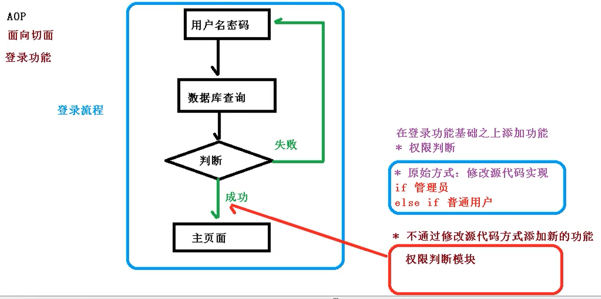
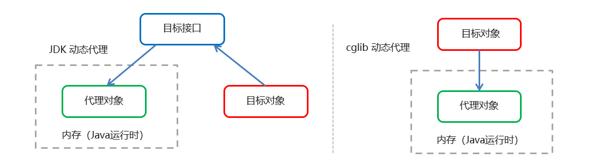
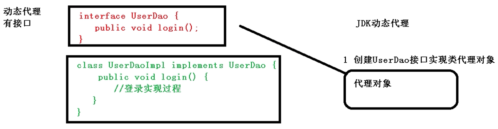
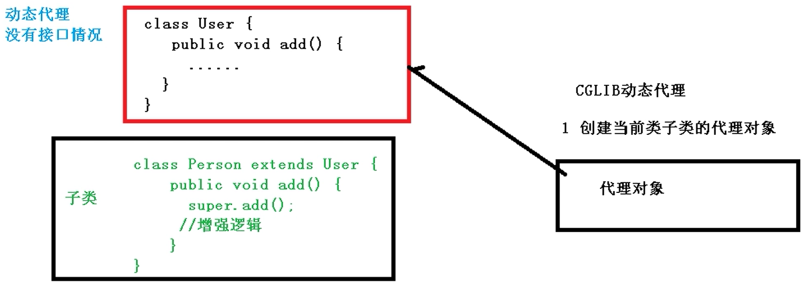
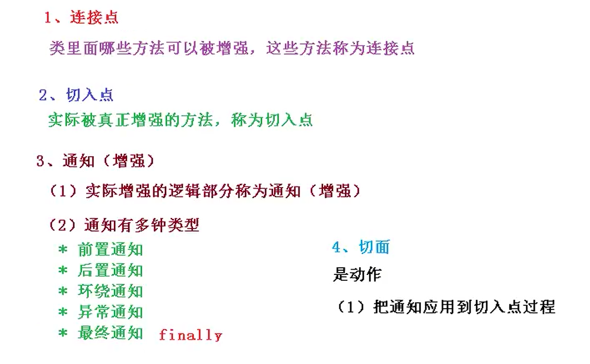
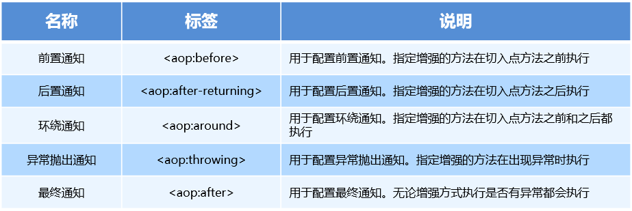
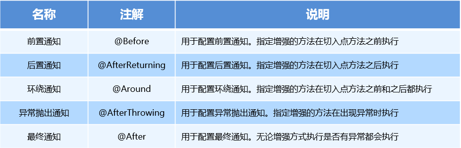

# 四、AOP面向切面编程

## 一、AOP 简介


### 1、什么是 AOP


AOP 为 Aspect Oriented Programming 的缩写，意思为面向切面编程，是通过<font style="color:#E8323C;">预编译方式</font>和<font style="color:#E8323C;">运行期动态代理</font>实现程序功能的统一维护的一种技术。


AOP 是 OOP 的延续，是软件开发中的一个热点，也是Spring框架中的一个重要内容，是函数式编程的一种衍生范型。


+ 利用AOP可以对业务逻辑的各个部分进行隔离，从而使得业务逻辑各部分之间的耦合度降低，提高程序的可重用性，同时提高了开发的效率。


### 2、AOP 的作用及其优势


作用：在程序运行期间，在不修改源码的情况下对方法进行功能增强


优势：减少重复代码，提高开发效率，并且便于维护


+ 使用登录例子说明 AOP





### 3、AOP实现分类
<font style="color:rgb(49, 70, 89);">按照 AOP 框架修改源代码的时机，可以将其分为两类：</font>

+ <font style="color:rgb(49, 70, 89);">静态 AOP 实现， AOP 框架在</font><font style="color:#E8323C;">编译阶段对程序源代码进行修改</font><font style="color:rgb(49, 70, 89);">，生成了静态的 AOP 代理类（生成的 *.class 文件已经被改掉了，需要使用特定的编译器），比如 </font><font style="color:#E8323C;">AspectJ</font><font style="color:rgb(49, 70, 89);">。</font>
+ <font style="color:rgb(49, 70, 89);">动态 AOP 实现， AOP 框架在</font><font style="color:#E8323C;">运行阶段动态生成代理对象</font><font style="color:rgb(49, 70, 89);">（在内存中以 JDK 动态代理，或 CGlib 动态生成 AOP 代理类），如 SpringAOP。</font>

<font style="color:rgb(49, 70, 89);"></font>

<font style="color:rgb(49, 70, 89);"></font>

### 4、Spring AOP 底层实现


实际上，AOP 的底层是通过 Spring 提供的的**<font style="color:#E8323C;">动态代理</font>**技术实现的。


在运行期间，Spring通过动态代理技术动态的生成代理对象，代理对象方法执行时进行增强功能的介入，再去调用目标对象的方法，从而完成功能的增强。


AOP 底层使用动态代理 	有两种情况动态代理

+ JDK 动态代理：<font style="color:#E8323C;">基于接口</font>
+ cglib 动态代理：<font style="color:#E8323C;">基于父类</font>





#### JDK 动态代理


**<font style="color:#E8323C;">创建接口实现类的代理对象，增强类的方法</font>**





+  使用 Proxy 类里面的方法创建代理对象 
+  调用 newProxyInstance 方法，有三个参数： 
    - 类加载器
    - 增强方法所在的类，这个类实现的接口，支持多个接口
    - <font style="color:#E8323C;">实现 InvocationHandler 接口</font>，创建代理对象，写增强的部分


①目标类接口，定义方法


```java
public interface UserDao {

    int add(int a, int b);

}
```


②目标类（接口实现类，实现方法）


```java
public class UserDaoImpl implements UserDao {

    @Override
    public int add(int a, int b) {
        return a + b;
    }
    
}
```


③ <font style="color:#E8323C;">实现 InvocationHandler 接口</font>，创建代理对象，写增强的部分

```java
//增强对象
public class UserDaoProxy implements InvocationHandler {

    //创建的是谁的代理对象，把谁传递过来,即传入被代理的对象
    private Object obj;

    public UserDaoProxy(Object obj) {
        this.obj = obj;
    }


    // 对象一创建，方法就会被调用 增强的逻辑
    // 第一个参数proxy就是被代理的对象，invoke方法会在被生成的类中被调用。
    // 第二个参数就是方法，
    // 第三个参数就是传递的参数
    @Override
    public Object invoke(Object proxy, Method method, Object[] args) throws Throwable {

        //方法之前
        this.before(method, args);

        //被增强的方法执行 已经传进来obj了，用method.invoke传对象和参数执行方法
        Object res = method.invoke(obj, args);
        //这个invoke方法的两个参数：调用method的对象，method的参数

        //方法之后
        this.afterReturning();

        return res;
    }


    //前置增强
    public void before(Method method, Object[] args) {
        System.out.println("方法之前执行...." + method.getName() + " :传递的参数..." + Arrays.toString(args));
    }

    //后置增强
    public void afterReturning() {
        System.out.println("方法之后执行...." + obj);
    }

}
```


④  调用代理对象的方法测试


```java
public class JDKProxy {

    public static void main(String[] args) {

        //目标对象
        UserDaoImpl target = new UserDaoImpl();

        //动态生成的代理对象 使用 Proxy 类创建
        UserDao proxy = (UserDao) Proxy.newProxyInstance(
                target.getClass().getClassLoader(),//目标对象类加载器
                target.getClass().getInterfaces(), //目标对象相同的接口字节码对象数组
                new UserDaoProxy(target));//代理对象

        //调用代理对象的方法
        int add = proxy.add(1, 2);
        System.out.println(add);

    }

}
```


#### cglib 动态代理
CgLib<font style="color:rgb(77, 77, 77);">动态代理的原理是对指定的业务类生成一个子类，</font><font style="color:#E8323C;">并覆盖其中的业务方法来实现代理</font>

CGLib的实现原理是，在原始目标类的基础上进行继承，然后重写每一个方法进行增强

**<font style="color:#E8323C;">创建子类的代理对象，增强类的方法</font>**





①目标类


```java
public class UserDao {

    public int add(int a, int b) {
        return a + b;
    }

}
```


②**<font style="color:#E8323C;"> </font>**<font style="color:#E8323C;">实现 MethodInterceptor 接口</font>，创建代理对象，写增强的部分


```java
//增强对象
public class UserDaoProxy implements MethodInterceptor {

    //创建的是谁的代理对象，把谁传递过来,即传入被代理的对象
    private Object obj;

    public UserDaoProxy(Object obj) {
        this.obj = obj;
    }

    //前置增强
    public void before(Method method, Object[] args) {
        System.out.println("方法之前执行...." + method.getName() + " :传递的参数..." + Arrays.toString(args));
    }

    //后置增强
    public void afterReturning() {
        System.out.println("方法之后执行...." + obj);
    }

    @Override
    public Object intercept(Object o, Method method, Object[] objects, MethodProxy methodProxy) throws Throwable {
        //执行前置
        this.before(method,objects);

        //被增强的方法执行 已经传进来obj了，用method.invoke传对象和参数执行方法
        Object res = method.invoke(obj, objects);
        //这个invoke方法的两个参数：调用method的对象，method的参数

        //执行后置
        this.afterReturning();

        return res;
    }
}
```


③调用代理对象的方法测试


```java
public class JDKProxy {

    public static void main(String[] args) {

        //目标对象
        UserDao userDao = new UserDao();

        //动态生成的代理对象 基于cglib

        //1、创建增强器
        Enhancer enhancer = new Enhancer();
        //2、设置父类(目标)
        enhancer.setSuperclass(UserDao.class);
        //3、设置回调
        enhancer.setCallback(new UserDaoProxy(userDao));
        //4、创建代理对象
        UserDao proxy = (UserDao) enhancer.create();

        //调用代理对象的方法
        int add = proxy.add(2, 3);
        System.out.println(add);

    }

}
```


### 5、AOP 相关概念


Spring 的 AOP 实现底层就是对上面的动态代理的代码进行了封装，封装后我们只需要对需要关注的部分进行代码编写，并<font style="color:#E8323C;">通过配置的方式完成指定目标的方法增强。</font>


在正式讲解 AOP 的操作之前，我们必须理解 AOP 的相关术语，常用的术语如下：


#### Target（目标对象）


<font style="color:rgb(51,51,51);">被一个或者多个切面（</font><font style="color:rgb(51,51,51);">aspect</font><font style="color:rgb(51,51,51);">）所通知（</font><font style="color:rgb(51,51,51);">advise</font><font style="color:rgb(51,51,51);">）的对象。 </font>

<font style="color:rgb(51,51,51);">它通常是一个代理对象。也指被通知（advised） 对象。 </font>


#### Proxy （代理）


一个类被 AOP 织入增强后，就产生一个结果代理类


<font style="color:#E8323C;">代理是通知目标对象后创建的对象</font><font style="color:rgb(51,51,51);">。从客户端的角度看，代理对象和目标对象是一样的。</font>

<font style="color:rgb(51,51,51);"></font>

#### <font style="color:#E8323C;">Join point（连接点）</font>


所谓连接点是指<font style="color:#E8323C;">那些被拦截到的点</font>。在spring中，这些点指的是方法，因为spring只支持方法类型的连接点


<font style="color:rgb(51,51,51);">在</font><font style="color:rgb(51,51,51);">Spring AOP</font><font style="color:rgb(51,51,51);">中，一个连接点 总是 代表一个方法的执行。 </font>

<font style="color:rgb(51,51,51);">连接点代表一个应用程序的某个位置，在这个位置我们可以插入一个 AOP 切面，它实际上是个应用程序执行 Spring AOP 的位置。</font>


#### <font style="color:#E8323C;">Pointcut（切入点）</font>


所谓切入点是指我们<font style="color:#E8323C;">要对哪些 Join point 进行拦截的定义</font>


<font style="color:rgb(51,51,51);">切入点是一个或一组连接点，通知将在这些位置执行。我们通常</font><font style="color:#E8323C;">使用明确的类和方法名称，或是利用正则表达式</font><font style="color:rgb(51,51,51);">定义所匹配的类和方法名称来指定这些切点。</font>

<font style="color:rgb(51,51,51);"></font>

#### <font style="color:#E8323C;">Advice（通知/增强）</font>


所谓通知是指<font style="color:#E8323C;">拦截到 Join point 之后所要做的事情就是通知</font>


#### <font style="color:#E8323C;">Aspect（切面）</font>


<font style="color:rgb(51,51,51);">切面是</font><font style="color:#E8323C;">通知和切点的结合。</font>

<font style="color:rgb(51,51,51);"></font>

<font style="color:rgb(51,51,51);">通知和切点共同定义了切面的全部内容。 在 Spring AOP中，切面可以使用通用类（基于模式的风格） 或者在普通类中以 </font><font style="color:#E8323C;">@AspectJ </font><font style="color:rgb(51,51,51);">注解来实现。</font>


#### <font style="color:#E8323C;">Weaving（织入）</font>


<font style="color:rgb(51,51,51);">织入是</font><font style="color:#E8323C;">把切面应用到目标对象并创建新的代理对象的过程。</font>

<font style="color:rgb(51,51,51);"></font>

<font style="color:rgb(51,51,51);">在目标对象的生命周期里有多少个点可以进行织入： </font>

+ <font style="color:rgb(51,51,51);">编译期：切面在目标类</font><font style="color:#E8323C;">编译时</font><font style="color:rgb(51,51,51);">被织入。</font><font style="color:#DF2A3F;">AspectJ</font><font style="color:rgb(51,51,51);">的织入编译器是以这种方式织入切面的。 </font>
+ <font style="color:rgb(51,51,51);">类加载期：切面在目标类</font><font style="color:#E8323C;">加载到JVM时</font><font style="color:rgb(51,51,51);">被织入。需要特殊的类加载器，它可以在目标类被引入应用之前增强该目标类的字节码。</font><font style="color:#E8323C;">AspectJ5</font><font style="color:rgb(51,51,51);">的加载时织入就支持以这种方式织入切面。 </font>
+ <font style="color:rgb(51,51,51);">运行期：切面在应用</font><font style="color:#E8323C;">运行的某个时刻</font><font style="color:rgb(51,51,51);">被织入。一般情况下，在织入切面时，AOP容器会为目标对象动态地创建一个代理对象。</font><font style="color:#DF2A3F;">SpringAOP</font><font style="color:rgb(51,51,51);">就是以这种方式织入切面。</font>


**<font style="color:#DF2A3F;">spring采用动态代理织入，而AspectJ采用编译期织入和类装载期织入</font>**





### 6、AOP 开发明确的事项


#### 需要编写的内容


+  编写核心业务代码（目标类的目标方法） 
+  编写切面类，切面类中有通知（增强功能方法） 
+  在配置文件中，配置织入关系，即 将哪些通知与哪些连接点进行结合 


#### AOP 技术实现的内容


Spring 框架监控切入点方法的执行。

一旦监控到切入点方法被运行，使用代理机制，动态创建目标对象的代理对象，

根据通知类别，在代理对象的对应位置，将通知对应的功能织入，完成完整的代码逻辑运行。


#### AOP 底层使用哪种代理方式


在 spring 中，框架会根据<font style="color:#DF2A3F;">目标类是否实现了接口</font>来决定采用哪种动态代理的方式。


### 7、AspectJ
<font style="color:rgb(64, 64, 64);">最大区别在于---Spring AOP是运行时增强，而AspectJ是编译时增强。</font>


曾经以为AspectJ是Spring AOP一部分，是因为Spring AOP使用了AspectJ的<font style="color:#E8323C;">Annotation</font>。使用了Aspect来定义切面，使用Pointcut来定义切入点，使用Advice来定义增强处理。

虽然使用了Aspect的Annotation，但是<font style="color:#E8323C;">并没有使用它的编译器和织入器</font>。其实现原理是JDK 动态代理，在运行时生成代理类。


## 二、基于 XML 的 AOP 开发


### 1、快速入门


#### 导入 AOP 相关坐标


```xml
<!--导入spring的context坐标，context依赖aop-->
<dependency>
    <groupId>org.springframework</groupId>
    <artifactId>spring-context</artifactId>
    <version>5.0.5.RELEASE</version>
</dependency>

<!-- aspectj的织入 -->
<dependency>
    <groupId>org.aspectj</groupId>
    <artifactId>aspectjweaver</artifactId>
    <version>1.8.13</version>
</dependency>
```


#### 创建目标接口和目标类（内部有切点）


```java
public interface TargetInterface {

    public void save();

}
```


```java
public class Target implements TargetInterface {

    @Override
    public void save() {
        System.out.println("save running……");
    }

}
```


#### 创建切面类（内部有增强方法）


```java
public class MyAspect {

    //前置增强方法
    public void before(){
        System.out.println("前置增强……");
    }

}
```


#### 将目标类和切面类的对象创建权交给 spring


```xml
<!--    配置目标对象-->
<bean id="target" class="com.itheima.aop.Target" />

<!--    配置切面对象-->
<bean id="myAspect" class="com.itheima.aop.MyAspect" />
```


#### 在 applicationContext.xml 中配置织入关系


导入aop命名空间


```xml
<beans xmlns="http://www.springframework.org/schema/beans"
       xmlns:xsi="http://www.w3.org/2001/XMLSchema-instance"
       xmlns:context="http://www.springframework.org/schema/context"
       xmlns:aop="http://www.springframework.org/schema/aop"
       xsi:schemaLocation="
        http://www.springframework.org/schema/context
        http://www.springframework.org/schema/context/spring-context.xsd
        http://www.springframework.org/schema/aop
        http://www.springframework.org/schema/aop/spring-aop.xsd
        http://www.springframework.org/schema/beans
        http://www.springframework.org/schema/beans/spring-beans.xsd">

</beans>
```


配置切点表达式和前置增强的织入关系


```xml
<!--    配置织入：告诉spring框架 哪些方法(切点)需要进行哪些增强(前置、后置)-->
<aop:config>
    <!--引用myAspect的Bean为切面对象-->
    <aop:aspect ref="myAspect">
        <!--            切面：切点+通知-->
        <aop:before method="before" pointcut="execution(public void com.itheima.aop.Target.save())"></aop:before>
    </aop:aspect>
</aop:config>


或者

<!--    配置AOP增强-->
<aop:config>
    <!--        切入点-->
    <aop:pointcut id="p" expression="execution(public void com.itheima.aop.Target.save())"/>
    <!--        配置切面-->
    <aop:aspect ref="myAspect">
        <!--            增强作用在具体的方法上-->
        <aop:before method="before" pointcut-ref="p"></aop:before>
    </aop:aspect>
</aop:config>
```


#### 测试


```java
@RunWith(SpringJUnit4ClassRunner.class)
@ContextConfiguration("classpath:applicationContext.xml")
public class AopTest {

    @Autowired
    private TargetInterface target;

    @Test
    public void test1(){
        target.save();
    }
}
```


### 2、XML 配置 AOP 详解


#### 切入点表达式


+  作用：知道对哪个类里面的哪个方法进行增强 


```java
execution([权限修饰符] 返回值类型 包名.类名.方法名(参数列表))
```

+ 访问修饰符可以省略
+ 返回值类型、包名、类名、方法名  可以使用星号* 代表任意
+ 包名与类名之间 
    - 一个点 . 代表当前包下的类，
    - 两个点 .. 表示当前包及其子包下的类
+ 参数列表可以使用两个点 .. 表示任意个数，任意类型的参数列表


例如：

```xml
execution(public void com.itheima.aop.Target.method())	

execution(void com.itheima.aop.Target.*(..))

execution(* com.itheima.aop.*.*(..))

execution(* com.itheima.aop..*.*(..))

execution(* *..*.*(..))

举例 1：对 com.atguigu.dao.BookDao 类里面的 add 进行增强
execution(* com.atguigu.dao.BookDao.add(..))

举例 2：对 com.atguigu.dao.BookDao 类里面的所有的方法进行增强
execution(* com.atguigu.dao.BookDao.* (..))

举例 3：对 com.atguigu.dao 包里面所有类，类里面所有方法进行增强
execution(* com.atguigu.dao.*.* (..))
```


#### 通知的类型


通知的配置语法：


```xml
<aop:通知类型 method="切面类中方法名" pointcut="切点表达式"></aop:通知类型>
```





```java
public class MyAspect {

    public void before() {
        System.out.println("前置增强……");
    }


    public void afterRunning() {
        System.out.println("后置增强");
    }

    //ProceedingJoinPoint：正在执行的连接点----切点
    public Object around(ProceedingJoinPoint pjp) throws Throwable {
        System.out.println("环绕前通知");
        //切点方法
        Object proceed = pjp.proceed();

        System.out.println("环绕后通知");

        return proceed;
    }

    public void afterThrowing(){
        System.out.println("异常抛出增强");
    }

    public void after(){
        System.out.println("最终增强");
    }
}
```


```xml
<!--    配置织入：告诉spring框架 哪些方法(切点)需要进行哪些增强(前置、后置)-->
<aop:config>
    <!--引用myAspect的Bean为切面对象-->
    <aop:aspect ref="myAspect">
        <!--            切面：切点+通知-->
        <aop:before method="before" pointcut="execution(* com.itheima.aop.*.*(..))" />
        <aop:after-returning method="afterRunning" pointcut="execution(* com.itheima.aop.*.*(..))" />
        <aop:around method="around" pointcut="execution(* com.itheima.aop.*.*(..))" />
        <aop:after-throwing method="afterThrowing" pointcut="execution(* com.itheima.aop.*.*(..))" />
        <aop:after method="after" pointcut="execution(* com.itheima.aop.*.*(..))" />
    </aop:aspect>
</aop:config>
```


#### 切点表达式的抽取


当多个增强的切点表达式相同时，可以将切点表达式进行抽取，在增强中<font style="color:#E8323C;">使用 pointcut-ref 属性代替 pointcut 属性</font>来引用抽取后的切点表达式。


```xml
<!--    配置织入：告诉spring框架 哪些方法(切点)需要进行哪些增强(前置、后置)-->
<aop:config>
    <!--引用myAspect的Bean为切面对象-->
    <aop:aspect ref="myAspect">
        <!--            抽取切点表达式-->
        <aop:pointcut id="myPointcut" expression="execution(* com.itheima.aop.*.*(..))"/>
        <!--            切面：切点+通知-->
        <aop:before method="before" pointcut-ref="myPointcut"/>
        <aop:after-returning method="afterRunning" pointcut-ref="myPointcut"/>
        <aop:around method="around" pointcut-ref="myPointcut"/>
        <aop:after-throwing method="afterThrowing" pointcut-ref="myPointcut"/>
        <aop:after method="after" pointcut-ref="myPointcut"/>
    </aop:aspect>
</aop:config>
```


## 三、基于注解的 AOP 开发


### 1、快速入门


#### 创建目标接口和目标类（内部有切点）


```java
public interface TargetInterface {

    public void save();

}
```


```java
public class Target implements TargetInterface {

    @Override
    public void save() {
        System.out.println("save running……");
    }

}
```


#### 创建切面类（内部有增强方法)


```java
public class MyAspect {

    public void before() {
        System.out.println("前置增强……");
    }

    public void afterRunning() {
        System.out.println("后置增强");
    }

    //ProceedingJoinPoint：正在执行的连接点----切点
    public Object around(ProceedingJoinPoint pjp) throws Throwable {
        System.out.println("环绕前通知");
        //切点方法
        Object proceed = pjp.proceed();

        System.out.println("环绕后通知");

        return proceed;
    }

    public void afterThrowing(){
        System.out.println("异常抛出增强");
    }

    public void after(){
        System.out.println("最终增强");
    }
}
```


#### 将目标类和切面类的对象创建权交给 spring


```java
@Component("target")
public class Target implements TargetInterface {

    @Override
    public void save() {
        System.out.println("save running……");
    }

}
```


```java
@Component("myAspect")
public class MyAspect {

    public void before() {
        System.out.println("前置增强……");
    }

    public void afterRunning() {
        System.out.println("后置增强");
    }

    //ProceedingJoinPoint：正在执行的连接点----切点
    public Object around(ProceedingJoinPoint pjp) throws Throwable {
        System.out.println("环绕前通知");
        //切点方法
        Object proceed = pjp.proceed();

        System.out.println("环绕后通知");

        return proceed;
    }

    public void afterThrowing(){
        System.out.println("异常抛出增强");
    }

    public void after(){
        System.out.println("最终增强");
    }
}
```


#### 在切面类中使用注解配置织入关系


+ <font style="color:#E8323C;">使用@Aspect标注切面类</font> 
+ 使用@通知注解标注通知方法


```java
@Component("myAspect")
@Aspect	//标注当前MyAspect是一个切面类
public class MyAspect {

    //配置前置通知
    @Before("execution(* com.itheima.anno.*.*(..))")
    public void before() {
        System.out.println("前置增强……");
    }

    //后置通知 （返回通知） 返回结果后通知
    @AfterReturning("execution(* com.itheima.anno.*.*(..))")
    public void afterRunning() {
        System.out.println("后置增强");
    }

    //ProceedingJoinPoint：正在执行的连接点----切点
    @Around("execution(* com.itheima.anno.*.*(..))")
    public Object around(ProceedingJoinPoint pjp) throws Throwable {
        System.out.println("环绕前通知");
        //切点方法
        Object proceed = pjp.proceed();

        System.out.println("环绕后通知");

        return proceed;
    }

    //异常通知
    @AfterThrowing("execution(* com.itheima.anno.*.*(..))")
    public void afterThrowing(){
        System.out.println("异常抛出增强");
    }

    //最终通知 始终都会执行
    @After("execution(* com.itheima.anno.*.*(..))")
    public void after(){
        System.out.println("最终增强");
    }
}
```


#### 在配置文件中开启组件扫描和 AOP 的自动代理


在配置文件中配置aop自动代理


```xml
<aop:aspectj-autoproxy/>
```


```xml
<beans xmlns="http://www.springframework.org/schema/beans"
       xmlns:xsi="http://www.w3.org/2001/XMLSchema-instance"
       xmlns:context="http://www.springframework.org/schema/context"
       xmlns:aop="http://www.springframework.org/schema/aop"
       xsi:schemaLocation="http://www.springframework.org/schema/beans http://www.springframework.org/schema/beans/spring-beans.xsd
http://www.springframework.org/schema/context http://www.springframework.org/schema/context/spring-context.xsd
http://www.springframework.org/schema/aop http://www.springframework.org/schema/aop/spring-aop.xsd">
    
<!--    开启注解扫描-->
<context:component-scan base-package="com.itheima.anno"/>

<!--    aop自动代理 开启Aspect生成代理对象-->
<aop:aspectj-autoproxy/>
```


#### 测试


```java
@RunWith(SpringJUnit4ClassRunner.class)
@ContextConfiguration("classpath:applicationContext-anno.xml")
public class AnnoTest {

    @Autowired
    private TargetInterface target;

    @Test
    public void test(){
        target.save();
    }
}
```


### 2、注解配置 AOP 详解


#### 注解通知的类型


通知的配置语法：


```java
@通知注解("切点表达式")
```





#### 切点表达式的抽取


同 xml配置aop 一样，我们可以将切点表达式抽取。


抽取方式是在切面内定义方法，在该方法上使用@Pointcut注解定义切点表达式，然后再在增强注解中进行引用。


```java
@Component("myAspect")
@Aspect	//标注当前MyAspect是一个切面类
public class MyAspect {

    //抽取切点表达式
    @Pointcut("execution(* com.itheima.anno.*.*(..))")
    public void pointcut(){}

    //配置前置通知
    @Before("MyAspect.pointcut()")
    public void before() {
        System.out.println("前置增强……");
    }

    @AfterReturning("MyAspect.pointcut()")
    public void afterRunning() {
        System.out.println("后置增强");
    }

    //ProceedingJoinPoint：正在执行的连接点----切点
    @Around("pointcut()")
    public Object around(ProceedingJoinPoint pjp) throws Throwable {
        System.out.println("环绕前通知");
        //切点方法
        Object proceed = pjp.proceed();

        System.out.println("环绕后通知");

        return proceed;
    }

    @AfterThrowing("pointcut()")
    public void afterThrowing(){
        System.out.println("异常抛出增强");
    }

    @After("pointcut()")
    public void after(){
        System.out.println("最终增强");
    }
}
```


### 3、设置增强类优先级


**<font style="color:#E8323C;">有多个增强类对同一个方法进行增强，设置增强类优先级</font>**


（1）在增强类上面添加注解 @Order(数字类型值)，数字类型值<font style="color:#E8323C;">越小优先级越高</font>


```java
@Component
@Aspect //生成代理对象
@Order(1)
public class PersonProxy {

}

@Component
@Aspect //生成代理对象
@Order(3)
public class UserProxy {

}
```


### 4、完全注解开发


（1）创建配置类，不需要创建 xml 配置文件

<font style="color:rgb(77, 77, 77);">@EnableAspectJAutoProxy(proxyTargetClass = true, exposeProxy = true)解决同类方法调用时异步和事务不生效：</font>

+ <font style="color:rgb(51, 51, 51);">第一个是控制aop的具体实现方式，为true的话使用cglib，为false的话使用java的Proxy，默认为false。</font>
+ <font style="color:rgb(51, 51, 51);">第二个参数控制代理的暴露方式，解决内部调用不能使用代理的场景，默认为false。</font>

```java
@Configuration
@ComponentScan(basePackages = {"com.atguigu.spring5"})
@EnableAspectJAutoProxy(proxyTargetClass = true)
public class ConfigAop {
}
```


（2）编写测试类


```java
@Test
public void testAopAnno() {
    ApplicationContext context = new AnnotationConfigApplicationContext(ConfigAop.class);
    User user = context.getBean("user", User.class);
    user.add();
}
```


> 更新: 2023-06-13 14:31:36  
> 原文: <https://www.yuque.com/like321/kwpbuz/fw7h67>