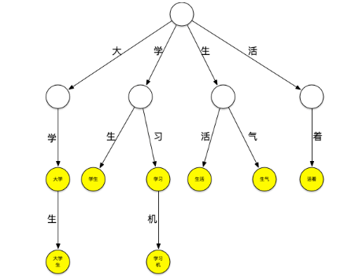
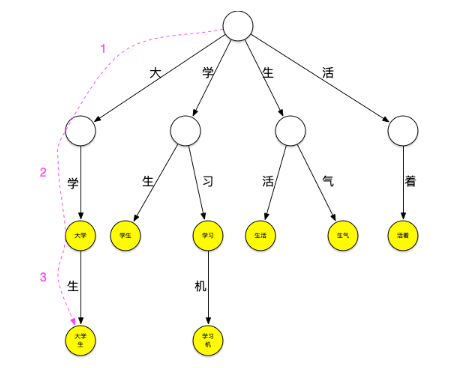
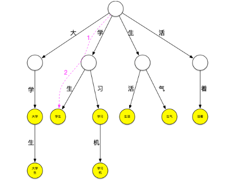
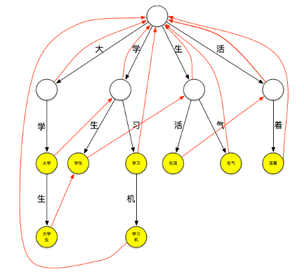
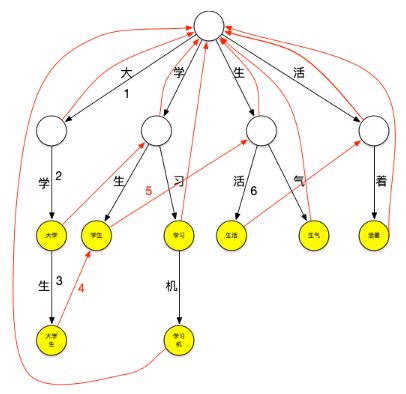

# 2_中文分词器原理

### 方法1

分词器的原理本质上是词典分词。在现有内存中初始化一个词典，然后在分词过程中挨个读取字符和字典中的字符相匹配，把文档中所有词语拆分出来的过程。

### 方法2 字典树

Trie树，是一种树形结构，是一种哈希树的变种。典型应用是用于统计，排序和保存大量的字符串（但不仅限于字符串），所以经常被搜索引擎系统用于文本词频统计。它的优点是：利用字符串的公共前缀来减少查询时间，最大限度地减少无谓的字符串比较，查询效率比哈希树高。

下面一个存放了[大学、大学生、学习、学习机、学生、生气、生活、活着]这个词典的trie树：  

它可以看作是用每个词第n个字做第n到第n+1层节点间路径哈希值的哈希树，每个节点是实际要存放的词。

现在用这个树来进行“大学生活”的匹配。依然从“大”字开始匹配，如下图所示：从根节点开始，沿最左边的路径匹配到了大字，沿着“大”节点可以匹配到“大学”,继续匹配则可以匹配到“大学生”，之后字典中再没有以“大”字开头的词，至此已经匹配到了[大学、大学生]第一轮匹配结束

继续匹配“学”字开头的词，方法同上步，可匹配出[学生]

继续匹配“生”和“活”字开头的词，这样“大学生活”在词典中的词全部被查出来。

可以看到，以匹配“大”字开头的词为例，第一种匹配方式需要在词典中查询是否包含“大”、“大学”、“大学”、“大学生活”，共4次查询，而使用trie树查询时当找到“大学生”这个词之后就停止了该轮匹配，减少了匹配的次数，当要匹配的句子越长，这种性能优势就越明显。

### 失败指针

再来看一下上面的匹配过程，在匹配“大学生”这个词之后，由于词典中不存在其它以“大”字开头的词，本轮结束，将继续匹配以“学”字开头的词，这时，需要再回到根节点继续匹配，如果这个时候“大学生”节点有个指针可以直指向“学生”节点，就可以减少一次查询，类似地，当匹配完“学生”之后如果“学生”节点有个指针可以指向“生活”节点，就又可以减少一次查询。这种当下一层节点无法匹配需要进行跳转的指针就是失败指针，创建好失败指针的树看起来如下图：  

图上红色的线就是失败指针，指向的是当下层节点无法匹配时应该跳转到哪个节点继续进行匹配

失败指针的创建过程通常为：

+  创建好trie树。 
+  BFS每一个节点(不能使用DFS，因为每一层节点的失败指针在创建时要确保上一层节点的失败指针全部创建完成)。 
+  根节点的子节点的失败指针指向根节点。 
+  其它节点查找其父节点的失败指针指向的节点的子节点是否有和该节点字相同的节点，如果有则失败指针指向该节点，如果没有则重复刚才的过程直至找到字相同的节点或根节点。 

查询过程如下：

> 更新: 2024-11-12 14:57:28  
> 原文: <https://www.yuque.com/like321/eu6kgy/vdw3t7>