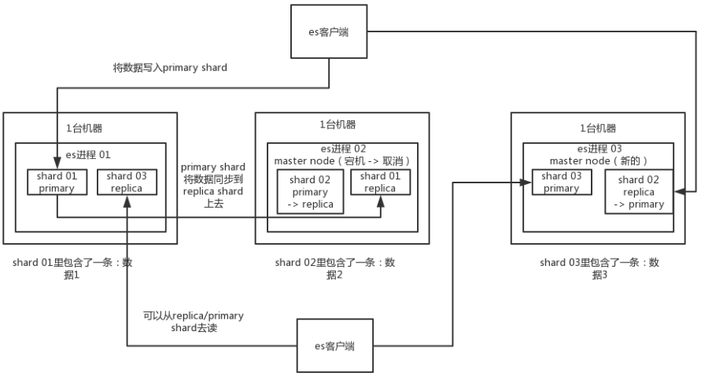

# 3_ES的分布式架构原理能说一下么？

## ES的分布式架构原理能说一下么？

elasticsearch设计的理念就是分布式搜索引擎，底层其实还是基于lucene的。

核心思想就是在多台机器上启动多个es进程实例，组成了一个es集群。

es中存储数据的基本单位是索引，比如说你现在要在es中存储一些订单数据，你就应该在es中创建一个索引，order_idx，所有的订单数据就都写到这个索引里面去，一个索引差不多就是相当于是mysql里的一张表。index -> type -> mapping -> document -> field。

index：mysql里的一张表

type：没法跟mysql里去对比，一个index里可以有多个type，每个type的字段都是差不多的，但是有一些略微的差别。

好比说，有一个index，是订单index，里面专门是放订单数据的。就好比说你在mysql中建表，有些订单是实物商品的订单，就好比说一件衣服，一双鞋子；有些订单是虚拟商品的订单，就好比说游戏点卡，话费充值。就两种订单大部分字段是一样的，但是少部分字段可能有略微的一些差别。

所以就会在订单index里，建两个type，一个是实物商品订单type，一个是虚拟商品订单type，这两个type大部分字段是一样的，少部分字段是不一样的。

很多情况下，一个index里可能就一个type，但是确实如果说是一个index里有多个type的情况，你可以认为index是一个类别的表，具体的每个type代表了具体的一个mysql中的表

每个type有一个mapping，如果你认为一个type是一个具体的一个表，index代表了多个type的同属于的一个类型，mapping就是这个type的表结构定义，你在mysql中创建一个表，肯定是要定义表结构的，里面有哪些字段，每个字段是什么类型。。。

mapping就代表了这个type的表结构的定义，定义了这个type中每个字段名称，字段是什么类型的，然后还有这个字段的各种配置

实际上你往index里的一个type里面写的一条数据，叫做一条document，一条document就代表了mysql中某个表里的一行给，每个document有多个field，每个field就代表了这个document中的一个字段的值

接着你搞一个索引，这个索引可以拆分成多个shard，每个shard存储部分数据。

接着就是这个shard的数据实际是有多个备份，就是说每个shard都有一个primary shard，负责写入数据，但是还有几个replica shard。primary shard写入数据之后，会将数据同步到其他几个replica shard上去。

通过这个replica的方案，每个shard的数据都有多个备份，如果某个机器宕机了，没关系啊，还有别的数据副本在别的机器上呢。高可用了吧。

es集群多个节点，会自动选举一个节点为master节点，这个master节点其实就是干一些管理的工作的，比如维护索引元数据拉，负责切换primary shard和replica shard身份拉，之类的。

要是master节点宕机了，那么会重新选举一个节点为master节点。

如果是非master节点宕机了，那么会由master节点，让那个宕机节点上的primary shard的身份转移到其他机器上的replica shard。急着你要是修复了那个宕机机器，重启了之后，master节点会控制将缺失的replica shard分配过去，同步后续修改的数据之类的，让集群恢复正常。

其实上述就是elasticsearch作为一个分布式搜索引擎最基本的一个架构设计

> 更新: 2024-11-12 15:01:20  
> 原文: <https://www.yuque.com/like321/eu6kgy/lfqo4q>