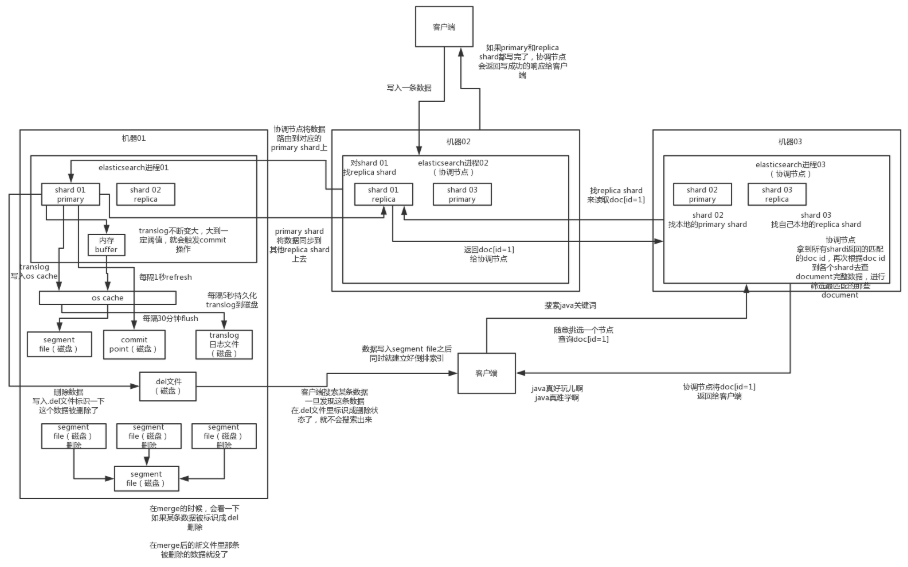

# 4_ES查询和读取数据的工作原理是什么？

## ES查询和读取数据的工作原理是什么？

（1）es写数据过程

1）客户端选择一个node发送请求过去，这个node就是coordinating node（协调节点）

2）coordinating node，对document进行路由，将请求转发给对应的node（有primary shard）

3）实际的node上的primary shard处理请求，然后将数据同步到replica node

4）coordinating node，如果发现primary node和所有replica node都搞定之后，就返回响应结果给客户端

（2）es读数据过程

查询，GET某一条数据，写入了某个document，这个document会自动给你分配一个全局唯一的id，doc id，同时也是根据doc id进行hash路由到对应的primary shard上面去。也可以手动指定doc id，比如用订单id，用户id。

你可以通过doc id来查询，会根据doc id进行hash，判断出来当时把doc id分配到了哪个shard上面去，从那个shard去查询

1）客户端发送请求到任意一个node，成为coordinate node

2）coordinate node对document进行路由，将请求转发到对应的node，此时会使用round-robin随机轮询算法，在primary shard以及其所有replica中随机选择一个，让读请求负载均衡

3）接收请求的node返回document给coordinate node

4）coordinate node返回document给客户端

（3）es搜索数据过程

es最强大的是做全文检索，就是比如你有三条数据

java真好玩儿啊

java好难学啊

j2ee特别牛

你根据java关键词来搜索，将包含java的document给搜索出来

es就会给你返回：java真好玩儿啊，java好难学啊

1）客户端发送请求到一个coordinate node

2）协调节点将搜索请求转发到所有的shard对应的primary shard或replica shard也可以

3）query phase：每个shard将自己的搜索结果（其实就是一些doc id），返回给协调节点，由协调节点进行数据的合并、排序、分页等操作，产出最终结果

4）fetch phase：接着由协调节点，根据doc id去各个节点上拉取实际的document数据，最终返回给客户端

（4）搜索的底层原理，倒排索引，画图说明传统数据库和倒排索引的区别

（5）写数据底层原理

1）先写入buffer，在buffer里的时候数据是搜索不到的；同时将数据写入translog日志文件

2）如果buffer快满了，或者到一定时间，就会将buffer数据refresh到一个新的segment file中，但是此时数据不是直接进入segment file的磁盘文件的，而是先进入os cache的。这个过程就是refresh。

每隔1秒钟，es将buffer中的数据写入一个新的segment file，每秒钟会产生一个新的磁盘文件，segment file，这个segment file中就存储最近1秒内buffer中写入的数据

但是如果buffer里面此时没有数据，那当然不会执行refresh操作咯，每秒创建换一个空的segment file，如果buffer里面有数据，默认1秒钟执行一次refresh操作，刷入一个新的segment file中

操作系统里面，磁盘文件其实都有一个东西，叫做os cache，操作系统缓存，就是说数据写入磁盘文件之前，会先进入os cache，先进入操作系统级别的一个内存缓存中去

只要buffer中的数据被refresh操作，刷入os cache中，就代表这个数据就可以被搜索到了

为什么叫es是准实时的？NRT，near real-time，准实时。默认是每隔1秒refresh一次的，所以es是准实时的，因为写入的数据1秒之后才能被看到。

可以通过es的restful api或者java api，手动执行一次refresh操作，就是手动将buffer中的数据刷入os cache中，让数据立马就可以被搜索到。

只要数据被输入os cache中，buffer就会被清空了，因为不需要保留buffer了，数据在translog里面已经持久化到磁盘去一份

3）只要数据进入os cache，此时就可以让这个segment file的数据对外提供搜索了

4）重复1~3步骤，新的数据不断进入buffer和translog，不断将buffer数据写入一个又一个新的segment file中去，每次refresh完buffer清空，translog保留。随着这个过程推进，translog会变得越来越大。当translog达到一定长度的时候，就会触发commit操作。

buffer中的数据，倒是好，每隔1秒就被刷到os cache中去，然后这个buffer就被清空了。所以说这个buffer的数据始终是可以保持住不会填满es进程的内存的。

每次一条数据写入buffer，同时会写入一条日志到translog日志文件中去，所以这个translog日志文件是不断变大的，当translog日志文件大到一定程度的时候，就会执行commit操作。

5）commit操作发生第一步，就是将buffer中现有数据refresh到os cache中去，清空buffer

6）将一个commit point写入磁盘文件，里面标识着这个commit point对应的所有segment file

7）强行将os cache中目前所有的数据都fsync到磁盘文件中去

translog日志文件的作用是什么？就是在你执行commit操作之前，数据要么是停留在buffer中，要么是停留在os cache中，无论是buffer还是os cache都是内存，一旦这台机器死了，内存中的数据就全丢了。

所以需要将数据对应的操作写入一个专门的日志文件，translog日志文件中，一旦此时机器宕机，再次重启的时候，es会自动读取translog日志文件中的数据，恢复到内存buffer和os cache中去。

commit操作：1、写commit point；2、将os cache数据fsync强刷到磁盘上去；3、清空translog日志文件

8）将现有的translog清空，然后再次重启启用一个translog，此时commit操作完成。默认每隔30分钟会自动执行一次commit，但是如果translog过大，也会触发commit。整个commit的过程，叫做flush操作。我们可以手动执行flush操作就是将所有os cache数据刷到磁盘文件中去。

不叫做commit操作，flush操作。es中的flush操作，就对应着commit的全过程。我们也可以通过es api，手动执行flush操作，手动将os cache中的数据fsync强刷到磁盘上去，记录一个commit point，清空translog日志文件。

9）translog其实也是先写入os cache的，默认每隔5秒刷一次到磁盘中去，所以默认情况下，可能有5秒的数据会仅仅停留在buffer或者translog文件的os cache中，如果此时机器挂了，会丢失5秒钟的数据。但是这样性能比较好，最多丢5秒的数据。也可以将translog设置成每次写操作必须是直接fsync到磁盘，但是性能会差很多。

实际上你在这里，如果面试官没有问你es丢数据的问题，你可以在这里给面试官炫一把，你说，其实es第一是准实时的，数据写入1秒后可以搜索到；可能会丢失数据的，你的数据有5秒的数据，停留在buffer、translog os cache、segment file os cache中，有5秒的数据不在磁盘上，此时如果宕机，会导致5秒的数据丢失。

如果你希望一定不能丢失数据的话，你可以设置个参数，官方文档，百度一下。每次写入一条数据，都是写入buffer，同时写入磁盘上的translog，但是这会导致写性能、写入吞吐量会下降一个数量级。本来一秒钟可以写2000条，现在你一秒钟只能写200条，都有可能。

10）如果是删除操作，commit的时候会生成一个.del文件，里面将某个doc标识为deleted状态，那么搜索的时候根据.del文件就知道这个doc被删除了

11）如果是更新操作，就是将原来的doc标识为deleted状态，然后新写入一条数据

12）buffer每次refresh一次，就会产生一个segment file，所以默认情况下是1秒钟一个segment file，segment file会越来越多，此时会定期执行merge

13）每次merge的时候，会将多个segment file合并成一个，同时这里会将标识为deleted的doc给物理删除掉，然后将新的segment file写入磁盘，这里会写一个commit point，标识所有新的segment file，然后打开segment file供搜索使用，同时删除旧的segment file。

es里的写流程，有4个底层的核心概念，refresh、flush、translog、merge

当segment file多到一定程度的时候，es就会自动触发merge操作，将多个segment file给merge成一个segment file。

> 更新: 2024-11-12 15:01:30  
> 原文: <https://www.yuque.com/like321/eu6kgy/yht6k9>